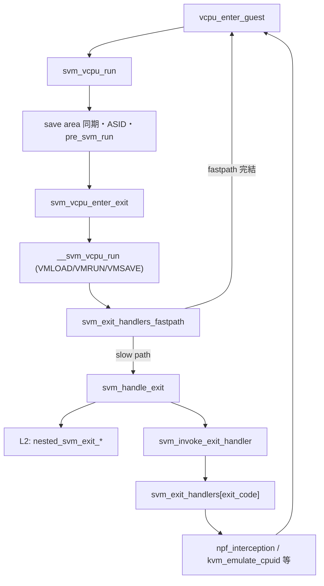

# 第17章 VMCB と `svm_vcpu_run`

> **本章で読むソース**
>
> - [`arch/x86/kvm/svm/svm.c` L1193-L1237](https://github.com/gregkh/linux/blob/v6.18.38/arch/x86/kvm/svm/svm.c#L1193-L1237)
> - [`arch/x86/kvm/svm/svm.c` L1012-L1117](https://github.com/gregkh/linux/blob/v6.18.38/arch/x86/kvm/svm/svm.c#L1012-L1117)
> - [`arch/x86/kvm/svm/svm.c` L4293-L4377](https://github.com/gregkh/linux/blob/v6.18.38/arch/x86/kvm/svm/svm.c#L4293-L4377)
> - [`arch/x86/kvm/svm/svm.c` L4261-L4291](https://github.com/gregkh/linux/blob/v6.18.38/arch/x86/kvm/svm/svm.c#L4261-L4291)
> - [`arch/x86/kvm/svm/vmenter.S` L101-L209](https://github.com/gregkh/linux/blob/v6.18.38/arch/x86/kvm/svm/vmenter.S#L101-L209)
> - [`arch/x86/kvm/svm/svm.c` L4230-L4258](https://github.com/gregkh/linux/blob/v6.18.38/arch/x86/kvm/svm/svm.c#L4230-L4258)
> - [`arch/x86/kvm/svm/svm.c` L3558-L3599](https://github.com/gregkh/linux/blob/v6.18.38/arch/x86/kvm/svm/svm.c#L3558-L3599)
> - [`arch/x86/kvm/svm/svm.c` L3502-L3524](https://github.com/gregkh/linux/blob/v6.18.38/arch/x86/kvm/svm/svm.c#L3502-L3524)
> - [`arch/x86/kvm/svm/svm.c` L3230-L3269](https://github.com/gregkh/linux/blob/v6.18.38/arch/x86/kvm/svm/svm.c#L3230-L3269)

## この章の狙い

AMD SVM が VMCB をどう構築し、`svm_vcpu_run` から `__svm_vcpu_run` でゲストへ入り、VM-exit 後に `svm_handle_exit` が `exit_code` をディスパッチする流れを読む。
control area と save area の役割分担、ASID 管理、exit handler テーブルを押さえる。

## 前提

- [`KVM_RUN` と vCPU 実行ループ](../part01-kvm-core/05-kvm-run-execution-loop.md)
- [シャドウページテーブルと TDP（EPT/NPT）のモデル](../part03-x86-mmu/09-shadow-tdp-model.md)

## vCPU 作成：`svm_vcpu_create`

`KVM_CREATE_VCPU` から `svm_vcpu_create` が呼ばれる。
VMCB01 ページ、MSRPM、SEV と AVIC の per-vCPU 初期化を行い、`svm_switch_vmcb` で vmcb01 をアクティブ VMCB にする。

[`arch/x86/kvm/svm/svm.c` L1193-L1237](https://github.com/gregkh/linux/blob/v6.18.38/arch/x86/kvm/svm/svm.c#L1193-L1237)

```c
static int svm_vcpu_create(struct kvm_vcpu *vcpu)
{
	struct vcpu_svm *svm;
	struct page *vmcb01_page;
	int err;

	BUILD_BUG_ON(offsetof(struct vcpu_svm, vcpu) != 0);
	svm = to_svm(vcpu);

	err = -ENOMEM;
	vmcb01_page = snp_safe_alloc_page();
	if (!vmcb01_page)
		goto out;

	err = sev_vcpu_create(vcpu);
	if (err)
		goto error_free_vmcb_page;

	err = avic_init_vcpu(svm);
	if (err)
		goto error_free_sev;

	svm->msrpm = svm_vcpu_alloc_msrpm();
	if (!svm->msrpm) {
		err = -ENOMEM;
		goto error_free_sev;
	}

	svm->x2avic_msrs_intercepted = true;
	svm->lbr_msrs_intercepted = true;

	svm->vmcb01.ptr = page_address(vmcb01_page);
	svm->vmcb01.pa = __sme_set(page_to_pfn(vmcb01_page) << PAGE_SHIFT);
	svm_switch_vmcb(svm, &svm->vmcb01);

	svm->guest_state_loaded = false;

	return 0;

error_free_sev:
	sev_free_vcpu(vcpu);
error_free_vmcb_page:
	__free_page(vmcb01_page);
out:
	return err;
}
```

## VMCB 初期化：`init_vmcb`

`svm_vcpu_reset` から `init_vmcb` が呼ばれ、control area に intercept ビットマップと IOPM/MSRPM 物理アドレスを設定する。
save area にはセグメントとテーブル記述子の初期値を書き、NPT 有効時は `nested_ctl` に NP_ENABLE を立てる。

[`arch/x86/kvm/svm/svm.c` L1012-L1117](https://github.com/gregkh/linux/blob/v6.18.38/arch/x86/kvm/svm/svm.c#L1012-L1117)

```c
static void init_vmcb(struct kvm_vcpu *vcpu, bool init_event)
{
	struct vcpu_svm *svm = to_svm(vcpu);
	struct vmcb *vmcb = svm->vmcb01.ptr;
	struct vmcb_control_area *control = &vmcb->control;
	struct vmcb_save_area *save = &vmcb->save;

	svm_set_intercept(svm, INTERCEPT_CR0_READ);
	svm_set_intercept(svm, INTERCEPT_CR3_READ);
	svm_set_intercept(svm, INTERCEPT_CR4_READ);
	svm_set_intercept(svm, INTERCEPT_CR0_WRITE);
	svm_set_intercept(svm, INTERCEPT_CR3_WRITE);
	svm_set_intercept(svm, INTERCEPT_CR4_WRITE);
	svm_set_intercept(svm, INTERCEPT_CR8_WRITE);

	set_dr_intercepts(svm);

	set_exception_intercept(svm, PF_VECTOR);
	set_exception_intercept(svm, UD_VECTOR);
	set_exception_intercept(svm, MC_VECTOR);
	set_exception_intercept(svm, AC_VECTOR);
	set_exception_intercept(svm, DB_VECTOR);
	/*
	 * Guest access to VMware backdoor ports could legitimately
	 * trigger #GP because of TSS I/O permission bitmap.
	 * We intercept those #GP and allow access to them anyway
	 * as VMware does.
	 */
	if (enable_vmware_backdoor)
		set_exception_intercept(svm, GP_VECTOR);

	svm_set_intercept(svm, INTERCEPT_INTR);
	svm_set_intercept(svm, INTERCEPT_NMI);

	if (intercept_smi)
		svm_set_intercept(svm, INTERCEPT_SMI);

	svm_set_intercept(svm, INTERCEPT_SELECTIVE_CR0);
	svm_set_intercept(svm, INTERCEPT_RDPMC);
	svm_set_intercept(svm, INTERCEPT_CPUID);
	svm_set_intercept(svm, INTERCEPT_INVD);
	svm_set_intercept(svm, INTERCEPT_INVLPG);
	svm_set_intercept(svm, INTERCEPT_INVLPGA);
	svm_set_intercept(svm, INTERCEPT_IOIO_PROT);
	svm_set_intercept(svm, INTERCEPT_MSR_PROT);
	svm_set_intercept(svm, INTERCEPT_TASK_SWITCH);
	svm_set_intercept(svm, INTERCEPT_SHUTDOWN);
	svm_set_intercept(svm, INTERCEPT_VMRUN);
	svm_set_intercept(svm, INTERCEPT_VMMCALL);
	svm_set_intercept(svm, INTERCEPT_VMLOAD);
	svm_set_intercept(svm, INTERCEPT_VMSAVE);
	svm_set_intercept(svm, INTERCEPT_STGI);
	svm_set_intercept(svm, INTERCEPT_CLGI);
	svm_set_intercept(svm, INTERCEPT_SKINIT);
	svm_set_intercept(svm, INTERCEPT_WBINVD);
	svm_set_intercept(svm, INTERCEPT_XSETBV);
	svm_set_intercept(svm, INTERCEPT_RDPRU);
	svm_set_intercept(svm, INTERCEPT_RSM);

	if (!kvm_mwait_in_guest(vcpu->kvm)) {
		svm_set_intercept(svm, INTERCEPT_MONITOR);
		svm_set_intercept(svm, INTERCEPT_MWAIT);
	}

	if (!kvm_hlt_in_guest(vcpu->kvm)) {
		if (cpu_feature_enabled(X86_FEATURE_IDLE_HLT))
			svm_set_intercept(svm, INTERCEPT_IDLE_HLT);
		else
			svm_set_intercept(svm, INTERCEPT_HLT);
	}

	control->iopm_base_pa = iopm_base;
	control->msrpm_base_pa = __sme_set(__pa(svm->msrpm));
	control->int_ctl = V_INTR_MASKING_MASK;

	init_seg(&save->es);
	init_seg(&save->ss);
	init_seg(&save->ds);
	init_seg(&save->fs);
	init_seg(&save->gs);

	save->cs.selector = 0xf000;
	save->cs.base = 0xffff0000;
	/* Executable/Readable Code Segment */
	save->cs.attrib = SVM_SELECTOR_READ_MASK | SVM_SELECTOR_P_MASK |
		SVM_SELECTOR_S_MASK | SVM_SELECTOR_CODE_MASK;
	save->cs.limit = 0xffff;

	save->gdtr.base = 0;
	save->gdtr.limit = 0xffff;
	save->idtr.base = 0;
	save->idtr.limit = 0xffff;

	init_sys_seg(&save->ldtr, SEG_TYPE_LDT);
	init_sys_seg(&save->tr, SEG_TYPE_BUSY_TSS16);

	if (npt_enabled) {
		/* Setup VMCB for Nested Paging */
		control->nested_ctl |= SVM_NESTED_CTL_NP_ENABLE;
		svm_clr_intercept(svm, INTERCEPT_INVLPG);
		clr_exception_intercept(svm, PF_VECTOR);
		svm_clr_intercept(svm, INTERCEPT_CR3_READ);
		svm_clr_intercept(svm, INTERCEPT_CR3_WRITE);
		save->g_pat = vcpu->arch.pat;
		save->cr3 = 0;
	}
```

VMCB は control area（intercept、exit 情報、イベント注入）と save area（ゲストレジスタ、セグメント、CR/DR）に分かれる。
`vmcb_mark_dirty` は VMCB の clean ビットをクリアし、次の VMRUN でハードウェアが該当フィールド群を再ロードする。
clean ビットが立っているフィールドは VMRUN 時の HW リロードコストを省ける。

## VMRUN 準備：`svm_vcpu_run`

`svm_vcpu_run` は save area へ RAX/RSP/RIP を書き、ASID と CR2 を同期してから `svm_vcpu_enter_exit` へ入る。
`pre_svm_run` は別物理 CPU で前回 VMRUN した場合に `vmcb_mark_all_dirty` で clean ビットをクリアする。
`asid_generation` が不一致なら `new_asid` で ASID を再割り当てする。

[`arch/x86/kvm/svm/svm.c` L4293-L4377](https://github.com/gregkh/linux/blob/v6.18.38/arch/x86/kvm/svm/svm.c#L4293-L4377)

```c
static __no_kcsan fastpath_t svm_vcpu_run(struct kvm_vcpu *vcpu, u64 run_flags)
{
	bool force_immediate_exit = run_flags & KVM_RUN_FORCE_IMMEDIATE_EXIT;
	struct vcpu_svm *svm = to_svm(vcpu);
	bool spec_ctrl_intercepted = msr_write_intercepted(vcpu, MSR_IA32_SPEC_CTRL);

	trace_kvm_entry(vcpu, force_immediate_exit);

	svm->vmcb->save.rax = vcpu->arch.regs[VCPU_REGS_RAX];
	svm->vmcb->save.rsp = vcpu->arch.regs[VCPU_REGS_RSP];
	svm->vmcb->save.rip = vcpu->arch.regs[VCPU_REGS_RIP];

	/*
	 * Disable singlestep if we're injecting an interrupt/exception.
	 * We don't want our modified rflags to be pushed on the stack where
	 * we might not be able to easily reset them if we disabled NMI
	 * singlestep later.
	 */
	if (svm->nmi_singlestep && svm->vmcb->control.event_inj) {
		/*
		 * Event injection happens before external interrupts cause a
		 * vmexit and interrupts are disabled here, so smp_send_reschedule
		 * is enough to force an immediate vmexit.
		 */
		disable_nmi_singlestep(svm);
		force_immediate_exit = true;
	}

	if (force_immediate_exit)
		smp_send_reschedule(vcpu->cpu);

	if (pre_svm_run(vcpu)) {
		vcpu->run->exit_reason = KVM_EXIT_FAIL_ENTRY;
		vcpu->run->fail_entry.hardware_entry_failure_reason = SVM_EXIT_ERR;
		vcpu->run->fail_entry.cpu = vcpu->cpu;
		return EXIT_FASTPATH_EXIT_USERSPACE;
	}

	sync_lapic_to_cr8(vcpu);

	if (unlikely(svm->asid != svm->vmcb->control.asid)) {
		svm->vmcb->control.asid = svm->asid;
		vmcb_mark_dirty(svm->vmcb, VMCB_ASID);
	}
	svm->vmcb->save.cr2 = vcpu->arch.cr2;

	svm_fixup_nested_rips(vcpu);

	svm_hv_update_vp_id(svm->vmcb, vcpu);

	/*
	 * Run with all-zero DR6 unless the guest can write DR6 freely, so that
	 * KVM can get the exact cause of a #DB.  Note, loading guest DR6 from
	 * KVM's snapshot is only necessary when DR accesses won't exit.
	 */
	if (unlikely(run_flags & KVM_RUN_LOAD_GUEST_DR6))
		svm_set_dr6(vcpu, vcpu->arch.dr6);
	else if (likely(!(vcpu->arch.switch_db_regs & KVM_DEBUGREG_WONT_EXIT)))
		svm_set_dr6(vcpu, DR6_ACTIVE_LOW);

	clgi();
	kvm_load_guest_xsave_state(vcpu);

	/*
	 * Hardware only context switches DEBUGCTL if LBR virtualization is
	 * enabled.  Manually load DEBUGCTL if necessary (and restore it after
	 * VM-Exit), as running with the host's DEBUGCTL can negatively affect
	 * guest state and can even be fatal, e.g. due to Bus Lock Detect.
	 */
	if (!(svm->vmcb->control.virt_ext & LBR_CTL_ENABLE_MASK) &&
	    vcpu->arch.host_debugctl != svm->vmcb->save.dbgctl)
		update_debugctlmsr(svm->vmcb->save.dbgctl);

	kvm_wait_lapic_expire(vcpu);

	/*
	 * If this vCPU has touched SPEC_CTRL, restore the guest's value if
	 * it's non-zero. Since vmentry is serialising on affected CPUs, there
	 * is no need to worry about the conditional branch over the wrmsr
	 * being speculatively taken.
	 */
	if (!static_cpu_has(X86_FEATURE_V_SPEC_CTRL))
		x86_spec_ctrl_set_guest(svm->virt_spec_ctrl);

	svm_vcpu_enter_exit(vcpu, spec_ctrl_intercepted);
```

VM-exit 後は save area からレジスタを読み戻し、`svm_exit_handlers_fastpath` で一部 exit を完結させる。

## `.noinstr` 境界：`svm_vcpu_enter_exit` と `__svm_vcpu_run`

`svm_vcpu_enter_exit` は `guest_state_enter_irqoff` のあと `__svm_vcpu_run` を呼ぶ。
VMLOAD/VMSAVE は常に vmcb01 を使い、nested 切替時の状態コピーを省略する。

[`arch/x86/kvm/svm/svm.c` L4261-L4291](https://github.com/gregkh/linux/blob/v6.18.38/arch/x86/kvm/svm/svm.c#L4261-L4291)

```c
static noinstr void svm_vcpu_enter_exit(struct kvm_vcpu *vcpu, bool spec_ctrl_intercepted)
{
	struct svm_cpu_data *sd = per_cpu_ptr(&svm_data, vcpu->cpu);
	struct vcpu_svm *svm = to_svm(vcpu);

	guest_state_enter_irqoff();

	/*
	 * Set RFLAGS.IF prior to VMRUN, as the host's RFLAGS.IF at the time of
	 * VMRUN controls whether or not physical IRQs are masked (KVM always
	 * runs with V_INTR_MASKING_MASK).  Toggle RFLAGS.IF here to avoid the
	 * temptation to do STI+VMRUN+CLI, as AMD CPUs bleed the STI shadow
	 * into guest state if delivery of an event during VMRUN triggers a
	 * #VMEXIT, and the guest_state transitions already tell lockdep that
	 * IRQs are being enabled/disabled.  Note!  GIF=0 for the entirety of
	 * this path, so IRQs aren't actually unmasked while running host code.
	 */
	raw_local_irq_enable();

	amd_clear_divider();

	if (sev_es_guest(vcpu->kvm))
		__svm_sev_es_vcpu_run(svm, spec_ctrl_intercepted,
				      sev_es_host_save_area(sd));
	else
		__svm_vcpu_run(svm, spec_ctrl_intercepted);

	raw_local_irq_disable();

	guest_state_exit_irqoff();
}
```

`__svm_vcpu_run` は vmcb01 で VMLOAD し、current VMCB へ VMRUN する。
VM-exit 後はゲストレジスタを保存し vmcb01 へ VMSAVE してホスト状態を復元する。

[`arch/x86/kvm/svm/vmenter.S` L101-L209](https://github.com/gregkh/linux/blob/v6.18.38/arch/x86/kvm/svm/vmenter.S#L101-L209)

```asm
SYM_FUNC_START(__svm_vcpu_run)
	push %_ASM_BP
	mov  %_ASM_SP, %_ASM_BP
#ifdef CONFIG_X86_64
	push %r15
	push %r14
	push %r13
	push %r12
#else
	push %edi
	push %esi
#endif
	push %_ASM_BX

	/*
	 * Save variables needed after vmexit on the stack, in inverse
	 * order compared to when they are needed.
	 */

	/* Accessed directly from the stack in RESTORE_HOST_SPEC_CTRL.  */
	push %_ASM_ARG2

	/* Needed to restore access to percpu variables.  */
	__ASM_SIZE(push) PER_CPU_VAR(svm_data + SD_save_area_pa)

	/* Finally save @svm. */
	push %_ASM_ARG1

.ifnc _ASM_ARG1, _ASM_DI
	/*
	 * Stash @svm in RDI early. On 32-bit, arguments are in RAX, RCX
	 * and RDX which are clobbered by RESTORE_GUEST_SPEC_CTRL.
	 */
	mov %_ASM_ARG1, %_ASM_DI
.endif

	/* Clobbers RAX, RCX, RDX.  */
	RESTORE_GUEST_SPEC_CTRL

	/*
	 * Use a single vmcb (vmcb01 because it's always valid) for
	 * context switching guest state via VMLOAD/VMSAVE, that way
	 * the state doesn't need to be copied between vmcb01 and
	 * vmcb02 when switching vmcbs for nested virtualization.
	 */
	mov SVM_vmcb01_pa(%_ASM_DI), %_ASM_AX
1:	vmload %_ASM_AX
2:

	/* Get svm->current_vmcb->pa into RAX. */
	mov SVM_current_vmcb(%_ASM_DI), %_ASM_AX
	mov KVM_VMCB_pa(%_ASM_AX), %_ASM_AX

	/* Load guest registers. */
	mov VCPU_RCX(%_ASM_DI), %_ASM_CX
	mov VCPU_RDX(%_ASM_DI), %_ASM_DX
	mov VCPU_RBX(%_ASM_DI), %_ASM_BX
	mov VCPU_RBP(%_ASM_DI), %_ASM_BP
	mov VCPU_RSI(%_ASM_DI), %_ASM_SI
#ifdef CONFIG_X86_64
	mov VCPU_R8 (%_ASM_DI),  %r8
	mov VCPU_R9 (%_ASM_DI),  %r9
	mov VCPU_R10(%_ASM_DI), %r10
	mov VCPU_R11(%_ASM_DI), %r11
	mov VCPU_R12(%_ASM_DI), %r12
	mov VCPU_R13(%_ASM_DI), %r13
	mov VCPU_R14(%_ASM_DI), %r14
	mov VCPU_R15(%_ASM_DI), %r15
#endif
	mov VCPU_RDI(%_ASM_DI), %_ASM_DI

	/* Clobbers EFLAGS.ZF */
	VM_CLEAR_CPU_BUFFERS

	/* Enter guest mode */
3:	vmrun %_ASM_AX
4:
	/* Pop @svm to RAX while it's the only available register. */
	pop %_ASM_AX

	/* Save all guest registers.  */
	mov %_ASM_CX,   VCPU_RCX(%_ASM_AX)
	mov %_ASM_DX,   VCPU_RDX(%_ASM_AX)
	mov %_ASM_BX,   VCPU_RBX(%_ASM_AX)
	mov %_ASM_BP,   VCPU_RBP(%_ASM_AX)
	mov %_ASM_SI,   VCPU_RSI(%_ASM_AX)
	mov %_ASM_DI,   VCPU_RDI(%_ASM_AX)
#ifdef CONFIG_X86_64
	mov %r8,  VCPU_R8 (%_ASM_AX)
	mov %r9,  VCPU_R9 (%_ASM_AX)
	mov %r10, VCPU_R10(%_ASM_AX)
	mov %r11, VCPU_R11(%_ASM_AX)
	mov %r12, VCPU_R12(%_ASM_AX)
	mov %r13, VCPU_R13(%_ASM_AX)
	mov %r14, VCPU_R14(%_ASM_AX)
	mov %r15, VCPU_R15(%_ASM_AX)
#endif

	/* @svm can stay in RDI from now on.  */
	mov %_ASM_AX, %_ASM_DI

	mov SVM_vmcb01_pa(%_ASM_DI), %_ASM_AX
5:	vmsave %_ASM_AX
6:

	/* Restores GSBASE among other things, allowing access to percpu data.  */
	pop %_ASM_AX
7:	vmload %_ASM_AX
8:
```

## fast path：`svm_exit_handlers_fastpath`

NRIP 対応かつ `control->next_rip` が非ゼロで、かつ L2 実行中でないとき、WRMSR・HLT・INVD は `svm_exit_handlers_fastpath` でループ内完結を試みる。
NPT 有効は fast path の条件には含まれない。

[`arch/x86/kvm/svm/svm.c` L4230-L4258](https://github.com/gregkh/linux/blob/v6.18.38/arch/x86/kvm/svm/svm.c#L4230-L4258)

```c
static fastpath_t svm_exit_handlers_fastpath(struct kvm_vcpu *vcpu)
{
	struct vcpu_svm *svm = to_svm(vcpu);
	struct vmcb_control_area *control = &svm->vmcb->control;

	/*
	 * Next RIP must be provided as IRQs are disabled, and accessing guest
	 * memory to decode the instruction might fault, i.e. might sleep.
	 */
	if (!nrips || !control->next_rip)
		return EXIT_FASTPATH_NONE;

	if (is_guest_mode(vcpu))
		return EXIT_FASTPATH_NONE;

	switch (control->exit_code) {
	case SVM_EXIT_MSR:
		if (!control->exit_info_1)
			break;
		return handle_fastpath_wrmsr(vcpu);
	case SVM_EXIT_HLT:
		return handle_fastpath_hlt(vcpu);
	case SVM_EXIT_INVD:
		return handle_fastpath_invd(vcpu);
	default:
		break;
	}

	return EXIT_FASTPATH_NONE;
}
```

## VM-exit 処理：`svm_handle_exit` と `svm_exit_handlers`

`svm_handle_exit` は control area の `exit_code` を読み、L2 なら nested ハンドラを先に試す。
slow path では `svm_invoke_exit_handler` が `svm_exit_handlers` テーブルへディスパッチする。

[`arch/x86/kvm/svm/svm.c` L3558-L3599](https://github.com/gregkh/linux/blob/v6.18.38/arch/x86/kvm/svm/svm.c#L3558-L3599)

```c
static int svm_handle_exit(struct kvm_vcpu *vcpu, fastpath_t exit_fastpath)
{
	struct vcpu_svm *svm = to_svm(vcpu);
	struct kvm_run *kvm_run = vcpu->run;
	u32 exit_code = svm->vmcb->control.exit_code;

	/* SEV-ES guests must use the CR write traps to track CR registers. */
	if (!sev_es_guest(vcpu->kvm)) {
		if (!svm_is_intercept(svm, INTERCEPT_CR0_WRITE))
			vcpu->arch.cr0 = svm->vmcb->save.cr0;
		if (npt_enabled)
			vcpu->arch.cr3 = svm->vmcb->save.cr3;
	}

	if (is_guest_mode(vcpu)) {
		int vmexit;

		trace_kvm_nested_vmexit(vcpu, KVM_ISA_SVM);

		vmexit = nested_svm_exit_special(svm);

		if (vmexit == NESTED_EXIT_CONTINUE)
			vmexit = nested_svm_exit_handled(svm);

		if (vmexit == NESTED_EXIT_DONE)
			return 1;
	}

	if (svm->vmcb->control.exit_code == SVM_EXIT_ERR) {
		kvm_run->exit_reason = KVM_EXIT_FAIL_ENTRY;
		kvm_run->fail_entry.hardware_entry_failure_reason
			= svm->vmcb->control.exit_code;
		kvm_run->fail_entry.cpu = vcpu->arch.last_vmentry_cpu;
		dump_vmcb(vcpu);
		return 0;
	}

	if (exit_fastpath != EXIT_FASTPATH_NONE)
		return 1;

	return svm_invoke_exit_handler(vcpu, exit_code);
}
```

[`arch/x86/kvm/svm/svm.c` L3502-L3524](https://github.com/gregkh/linux/blob/v6.18.38/arch/x86/kvm/svm/svm.c#L3502-L3524)

```c
int svm_invoke_exit_handler(struct kvm_vcpu *vcpu, u64 exit_code)
{
	if (!svm_check_exit_valid(exit_code))
		return svm_handle_invalid_exit(vcpu, exit_code);

#ifdef CONFIG_MITIGATION_RETPOLINE
	if (exit_code == SVM_EXIT_MSR)
		return msr_interception(vcpu);
	else if (exit_code == SVM_EXIT_VINTR)
		return interrupt_window_interception(vcpu);
	else if (exit_code == SVM_EXIT_INTR)
		return intr_interception(vcpu);
	else if (exit_code == SVM_EXIT_HLT || exit_code == SVM_EXIT_IDLE_HLT)
		return kvm_emulate_halt(vcpu);
	else if (exit_code == SVM_EXIT_NPF)
		return npf_interception(vcpu);
#ifdef CONFIG_KVM_AMD_SEV
	else if (exit_code == SVM_EXIT_VMGEXIT)
		return sev_handle_vmgexit(vcpu);
#endif
#endif
	return svm_exit_handlers[exit_code](vcpu);
}
```

代表 exit code とハンドラの対応は次のとおりである。

[`arch/x86/kvm/svm/svm.c` L3230-L3269](https://github.com/gregkh/linux/blob/v6.18.38/arch/x86/kvm/svm/svm.c#L3230-L3269)

```c
	[SVM_EXIT_INTR]				= intr_interception,
	[SVM_EXIT_NMI]				= nmi_interception,
	[SVM_EXIT_SMI]				= smi_interception,
	[SVM_EXIT_VINTR]			= interrupt_window_interception,
	[SVM_EXIT_RDPMC]			= kvm_emulate_rdpmc,
	[SVM_EXIT_CPUID]			= kvm_emulate_cpuid,
	[SVM_EXIT_IRET]                         = iret_interception,
	[SVM_EXIT_INVD]                         = kvm_emulate_invd,
	[SVM_EXIT_PAUSE]			= pause_interception,
	[SVM_EXIT_HLT]				= kvm_emulate_halt,
	[SVM_EXIT_INVLPG]			= invlpg_interception,
	[SVM_EXIT_INVLPGA]			= invlpga_interception,
	[SVM_EXIT_IOIO]				= io_interception,
	[SVM_EXIT_MSR]				= msr_interception,
	[SVM_EXIT_TASK_SWITCH]			= task_switch_interception,
	[SVM_EXIT_SHUTDOWN]			= shutdown_interception,
	[SVM_EXIT_VMRUN]			= vmrun_interception,
	[SVM_EXIT_VMMCALL]			= vmmcall_interception,
	[SVM_EXIT_VMLOAD]			= vmload_interception,
	[SVM_EXIT_VMSAVE]			= vmsave_interception,
	[SVM_EXIT_STGI]				= stgi_interception,
	[SVM_EXIT_CLGI]				= clgi_interception,
	[SVM_EXIT_SKINIT]			= skinit_interception,
	[SVM_EXIT_RDTSCP]			= kvm_handle_invalid_op,
	[SVM_EXIT_WBINVD]                       = kvm_emulate_wbinvd,
	[SVM_EXIT_MONITOR]			= kvm_emulate_monitor,
	[SVM_EXIT_MWAIT]			= kvm_emulate_mwait,
	[SVM_EXIT_XSETBV]			= kvm_emulate_xsetbv,
	[SVM_EXIT_RDPRU]			= kvm_handle_invalid_op,
	[SVM_EXIT_EFER_WRITE_TRAP]		= efer_trap,
	[SVM_EXIT_CR0_WRITE_TRAP]		= cr_trap,
	[SVM_EXIT_CR4_WRITE_TRAP]		= cr_trap,
	[SVM_EXIT_CR8_WRITE_TRAP]		= cr_trap,
	[SVM_EXIT_INVPCID]                      = invpcid_interception,
	[SVM_EXIT_IDLE_HLT]			= kvm_emulate_halt,
	[SVM_EXIT_NPF]				= npf_interception,
	[SVM_EXIT_BUS_LOCK]			= bus_lock_exit,
	[SVM_EXIT_RSM]                          = rsm_interception,
	[SVM_EXIT_AVIC_INCOMPLETE_IPI]		= avic_incomplete_ipi_interception,
	[SVM_EXIT_AVIC_UNACCELERATED_ACCESS]	= avic_unaccelerated_access_interception,
```

`SVM_EXIT_NPF` は NPT フォールト処理へ、`SVM_EXIT_VMRUN` は第18章の nested 経路へつながる。

## 処理の流れ：VMRUN から exit ハンドラまで



## 高速化と最適化の工夫

VMCB の clean ビットは VMRUN 時に HW が変更のないフィールド群を再ロードするコストを省く。
`vmcb_mark_dirty` は clean ビットのクリアのみを担い、ASID 再割り当ては `pre_svm_run` の `new_asid` 経路で別処理する。
`__svm_vcpu_run` は vmcb01 固定の VMLOAD/VMSAVE で nested 切替コストを抑える。
`svm_exit_handlers_fastpath` は NRIP 付き WRMSR/HLT/INVD を `vcpu_enter_guest` ループ内で完結させる。
retpoline 緩和時はホットな exit code を `svm_invoke_exit_handler` 内で直接分岐する。

## まとめ

`svm_vcpu_create` が vmcb01 と MSRPM を確保し、`init_vmcb` が control/save area を初期化する。
`svm_vcpu_run` が VMRUN 直前の VMCB 同期を行い、`__svm_vcpu_run` がアセンブリでゲストへ遷移する。
VM-exit は `svm_handle_exit` が nested を処理したうえで `svm_exit_handlers[exit_code]` へディスパッチする。

## 関連する章

- [`KVM_RUN` と vCPU 実行ループ](../part01-kvm-core/05-kvm-run-execution-loop.md)
- [nested SVM と AVIC 概観](18-nested-svm-avic.md)
- [SPTE とゲスト page fault 処理](../part03-x86-mmu/10-spte-page-fault.md)
