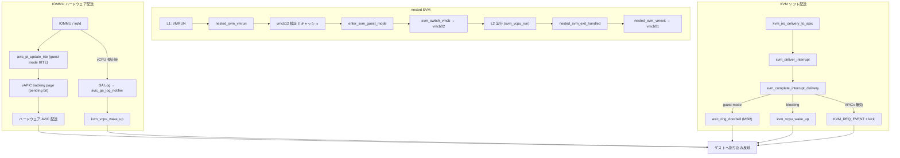

# 第18章 nested SVM と AVIC 概観

> **本章で読むソース**
>
> - [`arch/x86/kvm/svm/nested.c` L960-L1032](https://github.com/gregkh/linux/blob/v6.18.38/arch/x86/kvm/svm/nested.c#L960-L1032)
> - [`arch/x86/kvm/svm/nested.c` L908-L958](https://github.com/gregkh/linux/blob/v6.18.38/arch/x86/kvm/svm/nested.c#L908-L958)
> - [`arch/x86/kvm/svm/nested.c` L1167-L1246](https://github.com/gregkh/linux/blob/v6.18.38/arch/x86/kvm/svm/nested.c#L1167-L1246)
> - [`arch/x86/kvm/svm/avic.c` L309-L350](https://github.com/gregkh/linux/blob/v6.18.38/arch/x86/kvm/svm/avic.c#L309-L350)
> - [`arch/x86/kvm/svm/avic.c` L358-L371](https://github.com/gregkh/linux/blob/v6.18.38/arch/x86/kvm/svm/avic.c#L358-L371)
> - [`arch/x86/kvm/svm/svm.c` L3742-L3773](https://github.com/gregkh/linux/blob/v6.18.38/arch/x86/kvm/svm/svm.c#L3742-L3773)
> - [`arch/x86/kvm/svm/avic.c` L262-L290](https://github.com/gregkh/linux/blob/v6.18.38/arch/x86/kvm/svm/avic.c#L262-L290)
> - [`arch/x86/kvm/svm/avic.c` L433-L449](https://github.com/gregkh/linux/blob/v6.18.38/arch/x86/kvm/svm/avic.c#L433-L449)
> - [`arch/x86/kvm/svm/avic.c` L867-L890](https://github.com/gregkh/linux/blob/v6.18.38/arch/x86/kvm/svm/avic.c#L867-L890)

## この章の狙い

L1 ハイパーバイザが SVM を使う nested 構成と、APIC 仮想化向け AVIC の概観を読む。
`nested_svm_vmrun` による L2 入場、`vmcb12` と `vmcb02` のマージ、AVIC backing page と doorbell の接続点を押さえる。
本章は機構の全体像に留め、各 nested 命令や AVIC 全 exit の網羅的解説は対象外とする。

## 前提

- [VMCB と `svm_vcpu_run`](17-vmcb-svm-run.md)
- [`vmx_vcpu_run` と VM-exit 処理](../part05-vmx/15-vmx-run-exit.md)

## nested VMRUN：`nested_svm_vmrun`

L1 が VMRUN を実行すると `vmrun_interception` から `nested_svm_vmrun` が呼ばれる。
RAX が指す GPA から vmcb12 をマップし、検証後に L1 状態を vmcb01 へ退避して `enter_svm_guest_mode` へ進む。

[`arch/x86/kvm/svm/nested.c` L960-L1032](https://github.com/gregkh/linux/blob/v6.18.38/arch/x86/kvm/svm/nested.c#L960-L1032)

```c
int nested_svm_vmrun(struct kvm_vcpu *vcpu)
{
	struct vcpu_svm *svm = to_svm(vcpu);
	int ret;
	struct vmcb *vmcb12;
	struct kvm_host_map map;
	u64 vmcb12_gpa;
	struct vmcb *vmcb01 = svm->vmcb01.ptr;

	if (!svm->nested.hsave_msr) {
		kvm_inject_gp(vcpu, 0);
		return 1;
	}

	if (is_smm(vcpu)) {
		kvm_queue_exception(vcpu, UD_VECTOR);
		return 1;
	}

	/* This fails when VP assist page is enabled but the supplied GPA is bogus */
	ret = kvm_hv_verify_vp_assist(vcpu);
	if (ret) {
		kvm_inject_gp(vcpu, 0);
		return ret;
	}

	vmcb12_gpa = svm->vmcb->save.rax;
	if (kvm_vcpu_map(vcpu, gpa_to_gfn(vmcb12_gpa), &map)) {
		kvm_inject_gp(vcpu, 0);
		return 1;
	}

	ret = kvm_skip_emulated_instruction(vcpu);

	vmcb12 = map.hva;

	if (WARN_ON_ONCE(!svm->nested.initialized))
		return -EINVAL;

	nested_copy_vmcb_control_to_cache(svm, &vmcb12->control);
	nested_copy_vmcb_save_to_cache(svm, &vmcb12->save);

	if (nested_svm_check_cached_vmcb12(vcpu) < 0) {
		vmcb12->control.exit_code    = SVM_EXIT_ERR;
		vmcb12->control.exit_code_hi = -1u;
		vmcb12->control.exit_info_1  = 0;
		vmcb12->control.exit_info_2  = 0;
		vmcb12->control.event_inj = 0;
		vmcb12->control.event_inj_err = 0;
		svm_set_gif(svm, false);
		goto out;
	}

	/*
	 * Since vmcb01 is not in use, we can use it to store some of the L1
	 * state.
	 */
	vmcb01->save.efer   = vcpu->arch.efer;
	vmcb01->save.cr0    = kvm_read_cr0(vcpu);
	vmcb01->save.cr4    = vcpu->arch.cr4;
	vmcb01->save.rflags = kvm_get_rflags(vcpu);
	vmcb01->save.rip    = kvm_rip_read(vcpu);

	if (!npt_enabled)
		vmcb01->save.cr3 = kvm_read_cr3(vcpu);

	svm->nested.nested_run_pending = 1;

	if (enter_svm_guest_mode(vcpu, vmcb12_gpa, vmcb12, true))
		goto out_exit_err;

	if (nested_svm_merge_msrpm(vcpu))
		goto out;
```

## vmcb12 と vmcb02：`enter_svm_guest_mode`

`vmcb12` は L1 がメモリ上に置くゲスト VMCB である。
`enter_svm_guest_mode` は vmcb12 から vmcb02 を組み立て、`svm_switch_vmcb` で L2 用 VMCB へ切り替える。

[`arch/x86/kvm/svm/nested.c` L908-L958](https://github.com/gregkh/linux/blob/v6.18.38/arch/x86/kvm/svm/nested.c#L908-L958)

```c
int enter_svm_guest_mode(struct kvm_vcpu *vcpu, u64 vmcb12_gpa,
			 struct vmcb *vmcb12, bool from_vmrun)
{
	struct vcpu_svm *svm = to_svm(vcpu);
	int ret;

	trace_kvm_nested_vmenter(svm->vmcb->save.rip,
				 vmcb12_gpa,
				 vmcb12->save.rip,
				 vmcb12->control.int_ctl,
				 vmcb12->control.event_inj,
				 vmcb12->control.nested_ctl,
				 vmcb12->control.nested_cr3,
				 vmcb12->save.cr3,
				 KVM_ISA_SVM);

	trace_kvm_nested_intercepts(vmcb12->control.intercepts[INTERCEPT_CR] & 0xffff,
				    vmcb12->control.intercepts[INTERCEPT_CR] >> 16,
				    vmcb12->control.intercepts[INTERCEPT_EXCEPTION],
				    vmcb12->control.intercepts[INTERCEPT_WORD3],
				    vmcb12->control.intercepts[INTERCEPT_WORD4],
				    vmcb12->control.intercepts[INTERCEPT_WORD5]);


	svm->nested.vmcb12_gpa = vmcb12_gpa;

	WARN_ON(svm->vmcb == svm->nested.vmcb02.ptr);

	nested_svm_copy_common_state(svm->vmcb01.ptr, svm->nested.vmcb02.ptr);

	svm_switch_vmcb(svm, &svm->nested.vmcb02);
	nested_vmcb02_prepare_control(svm);
	nested_vmcb02_prepare_save(svm, vmcb12);

	ret = nested_svm_load_cr3(&svm->vcpu, svm->nested.save.cr3,
				  nested_npt_enabled(svm), from_vmrun);
	if (ret)
		return ret;

	if (!from_vmrun)
		kvm_make_request(KVM_REQ_GET_NESTED_STATE_PAGES, vcpu);

	svm_set_gif(svm, true);

	if (kvm_vcpu_apicv_active(vcpu))
		kvm_make_request(KVM_REQ_APICV_UPDATE, vcpu);

	nested_svm_hv_update_vm_vp_ids(vcpu);

	return 0;
}
```

`nested_vmcb02_prepare_control` と `nested_vmcb02_prepare_save` は vmcb01 と vmcb12 をマージして vmcb02 を作る。
L2 からの VM-exit は第17章の `nested_svm_exit_handled` 経由で L1 へ戻る。

## nested VM-exit：`nested_svm_vmexit`

`nested_svm_vmexit` は vmcb02 の状態を vmcb12 へ書き戻し、`leave_guest_mode` のあと vmcb01 へ復帰する。

[`arch/x86/kvm/svm/nested.c` L1167-L1246](https://github.com/gregkh/linux/blob/v6.18.38/arch/x86/kvm/svm/nested.c#L1167-L1246)

```c
int nested_svm_vmexit(struct vcpu_svm *svm)
{
	struct kvm_vcpu *vcpu = &svm->vcpu;
	struct vmcb *vmcb01 = svm->vmcb01.ptr;
	struct vmcb *vmcb02 = svm->nested.vmcb02.ptr;
	int rc;

	if (nested_svm_vmexit_update_vmcb12(vcpu))
		kvm_make_request(KVM_REQ_TRIPLE_FAULT, vcpu);

	/* Exit Guest-Mode */
	leave_guest_mode(vcpu);
	svm->nested.vmcb12_gpa = 0;
	WARN_ON_ONCE(svm->nested.nested_run_pending);

	kvm_clear_request(KVM_REQ_GET_NESTED_STATE_PAGES, vcpu);

	/* in case we halted in L2 */
	kvm_set_mp_state(vcpu, KVM_MP_STATE_RUNNABLE);

	if (!kvm_pause_in_guest(vcpu->kvm)) {
		vmcb01->control.pause_filter_count = vmcb02->control.pause_filter_count;
		vmcb_mark_dirty(vmcb01, VMCB_INTERCEPTS);

	}

	/*
	 * Invalidate bus_lock_rip unless KVM is still waiting for the guest
	 * to make forward progress before re-enabling bus lock detection.
	 */
	if (!vmcb02->control.bus_lock_counter)
		svm->nested.ctl.bus_lock_rip = INVALID_GPA;

	nested_svm_copy_common_state(svm->nested.vmcb02.ptr, svm->vmcb01.ptr);

	kvm_nested_vmexit_handle_ibrs(vcpu);

	svm_switch_vmcb(svm, &svm->vmcb01);

	/*
	 * Rules for synchronizing int_ctl bits from vmcb02 to vmcb01:
	 *
	 * V_IRQ, V_IRQ_VECTOR, V_INTR_PRIO_MASK, V_IGN_TPR:  If L1 doesn't
	 * intercept interrupts, then KVM will use vmcb02's V_IRQ (and related
	 * flags) to detect interrupt windows for L1 IRQs (even if L1 uses
	 * virtual interrupt masking).  Raise KVM_REQ_EVENT to ensure that
	 * KVM re-requests an interrupt window if necessary, which implicitly
	 * copies this bits from vmcb02 to vmcb01.
	 *
	 * V_TPR: If L1 doesn't use virtual interrupt masking, then L1's vTPR
	 * is stored in vmcb02, but its value doesn't need to be copied from/to
	 * vmcb01 because it is copied from/to the virtual APIC's TPR register
	 * on each VM entry/exit.
	 *
	 * V_GIF: If nested vGIF is not used, KVM uses vmcb02's V_GIF for L1's
	 * V_GIF.  However, GIF is architecturally clear on each VM exit, thus
	 * there is no need to copy V_GIF from vmcb02 to vmcb01.
	 */
	if (!nested_exit_on_intr(svm))
		kvm_make_request(KVM_REQ_EVENT, &svm->vcpu);

	if (!nested_vmcb12_has_lbrv(vcpu)) {
		svm_copy_lbrs(&vmcb01->save, &vmcb02->save);
		vmcb_mark_dirty(vmcb01, VMCB_LBR);
	}

	svm_update_lbrv(vcpu);

	if (vnmi) {
		if (vmcb02->control.int_ctl & V_NMI_BLOCKING_MASK)
			vmcb01->control.int_ctl |= V_NMI_BLOCKING_MASK;
		else
			vmcb01->control.int_ctl &= ~V_NMI_BLOCKING_MASK;

		if (vcpu->arch.nmi_pending) {
			vcpu->arch.nmi_pending--;
			vmcb01->control.int_ctl |= V_NMI_PENDING_MASK;
		} else {
			vmcb01->control.int_ctl &= ~V_NMI_PENDING_MASK;
		}
	}
```

## AVIC の VM 初期化：`avic_vm_init`

AVIC 有効時、`avic_vm_init` が physical/logical ID テーブル用ページを確保し、VM ごとの `avic_vm_id` を割り当てる。
IOMMU の GALOG 通知から VM を特定するハッシュテーブルへ登録する。

[`arch/x86/kvm/svm/avic.c` L309-L350](https://github.com/gregkh/linux/blob/v6.18.38/arch/x86/kvm/svm/avic.c#L309-L350)

```c
int avic_vm_init(struct kvm *kvm)
{
	unsigned long flags;
	int err = -ENOMEM;
	struct kvm_svm *kvm_svm = to_kvm_svm(kvm);
	struct kvm_svm *k2;
	u32 vm_id;

	if (!enable_apicv)
		return 0;

	kvm_svm->avic_physical_id_table = (void *)get_zeroed_page(GFP_KERNEL_ACCOUNT);
	if (!kvm_svm->avic_physical_id_table)
		goto free_avic;

	kvm_svm->avic_logical_id_table = (void *)get_zeroed_page(GFP_KERNEL_ACCOUNT);
	if (!kvm_svm->avic_logical_id_table)
		goto free_avic;

	spin_lock_irqsave(&svm_vm_data_hash_lock, flags);
 again:
	vm_id = next_vm_id = (next_vm_id + 1) & AVIC_VM_ID_MASK;
	if (vm_id == 0) { /* id is 1-based, zero is not okay */
		next_vm_id_wrapped = 1;
		goto again;
	}
	/* Is it still in use? Only possible if wrapped at least once */
	if (next_vm_id_wrapped) {
		hash_for_each_possible(svm_vm_data_hash, k2, hnode, vm_id) {
			if (k2->avic_vm_id == vm_id)
				goto again;
		}
	}
	kvm_svm->avic_vm_id = vm_id;
	hash_add(svm_vm_data_hash, &kvm_svm->hnode, kvm_svm->avic_vm_id);
	spin_unlock_irqrestore(&svm_vm_data_hash_lock, flags);

	return 0;

free_avic:
	avic_vm_destroy(kvm);
	return err;
}
```

## AVIC backing page：`avic_init_vmcb`

`init_vmcb` は APICv 有効時に `avic_init_vmcb` を呼び、VMCB control area へ backing page と ID テーブルのアドレスを設定する。
backing page は vLAPIC レジスタページの物理アドレスである。

[`arch/x86/kvm/svm/avic.c` L358-L371](https://github.com/gregkh/linux/blob/v6.18.38/arch/x86/kvm/svm/avic.c#L358-L371)

```c
void avic_init_vmcb(struct vcpu_svm *svm, struct vmcb *vmcb)
{
	struct kvm_svm *kvm_svm = to_kvm_svm(svm->vcpu.kvm);

	vmcb->control.avic_backing_page = avic_get_backing_page_address(svm);
	vmcb->control.avic_logical_id = __sme_set(__pa(kvm_svm->avic_logical_id_table));
	vmcb->control.avic_physical_id = __sme_set(__pa(kvm_svm->avic_physical_id_table));
	vmcb->control.avic_vapic_bar = APIC_DEFAULT_PHYS_BASE;

	if (kvm_vcpu_apicv_active(&svm->vcpu))
		avic_activate_vmcb(svm);
	else
		avic_deactivate_vmcb(svm);
}
```

ハードウェアは nested page table で権限を確認するが、実際に参照するアドレスは `avic_backing_page` フィールドの値である。

## KVM の CPU doorbell：`avic_ring_doorbell`

`avic_ring_doorbell` は割り当てデバイスや IOMMU から直接呼ばれる経路ではない。
`svm_deliver_interrupt` が vLAPIC の IRR を更新したあと `svm_complete_interrupt_delivery` を呼び、対象 vCPU が guest mode かつ APICv 有効なら doorbell を鳴らす。

[`arch/x86/kvm/svm/svm.c` L3742-L3773](https://github.com/gregkh/linux/blob/v6.18.38/arch/x86/kvm/svm/svm.c#L3742-L3773)

```c
void svm_complete_interrupt_delivery(struct kvm_vcpu *vcpu, int delivery_mode,
				     int trig_mode, int vector)
{
	/*
	 * apic->apicv_active must be read after vcpu->mode.
	 * Pairs with smp_store_release in vcpu_enter_guest.
	 */
	bool in_guest_mode = (smp_load_acquire(&vcpu->mode) == IN_GUEST_MODE);

	/* Note, this is called iff the local APIC is in-kernel. */
	if (!READ_ONCE(vcpu->arch.apic->apicv_active)) {
		/* Process the interrupt via kvm_check_and_inject_events(). */
		kvm_make_request(KVM_REQ_EVENT, vcpu);
		kvm_vcpu_kick(vcpu);
		return;
	}

	trace_kvm_apicv_accept_irq(vcpu->vcpu_id, delivery_mode, trig_mode, vector);
	if (in_guest_mode) {
		/*
		 * Signal the doorbell to tell hardware to inject the IRQ.  If
		 * the vCPU exits the guest before the doorbell chimes, hardware
		 * will automatically process AVIC interrupts at the next VMRUN.
		 */
		avic_ring_doorbell(vcpu);
	} else {
		/*
		 * Wake the vCPU if it was blocking.  KVM will then detect the
		 * pending IRQ when checking if the vCPU has a wake event.
		 */
		kvm_vcpu_wake_up(vcpu);
	}
}
```

対象 vCPU が別 CPU 上にいるときだけ `MSR_AMD64_SVM_AVIC_DOORBELL` を書く。
vCPU がマイグレーションした直後の誤通知は、次の VMRUN で割り込みが処理されるため無害とみなす。

[`arch/x86/kvm/svm/avic.c` L433-L449](https://github.com/gregkh/linux/blob/v6.18.38/arch/x86/kvm/svm/avic.c#L433-L449)

```c
void avic_ring_doorbell(struct kvm_vcpu *vcpu)
{
	/*
	 * Note, the vCPU could get migrated to a different pCPU at any point,
	 * which could result in signalling the wrong/previous pCPU.  But if
	 * that happens the vCPU is guaranteed to do a VMRUN (after being
	 * migrated) and thus will process pending interrupts, i.e. a doorbell
	 * is not needed (and the spurious one is harmless).
	 */
	int cpu = READ_ONCE(vcpu->cpu);

	if (cpu != get_cpu()) {
		wrmsrq(MSR_AMD64_SVM_AVIC_DOORBELL, kvm_cpu_get_apicid(cpu));
		trace_kvm_avic_doorbell(vcpu->vcpu_id, kvm_cpu_get_apicid(cpu));
	}
	put_cpu();
}
```

## IOMMU 経路：`avic_pi_update_irte` と GA Log

割り当てデバイスからの割り込みは `avic_pi_update_irte` が IOMMU の interrupt-remapping entry に guest mode 設定を行う。
vCPU が停止中は GA Log 通知が `avic_ga_log_notifier` を呼び、該当 vCPU を `kvm_vcpu_wake_up` する。

[`arch/x86/kvm/svm/avic.c` L262-L290](https://github.com/gregkh/linux/blob/v6.18.38/arch/x86/kvm/svm/avic.c#L262-L290)

```c
static int avic_ga_log_notifier(u32 ga_tag)
{
	unsigned long flags;
	struct kvm_svm *kvm_svm;
	struct kvm_vcpu *vcpu = NULL;
	u32 vm_id = AVIC_GATAG_TO_VMID(ga_tag);
	u32 vcpu_idx = AVIC_GATAG_TO_VCPUIDX(ga_tag);

	pr_debug("SVM: %s: vm_id=%#x, vcpu_idx=%#x\n", __func__, vm_id, vcpu_idx);
	trace_kvm_avic_ga_log(vm_id, vcpu_idx);

	spin_lock_irqsave(&svm_vm_data_hash_lock, flags);
	hash_for_each_possible(svm_vm_data_hash, kvm_svm, hnode, vm_id) {
		if (kvm_svm->avic_vm_id != vm_id)
			continue;
		vcpu = kvm_get_vcpu(&kvm_svm->kvm, vcpu_idx);
		break;
	}
	spin_unlock_irqrestore(&svm_vm_data_hash_lock, flags);

	/* Note:
	 * At this point, the IOMMU should have already set the pending
	 * bit in the vAPIC backing page. So, we just need to schedule
	 * in the vcpu.
	 */
	if (vcpu)
		kvm_vcpu_wake_up(vcpu);

	return 0;
}
```

[`arch/x86/kvm/svm/avic.c` L867-L890](https://github.com/gregkh/linux/blob/v6.18.38/arch/x86/kvm/svm/avic.c#L867-L890)

```c
int avic_pi_update_irte(struct kvm_kernel_irqfd *irqfd, struct kvm *kvm,
			unsigned int host_irq, uint32_t guest_irq,
			struct kvm_vcpu *vcpu, u32 vector)
{
	/*
	 * If the IRQ was affined to a different vCPU, remove the IRTE metadata
	 * from the *previous* vCPU's list.
	 */
	svm_ir_list_del(irqfd);

	if (vcpu) {
		/*
		 * Try to enable guest_mode in IRTE, unless AVIC is inhibited,
		 * in which case configure the IRTE for legacy mode, but track
		 * the IRTE metadata so that it can be converted to guest mode
		 * if AVIC is enabled/uninhibited in the future.
		 */
		struct amd_iommu_pi_data pi_data = {
			.ga_tag = AVIC_GATAG(to_kvm_svm(kvm)->avic_vm_id,
					     vcpu->vcpu_idx),
			.is_guest_mode = kvm_vcpu_apicv_active(vcpu),
			.vapic_addr = avic_get_backing_page_address(to_svm(vcpu)),
			.vector = vector,
		};
```

IOMMU 配送と KVM の MSR doorbell は別経路であり、一直列に接続されない。

## 処理の流れ：nested と AVIC の接続



## 高速化と最適化の工夫

`nested_copy_vmcb_save_to_cache` は検証用に CR0/CR3/CR4/DR6/DR7 を毎回 cache へコピーする。
`nested_vmcb02_prepare_save` は同一 vmcb12 再利用時、clean ビットが立つ SEG/DT/CET/DR など一部の vmcb02 再コピーを省略する。
vmcb02 は vmcb01 と vmcb12 の intercept と MSRPM をマージした実行用 VMCB として使い、L2 中は current VMCB だけを VMRUN する。
AVIC は vLAPIC への MMIO トラップを減らし、IOMMU の guest mode IRTE で backing page へ直接書き込む。
KVM の doorbell はソフト配送後に guest mode の vCPU へ通知 IPI を送り、VM-exit とソフト LAPIC 注入を省略する。

## まとめ

nested SVM は `nested_svm_vmrun` が vmcb12 を検証し vmcb02 へマージして L2 を実行する。
VM-exit は `nested_svm_vmexit` が vmcb12 へ状態を戻し vmcb01 へ復帰する。
AVIC は backing page と ID テーブルを VMCB に載せ、IOMMU 経路と KVM の doorbell 経路を分けて割り込みを配送する。

## 関連する章

- [VMCB と `svm_vcpu_run`](17-vmcb-svm-run.md)
- [nested VMX と posted interrupt 概観](../part05-vmx/16-nested-vmx-posted-intr.md)
- [irqchip、LAPIC、割り込み注入](../part07-irq-io/19-irqchip-lapic-injection.md)
