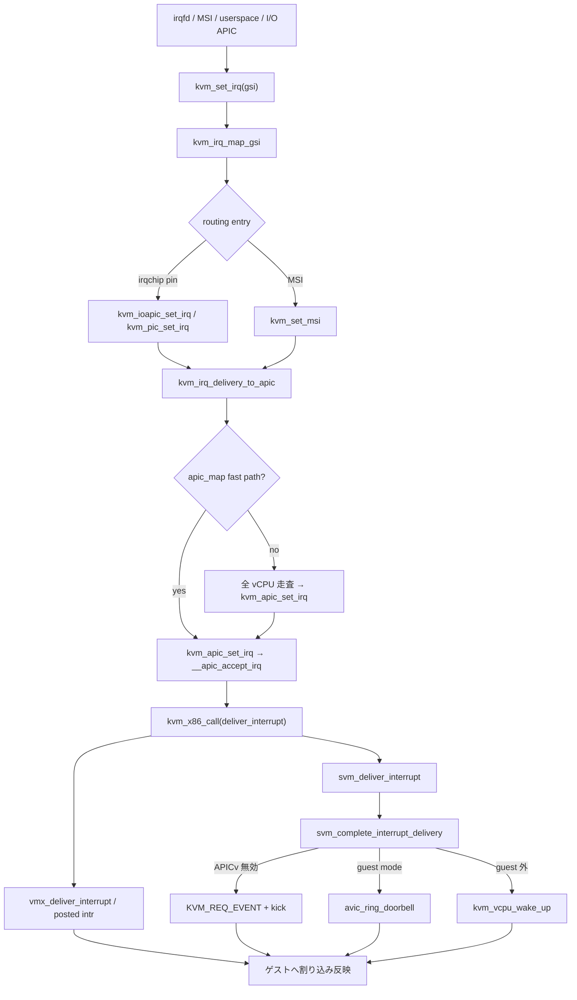

# 第19章 irqchip、LAPIC、割り込み注入

> **本章で読むソース**
>
> - [`arch/x86/kvm/x86.c` L7335-L7362](https://github.com/gregkh/linux/blob/v6.18.38/arch/x86/kvm/x86.c#L7335-L7362)
> - [`virt/kvm/irqchip.c` L70-L97](https://github.com/gregkh/linux/blob/v6.18.38/virt/kvm/irqchip.c#L70-L97)
> - [`virt/kvm/irqchip.c` L168-L237](https://github.com/gregkh/linux/blob/v6.18.38/virt/kvm/irqchip.c#L168-L237)
> - [`arch/x86/kvm/irq.c` L296-L355](https://github.com/gregkh/linux/blob/v6.18.38/arch/x86/kvm/irq.c#L296-L355)
> - [`arch/x86/kvm/lapic.c` L1242-L1276](https://github.com/gregkh/linux/blob/v6.18.38/arch/x86/kvm/lapic.c#L1242-L1276)
> - [`arch/x86/kvm/lapic.c` L1350-L1404](https://github.com/gregkh/linux/blob/v6.18.38/arch/x86/kvm/lapic.c#L1350-L1404)
> - [`arch/x86/kvm/lapic.c` L1411-L1487](https://github.com/gregkh/linux/blob/v6.18.38/arch/x86/kvm/lapic.c#L1411-L1487)
> - [`arch/x86/kvm/lapic.c` L2420-L2483](https://github.com/gregkh/linux/blob/v6.18.38/arch/x86/kvm/lapic.c#L2420-L2483)
> - [`arch/x86/kvm/vmx/vmx.c` L4242-L4254](https://github.com/gregkh/linux/blob/v6.18.38/arch/x86/kvm/vmx/vmx.c#L4242-L4254)
> - [`arch/x86/kvm/svm/svm.c` L3742-L3773](https://github.com/gregkh/linux/blob/v6.18.38/arch/x86/kvm/svm/svm.c#L3742-L3773)
> - [`arch/x86/kvm/svm/svm.c` L3776-L3790](https://github.com/gregkh/linux/blob/v6.18.38/arch/x86/kvm/svm/svm.c#L3776-L3790)

## この章の狙い

カーネル内 irqchip（PIC、I/O APIC）と vLAPIC が GSI からゲスト vCPU へ割り込みを届ける経路を読む。
`kvm_set_irq` と IRQ routing、`kvm_irq_delivery_to_apic` と `__apic_accept_irq`、VMX/SVM の `deliver_interrupt` までの接続点を押さえる。
個別レガシーデバイス（`i8254.c` 等）の網羅列挙は対象外とする。

## 前提

- [レジスタ、MSR、cpuid、例外注入](../part04-x86-common/12-regs-msr-cpuid-exceptions.md)
- [nested VMX と posted interrupt 概観](../part05-vmx/16-nested-vmx-posted-intr.md)
- [nested SVM と AVIC 概観](../part06-svm/18-nested-svm-avic.md)

## irqchip の生成：`KVM_CREATE_IRQCHIP`

userspace が `KVM_CREATE_IRQCHIP` を発行すると、vCPU 作成前に PIC と I/O APIC が初期化される。
既定の PIC/I/O APIC ルーティングを組み立てたうえで `kvm->arch.irqchip_mode` を kernel モードへ切り替える。

[`arch/x86/kvm/x86.c` L7335-L7362](https://github.com/gregkh/linux/blob/v6.18.38/arch/x86/kvm/x86.c#L7335-L7362)

```c
		r = -ENOTTY;
		if (kvm->arch.has_protected_eoi)
			goto create_irqchip_unlock;

		r = -EINVAL;
		if (kvm->created_vcpus)
			goto create_irqchip_unlock;

		r = kvm_pic_init(kvm);
		if (r)
			goto create_irqchip_unlock;

		r = kvm_ioapic_init(kvm);
		if (r) {
			kvm_pic_destroy(kvm);
			goto create_irqchip_unlock;
		}

		r = kvm_setup_default_ioapic_and_pic_routing(kvm);
		if (r) {
			kvm_ioapic_destroy(kvm);
			kvm_pic_destroy(kvm);
			goto create_irqchip_unlock;
		}
		/* Write kvm->irq_routing before enabling irqchip_in_kernel. */
		smp_wmb();
		kvm->arch.irqchip_mode = KVM_IRQCHIP_KERNEL;
		kvm_clear_apicv_inhibit(kvm, APICV_INHIBIT_REASON_ABSENT);
```

I/O APIC は `kvm_io_bus_register_dev` で MMIO bus に載り、ピンへの書き込みが `kvm_ioapic_set_irq` へつながる。

## GSI から irqchip へ：`kvm_set_irq`

`kvm_set_irq` は GSI を `kvm_irq_map_gsi` でルーティングエントリ列へ展開し、各エントリの `set` コールバックを呼ぶ。
irqchip ピン、MSI、Hyper-V SINT 等は userspace が `KVM_SET_GSI_ROUTING` で登録した型に応じて別ハンドラへ分岐する。

[`virt/kvm/irqchip.c` L70-L97](https://github.com/gregkh/linux/blob/v6.18.38/virt/kvm/irqchip.c#L70-L97)

```c
int kvm_set_irq(struct kvm *kvm, int irq_source_id, u32 irq, int level,
		bool line_status)
{
	struct kvm_kernel_irq_routing_entry irq_set[KVM_NR_IRQCHIPS];
	int ret = -1, i, idx;

	trace_kvm_set_irq(irq, level, irq_source_id);

	/* Not possible to detect if the guest uses the PIC or the
	 * IOAPIC.  So set the bit in both. The guest will ignore
	 * writes to the unused one.
	 */
	idx = srcu_read_lock(&kvm->irq_srcu);
	i = kvm_irq_map_gsi(kvm, irq_set, irq);
	srcu_read_unlock(&kvm->irq_srcu, idx);

	while (i--) {
		int r;
		r = irq_set[i].set(&irq_set[i], kvm, irq_source_id, level,
				   line_status);
		if (r < 0)
			continue;

		ret = r + ((ret < 0) ? 0 : ret);
	}

	return ret;
}
```

## IRQ routing テーブル：`kvm_set_irq_routing`

`kvm_set_irq_routing` は新しい `kvm_irq_routing_table` を組み立て、RCU で `kvm->irq_routing` を差し替える。
`setup_routing_entry` は同一 GSI への重複 irqchip マッピングを拒否し、irqchip ピンから GSI への逆引き `chip[][]` も更新する。

[`virt/kvm/irqchip.c` L168-L237](https://github.com/gregkh/linux/blob/v6.18.38/virt/kvm/irqchip.c#L168-L237)

```c
int kvm_set_irq_routing(struct kvm *kvm,
			const struct kvm_irq_routing_entry *ue,
			unsigned nr,
			unsigned flags)
{
	struct kvm_irq_routing_table *new, *old;
	struct kvm_kernel_irq_routing_entry *e;
	u32 i, j, nr_rt_entries = 0;
	int r;

	for (i = 0; i < nr; ++i) {
		if (ue[i].gsi >= KVM_MAX_IRQ_ROUTES)
			return -EINVAL;
		nr_rt_entries = max(nr_rt_entries, ue[i].gsi);
	}

	nr_rt_entries += 1;

	new = kzalloc(struct_size(new, map, nr_rt_entries), GFP_KERNEL_ACCOUNT);
	if (!new)
		return -ENOMEM;

	new->nr_rt_entries = nr_rt_entries;
	for (i = 0; i < KVM_NR_IRQCHIPS; i++)
		for (j = 0; j < KVM_IRQCHIP_NUM_PINS; j++)
			new->chip[i][j] = -1;

	for (i = 0; i < nr; ++i) {
		r = -ENOMEM;
		e = kzalloc(sizeof(*e), GFP_KERNEL_ACCOUNT);
		if (!e)
			goto out;

		r = -EINVAL;
		switch (ue->type) {
		case KVM_IRQ_ROUTING_MSI:
			if (ue->flags & ~KVM_MSI_VALID_DEVID)
				goto free_entry;
			break;
		default:
			if (ue->flags)
				goto free_entry;
			break;
		}
		r = setup_routing_entry(kvm, new, e, ue);
		if (r)
			goto free_entry;
		++ue;
	}

	mutex_lock(&kvm->irq_lock);
	old = rcu_dereference_protected(kvm->irq_routing, 1);
	rcu_assign_pointer(kvm->irq_routing, new);
	kvm_irq_routing_update(kvm);
	kvm_arch_irq_routing_update(kvm);
	mutex_unlock(&kvm->irq_lock);

	synchronize_srcu_expedited(&kvm->irq_srcu);

	new = old;
	r = 0;
	goto out;

free_entry:
	kfree(e);
out:
	free_irq_routing_table(new);

	return r;
```

x86 では `kvm_set_routing_entry` が型ごとに `set` 関数を束ねる。
irqchip ピンは `kvm_pic_set_irq` または `kvm_ioapic_set_irq`、MSI は `kvm_set_msi` となる。

[`arch/x86/kvm/irq.c` L296-L355](https://github.com/gregkh/linux/blob/v6.18.38/arch/x86/kvm/irq.c#L296-L355)

```c
int kvm_set_routing_entry(struct kvm *kvm,
			  struct kvm_kernel_irq_routing_entry *e,
			  const struct kvm_irq_routing_entry *ue)
{
	/* We can't check irqchip_in_kernel() here as some callers are
	 * currently initializing the irqchip. Other callers should therefore
	 * check kvm_arch_can_set_irq_routing() before calling this function.
	 */
	switch (ue->type) {
#ifdef CONFIG_KVM_IOAPIC
	case KVM_IRQ_ROUTING_IRQCHIP:
		if (irqchip_split(kvm))
			return -EINVAL;
		e->irqchip.pin = ue->u.irqchip.pin;
		switch (ue->u.irqchip.irqchip) {
		case KVM_IRQCHIP_PIC_SLAVE:
			e->irqchip.pin += PIC_NUM_PINS / 2;
			fallthrough;
		case KVM_IRQCHIP_PIC_MASTER:
			if (ue->u.irqchip.pin >= PIC_NUM_PINS / 2)
				return -EINVAL;
			e->set = kvm_pic_set_irq;
			break;
		case KVM_IRQCHIP_IOAPIC:
			if (ue->u.irqchip.pin >= KVM_IOAPIC_NUM_PINS)
				return -EINVAL;
			e->set = kvm_ioapic_set_irq;
			break;
		default:
			return -EINVAL;
		}
		e->irqchip.irqchip = ue->u.irqchip.irqchip;
		break;
#endif
	case KVM_IRQ_ROUTING_MSI:
		e->set = kvm_set_msi;
		e->msi.address_lo = ue->u.msi.address_lo;
		e->msi.address_hi = ue->u.msi.address_hi;
		e->msi.data = ue->u.msi.data;

		if (kvm_msi_route_invalid(kvm, e))
			return -EINVAL;
		break;
#ifdef CONFIG_KVM_HYPERV
	case KVM_IRQ_ROUTING_HV_SINT:
		e->set = kvm_hv_synic_set_irq;
		e->hv_sint.vcpu = ue->u.hv_sint.vcpu;
		e->hv_sint.sint = ue->u.hv_sint.sint;
		break;
#endif
#ifdef CONFIG_KVM_XEN
	case KVM_IRQ_ROUTING_XEN_EVTCHN:
		return kvm_xen_setup_evtchn(kvm, e, ue);
#endif
	default:
		return -EINVAL;
	}

	return 0;
}
```

I/O APIC エミュレーションは Redirection Table から宛先とベクタを組み立て、`kvm_irq_delivery_to_apic` へ渡す。

## APIC 配送：`kvm_irq_delivery_to_apic`

`kvm_irq_delivery_to_apic` は宛先 vCPU を解決し、各 vCPU の vLAPIC へ `kvm_apic_set_irq` を呼ぶ。
`kvm_irq_delivery_to_apic_fast` は `apic_map` を使い、物理/論理宛先の走査を省略できる場合に先に処理する。

[`arch/x86/kvm/lapic.c` L1242-L1276](https://github.com/gregkh/linux/blob/v6.18.38/arch/x86/kvm/lapic.c#L1242-L1276)

```c
bool kvm_irq_delivery_to_apic_fast(struct kvm *kvm, struct kvm_lapic *src,
		struct kvm_lapic_irq *irq, int *r, struct dest_map *dest_map)
{
	struct kvm_apic_map *map;
	unsigned long bitmap;
	struct kvm_lapic **dst = NULL;
	int i;
	bool ret;

	*r = -1;

	if (irq->shorthand == APIC_DEST_SELF) {
		if (KVM_BUG_ON(!src, kvm)) {
			*r = 0;
			return true;
		}
		*r = kvm_apic_set_irq(src->vcpu, irq, dest_map);
		return true;
	}

	rcu_read_lock();
	map = rcu_dereference(kvm->arch.apic_map);

	ret = kvm_apic_map_get_dest_lapic(kvm, &src, irq, map, &dst, &bitmap);
	if (ret) {
		*r = 0;
		for_each_set_bit(i, &bitmap, 16) {
			if (!dst[i])
				continue;
			*r += kvm_apic_set_irq(dst[i]->vcpu, irq, dest_map);
		}
	}

	rcu_read_unlock();
	return ret;
}
```

fast path で処理できない場合は全 vCPU を走査し、lowest-priority 配送では `vector_hashing` による分散も行う。

[`arch/x86/kvm/lapic.c` L1350-L1404](https://github.com/gregkh/linux/blob/v6.18.38/arch/x86/kvm/lapic.c#L1350-L1404)

```c
int kvm_irq_delivery_to_apic(struct kvm *kvm, struct kvm_lapic *src,
			     struct kvm_lapic_irq *irq, struct dest_map *dest_map)
{
	int r = -1;
	struct kvm_vcpu *vcpu, *lowest = NULL;
	unsigned long i, dest_vcpu_bitmap[BITS_TO_LONGS(KVM_MAX_VCPUS)];
	unsigned int dest_vcpus = 0;

	if (kvm_irq_delivery_to_apic_fast(kvm, src, irq, &r, dest_map))
		return r;

	if (irq->dest_mode == APIC_DEST_PHYSICAL &&
	    irq->dest_id == 0xff && kvm_lowest_prio_delivery(irq)) {
		pr_info("apic: phys broadcast and lowest prio\n");
		irq->delivery_mode = APIC_DM_FIXED;
	}

	memset(dest_vcpu_bitmap, 0, sizeof(dest_vcpu_bitmap));

	kvm_for_each_vcpu(i, vcpu, kvm) {
		if (!kvm_apic_present(vcpu))
			continue;

		if (!kvm_apic_match_dest(vcpu, src, irq->shorthand,
					irq->dest_id, irq->dest_mode))
			continue;

		if (!kvm_lowest_prio_delivery(irq)) {
			if (r < 0)
				r = 0;
			r += kvm_apic_set_irq(vcpu, irq, dest_map);
		} else if (kvm_apic_sw_enabled(vcpu->arch.apic)) {
			if (!vector_hashing_enabled) {
				if (!lowest)
					lowest = vcpu;
				else if (kvm_apic_compare_prio(vcpu, lowest) < 0)
					lowest = vcpu;
			} else {
				__set_bit(i, dest_vcpu_bitmap);
				dest_vcpus++;
			}
		}
	}

	if (dest_vcpus != 0) {
		int idx = kvm_vector_to_index(irq->vector, dest_vcpus,
					dest_vcpu_bitmap, KVM_MAX_VCPUS);

		lowest = kvm_get_vcpu(kvm, idx);
	}

	if (lowest)
		r = kvm_apic_set_irq(lowest, irq, dest_map);

	return r;
}
```

## vLAPIC 受付：`__apic_accept_irq`

`kvm_apic_set_irq` は `__apic_accept_irq` を呼び、delivery mode に応じて IRR 更新や特別イベントを処理する。
固定配信では TMR ビットを更新したうえで `kvm_x86_call(deliver_interrupt)` へ委譲する。

[`arch/x86/kvm/lapic.c` L1411-L1487](https://github.com/gregkh/linux/blob/v6.18.38/arch/x86/kvm/lapic.c#L1411-L1487)

```c
static int __apic_accept_irq(struct kvm_lapic *apic, int delivery_mode,
			     int vector, int level, int trig_mode,
			     struct dest_map *dest_map)
{
	int result = 0;
	struct kvm_vcpu *vcpu = apic->vcpu;

	trace_kvm_apic_accept_irq(vcpu->vcpu_id, delivery_mode,
				  trig_mode, vector);
	switch (delivery_mode) {
	case APIC_DM_LOWEST:
		vcpu->arch.apic_arb_prio++;
		fallthrough;
	case APIC_DM_FIXED:
		if (unlikely(trig_mode && !level))
			break;

		/* FIXME add logic for vcpu on reset */
		if (unlikely(!apic_enabled(apic)))
			break;

		result = 1;

		if (dest_map) {
			__set_bit(vcpu->vcpu_id, dest_map->map);
			dest_map->vectors[vcpu->vcpu_id] = vector;
		}

		if (apic_test_vector(vector, apic->regs + APIC_TMR) != !!trig_mode) {
			if (trig_mode)
				apic_set_vector(vector, apic->regs + APIC_TMR);
			else
				apic_clear_vector(vector, apic->regs + APIC_TMR);
		}

		kvm_x86_call(deliver_interrupt)(apic, delivery_mode,
						trig_mode, vector);
		break;

	case APIC_DM_REMRD:
		result = 1;
		vcpu->arch.pv.pv_unhalted = 1;
		kvm_make_request(KVM_REQ_EVENT, vcpu);
		kvm_vcpu_kick(vcpu);
		break;

	case APIC_DM_SMI:
		if (!kvm_inject_smi(vcpu)) {
			kvm_vcpu_kick(vcpu);
			result = 1;
		}
		break;

	case APIC_DM_NMI:
		result = 1;
		kvm_inject_nmi(vcpu);
		kvm_vcpu_kick(vcpu);
		break;

	case APIC_DM_INIT:
		if (!trig_mode || level) {
			result = 1;
			/* assumes that there are only KVM_APIC_INIT/SIPI */
			apic->pending_events = (1UL << KVM_APIC_INIT);
			kvm_make_request(KVM_REQ_EVENT, vcpu);
			kvm_vcpu_kick(vcpu);
		}
		break;

	case APIC_DM_STARTUP:
		result = 1;
		apic->sipi_vector = vector;
		/* make sure sipi_vector is visible for the receiver */
		smp_wmb();
		set_bit(KVM_APIC_SIPI, &apic->pending_events);
		kvm_make_request(KVM_REQ_EVENT, vcpu);
		kvm_vcpu_kick(vcpu);
		break;
```

INIT/SIPI は MP 起動向けの特別経路であり、通常のデバイス割り込みは `APIC_DM_FIXED` 経路が主となる。

## ゲスト MMIO：`kvm_lapic_reg_write`

ゲストが LAPIC ページへ書き込むと `kvm_lapic_reg_write` がレジスタ別に処理する。
`APIC_ICR` 書き込みは IPI 発行、`APIC_EOI` はレベル割り込みの EOI 処理へつながる。

[`arch/x86/kvm/lapic.c` L2420-L2483](https://github.com/gregkh/linux/blob/v6.18.38/arch/x86/kvm/lapic.c#L2420-L2483)

```c
static int kvm_lapic_reg_write(struct kvm_lapic *apic, u32 reg, u32 val)
{
	int ret = 0;

	trace_kvm_apic_write(reg, val);

	switch (reg) {
	case APIC_ID:		/* Local APIC ID */
		if (!apic_x2apic_mode(apic)) {
			kvm_apic_set_xapic_id(apic, val >> 24);
		} else {
			ret = 1;
		}
		break;

	case APIC_TASKPRI:
		report_tpr_access(apic, true);
		apic_set_tpr(apic, val & 0xff);
		break;

	case APIC_EOI:
		apic_set_eoi(apic);
		break;

	case APIC_LDR:
		if (!apic_x2apic_mode(apic))
			kvm_apic_set_ldr(apic, val & APIC_LDR_MASK);
		else
			ret = 1;
		break;

	case APIC_DFR:
		if (!apic_x2apic_mode(apic))
			kvm_apic_set_dfr(apic, val | 0x0FFFFFFF);
		else
			ret = 1;
		break;

	case APIC_SPIV: {
		u32 mask = 0x3ff;
		if (kvm_lapic_get_reg(apic, APIC_LVR) & APIC_LVR_DIRECTED_EOI)
			mask |= APIC_SPIV_DIRECTED_EOI;
		apic_set_spiv(apic, val & mask);
		if (!(val & APIC_SPIV_APIC_ENABLED)) {
			int i;

			for (i = 0; i < apic->nr_lvt_entries; i++) {
				kvm_lapic_set_reg(apic, APIC_LVTx(i),
					kvm_lapic_get_reg(apic, APIC_LVTx(i)) | APIC_LVT_MASKED);
			}
			apic_update_lvtt(apic);
			atomic_set(&apic->lapic_timer.pending, 0);

		}
		break;
	}
	case APIC_ICR:
		WARN_ON_ONCE(apic_x2apic_mode(apic));

		/* No delay here, so we always clear the pending bit */
		val &= ~APIC_ICR_BUSY;
		kvm_apic_send_ipi(apic, val, kvm_lapic_get_reg(apic, APIC_ICR2));
		kvm_lapic_set_reg(apic, APIC_ICR, val);
		break;
```

## VMX と SVM への接続

`deliver_interrupt` は `kvm_x86_ops` の実装であり、APICv 有効時はハードウェア仮想化経路を優先する。

VMX では posted interrupt へ載せられない場合に IRR を更新し `KVM_REQ_EVENT` で vCPU を起こす。

[`arch/x86/kvm/vmx/vmx.c` L4242-L4254](https://github.com/gregkh/linux/blob/v6.18.38/arch/x86/kvm/vmx/vmx.c#L4242-L4254)

```c
void vmx_deliver_interrupt(struct kvm_lapic *apic, int delivery_mode,
			   int trig_mode, int vector)
{
	struct kvm_vcpu *vcpu = apic->vcpu;

	if (vmx_deliver_posted_interrupt(vcpu, vector)) {
		kvm_lapic_set_irr(vector, apic);
		kvm_make_request(KVM_REQ_EVENT, vcpu);
		kvm_vcpu_kick(vcpu);
	} else {
		trace_kvm_apicv_accept_irq(vcpu->vcpu_id, delivery_mode,
					   trig_mode, vector);
	}
}
```

SVM では IRR 更新後に `svm_complete_interrupt_delivery` が次の三経路へ分岐する。

- APICv 無効: `KVM_REQ_EVENT` と `kvm_vcpu_kick`
- APICv 有効かつ guest mode: `avic_ring_doorbell`
- APICv 有効だが guest 外: `kvm_vcpu_wake_up`

[`arch/x86/kvm/svm/svm.c` L3742-L3773](https://github.com/gregkh/linux/blob/v6.18.38/arch/x86/kvm/svm/svm.c#L3742-L3773)

```c
void svm_complete_interrupt_delivery(struct kvm_vcpu *vcpu, int delivery_mode,
				     int trig_mode, int vector)
{
	/*
	 * apic->apicv_active must be read after vcpu->mode.
	 * Pairs with smp_store_release in vcpu_enter_guest.
	 */
	bool in_guest_mode = (smp_load_acquire(&vcpu->mode) == IN_GUEST_MODE);

	/* Note, this is called iff the local APIC is in-kernel. */
	if (!READ_ONCE(vcpu->arch.apic->apicv_active)) {
		/* Process the interrupt via kvm_check_and_inject_events(). */
		kvm_make_request(KVM_REQ_EVENT, vcpu);
		kvm_vcpu_kick(vcpu);
		return;
	}

	trace_kvm_apicv_accept_irq(vcpu->vcpu_id, delivery_mode, trig_mode, vector);
	if (in_guest_mode) {
		/*
		 * Signal the doorbell to tell hardware to inject the IRQ.  If
		 * the vCPU exits the guest before the doorbell chimes, hardware
		 * will automatically process AVIC interrupts at the next VMRUN.
		 */
		avic_ring_doorbell(vcpu);
	} else {
		/*
		 * Wake the vCPU if it was blocking.  KVM will then detect the
		 * pending IRQ when checking if the vCPU has a wake event.
		 */
		kvm_vcpu_wake_up(vcpu);
	}
}
```

[`arch/x86/kvm/svm/svm.c` L3776-L3790](https://github.com/gregkh/linux/blob/v6.18.38/arch/x86/kvm/svm/svm.c#L3776-L3790)

```c
static void svm_deliver_interrupt(struct kvm_lapic *apic,  int delivery_mode,
				  int trig_mode, int vector)
{
	kvm_lapic_set_irr(vector, apic);

	/*
	 * Pairs with the smp_mb_*() after setting vcpu->guest_mode in
	 * vcpu_enter_guest() to ensure the write to the vIRR is ordered before
	 * the read of guest_mode.  This guarantees that either VMRUN will see
	 * and process the new vIRR entry, or that svm_complete_interrupt_delivery
	 * will signal the doorbell if the CPU has already entered the guest.
	 */
	smp_mb__after_atomic();
	svm_complete_interrupt_delivery(apic->vcpu, delivery_mode, trig_mode, vector);
}

```

posted interrupt と AVIC の詳細は第16章と第18章を参照する。

> **v7.1.3 での変更**
>
> [`__kvm_irq_delivery_to_apic`](https://github.com/gregkh/linux/blob/v7.1.3/arch/x86/kvm/lapic.c#L1336-L1346) と [`__kvm_irq_delivery_to_apic_fast`](https://github.com/gregkh/linux/blob/v7.1.3/arch/x86/kvm/lapic.c#L1220-L1255) は、宛先記録用の `dest_map` の代わりに `struct rtc_status *rtc_status` を受け取る形に整理された。
> 公開ラッパの `kvm_irq_delivery_to_apic_fast` は `rtc_status` なしで内部 fast 関数を呼ぶ薄い層になった。

## 処理の流れ：GSI からゲスト vCPU へ



## 高速化と最適化の工夫

`apic_map` と `kvm_irq_delivery_to_apic_fast` は宛先 vCPU 解決の全走査を省略する。
`kvm_arch_set_irq_inatomic` は MSI 等を atomic コンテキストから fast path で注入し、失敗時のみ workqueue へ落とす。
VMX posted interrupt と SVM AVIC は vLAPIC MMIO トラップを減らし、ハードウェアへ IRR 更新を委譲する。
IRQ routing テーブルは SRCU で読み、更新時のみ `synchronize_srcu_expedited` で切り替える。

## まとめ

`KVM_CREATE_IRQCHIP` が PIC と I/O APIC を生成し、既定ルーティングを載せる。
`kvm_set_irq` が GSI をルーティングエントリへ展開し、irqchip または MSI ハンドラを呼ぶ。
`kvm_irq_delivery_to_apic` が宛先 vCPU の vLAPIC へ届け、`__apic_accept_irq` が `deliver_interrupt` で VMX/SVM に接続する。

## 関連する章

- [MMIO bus、`ioeventfd`、`irqfd`](20-mmio-ioeventfd-irqfd.md)
- [レジスタ、MSR、cpuid、例外注入](../part04-x86-common/12-regs-msr-cpuid-exceptions.md)
- [nested VMX と posted interrupt 概観](../part05-vmx/16-nested-vmx-posted-intr.md)
- [nested SVM と AVIC 概観](../part06-svm/18-nested-svm-avic.md)
