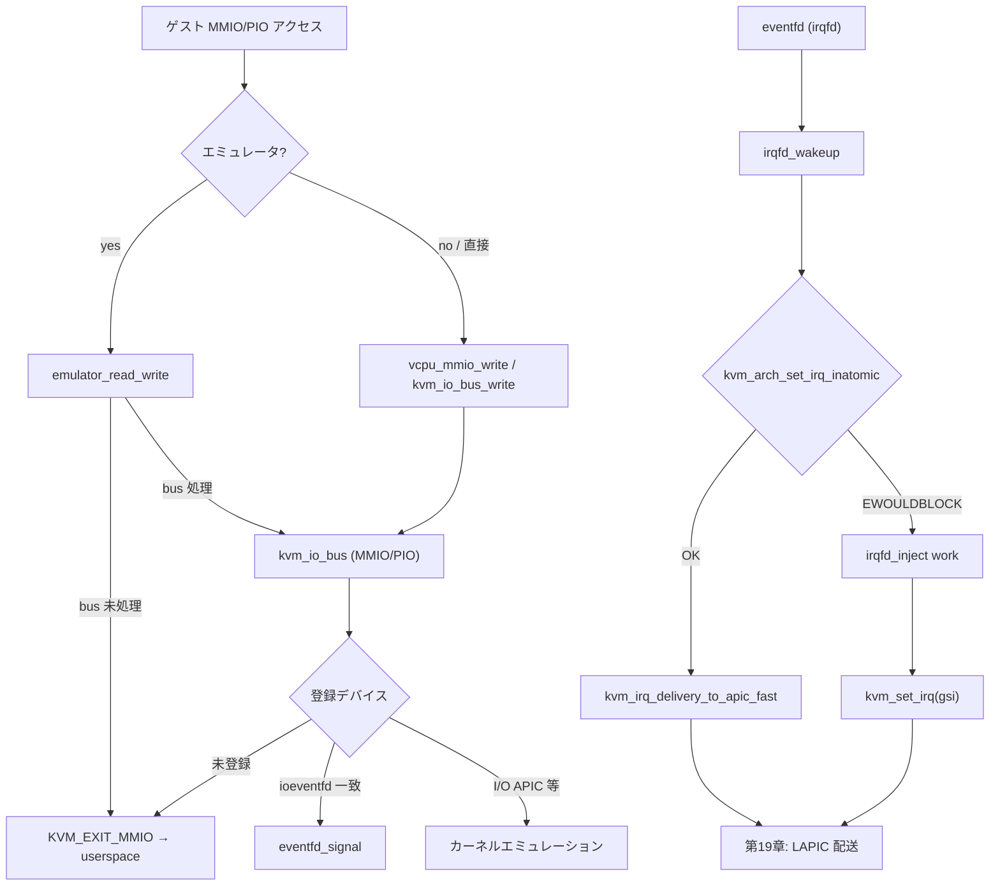

# 第20章 MMIO bus、`ioeventfd`、`irqfd`

> **本章で読むソース**
>
> - [`virt/kvm/kvm_main.c` L5839-L5856](https://github.com/gregkh/linux/blob/v6.18.38/virt/kvm/kvm_main.c#L5839-L5856)
> - [`virt/kvm/kvm_main.c` L5871-L5888](https://github.com/gregkh/linux/blob/v6.18.38/virt/kvm/kvm_main.c#L5871-L5888)
> - [`virt/kvm/kvm_main.c` L5967-L6008](https://github.com/gregkh/linux/blob/v6.18.38/virt/kvm/kvm_main.c#L5967-L6008)
> - [`arch/x86/kvm/x86.c` L7798-L7817](https://github.com/gregkh/linux/blob/v6.18.38/arch/x86/kvm/x86.c#L7798-L7817)
> - [`arch/x86/kvm/x86.c` L8308-L8321](https://github.com/gregkh/linux/blob/v6.18.38/arch/x86/kvm/x86.c#L8308-L8321)
> - [`arch/x86/kvm/x86.c` L11868-L11885](https://github.com/gregkh/linux/blob/v6.18.38/arch/x86/kvm/x86.c#L11868-L11885)
> - [`virt/kvm/eventfd.c` L42-L57](https://github.com/gregkh/linux/blob/v6.18.38/virt/kvm/eventfd.c#L42-L57)
> - [`virt/kvm/eventfd.c` L202-L242](https://github.com/gregkh/linux/blob/v6.18.38/virt/kvm/eventfd.c#L202-L242)
> - [`virt/kvm/eventfd.c` L370-L409](https://github.com/gregkh/linux/blob/v6.18.38/virt/kvm/eventfd.c#L370-L409)
> - [`arch/x86/kvm/vmx/vmx.c` L5779-L5797](https://github.com/gregkh/linux/blob/v6.18.38/arch/x86/kvm/vmx/vmx.c#L5779-L5797)
> - [`virt/kvm/eventfd.c` L805-L816](https://github.com/gregkh/linux/blob/v6.18.38/virt/kvm/eventfd.c#L805-L816)
> - [`virt/kvm/eventfd.c` L862-L909](https://github.com/gregkh/linux/blob/v6.18.38/virt/kvm/eventfd.c#L862-L909)

## この章の狙い

MMIO/PIO デバイスをアドレス順に並べた `kvm_io_bus`、ゲスト書き込みで eventfd を起こす `ioeventfd`、eventfd から GSI へ割り込みを注入する `irqfd` を読む。
カーネル内デバイスで処理できないアクセスが `KVM_EXIT_MMIO` で userspace に戻る経路も押さえる。

## 前提

- [irqchip、LAPIC、割り込み注入](19-irqchip-lapic-injection.md)
- [命令エミュレーション](../part04-x86-common/13-instruction-emulation.md)
- [`KVM_RUN` と vCPU 実行ループ](../part01-kvm-core/05-kvm-run-execution-loop.md)

## MMIO bus：`kvm_io_bus_write`

`kvm->buses[]` は MMIO、PIO、fast MMIO 等のバスごとに `kvm_io_range` 配列を SRCU で公開する。
`kvm_io_bus_write` はアドレス範囲に一致するデバイスを順に試し、最初に成功した `kvm_io_device` で書き込みを完了する。

[`virt/kvm/kvm_main.c` L5839-L5856](https://github.com/gregkh/linux/blob/v6.18.38/virt/kvm/kvm_main.c#L5839-L5856)

```c
static int __kvm_io_bus_write(struct kvm_vcpu *vcpu, struct kvm_io_bus *bus,
			      struct kvm_io_range *range, const void *val)
{
	int idx;

	idx = kvm_io_bus_get_first_dev(bus, range->addr, range->len);
	if (idx < 0)
		return -EOPNOTSUPP;

	while (idx < bus->dev_count &&
		kvm_io_bus_cmp(range, &bus->range[idx]) == 0) {
		if (!kvm_iodevice_write(vcpu, bus->range[idx].dev, range->addr,
					range->len, val))
			return idx;
		idx++;
	}

	return -EOPNOTSUPP;
}
```

[`virt/kvm/kvm_main.c` L5871-L5888](https://github.com/gregkh/linux/blob/v6.18.38/virt/kvm/kvm_main.c#L5871-L5888)

```c
int kvm_io_bus_write(struct kvm_vcpu *vcpu, enum kvm_bus bus_idx, gpa_t addr,
		     int len, const void *val)
{
	struct kvm_io_bus *bus;
	struct kvm_io_range range;
	int r;

	range = (struct kvm_io_range) {
		.addr = addr,
		.len = len,
	};

	bus = kvm_get_bus_srcu(vcpu->kvm, bus_idx);
	if (!bus)
		return -ENOMEM;
	r = __kvm_io_bus_write(vcpu, bus, &range, val);
	return r < 0 ? r : 0;
}
```

## デバイス登録：`kvm_io_bus_register_dev`

`kvm_io_bus_register_dev` はソート済み `range[]` に新エントリを挿入し、RCU でバス全体を差し替える。
I/O APIC、PIT、irqchip 関連デバイス、`ioeventfd` がここに登録される。

[`virt/kvm/kvm_main.c` L5967-L6008](https://github.com/gregkh/linux/blob/v6.18.38/virt/kvm/kvm_main.c#L5967-L6008)

```c
int kvm_io_bus_register_dev(struct kvm *kvm, enum kvm_bus bus_idx, gpa_t addr,
			    int len, struct kvm_io_device *dev)
{
	int i;
	struct kvm_io_bus *new_bus, *bus;
	struct kvm_io_range range;

	lockdep_assert_held(&kvm->slots_lock);

	bus = kvm_get_bus(kvm, bus_idx);
	if (!bus)
		return -ENOMEM;

	/* exclude ioeventfd which is limited by maximum fd */
	if (bus->dev_count - bus->ioeventfd_count > NR_IOBUS_DEVS - 1)
		return -ENOSPC;

	new_bus = kmalloc(struct_size(bus, range, bus->dev_count + 1),
			  GFP_KERNEL_ACCOUNT);
	if (!new_bus)
		return -ENOMEM;

	range = (struct kvm_io_range) {
		.addr = addr,
		.len = len,
		.dev = dev,
	};

	for (i = 0; i < bus->dev_count; i++)
		if (kvm_io_bus_cmp(&bus->range[i], &range) > 0)
			break;

	memcpy(new_bus, bus, sizeof(*bus) + i * sizeof(struct kvm_io_range));
	new_bus->dev_count++;
	new_bus->range[i] = range;
	memcpy(new_bus->range + i + 1, bus->range + i,
		(bus->dev_count - i) * sizeof(struct kvm_io_range));
	rcu_assign_pointer(kvm->buses[bus_idx], new_bus);
	call_srcu(&kvm->srcu, &bus->rcu, __free_bus);

	return 0;
}
```

## vCPU から bus へ：`vcpu_mmio_write`

x86 の MMIO アクセスは vLAPIC デバイスを先に試し、失敗したら `KVM_MMIO_BUS` 上の登録デバイスへフォールスルーする。
いずれも処理できなければエミュレータが `KVM_EXIT_MMIO` を組み立てる。

[`arch/x86/kvm/x86.c` L7798-L7817](https://github.com/gregkh/linux/blob/v6.18.38/arch/x86/kvm/x86.c#L7798-L7817)

```c
static int vcpu_mmio_write(struct kvm_vcpu *vcpu, gpa_t addr, int len,
			   const void *v)
{
	int handled = 0;
	int n;

	do {
		n = min(len, 8);
		if (!(lapic_in_kernel(vcpu) &&
		      !kvm_iodevice_write(vcpu, &vcpu->arch.apic->dev, addr, n, v))
		    && kvm_io_bus_write(vcpu, KVM_MMIO_BUS, addr, n, v))
			break;
		handled += n;
		addr += n;
		len -= n;
		v += n;
	} while (len);

	return handled;
}
```

## `KVM_EXIT_MMIO` 経路

命令エミュレーション中に MMIO ページへ触れると `emulator_read_write` が `mmio_fragments` を積み、`KVM_EXIT_MMIO` を設定する。
userspace がデータを埋めて再 `KVM_RUN` すると `complete_emulated_mmio` が残りフラグメントを処理する。

エミュレータが最初のフラグメントで userspace に戻る箇所は次のとおりである。

[`arch/x86/kvm/x86.c` L8308-L8321](https://github.com/gregkh/linux/blob/v6.18.38/arch/x86/kvm/x86.c#L8308-L8321)

```c
	if (!vcpu->mmio_nr_fragments)
		return X86EMUL_CONTINUE;

	gpa = vcpu->mmio_fragments[0].gpa;

	vcpu->mmio_needed = 1;
	vcpu->mmio_cur_fragment = 0;

	vcpu->run->mmio.len = min(8u, vcpu->mmio_fragments[0].len);
	vcpu->run->mmio.is_write = vcpu->mmio_is_write = ops->write;
	vcpu->run->exit_reason = KVM_EXIT_MMIO;
	vcpu->run->mmio.phys_addr = gpa;

	return ops->read_write_exit_mmio(vcpu, gpa, val, bytes);
```

複数フラグメントの途中でも、未処理片が残れば同様に `KVM_EXIT_MMIO` が返る。

[`arch/x86/kvm/x86.c` L11868-L11885](https://github.com/gregkh/linux/blob/v6.18.38/arch/x86/kvm/x86.c#L11868-L11885)

```c
	if (vcpu->mmio_cur_fragment >= vcpu->mmio_nr_fragments) {
		vcpu->mmio_needed = 0;

		/* FIXME: return into emulator if single-stepping.  */
		if (vcpu->mmio_is_write)
			return 1;
		vcpu->mmio_read_completed = 1;
		return complete_emulated_io(vcpu);
	}

	run->exit_reason = KVM_EXIT_MMIO;
	run->mmio.phys_addr = frag->gpa;
	if (vcpu->mmio_is_write)
		memcpy(run->mmio.data, frag->data, min(8u, frag->len));
	run->mmio.len = min(8u, frag->len);
	run->mmio.is_write = vcpu->mmio_is_write;
	vcpu->arch.complete_userspace_io = complete_emulated_mmio;
	return 0;
```

VMX では zero-length `ioeventfd` 用の特殊 MMIO SPTE により EPT misconfig が起き、`handle_ept_misconfig` が `KVM_FAST_MMIO_BUS` を試す。
到達時点では既に VM-exit 済みであり、省くのは通常の page fault 処理、命令エミュレーション、userspace への MMIO exit である。

[`arch/x86/kvm/vmx/vmx.c` L5779-L5797](https://github.com/gregkh/linux/blob/v6.18.38/arch/x86/kvm/vmx/vmx.c#L5779-L5797)

```c
static int handle_ept_misconfig(struct kvm_vcpu *vcpu)
{
	gpa_t gpa;

	if (vmx_check_emulate_instruction(vcpu, EMULTYPE_PF, NULL, 0))
		return 1;

	/*
	 * A nested guest cannot optimize MMIO vmexits, because we have an
	 * nGPA here instead of the required GPA.
	 */
	gpa = vmcs_read64(GUEST_PHYSICAL_ADDRESS);
	if (!is_guest_mode(vcpu) &&
	    !kvm_io_bus_write(vcpu, KVM_FAST_MMIO_BUS, gpa, 0, NULL)) {
		trace_kvm_fast_mmio(gpa);
		return kvm_skip_emulated_instruction(vcpu);
	}

	return kvm_mmu_page_fault(vcpu, gpa, PFERR_RSVD_MASK, NULL, 0);
}
```

## `ioeventfd`：ゲスト書き込みで eventfd を起こす

`KVM_IOEVENTFD` ioctl は GPA（または PIO）と datamatch を登録し、一致するゲスト書き込みで `eventfd_signal` する。
`ioeventfd_write` は範囲と値を検査し、ヒット時に `eventfd_signal` する。

[`virt/kvm/eventfd.c` L805-L816](https://github.com/gregkh/linux/blob/v6.18.38/virt/kvm/eventfd.c#L805-L816)

```c
static int
ioeventfd_write(struct kvm_vcpu *vcpu, struct kvm_io_device *this, gpa_t addr,
		int len, const void *val)
{
	struct _ioeventfd *p = to_ioeventfd(this);

	if (!ioeventfd_in_range(p, addr, len, val))
		return -EOPNOTSUPP;

	eventfd_signal(p->eventfd);
	return 0;
}
```

登録は `kvm_assign_ioeventfd_idx` が `kvm_io_bus_register_dev` を呼び、`kvm->ioeventfds` リストへ紐づける。

[`virt/kvm/eventfd.c` L862-L909](https://github.com/gregkh/linux/blob/v6.18.38/virt/kvm/eventfd.c#L862-L909)

```c
static int kvm_assign_ioeventfd_idx(struct kvm *kvm,
				enum kvm_bus bus_idx,
				struct kvm_ioeventfd *args)
{

	struct eventfd_ctx *eventfd;
	struct _ioeventfd *p;
	int ret;

	eventfd = eventfd_ctx_fdget(args->fd);
	if (IS_ERR(eventfd))
		return PTR_ERR(eventfd);

	p = kzalloc(sizeof(*p), GFP_KERNEL_ACCOUNT);
	if (!p) {
		ret = -ENOMEM;
		goto fail;
	}

	INIT_LIST_HEAD(&p->list);
	p->addr    = args->addr;
	p->bus_idx = bus_idx;
	p->length  = args->len;
	p->eventfd = eventfd;

	/* The datamatch feature is optional, otherwise this is a wildcard */
	if (args->flags & KVM_IOEVENTFD_FLAG_DATAMATCH)
		p->datamatch = args->datamatch;
	else
		p->wildcard = true;

	mutex_lock(&kvm->slots_lock);

	/* Verify that there isn't a match already */
	if (ioeventfd_check_collision(kvm, p)) {
		ret = -EEXIST;
		goto unlock_fail;
	}

	kvm_iodevice_init(&p->dev, &ioeventfd_ops);

	ret = kvm_io_bus_register_dev(kvm, bus_idx, p->addr, p->length,
				      &p->dev);
	if (ret < 0)
		goto unlock_fail;

	kvm_get_bus(kvm, bus_idx)->ioeventfd_count++;
	list_add_tail(&p->list, &kvm->ioeventfds);
```

virtio の kick や vhost の通知は、この仕組みでホスト側ワーカーを起こす。

## `irqfd`：eventfd から GSI へ割り込み注入

`KVM_IRQFD` は eventfd を GSI に結び、シグナル時に atomic 注入を試み、失敗時は workqueue 経由で `kvm_set_irq` する。
`irqfd_inject` work は assert/deassert の二段パルス、resampler 付きでは level 維持と ack 通知を担う。

[`virt/kvm/eventfd.c` L42-L57](https://github.com/gregkh/linux/blob/v6.18.38/virt/kvm/eventfd.c#L42-L57)

```c
static void
irqfd_inject(struct work_struct *work)
{
	struct kvm_kernel_irqfd *irqfd =
		container_of(work, struct kvm_kernel_irqfd, inject);
	struct kvm *kvm = irqfd->kvm;

	if (!irqfd->resampler) {
		kvm_set_irq(kvm, KVM_USERSPACE_IRQ_SOURCE_ID, irqfd->gsi, 1,
				false);
		kvm_set_irq(kvm, KVM_USERSPACE_IRQ_SOURCE_ID, irqfd->gsi, 0,
				false);
	} else
		kvm_set_irq(kvm, KVM_IRQFD_RESAMPLE_IRQ_SOURCE_ID,
			    irqfd->gsi, 1, false);
}
```

`irqfd_wakeup` は eventfd の poll コールバックとして動き、atomic 注入を試み、ブロック時は workqueue へ落とす。

[`virt/kvm/eventfd.c` L202-L242](https://github.com/gregkh/linux/blob/v6.18.38/virt/kvm/eventfd.c#L202-L242)

```c
static int
irqfd_wakeup(wait_queue_entry_t *wait, unsigned mode, int sync, void *key)
{
	struct kvm_kernel_irqfd *irqfd =
		container_of(wait, struct kvm_kernel_irqfd, wait);
	__poll_t flags = key_to_poll(key);
	struct kvm_kernel_irq_routing_entry irq;
	struct kvm *kvm = irqfd->kvm;
	unsigned seq;
	int idx;
	int ret = 0;

	if (flags & EPOLLIN) {
		/*
		 * WARNING: Do NOT take irqfds.lock in any path except EPOLLHUP,
		 * as KVM holds irqfds.lock when registering the irqfd with the
		 * eventfd.
		 */
		u64 cnt;
		eventfd_ctx_do_read(irqfd->eventfd, &cnt);

		idx = srcu_read_lock(&kvm->irq_srcu);
		do {
			seq = read_seqcount_begin(&irqfd->irq_entry_sc);
			irq = irqfd->irq_entry;
		} while (read_seqcount_retry(&irqfd->irq_entry_sc, seq));

		/*
		 * An event has been signaled, inject an interrupt unless the
		 * irqfd is being deassigned (isn't active), in which case the
		 * routing information may be stale (once the irqfd is removed
		 * from the list, it will stop receiving routing updates).
		 */
		if (unlikely(!irqfd_is_active(irqfd)) ||
		    kvm_arch_set_irq_inatomic(&irq, kvm,
					      KVM_USERSPACE_IRQ_SOURCE_ID, 1,
					      false) == -EWOULDBLOCK)
			schedule_work(&irqfd->inject);
		srcu_read_unlock(&kvm->irq_srcu, idx);
		ret = 1;
	}
```

`kvm_irqfd_assign` は routing 情報を先に整え、eventfd の wait queue へ priority waiter として登録する。

[`virt/kvm/eventfd.c` L370-L409](https://github.com/gregkh/linux/blob/v6.18.38/virt/kvm/eventfd.c#L370-L409)

```c
static int
kvm_irqfd_assign(struct kvm *kvm, struct kvm_irqfd *args)
{
	struct kvm_kernel_irqfd *irqfd;
	struct eventfd_ctx *eventfd = NULL, *resamplefd = NULL;
	struct kvm_irqfd_pt irqfd_pt;
	int ret;
	__poll_t events;
	int idx;

	if (!kvm_arch_intc_initialized(kvm))
		return -EAGAIN;

	if (!kvm_arch_irqfd_allowed(kvm, args))
		return -EINVAL;

	irqfd = kzalloc(sizeof(*irqfd), GFP_KERNEL_ACCOUNT);
	if (!irqfd)
		return -ENOMEM;

	irqfd->kvm = kvm;
	irqfd->gsi = args->gsi;
	INIT_LIST_HEAD(&irqfd->list);
	INIT_WORK(&irqfd->inject, irqfd_inject);
	INIT_WORK(&irqfd->shutdown, irqfd_shutdown);
	seqcount_spinlock_init(&irqfd->irq_entry_sc, &kvm->irqfds.lock);

	CLASS(fd, f)(args->fd);
	if (fd_empty(f)) {
		ret = -EBADF;
		goto out;
	}

	eventfd = eventfd_ctx_fileget(fd_file(f));
	if (IS_ERR(eventfd)) {
		ret = PTR_ERR(eventfd);
		goto out;
	}

	irqfd->eventfd = eventfd;
```

irqfd は atomic 成功時は `kvm_irq_delivery_to_apic_fast` 経由で第19章の LAPIC 配送へ届き、`-EWOULDBLOCK` 時は `kvm_set_irq` 経由で合流する。

## 処理の流れ：MMIO と eventfd



## 高速化と最適化の工夫

`kvm_io_bus` はアドレス順ソートと二分探索でデバイス検索を行い、SRCU でロックレス読み取りを可能にする。
`ioeventfd` はゲストの MMIO 書き込みをカーネル内で `eventfd_signal` へ変換し、`KVM_EXIT_MMIO` と userspace デバイスエミュレーションを省略する。
`irqfd_wakeup` は MSI 等を `kvm_arch_set_irq_inatomic` で `kvm_irq_delivery_to_apic_fast` へ直接注入し、`-EWOULDBLOCK` 時のみ `irqfd_inject` work 経由で `kvm_set_irq` を使う。
`KVM_FAST_MMIO_BUS` は `handle_ept_misconfig` 経由で ioeventfd を処理し、通常の page fault や userspace MMIO exit を省略する。

## まとめ

`kvm_io_bus_register_dev` が MMIO/PIO デバイスをアドレス順に載せ、`kvm_io_bus_write` がゲストアクセスを配線する。
カーネルにハンドラがなければ `KVM_EXIT_MMIO` で userspace デバイスモデルへ委譲する。
`ioeventfd` はゲスト書き込みを eventfd へ、`irqfd` は eventfd を GSI 割り込みへつなぐ。

## 関連する章

- [irqchip、LAPIC、割り込み注入](19-irqchip-lapic-injection.md)
- [命令エミュレーション](../part04-x86-common/13-instruction-emulation.md)
- [`KVM_RUN` と vCPU 実行ループ](../part01-kvm-core/05-kvm-run-execution-loop.md)
