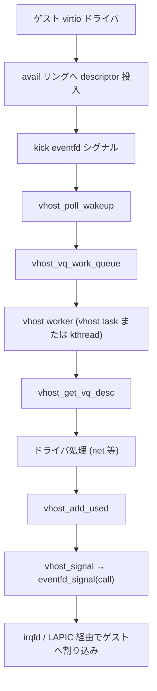

# 第21章 vhost フレームワークと virtqueue

> **本章で読むソース**
>
> - [`drivers/vhost/vhost.h` L80-L166](https://github.com/gregkh/linux/blob/v6.18.38/drivers/vhost/vhost.h#L80-L166)
> - [`drivers/vhost/vhost.h` L177-L206](https://github.com/gregkh/linux/blob/v6.18.38/drivers/vhost/vhost.h#L177-L206)
> - [`drivers/vhost/vhost.c` L584-L626](https://github.com/gregkh/linux/blob/v6.18.38/drivers/vhost/vhost.c#L584-L626)
> - [`drivers/vhost/vhost.c` L831-L859](https://github.com/gregkh/linux/blob/v6.18.38/drivers/vhost/vhost.c#L831-L859)
> - [`drivers/vhost/vhost.c` L1097-L1128](https://github.com/gregkh/linux/blob/v6.18.38/drivers/vhost/vhost.c#L1097-L1128)
> - [`drivers/vhost/vhost.c` L172-L187](https://github.com/gregkh/linux/blob/v6.18.38/drivers/vhost/vhost.c#L172-L187)
> - [`drivers/vhost/vhost.c` L400-L436](https://github.com/gregkh/linux/blob/v6.18.38/drivers/vhost/vhost.c#L400-L436)
> - [`drivers/vhost/vhost.c` L2192-L2220](https://github.com/gregkh/linux/blob/v6.18.38/drivers/vhost/vhost.c#L2192-L2220)
> - [`drivers/vhost/vhost.c` L2820-L2948](https://github.com/gregkh/linux/blob/v6.18.38/drivers/vhost/vhost.c#L2820-L2948)
> - [`drivers/vhost/vhost.c` L3173-L3188](https://github.com/gregkh/linux/blob/v6.18.38/drivers/vhost/vhost.c#L3173-L3188)

## この章の狙い

virtio の virtqueue をカーネル内で直接処理する vhost フレームワークを読む。
`vhost_dev` と `vhost_virtqueue`、vring の desc/avail/used、`vhost_get_vq_desc`、eventfd による kick/call、vhost worker（vhost task または kthread）の役割を押さえる。
本分冊では `vhost-scsi` や `vdpa` の個別実装は境界に留め、`vhost.c` の共通機構を主題とする。

## 前提

- [MMIO bus、`ioeventfd`、`irqfd`](../part07-irq-io/20-mmio-ioeventfd-irqfd.md)
- [`KVM_RUN` と vCPU 実行ループ](../part01-kvm-core/05-kvm-run-execution-loop.md)

## vhost の位置づけ

通常の virtio はゲストが kick すると userspace VMM が virtqueue を処理し、完了後にゲストへ割り込みを注入する。
vhost は同じ virtio 契約を保ちつつ、descriptor の取り出しとバッファ処理をカーネル worker へ移す。
QEMU 等は `/dev/vhost-net` 等を開き、ゲストメモリのマッピングと eventfd の配線を ioctl で行う。

## `vhost_dev` と `vhost_virtqueue`

`vhost_dev` はデバイス全体の mutex、virtqueue 配列、ゲストメモリ IOTLB、worker 集合を持つ。
各 `vhost_virtqueue` は userspace が mmap した vring へのポインタと kick/call 用 eventfd を保持する。

[`drivers/vhost/vhost.h` L80-L106](https://github.com/gregkh/linux/blob/v6.18.38/drivers/vhost/vhost.h#L80-L106)

```c
enum vhost_uaddr_type {
	VHOST_ADDR_DESC = 0,
	VHOST_ADDR_AVAIL = 1,
	VHOST_ADDR_USED = 2,
	VHOST_NUM_ADDRS = 3,
};

struct vhost_vring_call {
	struct eventfd_ctx *ctx;
	struct irq_bypass_producer producer;
};

/* The virtqueue structure describes a queue attached to a device. */
struct vhost_virtqueue {
	struct vhost_dev *dev;
	struct vhost_worker __rcu *worker;

	/* The actual ring of buffers. */
	struct mutex mutex;
	unsigned int num;
	vring_desc_t __user *desc;
	vring_avail_t __user *avail;
	vring_used_t __user *used;
	const struct vhost_iotlb_map *meta_iotlb[VHOST_NUM_ADDRS];
	struct file *kick;
	struct vhost_vring_call call_ctx;
	struct eventfd_ctx *error_ctx;
```

`VHOST_ADDR_DESC` / `AVAIL` / `USED` は vring 三領域を IOTLB 上の別アドレスとして追跡するための区分である。
`kick` はゲストが新バッファを投入した通知、`call_ctx.ctx` はホスト処理完了をゲストへ知らせる通知に使う。

[`drivers/vhost/vhost.h` L177-L206](https://github.com/gregkh/linux/blob/v6.18.38/drivers/vhost/vhost.h#L177-L206)

```c
struct vhost_dev {
	struct mm_struct *mm;
	struct mutex mutex;
	struct vhost_virtqueue **vqs;
	int nvqs;
	struct eventfd_ctx *log_ctx;
	struct vhost_iotlb *umem;
	struct vhost_iotlb *iotlb;
	spinlock_t iotlb_lock;
	struct list_head read_list;
	struct list_head pending_list;
	wait_queue_head_t wait;
	int iov_limit;
	int weight;
	int byte_weight;
	struct xarray worker_xa;
	bool use_worker;
	/*
	 * If fork_owner is true we use vhost_tasks to create
	 * the worker so all settings/limits like cgroups, NPROC,
	 * scheduler, etc are inherited from the owner. If false,
	 * we use kthreads and only attach to the same cgroups
	 * as the owner for compat with older kernels.
	 * here we use true as default value.
	 * The default value is set by fork_from_owner_default
	 */
	bool fork_owner;
	int (*msg_handler)(struct vhost_dev *dev, u32 asid,
			   struct vhost_iotlb_msg *msg);
};
```

`vhost_dev_init` は virtqueue ごとに mutex と poll 構造を初期化し、`handle_kick` が設定されていれば kick 用 poll を登録する。

[`drivers/vhost/vhost.c` L584-L626](https://github.com/gregkh/linux/blob/v6.18.38/drivers/vhost/vhost.c#L584-L626)

```c
void vhost_dev_init(struct vhost_dev *dev,
		    struct vhost_virtqueue **vqs, int nvqs,
		    int iov_limit, int weight, int byte_weight,
		    bool use_worker,
		    int (*msg_handler)(struct vhost_dev *dev, u32 asid,
				       struct vhost_iotlb_msg *msg))
{
	struct vhost_virtqueue *vq;
	int i;

	dev->vqs = vqs;
	dev->nvqs = nvqs;
	mutex_init(&dev->mutex);
	dev->log_ctx = NULL;
	dev->umem = NULL;
	dev->iotlb = NULL;
	dev->mm = NULL;
	dev->iov_limit = iov_limit;
	dev->weight = weight;
	dev->byte_weight = byte_weight;
	dev->use_worker = use_worker;
	dev->msg_handler = msg_handler;
	dev->fork_owner = fork_from_owner_default;
	init_waitqueue_head(&dev->wait);
	INIT_LIST_HEAD(&dev->read_list);
	INIT_LIST_HEAD(&dev->pending_list);
	spin_lock_init(&dev->iotlb_lock);
	xa_init_flags(&dev->worker_xa, XA_FLAGS_ALLOC);

	for (i = 0; i < dev->nvqs; ++i) {
		vq = dev->vqs[i];
		vq->log = NULL;
		vq->indirect = NULL;
		vq->heads = NULL;
		vq->nheads = NULL;
		vq->dev = dev;
		mutex_init(&vq->mutex);
		vhost_vq_reset(dev, vq);
		if (vq->handle_kick)
			vhost_poll_init(&vq->poll, vq->handle_kick,
					EPOLLIN, dev, vq);
	}
}
```

## vring：desc、avail、used

virtio の split virtqueue は次の三領域で構成される。

- `desc`：各 descriptor の guest 物理アドレス、長さ、フラグ、次 descriptor へのリンク
- `avail`：ゲストがホストへ渡す descriptor チェーンの head インデックス列
- `used`：ホストが処理完了した descriptor と書き込み長の記録

vhost は `last_avail_idx` で avail リングの消費位置を、`last_used_idx` で used リングの書き込み位置を追跡する。
`vhost_disable_notify` / `vhost_enable_notify` はバッチ処理中の不要なゲスト通知を抑えるために `VRING_USED_F_NO_NOTIFY` を操作する。

## `vhost_get_vq_desc`：descriptor チェーンの取り出し

`vhost_get_vq_desc` は avail から 1 本の descriptor チェーンを取り出し、ゲストアドレスをホスト `iovec` へ変換する。
出力 descriptor が入力より前に来る、ループする、インデックスが範囲外といった異常はエラーとして拒否する。

[`drivers/vhost/vhost.c` L2820-L2948](https://github.com/gregkh/linux/blob/v6.18.38/drivers/vhost/vhost.c#L2820-L2948)

```c
int vhost_get_vq_desc_n(struct vhost_virtqueue *vq,
			struct iovec iov[], unsigned int iov_size,
			unsigned int *out_num, unsigned int *in_num,
			struct vhost_log *log, unsigned int *log_num,
			unsigned int *ndesc)
{
	bool in_order = vhost_has_feature(vq, VIRTIO_F_IN_ORDER);
	struct vring_desc desc;
	unsigned int i, head, found = 0;
	u16 last_avail_idx = vq->last_avail_idx;
	__virtio16 ring_head;
	int ret, access, c = 0;

	if (vq->avail_idx == vq->last_avail_idx) {
		ret = vhost_get_avail_idx(vq);
		if (unlikely(ret < 0))
			return ret;

		if (!ret)
			return vq->num;
	}

	if (in_order)
		head = vq->next_avail_head & (vq->num - 1);
	else {
		/* Grab the next descriptor number they're
		 * advertising, and increment the index we've seen. */
		if (unlikely(vhost_get_avail_head(vq, &ring_head,
						  last_avail_idx))) {
			vq_err(vq, "Failed to read head: idx %d address %p\n",
				last_avail_idx,
				&vq->avail->ring[last_avail_idx % vq->num]);
			return -EFAULT;
		}
		head = vhost16_to_cpu(vq, ring_head);
	}

	/* If their number is silly, that's an error. */
	if (unlikely(head >= vq->num)) {
		vq_err(vq, "Guest says index %u > %u is available",
		       head, vq->num);
		return -EINVAL;
	}

	/* When we start there are none of either input nor output. */
	*out_num = *in_num = 0;
	if (unlikely(log))
		*log_num = 0;

	i = head;
	do {
		unsigned iov_count = *in_num + *out_num;
		if (unlikely(i >= vq->num)) {
			vq_err(vq, "Desc index is %u > %u, head = %u",
			       i, vq->num, head);
			return -EINVAL;
		}
		if (unlikely(++found > vq->num)) {
			vq_err(vq, "Loop detected: last one at %u "
			       "vq size %u head %u\n",
			       i, vq->num, head);
			return -EINVAL;
		}
		ret = vhost_get_desc(vq, &desc, i);
		if (unlikely(ret)) {
			vq_err(vq, "Failed to get descriptor: idx %d addr %p\n",
			       i, vq->desc + i);
			return -EFAULT;
		}
		if (desc.flags & cpu_to_vhost16(vq, VRING_DESC_F_INDIRECT)) {
			ret = get_indirect(vq, iov, iov_size,
					   out_num, in_num,
					   log, log_num, &desc);
			if (unlikely(ret < 0)) {
				if (ret != -EAGAIN)
					vq_err(vq, "Failure detected "
						"in indirect descriptor at idx %d\n", i);
				return ret;
			}
			++c;
			continue;
		}

		if (desc.flags & cpu_to_vhost16(vq, VRING_DESC_F_WRITE))
			access = VHOST_ACCESS_WO;
		else
			access = VHOST_ACCESS_RO;
		ret = translate_desc(vq, vhost64_to_cpu(vq, desc.addr),
				     vhost32_to_cpu(vq, desc.len), iov + iov_count,
				     iov_size - iov_count, access);
		if (unlikely(ret < 0)) {
			if (ret != -EAGAIN)
				vq_err(vq, "Translation failure %d descriptor idx %d\n",
					ret, i);
			return ret;
		}
		if (access == VHOST_ACCESS_WO) {
			/* If this is an input descriptor,
			 * increment that count. */
			*in_num += ret;
			if (unlikely(log && ret)) {
				log[*log_num].addr = vhost64_to_cpu(vq, desc.addr);
				log[*log_num].len = vhost32_to_cpu(vq, desc.len);
				++*log_num;
			}
		} else {
			/* If it's an output descriptor, they're all supposed
			 * to come before any input descriptors. */
			if (unlikely(*in_num)) {
				vq_err(vq, "Descriptor has out after in: "
				       "idx %d\n", i);
				return -EINVAL;
			}
			*out_num += ret;
		}
		++c;
	} while ((i = next_desc(vq, &desc)) != -1);

	/* On success, increment avail index. */
	vq->last_avail_idx++;
	vq->next_avail_head += c;

	if (ndesc)
		*ndesc = c;

	/* Assume notifications from guest are disabled at this point,
	 * if they aren't we would need to update avail_event index. */
	BUG_ON(!(vq->used_flags & VRING_USED_F_NO_NOTIFY));
	return head;
}
```

`translate_desc` が各 descriptor をホスト `iovec` へ変換する。
`VRING_DESC_F_INDIRECT` は `get_indirect` で展開し、write descriptor の後に read descriptor が現れたら `-EINVAL` で拒否する。
チェーン長と `next_desc` のループ検査に加え、成功時は `last_avail_idx` を進める。
処理に失敗した場合は `vhost_discard_vq_desc` で `last_avail_idx` と `next_avail_head` を巻き戻せる。

## eventfd による kick と call

`VHOST_SET_VRING_KICK` はゲスト kick 用 eventfd を `vq->kick` に結び、`vhost_poll_start` で wait queue へ登録する。
`VHOST_SET_VRING_CALL` は処理完了通知用 eventfd を `call_ctx.ctx` に結ぶ。

[`drivers/vhost/vhost.c` L2192-L2220](https://github.com/gregkh/linux/blob/v6.18.38/drivers/vhost/vhost.c#L2192-L2220)

```c
	case VHOST_SET_VRING_KICK:
		if (copy_from_user(&f, argp, sizeof f)) {
			r = -EFAULT;
			break;
		}
		eventfp = f.fd == VHOST_FILE_UNBIND ? NULL : eventfd_fget(f.fd);
		if (IS_ERR(eventfp)) {
			r = PTR_ERR(eventfp);
			break;
		}
		if (eventfp != vq->kick) {
			pollstop = (filep = vq->kick) != NULL;
			pollstart = (vq->kick = eventfp) != NULL;
		} else
			filep = eventfp;
		break;
	case VHOST_SET_VRING_CALL:
		if (copy_from_user(&f, argp, sizeof f)) {
			r = -EFAULT;
			break;
		}
		ctx = f.fd == VHOST_FILE_UNBIND ? NULL : eventfd_ctx_fdget(f.fd);
		if (IS_ERR(ctx)) {
			r = PTR_ERR(ctx);
			break;
		}

		swap(ctx, vq->call_ctx.ctx);
		break;
```

kick eventfd がシグナルされると `vhost_poll_wakeup` が `handle_kick` 相当の work を worker へ積む。
処理完了後は `vhost_add_used` で used リングへ書き込み、`vhost_signal` が call eventfd を起こす。

[`drivers/vhost/vhost.c` L3173-L3188](https://github.com/gregkh/linux/blob/v6.18.38/drivers/vhost/vhost.c#L3173-L3188)

```c
void vhost_signal(struct vhost_dev *dev, struct vhost_virtqueue *vq)
{
	/* Signal the Guest tell them we used something up. */
	if (vq->call_ctx.ctx && vhost_notify(dev, vq))
		eventfd_signal(vq->call_ctx.ctx);
}
EXPORT_SYMBOL_GPL(vhost_signal);

/* And here's the combo meal deal.  Supersize me! */
void vhost_add_used_and_signal(struct vhost_dev *dev,
			       struct vhost_virtqueue *vq,
			       unsigned int head, int len)
{
	vhost_add_used(vq, head, len);
	vhost_signal(dev, vq);
}
```

`vhost_notify` は `VIRTIO_RING_F_EVENT_IDX` や `VRING_AVAIL_F_NO_INTERRUPT` を見て、本当にゲストへ割り込みが要るか判定する。

## vhost worker（vhost task または kthread）

`VHOST_SET_OWNER` で owner の `mm` を借用し、`use_worker` が真なら `vhost_worker_create` が worker を起動する。
v6.18.38 の既定は `fork_owner=true` で `vhost_task_ops` による vhost task が選ばれ、cgroup やスケジューラ設定を owner から継承する。
`fork_owner=false` の互換経路では kthread を使い、owner と同じ cgroup にのみ付ける。
各 virtqueue は `vq->worker` 経由で work を enqueue し、worker が `work->fn` を実行する。

[`drivers/vhost/vhost.c` L831-L859](https://github.com/gregkh/linux/blob/v6.18.38/drivers/vhost/vhost.c#L831-L859)

```c
static struct vhost_worker *vhost_worker_create(struct vhost_dev *dev)
{
	struct vhost_worker *worker;
	char name[TASK_COMM_LEN];
	int ret;
	const struct vhost_worker_ops *ops = dev->fork_owner ? &vhost_task_ops :
							       &kthread_ops;

	worker = kzalloc(sizeof(*worker), GFP_KERNEL_ACCOUNT);
	if (!worker)
		return NULL;

	worker->dev = dev;
	worker->ops = ops;
	snprintf(name, sizeof(name), "vhost-%d", current->pid);

	mutex_init(&worker->mutex);
	init_llist_head(&worker->work_list);
	worker->kcov_handle = kcov_common_handle();
	ret = ops->create(worker, dev, name);
	if (ret < 0)
		goto free_worker;

	return worker;

free_worker:
	kfree(worker);
	return NULL;
}
```

[`drivers/vhost/vhost.c` L1097-L1128](https://github.com/gregkh/linux/blob/v6.18.38/drivers/vhost/vhost.c#L1097-L1128)

```c
long vhost_dev_set_owner(struct vhost_dev *dev)
{
	struct vhost_worker *worker;
	int err, i;

	/* Is there an owner already? */
	if (vhost_dev_has_owner(dev)) {
		err = -EBUSY;
		goto err_mm;
	}

	vhost_attach_mm(dev);

	err = vhost_dev_alloc_iovecs(dev);
	if (err)
		goto err_iovecs;

	if (dev->use_worker) {
		/*
		 * This should be done last, because vsock can queue work
		 * before VHOST_SET_OWNER so it simplifies the failure path
		 * below since we don't have to worry about vsock queueing
		 * while we free the worker.
		 */
		worker = vhost_worker_create(dev);
		if (!worker) {
			err = -ENOMEM;
			goto err_worker;
		}

		for (i = 0; i < dev->nvqs; i++)
			__vhost_vq_attach_worker(dev->vqs[i], worker);
	}
```

kthread 実装では `vhost_run_work_kthread_list` が `llist` から work を取り出し、owner の address space 上でコールバックを実行する。

[`drivers/vhost/vhost.c` L400-L431](https://github.com/gregkh/linux/blob/v6.18.38/drivers/vhost/vhost.c#L400-L431)

```c
static int vhost_run_work_kthread_list(void *data)
{
	struct vhost_worker *worker = data;
	struct vhost_work *work, *work_next;
	struct vhost_dev *dev = worker->dev;
	struct llist_node *node;

	kthread_use_mm(dev->mm);

	for (;;) {
		/* mb paired w/ kthread_stop */
		set_current_state(TASK_INTERRUPTIBLE);

		if (kthread_should_stop()) {
			__set_current_state(TASK_RUNNING);
			break;
		}
		node = llist_del_all(&worker->work_list);
		if (!node)
			schedule();

		node = llist_reverse_order(node);
		/* make sure flag is seen after deletion */
		smp_wmb();
		llist_for_each_entry_safe(work, work_next, node, node) {
			clear_bit(VHOST_WORK_QUEUED, &work->flags);
			__set_current_state(TASK_RUNNING);
			kcov_remote_start_common(worker->kcov_handle);
			work->fn(work);
			kcov_remote_stop();
			cond_resched();
		}
	}
```

`vhost_poll_wakeup` は kick やソケット poll から work を積む入口である。

[`drivers/vhost/vhost.c` L172-L187](https://github.com/gregkh/linux/blob/v6.18.38/drivers/vhost/vhost.c#L172-L187)

```c
static int vhost_poll_wakeup(wait_queue_entry_t *wait, unsigned mode, int sync,
			     void *key)
{
	struct vhost_poll *poll = container_of(wait, struct vhost_poll, wait);
	struct vhost_work *work = &poll->work;

	if (!(key_to_poll(key) & poll->mask))
		return 0;

	if (!poll->dev->use_worker)
		work->fn(work);
	else
		vhost_poll_queue(poll);

	return 0;
}
```

## 処理の流れ：kick から call まで



## 高速化と最適化の工夫

vhost は userspace VMM を介さず virtqueue を処理し、VM exit と context switch を減らす。
`vhost_disable_notify` によるバッチ処理と `vhost_notify` による event idx 判定で不要な call を抑える。
`vhost_exceeds_weight` は 1 回の worker 実行で処理するパケット数とバイト数に上限を設け、他 vCPU への飢餓を防ぐ。
`meta_iotlb` と `vq_meta_prefetch` は vring 三領域の IOTLB 解決をキャッシュし、ゲストメモリアクセスのコストを下げる。
`fork_owner` と vhost_task 経路は worker に cgroup やスケジューラ設定を owner から継承させる。

## まとめ

`vhost_dev` / `vhost_virtqueue` が vring と eventfd、worker を束ね、virtio のデータ面をカーネルへ移す。
`vhost_get_vq_desc` が avail から descriptor チェーンを `iovec` へ展開し、完了後 `vhost_add_used_and_signal` が used 更新と call を行う。
kick/call の eventfd は第20章の `ioeventfd` / `irqfd` と組み合わさり、ゲストとの通知経路を構成する。

## 関連する章

- [MMIO bus、`ioeventfd`、`irqfd`](../part07-irq-io/20-mmio-ioeventfd-irqfd.md)
- [vhost-net データパス](22-vhost-net-datapath.md)
- [`KVM_RUN` と vCPU 実行ループ](../part01-kvm-core/05-kvm-run-execution-loop.md)
