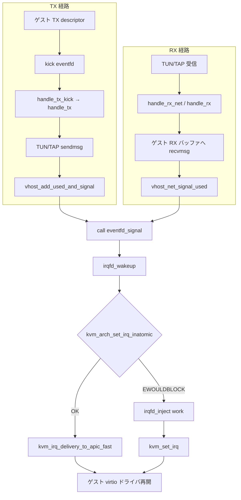

# 第22章 vhost-net データパス

> **本章で読むソース**
>
> - [`drivers/vhost/net.c` L112-L139](https://github.com/gregkh/linux/blob/v6.18.38/drivers/vhost/net.c#L112-L139)
> - [`drivers/vhost/net.c` L365-L389](https://github.com/gregkh/linux/blob/v6.18.38/drivers/vhost/net.c#L365-L389)
> - [`drivers/vhost/net.c` L967-L991](https://github.com/gregkh/linux/blob/v6.18.38/drivers/vhost/net.c#L967-L991)
> - [`drivers/vhost/net.c` L38-L41](https://github.com/gregkh/linux/blob/v6.18.38/drivers/vhost/net.c#L38-L41)
> - [`drivers/vhost/net.c` L340-L353](https://github.com/gregkh/linux/blob/v6.18.38/drivers/vhost/net.c#L340-L353)
> - [`drivers/vhost/net.c` L754-L854](https://github.com/gregkh/linux/blob/v6.18.38/drivers/vhost/net.c#L754-L854)
> - [`drivers/vhost/net.c` L1133-L1287](https://github.com/gregkh/linux/blob/v6.18.38/drivers/vhost/net.c#L1133-L1287)
> - [`drivers/vhost/net.c` L1290-L1387](https://github.com/gregkh/linux/blob/v6.18.38/drivers/vhost/net.c#L1290-L1387)
> - [`drivers/vhost/net.c` L1496-L1526](https://github.com/gregkh/linux/blob/v6.18.38/drivers/vhost/net.c#L1496-L1526)
> - [`drivers/vhost/net.c` L1528-L1579](https://github.com/gregkh/linux/blob/v6.18.38/drivers/vhost/net.c#L1528-L1579)
> - [`virt/kvm/eventfd.c` L491-L501](https://github.com/gregkh/linux/blob/v6.18.38/virt/kvm/eventfd.c#L491-L501)
> - [`arch/x86/kvm/irq.c` L241-L277](https://github.com/gregkh/linux/blob/v6.18.38/arch/x86/kvm/irq.c#L241-L277)
> - [`arch/x86/kvm/irq.c` L475-L496](https://github.com/gregkh/linux/blob/v6.18.38/arch/x86/kvm/irq.c#L475-L496)

## この章の狙い

vhost-net が virtio-net の TX/RX virtqueue を TUN/TAP ソケットへどう接続するかを読む。
`handle_tx` / `handle_rx` のデータパス、zerocopy TX の概観、call eventfd と KVM `irqfd` の連携点を押さえる。

## 前提

- [vhost フレームワークと virtqueue](21-vhost-virtqueue.md)
- [MMIO bus、`ioeventfd`、`irqfd`](../part07-irq-io/20-mmio-ioeventfd-irqfd.md)

## `vhost_net` の構造

`vhost_net` は共通の `vhost_dev` と TX/RX 各 1 本の `vhost_net_virtqueue`、ソケット poll 用 `vhost_poll` を持つ。
TX キューはゲストからのパケットをホストネットワークへ送り、RX キューは受信パケットをゲストバッファへ書き込む。

[`drivers/vhost/net.c` L112-L139](https://github.com/gregkh/linux/blob/v6.18.38/drivers/vhost/net.c#L112-L139)

```c
struct vhost_net_virtqueue {
	struct vhost_virtqueue vq;
	size_t vhost_hlen;
	size_t sock_hlen;
	/* vhost zerocopy support fields below: */
	/* last used idx for outstanding DMA zerocopy buffers */
	int upend_idx;
	/* For TX, first used idx for DMA done zerocopy buffers
	 * For RX, number of batched heads
	 */
	int done_idx;
	/* Number of XDP frames batched */
	int batched_xdp;
	/* an array of userspace buffers info */
	struct ubuf_info_msgzc *ubuf_info;
	/* Reference counting for outstanding ubufs.
	 * Protected by vq mutex. Writers must also take device mutex. */
	struct vhost_net_ubuf_ref *ubufs;
	struct ptr_ring *rx_ring;
	struct vhost_net_buf rxq;
	/* Batched XDP buffs */
	struct xdp_buff *xdp;
};

struct vhost_net {
	struct vhost_dev dev;
	struct vhost_net_virtqueue vqs[VHOST_NET_VQ_MAX];
	struct vhost_poll poll[VHOST_NET_VQ_MAX];
```

## 初期化と kick ハンドラ

`vhost_net_open` は TX/RX virtqueue に `handle_tx_kick` / `handle_rx_kick` を設定し、ソケット方向の `vhost_poll` も登録する。

[`drivers/vhost/net.c` L1358-L1382](https://github.com/gregkh/linux/blob/v6.18.38/drivers/vhost/net.c#L1358-L1382)

```c
	dev = &n->dev;
	vqs[VHOST_NET_VQ_TX] = &n->vqs[VHOST_NET_VQ_TX].vq;
	vqs[VHOST_NET_VQ_RX] = &n->vqs[VHOST_NET_VQ_RX].vq;
	n->vqs[VHOST_NET_VQ_TX].vq.handle_kick = handle_tx_kick;
	n->vqs[VHOST_NET_VQ_RX].vq.handle_kick = handle_rx_kick;
	for (i = 0; i < VHOST_NET_VQ_MAX; i++) {
		n->vqs[i].ubufs = NULL;
		n->vqs[i].ubuf_info = NULL;
		n->vqs[i].upend_idx = 0;
		n->vqs[i].done_idx = 0;
		n->vqs[i].batched_xdp = 0;
		n->vqs[i].vhost_hlen = 0;
		n->vqs[i].sock_hlen = 0;
		n->vqs[i].rx_ring = NULL;
		vhost_net_buf_init(&n->vqs[i].rxq);
	}
	vhost_dev_init(dev, vqs, VHOST_NET_VQ_MAX,
		       UIO_MAXIOV + VHOST_NET_BATCH,
		       VHOST_NET_PKT_WEIGHT, VHOST_NET_WEIGHT, true,
		       NULL);

	vhost_poll_init(n->poll + VHOST_NET_VQ_TX, handle_tx_net, EPOLLOUT, dev,
			vqs[VHOST_NET_VQ_TX]);
	vhost_poll_init(n->poll + VHOST_NET_VQ_RX, handle_rx_net, EPOLLIN, dev,
			vqs[VHOST_NET_VQ_RX]);
```

kick は virtqueue 用、`handle_tx_net` / `handle_rx_net` はバックエンドソケットの送信可能/受信可能イベント用である。

## TUN/TAP との接続

`VHOST_NET_SET_BACKEND` は各 virtqueue に TUN/TAP または raw ソケットを結び付ける。
`get_tap_socket` は `tun_get_socket` と `tap_get_socket` を順に試し、対応する `struct socket` を得る。

[`drivers/vhost/net.c` L1496-L1526](https://github.com/gregkh/linux/blob/v6.18.38/drivers/vhost/net.c#L1496-L1526)

```c
static struct socket *get_tap_socket(int fd)
{
	struct file *file = fget(fd);
	struct socket *sock;

	if (!file)
		return ERR_PTR(-EBADF);
	sock = tun_get_socket(file);
	if (!IS_ERR(sock))
		return sock;
	sock = tap_get_socket(file);
	if (IS_ERR(sock))
		fput(file);
	return sock;
}

static struct socket *get_socket(int fd)
{
	struct socket *sock;

	/* special case to disable backend */
	if (fd == -1)
		return NULL;
	sock = get_raw_socket(fd);
	if (!IS_ERR(sock))
		return sock;
	sock = get_tap_socket(fd);
	if (!IS_ERR(sock))
		return sock;
	return ERR_PTR(-ENOTSOCK);
}
```

`vhost_net_set_backend` はソケット差し替え時に zerocopy 用 `ubufs` を再確保し、`vhost_vq_init_access` で vring アクセスを検証する。

[`drivers/vhost/net.c` L1528-L1579](https://github.com/gregkh/linux/blob/v6.18.38/drivers/vhost/net.c#L1528-L1579)

```c
static long vhost_net_set_backend(struct vhost_net *n, unsigned index, int fd)
{
	struct socket *sock, *oldsock;
	struct vhost_virtqueue *vq;
	struct vhost_net_virtqueue *nvq;
	struct vhost_net_ubuf_ref *ubufs, *oldubufs = NULL;
	int r;

	mutex_lock(&n->dev.mutex);
	r = vhost_dev_check_owner(&n->dev);
	if (r)
		goto err;

	if (index >= VHOST_NET_VQ_MAX) {
		r = -ENOBUFS;
		goto err;
	}
	vq = &n->vqs[index].vq;
	nvq = &n->vqs[index];
	mutex_lock(&vq->mutex);

	if (fd == -1)
		vhost_clear_msg(&n->dev);

	/* Verify that ring has been setup correctly. */
	if (!vhost_vq_access_ok(vq)) {
		r = -EFAULT;
		goto err_vq;
	}
	sock = get_socket(fd);
	if (IS_ERR(sock)) {
		r = PTR_ERR(sock);
		goto err_vq;
	}

	/* start polling new socket */
	oldsock = vhost_vq_get_backend(vq);
	if (sock != oldsock) {
		ubufs = vhost_net_ubuf_alloc(vq,
					     sock && vhost_sock_zcopy(sock));
		if (IS_ERR(ubufs)) {
			r = PTR_ERR(ubufs);
			goto err_ubufs;
		}

		vhost_net_disable_vq(n, vq);
		vhost_vq_set_backend(vq, sock);
		vhost_net_buf_unproduce(nvq);
		r = vhost_vq_init_access(vq);
		if (r)
			goto err_used;
		r = vhost_net_enable_vq(n, vq);
```

RX バックエンドが TAP の ptr_ring を持つ場合、`rx_ring` 経由でバッファ供給を最適化する。

## `handle_tx`：ゲストからホストネットワークへ

`handle_tx` は TX virtqueue の mutex を取り、通知を一時無効化してから copy または zerocopy 経路へ分岐する。

[`drivers/vhost/net.c` L967-L991](https://github.com/gregkh/linux/blob/v6.18.38/drivers/vhost/net.c#L967-L991)

```c
static void handle_tx(struct vhost_net *net)
{
	struct vhost_net_virtqueue *nvq = &net->vqs[VHOST_NET_VQ_TX];
	struct vhost_virtqueue *vq = &nvq->vq;
	struct socket *sock;

	mutex_lock_nested(&vq->mutex, VHOST_NET_VQ_TX);
	sock = vhost_vq_get_backend(vq);
	if (!sock)
		goto out;

	if (!vq_meta_prefetch(vq))
		goto out;

	vhost_disable_notify(&net->dev, vq);
	vhost_net_disable_vq(net, vq);

	if (vhost_sock_zcopy(sock))
		handle_tx_zerocopy(net, sock);
	else
		handle_tx_copy(net, sock);

out:
	mutex_unlock(&vq->mutex);
}
```

`handle_tx_copy` は `get_tx_bufs` で descriptor を取り出し、`sock->ops->sendmsg` で TAP/TUN へ送る。
`-EAGAIN` や `-ENOMEM`、`-ENOBUFS` では `vhost_discard_vq_desc` で descriptor を巻き戻し、次の kick を待つ。
送信成功分は `done_idx` に蓄え、ループ後の `vhost_tx_batch` が `vhost_net_signal_used` で used リングへまとめて書き込む。

[`drivers/vhost/net.c` L754-L854](https://github.com/gregkh/linux/blob/v6.18.38/drivers/vhost/net.c#L754-L854)

```c
static void handle_tx_copy(struct vhost_net *net, struct socket *sock)
{
	struct vhost_net_virtqueue *nvq = &net->vqs[VHOST_NET_VQ_TX];
	struct vhost_virtqueue *vq = &nvq->vq;
	unsigned out, in;
	int head;
	struct msghdr msg = {
		.msg_name = NULL,
		.msg_namelen = 0,
		.msg_control = NULL,
		.msg_controllen = 0,
		.msg_flags = MSG_DONTWAIT,
	};
	size_t len, total_len = 0;
	int err;
	int sent_pkts = 0;
	bool sock_can_batch = (sock->sk->sk_sndbuf == INT_MAX);
	bool in_order = vhost_has_feature(vq, VIRTIO_F_IN_ORDER);
	unsigned int ndesc = 0;

	do {
		bool busyloop_intr = false;

		if (nvq->done_idx == VHOST_NET_BATCH)
			vhost_tx_batch(net, nvq, sock, &msg);

		head = get_tx_bufs(net, nvq, &msg, &out, &in, &len,
				   &busyloop_intr, &ndesc);
		/* On error, stop handling until the next kick. */
		if (unlikely(head < 0))
			break;
		/* Nothing new?  Wait for eventfd to tell us they refilled. */
		if (head == vq->num) {
			/* Flush batched packets to handle pending RX
			 * work (if busyloop_intr is set) and to avoid
			 * unnecessary virtqueue kicks.
			 */
			vhost_tx_batch(net, nvq, sock, &msg);
			if (unlikely(busyloop_intr)) {
				vhost_poll_queue(&vq->poll);
			} else if (unlikely(vhost_enable_notify(&net->dev,
								vq))) {
				vhost_disable_notify(&net->dev, vq);
				continue;
			}
			break;
		}

		total_len += len;

		/* For simplicity, TX batching is only enabled if
		 * sndbuf is unlimited.
		 */
		if (sock_can_batch) {
			err = vhost_net_build_xdp(nvq, &msg.msg_iter);
			if (!err) {
				goto done;
			} else if (unlikely(err != -ENOSPC)) {
				vhost_tx_batch(net, nvq, sock, &msg);
				vhost_discard_vq_desc(vq, 1, ndesc);
				vhost_net_enable_vq(net, vq);
				break;
			}

			if (nvq->batched_xdp) {
				/* We can't build XDP buff, go for single
				 * packet path but let's flush batched
				 * packets.
				 */
				vhost_tx_batch(net, nvq, sock, &msg);
			}
			msg.msg_control = NULL;
		} else {
			if (tx_can_batch(vq, total_len))
				msg.msg_flags |= MSG_MORE;
			else
				msg.msg_flags &= ~MSG_MORE;
		}

		err = sock->ops->sendmsg(sock, &msg, len);
		if (unlikely(err < 0)) {
			if (err == -EAGAIN || err == -ENOMEM || err == -ENOBUFS) {
				vhost_discard_vq_desc(vq, 1, ndesc);
				vhost_net_enable_vq(net, vq);
				break;
			}
			pr_debug("Fail to send packet: err %d", err);
		} else if (unlikely(err != len))
			pr_debug("Truncated TX packet: len %d != %zd\n",
				 err, len);
done:
		if (in_order) {
			vq->heads[0].id = cpu_to_vhost32(vq, head);
		} else {
			vq->heads[nvq->done_idx].id = cpu_to_vhost32(vq, head);
			vq->heads[nvq->done_idx].len = 0;
		}
		++nvq->done_idx;
	} while (likely(!vhost_exceeds_weight(vq, ++sent_pkts, total_len)));

	vhost_tx_batch(net, nvq, sock, &msg);
}
```

## `handle_rx`：ホストネットワークからゲストへ

`handle_rx` はソケット受信キューを覗き、ゲストが提供した RX バッファへ `recvmsg` でコピーする。
受信長が期待と異なる場合は `vhost_discard_vq_desc` で descriptor を巻き戻す。
`VIRTIO_NET_F_MRG_RXBUF` 時は複数 descriptor に分割し、`num_buffers` をヘッダへ書き戻す。
ループ後は `vhost_net_signal_used` が used リングへまとめて書き込む。

[`drivers/vhost/net.c` L1133-L1287](https://github.com/gregkh/linux/blob/v6.18.38/drivers/vhost/net.c#L1133-L1287)

```c
static void handle_rx(struct vhost_net *net)
{
	struct vhost_net_virtqueue *nvq = &net->vqs[VHOST_NET_VQ_RX];
	struct vhost_virtqueue *vq = &nvq->vq;
	bool in_order = vhost_has_feature(vq, VIRTIO_F_IN_ORDER);
	unsigned int count = 0;
	unsigned in, log;
	struct vhost_log *vq_log;
	struct msghdr msg = {
		.msg_name = NULL,
		.msg_namelen = 0,
		.msg_control = NULL, /* FIXME: get and handle RX aux data. */
		.msg_controllen = 0,
		.msg_flags = MSG_DONTWAIT,
	};
	struct virtio_net_hdr hdr = {
		.flags = 0,
		.gso_type = VIRTIO_NET_HDR_GSO_NONE
	};
	size_t total_len = 0;
	int err, mergeable;
	s16 headcount;
	size_t vhost_hlen, sock_hlen;
	size_t vhost_len, sock_len;
	bool busyloop_intr = false;
	bool set_num_buffers;
	struct socket *sock;
	struct iov_iter fixup;
	__virtio16 num_buffers;
	int recv_pkts = 0;
	unsigned int ndesc;

	mutex_lock_nested(&vq->mutex, VHOST_NET_VQ_RX);
	sock = vhost_vq_get_backend(vq);
	if (!sock)
		goto out;

	if (!vq_meta_prefetch(vq))
		goto out;

	vhost_disable_notify(&net->dev, vq);
	vhost_net_disable_vq(net, vq);

	vhost_hlen = nvq->vhost_hlen;
	sock_hlen = nvq->sock_hlen;

	vq_log = unlikely(vhost_has_feature(vq, VHOST_F_LOG_ALL)) ?
		vq->log : NULL;
	mergeable = vhost_has_feature(vq, VIRTIO_NET_F_MRG_RXBUF);
	set_num_buffers = mergeable ||
			  vhost_has_feature(vq, VIRTIO_F_VERSION_1);

	do {
		sock_len = vhost_net_rx_peek_head_len(net, sock->sk,
						      &busyloop_intr, &count);
		if (!sock_len)
			break;
		sock_len += sock_hlen;
		vhost_len = sock_len + vhost_hlen;
		headcount = get_rx_bufs(nvq, vq->heads + count,
					vq->nheads + count,
					vhost_len, &in, vq_log, &log,
					likely(mergeable) ? UIO_MAXIOV : 1,
					&ndesc);
		/* On error, stop handling until the next kick. */
		if (unlikely(headcount < 0))
			goto out;
		/* OK, now we need to know about added descriptors. */
		if (!headcount) {
			if (unlikely(busyloop_intr)) {
				vhost_poll_queue(&vq->poll);
			} else if (unlikely(vhost_enable_notify(&net->dev, vq))) {
				/* They have slipped one in as we were
				 * doing that: check again. */
				vhost_disable_notify(&net->dev, vq);
				continue;
			}
			/* Nothing new?  Wait for eventfd to tell us
			 * they refilled. */
			goto out;
		}
		busyloop_intr = false;
		if (nvq->rx_ring)
			msg.msg_control = vhost_net_buf_consume(&nvq->rxq);
		/* On overrun, truncate and discard */
		if (unlikely(headcount > UIO_MAXIOV)) {
			iov_iter_init(&msg.msg_iter, ITER_DEST, vq->iov, 1, 1);
			err = sock->ops->recvmsg(sock, &msg,
						 1, MSG_DONTWAIT | MSG_TRUNC);
			pr_debug("Discarded rx packet: len %zd\n", sock_len);
			continue;
		}
		/* We don't need to be notified again. */
		iov_iter_init(&msg.msg_iter, ITER_DEST, vq->iov, in, vhost_len);
		fixup = msg.msg_iter;
		if (unlikely((vhost_hlen))) {
			/* We will supply the header ourselves
			 * TODO: support TSO.
			 */
			iov_iter_advance(&msg.msg_iter, vhost_hlen);
		}
		err = sock->ops->recvmsg(sock, &msg,
					 sock_len, MSG_DONTWAIT | MSG_TRUNC);
		/* Userspace might have consumed the packet meanwhile:
		 * it's not supposed to do this usually, but might be hard
		 * to prevent. Discard data we got (if any) and keep going. */
		if (unlikely(err != sock_len)) {
			pr_debug("Discarded rx packet: "
				 " len %d, expected %zd\n", err, sock_len);
			vhost_discard_vq_desc(vq, headcount, ndesc);
			continue;
		}
		/* Supply virtio_net_hdr if VHOST_NET_F_VIRTIO_NET_HDR */
		if (unlikely(vhost_hlen)) {
			if (copy_to_iter(&hdr, sizeof(hdr),
					 &fixup) != sizeof(hdr)) {
				vq_err(vq, "Unable to write vnet_hdr "
				       "at addr %p\n", vq->iov->iov_base);
				goto out;
			}
		} else {
			/* Header came from socket; we'll need to patch
			 * ->num_buffers over if VIRTIO_NET_F_MRG_RXBUF
			 */
			iov_iter_advance(&fixup, sizeof(hdr));
		}
		/* TODO: Should check and handle checksum. */

		num_buffers = cpu_to_vhost16(vq, headcount);
		if (likely(set_num_buffers) &&
		    copy_to_iter(&num_buffers, sizeof num_buffers,
				 &fixup) != sizeof num_buffers) {
			vq_err(vq, "Failed num_buffers write");
			vhost_discard_vq_desc(vq, headcount, ndesc);
			goto out;
		}
		nvq->done_idx += headcount;
		count += in_order ? 1 : headcount;
		if (nvq->done_idx > VHOST_NET_BATCH) {
			vhost_net_signal_used(nvq, count);
			count = 0;
		}
		if (unlikely(vq_log))
			vhost_log_write(vq, vq_log, log, vhost_len,
					vq->iov, in);
		total_len += vhost_len;
	} while (likely(!vhost_exceeds_weight(vq, ++recv_pkts, total_len)));

	if (unlikely(busyloop_intr))
		vhost_poll_queue(&vq->poll);
	else if (!sock_len)
		vhost_net_enable_vq(net, vq);
out:
	vhost_net_signal_used(nvq, count);
	mutex_unlock(&vq->mutex);
}
```

## zerocopy TX の概観

zerocopy TX は実験機能で、モジュールパラメータ `experimental_zcopytx`（既定 0）とソケットの `SOCK_ZEROCOPY` の両方が要る。
`vhost_sock_zcopy` が真のときだけ `handle_tx_zerocopy` へ入り、パケット単位ではサイズ、pending 数、失敗率により copy 送信へフォールバックする。

[`drivers/vhost/net.c` L38-L41](https://github.com/gregkh/linux/blob/v6.18.38/drivers/vhost/net.c#L38-L41)

```c
static int experimental_zcopytx = 0;
module_param(experimental_zcopytx, int, 0444);
MODULE_PARM_DESC(experimental_zcopytx, "Enable Zero Copy TX;"
		                       " 1 -Enable; 0 - Disable");
```

[`drivers/vhost/net.c` L340-L353](https://github.com/gregkh/linux/blob/v6.18.38/drivers/vhost/net.c#L340-L353)

```c
static bool vhost_net_tx_select_zcopy(struct vhost_net *net)
{
	/* TX flush waits for outstanding DMAs to be done.
	 * Don't start new DMAs.
	 */
	return !net->tx_flush &&
		net->tx_packets / 64 >= net->tx_zcopy_err;
}

static bool vhost_sock_zcopy(struct socket *sock)
{
	return unlikely(experimental_zcopytx) &&
		sock_flag(sock->sk, SOCK_ZEROCOPY);
}
```

`handle_tx_zerocopy` 内では `zcopy_used` が偽なら通常の copy 送信と同様に `vhost_add_used_and_signal` へ進む。
DMA 完了は `vhost_zerocopy_complete` で受け取り、完了した descriptor だけを順序通り `vhost_add_used_and_signal_n` する。

[`drivers/vhost/net.c` L365-L389](https://github.com/gregkh/linux/blob/v6.18.38/drivers/vhost/net.c#L365-L389)

```c
static void vhost_zerocopy_signal_used(struct vhost_net *net,
				       struct vhost_virtqueue *vq)
{
	struct vhost_net_virtqueue *nvq =
		container_of(vq, struct vhost_net_virtqueue, vq);
	int i, add;
	int j = 0;

	for (i = nvq->done_idx; i != nvq->upend_idx; i = (i + 1) % UIO_MAXIOV) {
		if (vq->heads[i].len == VHOST_DMA_FAILED_LEN)
			vhost_net_tx_err(net);
		if (VHOST_DMA_IS_DONE(vq->heads[i].len)) {
			vq->heads[i].len = VHOST_DMA_CLEAR_LEN;
			++j;
		} else
			break;
	}
	while (j) {
		add = min(UIO_MAXIOV - nvq->done_idx, j);
		vhost_add_used_and_signal_n(vq->dev, vq,
					    &vq->heads[nvq->done_idx],
					    NULL, add);
		nvq->done_idx = (nvq->done_idx + add) % UIO_MAXIOV;
		j -= add;
	}
}
```

`done_idx` と `upend_idx` は DMA 完了順序が入れ替わっても used 通知を正しい順で行うための窓である。
zerocopy が連続失敗すると copy 経路へフォールバックする。

## KVM irqfd との連携

QEMU は virtio-net の MSI/割り込み用 eventfd を `KVM_IRQFD` で GSI に結び、同じ eventfd を `VHOST_SET_VRING_CALL` へ渡す。
`VHOST_SET_VRING_CALL` は eventfd context を `call_ctx.ctx` に保存するだけで、vhost-net は `call_ctx.producer` を `irq_bypass_register_producer` へ登録しない。
vhost が RX/TX 処理を完了して `vhost_signal` すると call eventfd がシグナルされ、第20章の `irqfd_wakeup` が動く。
atomic 注入が成功すれば x86 では `kvm_arch_set_irq_inatomic` から `kvm_irq_delivery_to_apic_fast` へ直接進み、`kvm_set_irq` を通らない。
`-EWOULDBLOCK` 時のみ `irqfd_inject` work 経由で `kvm_set_irq` が走る。

[`arch/x86/kvm/irq.c` L241-L277](https://github.com/gregkh/linux/blob/v6.18.38/arch/x86/kvm/irq.c#L241-L277)

```c
int kvm_arch_set_irq_inatomic(struct kvm_kernel_irq_routing_entry *e,
			      struct kvm *kvm, int irq_source_id, int level,
			      bool line_status)
{
	struct kvm_lapic_irq irq;
	int r;

	switch (e->type) {
#ifdef CONFIG_KVM_HYPERV
	case KVM_IRQ_ROUTING_HV_SINT:
		return kvm_hv_synic_set_irq(e, kvm, irq_source_id, level,
					    line_status);
#endif

	case KVM_IRQ_ROUTING_MSI:
		if (kvm_msi_route_invalid(kvm, e))
			return -EINVAL;

		kvm_msi_to_lapic_irq(kvm, e, &irq);

		if (kvm_irq_delivery_to_apic_fast(kvm, NULL, &irq, &r, NULL))
			return r;
		break;

#ifdef CONFIG_KVM_XEN
	case KVM_IRQ_ROUTING_XEN_EVTCHN:
		if (!level)
			return -1;

		return kvm_xen_set_evtchn_fast(&e->xen_evtchn, kvm);
#endif
	default:
		break;
	}

	return -EWOULDBLOCK;
}
```

`irq_bypass` の consumer 登録は irqfd 側で行われる。
producer 登録は vhost-vdpa や VFIO など別ドライバの経路であり、vhost-net の通常通知は eventfd シグナルと irqfd の組み合わせで届く。

[`virt/kvm/eventfd.c` L491-L501](https://github.com/gregkh/linux/blob/v6.18.38/virt/kvm/eventfd.c#L491-L501)

```c
#if IS_ENABLED(CONFIG_HAVE_KVM_IRQ_BYPASS)
	if (kvm_arch_has_irq_bypass()) {
		irqfd->consumer.add_producer = kvm_arch_irq_bypass_add_producer;
		irqfd->consumer.del_producer = kvm_arch_irq_bypass_del_producer;
		irqfd->consumer.stop = kvm_arch_irq_bypass_stop;
		irqfd->consumer.start = kvm_arch_irq_bypass_start;
		ret = irq_bypass_register_consumer(&irqfd->consumer, irqfd->eventfd);
		if (ret)
			pr_info("irq bypass consumer (eventfd %p) registration fails: %d\n",
				irqfd->eventfd, ret);
	}
```

`irq_bypass` が有効な x86 では、irqfd consumer に producer がペア登録されたとき `kvm_arch_irq_bypass_add_producer` が posted interrupt の IRTE を更新する。

[`arch/x86/kvm/irq.c` L475-L496](https://github.com/gregkh/linux/blob/v6.18.38/arch/x86/kvm/irq.c#L475-L496)

```c
int kvm_arch_irq_bypass_add_producer(struct irq_bypass_consumer *cons,
				      struct irq_bypass_producer *prod)
{
	struct kvm_kernel_irqfd *irqfd =
		container_of(cons, struct kvm_kernel_irqfd, consumer);
	struct kvm *kvm = irqfd->kvm;
	int ret = 0;

	spin_lock_irq(&kvm->irqfds.lock);
	irqfd->producer = prod;

	if (!kvm->arch.nr_possible_bypass_irqs++)
		kvm_x86_call(pi_start_bypass)(kvm);

	if (irqfd->irq_entry.type == KVM_IRQ_ROUTING_MSI) {
		ret = kvm_pi_update_irte(irqfd, &irqfd->irq_entry);
		if (ret)
			kvm->arch.nr_possible_bypass_irqs--;
	}
	spin_unlock_irq(&kvm->irqfds.lock);

	return ret;
}
```

上記 `kvm_arch_irq_bypass_add_producer` は irqfd consumer が producer とペアになったときに IRTE を更新する。
vhost-net は producer を登録しないため、この短絡は vhost-vdpa 等の別経路の話である。

## 処理の流れ：パケットと割り込み



## 高速化と最適化の工夫

vhost-net は virtio-net のデータ面をカーネル内で完結させ、userspace コピーを排除する。
`VHOST_NET_BATCH` による used 通知のバッチ化と `MSG_MORE` 送信でソケット往復を減らす。
`busyloop_timeout` と `vhost_net_busy_poll` は kick とソケット poll を短時間スピンし、遅延を抑える。
zerocopy TX は `experimental_zcopytx` と `SOCK_ZEROCOPY` が揃ったときだけ有効で、失敗時はパケット単位で copy 経路へ退避する。
`done_idx` と `upend_idx` は DMA 完了順序のずれを吸収し、完了分だけ used 通知する。
irq bypass の producer 登録は vhost-vdpa 等の経路であり、vhost-net の call eventfd は irqfd 経由の通常注入が基本である。

## まとめ

`vhost_net_set_backend` が TUN/TAP を virtqueue のバックエンドに結び、`handle_tx` / `handle_rx` が descriptor とソケット間でパケットを運ぶ。
処理完了は `vhost_signal` で call eventfd を起こし、irqfd の atomic fast path または `kvm_set_irq` 経由でゲストへ virtio 割り込みが届く。
zerocopy とバッチ処理はスループット向けの最適化であり、失敗時は copy 経路へ退避する。

## 関連する章

- [vhost フレームワークと virtqueue](21-vhost-virtqueue.md)
- [MMIO bus、`ioeventfd`、`irqfd`](../part07-irq-io/20-mmio-ioeventfd-irqfd.md)
- [irqchip、LAPIC、割り込み注入](../part07-irq-io/19-irqchip-lapic-injection.md)
- [nested VMX と posted interrupt 概観](../part05-vmx/16-nested-vmx-posted-intr.md)
