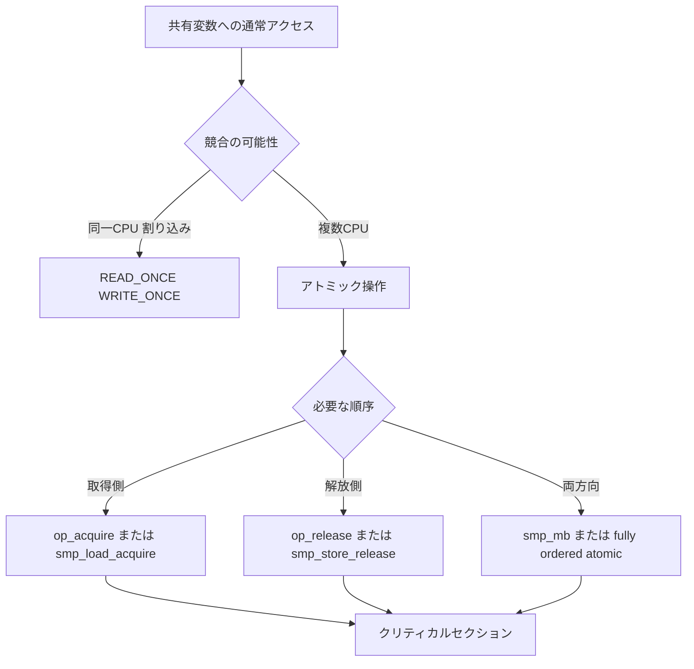

# 第1章 アトミック操作とメモリバリア

> **本章で読むソース**
>
> - [`include/linux/atomic.h` L10-L26](https://github.com/gregkh/linux/blob/v6.18.38/include/linux/atomic.h#L10-L26)
> - [`include/linux/atomic.h` L58-L78](https://github.com/gregkh/linux/blob/v6.18.38/include/linux/atomic.h#L58-L78)
> - [`include/asm-generic/rwonce.h` L3-L19](https://github.com/gregkh/linux/blob/v6.18.38/include/asm-generic/rwonce.h#L3-L19)
> - [`include/asm-generic/rwonce.h` L47-L62](https://github.com/gregkh/linux/blob/v6.18.38/include/asm-generic/rwonce.h#L47-L62)
> - [`include/asm-generic/barrier.h` L96-L108](https://github.com/gregkh/linux/blob/v6.18.38/include/asm-generic/barrier.h#L96-L108)
> - [`include/asm-generic/barrier.h` L138-L155](https://github.com/gregkh/linux/blob/v6.18.38/include/asm-generic/barrier.h#L138-L155)

## この章の狙い

ロックの下層にある**アトミック操作**と**メモリバリア**の語彙を押さえる。
`atomic_t` の acquire と release、`READ_ONCE` と `WRITE_ONCE`、SMP 向けの `smp_mb` 系が後続章のロック実装でどう組み合わされるかを読める状態にする。

## 前提

- [全体像と横断基盤](../../foundation/README.md) でカーネルビルドと `include/linux/` の地図を読んでいること。

## アトミック操作の4段階の順序付け

`include/linux/atomic.h` は、アーキテクチャ非依存のラッパーが参照する共通契約を定義する。
`xchg` や `cmpxchg` には fully ordered、acquire、release、relaxed の4種類がある。

[`include/linux/atomic.h` L10-L26](https://github.com/gregkh/linux/blob/v6.18.38/include/linux/atomic.h#L10-L26)

```c
/*
 * Relaxed variants of xchg, cmpxchg and some atomic operations.
 *
 * We support four variants:
 *
 * - Fully ordered: The default implementation, no suffix required.
 * - Acquire: Provides ACQUIRE semantics, _acquire suffix.
 * - Release: Provides RELEASE semantics, _release suffix.
 * - Relaxed: No ordering guarantees, _relaxed suffix.
 *
 * For compound atomics performing both a load and a store, ACQUIRE
 * semantics apply only to the load and RELEASE semantics only to the
 * store portion of the operation. Note that a failed cmpxchg_acquire
 * does -not- imply any memory ordering constraints.
 *
 * See Documentation/memory-barriers.txt for ACQUIRE/RELEASE definitions.
 */
```

ロック取得側は多くの場合 `_acquire` 付きの操作を使い、解放側は `_release` を使う。
失敗した `cmpxchg_acquire` が順序付けを持たない点は、trylock 失敗後に共有データを読んでも前の更新が見えない可能性があることを意味する。

## acquire と release の合成マクロ

relaxed 実装の上にフェンスを載せるパターンが `__atomic_op_acquire` などとして定義される。
アーキテクチャが `__atomic_acquire_fence` を上書きすれば、スピンロック直後の `smp_mb__after_spinlock` などと接続できる。

[`include/linux/atomic.h` L58-L78](https://github.com/gregkh/linux/blob/v6.18.38/include/linux/atomic.h#L58-L78)

```c
#define __atomic_op_acquire(op, args...)				\
({									\
	typeof(op##_relaxed(args)) __ret  = op##_relaxed(args);		\
	__atomic_acquire_fence();					\
	__ret;								\
})

#define __atomic_op_release(op, args...)				\
({									\
	__atomic_release_fence();					\
	op##_relaxed(args);						\
})

#define __atomic_op_fence(op, args...)					\
({									\
	typeof(op##_relaxed(args)) __ret;				\
	__atomic_pre_full_fence();					\
	__ret = op##_relaxed(args);					\
	__atomic_post_full_fence();					\
	__ret;								\
})
```

**最適化の工夫**：デフォルトの fully ordered 操作は前後にフルフェンスを挟むが、`_relaxed` に `_acquire` または `_release` を合成すれば、必要な片側の順序だけを課す。
ロックの fast path ではカウンタ更新とクリティカルセクション入場の間に無駄な双方向フェンスを入れない設計が取れる。

## READ_ONCE と WRITE_ONCE の役割

アトミック命令を使わない変数でも、コンパイラの再読み込みやマージを防ぐ必要がある。
`READ_ONCE` と `WRITE_ONCE` は volatile 経由のアクセスで、同一 CPU 上のプロセス文脈と割り込みハンドラ間の通信に使われる。

[`include/asm-generic/rwonce.h` L3-L19](https://github.com/gregkh/linux/blob/v6.18.38/include/asm-generic/rwonce.h#L3-L19)

```c
 * Prevent the compiler from merging or refetching reads or writes. The
 * compiler is also forbidden from reordering successive instances of
 * READ_ONCE and WRITE_ONCE, but only when the compiler is aware of some
 * particular ordering. One way to make the compiler aware of ordering is to
 * put the two invocations of READ_ONCE or WRITE_ONCE in different C
 * statements.
 *
 * These two macros will also work on aggregate data types like structs or
 * unions.
 *
 * Their two major use cases are: (1) Mediating communication between
 * process-level code and irq/NMI handlers, all running on the same CPU,
 * and (2) Ensuring that the compiler does not fold, spindle, or otherwise
 * mutilate accesses that either do not require ordering or that interact
 * with an explicit memory barrier or atomic instruction that provides the
 * required ordering.
```

実装は型チェック付きのマクロにまとめられる。

[`include/asm-generic/rwonce.h` L47-L62](https://github.com/gregkh/linux/blob/v6.18.38/include/asm-generic/rwonce.h#L47-L62)

```c
#define READ_ONCE(x)							\
({									\
	compiletime_assert_rwonce_type(x);				\
	__READ_ONCE(x);							\
})

#define __WRITE_ONCE(x, val)						\
do {									\
	*(volatile typeof(x) *)&(x) = (val);				\
} while (0)

#define WRITE_ONCE(x, val)						\
do {									\
	compiletime_assert_rwonce_type(x);				\
	__WRITE_ONCE(x, val);						\
} while (0)
```

`READ_ONCE` 単体は CPU 間の順序付けを保証しない。
別 CPU への可視性は、続く `smp_load_acquire` やロック取得と組み合わせて初めて成立する。

## SMP 向けメモリバリア

`CONFIG_SMP` が有効なとき、`smp_mb` 系は KCSAN フックとアーキテクチャ固有のフェンスを束ねる。

[`include/asm-generic/barrier.h` L96-L108](https://github.com/gregkh/linux/blob/v6.18.38/include/asm-generic/barrier.h#L96-L108)

```c
#ifdef CONFIG_SMP

#ifndef smp_mb
#define smp_mb()	do { kcsan_mb(); __smp_mb(); } while (0)
#endif

#ifndef smp_rmb
#define smp_rmb()	do { kcsan_rmb(); __smp_rmb(); } while (0)
#endif

#ifndef smp_wmb
#define smp_wmb()	do { kcsan_wmb(); __smp_wmb(); } while (0)
#endif
```

ロックなしで片側の順序だけ欲しい場合は、`smp_store_release` と `smp_load_acquire` が使われる。
書き込み前または読み込み後に `__smp_mb` を挟み、`WRITE_ONCE` と `READ_ONCE` と組み合わせる。

[`include/asm-generic/barrier.h` L138-L155](https://github.com/gregkh/linux/blob/v6.18.38/include/asm-generic/barrier.h#L138-L155)

```c
#ifndef __smp_store_release
#define __smp_store_release(p, v)					\
do {									\
	compiletime_assert_atomic_type(*p);				\
	__smp_mb();							\
	WRITE_ONCE(*p, v);						\
} while (0)
#endif

#ifndef __smp_load_acquire
#define __smp_load_acquire(p)						\
({									\
	__unqual_scalar_typeof(*p) ___p1 = READ_ONCE(*p);		\
	compiletime_assert_atomic_type(*p);				\
	__smp_mb();							\
	(typeof(*p))___p1;						\
})
#endif
```

## 処理の流れ：ロック取得とメモリ順序



典型例は次の通りである。
解放側が `WRITE_ONCE` でフラグを立て、`smp_store_release` でカウンタを更新する。
取得側が `smp_load_acquire` でカウンタを読み、条件成立後に `READ_ONCE` でペイロードを読む。
この組み合わせで、ペイロード更新がカウンタ更新より前に他 CPU から見えることが保証される。

## atomic_t とアーキテクチャ層

`atomic_t` の本体演算は `include/asm/atomic.h` および `scripts/atomic/` 生成物が担う。
`include/linux/atomic/atomic-arch-fallback.h` は、アーキテクチャが未実装の演算に対して `raw_xchg` などのフォールバックを提供する。
機械独立コードは `atomic_long_*` や `atomic_fetch_*` を通じて同じ acquire と release の命名規則を共有する。

後続章の `mutex` の `owner` フィールドや `rwsem` の `count` は、この層の `atomic_long_try_cmpxchg_acquire` に載る。

## まとめ

- アトミック API は relaxed、acquire、release、fully ordered の4段階で順序付けを選べる。
- `READ_ONCE` と `WRITE_ONCE` はコンパイラの最適化を抑え、割り込みとプロセス文脈の同一 CPU 通信に使う。
- SMP では `smp_mb` 系と `smp_load_acquire` と `smp_store_release` が、ロック外の軽量な同期にも使われる。

## 関連する章

- [per-CPU 変数](02-percpu.md)
- [spinlock と qspinlock](../part01-spinning/03-spinlock-qspinlock.md)
- [RCU の基本概念と API](../part04-rcu/10-rcu-basics.md)
