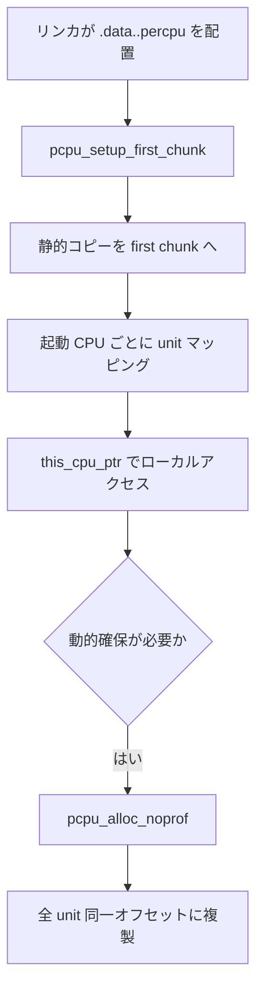

# 第2章 per-CPU 変数

> **本章で読むソース**
>
> - [`mm/percpu.c` L11-L37](https://github.com/gregkh/linux/blob/v6.18.38/mm/percpu.c#L11-L37)
> - [`mm/percpu.c` L45-L57](https://github.com/gregkh/linux/blob/v6.18.38/mm/percpu.c#L45-L57)
> - [`include/linux/percpu.h` L23-L28](https://github.com/gregkh/linux/blob/v6.18.38/include/linux/percpu.h#L23-L28)
> - [`include/linux/percpu.h` L75-L76](https://github.com/gregkh/linux/blob/v6.18.38/include/linux/percpu.h#L75-L76)
> - [`include/linux/percpu.h` L136-L154](https://github.com/gregkh/linux/blob/v6.18.38/include/linux/percpu.h#L136-L154)
> - [`include/linux/percpu-defs.h` L113-L114](https://github.com/gregkh/linux/blob/v6.18.38/include/linux/percpu-defs.h#L113-L114)
> - [`include/linux/percpu-defs.h` L249-L257](https://github.com/gregkh/linux/blob/v6.18.38/include/linux/percpu-defs.h#L249-L257)

## この章の狙い

**per-CPU 変数**の配置モデルとアクセス API を押さえる。
ロックや RCU と並ぶ横断基盤として、各 CPU が自分のコピーだけを触ることでキャッシュラインの競合を避ける仕組みを読めるようにする。

## 前提

- [アトミック操作とメモリバリア](01-atomic-barrier.md) で SMP とメモリ順序の語彙を読んでいること。

## chunk と unit のモデル

`mm/percpu.c` 先頭のコメントが、per-CPU アロケータの全体像を示す。
chunk を unit に分割し、unit と possible CPU が 1 対 1 で対応する。

[`mm/percpu.c` L11-L37](https://github.com/gregkh/linux/blob/v6.18.38/mm/percpu.c#L11-L37)

```c
 * The percpu allocator handles both static and dynamic areas.  Percpu
 * areas are allocated in chunks which are divided into units.  There is
 * a 1-to-1 mapping for units to possible cpus.  These units are grouped
 * based on NUMA properties of the machine.
 *
 *  c0                           c1                         c2
 *  -------------------          -------------------        ------------
 * | u0 | u1 | u2 | u3 |        | u0 | u1 | u2 | u3 |      | u0 | u1 | u
 *  -------------------  ......  -------------------  ....  ------------
 *
 * Allocation is done by offsets into a unit's address space.  Ie., an
 * area of 512 bytes at 6k in c1 occupies 512 bytes at 6k in c1:u0,
 * c1:u1, c1:u2, etc.  On NUMA machines, the mapping may be non-linear
 * and even sparse.  Access is handled by configuring percpu base
 * registers according to the cpu to unit mappings and offsetting the
 * base address using pcpu_unit_size.
 *
 * There is special consideration for the first chunk which must handle
 * the static percpu variables in the kernel image as allocation services
 * are not online yet.  In short, the first chunk is structured like so:
 *
 *                  <Static | [Reserved] | Dynamic>
 *
 * The static data is copied from the original section managed by the
 * linker.  The reserved section, if non-zero, primarily manages static
 * percpu variables from kernel modules.  Finally, the dynamic section
 * takes care of normal allocations.
```

起動直後はリンカが置いた静的 per-CPU 領域を first chunk が引き継ぎ、以降は動的領域へ `alloc_percpu` が伸びる。

## 動的割り当てのヒント管理

動的領域はビットマップで断片を追跡する。
「いっぱいに近い chunk から先に割り当てる」方針で、断片化を遅らせる。

[`mm/percpu.c` L45-L57](https://github.com/gregkh/linux/blob/v6.18.38/mm/percpu.c#L45-L57)

```c
 * The allocator tries to allocate from the fullest chunk first. Each chunk
 * is managed by a bitmap with metadata blocks.  The allocation map is updated
 * on every allocation and free to reflect the current state while the boundary
 * map is only updated on allocation.  Each metadata block contains
 * information to help mitigate the need to iterate over large portions
 * of the bitmap.  The reverse mapping from page to chunk is stored in
 * the page's index.  Lastly, units are lazily backed and grow in unison.
 *
 * There is a unique conversion that goes on here between bytes and bits.
 * Each bit represents a fragment of size PCPU_MIN_ALLOC_SIZE.  The chunk
 * tracks the number of pages it is responsible for in nr_pages.  Helper
 * functions are used to convert from between the bytes, bits, and blocks.
 * All hints are managed in bits unless explicitly stated.
```

**最適化の工夫**：最小割り当て単位 `PCPU_MIN_ALLOC_SIZE` は 4 バイトで、ビットマップ 1 ビットがその倍数を表す。
メタデータブロックで広いビットマップ走査を避け、頻繁な `this_cpu_ptr` アクセスのコストとは別経路でアロケータの CPU 負荷を抑える。

## 宣言と動的確保 API

静的変数は `DEFINE_PER_CPU`、動的確保は `alloc_percpu` 系が担う。

[`include/linux/percpu-defs.h` L113-L114](https://github.com/gregkh/linux/blob/v6.18.38/include/linux/percpu-defs.h#L113-L114)

```c
#define DEFINE_PER_CPU(type, name)					\
	DEFINE_PER_CPU_SECTION(type, name, "")
```

[`include/linux/percpu.h` L136-L154](https://github.com/gregkh/linux/blob/v6.18.38/include/linux/percpu.h#L136-L154)

```c
extern void __percpu *pcpu_alloc_noprof(size_t size, size_t align, bool reserved,
				   gfp_t gfp) __alloc_size(1);

#define __alloc_percpu_gfp(_size, _align, _gfp)				\
	alloc_hooks(pcpu_alloc_noprof(_size, _align, false, _gfp))
#define __alloc_percpu(_size, _align)					\
	alloc_hooks(pcpu_alloc_noprof(_size, _align, false, GFP_KERNEL))
#define __alloc_reserved_percpu(_size, _align)				\
	alloc_hooks(pcpu_alloc_noprof(_size, _align, true, GFP_KERNEL))

#define alloc_percpu_gfp(type, gfp)					\
	(typeof(type) __percpu *)__alloc_percpu_gfp(sizeof(type),	\
						__alignof__(type), gfp)
#define alloc_percpu(type)						\
	(typeof(type) __percpu *)__alloc_percpu(sizeof(type),		\
						__alignof__(type))
#define alloc_percpu_noprof(type)					\
	((typeof(type) __percpu *)pcpu_alloc_noprof(sizeof(type),	\
					__alignof__(type), false, GFP_KERNEL))
```

unit の最小サイズは 32 KiB アラインである。

[`include/linux/percpu.h` L23-L28](https://github.com/gregkh/linux/blob/v6.18.38/include/linux/percpu.h#L23-L28)

```c
/* minimum unit size, also is the maximum supported allocation size */
#define PCPU_MIN_UNIT_SIZE		PFN_ALIGN(32 << 10)

/* minimum allocation size and shift in bytes */
#define PCPU_MIN_ALLOC_SHIFT		2
#define PCPU_MIN_ALLOC_SIZE		(1 << PCPU_MIN_ALLOC_SHIFT)
```

## this_cpu_ptr によるアクセス

実行中 CPU の unit へオフセットするマクロが `this_cpu_ptr` である。
`CONFIG_DEBUG_PREEMPT` では `my_cpu_offset` でプリエンプション中の CPU ずれを検出する。

[`include/linux/percpu-defs.h` L249-L257](https://github.com/gregkh/linux/blob/v6.18.38/include/linux/percpu-defs.h#L249-L257)

```c
#ifdef CONFIG_DEBUG_PREEMPT
#define this_cpu_ptr(ptr)						\
({									\
	__verify_pcpu_ptr(ptr);						\
	SHIFT_PERCPU_PTR(ptr, my_cpu_offset);				\
})
#else
#define this_cpu_ptr(ptr) raw_cpu_ptr(ptr)
#endif
```

ベースアドレスと unit オフセット表はグローバルに保持される。

[`include/linux/percpu.h` L75-L76](https://github.com/gregkh/linux/blob/v6.18.38/include/linux/percpu.h#L75-L76)

```c
extern void *pcpu_base_addr;
extern const unsigned long *pcpu_unit_offsets;
```

x86-64 では `%gs` ベースの per-CPU セグメントと組み合わせ、`this_cpu_add` などが 1 命令に近いコストで収まることが多い。

## 処理の流れ：静的 per-CPU の起動時配置



`qspinlock` の `qnodes` や RCU の `rcu_data` は `DEFINE_PER_CPU_ALIGNED` でキャッシュライン境界に置かれ、他 CPU との false sharing を避ける。

## プリエンプションと get_cpu_var

別 CPU の unit を触るときは `per_cpu_ptr(var, cpu)` を使う。
一時的に割り込みを抑えて「今の CPU」を固定したい場合は `get_cpu_var` と `put_cpu_var` のペアが使われる。
per-CPU データをロックなしで更新できるのは、更新がその CPU に閉じているときに限る。

## まとめ

- per-CPU 領域は chunk と unit で管理され、動的割り当てはビットマップベースのアロケータが担う。
- `DEFINE_PER_CPU` と `alloc_percpu` が静的と動的の入口である。
- `this_cpu_ptr` は実行 CPU のコピーへアクセスし、ロック競合のないカウンタやキュー node に使われる。

## 関連する章

- [アトミック操作とメモリバリア](01-atomic-barrier.md)
- [spinlock と qspinlock](../part01-spinning/03-spinlock-qspinlock.md)
- [Tree RCU と grace period](../part04-rcu/12-tree-rcu-gp.md)
