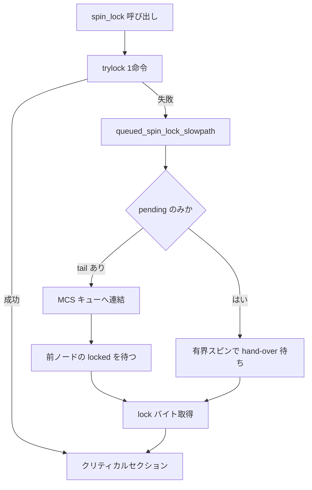

# 第3章 spinlock と qspinlock

> **本章で読むソース**
>
> - [`kernel/locking/spinlock.c` L375-L380](https://github.com/gregkh/linux/blob/v6.18.38/kernel/locking/spinlock.c#L375-L380)
> - [`kernel/locking/qspinlock.c` L33-L68](https://github.com/gregkh/linux/blob/v6.18.38/kernel/locking/qspinlock.c#L33-L68)
> - [`kernel/locking/qspinlock.c` L72-L80](https://github.com/gregkh/linux/blob/v6.18.38/kernel/locking/qspinlock.c#L72-L80)
> - [`kernel/locking/qspinlock.c` L109-L129](https://github.com/gregkh/linux/blob/v6.18.38/kernel/locking/qspinlock.c#L109-L129)
> - [`kernel/locking/qspinlock.c` L130-L160](https://github.com/gregkh/linux/blob/v6.18.38/kernel/locking/qspinlock.c#L130-L160)
> - [`kernel/locking/qspinlock.c` L212-L302](https://github.com/gregkh/linux/blob/v6.18.38/kernel/locking/qspinlock.c#L212-L302)
> - [`kernel/locking/qspinlock.c` L304-L362](https://github.com/gregkh/linux/blob/v6.18.38/kernel/locking/qspinlock.c#L304-L362)
> - [`kernel/locking/mcs_spinlock.h` L1-L12](https://github.com/gregkh/linux/blob/v6.18.38/kernel/locking/mcs_spinlock.h#L1-L12)
> - [`kernel/locking/mcs_spinlock.h` L56-L62](https://github.com/gregkh/linux/blob/v6.18.38/kernel/locking/mcs_spinlock.h#L56-L62)

## この章の狙い

割り込み可能文脈でも使える**スピンロック**の入口と、SMP で標準となった **qspinlock**（キュー付きスピンロック）の圧縮設計を読む。
MCS ロックを 32 ビットの `spinlock_t` に収めた理由と slow path の状態遷移を追う。

## 前提

- [アトミック操作とメモリバリア](../part00-foundation/01-atomic-barrier.md) と [per-CPU 変数](../part00-foundation/02-percpu.md) を読んでいること。

## raw_spin_lock の入口

`spinlock.c` の `_raw_spin_lock_nested` は、プリエンプション無効化のあと lockdep 記録と contended ループへ入る。

[`kernel/locking/spinlock.c` L375-L380](https://github.com/gregkh/linux/blob/v6.18.38/kernel/locking/spinlock.c#L375-L380)

```c
void __lockfunc _raw_spin_lock_nested(raw_spinlock_t *lock, int subclass)
{
	preempt_disable();
	spin_acquire(&lock->dep_map, subclass, 0, _RET_IP_);
	LOCK_CONTENDED(lock, do_raw_spin_trylock, do_raw_spin_lock);
}
```

`LOCK_CONTENDED` は trylock 成功なら即 return、失敗なら `do_raw_spin_lock` へ落ちるマクロである。
x86-64 では fast path がインライン化され、競合時だけ `queued_spin_lock_slowpath` に到達する。

## MCS ロックから qspinlock への圧縮

qspinlock のコメントが設計意図を説明する。
従来の MCS は tail 8 バイトと next 8 バイトを要するが、カーネルは 4 バイトの `spinlock_t` API を維持する必要がある。

[`kernel/locking/qspinlock.c` L33-L68](https://github.com/gregkh/linux/blob/v6.18.38/kernel/locking/qspinlock.c#L33-L68)

```c
/*
 * The basic principle of a queue-based spinlock can best be understood
 * by studying a classic queue-based spinlock implementation called the
 * MCS lock. A copy of the original MCS lock paper ("Algorithms for Scalable
 * Synchronization on Shared-Memory Multiprocessors by Mellor-Crummey and
 * Scott") is available at
 *
 * https://bugzilla.kernel.org/show_bug.cgi?id=206115
 *
 * This queued spinlock implementation is based on the MCS lock, however to
 * make it fit the 4 bytes we assume spinlock_t to be, and preserve its
 * existing API, we must modify it somehow.
 *
 * In particular; where the traditional MCS lock consists of a tail pointer
 * (8 bytes) and needs the next pointer (another 8 bytes) of its own node to
 * unlock the next pending (next->locked), we compress both these: {tail,
 * next->locked} into a single u32 value.
 *
 * Since a spinlock disables recursion of its own context and there is a limit
 * to the contexts that can nest; namely: task, softirq, hardirq, nmi. As there
 * are at most 4 nesting levels, it can be encoded by a 2-bit number. Now
 * we can encode the tail by combining the 2-bit nesting level with the cpu
 * number. With one byte for the lock value and 3 bytes for the tail, only a
 * 32-bit word is now needed. Even though we only need 1 bit for the lock,
 * we extend it to a full byte to achieve better performance for architectures
 * that support atomic byte write.
 *
 * We also change the first spinner to spin on the lock bit instead of its
 * node; whereby avoiding the need to carry a node from lock to unlock, and
 * preserving existing lock API. This also makes the unlock code simpler and
 * faster.
 *
 * N.B. The current implementation only supports architectures that allow
 *      atomic operations on smaller 8-bit and 16-bit data types.
 *
 */
```

**最適化の工夫**：ネスト深度を 2 ビットに押し込み、tail と pending を 1 ワードに同居させる。
全 CPU が単一キャッシュラインを叩き続ける従来型 test-and-set より、キュー内では前ノードの `locked` だけを監視するため、メモリバストラフィックが CPU 数に比例して爆発しにくい。

## per-CPU のキュー node

各 CPU は最大 4 段のネスト用 node を per-CPU 領域に持つ。
64 ビット環境では 1 キャッシュラインに収まる。

[`kernel/locking/qspinlock.c` L72-L80](https://github.com/gregkh/linux/blob/v6.18.38/kernel/locking/qspinlock.c#L72-L80)

```c
/*
 * Per-CPU queue node structures; we can never have more than 4 nested
 * contexts: task, softirq, hardirq, nmi.
 *
 * Exactly fits one 64-byte cacheline on a 64-bit architecture.
 *
 * PV doubles the storage and uses the second cacheline for PV state.
 */
static DEFINE_PER_CPU_ALIGNED(struct qnode, qnodes[_Q_MAX_NODES]);
```

MCS ロックの説明は `mcs_spinlock.h` 先頭のコメントにある。

[`kernel/locking/mcs_spinlock.h` L1-L12](https://github.com/gregkh/linux/blob/v6.18.38/kernel/locking/mcs_spinlock.h#L1-L12)

```c
/* SPDX-License-Identifier: GPL-2.0 */
/*
 * MCS lock defines
 *
 * This file contains the main data structure and API definitions of MCS lock.
 *
 * The MCS lock (proposed by Mellor-Crummey and Scott) is a simple spin-lock
 * with the desirable properties of being fair, and with each cpu trying
 * to acquire the lock spinning on a local variable.
 * It avoids expensive cache bounces that common test-and-set spin-lock
 * implementations incur.
 */
```

`mcs_spin_lock` は node を初期化してからキューに連結する。

[`kernel/locking/mcs_spinlock.h` L56-L62](https://github.com/gregkh/linux/blob/v6.18.38/kernel/locking/mcs_spinlock.h#L56-L62)

```c
static inline
void mcs_spin_lock(struct mcs_spinlock **lock, struct mcs_spinlock *node)
{
	struct mcs_spinlock *prev;

	/* Init node */
	node->locked = 0;
```

## slow path の状態遷移

コメント内の ASCII 図が、tail、pending、locked の 3 フィールドの遷移を示す。

[`kernel/locking/qspinlock.c` L109-L129](https://github.com/gregkh/linux/blob/v6.18.38/kernel/locking/qspinlock.c#L109-L129)

```c
/**
 * queued_spin_lock_slowpath - acquire the queued spinlock
 * @lock: Pointer to queued spinlock structure
 * @val: Current value of the queued spinlock 32-bit word
 *
 * (queue tail, pending bit, lock value)
 *
 *              fast     :    slow                                  :    unlock
 *                       :                                          :
 * uncontended  (0,0,0) -:--> (0,0,1) ------------------------------:--> (*,*,0)
 *                       :       | ^--------.------.             /  :
 *                       :       v           \      \            |  :
 * pending               :    (0,1,1) +--> (0,1,0)   \           |  :
 *                       :       | ^--'              |           |  :
 *                       :       v                   |           |  :
 * uncontended           :    (n,x,y) +--> (n,0,0) --'           |  :
 *   queue               :       | ^--'                          |  :
 *                       :       v                               |  :
 * contended             :    (*,x,y) +--> (*,0,0) ---> (*,0,1) -'  :
 *   queue               :         ^--'                             :
 */
```

実装の冒頭では pending ハンドオーバを有界スピンで待ち、競合ビットが立っていれば `queue` ラベルへ進む。

[`kernel/locking/qspinlock.c` L130-L160](https://github.com/gregkh/linux/blob/v6.18.38/kernel/locking/qspinlock.c#L130-L160)

```c
void __lockfunc queued_spin_lock_slowpath(struct qspinlock *lock, u32 val)
{
	struct mcs_spinlock *prev, *next, *node;
	u32 old, tail;
	int idx;

	BUILD_BUG_ON(CONFIG_NR_CPUS >= (1U << _Q_TAIL_CPU_BITS));

	if (pv_enabled())
		goto pv_queue;

	if (virt_spin_lock(lock))
		return;

	/*
	 * Wait for in-progress pending->locked hand-overs with a bounded
	 * number of spins so that we guarantee forward progress.
	 *
	 * 0,1,0 -> 0,0,1
	 */
	if (val == _Q_PENDING_VAL) {
		int cnt = _Q_PENDING_LOOPS;
		val = atomic_cond_read_relaxed(&lock->val,
					       (VAL != _Q_PENDING_VAL) || !cnt--);
	}

	/*
	 * If we observe any contention; queue.
	 */
	if (val & ~_Q_LOCKED_MASK)
		goto queue;
```

## MCS キューへの連結

`queue` ラベル以降は per-CPU の `qnodes` から node を取り、`encode_tail` で CPU 番号とネスト深度を tail に圧縮する。

[`kernel/locking/qspinlock.c` L212-L302](https://github.com/gregkh/linux/blob/v6.18.38/kernel/locking/qspinlock.c#L212-L302)

```c
queue:
	lockevent_inc(lock_slowpath);
pv_queue:
	node = this_cpu_ptr(&qnodes[0].mcs);
	idx = node->count++;
	tail = encode_tail(smp_processor_id(), idx);

	trace_contention_begin(lock, LCB_F_SPIN);

	/*
	 * 4 nodes are allocated based on the assumption that there will
	 * not be nested NMIs taking spinlocks. That may not be true in
	 * some architectures even though the chance of needing more than
	 * 4 nodes will still be extremely unlikely. When that happens,
	 * we fall back to spinning on the lock directly without using
	 * any MCS node. This is not the most elegant solution, but is
	 * simple enough.
	 */
	if (unlikely(idx >= _Q_MAX_NODES)) {
		lockevent_inc(lock_no_node);
		while (!queued_spin_trylock(lock))
			cpu_relax();
		goto release;
	}

	node = grab_mcs_node(node, idx);

	/*
	 * Keep counts of non-zero index values:
	 */
	lockevent_cond_inc(lock_use_node2 + idx - 1, idx);

	/*
	 * Ensure that we increment the head node->count before initialising
	 * the actual node. If the compiler is kind enough to reorder these
	 * stores, then an IRQ could overwrite our assignments.
	 */
	barrier();

	node->locked = 0;
	node->next = NULL;
	pv_init_node(node);

	/*
	 * We touched a (possibly) cold cacheline in the per-cpu queue node;
	 * attempt the trylock once more in the hope someone let go while we
	 * weren't watching.
	 */
	if (queued_spin_trylock(lock))
		goto release;

	/*
	 * Ensure that the initialisation of @node is complete before we
	 * publish the updated tail via xchg_tail() and potentially link
	 * @node into the waitqueue via WRITE_ONCE(prev->next, node) below.
	 */
	smp_wmb();

	/*
	 * Publish the updated tail.
	 * We have already touched the queueing cacheline; don't bother with
	 * pending stuff.
	 *
	 * p,*,* -> n,*,*
	 */
	old = xchg_tail(lock, tail);
	next = NULL;

	/*
	 * if there was a previous node; link it and wait until reaching the
	 * head of the waitqueue.
	 */
	if (old & _Q_TAIL_MASK) {
		prev = decode_tail(old, qnodes);

		/* Link @node into the waitqueue. */
		WRITE_ONCE(prev->next, node);

		pv_wait_node(node, prev);
		arch_mcs_spin_lock_contended(&node->locked);

		/*
		 * While waiting for the MCS lock, the next pointer may have
		 * been set by another lock waiter. We optimistically load
		 * the next pointer & prefetch the cacheline for writing
		 * to reduce latency in the upcoming MCS unlock operation.
		 */
		next = READ_ONCE(node->next);
		if (next)
			prefetchw(next);
	}
```

先行 waiter がいれば `prev->next` で連結し、自 node の `locked` をスピンする。
キュー先頭に到達した CPU は lock ワードの `locked` と `pending` が空になるまで待つ。

[`kernel/locking/qspinlock.c` L304-L362](https://github.com/gregkh/linux/blob/v6.18.38/kernel/locking/qspinlock.c#L304-L362)

```c
	/*
	 * we're at the head of the waitqueue, wait for the owner & pending to
	 * go away.
	 *
	 * *,x,y -> *,0,0
	 *
	 * this wait loop must use a load-acquire such that we match the
	 * store-release that clears the locked bit and create lock
	 * sequentiality; this is because the set_locked() function below
	 * does not imply a full barrier.
	 *
	 * The PV pv_wait_head_or_lock function, if active, will acquire
	 * the lock and return a non-zero value. So we have to skip the
	 * atomic_cond_read_acquire() call. As the next PV queue head hasn't
	 * been designated yet, there is no way for the locked value to become
	 * _Q_SLOW_VAL. So both the set_locked() and the
	 * atomic_cmpxchg_relaxed() calls will be safe.
	 *
	 * If PV isn't active, 0 will be returned instead.
	 *
	 */
	if ((val = pv_wait_head_or_lock(lock, node)))
		goto locked;

	val = atomic_cond_read_acquire(&lock->val, !(VAL & _Q_LOCKED_PENDING_MASK));

locked:
	/*
	 * claim the lock:
	 *
	 * n,0,0 -> 0,0,1 : lock, uncontended
	 * *,*,0 -> *,*,1 : lock, contended
	 *
	 * If the queue head is the only one in the queue (lock value == tail)
	 * and nobody is pending, clear the tail code and grab the lock.
	 * Otherwise, we only need to grab the lock.
	 */

	/*
	 * In the PV case we might already have _Q_LOCKED_VAL set, because
	 * of lock stealing; therefore we must also allow:
	 *
	 * n,0,1 -> 0,0,1
	 *
	 * Note: at this point: (val & _Q_PENDING_MASK) == 0, because of the
	 *       above wait condition, therefore any concurrent setting of
	 *       PENDING will make the uncontended transition fail.
	 */
	if ((val & _Q_TAIL_MASK) == tail) {
		if (atomic_try_cmpxchg_relaxed(&lock->val, &val, _Q_LOCKED_VAL))
			goto release; /* No contention */
	}

	/*
	 * Either somebody is queued behind us or _Q_PENDING_VAL got set
	 * which will then detect the remaining tail and queue behind us
	 * ensuring we'll see a @next.
	 */
	set_locked(lock);
```

## 処理の流れ：ロック取得



## spinlock と mutex の使い分け

スピンロックは保持時間が短く、スリープできない文脈（割り込みハンドラ、タイマー）向けである。
保持中にページフォールトや長いループを起こすと他 CPU を無駄にスピンさせる。
スリープ可能な臨界区には [mutex](../part02-sleeping/05-mutex-osq.md) を使う。

## まとめ

- `_raw_spin_lock_nested` はプリエンプション無効化と lockdep 記録のあと contended ループへ入る。
- qspinlock は MCS を 32 ビットに圧縮し、per-CPU node でキューを構成する。
- slow path は pending と queue の2段階で forward progress を保つ。

## 関連する章

- [rwlock と seqlock](04-rwlock-seqlock.md)
- [mutex と optimistic spinning](../part02-sleeping/05-mutex-osq.md)
- [lockdep](../part03-correctness/08-lockdep.md)
