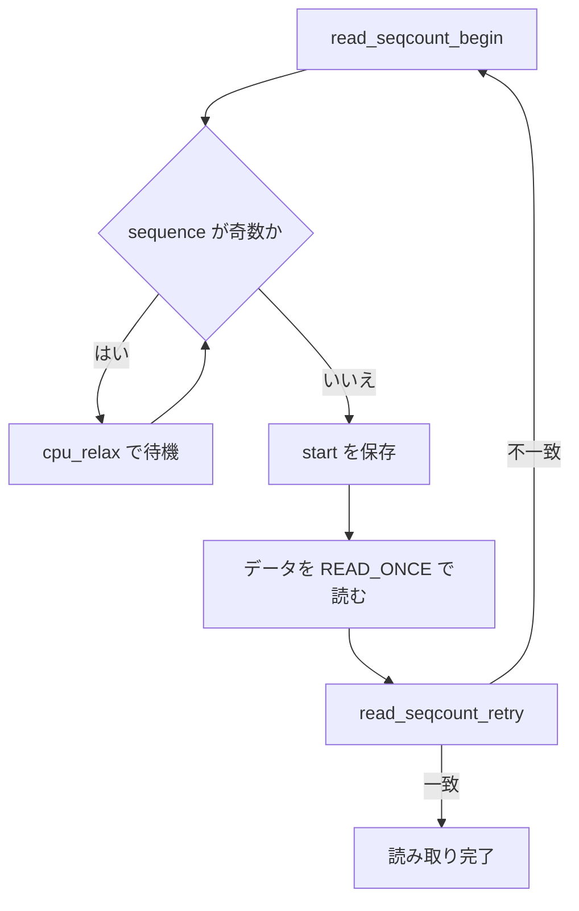

# 第4章 rwlock と seqlock

> **本章で読むソース**
>
> - [`kernel/locking/spinlock.c` L226-L230](https://github.com/gregkh/linux/blob/v6.18.38/kernel/locking/spinlock.c#L226-L230)
> - [`kernel/locking/qrwlock.c` L18-L59](https://github.com/gregkh/linux/blob/v6.18.38/kernel/locking/qrwlock.c#L18-L59)
> - [`include/linux/seqlock.h` L6-L9](https://github.com/gregkh/linux/blob/v6.18.38/include/linux/seqlock.h#L6-L9)
> - [`include/linux/seqlock.h` L226-L230](https://github.com/gregkh/linux/blob/v6.18.38/include/linux/seqlock.h#L226-L230)
> - [`include/linux/seqlock.h` L271-L300](https://github.com/gregkh/linux/blob/v6.18.38/include/linux/seqlock.h#L271-L300)
> - [`include/linux/seqlock.h` L405-L412](https://github.com/gregkh/linux/blob/v6.18.38/include/linux/seqlock.h#L405-L412)

## この章の狙い

読み取り並行性を持つ **rwlock**（qrwlock 実装）と、ロックレス読み取りの **seqlock** を対比して読む。
読み取りが支配的な経路で、スピンロックよりどこが違うかをソースで押さえる。

## 前提

- [spinlock と qspinlock](03-spinlock-qspinlock.md) を読んでいること。

## rwlock の入口

`rwlock_t` の読み取り側入口は `_raw_read_lock` である。
インライン化されない構成では `spinlock.c` に本体がある。

[`kernel/locking/spinlock.c` L226-L230](https://github.com/gregkh/linux/blob/v6.18.38/kernel/locking/spinlock.c#L226-L230)

```c
noinline void __lockfunc _raw_read_lock(rwlock_t *lock)
{
	__raw_read_lock(lock);
}
EXPORT_SYMBOL(_raw_read_lock);
```

SMP では内部実装が qrwlock に置き換わり、カウンタ `cnts` で読み取りバイアスと writer ビットを管理する。

## qrwlock の読み取り slow path

割り込み文脈の読み取りは、writer が待機中だけならキューを迂回して即取得できる。
プロセス文脈は `wait_lock` でキューに入り、writer ビットが落ちるまで `atomic_cond_read_acquire` で待つ。

[`kernel/locking/qrwlock.c` L18-L59](https://github.com/gregkh/linux/blob/v6.18.38/kernel/locking/qrwlock.c#L18-L59)

```c
 * queued_read_lock_slowpath - acquire read lock of a queued rwlock
 * @lock: Pointer to queued rwlock structure
 */
void __lockfunc queued_read_lock_slowpath(struct qrwlock *lock)
{
	/*
	 * Readers come here when they cannot get the lock without waiting
	 */
	if (unlikely(in_interrupt())) {
		/*
		 * Readers in interrupt context will get the lock immediately
		 * if the writer is just waiting (not holding the lock yet),
		 * so spin with ACQUIRE semantics until the lock is available
		 * without waiting in the queue.
		 */
		atomic_cond_read_acquire(&lock->cnts, !(VAL & _QW_LOCKED));
		return;
	}
	atomic_sub(_QR_BIAS, &lock->cnts);

	trace_contention_begin(lock, LCB_F_SPIN | LCB_F_READ);

	/*
	 * Put the reader into the wait queue
	 */
	arch_spin_lock(&lock->wait_lock);
	atomic_add(_QR_BIAS, &lock->cnts);

	/*
	 * The ACQUIRE semantics of the following spinning code ensure
	 * that accesses can't leak upwards out of our subsequent critical
	 * section in the case that the lock is currently held for write.
	 */
	atomic_cond_read_acquire(&lock->cnts, !(VAL & _QW_LOCKED));

	/*
	 * Signal the next one in queue to become queue head
	 */
	arch_spin_unlock(&lock->wait_lock);

	trace_contention_end(lock, 0);
}
```

**最適化の工夫**：割り込みからの読み取りは wait キューを使わず、writer の確保待ちだけをスピンで乗り切る。
ハードIRQ のレイテンシを抑えつつ、プロセス文脈の公平性は `wait_lock` 付きキューで担保する。

## seqlock の目的

seqlock は読み取り側がロックを取らず、シーケンス番号の偶奇で更新と競合を検出する。

[`include/linux/seqlock.h` L6-L9](https://github.com/gregkh/linux/blob/v6.18.38/include/linux/seqlock.h#L6-L9)

```c
 * seqcount_t / seqlock_t - a reader-writer consistency mechanism with
 * lockless readers (read-only retry loops), and no writer starvation.
 *
 * See Documentation/locking/seqlock.rst
```

書き込み側は関連ロック（spinlock、rwlock、mutex 等）で seqcount を保護する variant がある。

[`include/linux/seqlock.h` L226-L230](https://github.com/gregkh/linux/blob/v6.18.38/include/linux/seqlock.h#L226-L230)

```c
SEQCOUNT_LOCKNAME(raw_spinlock, raw_spinlock_t,  false,    raw_spin)
SEQCOUNT_LOCKNAME(spinlock,     spinlock_t,      __SEQ_RT, spin)
SEQCOUNT_LOCKNAME(rwlock,       rwlock_t,        __SEQ_RT, read)
SEQCOUNT_LOCKNAME(mutex,        struct mutex,    true,     mutex)
#undef SEQCOUNT_LOCKNAME
```

## 読み取り側の begin と retry

読み取り開始時、シーケンスが奇数なら writer が更新中とみなし `cpu_relax` で待つ。

[`include/linux/seqlock.h` L271-L300](https://github.com/gregkh/linux/blob/v6.18.38/include/linux/seqlock.h#L271-L300)

```c
#define __read_seqcount_begin(s)					\
({									\
	unsigned __seq;							\
									\
	while (unlikely((__seq = seqprop_sequence(s)) & 1))		\
		cpu_relax();						\
									\
	kcsan_atomic_next(KCSAN_SEQLOCK_REGION_MAX);			\
	__seq;								\
})

/**
 * raw_read_seqcount_begin() - begin a seqcount_t read section w/o lockdep
 * @s: Pointer to seqcount_t or any of the seqcount_LOCKNAME_t variants
 *
 * Return: count to be passed to read_seqcount_retry()
 */
#define raw_read_seqcount_begin(s) __read_seqcount_begin(s)

/**
 * read_seqcount_begin() - begin a seqcount_t read critical section
 * @s: Pointer to seqcount_t or any of the seqcount_LOCKNAME_t variants
 *
 * Return: count to be passed to read_seqcount_retry()
 */
#define read_seqcount_begin(s)						\
({									\
	seqcount_lockdep_reader_access(seqprop_const_ptr(s));		\
	raw_read_seqcount_begin(s);					\
})
```

読み取り後は `read_seqcount_retry` でシーケンスを再確認する。
不一致なら読み取り全体を破棄してやり直す。

[`include/linux/seqlock.h` L405-L412](https://github.com/gregkh/linux/blob/v6.18.38/include/linux/seqlock.h#L405-L412)

```c
#define read_seqcount_retry(s, start)					\
	do_read_seqcount_retry(seqprop_const_ptr(s), start)

static inline int do_read_seqcount_retry(const seqcount_t *s, unsigned start)
{
	smp_rmb();
	return do___read_seqcount_retry(s, start);
}
```

`smp_rmb` により、読み取ったデータへのアクセスがシーケンス確認より前に抜けない。

## 処理の流れ：seqlock 読み取り



jiffies や xtime 更新のように、読み取りが圧倒的に多い統計に seqlock が使われる。
読み取り側はロックを取らないが、writer が更新中（sequence が奇数）の間は `__read_seqcount_begin` で `cpu_relax` し、完了後の変化は `read_seqcount_retry` で検出してやり直す。

## rwlock と seqlock の選び方

rwlock は読み取り側もロック API を通り、lockdep の対象になる。
seqlock は読み取りがロックレスだが、読み取りの再試行コストと writer の短い臨界区が前提になる。
読み取り中にスリープしたり、参照先が大きい構造を深く辿ったりする用途には向かない。

## まとめ

- qrwlock は読み取りバイアス付きカウンタと wait キューで writer と reader を調停する。
- 割り込み文脈の読み取りはキュー迂回の fast path を持つ。
- seqlock はシーケンス番号とリトライでロックレス読み取りを実現する。

## 関連する章

- [spinlock と qspinlock](03-spinlock-qspinlock.md)
- [rwsem](../part02-sleeping/06-rwsem.md)
- [RCU の基本概念と API](../part04-rcu/12-rcu-basics.md)
