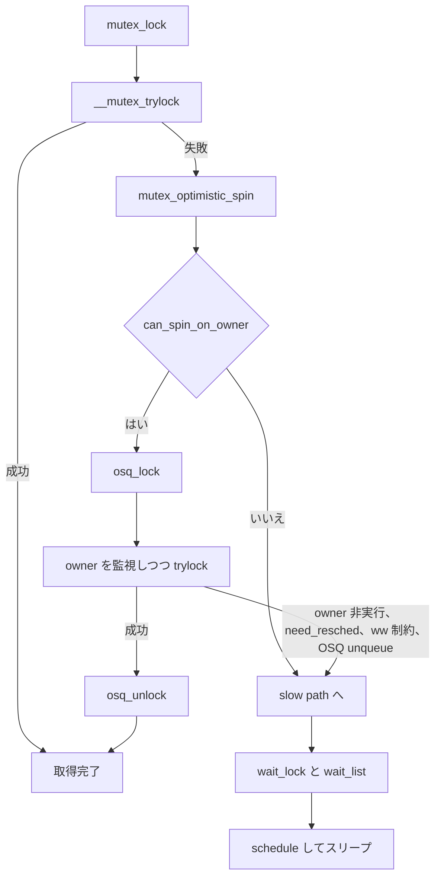

# 第5章 mutex と optimistic spinning

> **本章で読むソース**
>
> - [`kernel/locking/mutex.c` L46-L57](https://github.com/gregkh/linux/blob/v6.18.38/kernel/locking/mutex.c#L46-L57)
> - [`kernel/locking/mutex.c` L87-L121](https://github.com/gregkh/linux/blob/v6.18.38/kernel/locking/mutex.c#L87-L121)
> - [`kernel/locking/osq_lock.c` L7-L21](https://github.com/gregkh/linux/blob/v6.18.38/kernel/locking/osq_lock.c#L7-L21)
> - [`kernel/locking/osq_lock.c` L93-L129](https://github.com/gregkh/linux/blob/v6.18.38/kernel/locking/osq_lock.c#L93-L129)
> - [`kernel/locking/mutex.c` L428-L474](https://github.com/gregkh/linux/blob/v6.18.38/kernel/locking/mutex.c#L428-L474)
> - [`kernel/locking/mutex.c` L561-L610](https://github.com/gregkh/linux/blob/v6.18.38/kernel/locking/mutex.c#L561-L610)

## この章の狙い

スリープ可能な相互排除ロック **mutex** のデータ構造と、**optimistic spinning**（楽観的スピン）による fast path を読む。
OSQ（optimistic spin queue）が複数スピナーの stampede をどう抑えるかを追う。

## 前提

- [spinlock と qspinlock](../part01-spinning/03-spinlock-qspinlock.md) を読んでいること。

## mutex の初期化と owner 表現

`mutex` は `owner` を `atomic_long` で持ち、待ち行列は `wait_list` と `wait_lock` で保護する。
`CONFIG_MUTEX_SPIN_ON_OWNER` では OSQ も初期化される。

[`kernel/locking/mutex.c` L46-L57](https://github.com/gregkh/linux/blob/v6.18.38/kernel/locking/mutex.c#L46-L57)

```c
void
__mutex_init(struct mutex *lock, const char *name, struct lock_class_key *key)
{
	atomic_long_set(&lock->owner, 0);
	raw_spin_lock_init(&lock->wait_lock);
	INIT_LIST_HEAD(&lock->wait_list);
#ifdef CONFIG_MUTEX_SPIN_ON_OWNER
	osq_lock_init(&lock->osq);
#endif

	debug_mutex_init(lock, name, key);
}
```

`owner` の下位ビットは `MUTEX_FLAG_HANDOFF` などのフラグに使われ、ポインタと同居する。

## trylock と HANDOFF フラグ

`__mutex_trylock_common` は `cmpxchg_acquire` で owner を更新する。
HANDOFF と PICKUP フラグは、待ち行列からの所有権移譲をスピンなしで完了させるために使われる。

[`kernel/locking/mutex.c` L87-L121](https://github.com/gregkh/linux/blob/v6.18.38/kernel/locking/mutex.c#L87-L121)

```c
static inline struct task_struct *__mutex_trylock_common(struct mutex *lock, bool handoff)
{
	unsigned long owner, curr = (unsigned long)current;

	owner = atomic_long_read(&lock->owner);
	for (;;) { /* must loop, can race against a flag */
		unsigned long flags = __owner_flags(owner);
		unsigned long task = owner & ~MUTEX_FLAGS;

		if (task) {
			if (flags & MUTEX_FLAG_PICKUP) {
				if (task != curr)
					break;
				flags &= ~MUTEX_FLAG_PICKUP;
			} else if (handoff) {
				if (flags & MUTEX_FLAG_HANDOFF)
					break;
				flags |= MUTEX_FLAG_HANDOFF;
			} else {
				break;
			}
		} else {
			MUTEX_WARN_ON(flags & (MUTEX_FLAG_HANDOFF | MUTEX_FLAG_PICKUP));
			task = curr;
		}

		if (atomic_long_try_cmpxchg_acquire(&lock->owner, &owner, task | flags)) {
			if (task == curr)
				return NULL;
			break;
		}
	}

	return __owner_task(owner);
}
```

## OSQ の役割

OSQ はスリープ系ロック向けに切り詰めた MCS キューである。
CPU ごとに 1 node だけで足りるのは、割り込み文脈から呼ばれずスピン中はプリエンプション無効だからである。

[`kernel/locking/osq_lock.c` L7-L21](https://github.com/gregkh/linux/blob/v6.18.38/kernel/locking/osq_lock.c#L7-L21)

```c
 * An MCS like lock especially tailored for optimistic spinning for sleeping
 * lock implementations (mutex, rwsem, etc).
 *
 * Using a single mcs node per CPU is safe because sleeping locks should not be
 * called from interrupt context and we have preemption disabled while
 * spinning.
 */

struct optimistic_spin_node {
	struct optimistic_spin_node *next, *prev;
	int locked; /* 1 if lock acquired */
	int cpu; /* encoded CPU # + 1 value */
};

static DEFINE_PER_CPU_SHARED_ALIGNED(struct optimistic_spin_node, osq_node);
```

`osq_lock` は tail を `atomic_xchg` で更新し、先頭以外はキューに連結する。

[`kernel/locking/osq_lock.c` L93-L129](https://github.com/gregkh/linux/blob/v6.18.38/kernel/locking/osq_lock.c#L93-L129)

```c
bool osq_lock(struct optimistic_spin_queue *lock)
{
	struct optimistic_spin_node *node = this_cpu_ptr(&osq_node);
	struct optimistic_spin_node *prev, *next;
	int curr = encode_cpu(smp_processor_id());
	int old;

	node->locked = 0;
	node->next = NULL;
	node->cpu = curr;

	/*
	 * We need both ACQUIRE (pairs with corresponding RELEASE in
	 * unlock() uncontended, or fastpath) and RELEASE (to publish
	 * the node fields we just initialised) semantics when updating
	 * the lock tail.
	 */
	old = atomic_xchg(&lock->tail, curr);
	if (old == OSQ_UNLOCKED_VAL)
		return true;

	prev = decode_cpu(old);
	node->prev = prev;

	/*
	 * osq_lock()			unqueue
	 *
	 * node->prev = prev		osq_wait_next()
	 * WMB				MB
	 * prev->next = node		next->prev = prev // unqueue-C
	 *
	 * Here 'node->prev' and 'next->prev' are the same variable and we need
	 * to ensure these stores happen in-order to avoid corrupting the list.
	 */
	smp_wmb();

	WRITE_ONCE(prev->next, node);
```

## optimistic spinning の本体

スピン開始前に `mutex_can_spin_on_owner` で owner が実行中かを確認し、OSQ で順番を付ける。
ループ内で `__mutex_trylock_or_owner` と `mutex_spin_on_owner` を繰り返す。

[`kernel/locking/mutex.c` L428-L474](https://github.com/gregkh/linux/blob/v6.18.38/kernel/locking/mutex.c#L428-L474)

```c
static __always_inline bool
mutex_optimistic_spin(struct mutex *lock, struct ww_acquire_ctx *ww_ctx,
		      struct mutex_waiter *waiter)
{
	if (!waiter) {
		/*
		 * The purpose of the mutex_can_spin_on_owner() function is
		 * to eliminate the overhead of osq_lock() and osq_unlock()
		 * in case spinning isn't possible. As a waiter-spinner
		 * is not going to take OSQ lock anyway, there is no need
		 * to call mutex_can_spin_on_owner().
		 */
		if (!mutex_can_spin_on_owner(lock))
			goto fail;

		/*
		 * In order to avoid a stampede of mutex spinners trying to
		 * acquire the mutex all at once, the spinners need to take a
		 * MCS (queued) lock first before spinning on the owner field.
		 */
		if (!osq_lock(&lock->osq))
			goto fail;
	}

	for (;;) {
		struct task_struct *owner;

		/* Try to acquire the mutex... */
		owner = __mutex_trylock_or_owner(lock);
		if (!owner)
			break;

		/*
		 * There's an owner, wait for it to either
		 * release the lock or go to sleep.
		 */
		if (!mutex_spin_on_owner(lock, owner, ww_ctx, waiter))
			goto fail_unlock;

		/*
		 * The cpu_relax() call is a compiler barrier which forces
		 * everything in this loop to be re-loaded. We don't need
		 * memory barriers as we'll eventually observe the right
		 * values at the cost of a few extra spins.
		 */
		cpu_relax();
	}
```

**最適化の工夫**：owner が他 CPU で実行中のときだけスピンし、短い臨界区では schedule 前に trylock を試みる。
複数 CPU が各自の OSQ node をローカルにスピンしつつ、queue head だけが owner キャッシュラインを監視するため、全員が `owner` を叩く stampede を避けられる。

## __mutex_lock_common の分岐

共通入口は trylock、次に optimistic spin、最後に `wait_lock` を取って slow path へ進む。

[`kernel/locking/mutex.c` L561-L610](https://github.com/gregkh/linux/blob/v6.18.38/kernel/locking/mutex.c#L561-L610)

```c
static __always_inline int __sched
__mutex_lock_common(struct mutex *lock, unsigned int state, unsigned int subclass,
		    struct lockdep_map *nest_lock, unsigned long ip,
		    struct ww_acquire_ctx *ww_ctx, const bool use_ww_ctx)
{
	DEFINE_WAKE_Q(wake_q);
	struct mutex_waiter waiter;
	struct ww_mutex *ww;
	unsigned long flags;
	int ret;

	if (!use_ww_ctx)
		ww_ctx = NULL;

	might_sleep();

	MUTEX_WARN_ON(lock->magic != lock);

	ww = container_of(lock, struct ww_mutex, base);
	if (ww_ctx) {
		if (unlikely(ww_ctx == READ_ONCE(ww->ctx)))
			return -EALREADY;

		/*
		 * Reset the wounded flag after a kill. No other process can
		 * race and wound us here since they can't have a valid owner
		 * pointer if we don't have any locks held.
		 */
		if (ww_ctx->acquired == 0)
			ww_ctx->wounded = 0;

#ifdef CONFIG_DEBUG_LOCK_ALLOC
		nest_lock = &ww_ctx->dep_map;
#endif
	}

	preempt_disable();
	mutex_acquire_nest(&lock->dep_map, subclass, 0, nest_lock, ip);

	trace_contention_begin(lock, LCB_F_MUTEX | LCB_F_SPIN);
	if (__mutex_trylock(lock) ||
	    mutex_optimistic_spin(lock, ww_ctx, NULL)) {
		/* got the lock, yay! */
		lock_acquired(&lock->dep_map, ip);
		if (ww_ctx)
			ww_mutex_set_context_fastpath(ww, ww_ctx);
		trace_contention_end(lock, 0);
		preempt_enable();
		return 0;
	}
```

## 処理の流れ：mutex 取得



> **7.x 系での変化**
> [`include/linux/mutex.h` L82](https://github.com/gregkh/linux/blob/v7.1.3/include/linux/mutex.h#L82) で `__MUTEX_INITIALIZER` が `first_waiter = NULL` を持つ。
> 6.18.38 では `wait_list` の先頭を `list_first_entry` で辿っていたが、7.1.3 では明示的な `first_waiter` ポインタへ置き換わり、add、remove、wake、handoff 周辺が追随している。

## まとめ

- mutex は atomic owner と wait キューでスリープ待ちを実装する。
- optimistic spinning は OSQ でスピナーを直列化し、短い臨界区では schedule を回避する。
- fast path 失敗後のみ `wait_lock` 付き slow path へ落ちる。

## 関連する章

- [rwsem](06-rwsem.md)
- [rt_mutex と priority inheritance](../part03-correctness/09-rt-mutex-pi.md)
- [lockdep](../part03-correctness/08-lockdep.md)
