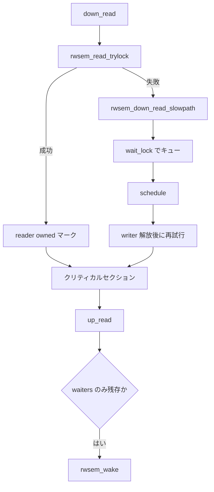

# 第6章 rwsem

> **本章で読むソース**
>
> - [`kernel/locking/rwsem.c` L90-L129](https://github.com/gregkh/linux/blob/v6.18.38/kernel/locking/rwsem.c#L90-L129)
> - [`kernel/locking/rwsem.c` L410-L567](https://github.com/gregkh/linux/blob/v6.18.38/kernel/locking/rwsem.c#L410-L567)
> - [`kernel/locking/rwsem.c` L603-L665](https://github.com/gregkh/linux/blob/v6.18.38/kernel/locking/rwsem.c#L603-L665)
> - [`kernel/locking/rwsem.c` L992-L1105](https://github.com/gregkh/linux/blob/v6.18.38/kernel/locking/rwsem.c#L992-L1105)
> - [`kernel/locking/rwsem.c` L1110-L1208](https://github.com/gregkh/linux/blob/v6.18.38/kernel/locking/rwsem.c#L1110-L1208)
> - [`kernel/locking/rwsem.c` L1254-L1270](https://github.com/gregkh/linux/blob/v6.18.38/kernel/locking/rwsem.c#L1254-L1270)
> - [`kernel/locking/rwsem.c` L1287-L1306](https://github.com/gregkh/linux/blob/v6.18.38/kernel/locking/rwsem.c#L1287-L1306)
> - [`kernel/locking/rwsem.c` L1349-L1366](https://github.com/gregkh/linux/blob/v6.18.38/kernel/locking/rwsem.c#L1349-L1366)
> - [`kernel/locking/rwsem.c` L1371-L1389](https://github.com/gregkh/linux/blob/v6.18.38/kernel/locking/rwsem.c#L1371-L1389)

## この章の狙い

読み書き両方をスリープ待ちで扱う **rwsem** のカウンタエンコーディングと fast path を読む。
`mmap_lock`（ファイルマップの読み書きセマフォ）など、読み取り並行性が必要なスリープ系ロックの実装基盤を押さえる。

## 前提

- [mutex と optimistic spinning](05-mutex-osq.md) を読んでいること。

## count ワードのビット割り当て

64 ビットアーキテクチャでは、writer ビット、waiters ビット、handoff ビット、reader カウントが 1 つの `atomic_long` に詰め込まれる。

[`kernel/locking/rwsem.c` L90-L129](https://github.com/gregkh/linux/blob/v6.18.38/kernel/locking/rwsem.c#L90-L129)

```c
 * Bit  63   - read fail bit
 *
 * On 32-bit architectures, the bit definitions of the count are:
 *
 * Bit  0    - writer locked bit
 * Bit  1    - waiters present bit
 * Bit  2    - lock handoff bit
 * Bits 3-7  - reserved
 * Bits 8-30 - 23-bit reader count
 * Bit  31   - read fail bit
 *
 * It is not likely that the most significant bit (read fail bit) will ever
 * be set. This guard bit is still checked anyway in the down_read() fastpath
 * just in case we need to use up more of the reader bits for other purpose
 * in the future.
 *
 * atomic_long_fetch_add() is used to obtain reader lock, whereas
 * atomic_long_cmpxchg() will be used to obtain writer lock.
 *
 * There are three places where the lock handoff bit may be set or cleared.
 * 1) rwsem_mark_wake() for readers		-- set, clear
 * 2) rwsem_try_write_lock() for writers	-- set, clear
 * 3) rwsem_del_waiter()			-- clear
 *
 * For all the above cases, wait_lock will be held. A writer must also
 * be the first one in the wait_list to be eligible for setting the handoff
 * bit. So concurrent setting/clearing of handoff bit is not possible.
 */
#define RWSEM_WRITER_LOCKED	(1UL << 0)
#define RWSEM_FLAG_WAITERS	(1UL << 1)
#define RWSEM_FLAG_HANDOFF	(1UL << 2)
#define RWSEM_FLAG_READFAIL	(1UL << (BITS_PER_LONG - 1))

#define RWSEM_READER_SHIFT	8
#define RWSEM_READER_BIAS	(1UL << RWSEM_READER_SHIFT)
#define RWSEM_READER_MASK	(~(RWSEM_READER_BIAS - 1))
#define RWSEM_WRITER_MASK	RWSEM_WRITER_LOCKED
#define RWSEM_LOCK_MASK		(RWSEM_WRITER_MASK|RWSEM_READER_MASK)
#define RWSEM_READ_FAILED_MASK	(RWSEM_WRITER_MASK|RWSEM_FLAG_WAITERS|\
				 RWSEM_FLAG_HANDOFF|RWSEM_FLAG_READFAIL)
```

reader は `fetch_add`、writer は `cmpxchg` と役割が分かれる。
handoff ビットは待ち行列先頭への公平な譲渡に使われる。

## rwsem_mark_wake と handoff

`rwsem_wake` から呼ばれる `rwsem_mark_wake` は、先頭 waiter の種別に応じて writer 起床か reader 一括起床を行う。
reader 側では `RWSEM_READER_BIAS` を先に加算し、writer が残っていれば timeout 後に `RWSEM_FLAG_HANDOFF` を立てる。

[`kernel/locking/rwsem.c` L410-L567](https://github.com/gregkh/linux/blob/v6.18.38/kernel/locking/rwsem.c#L410-L567)

```c
static void rwsem_mark_wake(struct rw_semaphore *sem,
			    enum rwsem_wake_type wake_type,
			    struct wake_q_head *wake_q)
{
	struct rwsem_waiter *waiter, *tmp;
	long oldcount, woken = 0, adjustment = 0;
	struct list_head wlist;

	lockdep_assert_held(&sem->wait_lock);

	/*
	 * Take a peek at the queue head waiter such that we can determine
	 * the wakeup(s) to perform.
	 */
	waiter = rwsem_first_waiter(sem);

	if (waiter->type == RWSEM_WAITING_FOR_WRITE) {
		if (wake_type == RWSEM_WAKE_ANY) {
			/*
			 * Mark writer at the front of the queue for wakeup.
			 * Until the task is actually later awoken later by
			 * the caller, other writers are able to steal it.
			 * Readers, on the other hand, will block as they
			 * will notice the queued writer.
			 */
			wake_q_add(wake_q, waiter->task);
			lockevent_inc(rwsem_wake_writer);
		}

		return;
	}

	/*
	 * No reader wakeup if there are too many of them already.
	 */
	if (unlikely(atomic_long_read(&sem->count) < 0))
		return;

	/*
	 * Writers might steal the lock before we grant it to the next reader.
	 * We prefer to do the first reader grant before counting readers
	 * so we can bail out early if a writer stole the lock.
	 */
	if (wake_type != RWSEM_WAKE_READ_OWNED) {
		struct task_struct *owner;

		adjustment = RWSEM_READER_BIAS;
		oldcount = atomic_long_fetch_add(adjustment, &sem->count);
		if (unlikely(oldcount & RWSEM_WRITER_MASK)) {
			/*
			 * When we've been waiting "too" long (for writers
			 * to give up the lock), request a HANDOFF to
			 * force the issue.
			 */
			if (time_after(jiffies, waiter->timeout)) {
				if (!(oldcount & RWSEM_FLAG_HANDOFF)) {
					adjustment -= RWSEM_FLAG_HANDOFF;
					lockevent_inc(rwsem_rlock_handoff);
				}
				waiter->handoff_set = true;
			}

			atomic_long_add(-adjustment, &sem->count);
			return;
		}
		/*
		 * Set it to reader-owned to give spinners an early
		 * indication that readers now have the lock.
		 * The reader nonspinnable bit seen at slowpath entry of
		 * the reader is copied over.
		 */
		owner = waiter->task;
		__rwsem_set_reader_owned(sem, owner);
	}

	/*
	 * Grant up to MAX_READERS_WAKEUP read locks to all the readers in the
	 * queue. We know that the woken will be at least 1 as we accounted
	 * for above. Note we increment the 'active part' of the count by the
	 * number of readers before waking any processes up.
	 *
	 * This is an adaptation of the phase-fair R/W locks where at the
	 * reader phase (first waiter is a reader), all readers are eligible
	 * to acquire the lock at the same time irrespective of their order
	 * in the queue. The writers acquire the lock according to their
	 * order in the queue.
	 *
	 * We have to do wakeup in 2 passes to prevent the possibility that
	 * the reader count may be decremented before it is incremented. It
	 * is because the to-be-woken waiter may not have slept yet. So it
	 * may see waiter->task got cleared, finish its critical section and
	 * do an unlock before the reader count increment.
	 *
	 * 1) Collect the read-waiters in a separate list, count them and
	 *    fully increment the reader count in rwsem.
	 * 2) For each waiters in the new list, clear waiter->task and
	 *    put them into wake_q to be woken up later.
	 */
	INIT_LIST_HEAD(&wlist);
	list_for_each_entry_safe(waiter, tmp, &sem->wait_list, list) {
		if (waiter->type == RWSEM_WAITING_FOR_WRITE)
			continue;

		woken++;
		list_move_tail(&waiter->list, &wlist);

		/*
		 * Limit # of readers that can be woken up per wakeup call.
		 */
		if (unlikely(woken >= MAX_READERS_WAKEUP))
			break;
	}

	adjustment = woken * RWSEM_READER_BIAS - adjustment;
	lockevent_cond_inc(rwsem_wake_reader, woken);

	oldcount = atomic_long_read(&sem->count);
	if (list_empty(&sem->wait_list)) {
		/*
		 * Combined with list_move_tail() above, this implies
		 * rwsem_del_waiter().
		 */
		adjustment -= RWSEM_FLAG_WAITERS;
		if (oldcount & RWSEM_FLAG_HANDOFF)
			adjustment -= RWSEM_FLAG_HANDOFF;
	} else if (woken) {
		/*
		 * When we've woken a reader, we no longer need to force
		 * writers to give up the lock and we can clear HANDOFF.
		 */
		if (oldcount & RWSEM_FLAG_HANDOFF)
			adjustment -= RWSEM_FLAG_HANDOFF;
	}

	if (adjustment)
		atomic_long_add(adjustment, &sem->count);

	/* 2nd pass */
	list_for_each_entry_safe(waiter, tmp, &wlist, list) {
		struct task_struct *tsk;

		tsk = waiter->task;
		get_task_struct(tsk);

		/*
		 * Ensure calling get_task_struct() before setting the reader
		 * waiter to nil such that rwsem_down_read_slowpath() cannot
		 * race with do_exit() by always holding a reference count
		 * to the task to wakeup.
		 */
		smp_store_release(&waiter->task, NULL);
		/*
		 * Ensure issuing the wakeup (either by us or someone else)
		 * after setting the reader waiter to nil.
		 */
		wake_q_add_safe(wake_q, tsk);
	}
}
```

## rwsem_try_write_lock

writer slow path のループ内では `rwsem_try_write_lock` が先頭 waiter だけにロック取得を許す。
timeout 後は `RWSEM_FLAG_HANDOFF` を立て、先頭以外は取得を拒否する。

[`kernel/locking/rwsem.c` L603-L665](https://github.com/gregkh/linux/blob/v6.18.38/kernel/locking/rwsem.c#L603-L665)

```c
static inline bool rwsem_try_write_lock(struct rw_semaphore *sem,
					struct rwsem_waiter *waiter)
{
	struct rwsem_waiter *first = rwsem_first_waiter(sem);
	long count, new;

	lockdep_assert_held(&sem->wait_lock);

	count = atomic_long_read(&sem->count);
	do {
		bool has_handoff = !!(count & RWSEM_FLAG_HANDOFF);

		if (has_handoff) {
			/*
			 * Honor handoff bit and yield only when the first
			 * waiter is the one that set it. Otherwisee, we
			 * still try to acquire the rwsem.
			 */
			if (first->handoff_set && (waiter != first))
				return false;
		}

		new = count;

		if (count & RWSEM_LOCK_MASK) {
			/*
			 * A waiter (first or not) can set the handoff bit
			 * if it is an RT task or wait in the wait queue
			 * for too long.
			 */
			if (has_handoff || (!rt_or_dl_task(waiter->task) &&
					    !time_after(jiffies, waiter->timeout)))
				return false;

			new |= RWSEM_FLAG_HANDOFF;
		} else {
			new |= RWSEM_WRITER_LOCKED;
			new &= ~RWSEM_FLAG_HANDOFF;

			if (list_is_singular(&sem->wait_list))
				new &= ~RWSEM_FLAG_WAITERS;
		}
	} while (!atomic_long_try_cmpxchg_acquire(&sem->count, &count, new));

	/*
	 * We have either acquired the lock with handoff bit cleared or set
	 * the handoff bit. Only the first waiter can have its handoff_set
	 * set here to enable optimistic spinning in slowpath loop.
	 */
	if (new & RWSEM_FLAG_HANDOFF) {
		first->handoff_set = true;
		lockevent_inc(rwsem_wlock_handoff);
		return false;
	}

	/*
	 * Have rwsem_try_write_lock() fully imply rwsem_del_waiter() on
	 * success.
	 */
	list_del(&waiter->list);
	rwsem_set_owner(sem);
	return true;
}
```

## down_read の fast path と slow path

読み取り側は `rwsem_read_trylock` を試し、失敗時だけ `rwsem_down_read_slowpath` へ入る。

[`kernel/locking/rwsem.c` L1254-L1270](https://github.com/gregkh/linux/blob/v6.18.38/kernel/locking/rwsem.c#L1254-L1270)

```c
static __always_inline int __down_read_common(struct rw_semaphore *sem, int state)
{
	int ret = 0;
	long count;

	preempt_disable();
	if (!rwsem_read_trylock(sem, &count)) {
		if (IS_ERR(rwsem_down_read_slowpath(sem, count, state))) {
			ret = -EINTR;
			goto out;
		}
		DEBUG_RWSEMS_WARN_ON(!is_rwsem_reader_owned(sem), sem);
	}
out:
	preempt_enable();
	return ret;
}
```

trylock 成功時は `RWSEM_READER_BIAS` を加算し、reader owned マーカを付ける。

[`kernel/locking/rwsem.c` L1287-L1306](https://github.com/gregkh/linux/blob/v6.18.38/kernel/locking/rwsem.c#L1287-L1306)

```c
static inline int __down_read_trylock(struct rw_semaphore *sem)
{
	int ret = 0;
	long tmp;

	DEBUG_RWSEMS_WARN_ON(sem->magic != sem, sem);

	preempt_disable();
	tmp = atomic_long_read(&sem->count);
	while (!(tmp & RWSEM_READ_FAILED_MASK)) {
		if (atomic_long_try_cmpxchg_acquire(&sem->count, &tmp,
						    tmp + RWSEM_READER_BIAS)) {
			rwsem_set_reader_owned(sem);
			ret = 1;
			break;
		}
	}
	preempt_enable();
	return ret;
}
```

書き込み側は `rwsem_write_trylock` を試し、失敗時だけ slow path へ入る。

[`kernel/locking/rwsem.c` L1311-L1321](https://github.com/gregkh/linux/blob/v6.18.38/kernel/locking/rwsem.c#L1311-L1321)

```c
static __always_inline int __down_write_common(struct rw_semaphore *sem, int state)
{
	int ret = 0;

	preempt_disable();
	if (unlikely(!rwsem_write_trylock(sem))) {
		if (IS_ERR(rwsem_down_write_slowpath(sem, state)))
			ret = -EINTR;
	}
	preempt_enable();
	return ret;
}
```

**最適化の工夫**：reader は単一の `fetch_add` で済む設計に近く、writer や waiters がいない限り wait_lock を取らない。
読み取り支配的な `mmap` 走査ではスケジューラへの出入りを避けられる。

## rwsem_down_read_slowpath

fast path 失敗後は `wait_lock` で waiter を追加し、`rwsem_mark_wake` が `waiter->task` を NULL にするまで schedule する。

[`kernel/locking/rwsem.c` L992-L1105](https://github.com/gregkh/linux/blob/v6.18.38/kernel/locking/rwsem.c#L992-L1105)

```c
static struct rw_semaphore __sched *
rwsem_down_read_slowpath(struct rw_semaphore *sem, long count, unsigned int state)
{
	long adjustment = -RWSEM_READER_BIAS;
	long rcnt = (count >> RWSEM_READER_SHIFT);
	struct rwsem_waiter waiter;
	DEFINE_WAKE_Q(wake_q);

	/*
	 * To prevent a constant stream of readers from starving a sleeping
	 * writer, don't attempt optimistic lock stealing if the lock is
	 * very likely owned by readers.
	 */
	if ((atomic_long_read(&sem->owner) & RWSEM_READER_OWNED) &&
	    (rcnt > 1) && !(count & RWSEM_WRITER_LOCKED))
		goto queue;

	/*
	 * Reader optimistic lock stealing.
	 */
	if (!(count & (RWSEM_WRITER_LOCKED | RWSEM_FLAG_HANDOFF))) {
		rwsem_set_reader_owned(sem);
		lockevent_inc(rwsem_rlock_steal);

		/*
		 * Wake up other readers in the wait queue if it is
		 * the first reader.
		 */
		if ((rcnt == 1) && (count & RWSEM_FLAG_WAITERS)) {
			raw_spin_lock_irq(&sem->wait_lock);
			if (!list_empty(&sem->wait_list))
				rwsem_mark_wake(sem, RWSEM_WAKE_READ_OWNED,
						&wake_q);
			raw_spin_unlock_irq(&sem->wait_lock);
			wake_up_q(&wake_q);
		}
		return sem;
	}

queue:
	waiter.task = current;
	waiter.type = RWSEM_WAITING_FOR_READ;
	waiter.timeout = jiffies + RWSEM_WAIT_TIMEOUT;
	waiter.handoff_set = false;

	raw_spin_lock_irq(&sem->wait_lock);
	if (list_empty(&sem->wait_list)) {
		/*
		 * In case the wait queue is empty and the lock isn't owned
		 * by a writer, this reader can exit the slowpath and return
		 * immediately as its RWSEM_READER_BIAS has already been set
		 * in the count.
		 */
		if (!(atomic_long_read(&sem->count) & RWSEM_WRITER_MASK)) {
			/* Provide lock ACQUIRE */
			smp_acquire__after_ctrl_dep();
			raw_spin_unlock_irq(&sem->wait_lock);
			rwsem_set_reader_owned(sem);
			lockevent_inc(rwsem_rlock_fast);
			return sem;
		}
		adjustment += RWSEM_FLAG_WAITERS;
	}
	rwsem_add_waiter(sem, &waiter);

	/* we're now waiting on the lock, but no longer actively locking */
	count = atomic_long_add_return(adjustment, &sem->count);

	rwsem_cond_wake_waiter(sem, count, &wake_q);
	raw_spin_unlock_irq(&sem->wait_lock);

	if (!wake_q_empty(&wake_q))
		wake_up_q(&wake_q);

	trace_contention_begin(sem, LCB_F_READ);
	set_current_state(state);

	if (state == TASK_UNINTERRUPTIBLE)
		hung_task_set_blocker(sem, BLOCKER_TYPE_RWSEM_READER);

	/* wait to be given the lock */
	for (;;) {
		if (!smp_load_acquire(&waiter.task)) {
			/* Matches rwsem_mark_wake()'s smp_store_release(). */
			break;
		}
		if (signal_pending_state(state, current)) {
			raw_spin_lock_irq(&sem->wait_lock);
			if (waiter.task)
				goto out_nolock;
			raw_spin_unlock_irq(&sem->wait_lock);
			/* Ordered by sem->wait_lock against rwsem_mark_wake(). */
			break;
		}
		schedule_preempt_disabled();
		lockevent_inc(rwsem_sleep_reader);
		set_current_state(state);
	}

	if (state == TASK_UNINTERRUPTIBLE)
		hung_task_clear_blocker();

	__set_current_state(TASK_RUNNING);
	lockevent_inc(rwsem_rlock);
	trace_contention_end(sem, 0);
	return sem;

out_nolock:
	rwsem_del_wake_waiter(sem, &waiter, &wake_q);
	__set_current_state(TASK_RUNNING);
	lockevent_inc(rwsem_rlock_fail);
	trace_contention_end(sem, -EINTR);
	return ERR_PTR(-EINTR);
}
```

## rwsem_down_write_slowpath

writer は optimistic spin 失敗後に `wait_list` へ入り、`rwsem_try_write_lock` をループで試す。

[`kernel/locking/rwsem.c` L1110-L1208](https://github.com/gregkh/linux/blob/v6.18.38/kernel/locking/rwsem.c#L1110-L1208)

```c
static struct rw_semaphore __sched *
rwsem_down_write_slowpath(struct rw_semaphore *sem, int state)
{
	struct rwsem_waiter waiter;
	DEFINE_WAKE_Q(wake_q);

	/* do optimistic spinning and steal lock if possible */
	if (rwsem_can_spin_on_owner(sem) && rwsem_optimistic_spin(sem)) {
		/* rwsem_optimistic_spin() implies ACQUIRE on success */
		return sem;
	}

	/*
	 * Optimistic spinning failed, proceed to the slowpath
	 * and block until we can acquire the sem.
	 */
	waiter.task = current;
	waiter.type = RWSEM_WAITING_FOR_WRITE;
	waiter.timeout = jiffies + RWSEM_WAIT_TIMEOUT;
	waiter.handoff_set = false;

	raw_spin_lock_irq(&sem->wait_lock);
	rwsem_add_waiter(sem, &waiter);

	/* we're now waiting on the lock */
	if (rwsem_first_waiter(sem) != &waiter) {
		rwsem_cond_wake_waiter(sem, atomic_long_read(&sem->count),
				       &wake_q);
		if (!wake_q_empty(&wake_q)) {
			/*
			 * We want to minimize wait_lock hold time especially
			 * when a large number of readers are to be woken up.
			 */
			raw_spin_unlock_irq(&sem->wait_lock);
			wake_up_q(&wake_q);
			raw_spin_lock_irq(&sem->wait_lock);
		}
	} else {
		atomic_long_or(RWSEM_FLAG_WAITERS, &sem->count);
	}

	/* wait until we successfully acquire the lock */
	set_current_state(state);
	trace_contention_begin(sem, LCB_F_WRITE);

	if (state == TASK_UNINTERRUPTIBLE)
		hung_task_set_blocker(sem, BLOCKER_TYPE_RWSEM_WRITER);

	for (;;) {
		if (rwsem_try_write_lock(sem, &waiter)) {
			/* rwsem_try_write_lock() implies ACQUIRE on success */
			break;
		}

		raw_spin_unlock_irq(&sem->wait_lock);

		if (signal_pending_state(state, current))
			goto out_nolock;

		/*
		 * After setting the handoff bit and failing to acquire
		 * the lock, attempt to spin on owner to accelerate lock
		 * transfer. If the previous owner is a on-cpu writer and it
		 * has just released the lock, OWNER_NULL will be returned.
		 * In this case, we attempt to acquire the lock again
		 * without sleeping.
		 */
		if (waiter.handoff_set) {
			enum owner_state owner_state;

			owner_state = rwsem_spin_on_owner(sem);
			if (owner_state == OWNER_NULL)
				goto trylock_again;
		}

		schedule_preempt_disabled();
		lockevent_inc(rwsem_sleep_writer);
		set_current_state(state);
trylock_again:
		raw_spin_lock_irq(&sem->wait_lock);
	}

	if (state == TASK_UNINTERRUPTIBLE)
		hung_task_clear_blocker();

	__set_current_state(TASK_RUNNING);
	raw_spin_unlock_irq(&sem->wait_lock);
	lockevent_inc(rwsem_wlock);
	trace_contention_end(sem, 0);
	return sem;

out_nolock:
	__set_current_state(TASK_RUNNING);
	raw_spin_lock_irq(&sem->wait_lock);
	rwsem_del_wake_waiter(sem, &waiter, &wake_q);
	lockevent_inc(rwsem_wlock_fail);
	trace_contention_end(sem, -EINTR);
	return ERR_PTR(-EINTR);
}
```

## up_read と up_write

解放側は `_release` 付き算術演算でカウンタを戻し、waiters がいれば `rwsem_wake` する。

[`kernel/locking/rwsem.c` L1349-L1366](https://github.com/gregkh/linux/blob/v6.18.38/kernel/locking/rwsem.c#L1349-L1366)

```c
static inline void __up_read(struct rw_semaphore *sem)
{
	long tmp;

	DEBUG_RWSEMS_WARN_ON(sem->magic != sem, sem);
	DEBUG_RWSEMS_WARN_ON(!is_rwsem_reader_owned(sem), sem);

	preempt_disable();
	rwsem_clear_reader_owned(sem);
	tmp = atomic_long_add_return_release(-RWSEM_READER_BIAS, &sem->count);
	DEBUG_RWSEMS_WARN_ON(tmp < 0, sem);
	if (unlikely((tmp & (RWSEM_LOCK_MASK|RWSEM_FLAG_WAITERS)) ==
		      RWSEM_FLAG_WAITERS)) {
		clear_nonspinnable(sem);
		rwsem_wake(sem);
	}
	preempt_enable();
}
```

writer 解放は `RWSEM_WRITER_LOCKED` を落とすだけで、waiters フラグが立っていれば wake する。

[`kernel/locking/rwsem.c` L1371-L1389](https://github.com/gregkh/linux/blob/v6.18.38/kernel/locking/rwsem.c#L1371-L1389)

```c
static inline void __up_write(struct rw_semaphore *sem)
{
	long tmp;

	DEBUG_RWSEMS_WARN_ON(sem->magic != sem, sem);
	/*
	 * sem->owner may differ from current if the ownership is transferred
	 * to an anonymous writer by setting the RWSEM_NONSPINNABLE bits.
	 */
	DEBUG_RWSEMS_WARN_ON((rwsem_owner(sem) != current) &&
			    !rwsem_test_oflags(sem, RWSEM_NONSPINNABLE), sem);

	preempt_disable();
	rwsem_clear_owner(sem);
	tmp = atomic_long_fetch_add_release(-RWSEM_WRITER_LOCKED, &sem->count);
	if (unlikely(tmp & RWSEM_FLAG_WAITERS))
		rwsem_wake(sem);
	preempt_enable();
}
```

## 処理の流れ：読み取りロック取得



rwsem も mutex と同様に optimistic spinning を持ち、owner が実行中ならスピンして schedule を遅らせる。

## mutex との違い

mutex は単一所有者のみだが、rwsem は複数 reader をカウンタで許容する。
writer は排他的で、reader が存在する間は writer fast path は失敗する。
用途としては、読み取りが多い VFS やメモリ管理の臨界区に rwsem が選ばれる。

> **7.x 系での変化**
> [`include/linux/rwsem.h` L60](https://github.com/gregkh/linux/blob/v7.1.3/include/linux/rwsem.h#L60) で `struct rw_semaphore` が `first_waiter` ポインタを持つ。
> [`L109`](https://github.com/gregkh/linux/blob/v7.1.3/include/linux/rwsem.h#L109) と [`L134`](https://github.com/gregkh/linux/blob/v7.1.3/include/linux/rwsem.h#L134) 付近で `rwsem_is_contended` 等が `first_waiter` を参照する。
> 6.18.38 の `wait_list` 先頭依存から、明示ポインタによる先頭 waiter 管理へ置き換わっている。

## まとめ

- rwsem は 1 ワードのカウンタに reader 数と writer 状態をエンコードする。
- reader fast path は `cmpxchg_acquire` によるバイアス加算が中心である。
- handoff と waiters フラグが公平な起床を制御する。

## 関連する章

- [mutex と optimistic spinning](05-mutex-osq.md)
- [rwlock と seqlock](../part01-spinning/04-rwlock-seqlock.md)
- [ww_mutex と percpu-rwsem](07-ww-mutex-percpu-rwsem.md)
- [waitqueue](08-waitqueue.md)
- [lockdep](../part03-correctness/10-lockdep.md)
