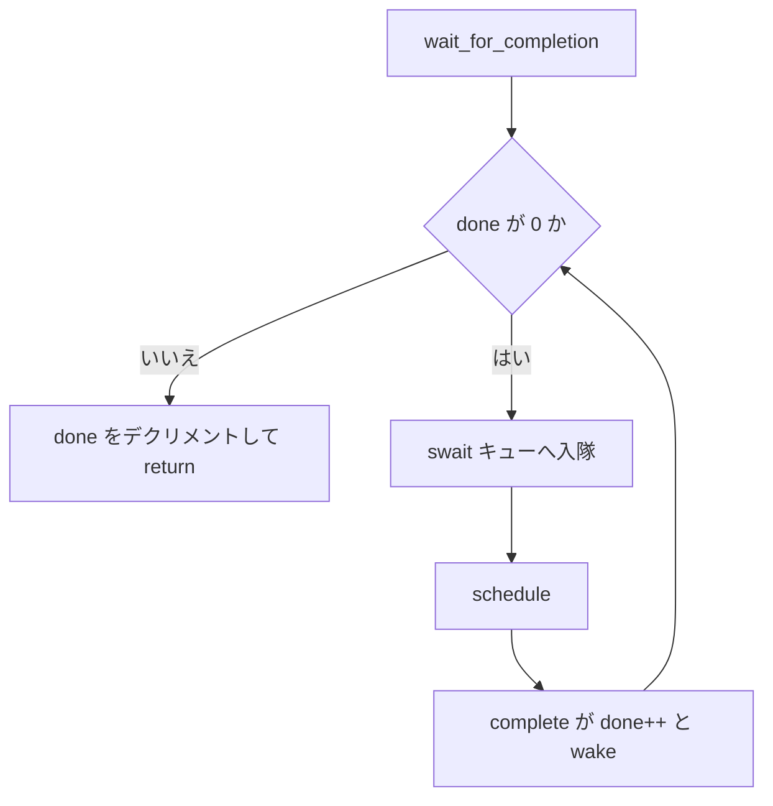

# 第7章 semaphore と completion

> **本章で読むソース**
>
> - [`kernel/locking/semaphore.c` L12-L25](https://github.com/gregkh/linux/blob/v6.18.38/kernel/locking/semaphore.c#L12-L25)
> - [`kernel/locking/semaphore.c` L80-L102](https://github.com/gregkh/linux/blob/v6.18.38/kernel/locking/semaphore.c#L80-L102)
> - [`kernel/sched/completion.c` L38-L53](https://github.com/gregkh/linux/blob/v6.18.38/kernel/sched/completion.c#L38-L53)
> - [`kernel/sched/completion.c` L72-L82](https://github.com/gregkh/linux/blob/v6.18.38/kernel/sched/completion.c#L72-L82)
> - [`kernel/sched/completion.c` L112-L127](https://github.com/gregkh/linux/blob/v6.18.38/kernel/sched/completion.c#L112-L127)
> - [`kernel/sched/completion.c` L141-L155](https://github.com/gregkh/linux/blob/v6.18.38/kernel/sched/completion.c#L141-L155)

## この章の狙い

カウント型の **semaphore** と、一回限りの合図に使う **completion** を読む。
mutex ほど厳密なデバッグ支援はない semaphore の位置づけと、ドライバ初期化で多用される completion の待ち合わせモデルを押さえる。

## 前提

- [mutex と optimistic spinning](05-mutex-osq.md) を読んでいること。

## semaphore の実装メモ

semaphore は内部 `spinlock` で `count` と `wait_list` を保護する。
`count` は「あと何回取得できるか」を表し、ゼロなら待ち行列へ入る。

[`kernel/locking/semaphore.c` L12-L25](https://github.com/gregkh/linux/blob/v6.18.38/kernel/locking/semaphore.c#L12-L25)

```c
/*
 * Some notes on the implementation:
 *
 * The spinlock controls access to the other members of the semaphore.
 * down_trylock() and up() can be called from interrupt context, so we
 * have to disable interrupts when taking the lock.  It turns out various
 * parts of the kernel expect to be able to use down() on a semaphore in
 * interrupt context when they know it will succeed, so we have to use
 * irqsave variants for down(), down_interruptible() and down_killable()
 * too.
 *
 * The ->count variable represents how many more tasks can acquire this
 * semaphore.  If it's zero, there may be tasks waiting on the wait_list.
 */
```

`down` は `count > 0` なら即デクリメントし、そうでなければ `__down` でスリープする。

[`kernel/locking/semaphore.c` L80-L102](https://github.com/gregkh/linux/blob/v6.18.38/kernel/locking/semaphore.c#L80-L102)

```c
/**
 * down - acquire the semaphore
 * @sem: the semaphore to be acquired
 *
 * Acquires the semaphore.  If no more tasks are allowed to acquire the
 * semaphore, calling this function will put the task to sleep until the
 * semaphore is released.
 *
 * Use of this function is deprecated, please use down_interruptible() or
 * down_killable() instead.
 */
void __sched down(struct semaphore *sem)
{
	unsigned long flags;

	might_sleep();
	raw_spin_lock_irqsave(&sem->lock, flags);
	if (likely(sem->count > 0))
		__sem_acquire(sem);
	else
		__down(sem);
	raw_spin_unlock_irqrestore(&sem->lock, flags);
}
```

新規コードでは mutex や `permit` パターンが推奨され、`down` 自体は非推奨とコメントされている。
lockdep の追跡も mutex ほど手厚くない。

## completion の基本

`completion` は `done` カウンタと `swait_queue_head` で「一度きりの合図」を表現する。
`complete` は待ち行列から 1 スレッドを起こす。

[`kernel/sched/completion.c` L38-L53](https://github.com/gregkh/linux/blob/v6.18.38/kernel/sched/completion.c#L38-L53)

```c
/**
 * complete: - signals a single thread waiting on this completion
 * @x:  holds the state of this particular completion
 *
 * This will wake up a single thread waiting on this completion. Threads will be
 * awakened in the same order in which they were queued.
 *
 * See also complete_all(), wait_for_completion() and related routines.
 *
 * If this function wakes up a task, it executes a full memory barrier before
 * accessing the task state.
 */
void complete(struct completion *x)
{
	complete_with_flags(x, 0);
}
```

`complete_all` は `done` を `UINT_MAX` に設定し、全 waiter を一度に起こす。
再利用するには `reinit_completion` が必要である。

[`kernel/sched/completion.c` L72-L82](https://github.com/gregkh/linux/blob/v6.18.38/kernel/sched/completion.c#L72-L82)

```c
void complete_all(struct completion *x)
{
	unsigned long flags;

	lockdep_assert_RT_in_threaded_ctx();

	raw_spin_lock_irqsave(&x->wait.lock, flags);
	x->done = UINT_MAX;
	swake_up_all_locked(&x->wait);
	raw_spin_unlock_irqrestore(&x->wait.lock, flags);
}
```

## wait_for_completion のループ

待ち側は `swait` キューに入り、`schedule_timeout` でスリープする。
`done` が非ゼロならデクリメントして戻る。

[`kernel/sched/completion.c` L112-L127](https://github.com/gregkh/linux/blob/v6.18.38/kernel/sched/completion.c#L112-L127)

```c
static inline long __sched
__wait_for_common(struct completion *x,
		  long (*action)(long), long timeout, int state)
{
	might_sleep();

	complete_acquire(x);

	raw_spin_lock_irq(&x->wait.lock);
	timeout = do_wait_for_common(x, action, timeout, state);
	raw_spin_unlock_irq(&x->wait.lock);

	complete_release(x);

	return timeout;
}
```

エクスポートされる `wait_for_completion` はタイムアウトなしの不可侵スリープである。

[`kernel/sched/completion.c` L141-L155](https://github.com/gregkh/linux/blob/v6.18.38/kernel/sched/completion.c#L141-L155)

```c
/**
 * wait_for_completion: - waits for completion of a task
 * @x:  holds the state of this particular completion
 *
 * This waits to be signaled for completion of a specific task. It is NOT
 * interruptible and there is no timeout.
 *
 * See also similar routines (i.e. wait_for_completion_timeout()) with timeout
 * and interrupt capability. Also see complete().
 */
void __sched wait_for_completion(struct completion *x)
{
	wait_for_common(x, MAX_SCHEDULE_TIMEOUT, TASK_UNINTERRUPTIBLE);
}
```

**最適化の工夫**：`complete` 側がメモリバリアを担うため、待ち側は `done` カウンタを見るだけで合図を受け取れる。
ドライバのプローブ完了待ちのように、待ちが 1 回きりの場面では mutex よりオーバーヘッドが小さい。

## 処理の流れ：completion 待ち合わせ



割り込み文脈からは `complete` を呼べるが、`wait_for_completion` はプロセス文脈専用である。
`complete_and_exit` パターンは終了処理と合図を一体化する。

## semaphore と completion の使い分け

semaphore は N 並列のリソース枠に向くが、カーネル内部では利用が縮小している。
completion は「作業完了の一回限りの通知」に特化し、RCU の `synchronize_srcu` 内部でも `completion` が使われる（第12章）。

## まとめ

- semaphore は count と spinlock で複数取得を許容するが、新規利用は非推奨に近い。
- completion は done カウンタと swait で単発の起床を実装する。
- `complete` と `wait_for_completion` はメモリバリアの分担で軽量な待ち合わせになる。

## 関連する章

- [mutex と optimistic spinning](05-mutex-osq.md)
- [SRCU](../part04-rcu/12-srcu.md)
- [Tree RCU と grace period](../part04-rcu/11-tree-rcu-gp.md)
