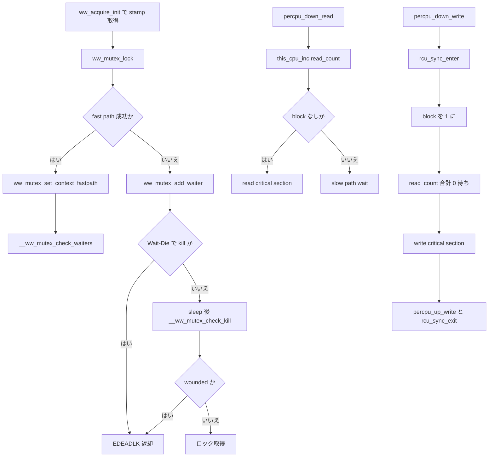

# 第7章 ww_mutex と percpu-rwsem

> **本章で読むソース**
>
> - [`include/linux/ww_mutex.h` L38-L66](https://github.com/gregkh/linux/blob/v6.18.38/include/linux/ww_mutex.h#L38-L66)
> - [`include/linux/ww_mutex.h` L142-L149](https://github.com/gregkh/linux/blob/v6.18.38/include/linux/ww_mutex.h#L142-L149)
> - [`kernel/locking/ww_mutex.h` L164-L174](https://github.com/gregkh/linux/blob/v6.18.38/kernel/locking/ww_mutex.h#L164-L174)
> - [`kernel/locking/ww_mutex.h` L227-L266](https://github.com/gregkh/linux/blob/v6.18.38/kernel/locking/ww_mutex.h#L227-L266)
> - [`kernel/locking/ww_mutex.h` L306-L357](https://github.com/gregkh/linux/blob/v6.18.38/kernel/locking/ww_mutex.h#L306-L357)
> - [`kernel/locking/ww_mutex.h` L464-L499](https://github.com/gregkh/linux/blob/v6.18.38/kernel/locking/ww_mutex.h#L464-L499)
> - [`kernel/locking/ww_mutex.h` L512-L582](https://github.com/gregkh/linux/blob/v6.18.38/kernel/locking/ww_mutex.h#L512-L582)
> - [`kernel/locking/percpu-rwsem.c` L14-L30](https://github.com/gregkh/linux/blob/v6.18.38/kernel/locking/percpu-rwsem.c#L14-L30)
> - [`kernel/locking/percpu-rwsem.c` L48-L82](https://github.com/gregkh/linux/blob/v6.18.38/kernel/locking/percpu-rwsem.c#L48-L82)
> - [`kernel/locking/percpu-rwsem.c` L227-L259](https://github.com/gregkh/linux/blob/v6.18.38/kernel/locking/percpu-rwsem.c#L227-L259)
> - [`kernel/locking/percpu-rwsem.c` L262-L289](https://github.com/gregkh/linux/blob/v6.18.38/kernel/locking/percpu-rwsem.c#L262-L289)

## この章の狙い

**ww_mutex**（wound/wait mutex）は、複数ロックを任意順序で取るドライバ等向けにデッドロックを検出し、待ち行列の順序付けで回避する。
**percpu-rwsem** は read 側を per-CPU カウンタに分散し、writer 側は `rcu_sync` で read fast path を安全に遮断する。
第5章の mutex、第6章の rwsem を前提に、それぞれの拡張実装を読む。

## 前提

- [mutex と optimistic spinning](05-mutex-osq.md) と [rwsem](06-rwsem.md) を読んでいること。
- per-CPU 変数の基礎は [per-CPU 変数](../part00-foundation/02-percpu.md) を参照する。

## ww_mutex のコンテキストと ww_class

`ww_mutex` は通常の `mutex`（または RT 構成では `rt_mutex`）を `base` に持ち、取得中の **acquire context** `ww_acquire_ctx` を `ctx` に紐づける。
`ww_class` は Wait-Die か Wound-Wait かを `is_wait_die` で固定し、クラスごとに stamp を配る。

[`include/linux/ww_mutex.h` L38-L66](https://github.com/gregkh/linux/blob/v6.18.38/include/linux/ww_mutex.h#L38-L66)

```c
struct ww_class {
	atomic_long_t stamp;
	struct lock_class_key acquire_key;
	struct lock_class_key mutex_key;
	const char *acquire_name;
	const char *mutex_name;
	unsigned int is_wait_die;
};

struct ww_mutex {
	struct WW_MUTEX_BASE base;
	struct ww_acquire_ctx *ctx;
#ifdef DEBUG_WW_MUTEXES
	struct ww_class *ww_class;
#endif
};

struct ww_acquire_ctx {
	struct task_struct *task;
	unsigned long stamp;
	unsigned int acquired;
	unsigned short wounded;
	unsigned short is_wait_die;
// ... (中略) ...
};
```

`ww_acquire_init` は context に単調増加 stamp を割り当て、以降の順序比較の基準にする。

[`include/linux/ww_mutex.h` L142-L149](https://github.com/gregkh/linux/blob/v6.18.38/include/linux/ww_mutex.h#L142-L149)

```c
static inline void ww_acquire_init(struct ww_acquire_ctx *ctx,
				   struct ww_class *ww_class)
{
	ctx->task = current;
	ctx->stamp = atomic_long_inc_return_relaxed(&ww_class->stamp);
	ctx->acquired = 0;
	ctx->wounded = false;
	ctx->is_wait_die = ww_class->is_wait_die;
```

同一 `ww_class` 内で複数 `ww_mutex` を取る順序は自由である。
`-EDEADLK` を受け取ったあとは `ww_mutex_unlock` で既取得分を解放してから再試行する契約になる。

## Wait-Die と Wound-Wait

2方式は待ち行列に並ぶ transaction の新旧関係で衝突を解消する。

[`kernel/locking/ww_mutex.h` L164-L174](https://github.com/gregkh/linux/blob/v6.18.38/kernel/locking/ww_mutex.h#L164-L174)

```c
/*
 * Wait-Die:
 *   The newer transactions are killed when:
 *     It (the new transaction) makes a request for a lock being held
 *     by an older transaction.
 *
 * Wound-Wait:
 *   The newer transactions are wounded when:
 *     An older transaction makes a request for a lock being held by
 *     the newer transaction.
 */
```

Wait-Die は若い側が `-EDEADLK` で自害し、Wound-Wait は若い保持者に `wounded` フラグを立てて再試行させる。
どちらも「古い transaction を優先する」という同じ方針で、衝突時の犠牲者だけが異なる。

## __ww_ctx_less による順序

「より重要な transaction」は RT 優先度（WW_RT 時）を先に比較し、同順位なら stamp が小さい（古い）側が優先される。
stamp の大小比較では「大きいほど若い」ので、`__ww_ctx_less(a, b)` が真なら `a` は `b` より劣後する。

[`kernel/locking/ww_mutex.h` L227-L266](https://github.com/gregkh/linux/blob/v6.18.38/kernel/locking/ww_mutex.h#L227-L266)

```c
static inline bool
__ww_ctx_less(struct ww_acquire_ctx *a, struct ww_acquire_ctx *b)
{
// ... (中略) ...
#ifdef WW_RT
	/* kernel prio; less is more */
	int a_prio = a->task->prio;
	int b_prio = b->task->prio;

	if (rt_or_dl_prio(a_prio) || rt_or_dl_prio(b_prio)) {

		if (a_prio > b_prio)
			return true;

		if (a_prio < b_prio)
			return false;

		/* equal static prio */

		if (dl_prio(a_prio)) {
			if (dl_time_before(b->task->dl.deadline,
					   a->task->dl.deadline))
				return true;

			if (dl_time_before(a->task->dl.deadline,
					   b->task->dl.deadline))
				return false;
		}

		/* equal prio */
	}
#endif

	/* FIFO order tie break -- bigger is younger */
	return (signed long)(a->stamp - b->stamp) > 0;
}
```

## 待ち行列への挿入と kill/wound

`__ww_mutex_add_waiter` は stamp 昇順（古い transaction ほど先頭に近い）で待ち行列へ挿入する。
Wait-Die では自分より古い waiter がいれば即 `-EDEADLK` を返し、Wound-Wait では保持者が若ければ `__ww_mutex_wound` で `wounded` を立てる。

[`kernel/locking/ww_mutex.h` L512-L582](https://github.com/gregkh/linux/blob/v6.18.38/kernel/locking/ww_mutex.h#L512-L582)

```c
static inline int
__ww_mutex_add_waiter(struct MUTEX_WAITER *waiter,
		      struct MUTEX *lock,
		      struct ww_acquire_ctx *ww_ctx,
		      struct wake_q_head *wake_q)
{
	struct MUTEX_WAITER *cur, *pos = NULL;
	bool is_wait_die;

	if (!ww_ctx) {
		__ww_waiter_add(lock, waiter, NULL);
		return 0;
	}

	is_wait_die = ww_ctx->is_wait_die;

	for (cur = __ww_waiter_last(lock); cur;
	     cur = __ww_waiter_prev(lock, cur)) {

		if (!cur->ww_ctx)
			continue;

		if (__ww_ctx_less(ww_ctx, cur->ww_ctx)) {
			if (is_wait_die) {
				int ret = __ww_mutex_kill(lock, ww_ctx);

				if (ret)
					return ret;
			}

			break;
		}

		pos = cur;

		__ww_mutex_die(lock, cur, ww_ctx, wake_q);
	}

	__ww_waiter_add(lock, waiter, pos);

	if (!is_wait_die) {
		struct ww_mutex *ww = container_of(lock, struct ww_mutex, base);

		smp_mb();
		__ww_mutex_wound(lock, ww_ctx, ww->ctx, wake_q);
	}

	return 0;
}
```

Wound-Wait 側の `__ww_mutex_wound` は、待ち側 transaction が既に他ロックを保持しており、保持者より古いときだけ owner に `wounded` を通知する。

[`kernel/locking/ww_mutex.h` L306-L357](https://github.com/gregkh/linux/blob/v6.18.38/kernel/locking/ww_mutex.h#L306-L357)

```c
static bool __ww_mutex_wound(struct MUTEX *lock,
			     struct ww_acquire_ctx *ww_ctx,
			     struct ww_acquire_ctx *hold_ctx,
			     struct wake_q_head *wake_q)
{
	struct task_struct *owner = __ww_mutex_owner(lock);

	lockdep_assert_wait_lock_held(lock);

	if (!hold_ctx)
		return false;

	if (!owner)
		return false;

	if (ww_ctx->acquired > 0 && __ww_ctx_less(hold_ctx, ww_ctx)) {
		hold_ctx->wounded = 1;

		if (owner != current) {
			__clear_task_blocked_on(owner, NULL);
			wake_q_add(wake_q, owner);
		}
		return true;
	}

	return false;
}
```

待ち側は `__ww_mutex_check_kill` で `wounded` または Wait-Die 条件を見て `-EDEADLK` へ落とす。
取得済みロックが1つ以上あるときだけ kill 判定が走り、未取得なら通常の mutex 待ちに戻る。

[`kernel/locking/ww_mutex.h` L464-L499](https://github.com/gregkh/linux/blob/v6.18.38/kernel/locking/ww_mutex.h#L464-L499)

```c
static inline int
__ww_mutex_check_kill(struct MUTEX *lock, struct MUTEX_WAITER *waiter,
		      struct ww_acquire_ctx *ctx)
{
	struct ww_mutex *ww = container_of(lock, struct ww_mutex, base);
	struct ww_acquire_ctx *hold_ctx = READ_ONCE(ww->ctx);
	struct MUTEX_WAITER *cur;

	if (ctx->acquired == 0)
		return 0;

	if (!ctx->is_wait_die) {
		if (ctx->wounded)
			return __ww_mutex_kill(lock, ctx);

		return 0;
	}

	if (hold_ctx && __ww_ctx_less(ctx, hold_ctx))
		return __ww_mutex_kill(lock, ctx);

	for (cur = __ww_waiter_prev(lock, waiter); cur;
	     cur = __ww_waiter_prev(lock, cur)) {

		if (!cur->ww_ctx)
			continue;

		return __ww_mutex_kill(lock, ctx);
	}

	return 0;
}
```

## percpu-rwsem の read fast path

`percpu_rw_semaphore` は `read_count` を per-CPU 配列に置き、reader はグローバル atomic を触らずに inc/dec する。
writer は `block` フラグと `rcu_sync` で既存 reader の完了を待つ。

[`kernel/locking/percpu-rwsem.c` L14-L30](https://github.com/gregkh/linux/blob/v6.18.38/kernel/locking/percpu-rwsem.c#L14-L30)

```c
int __percpu_init_rwsem(struct percpu_rw_semaphore *sem,
			const char *name, struct lock_class_key *key)
{
	sem->read_count = alloc_percpu(int);
	if (unlikely(!sem->read_count))
		return -ENOMEM;

	rcu_sync_init(&sem->rss);
	rcuwait_init(&sem->writer);
	init_waitqueue_head(&sem->waiters);
	atomic_set(&sem->block, 0);
#ifdef CONFIG_DEBUG_LOCK_ALLOC
	debug_check_no_locks_freed((void *)sem, sizeof(*sem));
	lockdep_init_map(&sem->dep_map, name, key, 0);
#endif
	return 0;
}
```

read 側 fast path は preempt 無効区間内で per-CPU カウンタを増やし、`block` を acquire 読みする。
writer が `block` を立てた直後に inc した reader は dec して slow path へ落ち、writer に `rcuwait_wake_up` で再評価を促す。

[`kernel/locking/percpu-rwsem.c` L48-L82](https://github.com/gregkh/linux/blob/v6.18.38/kernel/locking/percpu-rwsem.c#L48-L82)

```c
static bool __percpu_down_read_trylock(struct percpu_rw_semaphore *sem)
{
	this_cpu_inc(*sem->read_count);

	smp_mb(); /* A matches D */

	if (likely(!atomic_read_acquire(&sem->block)))
		return true;

	this_cpu_dec(*sem->read_count);

	rcuwait_wake_up(&sem->writer);

	return false;
}
```

## writer と RCU 同期

`percpu_down_write` はまず `rcu_sync_enter` で新規 reader を slow path に誘導し、`block` で writer-writer 排他を取る。
全 CPU の read カウント合計が 0 になるまで `rcuwait_wait_event` で待つ。

[`kernel/locking/percpu-rwsem.c` L227-L259](https://github.com/gregkh/linux/blob/v6.18.38/kernel/locking/percpu-rwsem.c#L227-L259)

```c
void __sched percpu_down_write(struct percpu_rw_semaphore *sem)
{
	bool contended = false;

	might_sleep();
	rwsem_acquire(&sem->dep_map, 0, 0, _RET_IP_);

	rcu_sync_enter(&sem->rss);

	// ... (中略) ...
	if (!__percpu_down_write_trylock(sem)) {
		trace_contention_begin(sem, LCB_F_PERCPU | LCB_F_WRITE);
		percpu_rwsem_wait(sem, /* .reader = */ false, false);
		contended = true;
	}

	// ... (中略) ...
	rcuwait_wait_event(&sem->writer, readers_active_check(sem), TASK_UNINTERRUPTIBLE);
	if (contended)
		trace_contention_end(sem, 0);
}
```

`percpu_up_write` は `block` を release で 0 に戻し waitqueue を起こしたあと `rcu_sync_exit` する。
writer の更新結果が reader fast path に見える前に、少なくとも1回の RCU grace period 相当の同期が入る。

[`kernel/locking/percpu-rwsem.c` L262-L289](https://github.com/gregkh/linux/blob/v6.18.38/kernel/locking/percpu-rwsem.c#L262-L289)

```c
void percpu_up_write(struct percpu_rw_semaphore *sem)
{
	rwsem_release(&sem->dep_map, _RET_IP_);

	// ... (中略) ...
	atomic_set_release(&sem->block, 0);

	// ... (中略) ...
	__wake_up(&sem->waiters, TASK_NORMAL, 1, sem);

	// ... (中略) ...
	rcu_sync_exit(&sem->rss);
}
```

## 処理の流れ：ww_mutex 取得と percpu read/write



## 高速化と最適化の工夫

percpu-rwsem の reader fast path は、第6章 rwsem のグローバル `count` 更新を避け、CPU ローカル inc/dec だけで読み取り並行性を確保する。
`block` と `read_count` の間に `smp_mb` を置くことで、writer が `block` を見逃しても reader の inc を必ず観測する双方向の契約が成り立つ。
ww_mutex は mutex の optimistic spinning とは別系統で、デッドロック回避のため待ち行列を stamp 順に保つ。
fast path 取得後も `ww_mutex_set_context_fastpath` が waiters を再評価し、wound/wait 判定の抜け道を閉じる。

> **7.x 系での変化**
> [`kernel/locking/ww_mutex.h` L7-L20](https://github.com/gregkh/linux/blob/v7.1.3/kernel/locking/ww_mutex.h#L7-L20) 付近で waiter 走査が `wait_list` 先頭走査から `first_waiter` を起点とする環状リスト走査へ変わる。
> アルゴリズム（Wait-Die/Wound-Wait と stamp 順）は同じで、待ち行列のデータ構造だけが整理されている。

## まとめ

- ww_mutex は `ww_acquire_ctx` の stamp と `is_wait_die` で Wait-Die/Wound-Wait を切り替える。
- `-EDEADLK` は再試行前に既取得 mutex を `ww_mutex_unlock` する回復プロトコルの入口である。
- percpu-rwsem は read を per-CPU 化し、writer は `rcu_sync` で fast path reader を追い出してから書き込む。

## 関連する章

- [mutex と optimistic spinning](05-mutex-osq.md)
- [rwsem](06-rwsem.md)
- [per-CPU 変数](../part00-foundation/02-percpu.md)
- [waitqueue](08-waitqueue.md)
