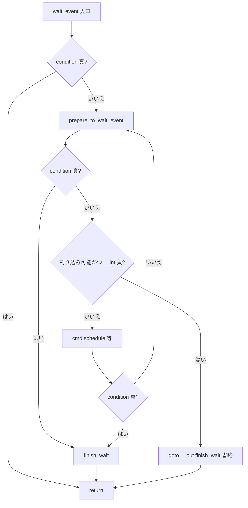

# 第8章 waitqueue

> **本章で読むソース**
>
> - [`include/linux/wait.h` L28-L38](https://github.com/gregkh/linux/blob/v6.18.38/include/linux/wait.h#L28-L38)
> - [`include/linux/wait.h` L95-L123](https://github.com/gregkh/linux/blob/v6.18.38/include/linux/wait.h#L95-L123)
> - [`include/linux/wait.h` L302-L327](https://github.com/gregkh/linux/blob/v6.18.38/include/linux/wait.h#L302-L327)
> - [`include/linux/wait.h` L393-L396](https://github.com/gregkh/linux/blob/v6.18.38/include/linux/wait.h#L393-L396)
> - [`kernel/sched/wait.c` L79-L91](https://github.com/gregkh/linux/blob/v6.18.38/kernel/sched/wait.c#L79-L91)
> - [`kernel/sched/wait.c` L92-L116](https://github.com/gregkh/linux/blob/v6.18.38/kernel/sched/wait.c#L92-L116)
> - [`kernel/sched/wait.c` L247-L258](https://github.com/gregkh/linux/blob/v6.18.38/kernel/sched/wait.c#L247-L258)
> - [`kernel/sched/wait.c` L280-L286](https://github.com/gregkh/linux/blob/v6.18.38/kernel/sched/wait.c#L280-L286)
> - [`kernel/sched/wait.c` L289-L321](https://github.com/gregkh/linux/blob/v6.18.38/kernel/sched/wait.c#L289-L321)
> - [`kernel/sched/wait.c` L375-L398](https://github.com/gregkh/linux/blob/v6.18.38/kernel/sched/wait.c#L375-L398)
> - [`kernel/sched/wait.c` L401-L409](https://github.com/gregkh/linux/blob/v6.18.38/kernel/sched/wait.c#L401-L409)
> - [`kernel/sched/core.c` L7274-L7279](https://github.com/gregkh/linux/blob/v6.18.38/kernel/sched/core.c#L7274-L7279)
> - [`kernel/sched/core.c` L1008-L1048](https://github.com/gregkh/linux/blob/v6.18.38/kernel/sched/core.c#L1008-L1048)
> - [`kernel/sched/core.c` L1073-L1093](https://github.com/gregkh/linux/blob/v6.18.38/kernel/sched/core.c#L1073-L1093)
> - [`kernel/sched/swait.c` L22-L32](https://github.com/gregkh/linux/blob/v6.18.38/kernel/sched/swait.c#L22-L32)
> - [`kernel/sched/wait_bit.c` L15-L35](https://github.com/gregkh/linux/blob/v6.18.38/kernel/sched/wait_bit.c#L15-L35)
> - [`kernel/sched/wait_bit.c` L43-L58](https://github.com/gregkh/linux/blob/v6.18.38/kernel/sched/wait_bit.c#L43-L58)

## この章の狙い

条件が満たされるまでタスクをスリープさせ、満たされたら起床させる **waitqueue** 機構を読む。
`___wait_event` を中心に `wait_event` 系マクロ、`prepare_to_wait` と `finish_wait`、`autoremove_wake_function`、`wake_up` から `__wake_up_common` までを追い、ロック保持中の遅延 wakeup である `wake_q`、簡略版の `swait`、ビット待ちの `wait_bit` までを一通り押さえる。

## 前提

- [rwsem](06-rwsem.md) を読んでいること。
- タスクを runnable に戻す `try_to_wake_up` の本体は [プロセスとスケジューラ第9章 try_to_wake_up](../../sched/part01-core/10-try-to-wake-up.md) の担当である。
  本章では waitqueue がそこへ渡す入口（`default_wake_function`）までを扱う。

## wait_queue_head と wait_queue_entry

待ち行列は `wait_queue_head`（スピンロックと双方向リスト）と、待つタスクごとの `wait_queue_entry` で構成される。
エントリは `private` に `task_struct` を、`func` に起床時に呼ばれるコールバックを持つ。

[`include/linux/wait.h` L28-L38](https://github.com/gregkh/linux/blob/v6.18.38/include/linux/wait.h#L28-L38)

```c
struct wait_queue_entry {
	unsigned int		flags;
	void			*private;
	wait_queue_func_t	func;
	struct list_head	entry;
};

struct wait_queue_head {
	spinlock_t		lock;
	struct list_head	head;
};
```

`WQ_FLAG_EXCLUSIVE` は「排他 waiter」であることを示すフラグであり、一度に1タスクだけ起床する意味ではない。
実際に何件まで排他 waiter を起こすかは `__wake_up` に渡す `nr_exclusive` が決める。
`nr_exclusive == 0` なら全 waiter が対象になり、正の値なら成功した排他 waiter だけが quota を消費する。

[`kernel/sched/wait.c` L79-L91](https://github.com/gregkh/linux/blob/v6.18.38/kernel/sched/wait.c#L79-L91)

```c
/*
 * The core wakeup function. Non-exclusive wakeups (nr_exclusive == 0) just
 * wake everything up. If it's an exclusive wakeup (nr_exclusive == small +ve
 * number) then we wake that number of exclusive tasks, and potentially all
 * the non-exclusive tasks. Normally, exclusive tasks will be at the end of
 * the list and any non-exclusive tasks will be woken first. A priority task
 * may be at the head of the list, and can consume the event without any other
 * tasks being woken if it's also an exclusive task.
 *
 * There are circumstances in which we can try to wake a task which has already
 * started to run but is not in state TASK_RUNNING. try_to_wake_up() returns
 * zero in this (rare) case, and we handle it by continuing to scan the queue.
 */
```

`WQ_FLAG_PRIORITY` は先頭優先の挿入に使われる。
ドライバの `wait_queue_head` 待ちや `poll` の待ち行列が典型例である。

## ___wait_event と wait_event マクロ族

`wait_event` の実体は `___wait_event` マクロである。
ここに `init_wait_entry`、`prepare_to_wait_event`、条件の再検査、割り込み可能時の `goto __out`、`cmd`（通常は `schedule()`）、ループ脱出後の `finish_wait` がまとまっている。

[`include/linux/wait.h` L302-L327](https://github.com/gregkh/linux/blob/v6.18.38/include/linux/wait.h#L302-L327)

```c
#define ___wait_event(wq_head, condition, state, exclusive, ret, cmd)		\
({										\
	__label__ __out;							\
	struct wait_queue_entry __wq_entry;					\
	long __ret = ret;	/* explicit shadow */				\
										\
	init_wait_entry(&__wq_entry, exclusive ? WQ_FLAG_EXCLUSIVE : 0);	\
	for (;;) {								\
		long __int = prepare_to_wait_event(&wq_head, &__wq_entry, state);\
										\
		if (condition)							\
			break;							\
										\
		if (___wait_is_interruptible(state) && __int) {			\
			__ret = __int;						\
			goto __out;						\
		}								\
										\
		cmd;								\
										\
		if (condition)							\
			break;							\
	}									\
	finish_wait(&wq_head, &__wq_entry);					\
__out:	__ret;									\
})
```

外側の `wait_event` は `might_sleep()` と事前の `condition` 判定だけを足す薄いラッパーである。

[`include/linux/wait.h` L333-L351](https://github.com/gregkh/linux/blob/v6.18.38/include/linux/wait.h#L333-L351)

```c
#define wait_event(wq_head, condition)						\
do {										\
	might_sleep();								\
	if (condition)								\
		break;								\
	__wait_event(wq_head, condition);					\
} while (0)
```

派生マクロは `___wait_event` の第2引数 `condition`、第3引数 `state`、第4引数 `exclusive`、第5引数 `ret`、第6引数 `cmd` を差し替える。
`wait_event_interruptible` は `state` を `TASK_INTERRUPTIBLE` にし、負の戻り値を返す。
`wait_event_timeout` は `condition` を `___wait_cond_timeout(condition)` で包み、`ret` に残り jiffies を渡し、`cmd` を `schedule_timeout(__ret)` に変える。

[`include/linux/wait.h` L393-L396](https://github.com/gregkh/linux/blob/v6.18.38/include/linux/wait.h#L393-L396)

```c
#define __wait_event_timeout(wq_head, condition, timeout)			\
	___wait_event(wq_head, ___wait_cond_timeout(condition),			\
		      TASK_UNINTERRUPTIBLE, 0, timeout,				\
		      __ret = schedule_timeout(__ret))
```

## autoremove_wake_function

`wait_event` は `init_wait_entry` で `func` に `autoremove_wake_function` を設定する。
起床に成功したエントリは `list_del_init_careful` でリストから外れ、`__wake_up_common` の `list_for_each_entry_safe_from` と組み合わさって安全に走査できる。

[`kernel/sched/wait.c` L280-L286](https://github.com/gregkh/linux/blob/v6.18.38/kernel/sched/wait.c#L280-L286)

```c
void init_wait_entry(struct wait_queue_entry *wq_entry, int flags)
{
	wq_entry->flags = flags;
	wq_entry->private = current;
	wq_entry->func = autoremove_wake_function;
	INIT_LIST_HEAD(&wq_entry->entry);
}
```

[`kernel/sched/wait.c` L401-L409](https://github.com/gregkh/linux/blob/v6.18.38/kernel/sched/wait.c#L401-L409)

```c
int autoremove_wake_function(struct wait_queue_entry *wq_entry, unsigned mode, int sync, void *key)
{
	int ret = default_wake_function(wq_entry, mode, sync, key);

	if (ret)
		list_del_init_careful(&wq_entry->entry);

	return ret;
}
```

`wait_bit` でも同じ autoremove 経路が使われる。
`wake_bit_function` はキーとビット状態を照合し、条件を満たしたときだけ `autoremove_wake_function` へ進む。

[`kernel/sched/wait_bit.c` L24-L35](https://github.com/gregkh/linux/blob/v6.18.38/kernel/sched/wait_bit.c#L24-L35)

```c
int wake_bit_function(struct wait_queue_entry *wq_entry, unsigned mode, int sync, void *arg)
{
	struct wait_bit_key *key = arg;
	struct wait_bit_queue_entry *wait_bit = container_of(wq_entry, struct wait_bit_queue_entry, wq_entry);

	if (wait_bit->key.flags != key->flags ||
			wait_bit->key.bit_nr != key->bit_nr ||
			test_bit(key->bit_nr, key->flags))
		return 0;

	return autoremove_wake_function(wq_entry, mode, sync, key);
}
```

## prepare_to_wait と lost wakeup 防止

手動待ちでは `prepare_to_wait` がエントリをリストへ入れたあと、同じ `wq_head->lock` 内で `set_current_state` する。
waker が `waitqueue_active` で待ち行列を見た時点で waiter が sleep 可能状態になっていることを保証し、条件ストアだけ先行して wakeup が空振りする lost wakeup を防ぐ。

[`kernel/sched/wait.c` L247-L258](https://github.com/gregkh/linux/blob/v6.18.38/kernel/sched/wait.c#L247-L258)

```c
void
prepare_to_wait(struct wait_queue_head *wq_head, struct wait_queue_entry *wq_entry, int state)
{
	unsigned long flags;

	wq_entry->flags &= ~WQ_FLAG_EXCLUSIVE;
	spin_lock_irqsave(&wq_head->lock, flags);
	if (list_empty(&wq_entry->entry))
		__add_wait_queue(wq_head, wq_entry);
	set_current_state(state);
	spin_unlock_irqrestore(&wq_head->lock, flags);
}
```

waker 側の対になる契約は `waitqueue_active` のコメントにある。
`@cond = true` のストアと `waitqueue_active` の間に `smp_mb()` を挟むか、ロックで保護する必要がある。

[`include/linux/wait.h` L95-L123](https://github.com/gregkh/linux/blob/v6.18.38/include/linux/wait.h#L95-L123)

```c
 * Use either while holding wait_queue_head::lock or when used for wakeups
 * with an extra smp_mb() like::
 *
 *      CPU0 - waker                    CPU1 - waiter
 *
 *                                      for (;;) {
 *      @cond = true;                     prepare_to_wait(&wq_head, &wait, state);
 *      smp_mb();                         // smp_mb() from set_current_state()
 *      if (waitqueue_active(wq_head))         if (@cond)
 *        wake_up(wq_head);                      break;
 *                                        schedule();
 *                                      }
 *                                      finish_wait(&wq_head, &wait);
 *
 * Because without the explicit smp_mb() it's possible for the
 * waitqueue_active() load to get hoisted over the @cond store such that we'll
 * observe an empty wait list while the waiter might not observe @cond.
```

`finish_wait` は `TASK_RUNNING` に戻し、まだリストに残っていれば削除する。

[`kernel/sched/wait.c` L375-L398](https://github.com/gregkh/linux/blob/v6.18.38/kernel/sched/wait.c#L375-L398)

```c
void finish_wait(struct wait_queue_head *wq_head, struct wait_queue_entry *wq_entry)
{
	unsigned long flags;

	__set_current_state(TASK_RUNNING);
	/*
	 * We can check for list emptiness outside the lock
	 * IFF:
	 *  - we use the "careful" check that verifies both
	 *    the next and prev pointers, so that there cannot
	 *    be any half-pending updates in progress on other
	 *    CPU's that we haven't seen yet (and that might
	 *    still change the stack area.
	 * and
	 *  - all other users take the lock (ie we can only
	 *    have _one_ other CPU that looks at or modifies
	 *    the list).
	 */
	if (!list_empty_careful(&wq_entry->entry)) {
		spin_lock_irqsave(&wq_head->lock, flags);
		list_del_init(&wq_entry->entry);
		spin_unlock_irqrestore(&wq_head->lock, flags);
	}
}
```

### シグナルによるキャンセル経路

`prepare_to_wait_event` は `signal_pending_state` を見て、シグナル待ちならエントリを削除して `-ERESTARTSYS` を返す。
`___wait_event` はこの負値を受け取ると `finish_wait` を飛ばして `__out` へ進む。

[`kernel/sched/wait.c` L289-L321](https://github.com/gregkh/linux/blob/v6.18.38/kernel/sched/wait.c#L289-L321)

```c
long prepare_to_wait_event(struct wait_queue_head *wq_head, struct wait_queue_entry *wq_entry, int state)
{
	unsigned long flags;
	long ret = 0;

	spin_lock_irqsave(&wq_head->lock, flags);
	if (signal_pending_state(state, current)) {
		/*
		 * Exclusive waiter must not fail if it was selected by wakeup,
		 * it should "consume" the condition we were waiting for.
		 *
		 * The caller will recheck the condition and return success if
		 * we were already woken up, we can not miss the event because
		 * wakeup locks/unlocks the same wq_head->lock.
		 *
		 * But we need to ensure that set-condition + wakeup after that
		 * can't see us, it should wake up another exclusive waiter if
		 * we fail.
		 */
		list_del_init(&wq_entry->entry);
		ret = -ERESTARTSYS;
	} else {
		if (list_empty(&wq_entry->entry)) {
			if (wq_entry->flags & WQ_FLAG_EXCLUSIVE)
				__add_wait_queue_entry_tail(wq_head, wq_entry);
			else
				__add_wait_queue(wq_head, wq_entry);
		}
		set_current_state(state);
	}
	spin_unlock_irqrestore(&wq_head->lock, flags);

	return ret;
}
```

## __wake_up_common とスケジューラ境界

[`kernel/sched/wait.c` L92-L116](https://github.com/gregkh/linux/blob/v6.18.38/kernel/sched/wait.c#L92-L116)

```c
static int __wake_up_common(struct wait_queue_head *wq_head, unsigned int mode,
			int nr_exclusive, int wake_flags, void *key)
{
	wait_queue_entry_t *curr, *next;

	lockdep_assert_held(&wq_head->lock);

	curr = list_first_entry(&wq_head->head, wait_queue_entry_t, entry);

	if (&curr->entry == &wq_head->head)
		return nr_exclusive;

	list_for_each_entry_safe_from(curr, next, &wq_head->head, entry) {
		unsigned flags = curr->flags;
		int ret;

		ret = curr->func(curr, mode, wake_flags, key);
		if (ret < 0)
			break;
		if (ret && (flags & WQ_FLAG_EXCLUSIVE) && !--nr_exclusive)
			break;
	}

	return nr_exclusive;
}
```

デフォルトの `func` は `default_wake_function` で、中身は `try_to_wake_up` への1行委譲である。

[`kernel/sched/core.c` L7274-L7279](https://github.com/gregkh/linux/blob/v6.18.38/kernel/sched/core.c#L7274-L7279)

```c
int default_wake_function(wait_queue_entry_t *curr, unsigned mode, int wake_flags,
			  void *key)
{
	WARN_ON_ONCE(wake_flags & ~(WF_SYNC|WF_CURRENT_CPU));
	return try_to_wake_up(curr->private, mode, wake_flags);
}
```

## wake_q: ロック解放後の一括 wakeup

mutex や rwsem は、ロック下で `wake_q_add` だけ行い、ロック解放後に `wake_up_q` でまとめて `wake_up_process` する。

[`kernel/sched/core.c` L1008-L1048](https://github.com/gregkh/linux/blob/v6.18.38/kernel/sched/core.c#L1008-L1048)

```c
static bool __wake_q_add(struct wake_q_head *head, struct task_struct *task)
{
	struct wake_q_node *node = &task->wake_q;

	/*
	 * Atomically grab the task, if ->wake_q is !nil already it means
	 * it's already queued (either by us or someone else) and will get the
	 * wakeup due to that.
	 *
	 * In order to ensure that a pending wakeup will observe our pending
	 * state, even in the failed case, an explicit smp_mb() must be used.
	 */
	smp_mb__before_atomic();
	if (unlikely(cmpxchg_relaxed(&node->next, NULL, WAKE_Q_TAIL)))
		return false;

	/*
	 * The head is context local, there can be no concurrency.
	 */
	*head->lastp = node;
	head->lastp = &node->next;
	return true;
}

// ... (中略) ...

void wake_q_add(struct wake_q_head *head, struct task_struct *task)
{
	if (__wake_q_add(head, task))
		get_task_struct(task);
}
```

`cmpxchg_relaxed` が既登録の `task->wake_q.next` を検出すると `false` を返し、二重登録を防ぐ。
成功時だけ `get_task_struct` で参照を保持する。

[`kernel/sched/core.c` L1073-L1093](https://github.com/gregkh/linux/blob/v6.18.38/kernel/sched/core.c#L1073-L1093)

```c
void wake_up_q(struct wake_q_head *head)
{
	struct wake_q_node *node = head->first;

	while (node != WAKE_Q_TAIL) {
		struct task_struct *task;

		task = container_of(node, struct task_struct, wake_q);
		node = node->next;
		/* pairs with cmpxchg_relaxed() in __wake_q_add() */
		WRITE_ONCE(task->wake_q.next, NULL);
		/* Task can safely be re-inserted now. */

		/*
		 * wake_up_process() executes a full barrier, which pairs with
		 * the queueing in wake_q_add() so as not to miss wakeups.
		 */
		wake_up_process(task);
		put_task_struct(task);
	}
}
```

`wake_up_q` は `next = NULL` で登録を解除し、`put_task_struct` で `get_task_struct` と対を閉じる。

## swait と wait_bit

`swait_queue_head` は `task_struct` ポインタだけを並べる簡略版で、completion 内部などに使われる。

[`kernel/sched/swait.c` L22-L32](https://github.com/gregkh/linux/blob/v6.18.38/kernel/sched/swait.c#L22-L32)

```c
void swake_up_locked(struct swait_queue_head *q, int wake_flags)
{
	struct swait_queue *curr;

	if (list_empty(&q->task_list))
		return;

	curr = list_first_entry(&q->task_list, typeof(*curr), task_list);
	try_to_wake_up(curr->task, TASK_NORMAL, wake_flags);
	list_del_init(&curr->task_list);
}
```

`wait_on_bit` は共有 `bit_wait_table` にハッシュ集約する。

[`kernel/sched/wait_bit.c` L43-L58](https://github.com/gregkh/linux/blob/v6.18.38/kernel/sched/wait_bit.c#L43-L58)

```c
int __sched
__wait_on_bit(struct wait_queue_head *wq_head, struct wait_bit_queue_entry *wbq_entry,
	      wait_bit_action_f *action, unsigned mode)
{
	int ret = 0;

	do {
		prepare_to_wait(wq_head, &wbq_entry->wq_entry, mode);
		if (test_bit(wbq_entry->key.bit_nr, wbq_entry->key.flags))
			ret = (*action)(&wbq_entry->key, mode);
	} while (test_bit_acquire(wbq_entry->key.bit_nr, wbq_entry->key.flags) && !ret);

	finish_wait(wq_head, &wbq_entry->wq_entry);

	return ret;
}
```

## 処理の流れ（wait_event の三経路）



通常経路は `schedule` 後に condition が真ならループを抜けて `finish_wait` する。
偽なら `prepare_to_wait_event` から再ループする。
シグナル経路だけ `finish_wait` を省略して `__out` へ進む。

## 高速化と最適化の工夫

`waitqueue_active` はロックなし参照のため `smp_mb()` か `spin_lock` が必要である（上記コメント参照）。
`wake_q` はロック保持中に `try_to_wake_up` まで進まず、解放後にまとめて実行することで runqueue ロック競合を短くする。
`wait_bit` の共有テーブルは待ち行列数を一定に保つ。

## まとめ

- `___wait_event` が条件待ちの本体で、`wait_event` 系は `condition`/`state`/`exclusive`/`ret`/`cmd` の差し替えである。
- `prepare_to_wait` はリスト追加後に同じロック内で `set_current_state` し lost wakeup を防ぐ。
- `autoremove_wake_function` が起床成功時にエントリを外し、走査と整合する。
- `wake_q` は `cmpxchg` で重複登録を防ぎ、解放後に一括 wakeup する。
- `swait` と `wait_bit` は用途を絞った特殊化である。

## 関連する章

- [rwsem](06-rwsem.md)
- [semaphore と completion](09-semaphore-completion.md)
- [try_to_wake_up（スケジューラ分冊）](../../sched/part01-core/10-try-to-wake-up.md)
- [lockdep](../part03-correctness/10-lockdep.md)
