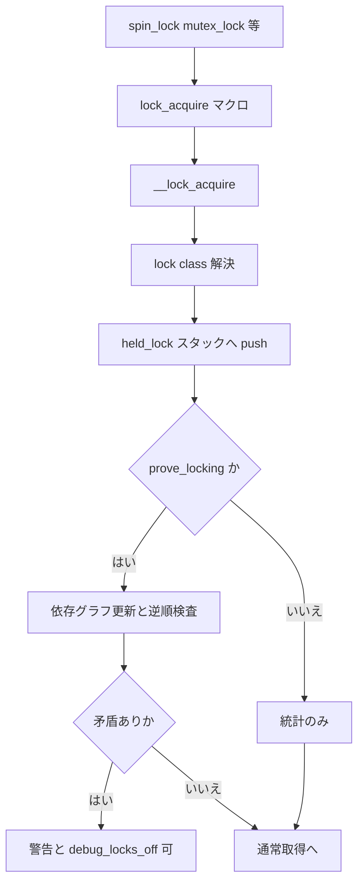

# 第10章 lockdep

> **本章で読むソース**
>
> - [`kernel/locking/lockdep.c` L1-L28](https://github.com/gregkh/linux/blob/v6.18.38/kernel/locking/lockdep.c#L1-L28)
> - [`kernel/locking/lockdep.c` L447-L454](https://github.com/gregkh/linux/blob/v6.18.38/kernel/locking/lockdep.c#L447-L454)
> - [`kernel/locking/lockdep.c` L886-L947](https://github.com/gregkh/linux/blob/v6.18.38/kernel/locking/lockdep.c#L886-L947)
> - [`kernel/locking/lockdep.c` L1284-L1359](https://github.com/gregkh/linux/blob/v6.18.38/kernel/locking/lockdep.c#L1284-L1359)
> - [`kernel/locking/lockdep.c` L3730-L3789](https://github.com/gregkh/linux/blob/v6.18.38/kernel/locking/lockdep.c#L3730-L3789)
> - [`kernel/locking/lockdep.c` L3861-L3920](https://github.com/gregkh/linux/blob/v6.18.38/kernel/locking/lockdep.c#L3861-L3920)
> - [`kernel/locking/lockdep.c` L3986-L4004](https://github.com/gregkh/linux/blob/v6.18.38/kernel/locking/lockdep.c#L3986-L4004)
> - [`kernel/locking/lockdep.c` L4852-L4904](https://github.com/gregkh/linux/blob/v6.18.38/kernel/locking/lockdep.c#L4852-L4904)
> - [`kernel/locking/lockdep.c` L5077-L5115](https://github.com/gregkh/linux/blob/v6.18.38/kernel/locking/lockdep.c#L5077-L5115)

## この章の狙い

実行時にロック依存を記録し、逆順取得や IRQ 文脈違反を検出する **lockdep** の枠組みを読む。
デバッグビルドで有効な検証器が、`CONFIG_PROVE_LOCKING` 等が有効な構成で依存グラフをどう構築するかを押さえる。

## 前提

- [spinlock と qspinlock](../part01-spinning/03-spinlock-qspinlock.md) と [mutex と optimistic spinning](../part02-sleeping/05-mutex-osq.md) を読んでいること。

## lockdep が検出するバグクラス

ファイル先頭のコメントが目的を列挙する。
実際にデッドロックが起きていなくても、過去に異なる順序で取得されたクラス同士の組み合わせを警告する。

[`kernel/locking/lockdep.c` L1-L28](https://github.com/gregkh/linux/blob/v6.18.38/kernel/locking/lockdep.c#L1-L28)

```c
// SPDX-License-Identifier: GPL-2.0-only
/*
 * kernel/lockdep.c
 *
 * Runtime locking correctness validator
 *
 * Started by Ingo Molnar:
 *
 *  Copyright (C) 2006,2007 Red Hat, Inc., Ingo Molnar <mingo@redhat.com>
 *  Copyright (C) 2007 Red Hat, Inc., Peter Zijlstra
 *
 * this code maps all the lock dependencies as they occur in a live kernel
 * and will warn about the following classes of locking bugs:
 *
 * - lock inversion scenarios
 * - circular lock dependencies
 * - hardirq/softirq safe/unsafe locking bugs
 *
 * Bugs are reported even if the current locking scenario does not cause
 * any deadlock at this point.
 *
 * I.e. if anytime in the past two locks were taken in a different order,
 * even if it happened for another task, even if those were different
 * locks (but of the same class as this lock), this code will detect it.
 *
 * Thanks to Arjan van de Ven for coming up with the initial idea of
 * mapping lock dependencies runtime.
 */
```

ロックインスタンスではなく **lock class** を追跡する点が重要である。
同じ API で確保される複数の `mutex` も、同じクラスなら順序違反として検出される。

## lock class の登録

`look_up_lock_class` は `lock->key` と subclass からハッシュを引き、既存 class を返す。
未登録なら `register_lock_class` が `lock_classes` へ追加し、`class_cache` に保存する。

[`kernel/locking/lockdep.c` L886-L947](https://github.com/gregkh/linux/blob/v6.18.38/kernel/locking/lockdep.c#L886-L947)

```c
static noinstr struct lock_class *
look_up_lock_class(const struct lockdep_map *lock, unsigned int subclass)
{
	struct lockdep_subclass_key *key;
	struct hlist_head *hash_head;
	struct lock_class *class;

	if (unlikely(subclass >= MAX_LOCKDEP_SUBCLASSES)) {
		instrumentation_begin();
		debug_locks_off();
		nbcon_cpu_emergency_enter();
		printk(KERN_ERR
			"BUG: looking up invalid subclass: %u\n", subclass);
		printk(KERN_ERR
			"turning off the locking correctness validator.\n");
		dump_stack();
		nbcon_cpu_emergency_exit();
		instrumentation_end();
		return NULL;
	}

	/*
	 * If it is not initialised then it has never been locked,
	 * so it won't be present in the hash table.
	 */
	if (unlikely(!lock->key))
		return NULL;

	/*
	 * NOTE: the class-key must be unique. For dynamic locks, a static
	 * lock_class_key variable is passed in through the mutex_init()
	 * (or spin_lock_init()) call - which acts as the key. For static
	 * locks we use the lock object itself as the key.
	 */
	BUILD_BUG_ON(sizeof(struct lock_class_key) >
			sizeof(struct lockdep_map));

	key = lock->key->subkeys + subclass;

	hash_head = classhashentry(key);

	/*
	 * We do an RCU walk of the hash, see lockdep_free_key_range().
	 */
	if (DEBUG_LOCKS_WARN_ON(!irqs_disabled()))
		return NULL;

	hlist_for_each_entry_rcu_notrace(class, hash_head, hash_entry) {
		if (class->key == key) {
			/*
			 * Huh! same key, different name? Did someone trample
			 * on some memory? We're most confused.
			 */
			WARN_ONCE(class->name != lock->name &&
				  lock->key != &__lockdep_no_validate__,
				  "Looking for class \"%s\" with key %ps, but found a different class \"%s\" with the same key\n",
				  lock->name, lock->key, class->name);
			return class;
		}
	}

	return NULL;
}
```

[`kernel/locking/lockdep.c` L1284-L1359](https://github.com/gregkh/linux/blob/v6.18.38/kernel/locking/lockdep.c#L1284-L1359)

```c
static struct lock_class *
register_lock_class(struct lockdep_map *lock, unsigned int subclass, int force)
{
	struct lockdep_subclass_key *key;
	struct hlist_head *hash_head;
	struct lock_class *class;
	int idx;

	DEBUG_LOCKS_WARN_ON(!irqs_disabled());

	class = look_up_lock_class(lock, subclass);
	if (likely(class))
		goto out_set_class_cache;

	if (!lock->key) {
		if (!assign_lock_key(lock))
			return NULL;
	} else if (!static_obj(lock->key) && !is_dynamic_key(lock->key)) {
		return NULL;
	}

	key = lock->key->subkeys + subclass;
	hash_head = classhashentry(key);

	if (!graph_lock()) {
		return NULL;
	}
	/*
	 * We have to do the hash-walk again, to avoid races
	 * with another CPU:
	 */
	hlist_for_each_entry_rcu(class, hash_head, hash_entry) {
		if (class->key == key)
			goto out_unlock_set;
	}

	init_data_structures_once();

	/* Allocate a new lock class and add it to the hash. */
	class = list_first_entry_or_null(&free_lock_classes, typeof(*class),
					 lock_entry);
	if (!class) {
		if (!debug_locks_off_graph_unlock()) {
			return NULL;
		}

		nbcon_cpu_emergency_enter();
		print_lockdep_off("BUG: MAX_LOCKDEP_KEYS too low!");
		dump_stack();
		nbcon_cpu_emergency_exit();
		return NULL;
	}
	nr_lock_classes++;
	__set_bit(class - lock_classes, lock_classes_in_use);
	debug_atomic_inc(nr_unused_locks);
	class->key = key;
	class->name = lock->name;
	class->subclass = subclass;
	WARN_ON_ONCE(!list_empty(&class->locks_before));
	WARN_ON_ONCE(!list_empty(&class->locks_after));
	class->name_version = count_matching_names(class);
	class->wait_type_inner = lock->wait_type_inner;
	class->wait_type_outer = lock->wait_type_outer;
	class->lock_type = lock->lock_type;
	/*
	 * We use RCU's safe list-add method to make
	 * parallel walking of the hash-list safe:
	 */
	hlist_add_head_rcu(&class->hash_entry, hash_head);
	/*
	 * Remove the class from the free list and add it to the global list
	 * of classes.
	 */
	list_move_tail(&class->lock_entry, &all_lock_classes);
	idx = class - lock_classes;
	if (idx > max_lock_class_idx)
```

## chain key と依存グラフ検証

取得順序は `iterate_chain_key` で chain key に畳み込み、未登録の組み合わせだけ `add_chain_cache` と `validate_chain` で逆順検査する。

[`kernel/locking/lockdep.c` L447-L454](https://github.com/gregkh/linux/blob/v6.18.38/kernel/locking/lockdep.c#L447-L454)

```c
static inline u64 iterate_chain_key(u64 key, u32 idx)
{
	u32 k0 = key, k1 = key >> 32;

	__jhash_mix(idx, k0, k1); /* Macro that modifies arguments! */

	return k0 | (u64)k1 << 32;
}
```

[`kernel/locking/lockdep.c` L3730-L3789](https://github.com/gregkh/linux/blob/v6.18.38/kernel/locking/lockdep.c#L3730-L3789)

```c
static inline int add_chain_cache(struct task_struct *curr,
				  struct held_lock *hlock,
				  u64 chain_key)
{
	struct hlist_head *hash_head = chainhashentry(chain_key);
	struct lock_chain *chain;
	int i, j;

	/*
	 * The caller must hold the graph lock, ensure we've got IRQs
	 * disabled to make this an IRQ-safe lock.. for recursion reasons
	 * lockdep won't complain about its own locking errors.
	 */
	if (lockdep_assert_locked())
		return 0;

	chain = alloc_lock_chain();
	if (!chain) {
		if (!debug_locks_off_graph_unlock())
			return 0;

		nbcon_cpu_emergency_enter();
		print_lockdep_off("BUG: MAX_LOCKDEP_CHAINS too low!");
		dump_stack();
		nbcon_cpu_emergency_exit();
		return 0;
	}
	chain->chain_key = chain_key;
	chain->irq_context = hlock->irq_context;
	i = get_first_held_lock(curr, hlock);
	chain->depth = curr->lockdep_depth + 1 - i;

	BUILD_BUG_ON((1UL << 24) <= ARRAY_SIZE(chain_hlocks));
	BUILD_BUG_ON((1UL << 6)  <= ARRAY_SIZE(curr->held_locks));
	BUILD_BUG_ON((1UL << 8*sizeof(chain_hlocks[0])) <= ARRAY_SIZE(lock_classes));

	j = alloc_chain_hlocks(chain->depth);
	if (j < 0) {
		if (!debug_locks_off_graph_unlock())
			return 0;

		nbcon_cpu_emergency_enter();
		print_lockdep_off("BUG: MAX_LOCKDEP_CHAIN_HLOCKS too low!");
		dump_stack();
		nbcon_cpu_emergency_exit();
		return 0;
	}

	chain->base = j;
	for (j = 0; j < chain->depth - 1; j++, i++) {
		int lock_id = hlock_id(curr->held_locks + i);

		chain_hlocks[chain->base + j] = lock_id;
	}
	chain_hlocks[chain->base + j] = hlock_id(hlock);
	hlist_add_head_rcu(&chain->entry, hash_head);
	debug_atomic_inc(chain_lookup_misses);
	inc_chains(chain->irq_context);

	return 1;
}
```

[`kernel/locking/lockdep.c` L3861-L3920](https://github.com/gregkh/linux/blob/v6.18.38/kernel/locking/lockdep.c#L3861-L3920)

```c
static int validate_chain(struct task_struct *curr,
			  struct held_lock *hlock,
			  int chain_head, u64 chain_key)
{
	/*
	 * Trylock needs to maintain the stack of held locks, but it
	 * does not add new dependencies, because trylock can be done
	 * in any order.
	 *
	 * We look up the chain_key and do the O(N^2) check and update of
	 * the dependencies only if this is a new dependency chain.
	 * (If lookup_chain_cache_add() return with 1 it acquires
	 * graph_lock for us)
	 */
	if (!hlock->trylock && hlock->check &&
	    lookup_chain_cache_add(curr, hlock, chain_key)) {
		/*
		 * Check whether last held lock:
		 *
		 * - is irq-safe, if this lock is irq-unsafe
		 * - is softirq-safe, if this lock is hardirq-unsafe
		 *
		 * And check whether the new lock's dependency graph
		 * could lead back to the previous lock:
		 *
		 * - within the current held-lock stack
		 * - across our accumulated lock dependency records
		 *
		 * any of these scenarios could lead to a deadlock.
		 */
		/*
		 * The simple case: does the current hold the same lock
		 * already?
		 */
		int ret = check_deadlock(curr, hlock);

		if (!ret)
			return 0;
		/*
		 * Add dependency only if this lock is not the head
		 * of the chain, and if the new lock introduces no more
		 * lock dependency (because we already hold a lock with the
		 * same lock class) nor deadlock (because the nest_lock
		 * serializes nesting locks), see the comments for
		 * check_deadlock().
		 */
		if (!chain_head && ret != 2) {
			if (!check_prevs_add(curr, hlock))
				return 0;
		}

		graph_unlock();
	} else {
		/* after lookup_chain_cache_add(): */
		if (unlikely(!debug_locks))
			return 0;
	}

	return 1;
}
```

## IRQ 文脈の usage 矛盾

`mark_lock` は held_lock に usage ビットを積み上げ、IRQ 中に sleepable ロックを取るなどの矛盾を報告する。

[`kernel/locking/lockdep.c` L3986-L4004](https://github.com/gregkh/linux/blob/v6.18.38/kernel/locking/lockdep.c#L3986-L4004)

```c
static int mark_lock(struct task_struct *curr, struct held_lock *this,
		     enum lock_usage_bit new_bit);

static void print_usage_bug_scenario(struct held_lock *lock)
{
	struct lock_class *class = hlock_class(lock);

	printk(" Possible unsafe locking scenario:\n\n");
	printk("       CPU0\n");
	printk("       ----\n");
	printk("  lock(");
	__print_lock_name(lock, class);
	printk(KERN_CONT ");\n");
	printk("  <Interrupt>\n");
	printk("    lock(");
	__print_lock_name(lock, class);
	printk(KERN_CONT ");\n");
	printk("\n *** DEADLOCK ***\n\n");
}
```

矛盾検出時の警告出力は `print_usage_bug` が担う。

[`kernel/locking/lockdep.c` L4006-L4022](https://github.com/gregkh/linux/blob/v6.18.38/kernel/locking/lockdep.c#L4006-L4022)

```c
static void
print_usage_bug(struct task_struct *curr, struct held_lock *this,
		enum lock_usage_bit prev_bit, enum lock_usage_bit new_bit)
{
	if (!debug_locks_off() || debug_locks_silent)
		return;

	nbcon_cpu_emergency_enter();

	pr_warn("\n");
	pr_warn("================================\n");
	pr_warn("WARNING: inconsistent lock state\n");
	print_kernel_ident();
	pr_warn("--------------------------------\n");

	pr_warn("inconsistent {%s} -> {%s} usage.\n",
		usage_str[prev_bit], usage_str[new_bit]);
```

## wait context の検証

`check_wait_context` は、内側と外側の wait type が矛盾しないかを見る。
RCU のように outer が inner より小さい例外もコメントで明示される。

[`kernel/locking/lockdep.c` L4852-L4904](https://github.com/gregkh/linux/blob/v6.18.38/kernel/locking/lockdep.c#L4852-L4904)

```c
static int check_wait_context(struct task_struct *curr, struct held_lock *next)
{
	u8 next_inner = hlock_class(next)->wait_type_inner;
	u8 next_outer = hlock_class(next)->wait_type_outer;
	u8 curr_inner;
	int depth;

	if (!next_inner || next->trylock)
		return 0;

	if (!next_outer)
		next_outer = next_inner;

	/*
	 * Find start of current irq_context..
	 */
	for (depth = curr->lockdep_depth - 1; depth >= 0; depth--) {
		struct held_lock *prev = curr->held_locks + depth;
		if (prev->irq_context != next->irq_context)
			break;
	}
	depth++;

	curr_inner = task_wait_context(curr);

	for (; depth < curr->lockdep_depth; depth++) {
		struct held_lock *prev = curr->held_locks + depth;
		struct lock_class *class = hlock_class(prev);
		u8 prev_inner = class->wait_type_inner;

		if (prev_inner) {
			/*
			 * We can have a bigger inner than a previous one
			 * when outer is smaller than inner, as with RCU.
			 *
			 * Also due to trylocks.
			 */
			curr_inner = min(curr_inner, prev_inner);

			/*
			 * Allow override for annotations -- this is typically
			 * only valid/needed for code that only exists when
			 * CONFIG_PREEMPT_RT=n.
			 */
			if (unlikely(class->lock_type == LD_LOCK_WAIT_OVERRIDE))
				curr_inner = prev_inner;
		}
	}

	if (next_outer > curr_inner)
		return print_lock_invalid_wait_context(curr, next);

	return 0;
}
```

## __lock_acquire の入口

各ロック API は `spin_acquire` や `mutex_acquire` 経由で `__lock_acquire` に到達する。
ここで lock class の登録、chain key 計算、逆順検出が行われる。

[`kernel/locking/lockdep.c` L5077-L5115](https://github.com/gregkh/linux/blob/v6.18.38/kernel/locking/lockdep.c#L5077-L5115)

```c
static int __lock_acquire(struct lockdep_map *lock, unsigned int subclass,
			  int trylock, int read, int check, int hardirqs_off,
			  struct lockdep_map *nest_lock, unsigned long ip,
			  int references, int pin_count, int sync)
{
	struct task_struct *curr = current;
	struct lock_class *class = NULL;
	struct held_lock *hlock;
	unsigned int depth;
	int chain_head = 0;
	int class_idx;
	u64 chain_key;

	if (unlikely(!debug_locks))
		return 0;

	if (unlikely(lock->key == &__lockdep_no_track__))
		return 0;

	lockevent_inc(lockdep_acquire);

	if (!prove_locking || lock->key == &__lockdep_no_validate__) {
		check = 0;
		lockevent_inc(lockdep_nocheck);
	}

	if (DEBUG_LOCKS_WARN_ON(subclass >= MAX_LOCKDEP_SUBCLASSES))
		return 0;

	if (subclass < NR_LOCKDEP_CACHING_CLASSES)
		class = lock->class_cache[subclass];
	/*
	 * Not cached?
	 */
	if (unlikely(!class)) {
		class = register_lock_class(lock, subclass, 0);
		if (!class)
			return 0;
	}
```

**最適化の工夫**：class キャッシュにより、同一サブクラスの再取得では `register_lock_class` を避ける。
`CONFIG_PROVE_LOCKING` が無効な構成では `prove_locking` が false になり、逆順検査は no-op となる。

## 処理の流れ：ロック取得時の lockdep



`/proc/lockdep` や `CONFIG_LOCK_STAT` により、待ち時間の統計も取れる。

## まとめ

- lockdep はクラス単位の取得順序履歴から、潜在デッドロックと IRQ 違反を報告する。
- `look_up_lock_class` と `register_lock_class` が class 登録、`validate_chain` が逆順検査を担う。
- `CONFIG_PROVE_LOCKING` 等が有効な debug 構成でのみ依存グラフ更新が走る。

## 関連する章

- [rt_mutex と priority inheritance](11-rt-mutex-pi.md)
- [RCU の基本概念と API](../part04-rcu/12-rcu-basics.md)
- [mutex と optimistic spinning](../part02-sleeping/05-mutex-osq.md)
