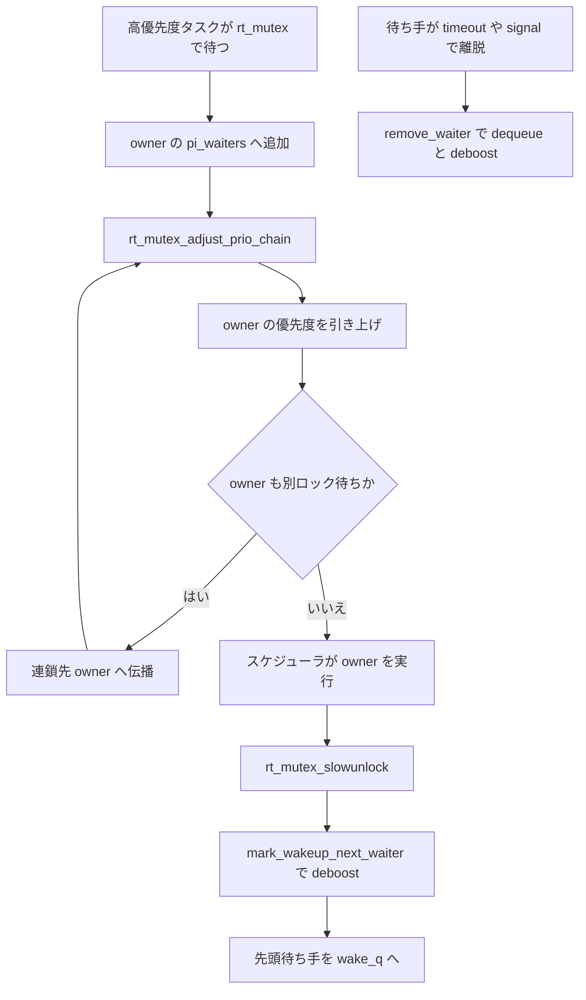

# 第11章 rt_mutex と priority inheritance

> **本章で読むソース**
>
> - [`kernel/locking/rtmutex.c` L527-L540](https://github.com/gregkh/linux/blob/v6.18.38/kernel/locking/rtmutex.c#L527-L540)
> - [`kernel/locking/rtmutex.c` L678-L732](https://github.com/gregkh/linux/blob/v6.18.38/kernel/locking/rtmutex.c#L678-L732)
> - [`kernel/locking/rtmutex.c` L1086-L1138](https://github.com/gregkh/linux/blob/v6.18.38/kernel/locking/rtmutex.c#L1086-L1138)
> - [`kernel/locking/rtmutex.c` L1203-L1303](https://github.com/gregkh/linux/blob/v6.18.38/kernel/locking/rtmutex.c#L1203-L1303)
> - [`kernel/locking/rtmutex.c` L1312-L1356](https://github.com/gregkh/linux/blob/v6.18.38/kernel/locking/rtmutex.c#L1312-L1356)
> - [`kernel/locking/rtmutex.c` L1411-L1469](https://github.com/gregkh/linux/blob/v6.18.38/kernel/locking/rtmutex.c#L1411-L1469)
> - [`kernel/locking/rtmutex.c` L1541-L1593](https://github.com/gregkh/linux/blob/v6.18.38/kernel/locking/rtmutex.c#L1541-L1593)
> - [`kernel/locking/rtmutex.c` L1813-L1822](https://github.com/gregkh/linux/blob/v6.18.38/kernel/locking/rtmutex.c#L1813-L1822)
> - [`kernel/locking/rtmutex.c` L1835-L1853](https://github.com/gregkh/linux/blob/v6.18.38/kernel/locking/rtmutex.c#L1835-L1853)

## この章の狙い

リアルタイム向けの **rt_mutex** と **priority inheritance**（優先度継承）の連鎖処理を読む。
`CONFIG_PREEMPT_RT` では通常のスピンロックの代替にもなり、優先度逆転を抑える仕組みを追う。

## 前提

- [mutex と optimistic spinning](../part02-sleeping/05-mutex-osq.md) と [lockdep](10-lockdep.md) を読んでいること。

## 優先度調整の単一ステップ

`rt_mutex_adjust_prio` は owner の `pi_waiters` 赤黒木から最高優先度の待ち手を選び、`rt_mutex_setprio` で実行優先度を引き上げる。

[`kernel/locking/rtmutex.c` L527-L540](https://github.com/gregkh/linux/blob/v6.18.38/kernel/locking/rtmutex.c#L527-L540)

```c
static __always_inline void rt_mutex_adjust_prio(struct rt_mutex_base *lock,
						 struct task_struct *p)
{
	struct task_struct *pi_task = NULL;

	lockdep_assert_held(&lock->wait_lock);
	lockdep_assert(rt_mutex_owner(lock) == p);
	lockdep_assert_held(&p->pi_lock);

	if (task_has_pi_waiters(p))
		pi_task = task_top_pi_waiter(p)->task;

	rt_mutex_setprio(p, pi_task);
}
```

owner が複数の rt_mutex を持つとき、待ち手の優先度が owner へ伝播し、さらにその owner が別ロックを持てば連鎖する。

## task_blocks_on_rt_mutex

待ち手は `rt_mutex_enqueue` でロックの wait 木へ入り、先頭なら owner の `pi_waiters` へも連結する。
owner が別ロック待ちなら `rt_mutex_adjust_prio_chain` へ連鎖する。

[`kernel/locking/rtmutex.c` L1203-L1303](https://github.com/gregkh/linux/blob/v6.18.38/kernel/locking/rtmutex.c#L1203-L1303)

```c
static int __sched task_blocks_on_rt_mutex(struct rt_mutex_base *lock,
					   struct rt_mutex_waiter *waiter,
					   struct task_struct *task,
					   struct ww_acquire_ctx *ww_ctx,
					   enum rtmutex_chainwalk chwalk,
					   struct wake_q_head *wake_q)
{
	struct task_struct *owner = rt_mutex_owner(lock);
	struct rt_mutex_waiter *top_waiter = waiter;
	struct rt_mutex_base *next_lock;
	int chain_walk = 0, res;

	lockdep_assert_held(&lock->wait_lock);

	/*
	 * Early deadlock detection. We really don't want the task to
	 * enqueue on itself just to untangle the mess later. It's not
	 * only an optimization. We drop the locks, so another waiter
	 * can come in before the chain walk detects the deadlock. So
	 * the other will detect the deadlock and return -EDEADLOCK,
	 * which is wrong, as the other waiter is not in a deadlock
	 * situation.
	 *
	 * Except for ww_mutex, in that case the chain walk must already deal
	 * with spurious cycles, see the comments at [3] and [6].
	 */
	if (owner == task && !(build_ww_mutex() && ww_ctx))
		return -EDEADLK;

	raw_spin_lock(&task->pi_lock);
	waiter->task = task;
	waiter->lock = lock;
	waiter_update_prio(waiter, task);
	waiter_clone_prio(waiter, task);

	/* Get the top priority waiter on the lock */
	if (rt_mutex_has_waiters(lock))
		top_waiter = rt_mutex_top_waiter(lock);
	rt_mutex_enqueue(lock, waiter);

	task->pi_blocked_on = waiter;

	raw_spin_unlock(&task->pi_lock);

	if (build_ww_mutex() && ww_ctx) {
		struct rt_mutex *rtm;

		/* Check whether the waiter should back out immediately */
		rtm = container_of(lock, struct rt_mutex, rtmutex);
		res = __ww_mutex_add_waiter(waiter, rtm, ww_ctx, wake_q);
		if (res) {
			raw_spin_lock(&task->pi_lock);
			rt_mutex_dequeue(lock, waiter);
			task->pi_blocked_on = NULL;
			raw_spin_unlock(&task->pi_lock);
			return res;
		}
	}

	if (!owner)
		return 0;

	raw_spin_lock(&owner->pi_lock);
	if (waiter == rt_mutex_top_waiter(lock)) {
		rt_mutex_dequeue_pi(owner, top_waiter);
		rt_mutex_enqueue_pi(owner, waiter);

		rt_mutex_adjust_prio(lock, owner);
		if (owner->pi_blocked_on)
			chain_walk = 1;
	} else if (rt_mutex_cond_detect_deadlock(waiter, chwalk)) {
		chain_walk = 1;
	}

	/* Store the lock on which owner is blocked or NULL */
	next_lock = task_blocked_on_lock(owner);

	raw_spin_unlock(&owner->pi_lock);
	/*
	 * Even if full deadlock detection is on, if the owner is not
	 * blocked itself, we can avoid finding this out in the chain
	 * walk.
	 */
	if (!chain_walk || !next_lock)
		return 0;

	/*
	 * The owner can't disappear while holding a lock,
	 * so the owner struct is protected by wait_lock.
	 * Gets dropped in rt_mutex_adjust_prio_chain()!
	 */
	get_task_struct(owner);

	raw_spin_unlock_irq_wake(&lock->wait_lock, wake_q);

	res = rt_mutex_adjust_prio_chain(owner, chwalk, lock,
					 next_lock, waiter, task);

	raw_spin_lock_irq(&lock->wait_lock);

	return res;
}
```

## rt_mutex_adjust_prio_chain

連鎖は `rt_mutex_adjust_prio_chain` が担い、深度上限 `max_lock_depth` で打ち切る。
各ステップで最大 2 ロックだけを保持し、プリエンプション可能に進む。

[`kernel/locking/rtmutex.c` L678-L732](https://github.com/gregkh/linux/blob/v6.18.38/kernel/locking/rtmutex.c#L678-L732)

```c
static int __sched rt_mutex_adjust_prio_chain(struct task_struct *task,
					      enum rtmutex_chainwalk chwalk,
					      struct rt_mutex_base *orig_lock,
					      struct rt_mutex_base *next_lock,
					      struct rt_mutex_waiter *orig_waiter,
					      struct task_struct *top_task)
{
	struct rt_mutex_waiter *waiter, *top_waiter = orig_waiter;
	struct rt_mutex_waiter *prerequeue_top_waiter;
	int ret = 0, depth = 0;
	struct rt_mutex_base *lock;
	bool detect_deadlock;
	bool requeue = true;

	detect_deadlock = rt_mutex_cond_detect_deadlock(orig_waiter, chwalk);

	/*
	 * The (de)boosting is a step by step approach with a lot of
	 * pitfalls. We want this to be preemptible and we want hold a
	 * maximum of two locks per step. So we have to check
	 * carefully whether things change under us.
	 */
 again:
	/*
	 * We limit the lock chain length for each invocation.
	 */
	if (++depth > max_lock_depth) {
		static int prev_max;

		/*
		 * Print this only once. If the admin changes the limit,
		 * print a new message when reaching the limit again.
		 */
		if (prev_max != max_lock_depth) {
			prev_max = max_lock_depth;
			printk(KERN_WARNING "Maximum lock depth %d reached "
			       "task: %s (%d)\n", max_lock_depth,
			       top_task->comm, task_pid_nr(top_task));
		}
		put_task_struct(task);

		return -EDEADLK;
	}

	/*
	 * We are fully preemptible here and only hold the refcount on
	 * @task. So everything can have changed under us since the
	 * caller or our own code below (goto retry/again) dropped all
	 * locks.
	 */
 retry:
	/*
	 * [1] Task cannot go away as we did a get_task() before !
	 */
	raw_spin_lock_irq(&task->pi_lock);
```

連鎖の途中で top waiter が入れ替わると、`rt_mutex_adjust_prio` が再度呼ばれる。

[`kernel/locking/rtmutex.c` L991-L1002](https://github.com/gregkh/linux/blob/v6.18.38/kernel/locking/rtmutex.c#L991-L1002)

```c
	/* [11] requeue the pi waiters if necessary */
	if (waiter == rt_mutex_top_waiter(lock)) {
		/*
		 * The waiter became the new top (highest priority)
		 * waiter on the lock. Replace the previous top waiter
		 * in the owner tasks pi waiters tree with this waiter
		 * and adjust the priority of the owner.
		 */
		rt_mutex_dequeue_pi(task, prerequeue_top_waiter);
		waiter_clone_prio(waiter, task);
		rt_mutex_enqueue_pi(task, waiter);
		rt_mutex_adjust_prio(lock, task);
```

**最適化の工夫**：連鎖全体を一括でロックせず、2 ロック規律でレイテンシを抑える。
boost と unboost を対称に実装し、ロック解放時に優先度を確実に戻す。

## try_to_take_rt_mutex

待ち手が先頭なら `try_to_take_rt_mutex` が dequeue して owner になる。
trylock では `waiter == NULL` で空ロックを直接取る。

[`kernel/locking/rtmutex.c` L1086-L1138](https://github.com/gregkh/linux/blob/v6.18.38/kernel/locking/rtmutex.c#L1086-L1138)

```c
static int __sched
try_to_take_rt_mutex(struct rt_mutex_base *lock, struct task_struct *task,
		     struct rt_mutex_waiter *waiter)
{
	lockdep_assert_held(&lock->wait_lock);

	/*
	 * Before testing whether we can acquire @lock, we set the
	 * RT_MUTEX_HAS_WAITERS bit in @lock->owner. This forces all
	 * other tasks which try to modify @lock into the slow path
	 * and they serialize on @lock->wait_lock.
	 *
	 * The RT_MUTEX_HAS_WAITERS bit can have a transitional state
	 * as explained at the top of this file if and only if:
	 *
	 * - There is a lock owner. The caller must fixup the
	 *   transient state if it does a trylock or leaves the lock
	 *   function due to a signal or timeout.
	 *
	 * - @task acquires the lock and there are no other
	 *   waiters. This is undone in rt_mutex_set_owner(@task) at
	 *   the end of this function.
	 */
	mark_rt_mutex_waiters(lock);

	/*
	 * If @lock has an owner, give up.
	 */
	if (rt_mutex_owner(lock))
		return 0;

	/*
	 * If @waiter != NULL, @task has already enqueued the waiter
	 * into @lock waiter tree. If @waiter == NULL then this is a
	 * trylock attempt.
	 */
	if (waiter) {
		struct rt_mutex_waiter *top_waiter = rt_mutex_top_waiter(lock);

		/*
		 * If waiter is the highest priority waiter of @lock,
		 * or allowed to steal it, take it over.
		 */
		if (waiter == top_waiter || rt_mutex_steal(waiter, top_waiter)) {
			/*
			 * We can acquire the lock. Remove the waiter from the
			 * lock waiters tree.
			 */
			rt_mutex_dequeue(lock, waiter);
		} else {
			return 0;
		}
	} else {
```

## rt_mutex_slowunlock と mark_wakeup_next_waiter

通常の unlock は `rt_mutex_slowunlock` が wait 木に待ち手がいるか確認し、いれば `mark_wakeup_next_waiter` へ進む。
`mark_wakeup_next_waiter` は owner の `pi_waiters` から top waiter を外し、`rt_mutex_adjust_prio` で deboost してから wake queue へ載せる。

[`kernel/locking/rtmutex.c` L1411-L1469](https://github.com/gregkh/linux/blob/v6.18.38/kernel/locking/rtmutex.c#L1411-L1469)

```c
static void __sched rt_mutex_slowunlock(struct rt_mutex_base *lock)
{
	DEFINE_RT_WAKE_Q(wqh);
	unsigned long flags;

	/* irqsave required to support early boot calls */
	raw_spin_lock_irqsave(&lock->wait_lock, flags);

	debug_rt_mutex_unlock(lock);

	/*
	 * We must be careful here if the fast path is enabled. If we
	 * have no waiters queued we cannot set owner to NULL here
	 * because of:
	 *
	 * foo->lock->owner = NULL;
	 *			rtmutex_lock(foo->lock);   <- fast path
	 *			free = atomic_dec_and_test(foo->refcnt);
	 *			rtmutex_unlock(foo->lock); <- fast path
	 *			if (free)
	 *				kfree(foo);
	 * raw_spin_unlock(foo->lock->wait_lock);
	 *
	 * So for the fastpath enabled kernel:
	 *
	 * Nothing can set the waiters bit as long as we hold
	 * lock->wait_lock. So we do the following sequence:
	 *
	 *	owner = rt_mutex_owner(lock);
	 *	clear_rt_mutex_waiters(lock);
	 *	raw_spin_unlock(&lock->wait_lock);
	 *	if (cmpxchg(&lock->owner, owner, 0) == owner)
	 *		return;
	 *	goto retry;
	 *
	 * The fastpath disabled variant is simple as all access to
	 * lock->owner is serialized by lock->wait_lock:
	 *
	 *	lock->owner = NULL;
	 *	raw_spin_unlock(&lock->wait_lock);
	 */
	while (!rt_mutex_has_waiters(lock)) {
		/* Drops lock->wait_lock ! */
		if (unlock_rt_mutex_safe(lock, flags) == true)
			return;
		/* Relock the rtmutex and try again */
		raw_spin_lock_irqsave(&lock->wait_lock, flags);
	}

	/*
	 * The wakeup next waiter path does not suffer from the above
	 * race. See the comments there.
	 *
	 * Queue the next waiter for wakeup once we release the wait_lock.
	 */
	mark_wakeup_next_waiter(&wqh, lock);
	raw_spin_unlock_irqrestore(&lock->wait_lock, flags);

	rt_mutex_wake_up_q(&wqh);
}
```

[`kernel/locking/rtmutex.c` L1312-L1356](https://github.com/gregkh/linux/blob/v6.18.38/kernel/locking/rtmutex.c#L1312-L1356)

```c
static void __sched mark_wakeup_next_waiter(struct rt_wake_q_head *wqh,
					    struct rt_mutex_base *lock)
{
	struct rt_mutex_waiter *waiter;

	lockdep_assert_held(&lock->wait_lock);

	raw_spin_lock(&current->pi_lock);

	waiter = rt_mutex_top_waiter(lock);

	/*
	 * Remove it from current->pi_waiters and deboost.
	 *
	 * We must in fact deboost here in order to ensure we call
	 * rt_mutex_setprio() to update p->pi_top_task before the
	 * task unblocks.
	 */
	rt_mutex_dequeue_pi(current, waiter);
	rt_mutex_adjust_prio(lock, current);

	/*
	 * As we are waking up the top waiter, and the waiter stays
	 * queued on the lock until it gets the lock, this lock
	 * obviously has waiters. Just set the bit here and this has
	 * the added benefit of forcing all new tasks into the
	 * slow path making sure no task of lower priority than
	 * the top waiter can steal this lock.
	 */
	lock->owner = (void *) RT_MUTEX_HAS_WAITERS;

	/*
	 * We deboosted before waking the top waiter task such that we don't
	 * run two tasks with the 'same' priority (and ensure the
	 * p->pi_top_task pointer points to a blocked task). This however can
	 * lead to priority inversion if we would get preempted after the
	 * deboost but before waking our donor task, hence the preempt_disable()
	 * before unlock.
	 *
	 * Pairs with preempt_enable() in rt_mutex_wake_up_q();
	 */
	preempt_disable();
	rt_mutex_wake_q_add(wqh, waiter);
	raw_spin_unlock(&current->pi_lock);
}
```

## remove_waiter

待ち手がタイムアウトやシグナルで待ち行列から抜けるときは `remove_waiter` が dequeue と deboost を行う。
これは unlock 経路とは別である。

[`kernel/locking/rtmutex.c` L1541-L1593](https://github.com/gregkh/linux/blob/v6.18.38/kernel/locking/rtmutex.c#L1541-L1593)

```c
static void __sched remove_waiter(struct rt_mutex_base *lock,
				  struct rt_mutex_waiter *waiter)
{
	bool is_top_waiter = (waiter == rt_mutex_top_waiter(lock));
	struct task_struct *owner = rt_mutex_owner(lock);
	struct task_struct *waiter_task = waiter->task;
	struct rt_mutex_base *next_lock;

	lockdep_assert_held(&lock->wait_lock);

	if (!waiter_task) /* never enqueued */
		return;

	scoped_guard(raw_spinlock, &waiter_task->pi_lock) {
		rt_mutex_dequeue(lock, waiter);
		waiter_task->pi_blocked_on = NULL;
	}

	/*
	 * Only update priority if the waiter was the highest priority
	 * waiter of the lock and there is an owner to update.
	 */
	if (!owner || !is_top_waiter)
		return;

	raw_spin_lock(&owner->pi_lock);

	rt_mutex_dequeue_pi(owner, waiter);

	if (rt_mutex_has_waiters(lock))
		rt_mutex_enqueue_pi(owner, rt_mutex_top_waiter(lock));

	rt_mutex_adjust_prio(lock, owner);

	/* Store the lock on which owner is blocked or NULL */
	next_lock = task_blocked_on_lock(owner);

	raw_spin_unlock(&owner->pi_lock);

	/*
	 * Don't walk the chain, if the owner task is not blocked
	 * itself.
	 */
	if (!next_lock)
		return;

	/* gets dropped in rt_mutex_adjust_prio_chain()! */
	get_task_struct(owner);

	raw_spin_unlock_irq(&lock->wait_lock);

	rt_mutex_adjust_prio_chain(owner, RT_MUTEX_MIN_CHAINWALK, lock,
				   next_lock, NULL, waiter_task);
```

## rt_mutex_lock の fast path

`rt_mutex_try_acquire` が成功すれば slow path を省略する。

[`kernel/locking/rtmutex.c` L1813-L1822](https://github.com/gregkh/linux/blob/v6.18.38/kernel/locking/rtmutex.c#L1813-L1822)

```c
static __always_inline int __rt_mutex_lock(struct rt_mutex_base *lock,
					   unsigned int state)
{
	lockdep_assert(!current->pi_blocked_on);

	if (likely(rt_mutex_try_acquire(lock)))
		return 0;

	return rt_mutex_slowlock(lock, NULL, state);
}
```

待ち行列へ入る前に、owner が自分自身なら早期に `-EDEADLK` を返す。

[`kernel/locking/rtmutex.c` L1217-L1230](https://github.com/gregkh/linux/blob/v6.18.38/kernel/locking/rtmutex.c#L1217-L1230)

```c
	/*
	 * Early deadlock detection. We really don't want the task to
	 * enqueue on itself just to untangle the mess later. It's not
	 * only an optimization. We drop the locks, so another waiter
	 * can come in before the chain walk detects the deadlock. So
	 * the other will detect the deadlock and return -EDEADLOCK,
	 * which is wrong, as the other waiter is not in a deadlock
	 * situation.
	 *
	 * Except for ww_mutex, in that case the chain walk must already deal
	 * with spurious cycles, see the comments at [3] and [6].
	 */
	if (owner == task && !(build_ww_mutex() && ww_ctx))
		return -EDEADLK;
```

## PREEMPT_RT でのスピンロック代替

RT カーネルでは `spinlock_t` が rt_mutex ベースの `rtlock` に置き換わる。
slow path では `TASK_RTLOCK_WAIT` 状態で待ち、PI 連鎖が適用される。

[`kernel/locking/rtmutex.c` L1835-L1853](https://github.com/gregkh/linux/blob/v6.18.38/kernel/locking/rtmutex.c#L1835-L1853)

```c
static void __sched rtlock_slowlock_locked(struct rt_mutex_base *lock,
					   struct wake_q_head *wake_q)
	__releases(&lock->wait_lock) __acquires(&lock->wait_lock)
{
	struct rt_mutex_waiter waiter;
	struct task_struct *owner;

	lockdep_assert_held(&lock->wait_lock);
	lockevent_inc(rtlock_slowlock);

	if (try_to_take_rt_mutex(lock, current, NULL)) {
		lockevent_inc(rtlock_slow_acq1);
		return;
	}

	rt_mutex_init_rtlock_waiter(&waiter);

	/* Save current state and set state to TASK_RTLOCK_WAIT */
	current_save_and_set_rtlock_wait_state();
```

## 処理の流れ：priority inheritance



通常の mutex には PI がなく、RT ワークロードでは rt_mutex か PI 対応 futex が必要になる。

## まとめ

- rt_mutex は `task_blocks_on_rt_mutex` で waiter 登録と PI 連鎖開始を行う。
- 通常 unlock は `rt_mutex_slowunlock` と `mark_wakeup_next_waiter` が deboost と先頭待ち手起床を担う。
- `try_to_take_rt_mutex` は取得、`remove_waiter` は待ち手キャンセル時の deboost を担う。
- PREEMPT_RT ではスピンロック相当も rt_mutex 上に載る。

## 関連する章

- [mutex と optimistic spinning](../part02-sleeping/05-mutex-osq.md)
- [lockdep](10-lockdep.md)
- [プロセスとスケジューラの deadline クラス](../../sched/part04-classes/19-deadline-class.md)
