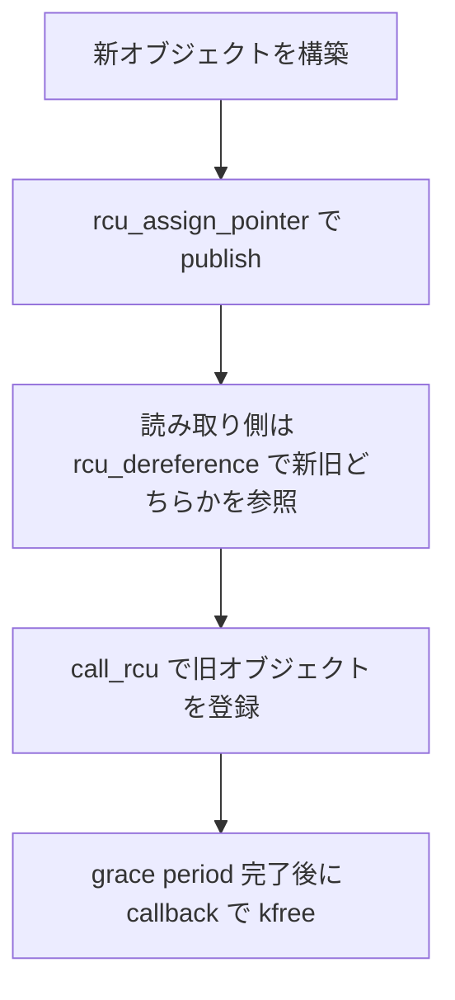

# 第10章 RCU の基本概念と API

> **本章で読むソース**
>
> - [`include/linux/rcupdate.h` L40-L43](https://github.com/gregkh/linux/blob/v6.18.38/include/linux/rcupdate.h#L40-L43)
> - [`include/linux/rcupdate.h` L70-L81](https://github.com/gregkh/linux/blob/v6.18.38/include/linux/rcupdate.h#L70-L81)
> - [`include/linux/rcupdate.h` L91-L101](https://github.com/gregkh/linux/blob/v6.18.38/include/linux/rcupdate.h#L91-L101)
> - [`include/linux/rcupdate.h` L764-L770](https://github.com/gregkh/linux/blob/v6.18.38/include/linux/rcupdate.h#L764-L770)
> - [`kernel/rcu/tree.c` L80-L82](https://github.com/gregkh/linux/blob/v6.18.38/kernel/rcu/tree.c#L80-L82)
> - [`kernel/rcu/tree.c` L92-L109](https://github.com/gregkh/linux/blob/v6.18.38/kernel/rcu/tree.c#L92-L109)

## この章の狙い

**RCU**（Read-Copy Update）の読み取り側と更新側の契約を、公開 API から押さえる。
`rcu_read_lock` と `rcu_dereference`、`call_rcu` と `synchronize_rcu` の対応関係を読めるようにする。

## 前提

- [アトミック操作とメモリバリア](../part00-foundation/01-atomic-barrier.md) と [lockdep](../part03-correctness/08-lockdep.md) を読んでいること。

## 公開 API の一覧

`rcupdate.h` がエクスポートする中心 API は次の3つである。

[`include/linux/rcupdate.h` L40-L43](https://github.com/gregkh/linux/blob/v6.18.38/include/linux/rcupdate.h#L40-L43)

```c
/* Exported common interfaces */
void call_rcu(struct rcu_head *head, rcu_callback_t func);
void rcu_barrier_tasks(void);
void synchronize_rcu(void);
```

読み取り側はマクロ群、`call_rcu` は非同期解放、`synchronize_rcu` は更新側の待ち合わせに使われる。

## 読み取り側クリティカルセクション

`CONFIG_PREEMPT_RCU` ではネスト深度を `task_struct` に記録する。
それ以外の構成では `__rcu_read_lock` が `preempt_disable` 相当になる。

[`include/linux/rcupdate.h` L70-L81](https://github.com/gregkh/linux/blob/v6.18.38/include/linux/rcupdate.h#L70-L81)

```c
#ifdef CONFIG_PREEMPT_RCU

void __rcu_read_lock(void);
void __rcu_read_unlock(void);

/*
 * Defined as a macro as it is a very low level header included from
 * areas that don't even know about current.  This gives the rcu_read_lock()
 * nesting depth, but makes sense only if CONFIG_PREEMPT_RCU -- in other
 * types of kernel builds, the rcu_read_lock() nesting depth is unknowable.
 */
#define rcu_preempt_depth() READ_ONCE(current->rcu_read_lock_nesting)
```

非 PREEMPT_RCU 構成のインライン実装は次の通りである。

[`include/linux/rcupdate.h` L91-L101](https://github.com/gregkh/linux/blob/v6.18.38/include/linux/rcupdate.h#L91-L101)

```c
static inline void __rcu_read_lock(void)
{
	preempt_disable();
}

static inline void __rcu_read_unlock(void)
{
	if (IS_ENABLED(CONFIG_RCU_STRICT_GRACE_PERIOD))
		rcu_read_unlock_strict();
	preempt_enable();
}
```

読み取り側はロックを取らず、grace period が既存の読み取りが終わるまで延長される。

## rcu_dereference

ポインタ取得は `rcu_dereference` 経由で行い、`__rcu` 注釈付きポインタだけを扱う。

[`include/linux/rcupdate.h` L764-L770](https://github.com/gregkh/linux/blob/v6.18.38/include/linux/rcupdate.h#L764-L770)

```c
/**
 * rcu_dereference() - fetch RCU-protected pointer for dereferencing
 * @p: The pointer to read, prior to dereferencing
 *
 * This is a simple wrapper around rcu_dereference_check().
 */
#define rcu_dereference(p) rcu_dereference_check(p, 0)
```

更新側は新しいオブジェクトを publish し、古いオブジェクトは `call_rcu` で後片付けする。
読み取り側は常に publish 前のポインタか新しいポインタのどちらかを見る。

## Tree RCU の per-CPU 状態

実装の本体は `kernel/rcu/tree.c` で、CPU ごとに `rcu_data` を持つ。

[`kernel/rcu/tree.c` L80-L82](https://github.com/gregkh/linux/blob/v6.18.38/kernel/rcu/tree.c#L80-L82)

```c
static DEFINE_PER_CPU_SHARED_ALIGNED(struct rcu_data, rcu_data) = {
	.gpwrap = true,
};
```

グローバルな `rcu_state` が grace period 番号と combining tree を保持する。

[`kernel/rcu/tree.c` L92-L109](https://github.com/gregkh/linux/blob/v6.18.38/kernel/rcu/tree.c#L92-L109)

```c
static struct rcu_state rcu_state = {
	.level = { &rcu_state.node[0] },
	.gp_state = RCU_GP_IDLE,
	.gp_seq = (0UL - 300UL) << RCU_SEQ_CTR_SHIFT,
	.barrier_mutex = __MUTEX_INITIALIZER(rcu_state.barrier_mutex),
	.barrier_lock = __RAW_SPIN_LOCK_UNLOCKED(rcu_state.barrier_lock),
	.name = RCU_NAME,
	.abbr = RCU_ABBR,
	.exp_mutex = __MUTEX_INITIALIZER(rcu_state.exp_mutex),
	.exp_wake_mutex = __MUTEX_INITIALIZER(rcu_state.exp_wake_mutex),
	.ofl_lock = __ARCH_SPIN_LOCK_UNLOCKED,
	.srs_cleanup_work = __WORK_INITIALIZER(rcu_state.srs_cleanup_work,
		rcu_sr_normal_gp_cleanup_work),
	.srs_cleanups_pending = ATOMIC_INIT(0),
#ifdef CONFIG_RCU_NOCB_CPU
	.nocb_mutex = __MUTEX_INITIALIZER(rcu_state.nocb_mutex),
#endif
};
```

**最適化の工夫**：読み取り側はアトミック操作やキャッシュライン共有を避け、更新側だけが grace period 管理のコストを払う。
読み取りが支配的なリンク済みリストやルーティングテーブルでスループットが伸びる。

## 処理の流れ：RCU 更新の典型パターン



`synchronize_rcu` を使えば、callback を書かずに更新側で旧データの寿命を待てる。

## RCU の変種

本章の Tree RCU はビルトインの `rcu` を扱う。
`rcu_bh` と `rcu_sched` は lockdep 用の互換名であり、現行 Tree RCU では独立したビルトイン変種ではなく通常 RCU へ統合済みの意味論を指す。
サブシステム限定の寿命管理には第12章の SRCU を使う。

## まとめ

- RCU は読み取り側を軽く保ち、更新側が grace period で古いデータの解放を遅延する。
- `rcu_dereference` と `rcu_read_lock` が読み取り側の契約である。
- `rcu_data` と `rcu_state` が per-CPU とグローバルで grace period を進める。

## 関連する章

- [Tree RCU と grace period](11-tree-rcu-gp.md)
- [call_rcu と callback 処理](13-call-rcu-callback.md)
- [SRCU](12-srcu.md)
