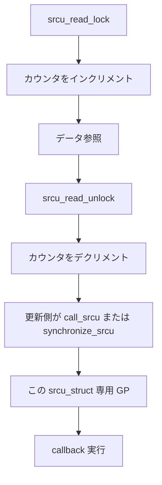

# 第13章 SRCU

> **本章で読むソース**
>
> - [`include/linux/srcu.h` L1-L14](https://github.com/gregkh/linux/blob/v6.18.38/include/linux/srcu.h#L1-L14)
> - [`include/linux/srcu.h` L66-L69](https://github.com/gregkh/linux/blob/v6.18.38/include/linux/srcu.h#L66-L69)
> - [`include/linux/srcutree.h` L30-L39](https://github.com/gregkh/linux/blob/v6.18.38/include/linux/srcutree.h#L30-L39)
> - [`kernel/rcu/srcutree.c` L752-L772](https://github.com/gregkh/linux/blob/v6.18.38/kernel/rcu/srcutree.c#L752-L772)
> - [`kernel/rcu/srcutree.c` L809-L821](https://github.com/gregkh/linux/blob/v6.18.38/kernel/rcu/srcutree.c#L809-L821)
> - [`kernel/rcu/srcutree.c` L878-L909](https://github.com/gregkh/linux/blob/v6.18.38/kernel/rcu/srcutree.c#L878-L909)
> - [`kernel/rcu/srcutree.c` L1263-L1339](https://github.com/gregkh/linux/blob/v6.18.38/kernel/rcu/srcutree.c#L1263-L1339)
> - [`kernel/rcu/srcutree.c` L1709-L1769](https://github.com/gregkh/linux/blob/v6.18.38/kernel/rcu/srcutree.c#L1709-L1769)
> - [`kernel/rcu/srcutree.c` L1863-L1892](https://github.com/gregkh/linux/blob/v6.18.38/kernel/rcu/srcutree.c#L1863-L1892)
> - [`kernel/rcu/srcutree.c` L1418-L1429](https://github.com/gregkh/linux/blob/v6.18.38/kernel/rcu/srcutree.c#L1418-L1429)
> - [`kernel/rcu/srcutree.c` L1435-L1465](https://github.com/gregkh/linux/blob/v6.18.38/kernel/rcu/srcutree.c#L1435-L1465)
> - [`kernel/rcu/srcutree.c` L1532-L1538](https://github.com/gregkh/linux/blob/v6.18.38/kernel/rcu/srcutree.c#L1532-L1538)

## この章の狙い

サブシステムごとに独立した grace period を持つ **SRCU**（Sleepable RCU）を読む。
Tree RCU とは別の `srcu_struct` で、スリープ可能な読み取り側を許容する理由を押さえる。

## 前提

- [RCU の基本概念と API](11-rcu-basics.md) と [Tree RCU と grace period](12-tree-rcu-gp.md) を読んでいること。

## SRCU の位置づけ

`srcu.h` は Sleepable RCU の公開インターフェースである。
実装は `CONFIG_TREE_SRCU` で `srcutree.c` に載る。

[`include/linux/srcu.h` L1-L14](https://github.com/gregkh/linux/blob/v6.18.38/include/linux/srcu.h#L1-L14)

```c
/* SPDX-License-Identifier: GPL-2.0+ */
/*
 * Sleepable Read-Copy Update mechanism for mutual exclusion
 *
 * Copyright (C) IBM Corporation, 2006
 * Copyright (C) Fujitsu, 2012
 *
 * Author: Paul McKenney <paulmck@linux.ibm.com>
 *	   Lai Jiangshan <laijs@cn.fujitsu.com>
 *
 * For detailed explanation of Read-Copy Update mechanism see -
 *		Documentation/RCU/ *.txt
 *
 */
```

公開 API は `call_srcu` と `synchronize_srcu` を中心にまとめられる。

[`include/linux/srcu.h` L66-L69](https://github.com/gregkh/linux/blob/v6.18.38/include/linux/srcu.h#L66-L69)

```c
void call_srcu(struct srcu_struct *ssp, struct rcu_head *head,
		void (*func)(struct rcu_head *head));
void cleanup_srcu_struct(struct srcu_struct *ssp);
void synchronize_srcu(struct srcu_struct *ssp);
```

per-CPU の `srcu_data` が読み取り側カウンタと callback リストを保持する。

[`include/linux/srcutree.h` L30-L39](https://github.com/gregkh/linux/blob/v6.18.38/include/linux/srcutree.h#L30-L39)

```c
struct srcu_data {
	/* Read-side state. */
	struct srcu_ctr srcu_ctrs[2];		/* Locks and unlocks per CPU. */
	int srcu_reader_flavor;			/* Reader flavor for srcu_struct structure? */
						/* Values: SRCU_READ_FLAVOR_.*  */

	/* Update-side state. */
	spinlock_t __private lock ____cacheline_internodealigned_in_smp;
	struct rcu_segcblist srcu_cblist;	/* List of callbacks.*/
	unsigned long srcu_gp_seq_needed;	/* Furthest future GP needed. */
```

## __srcu_read_lock と unlock

読み取り側は per-CPU の `srcu_locks` をインクリメントし、index を返す。
unlock は対応する `srcu_unlocks` をインクリメントする。

[`kernel/rcu/srcutree.c` L752-L772](https://github.com/gregkh/linux/blob/v6.18.38/kernel/rcu/srcutree.c#L752-L772)

```c
int __srcu_read_lock(struct srcu_struct *ssp)
{
	struct srcu_ctr __percpu *scp = READ_ONCE(ssp->srcu_ctrp);

	this_cpu_inc(scp->srcu_locks.counter);
	smp_mb(); /* B */  /* Avoid leaking the critical section. */
	return __srcu_ptr_to_ctr(ssp, scp);
}
EXPORT_SYMBOL_GPL(__srcu_read_lock);

/*
 * Removes the count for the old reader from the appropriate per-CPU
 * element of the srcu_struct.  Note that this may well be a different
 * CPU than that which was incremented by the corresponding srcu_read_lock().
 */
void __srcu_read_unlock(struct srcu_struct *ssp, int idx)
{
	smp_mb(); /* C */  /* Avoid leaking the critical section. */
	this_cpu_inc(__srcu_ctr_to_ptr(ssp, idx)->srcu_unlocks.counter);
}
EXPORT_SYMBOL_GPL(__srcu_read_unlock);
```

## srcu_gp_start と srcu_gp_end

GP 開始は `srcu_gp_seq` を進め SCAN1 状態へ入る。
終了は `srcu_gp_end` が `rcu_seq_end` し、callback 起動を `srcu_schedule_cbs_snp` で配る。

[`kernel/rcu/srcutree.c` L809-L821](https://github.com/gregkh/linux/blob/v6.18.38/kernel/rcu/srcutree.c#L809-L821)

```c
static void srcu_gp_start(struct srcu_struct *ssp)
{
	int state;

	lockdep_assert_held(&ACCESS_PRIVATE(ssp->srcu_sup, lock));
	WARN_ON_ONCE(ULONG_CMP_GE(ssp->srcu_sup->srcu_gp_seq, ssp->srcu_sup->srcu_gp_seq_needed));
	WRITE_ONCE(ssp->srcu_sup->srcu_gp_start, jiffies);
	WRITE_ONCE(ssp->srcu_sup->srcu_n_exp_nodelay, 0);
	smp_mb(); /* Order prior store to ->srcu_gp_seq_needed vs. GP start. */
	rcu_seq_start(&ssp->srcu_sup->srcu_gp_seq);
	state = rcu_seq_state(ssp->srcu_sup->srcu_gp_seq);
	WARN_ON_ONCE(state != SRCU_STATE_SCAN1);
}
```

[`kernel/rcu/srcutree.c` L878-L909](https://github.com/gregkh/linux/blob/v6.18.38/kernel/rcu/srcutree.c#L878-L909)

```c
static void srcu_gp_end(struct srcu_struct *ssp)
{
	unsigned long cbdelay = 1;
	bool cbs;
	bool last_lvl;
	int cpu;
	unsigned long gpseq;
	int idx;
	unsigned long mask;
	struct srcu_data *sdp;
	unsigned long sgsne;
	struct srcu_node *snp;
	int ss_state;
	struct srcu_usage *sup = ssp->srcu_sup;

	/* Prevent more than one additional grace period. */
	mutex_lock(&sup->srcu_cb_mutex);

	/* End the current grace period. */
	spin_lock_irq_rcu_node(sup);
	idx = rcu_seq_state(sup->srcu_gp_seq);
	WARN_ON_ONCE(idx != SRCU_STATE_SCAN2);
	if (srcu_gp_is_expedited(ssp))
		cbdelay = 0;

	WRITE_ONCE(sup->srcu_last_gp_end, ktime_get_mono_fast_ns());
	rcu_seq_end(&sup->srcu_gp_seq);
	gpseq = rcu_seq_current(&sup->srcu_gp_seq);
	if (ULONG_CMP_LT(sup->srcu_gp_seq_needed_exp, gpseq))
		WRITE_ONCE(sup->srcu_gp_seq_needed_exp, gpseq);
	spin_unlock_irq_rcu_node(sup);
	mutex_unlock(&sup->srcu_gp_mutex);
```

## srcu_gp_start_if_needed と process_srcu

`call_srcu` は `srcu_gp_start_if_needed` で callback を `rcu_segcblist_enqueue` し、GP 要求を進める。
`process_srcu` work は `srcu_advance_state` で SCAN1、SCAN2 の2回 counter scan を回す。

[`kernel/rcu/srcutree.c` L1263-L1339](https://github.com/gregkh/linux/blob/v6.18.38/kernel/rcu/srcutree.c#L1263-L1339)

```c
static unsigned long srcu_gp_start_if_needed(struct srcu_struct *ssp,
					     struct rcu_head *rhp, bool do_norm)
{
	unsigned long flags;
	int idx;
	bool needexp = false;
	bool needgp = false;
	unsigned long s;
	struct srcu_data *sdp;
	struct srcu_node *sdp_mynode;
	int ss_state;

	check_init_srcu_struct(ssp);
	/*
	 * While starting a new grace period, make sure we are in an
	 * SRCU read-side critical section so that the grace-period
	 * sequence number cannot wrap around in the meantime.
	 */
	idx = __srcu_read_lock_nmisafe(ssp);
	ss_state = smp_load_acquire(&ssp->srcu_sup->srcu_size_state);
	if (ss_state < SRCU_SIZE_WAIT_CALL)
		sdp = per_cpu_ptr(ssp->sda, get_boot_cpu_id());
	else
		sdp = raw_cpu_ptr(ssp->sda);
	spin_lock_irqsave_sdp_contention(sdp, &flags);
	if (rhp)
		rcu_segcblist_enqueue(&sdp->srcu_cblist, rhp);
	/*
	 * It's crucial to capture the snapshot 's' for acceleration before
	 * reading the current gp_seq that is used for advancing. This is
	 * essential because if the acceleration snapshot is taken after a
	 * failed advancement attempt, there's a risk that a grace period may
	 * conclude and a new one may start in the interim. If the snapshot is
	 * captured after this sequence of events, the acceleration snapshot 's'
	 * could be excessively advanced, leading to acceleration failure.
	 * In such a scenario, an 'acceleration leak' can occur, where new
	 * callbacks become indefinitely stuck in the RCU_NEXT_TAIL segment.
	 * Also note that encountering advancing failures is a normal
	 * occurrence when the grace period for RCU_WAIT_TAIL is in progress.
	 *
	 * To see this, consider the following events which occur if
	 * rcu_seq_snap() were to be called after advance:
	 *
	 *  1) The RCU_WAIT_TAIL segment has callbacks (gp_num = X + 4) and the
	 *     RCU_NEXT_READY_TAIL also has callbacks (gp_num = X + 8).
	 *
	 *  2) The grace period for RCU_WAIT_TAIL is seen as started but not
	 *     completed so rcu_seq_current() returns X + SRCU_STATE_SCAN1.
	 *
	 *  3) This value is passed to rcu_segcblist_advance() which can't move
	 *     any segment forward and fails.
	 *
	 *  4) srcu_gp_start_if_needed() still proceeds with callback acceleration.
	 *     But then the call to rcu_seq_snap() observes the grace period for the
	 *     RCU_WAIT_TAIL segment as completed and the subsequent one for the
	 *     RCU_NEXT_READY_TAIL segment as started (ie: X + 4 + SRCU_STATE_SCAN1)
	 *     so it returns a snapshot of the next grace period, which is X + 12.
	 *
	 *  5) The value of X + 12 is passed to rcu_segcblist_accelerate() but the
	 *     freshly enqueued callback in RCU_NEXT_TAIL can't move to
	 *     RCU_NEXT_READY_TAIL which already has callbacks for a previous grace
	 *     period (gp_num = X + 8). So acceleration fails.
	 */
	s = rcu_seq_snap(&ssp->srcu_sup->srcu_gp_seq);
	if (rhp) {
		rcu_segcblist_advance(&sdp->srcu_cblist,
				      rcu_seq_current(&ssp->srcu_sup->srcu_gp_seq));
		/*
		 * Acceleration can never fail because the base current gp_seq
		 * used for acceleration is <= the value of gp_seq used for
		 * advancing. This means that RCU_NEXT_TAIL segment will
		 * always be able to be emptied by the acceleration into the
		 * RCU_NEXT_READY_TAIL or RCU_WAIT_TAIL segments.
		 */
		WARN_ON_ONCE(!rcu_segcblist_accelerate(&sdp->srcu_cblist, s));
	}
	if (ULONG_CMP_LT(sdp->srcu_gp_seq_needed, s)) {
```

[`kernel/rcu/srcutree.c` L1709-L1769](https://github.com/gregkh/linux/blob/v6.18.38/kernel/rcu/srcutree.c#L1709-L1769)

```c
static void srcu_advance_state(struct srcu_struct *ssp)
{
	int idx;

	mutex_lock(&ssp->srcu_sup->srcu_gp_mutex);

	/*
	 * Because readers might be delayed for an extended period after
	 * fetching ->srcu_ctrp for their index, at any point in time there
	 * might well be readers using both idx=0 and idx=1.  We therefore
	 * need to wait for readers to clear from both index values before
	 * invoking a callback.
	 *
	 * The load-acquire ensures that we see the accesses performed
	 * by the prior grace period.
	 */
	idx = rcu_seq_state(smp_load_acquire(&ssp->srcu_sup->srcu_gp_seq)); /* ^^^ */
	if (idx == SRCU_STATE_IDLE) {
		spin_lock_irq_rcu_node(ssp->srcu_sup);
		if (ULONG_CMP_GE(ssp->srcu_sup->srcu_gp_seq, ssp->srcu_sup->srcu_gp_seq_needed)) {
			WARN_ON_ONCE(rcu_seq_state(ssp->srcu_sup->srcu_gp_seq));
			spin_unlock_irq_rcu_node(ssp->srcu_sup);
			mutex_unlock(&ssp->srcu_sup->srcu_gp_mutex);
			return;
		}
		idx = rcu_seq_state(READ_ONCE(ssp->srcu_sup->srcu_gp_seq));
		if (idx == SRCU_STATE_IDLE)
			srcu_gp_start(ssp);
		spin_unlock_irq_rcu_node(ssp->srcu_sup);
		if (idx != SRCU_STATE_IDLE) {
			mutex_unlock(&ssp->srcu_sup->srcu_gp_mutex);
			return; /* Someone else started the grace period. */
		}
	}

	if (rcu_seq_state(READ_ONCE(ssp->srcu_sup->srcu_gp_seq)) == SRCU_STATE_SCAN1) {
		idx = !(ssp->srcu_ctrp - &ssp->sda->srcu_ctrs[0]);
		if (!try_check_zero(ssp, idx, 1)) {
			mutex_unlock(&ssp->srcu_sup->srcu_gp_mutex);
			return; /* readers present, retry later. */
		}
		srcu_flip(ssp);
		spin_lock_irq_rcu_node(ssp->srcu_sup);
		rcu_seq_set_state(&ssp->srcu_sup->srcu_gp_seq, SRCU_STATE_SCAN2);
		ssp->srcu_sup->srcu_n_exp_nodelay = 0;
		spin_unlock_irq_rcu_node(ssp->srcu_sup);
	}

	if (rcu_seq_state(READ_ONCE(ssp->srcu_sup->srcu_gp_seq)) == SRCU_STATE_SCAN2) {

		/*
		 * SRCU read-side critical sections are normally short,
		 * so check at least twice in quick succession after a flip.
		 */
		idx = !(ssp->srcu_ctrp - &ssp->sda->srcu_ctrs[0]);
		if (!try_check_zero(ssp, idx, 2)) {
			mutex_unlock(&ssp->srcu_sup->srcu_gp_mutex);
			return; /* readers present, retry later. */
		}
		ssp->srcu_sup->srcu_n_exp_nodelay = 0;
		srcu_gp_end(ssp);  /* Releases ->srcu_gp_mutex. */
```

[`kernel/rcu/srcutree.c` L1863-L1892](https://github.com/gregkh/linux/blob/v6.18.38/kernel/rcu/srcutree.c#L1863-L1892)

```c
static void process_srcu(struct work_struct *work)
{
	unsigned long curdelay;
	unsigned long j;
	struct srcu_struct *ssp;
	struct srcu_usage *sup;

	sup = container_of(work, struct srcu_usage, work.work);
	ssp = sup->srcu_ssp;

	srcu_advance_state(ssp);
	spin_lock_irq_rcu_node(ssp->srcu_sup);
	curdelay = srcu_get_delay(ssp);
	spin_unlock_irq_rcu_node(ssp->srcu_sup);
	if (curdelay) {
		WRITE_ONCE(sup->reschedule_count, 0);
	} else {
		j = jiffies;
		if (READ_ONCE(sup->reschedule_jiffies) == j) {
			ASSERT_EXCLUSIVE_WRITER(sup->reschedule_count);
			WRITE_ONCE(sup->reschedule_count, READ_ONCE(sup->reschedule_count) + 1);
			if (READ_ONCE(sup->reschedule_count) > srcu_max_nodelay)
				curdelay = 1;
		} else {
			WRITE_ONCE(sup->reschedule_count, 1);
			WRITE_ONCE(sup->reschedule_jiffies, j);
		}
	}
	srcu_reschedule(ssp, curdelay);
}
```

## call_srcu

callback はプロセス文脈で実行され、bh は無効のままである。
Tree RCU の `call_rcu` と同様のメモリ順序保証がコメントで参照される。

[`kernel/rcu/srcutree.c` L1418-L1429](https://github.com/gregkh/linux/blob/v6.18.38/kernel/rcu/srcutree.c#L1418-L1429)

```c
 * The callback will be invoked from process context, but with bh
 * disabled.  The callback function must therefore be fast and must
 * not block.
 *
 * See the description of call_rcu() for more detailed information on
 * memory ordering guarantees.
 */
void call_srcu(struct srcu_struct *ssp, struct rcu_head *rhp,
	       rcu_callback_t func)
{
	__call_srcu(ssp, rhp, func, true);
}
```

## synchronize_srcu の内部

`__synchronize_srcu` は `call_srcu` で自分自身を起床 callback として登録し、`wait_for_completion` で GP 完了を待つ。
終了後に `smp_mb` で後続コードとの順序を固定する。

[`kernel/rcu/srcutree.c` L1435-L1465](https://github.com/gregkh/linux/blob/v6.18.38/kernel/rcu/srcutree.c#L1435-L1465)

```c
static void __synchronize_srcu(struct srcu_struct *ssp, bool do_norm)
{
	struct rcu_synchronize rcu;

	srcu_lock_sync(&ssp->dep_map);

	RCU_LOCKDEP_WARN(lockdep_is_held(ssp) ||
			 lock_is_held(&rcu_bh_lock_map) ||
			 lock_is_held(&rcu_lock_map) ||
			 lock_is_held(&rcu_sched_lock_map),
			 "Illegal synchronize_srcu() in same-type SRCU (or in RCU) read-side critical section");

	if (rcu_scheduler_active == RCU_SCHEDULER_INACTIVE)
		return;
	might_sleep();
	check_init_srcu_struct(ssp);
	init_completion(&rcu.completion);
	init_rcu_head_on_stack(&rcu.head);
	__call_srcu(ssp, &rcu.head, wakeme_after_rcu, do_norm);
	wait_for_completion(&rcu.completion);
	destroy_rcu_head_on_stack(&rcu.head);

	/*
	 * Make sure that later code is ordered after the SRCU grace
	 * period.  This pairs with the spin_lock_irq_rcu_node()
	 * in srcu_invoke_callbacks().  Unlike Tree RCU, this is needed
	 * because the current CPU might have been totally uninvolved with
	 * (and thus unordered against) that grace period.
	 */
	smp_mb();
}
```

**最適化の工夫**：SRCU は per-struct の GP なので、システム全体の Tree RCU GP と独立に進む。
頻繁に unload するモジュールでも、他サブシステムの callback 滞留の影響を受けにくい。

## synchronize_srcu の expedited 分岐

初回要求や idle 判定では expedited 経路が選ばれる。
Classic SRCU 互換のセマンティクスとして文書化されている。

[`kernel/rcu/srcutree.c` L1532-L1538](https://github.com/gregkh/linux/blob/v6.18.38/kernel/rcu/srcutree.c#L1532-L1538)

```c
void synchronize_srcu(struct srcu_struct *ssp)
{
	if (srcu_should_expedite(ssp) || rcu_gp_is_expedited())
		synchronize_srcu_expedited(ssp);
	else
		__synchronize_srcu(ssp, true);
}
```

## 処理の流れ：SRCU 読み取りと更新



読み取り側はスリープ可能なので、mutex を保持したまま SRCU 読み取りに入れる場面がある。
その場合でも、読み取り中に `synchronize_srcu` を同じ struct で呼ぶことは lockdep が警告する。

## Tree RCU との使い分け

グローバルな `rcu_read_lock` はネットワークやトレースで広く使われる。
ファイルシステムの mount 構造のように寿命がサブシステム単位なら SRCU が向く。

> **7.x 系での変化**
> 6.18.38 でも `SRCU_READ_FLAVOR_FAST` と fast reader API は存在する。
> 7.1.3 では [`include/linux/srcu.h` L30-L62](https://github.com/gregkh/linux/blob/v7.1.3/include/linux/srcu.h#L30-L62) に `init_srcu_struct_fast` と `init_srcu_struct_fast_updown` が追加され、初期化契約が明示化された。
> [`L72-L73`](https://github.com/gregkh/linux/blob/v7.1.3/include/linux/srcu.h#L72-L73) で `SRCU_READ_FLAVOR_FAST_UPDOWN` が分離され、[`L302-L304`](https://github.com/gregkh/linux/blob/v7.1.3/include/linux/srcu.h#L302-L304) で fast は NMI-safe、[`L306-L318`](https://github.com/gregkh/linux/blob/v7.1.3/include/linux/srcu.h#L306-L318) で fast の初期化契約が明記され、[`L337-L343`](https://github.com/gregkh/linux/blob/v7.1.3/include/linux/srcu.h#L337-L343) で fast_updown は NMI-safe ではないことが述べられている。

## まとめ

- SRCU は `srcu_struct` ごとに独立した grace period を提供する。
- `srcu_advance_state` が SCAN1、SCAN2 の counter scan と `srcu_gp_end` を回す。
- 読み取り側はスリープ可能で、更新側は `call_srcu` または `synchronize_srcu` で待つ。

## 関連する章

- [waitqueue](../part02-sleeping/07-waitqueue.md)
- [semaphore と completion](../part02-sleeping/08-semaphore-completion.md)
- [Tasks RCU](14-tasks-rcu.md)
- [call_rcu と callback 処理](15-call-rcu-callback.md)
- [lockdep](../part03-correctness/09-lockdep.md)
