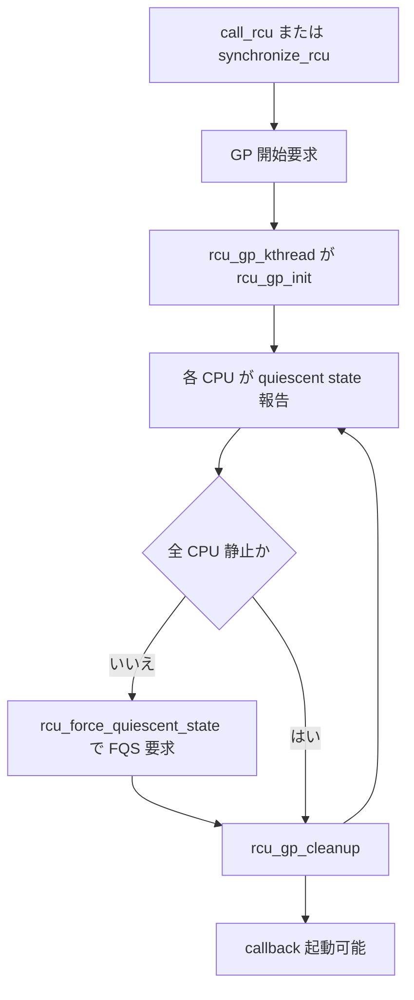

# 第13章 Tree RCU と grace period

> **本章で読むソース**
>
> - [`kernel/rcu/tree.c` L2259-L2291](https://github.com/gregkh/linux/blob/v6.18.38/kernel/rcu/tree.c#L2259-L2291)
> - [`kernel/rcu/tree.c` L2294-L2310](https://github.com/gregkh/linux/blob/v6.18.38/kernel/rcu/tree.c#L2294-L2310)
> - [`kernel/rcu/tree.c` L2327-L2382](https://github.com/gregkh/linux/blob/v6.18.38/kernel/rcu/tree.c#L2327-L2382)
> - [`kernel/rcu/tree.c` L2430-L2477](https://github.com/gregkh/linux/blob/v6.18.38/kernel/rcu/tree.c#L2430-L2477)
> - [`kernel/rcu/tree.c` L2052-L2107](https://github.com/gregkh/linux/blob/v6.18.38/kernel/rcu/tree.c#L2052-L2107)
> - [`kernel/rcu/tree.c` L2722-L2775](https://github.com/gregkh/linux/blob/v6.18.38/kernel/rcu/tree.c#L2722-L2775)
> - [`kernel/rcu/tree.c` L2781-L2813](https://github.com/gregkh/linux/blob/v6.18.38/kernel/rcu/tree.c#L2781-L2813)
> - [`kernel/rcu/tree.c` L3341-L3355](https://github.com/gregkh/linux/blob/v6.18.38/kernel/rcu/tree.c#L3341-L3355)
> - [`kernel/rcu/tree.c` L3269-L3282](https://github.com/gregkh/linux/blob/v6.18.38/kernel/rcu/tree.c#L3269-L3282)

## この章の狙い

Tree RCU が **grace period** をどう開始し、各 CPU の **quiescent state** を集め、完了するかを読む。
`rcu_gp_kthread` と `rcu_force_quiescent_state` の役割分担を追う。

## 前提

- [RCU の基本概念と API](12-rcu-basics.md) を読んでいること。

## rcu_gp_kthread のループ

grace period は専用カーネルスレッドが状態機械として回す。
開始待ち、`rcu_gp_fqs_loop`、クリーンアップの3段を無限ループする。

[`kernel/rcu/tree.c` L2259-L2291](https://github.com/gregkh/linux/blob/v6.18.38/kernel/rcu/tree.c#L2259-L2291)

```c
static int __noreturn rcu_gp_kthread(void *unused)
{
	rcu_bind_gp_kthread();
	for (;;) {

		/* Handle grace-period start. */
		for (;;) {
			trace_rcu_grace_period(rcu_state.name, rcu_state.gp_seq,
					       TPS("reqwait"));
			WRITE_ONCE(rcu_state.gp_state, RCU_GP_WAIT_GPS);
			swait_event_idle_exclusive(rcu_state.gp_wq,
					 READ_ONCE(rcu_state.gp_flags) &
					 RCU_GP_FLAG_INIT);
			rcu_gp_torture_wait();
			WRITE_ONCE(rcu_state.gp_state, RCU_GP_DONE_GPS);
			/* Locking provides needed memory barrier. */
			if (rcu_gp_init())
				break;
			cond_resched_tasks_rcu_qs();
			WRITE_ONCE(rcu_state.gp_activity, jiffies);
			WARN_ON(signal_pending(current));
			trace_rcu_grace_period(rcu_state.name, rcu_state.gp_seq,
					       TPS("reqwaitsig"));
		}

		/* Handle quiescent-state forcing. */
		rcu_gp_fqs_loop();

		/* Handle grace-period end. */
		WRITE_ONCE(rcu_state.gp_state, RCU_GP_CLEANUP);
		rcu_gp_cleanup();
		WRITE_ONCE(rcu_state.gp_state, RCU_GP_CLEANED);
	}
}
```

静止報告の完了は `rcu_report_qs_rsp` が次の GP 処理へ引き渡す。

[`kernel/rcu/tree.c` L2294-L2310](https://github.com/gregkh/linux/blob/v6.18.38/kernel/rcu/tree.c#L2294-L2310)

```c
/*
 * Report a full set of quiescent states to the rcu_state data structure.
 * Invoke rcu_gp_kthread_wake() to awaken the grace-period kthread if
 * another grace period is required.  Whether we wake the grace-period
 * kthread or it awakens itself for the next round of quiescent-state
 * forcing, that kthread will clean up after the just-completed grace
 * period.  Note that the caller must hold rnp->lock, which is released
 * before return.
 */
static void rcu_report_qs_rsp(unsigned long flags)
	__releases(rcu_get_root()->lock)
{
	raw_lockdep_assert_held_rcu_node(rcu_get_root());
	WARN_ON_ONCE(!rcu_gp_in_progress());
	WRITE_ONCE(rcu_state.gp_flags, rcu_state.gp_flags | RCU_GP_FLAG_FQS);
	raw_spin_unlock_irqrestore_rcu_node(rcu_get_root(), flags);
	rcu_gp_kthread_wake();
```

combining tree の各 `rcu_node` が子から報告を集約し、ルートで grace period 完了が宣言される。

## rcu_report_qs_rdp と rcu_report_qs_rnp

各 CPU は `rcu_check_quiescent_state` から `rcu_report_qs_rdp` を呼び、leaf の `qsmask` を落とす。
親ノードへは `rcu_report_qs_rnp` が `grpmask` を伝播し、ルート到達時に `rcu_report_qs_rsp` へ進む。

[`kernel/rcu/tree.c` L2430-L2477](https://github.com/gregkh/linux/blob/v6.18.38/kernel/rcu/tree.c#L2430-L2477)

```c
static void
rcu_report_qs_rdp(struct rcu_data *rdp)
{
	unsigned long flags;
	unsigned long mask;
	struct rcu_node *rnp;

	WARN_ON_ONCE(rdp->cpu != smp_processor_id());
	rnp = rdp->mynode;
	raw_spin_lock_irqsave_rcu_node(rnp, flags);
	if (rdp->cpu_no_qs.b.norm || rdp->gp_seq != rnp->gp_seq ||
	    rdp->gpwrap) {

		/*
		 * The grace period in which this quiescent state was
		 * recorded has ended, so don't report it upwards.
		 * We will instead need a new quiescent state that lies
		 * within the current grace period.
		 */
		rdp->cpu_no_qs.b.norm = true;	/* need qs for new gp. */
		raw_spin_unlock_irqrestore_rcu_node(rnp, flags);
		return;
	}
	mask = rdp->grpmask;
	rdp->core_needs_qs = false;
	if ((rnp->qsmask & mask) == 0) {
		raw_spin_unlock_irqrestore_rcu_node(rnp, flags);
	} else {
		/*
		 * This GP can't end until cpu checks in, so all of our
		 * callbacks can be processed during the next GP.
		 *
		 * NOCB kthreads have their own way to deal with that...
		 */
		if (!rcu_rdp_is_offloaded(rdp)) {
			/*
			 * The current GP has not yet ended, so it
			 * should not be possible for rcu_accelerate_cbs()
			 * to return true.  So complain, but don't awaken.
			 */
			WARN_ON_ONCE(rcu_accelerate_cbs(rnp, rdp));
		}

		rcu_disable_urgency_upon_qs(rdp);
		rcu_report_qs_rnp(mask, rnp, rnp->gp_seq, flags);
		/* ^^^ Released rnp->lock */
	}
}
```

[`kernel/rcu/tree.c` L2327-L2382](https://github.com/gregkh/linux/blob/v6.18.38/kernel/rcu/tree.c#L2327-L2382)

```c
static void rcu_report_qs_rnp(unsigned long mask, struct rcu_node *rnp,
			      unsigned long gps, unsigned long flags)
	__releases(rnp->lock)
{
	unsigned long oldmask = 0;
	struct rcu_node *rnp_c;

	raw_lockdep_assert_held_rcu_node(rnp);

	/* Walk up the rcu_node hierarchy. */
	for (;;) {
		if ((!(rnp->qsmask & mask) && mask) || rnp->gp_seq != gps) {

			/*
			 * Our bit has already been cleared, or the
			 * relevant grace period is already over, so done.
			 */
			raw_spin_unlock_irqrestore_rcu_node(rnp, flags);
			return;
		}
		WARN_ON_ONCE(oldmask); /* Any child must be all zeroed! */
		WARN_ON_ONCE(!rcu_is_leaf_node(rnp) &&
			     rcu_preempt_blocked_readers_cgp(rnp));
		WRITE_ONCE(rnp->qsmask, rnp->qsmask & ~mask);
		trace_rcu_quiescent_state_report(rcu_state.name, rnp->gp_seq,
						 mask, rnp->qsmask, rnp->level,
						 rnp->grplo, rnp->grphi,
						 !!rnp->gp_tasks);
		if (rnp->qsmask != 0 || rcu_preempt_blocked_readers_cgp(rnp)) {

			/* Other bits still set at this level, so done. */
			raw_spin_unlock_irqrestore_rcu_node(rnp, flags);
			return;
		}
		rnp->completedqs = rnp->gp_seq;
		mask = rnp->grpmask;
		if (rnp->parent == NULL) {

			/* No more levels.  Exit loop holding root lock. */

			break;
		}
		raw_spin_unlock_irqrestore_rcu_node(rnp, flags);
		rnp_c = rnp;
		rnp = rnp->parent;
		raw_spin_lock_irqsave_rcu_node(rnp, flags);
		oldmask = READ_ONCE(rnp_c->qsmask);
	}

	/*
	 * Get here if we are the last CPU to pass through a quiescent
	 * state for this grace period.  Invoke rcu_report_qs_rsp()
	 * to clean up and start the next grace period if one is needed.
	 */
	rcu_report_qs_rsp(flags); /* releases rnp->lock. */
}
```

## rcu_force_quiescent_state

遅延している CPU へ強制走査を要求する経路である。
階層の `fqslock` でバッシングを抑えつつ `RCU_GP_FLAG_FQS` を立て、`rcu_gp_kthread` を起床する。
実際の dyntick 走査と `resched_cpu` は `rcu_gp_fqs_loop` から `force_qs_rnp` が担う。

[`kernel/rcu/tree.c` L2781-L2813](https://github.com/gregkh/linux/blob/v6.18.38/kernel/rcu/tree.c#L2781-L2813)

```c
void rcu_force_quiescent_state(void)
{
	unsigned long flags;
	bool ret;
	struct rcu_node *rnp;
	struct rcu_node *rnp_old = NULL;

	if (!rcu_gp_in_progress())
		return;
	/* Funnel through hierarchy to reduce memory contention. */
	rnp = raw_cpu_read(rcu_data.mynode);
	for (; rnp != NULL; rnp = rnp->parent) {
		ret = (READ_ONCE(rcu_state.gp_flags) & RCU_GP_FLAG_FQS) ||
		       !raw_spin_trylock(&rnp->fqslock);
		if (rnp_old != NULL)
			raw_spin_unlock(&rnp_old->fqslock);
		if (ret)
			return;
		rnp_old = rnp;
	}
	/* rnp_old == rcu_get_root(), rnp == NULL. */

	/* Reached the root of the rcu_node tree, acquire lock. */
	raw_spin_lock_irqsave_rcu_node(rnp_old, flags);
	raw_spin_unlock(&rnp_old->fqslock);
	if (READ_ONCE(rcu_state.gp_flags) & RCU_GP_FLAG_FQS) {
		raw_spin_unlock_irqrestore_rcu_node(rnp_old, flags);
		return;  /* Someone beat us to it. */
	}
	WRITE_ONCE(rcu_state.gp_flags, rcu_state.gp_flags | RCU_GP_FLAG_FQS);
	raw_spin_unlock_irqrestore_rcu_node(rnp_old, flags);
	rcu_gp_kthread_wake();
}
```

`rcu_gp_fqs_loop` は FQS フラグを待ち、`force_qs_rnp` で leaf の各 CPU を走査する。

[`kernel/rcu/tree.c` L2052-L2107](https://github.com/gregkh/linux/blob/v6.18.38/kernel/rcu/tree.c#L2052-L2107)

```c
static noinline_for_stack void rcu_gp_fqs_loop(void)
{
	bool first_gp_fqs = true;
	int gf = 0;
	unsigned long j;
	int ret;
	struct rcu_node *rnp = rcu_get_root();

	j = READ_ONCE(jiffies_till_first_fqs);
	if (rcu_state.cbovld)
		gf = RCU_GP_FLAG_OVLD;
	ret = 0;
	for (;;) {
		if (rcu_state.cbovld) {
			j = (j + 2) / 3;
			if (j <= 0)
				j = 1;
		}
		if (!ret || time_before(jiffies + j, rcu_state.jiffies_force_qs)) {
			WRITE_ONCE(rcu_state.jiffies_force_qs, jiffies + j);
			/*
			 * jiffies_force_qs before RCU_GP_WAIT_FQS state
			 * update; required for stall checks.
			 */
			smp_wmb();
			WRITE_ONCE(rcu_state.jiffies_kick_kthreads,
				   jiffies + (j ? 3 * j : 2));
		}
		trace_rcu_grace_period(rcu_state.name, rcu_state.gp_seq,
				       TPS("fqswait"));
		WRITE_ONCE(rcu_state.gp_state, RCU_GP_WAIT_FQS);
		(void)swait_event_idle_timeout_exclusive(rcu_state.gp_wq,
				 rcu_gp_fqs_check_wake(&gf), j);
		rcu_gp_torture_wait();
		WRITE_ONCE(rcu_state.gp_state, RCU_GP_DOING_FQS);
		/* Locking provides needed memory barriers. */
		/*
		 * Exit the loop if the root rcu_node structure indicates that the grace period
		 * has ended, leave the loop.  The rcu_preempt_blocked_readers_cgp(rnp) check
		 * is required only for single-node rcu_node trees because readers blocking
		 * the current grace period are queued only on leaf rcu_node structures.
		 * For multi-node trees, checking the root node's ->qsmask suffices, because a
		 * given root node's ->qsmask bit is cleared only when all CPUs and tasks from
		 * the corresponding leaf nodes have passed through their quiescent state.
		 */
		if (!READ_ONCE(rnp->qsmask) &&
		    !rcu_preempt_blocked_readers_cgp(rnp))
			break;
		/* If time for quiescent-state forcing, do it. */
		if (!time_after(rcu_state.jiffies_force_qs, jiffies) ||
		    (gf & (RCU_GP_FLAG_FQS | RCU_GP_FLAG_OVLD))) {
			trace_rcu_grace_period(rcu_state.name, rcu_state.gp_seq,
					       TPS("fqsstart"));
			rcu_gp_fqs(first_gp_fqs);
			gf = 0;
			if (first_gp_fqs) {
```

[`kernel/rcu/tree.c` L2722-L2775](https://github.com/gregkh/linux/blob/v6.18.38/kernel/rcu/tree.c#L2722-L2775)

```c
static void force_qs_rnp(int (*f)(struct rcu_data *rdp))
{
	int cpu;
	unsigned long flags;
	struct rcu_node *rnp;

	rcu_state.cbovld = rcu_state.cbovldnext;
	rcu_state.cbovldnext = false;
	rcu_for_each_leaf_node(rnp) {
		unsigned long mask = 0;
		unsigned long rsmask = 0;

		cond_resched_tasks_rcu_qs();
		raw_spin_lock_irqsave_rcu_node(rnp, flags);
		rcu_state.cbovldnext |= !!rnp->cbovldmask;
		if (rnp->qsmask == 0) {
			if (rcu_preempt_blocked_readers_cgp(rnp)) {
				/*
				 * No point in scanning bits because they
				 * are all zero.  But we might need to
				 * priority-boost blocked readers.
				 */
				rcu_initiate_boost(rnp, flags);
				/* rcu_initiate_boost() releases rnp->lock */
				continue;
			}
			raw_spin_unlock_irqrestore_rcu_node(rnp, flags);
			continue;
		}
		for_each_leaf_node_cpu_mask(rnp, cpu, rnp->qsmask) {
			struct rcu_data *rdp;
			int ret;

			rdp = per_cpu_ptr(&rcu_data, cpu);
			ret = f(rdp);
			if (ret > 0) {
				mask |= rdp->grpmask;
				rcu_disable_urgency_upon_qs(rdp);
			}
			if (ret < 0)
				rsmask |= rdp->grpmask;
		}
		if (mask != 0) {
			/* Idle/offline CPUs, report (releases rnp->lock). */
			rcu_report_qs_rnp(mask, rnp, rnp->gp_seq, flags);
		} else {
			/* Nothing to do here, so just drop the lock. */
			raw_spin_unlock_irqrestore_rcu_node(rnp, flags);
		}

		for_each_leaf_node_cpu_mask(rnp, cpu, rsmask)
			resched_cpu(cpu);
	}
}
```

**最適化の工夫**：funnel により全 CPU が同時にルートロックを取りに行くことを避ける。
NO_HZ でユーザー空間に長く留まる CPU でも、`force_qs_rnp` の `resched_cpu` で静止報告を促す。

## synchronize_rcu の分岐

更新側が同期的に待つ API は、expedited 設定に応じて経路を切り替える。

[`kernel/rcu/tree.c` L3341-L3355](https://github.com/gregkh/linux/blob/v6.18.38/kernel/rcu/tree.c#L3341-L3355)

```c
void synchronize_rcu(void)
{
	unsigned long flags;
	struct rcu_node *rnp;

	RCU_LOCKDEP_WARN(lock_is_held(&rcu_bh_lock_map) ||
			 lock_is_held(&rcu_lock_map) ||
			 lock_is_held(&rcu_sched_lock_map),
			 "Illegal synchronize_rcu() in RCU read-side critical section");
	if (!rcu_blocking_is_gp()) {
		if (rcu_gp_is_expedited())
			synchronize_rcu_expedited();
		else
			synchronize_rcu_normal();
		return;
```

通常経路の `synchronize_rcu_normal` は `call_rcu_hurry` で GP 開始を促す。

[`kernel/rcu/tree.c` L3269-L3282](https://github.com/gregkh/linux/blob/v6.18.38/kernel/rcu/tree.c#L3269-L3282)

```c
static void synchronize_rcu_normal(void)
{
	struct rcu_synchronize rs;

	trace_rcu_sr_normal(rcu_state.name, &rs.head, TPS("request"));

	if (READ_ONCE(rcu_normal_wake_from_gp) < 1) {
		wait_rcu_gp(call_rcu_hurry);
		goto trace_complete_out;
	}

	init_rcu_head_on_stack(&rs.head);
	init_completion(&rs.completion);
```

`rcu_normal_wake_from_gp` が有効な構成では、completion と on-stack `rcu_head` で GP 完了を待つ。

[`kernel/rcu/tree.c` L3280-L3282](https://github.com/gregkh/linux/blob/v6.18.38/kernel/rcu/tree.c#L3280-L3282)

```c
	init_rcu_head_on_stack(&rs.head);
	init_completion(&rs.completion);
```

## 処理の流れ：grace period 一生



> **7.x 系での変化**
> [`kernel/rcu/tree.c` L1987-L1996](https://github.com/gregkh/linux/blob/v7.1.3/kernel/rcu/tree.c#L1987-L1996) で `rcu_gp_init` が FQS scan 前に GP kthread 自身の CPU を `rcu_qs` と `rcu_report_qs_rdp` で即時 QS 報告する。
> 全 CPU が idle のとき余分な FQS 待ちを避ける機構レベルの最適化である。

## まとめ

- `rcu_report_qs_rdp` と `rcu_report_qs_rnp` が leaf から root への静止集約を担う。
- `rcu_force_quiescent_state` は FQS フラグを立て、`force_qs_rnp` が実走査する。
- `synchronize_rcu` は normal と expedited の2系統へ分岐する。

## 関連する章

- [RCU の基本概念と API](12-rcu-basics.md)
- [RCU CPU stall 警告の診断](14-rcu-stall-diagnosis.md)
- [Tasks RCU](16-tasks-rcu.md)
- [call_rcu と callback 処理](17-call-rcu-callback.md)
- [expedited と nocb などの発展](18-expedited-nocb.md)
