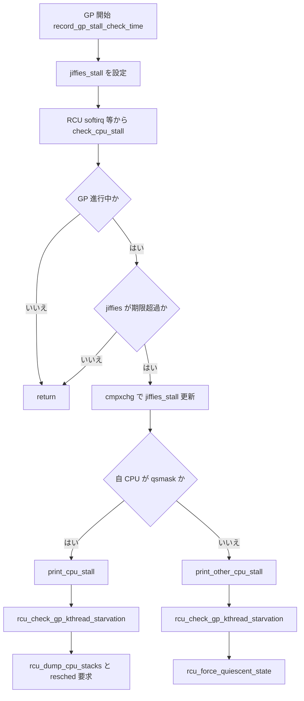

# 第14章 RCU CPU stall 警告の診断

> **本章で読むソース**
>
> - [`kernel/rcu/update.c` L553-L554](https://github.com/gregkh/linux/blob/v6.18.38/kernel/rcu/update.c#L553-L554)
> - [`kernel/rcu/tree_stall.h` L111-L127](https://github.com/gregkh/linux/blob/v6.18.38/kernel/rcu/tree_stall.h#L111-L127)
> - [`kernel/rcu/tree_stall.h` L201-L213](https://github.com/gregkh/linux/blob/v6.18.38/kernel/rcu/tree_stall.h#L201-L213)
> - [`kernel/rcu/tree_stall.h` L518-L566](https://github.com/gregkh/linux/blob/v6.18.38/kernel/rcu/tree_stall.h#L518-L566)
> - [`kernel/rcu/tree_stall.h` L569-L599](https://github.com/gregkh/linux/blob/v6.18.38/kernel/rcu/tree_stall.h#L569-L599)
> - [`kernel/rcu/tree_stall.h` L631-L676](https://github.com/gregkh/linux/blob/v6.18.38/kernel/rcu/tree_stall.h#L631-L676)
> - [`kernel/rcu/tree_stall.h` L709-L735](https://github.com/gregkh/linux/blob/v6.18.38/kernel/rcu/tree_stall.h#L709-L735)
> - [`kernel/rcu/tree_stall.h` L773-L868](https://github.com/gregkh/linux/blob/v6.18.38/kernel/rcu/tree_stall.h#L773-L868)

## この章の狙い

Tree RCU の grace period 中に CPU が quiescent state を報告しないと **RCU CPU stall** 警告が出る。
本章では stall タイムアウトの設定、`check_cpu_stall` の判定、警告ログの読み方、`rcu_check_gp_kthread_starvation` による GP kthread 飢餓検出を読む。
第13章の `rcu_gp_kthread` ループと対になる診断経路である。

## 前提

- [Tree RCU と grace period](13-tree-rcu-gp.md) を読んでいること。
- `rcu_cpu_stall_timeout` は秒単位のモジュールパラメータで、Kconfig 既定値から起動時に読み込まれる。

[`kernel/rcu/update.c` L553-L554](https://github.com/gregkh/linux/blob/v6.18.38/kernel/rcu/update.c#L553-L554)

```c
int rcu_cpu_stall_timeout __read_mostly = CONFIG_RCU_CPU_STALL_TIMEOUT;
module_param(rcu_cpu_stall_timeout, int, 0644);
```

## タイムアウト値のクランプ

`rcu_jiffies_till_stall_check` は `rcu_cpu_stall_timeout` を 3〜300 秒にクランプし、jiffies へ変換して返す。
`CONFIG_PROVE_RCU` 時は `RCU_STALL_DELAY_DELTA` が加算され、検証ビルドで余裕を持たせる。

[`kernel/rcu/tree_stall.h` L111-L127](https://github.com/gregkh/linux/blob/v6.18.38/kernel/rcu/tree_stall.h#L111-L127)

```c
int rcu_jiffies_till_stall_check(void)
{
	int till_stall_check = READ_ONCE(rcu_cpu_stall_timeout);

	if (till_stall_check < 3) {
		WRITE_ONCE(rcu_cpu_stall_timeout, 3);
		till_stall_check = 3;
	} else if (till_stall_check > 300) {
		WRITE_ONCE(rcu_cpu_stall_timeout, 300);
		till_stall_check = 300;
	}
	return till_stall_check * HZ + RCU_STALL_DELAY_DELTA;
}
```

GP 開始時に `record_gp_stall_check_time` が `gp_start` と `jiffies_stall` を記録する。
以降の stall 判定は「現在 GP が進行中か」と「`jiffies` が `jiffies_stall` を超えたか」で行う。

[`kernel/rcu/tree_stall.h` L201-L213](https://github.com/gregkh/linux/blob/v6.18.38/kernel/rcu/tree_stall.h#L201-L213)

```c
static void record_gp_stall_check_time(void)
{
	unsigned long j = jiffies;
	unsigned long j1;

	WRITE_ONCE(rcu_state.gp_start, j);
	j1 = rcu_jiffies_till_stall_check();
	smp_mb(); // ->gp_start before ->jiffies_stall and caller's ->gp_seq.
	WRITE_ONCE(rcu_state.nr_fqs_jiffies_stall, 0);
	WRITE_ONCE(rcu_state.jiffies_stall, j + j1);
	rcu_state.jiffies_resched = j + j1 / 2;
	rcu_state.n_force_qs_gpstart = READ_ONCE(rcu_state.n_force_qs);
}
```

## check_cpu_stall の判定ロジック

`check_cpu_stall` は RCU softirq 等から呼ばれ、GP 進行中に期限を過ぎたら警告を1回だけ発火させる。
`gp_seq`、`jiffies_stall`、`gp_start` を複数回読み、GP 切り替えに伴う偽陽性を除外する。

[`kernel/rcu/tree_stall.h` L773-L868](https://github.com/gregkh/linux/blob/v6.18.38/kernel/rcu/tree_stall.h#L773-L868)

```c
static void check_cpu_stall(struct rcu_data *rdp)
{
	bool self_detected;
	unsigned long gs1;
	unsigned long gs2;
	unsigned long gps;
	unsigned long j;
	unsigned long jn;
	unsigned long js;
	struct rcu_node *rnp;

	lockdep_assert_irqs_disabled();
	if ((rcu_stall_is_suppressed() && !READ_ONCE(rcu_kick_kthreads)) ||
	    !rcu_gp_in_progress())
		return;
	rcu_stall_kick_kthreads();

	if (READ_ONCE(rcu_state.nr_fqs_jiffies_stall) > 0)
		return;

	j = jiffies;

	gs1 = READ_ONCE(rcu_state.gp_seq);
	smp_rmb(); /* Pick up ->gp_seq first... */
	js = READ_ONCE(rcu_state.jiffies_stall);
	smp_rmb(); /* ...then ->jiffies_stall before the rest... */
	gps = READ_ONCE(rcu_state.gp_start);
	smp_rmb(); /* ...and finally ->gp_start before ->gp_seq again. */
	gs2 = READ_ONCE(rcu_state.gp_seq);
	if (gs1 != gs2 ||
	    ULONG_CMP_LT(j, js) ||
	    ULONG_CMP_GE(gps, js) ||
	    !rcu_seq_state(gs2))
		return; /* No stall or GP completed since entering function. */
	rnp = rdp->mynode;
	jn = jiffies + ULONG_MAX / 2;
	self_detected = READ_ONCE(rnp->qsmask) & rdp->grpmask;
	if (rcu_gp_in_progress() &&
	    (self_detected || ULONG_CMP_GE(j, js + RCU_STALL_RAT_DELAY)) &&
	    cmpxchg(&rcu_state.jiffies_stall, js, jn) == js) {
		if (kvm_check_and_clear_guest_paused())
			return;

#ifdef CONFIG_SYSFS
		++rcu_stall_count;
#endif

		rcu_stall_notifier_call_chain(RCU_STALL_NOTIFY_NORM, (void *)j - gps);
		if (READ_ONCE(csd_lock_suppress_rcu_stall) && csd_lock_is_stuck()) {
			pr_err("INFO: %s detected stall, but suppressed full report due to a stuck CSD-lock.\n", rcu_state.name);
		} else if (self_detected) {
			print_cpu_stall(gs2, gps);
		} else {
			print_other_cpu_stall(gs2, gps);
		}

		if (READ_ONCE(rcu_cpu_stall_ftrace_dump))
			rcu_ftrace_dump(DUMP_ALL);

		if (READ_ONCE(rcu_state.jiffies_stall) == jn) {
			jn = jiffies + 3 * rcu_jiffies_till_stall_check() + 3;
			WRITE_ONCE(rcu_state.jiffies_stall, jn);
		}
	}
}
```

`self_detected` が真なら自 CPU が qsmask に残っている（自ら stall 報告していない）とみなし `print_cpu_stall` へ進む。
他 CPU 向けは `RCU_STALL_RAT_DELAY` だけ猶予を置いてから `print_other_cpu_stall` が leaf node の qsmask を走査する。

## 警告行の読み方：print_cpu_stall_info

各 CPU 行は online 状態、GP 参加マスク、idle 深度、softirq 回数、FQS 回数などを1行に圧縮する。
`GPs behind` は当該 CPU が何 GP 遅れているか、`ticks this GP` は当 GP 中の sched tick 数を示す。

[`kernel/rcu/tree_stall.h` L518-L566](https://github.com/gregkh/linux/blob/v6.18.38/kernel/rcu/tree_stall.h#L518-L566)

```c
static void print_cpu_stall_info(int cpu)
{
	unsigned long delta;
	bool falsepositive;
	struct rcu_data *rdp = per_cpu_ptr(&rcu_data, cpu);
	char *ticks_title;
	unsigned long ticks_value;
	bool rcuc_starved;
	unsigned long j;
	char buf[32];

	touch_nmi_watchdog();

	ticks_value = rcu_seq_ctr(rcu_state.gp_seq - rdp->gp_seq);
	if (ticks_value) {
		ticks_title = "GPs behind";
	} else {
		ticks_title = "ticks this GP";
		ticks_value = rdp->ticks_this_gp;
	}
	delta = rcu_seq_ctr(rdp->mynode->gp_seq - rdp->rcu_iw_gp_seq);
	falsepositive = rcu_is_gp_kthread_starving(NULL) &&
			rcu_watching_snap_in_eqs(ct_rcu_watching_cpu(cpu));
	rcuc_starved = rcu_is_rcuc_kthread_starving(rdp, &j);
	if (rcuc_starved)
		snprintf(buf, sizeof(buf), " rcuc=%ld jiffies(starved)", j);
	pr_err("\t%d-%c%c%c%c: (%lu %s) idle=%04x/%ld/%#lx softirq=%u/%u fqs=%ld%s%s\n",
	       cpu,
	       "O."[!!cpu_online(cpu)],
	       "o."[!!(rdp->grpmask & rdp->mynode->qsmaskinit)],
	       "N."[!!(rdp->grpmask & rdp->mynode->qsmaskinitnext)],
	       !IS_ENABLED(CONFIG_IRQ_WORK) ? '?' :
			rdp->rcu_iw_pending ? (int)min(delta, 9UL) + '0' :
				"!."[!delta],
	       ticks_value, ticks_title,
	       ct_rcu_watching_cpu(cpu) & 0xffff,
	       ct_nesting_cpu(cpu), ct_nmi_nesting_cpu(cpu),
	       rdp->softirq_snap, kstat_softirqs_cpu(RCU_SOFTIRQ, cpu),
	       data_race(rcu_state.n_force_qs) - rcu_state.n_force_qs_gpstart,
	       rcuc_starved ? buf : "",
	       falsepositive ? " (false positive?)" : "");

	print_cpu_stat_info(cpu);
}
```

`(false positive?)` は GP kthread 自身が飢餓しているときに付くヒントである。
`rcuc=... jiffies(starved)` は RCU callback kthread の遅延を示す。

## GP kthread 飢餓：rcu_check_gp_kthread_starvation

stall 警告の末尾で `rcu_check_gp_kthread_starvation` が GP kthread の実行遅延を調べる。
kthread が CPU 時間を得られないと、QS 強制も GP 完了も進まず OOM に至るとログが明示する。

[`kernel/rcu/tree_stall.h` L569-L599](https://github.com/gregkh/linux/blob/v6.18.38/kernel/rcu/tree_stall.h#L569-L599)

```c
static void rcu_check_gp_kthread_starvation(void)
{
	int cpu;
	struct task_struct *gpk = rcu_state.gp_kthread;
	unsigned long j;

	if (rcu_is_gp_kthread_starving(&j)) {
		cpu = gpk ? task_cpu(gpk) : -1;
		pr_err("%s kthread starved for %ld jiffies! g%ld f%#x %s(%d) ->state=%#x ->cpu=%d\n",
		       rcu_state.name, j,
		       (long)rcu_seq_current(&rcu_state.gp_seq),
		       data_race(READ_ONCE(rcu_state.gp_flags)),
		       gp_state_getname(rcu_state.gp_state),
		       data_race(READ_ONCE(rcu_state.gp_state)),
		       gpk ? data_race(READ_ONCE(gpk->__state)) : ~0, cpu);
		if (gpk) {
			struct rcu_data *rdp = per_cpu_ptr(&rcu_data, cpu);

			pr_err("\tUnless %s kthread gets sufficient CPU time, OOM is now expected behavior.\n", rcu_state.name);
			pr_err("RCU grace-period kthread stack dump:\n");
			sched_show_task(gpk);
			if (cpu_is_offline(cpu)) {
				pr_err("RCU GP kthread last ran on offline CPU %d.\n", cpu);
			} else if (!(data_race(READ_ONCE(rdp->mynode->qsmask)) & rdp->grpmask)) {
				pr_err("Stack dump where RCU GP kthread last ran:\n");
				dump_cpu_task(cpu);
			}
			wake_up_process(gpk);
		}
	}
}
```

## 他 CPU stall と self-detected stall の出力

`print_other_cpu_stall` は leaf `rcu_node` の qsmask を辿り、静止していない CPU ごとに `print_cpu_stall_info` を呼ぶ。
末尾の `(detected by N, t=... jiffies, g=..., q=...)` で検出 CPU、経過時間、GP 番号、未処理 callback 数がまとまる。

[`kernel/rcu/tree_stall.h` L631-L676](https://github.com/gregkh/linux/blob/v6.18.38/kernel/rcu/tree_stall.h#L631-L676)

```c
static void print_other_cpu_stall(unsigned long gp_seq, unsigned long gps)
{
	int cpu;
	unsigned long flags;
	unsigned long gpa;
	unsigned long j;
	int ndetected = 0;
	struct rcu_node *rnp;
	long totqlen = 0;

	lockdep_assert_irqs_disabled();

	/* Kick and suppress, if so configured. */
	rcu_stall_kick_kthreads();
	if (rcu_stall_is_suppressed())
		return;

	nbcon_cpu_emergency_enter();

	/*
	 * OK, time to rat on our buddy...
	 * See Documentation/RCU/stallwarn.rst for info on how to debug
	 * RCU CPU stall warnings.
	 */
	trace_rcu_stall_warning(rcu_state.name, TPS("StallDetected"));
	pr_err("INFO: %s detected stalls on CPUs/tasks:\n", rcu_state.name);
	rcu_for_each_leaf_node(rnp) {
		raw_spin_lock_irqsave_rcu_node(rnp, flags);
		if (rnp->qsmask != 0) {
			for_each_leaf_node_possible_cpu(rnp, cpu)
				if (rnp->qsmask & leaf_node_cpu_bit(rnp, cpu)) {
					print_cpu_stall_info(cpu);
					ndetected++;
				}
		}
		ndetected += rcu_print_task_stall(rnp, flags); // Releases rnp->lock.
		lockdep_assert_irqs_disabled();
	}

	for_each_possible_cpu(cpu)
		totqlen += rcu_get_n_cbs_cpu(cpu);
	pr_err("\t(detected by %d, t=%ld jiffies, g=%ld, q=%lu ncpus=%d)\n",
	       smp_processor_id(), (long)(jiffies - gps),
	       (long)rcu_seq_current(&rcu_state.gp_seq), totqlen,
	       data_race(rcu_state.n_online_cpus)); // Diagnostic read
	if (ndetected) {
```

自 CPU が原因のときは `print_cpu_stall` が `self-detected stall on CPU` を出し、スタックダンプ後に `set_tsk_need_resched` で自 CPU にコンテキストスイッチを促す。

[`kernel/rcu/tree_stall.h` L709-L735](https://github.com/gregkh/linux/blob/v6.18.38/kernel/rcu/tree_stall.h#L709-L735)

```c
static void print_cpu_stall(unsigned long gp_seq, unsigned long gps)
{
	int cpu;
	unsigned long flags;
	struct rcu_data *rdp = this_cpu_ptr(&rcu_data);
	struct rcu_node *rnp = rcu_get_root();
	long totqlen = 0;

	lockdep_assert_irqs_disabled();

	/* Kick and suppress, if so configured. */
	rcu_stall_kick_kthreads();
	if (rcu_stall_is_suppressed())
		return;

	nbcon_cpu_emergency_enter();

	/*
	 * OK, time to rat on ourselves...
	 * See Documentation/RCU/stallwarn.rst for info on how to debug
	 * RCU CPU stall warnings.
	 */
	trace_rcu_stall_warning(rcu_state.name, TPS("SelfDetected"));
	pr_err("INFO: %s self-detected stall on CPU\n", rcu_state.name);
	raw_spin_lock_irqsave_rcu_node(rdp->mynode, flags);
	print_cpu_stall_info(smp_processor_id());
	raw_spin_unlock_irqrestore_rcu_node(rdp->mynode, flags);
```

## 処理の流れ：stall 検出から報告まで



## 高速化と最適化の工夫

stall 判定そのものは頻繁に走るため、偽陽性を避ける多段メモリバリア読み取りが中心である。
GP 開始と終了の順序付けにより、切り替え直後の誤警告を抑え、本当に静止していない CPU だけがログコストの高い `print_*` へ進む。
`cmpxchg` で `jiffies_stall` を更新することで、複数 CPU から同時に警告が溢れないよう1回の期限超過につき報告を直列化する。
`rcu_cpu_stall_reset` は FQS ループ内で jiffies の鮮度を確保し、長時間 jiffies が止まった環境での誤検出を避ける。

## まとめ

- `rcu_cpu_stall_timeout`（秒）が GP 開始からの警告までの上限を決め、3〜300 秒にクランプされる。
- `check_cpu_stall` は qsmask と jiffies 期限で self/other を分岐し、スタックダンプ付き警告を出す。
- `rcu_check_gp_kthread_starvation` は GP kthread 自体の CPU 飢餓を別軸で報告し、false positive 判定の手がかりにもなる。

## 関連する章

- [Tree RCU と grace period](13-tree-rcu-gp.md)
- [RCU の基本概念と API](12-rcu-basics.md)
- [call_rcu と callback 処理](17-call-rcu-callback.md)
