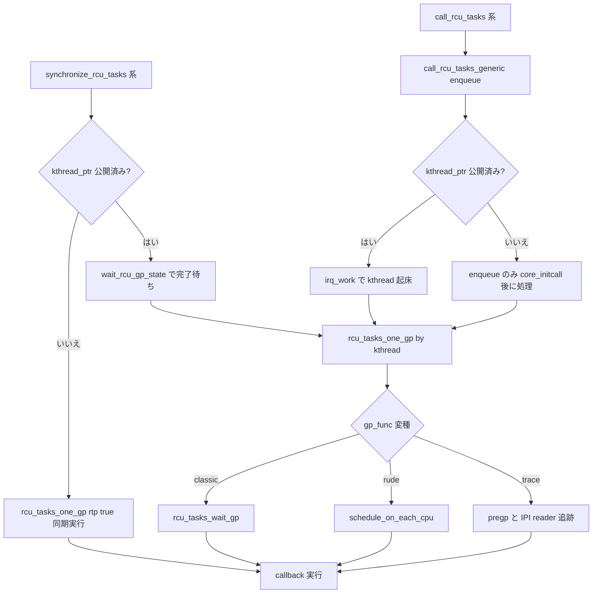

# 第14章 Tasks RCU

> **本章で読むソース**
>
> - [`kernel/rcu/tasks.h` L94-L108](https://github.com/gregkh/linux/blob/v6.18.38/kernel/rcu/tasks.h#L94-L108)
> - [`kernel/rcu/tasks.h` L133-L155](https://github.com/gregkh/linux/blob/v6.18.38/kernel/rcu/tasks.h#L133-L155)
> - [`kernel/rcu/tasks.h` L345-L405](https://github.com/gregkh/linux/blob/v6.18.38/kernel/rcu/tasks.h#L345-L405)
> - [`kernel/rcu/tasks.h` L632-L663](https://github.com/gregkh/linux/blob/v6.18.38/kernel/rcu/tasks.h#L632-L663)
> - [`kernel/rcu/tasks.h` L665-L679](https://github.com/gregkh/linux/blob/v6.18.38/kernel/rcu/tasks.h#L665-L679)
> - [`kernel/rcu/tasks.h` L682-L690](https://github.com/gregkh/linux/blob/v6.18.38/kernel/rcu/tasks.h#L682-L690)
> - [`kernel/rcu/tasks.h` L825-L840](https://github.com/gregkh/linux/blob/v6.18.38/kernel/rcu/tasks.h#L825-L840)
> - [`kernel/rcu/tasks.h` L905-L914](https://github.com/gregkh/linux/blob/v6.18.38/kernel/rcu/tasks.h#L905-L914)
> - [`kernel/rcu/tasks.h` L1016-L1024](https://github.com/gregkh/linux/blob/v6.18.38/kernel/rcu/tasks.h#L1016-L1024)
> - [`kernel/rcu/tasks.h` L1093-L1108](https://github.com/gregkh/linux/blob/v6.18.38/kernel/rcu/tasks.h#L1093-L1108)
> - [`kernel/rcu/tasks.h` L1338-L1359](https://github.com/gregkh/linux/blob/v6.18.38/kernel/rcu/tasks.h#L1338-L1359)
> - [`include/linux/rcupdate_trace.h` L37-L86](https://github.com/gregkh/linux/blob/v6.18.38/include/linux/rcupdate_trace.h#L37-L86)
> - [`kernel/rcu/tasks.h` L1558-L1590](https://github.com/gregkh/linux/blob/v6.18.38/kernel/rcu/tasks.h#L1558-L1590)
> - [`kernel/rcu/tasks.h` L1795-L1857](https://github.com/gregkh/linux/blob/v6.18.38/kernel/rcu/tasks.h#L1795-L1857)
> - [`kernel/rcu/tasks.h` L1630-L1663](https://github.com/gregkh/linux/blob/v6.18.38/kernel/rcu/tasks.h#L1630-L1663)
> - [`kernel/rcu/tasks.h` L1713-L1767](https://github.com/gregkh/linux/blob/v6.18.38/kernel/rcu/tasks.h#L1713-L1767)
> - [`kernel/rcu/tasks.h` L2002-L2011](https://github.com/gregkh/linux/blob/v6.18.38/kernel/rcu/tasks.h#L2002-L2011)
> - [`include/linux/rcupdate.h` L217-L224](https://github.com/gregkh/linux/blob/v6.18.38/include/linux/rcupdate.h#L217-L224)
> - [`include/linux/rcupdate_trace.h` L92-L100](https://github.com/gregkh/linux/blob/v6.18.38/include/linux/rcupdate_trace.h#L92-L100)
> - [`kernel/bpf/trampoline.c` L315-L355](https://github.com/gregkh/linux/blob/v6.18.38/kernel/bpf/trampoline.c#L315-L355)
> - [`kernel/trace/ftrace.c` L3178-L3202](https://github.com/gregkh/linux/blob/v6.18.38/kernel/trace/ftrace.c#L3178-L3202)

## この章の狙い

Tree RCU や SRCU とは別系統の **Tasks RCU** 三変種（Tasks、Tasks Rude、Tasks Trace）を読む。
classic Tasks はタスクリスト走査と `nvcsw` 変化で GP を検出する。
Tasks Rude は `schedule_on_each_cpu` で全 online CPU に強制コンテキストスイッチを起こす。
Tasks Trace は `rcu_read_lock_trace` による明示的 read-side と reader 追跡を持つ。
同期 API と `call_rcu` API の midboot 分岐の違いも押さえる。

## 前提

- [RCU の基本概念と API](11-rcu-basics.md) と [Tree RCU と grace period](12-tree-rcu-gp.md) を読んでいること。
- [SRCU](13-srcu.md) と対比すると、Tasks Trace は明示 read-side を持ち、classic はタスク走査で GP を完了させる点が異なる。

## 三変種の位置づけ

| 変種 | read-side | GP 検出の要点 | 典型用途 |
|---|---|---|---|
| Tasks (`rcu_tasks`) | 明示 API なし | タスクリスト走査と `nvcsw` 変化 | BPF trampoline asm 退出待ち（`call_rcu_tasks`） |
| Tasks Rude | 明示 API なし | 全 online CPU への強制コンテキストスイッチ | ftrace の同期更新（`synchronize_rcu_tasks_rude`） |
| Tasks Trace | `rcu_read_lock_trace` | running/blocked reader 追跡と IPI | sleepable BPF、トレースフィルタ（`call_rcu_tasks_trace`） |

6.18.38 では BPF trampoline 破棄に `call_rcu_tasks` と `call_rcu_tasks_trace` の両方を使い、ftrace は `synchronize_rcu_tasks_rude` のあと `synchronize_rcu_tasks` を続けて呼ぶ。

[`kernel/bpf/trampoline.c` L315-L355](https://github.com/gregkh/linux/blob/v6.18.38/kernel/bpf/trampoline.c#L315-L355)

```c
	// ... (中略) ...
	 * In case of CONFIG_PREEMPT=y use call_rcu_tasks() to wait on
	 * first few asm instructions to execute and call into
	 * __bpf_tramp_enter->percpu_ref_get.
	 * Then use percpu_ref_kill to wait for the trampoline and the original
	 * function to finish.
	 * Then use call_rcu_tasks() to make sure few asm insns in
	 * the trampoline epilogue are done as well.
	 *
	 * In !PREEMPT case the task that got interrupted in the first asm
	 * insns won't go through an RCU quiescent state which the
	 * percpu_ref_kill will be waiting for. Hence the first
	 * call_rcu_tasks() is not necessary.
	 */
	if (im->ip_after_call) {
		int err = bpf_arch_text_poke(im->ip_after_call, BPF_MOD_JUMP,
					     NULL, im->ip_epilogue);
		WARN_ON(err);
		if (IS_ENABLED(CONFIG_TASKS_RCU))
			call_rcu_tasks(&im->rcu, __bpf_tramp_image_put_rcu_tasks);
		else
			percpu_ref_kill(&im->pcref);
		return;
	}

	/* The trampoline without fexit and fmod_ret progs doesn't call original
	 * function and doesn't use percpu_ref.
	 * Use call_rcu_tasks_trace() to wait for sleepable progs to finish.
	 * Then use call_rcu_tasks() to wait for the rest of trampoline asm
	 * and normal progs.
	 */
	call_rcu_tasks_trace(&im->rcu, __bpf_tramp_image_put_rcu_tasks);
```

[`kernel/trace/ftrace.c` L3178-L3202](https://github.com/gregkh/linux/blob/v6.18.38/kernel/trace/ftrace.c#L3178-L3202)

```c
	/*
	 * Dynamic ops may be freed, we must make sure that all
	 * callers are done before leaving this function.
	 */
	if (ops->flags & FTRACE_OPS_FL_DYNAMIC) {
		/*
		 * We need to do a hard force of sched synchronization.
		 * This is because we use preempt_disable() to do RCU, but
		 * the function tracers can be called where RCU is not watching
		 * (like before user_exit()). We can not rely on the RCU
		 * infrastructure to do the synchronization, thus we must do it
		 * ourselves.
		 */
		synchronize_rcu_tasks_rude();

		/*
		 * When the kernel is preemptive, tasks can be preempted
		 * while on a ftrace trampoline. Just scheduling a task on
		 * a CPU is not good enough to flush them. Calling
		 * synchronize_rcu_tasks() will wait for those tasks to
		 * execute and either schedule voluntarily or enter user space.
		 */
		synchronize_rcu_tasks();

		ftrace_trampoline_free(ops);
```

## rcu_tasks 構造体と DEFINE_RCU_TASKS

[`kernel/rcu/tasks.h` L94-L108](https://github.com/gregkh/linux/blob/v6.18.38/kernel/rcu/tasks.h#L94-L108)

```c
struct rcu_tasks {
	struct rcuwait cbs_wait;
	raw_spinlock_t cbs_gbl_lock;
	struct mutex tasks_gp_mutex;
	int gp_state;
	int gp_sleep;
	int init_fract;
	unsigned long gp_jiffies;
	unsigned long gp_start;
	unsigned long tasks_gp_seq;
	unsigned long n_ipis;
	unsigned long n_ipis_fails;
	struct task_struct *kthread_ptr;
	unsigned long lazy_jiffies;
	rcu_tasks_gp_func_t gp_func;
```

[`kernel/rcu/tasks.h` L133-L155](https://github.com/gregkh/linux/blob/v6.18.38/kernel/rcu/tasks.h#L133-L155)

```c
#define DEFINE_RCU_TASKS(rt_name, gp, call, n)						\
static DEFINE_PER_CPU(struct rcu_tasks_percpu, rt_name ## __percpu) = {			\
	.lock = __RAW_SPIN_LOCK_UNLOCKED(rt_name ## __percpu.cbs_pcpu_lock),		\
	.rtp_irq_work = IRQ_WORK_INIT_HARD(call_rcu_tasks_iw_wakeup),			\
};											\
static struct rcu_tasks rt_name =							\
{											\
	.cbs_wait = __RCUWAIT_INITIALIZER(rt_name.wait),				\
	.cbs_gbl_lock = __RAW_SPIN_LOCK_UNLOCKED(rt_name.cbs_gbl_lock),			\
	.tasks_gp_mutex = __MUTEX_INITIALIZER(rt_name.tasks_gp_mutex),			\
	.gp_func = gp,									\
	.call_func = call,								\
	.wait_state = TASK_UNINTERRUPTIBLE,						\
	.rtpcpu = &rt_name ## __percpu,							\
	.lazy_jiffies = DIV_ROUND_UP(HZ, 4),						\
	.name = n,									\
	.percpu_enqueue_shift = order_base_2(CONFIG_NR_CPUS),				\
	.percpu_enqueue_lim = 1,							\
	.percpu_dequeue_lim = 1,							\
	.barrier_q_mutex = __MUTEX_INITIALIZER(rt_name.barrier_q_mutex),		\
	.barrier_q_seq = (0UL - 50UL) << RCU_SEQ_CTR_SHIFT,				\
	.kname = #rt_name,								\
}
```

## tasks_gp_kthread と API 別の midboot 分岐

起動時に `rcu_spawn_tasks_kthread_generic` が専用 kthread を立ち上げる。

[`kernel/rcu/tasks.h` L682-L690](https://github.com/gregkh/linux/blob/v6.18.38/kernel/rcu/tasks.h#L682-L690)

```c
static void __init rcu_spawn_tasks_kthread_generic(struct rcu_tasks *rtp)
{
	struct task_struct *t;

	t = kthread_run(rcu_tasks_kthread, rtp, "%s_kthread", rtp->kname);
	if (WARN_ONCE(IS_ERR(t), "%s: Could not start %s grace-period kthread, OOM is now expected behavior\n", __func__, rtp->name))
		return;
	smp_mb(); /* Ensure others see full kthread. */
}
```

kthread 本体は無限ループで `rcu_tasks_one_gp` を呼ぶ。

[`kernel/rcu/tasks.h` L632-L663](https://github.com/gregkh/linux/blob/v6.18.38/kernel/rcu/tasks.h#L632-L663)

```c
static int __noreturn rcu_tasks_kthread(void *arg)
{
	int cpu;
	struct rcu_tasks *rtp = arg;

	for_each_possible_cpu(cpu) {
		struct rcu_tasks_percpu *rtpcp = per_cpu_ptr(rtp->rtpcpu, cpu);

		timer_setup(&rtpcp->lazy_timer, call_rcu_tasks_generic_timer, 0);
		rtpcp->urgent_gp = 1;
	}

	/* Run on housekeeping CPUs by default.  Sysadm can move if desired. */
	housekeeping_affine(current, HK_TYPE_RCU);
	smp_store_release(&rtp->kthread_ptr, current); // Let GPs start!

	/*
	 * Each pass through the following loop makes one check for
	 * newly arrived callbacks, and, if there are some, waits for
	 * one RCU-tasks grace period and then invokes the callbacks.
	 * This loop is terminated by the system going down.  ;-)
	 */
	for (;;) {
		// Wait for one grace period and invoke any callbacks
		// that are ready.
		rcu_tasks_one_gp(rtp, false);

		// Paranoid sleep to keep this from entering a tight loop.
		schedule_timeout_idle(rtp->gp_sleep);
	}
}
```

### synchronize API: 呼び出し元を待たせる同期 GP

`synchronize_rcu_tasks_generic` は postboot でも同期 API である。
`kthread_ptr` が公開済みなら `wait_rcu_gp_state` が `call_func` で dummy callback を登録し、GP 完了まで呼び出し元をブロックする。
midboot だけ `rcu_tasks_one_gp(rtp, true)` を呼び出し側で同期実行する。

[`kernel/rcu/tasks.h` L665-L679](https://github.com/gregkh/linux/blob/v6.18.38/kernel/rcu/tasks.h#L665-L679)

```c
static void synchronize_rcu_tasks_generic(struct rcu_tasks *rtp)
{
	/* Complain if the scheduler has not started.  */
	if (WARN_ONCE(rcu_scheduler_active == RCU_SCHEDULER_INACTIVE,
			 "synchronize_%s() called too soon", rtp->name))
		return;

	// If the grace-period kthread is running, use it.
	if (READ_ONCE(rtp->kthread_ptr)) {
		wait_rcu_gp_state(rtp->wait_state, rtp->call_func);
		return;
	}
	rcu_tasks_one_gp(rtp, true);
}
```

postboot では GP の実行主体が kthread に移るだけで、呼び出し元は依然として完了まで待つ。

### call_rcu API: enqueue して kthread に任せる

`call_rcu_tasks_generic` は callback を per-CPU キューへ載せる。
`kthread_ptr` が未公開なら `irq_work` による起床を送らず、core_initcall 後に kthread が処理する。

[`kernel/rcu/tasks.h` L345-L405](https://github.com/gregkh/linux/blob/v6.18.38/kernel/rcu/tasks.h#L345-L405)

```c
static void call_rcu_tasks_generic(struct rcu_head *rhp, rcu_callback_t func,
				   struct rcu_tasks *rtp)
{
	int chosen_cpu;
	unsigned long flags;
	bool havekthread = smp_load_acquire(&rtp->kthread_ptr);
	int ideal_cpu;
	unsigned long j;
	bool needadjust = false;
	bool needwake;
	struct rcu_tasks_percpu *rtpcp;

	rhp->next = NULL;
	rhp->func = func;
	local_irq_save(flags);
	rcu_read_lock();
	ideal_cpu = smp_processor_id() >> READ_ONCE(rtp->percpu_enqueue_shift);
	chosen_cpu = cpumask_next(ideal_cpu - 1, cpu_possible_mask);
	WARN_ON_ONCE(chosen_cpu >= rcu_task_cpu_ids);
	rtpcp = per_cpu_ptr(rtp->rtpcpu, chosen_cpu);
	// ... (中略) ...
	rcu_segcblist_enqueue(&rtpcp->cblist, rhp);
	raw_spin_unlock_irqrestore_rcu_node(rtpcp, flags);
	// ... (中略) ...
	rcu_read_unlock();
	/* We can't create the thread unless interrupts are enabled. */
	if (needwake && READ_ONCE(rtp->kthread_ptr))
		irq_work_queue(&rtpcp->rtp_irq_work);
}
```

## classic Tasks RCU: タスク走査による GP

classic Tasks は `rcu_read_lock` 相当を持たない。
静止状態は自発的コンテキストスイッチ、ユーザ空間実行、アイドル等で定義される。

[`kernel/rcu/tasks.h` L905-L914](https://github.com/gregkh/linux/blob/v6.18.38/kernel/rcu/tasks.h#L905-L914)

```c
// Simple variant of RCU whose quiescent states are voluntary context
// switch, cond_resched_tasks_rcu_qs(), user-space execution, and idle.
// As such, grace periods can take one good long time.  There are no
// read-side primitives similar to rcu_read_lock() and rcu_read_unlock()
// because this implementation is intended to get the system into a safe
// state for some of the manipulations involved in tracing and the like.
// Finally, this implementation does not support high call_rcu_tasks()
// rates from multiple CPUs.  If this is required, per-CPU callback lists
// will be needed.
```

[`kernel/rcu/tasks.h` L825-L840](https://github.com/gregkh/linux/blob/v6.18.38/kernel/rcu/tasks.h#L825-L840)

```c
	set_tasks_gp_state(rtp, RTGS_PRE_WAIT_GP);
	rtp->pregp_func(&holdouts);

	/*
	 * There were callbacks, so we need to wait for an RCU-tasks
	 * grace period.  Start off by scanning the task list for tasks
	 * that are not already voluntarily blocked.  Mark these tasks
	 * and make a list of them in holdouts.
	 */
	set_tasks_gp_state(rtp, RTGS_SCAN_TASKLIST);
	if (rtp->pertask_func) {
		rcu_read_lock();
		for_each_process_thread(g, t)
			rtp->pertask_func(t, &holdouts);
		rcu_read_unlock();
	}
```

[`kernel/rcu/tasks.h` L1016-L1024](https://github.com/gregkh/linux/blob/v6.18.38/kernel/rcu/tasks.h#L1016-L1024)

```c
static void rcu_tasks_pertask(struct task_struct *t, struct list_head *hop)
{
	if (t != current && rcu_tasks_is_holdout(t)) {
		get_task_struct(t);
		t->rcu_tasks_nvcsw = READ_ONCE(t->nvcsw);
		WRITE_ONCE(t->rcu_tasks_holdout, true);
		list_add(&t->rcu_tasks_holdout_list, hop);
	}
}
```

[`kernel/rcu/tasks.h` L1093-L1108](https://github.com/gregkh/linux/blob/v6.18.38/kernel/rcu/tasks.h#L1093-L1108)

```c
/* See if tasks are still holding out, complain if so. */
static void check_holdout_task(struct task_struct *t,
			       bool needreport, bool *firstreport)
{
	int cpu;

	if (!READ_ONCE(t->rcu_tasks_holdout) ||
	    t->rcu_tasks_nvcsw != READ_ONCE(t->nvcsw) ||
	    !rcu_tasks_is_holdout(t) ||
	    (IS_ENABLED(CONFIG_NO_HZ_FULL) &&
	     !is_idle_task(t) && READ_ONCE(t->rcu_tasks_idle_cpu) >= 0)) {
		WRITE_ONCE(t->rcu_tasks_holdout, false);
		list_del_init(&t->rcu_tasks_holdout_list);
		put_task_struct(t);
		return;
	}
```

## Tasks Rude: 全 CPU 強制 QS

Rude はタスク走査ではなく、`schedule_on_each_cpu` で全 online CPU に IPI を送り強制コンテキストスイッチを起こす。

[`kernel/rcu/tasks.h` L1338-L1359](https://github.com/gregkh/linux/blob/v6.18.38/kernel/rcu/tasks.h#L1338-L1359)

```c
// "Rude" variant of Tasks RCU, inspired by Steve Rostedt's
// trick of passing an empty function to schedule_on_each_cpu().
// This approach provides batching of concurrent calls to the synchronous
// synchronize_rcu_tasks_rude() API.  This invokes schedule_on_each_cpu()
// in order to send IPIs far and wide and induces otherwise unnecessary
// context switches on all online CPUs, whether idle or not.
//
// Callback handling is provided by the rcu_tasks_kthread() function.
//
// Ordering is provided by the scheduler's context-switch code.

// Empty function to allow workqueues to force a context switch.
static void rcu_tasks_be_rude(struct work_struct *work)
{
}

// Wait for one rude RCU-tasks grace period.
static void rcu_tasks_rude_wait_gp(struct rcu_tasks *rtp)
{
	rtp->n_ipis += cpumask_weight(cpu_online_mask);
	schedule_on_each_cpu(rcu_tasks_be_rude);
}
```

## Tasks Trace: 明示 read-side と reader 追跡

[`include/linux/rcupdate_trace.h` L37-L86](https://github.com/gregkh/linux/blob/v6.18.38/include/linux/rcupdate_trace.h#L37-L86)

```c
/**
 * rcu_read_lock_trace - mark beginning of RCU-trace read-side critical section
 *
 * When synchronize_rcu_tasks_trace() is invoked by one task, then that
 * task is guaranteed to block until all other tasks exit their read-side
 * critical sections.  Similarly, if call_rcu_trace() is invoked on one
 * task while other tasks are within RCU read-side critical sections,
 * invocation of the corresponding RCU callback is deferred until after
 * the all the other tasks exit their critical sections.
 *
 * For more details, please see the documentation for rcu_read_lock().
 */
static inline void rcu_read_lock_trace(void)
{
	struct task_struct *t = current;

	WRITE_ONCE(t->trc_reader_nesting, READ_ONCE(t->trc_reader_nesting) + 1);
	barrier();
	if (IS_ENABLED(CONFIG_TASKS_TRACE_RCU_READ_MB) &&
	    t->trc_reader_special.b.need_mb)
		smp_mb(); // Pairs with update-side barriers
	rcu_lock_acquire(&rcu_trace_lock_map);
}

/**
 * rcu_read_unlock_trace - mark end of RCU-trace read-side critical section
 *
 * Pairs with a preceding call to rcu_read_lock_trace(), and nesting is
 * allowed.  Invoking a rcu_read_unlock_trace() when there is no matching
 * rcu_read_lock_trace() is verboten, and will result in lockdep complaints.
 *
 * For more details, please see the documentation for rcu_read_unlock().
 */
static inline void rcu_read_unlock_trace(void)
{
	int nesting;
	struct task_struct *t = current;

	rcu_lock_release(&rcu_trace_lock_map);
	nesting = READ_ONCE(t->trc_reader_nesting) - 1;
	barrier(); // Critical section before disabling.
	// Disable IPI-based setting of .need_qs.
	WRITE_ONCE(t->trc_reader_nesting, INT_MIN + nesting);
	if (likely(!READ_ONCE(t->trc_reader_special.s)) || nesting) {
		WRITE_ONCE(t->trc_reader_nesting, nesting);
		return;  // We assume shallow reader nesting.
	}
	WARN_ON_ONCE(nesting != 0);
	rcu_read_unlock_trace_special(t);
}
```

[`kernel/rcu/tasks.h` L2002-L2011](https://github.com/gregkh/linux/blob/v6.18.38/kernel/rcu/tasks.h#L2002-L2011)

```c
/**
 * call_rcu_tasks_trace() - Queue a callback trace task-based grace period
 * @rhp: structure to be used for queueing the RCU updates.
 * @func: actual callback function to be invoked after the grace period
 *
 * The callback function will be invoked some time after a trace rcu-tasks
 * grace period elapses, in other words after all currently executing
 * trace rcu-tasks read-side critical sections have completed. These
 * read-side critical sections are delimited by calls to rcu_read_lock_trace()
 * and rcu_read_unlock_trace().
```

[`kernel/rcu/tasks.h` L1795-L1857](https://github.com/gregkh/linux/blob/v6.18.38/kernel/rcu/tasks.h#L1795-L1857)

```c
static void rcu_tasks_trace_pregp_step(struct list_head *hop)
{
	LIST_HEAD(blkd_tasks);
	int cpu;
	unsigned long flags;
	struct rcu_tasks_percpu *rtpcp;
	struct task_struct *t;

	// There shouldn't be any old IPIs, but...
	for_each_possible_cpu(cpu)
		WARN_ON_ONCE(per_cpu(trc_ipi_to_cpu, cpu));

	// Disable CPU hotplug across the CPU scan for the benefit of
	// any IPIs that might be needed.  This also waits for all readers
	// in CPU-hotplug code paths.
	cpus_read_lock();

	// These rcu_tasks_trace_pertask_prep() calls are serialized to
	// allow safe access to the hop list.
	for_each_online_cpu(cpu) {
		rcu_read_lock();
		// ... (中略) ...
		t = cpu_curr_snapshot(cpu);
		if (rcu_tasks_trace_pertask_prep(t, true))
			trc_add_holdout(t, hop);
		rcu_read_unlock();
		cond_resched_tasks_rcu_qs();
	}

	// Only after all running tasks have been accounted for is it
	// safe to take care of the tasks that have blocked within their
	// current RCU tasks trace read-side critical section.
	for_each_possible_cpu(cpu) {
		rtpcp = per_cpu_ptr(rcu_tasks_trace.rtpcpu, cpu);
		raw_spin_lock_irqsave_rcu_node(rtpcp, flags);
		list_splice_init(&rtpcp->rtp_blkd_tasks, &blkd_tasks);
		while (!list_empty(&blkd_tasks)) {
			rcu_read_lock();
			t = list_first_entry(&blkd_tasks, struct task_struct, trc_blkd_node);
			list_del_init(&t->trc_blkd_node);
			list_add(&t->trc_blkd_node, &rtpcp->rtp_blkd_tasks);
			raw_spin_unlock_irqrestore_rcu_node(rtpcp, flags);
			rcu_tasks_trace_pertask(t, hop);
			rcu_read_unlock();
			raw_spin_lock_irqsave_rcu_node(rtpcp, flags);
		}
		raw_spin_unlock_irqrestore_rcu_node(rtpcp, flags);
		cond_resched_tasks_rcu_qs();
	}

	// Re-enable CPU hotplug now that the holdout list is populated.
	cpus_read_unlock();
}
```

IPI で `need_qs` を立て、read-side 退出時に `rcu_read_unlock_trace_special` が閉じる。

[`kernel/rcu/tasks.h` L1630-L1663](https://github.com/gregkh/linux/blob/v6.18.38/kernel/rcu/tasks.h#L1630-L1663)

```c
/* IPI handler to check task state. */
static void trc_read_check_handler(void *t_in)
{
	int nesting;
	struct task_struct *t = current;
	struct task_struct *texp = t_in;

	// If the task is no longer running on this CPU, leave.
	if (unlikely(texp != t))
		goto reset_ipi; // Already on holdout list, so will check later.

	// If the task is not in a read-side critical section, and
	// if this is the last reader, awaken the grace-period kthread.
	nesting = READ_ONCE(t->trc_reader_nesting);
	if (likely(!nesting)) {
		rcu_trc_cmpxchg_need_qs(t, 0, TRC_NEED_QS_CHECKED);
		goto reset_ipi;
	}
	// If we are racing with an rcu_read_unlock_trace(), try again later.
	if (unlikely(nesting < 0))
		goto reset_ipi;

	// Get here if the task is in a read-side critical section.
	// Set its state so that it will update state for the grace-period
	// kthread upon exit from that critical section.
	rcu_trc_cmpxchg_need_qs(t, 0, TRC_NEED_QS | TRC_NEED_QS_CHECKED);

reset_ipi:
	// Allow future IPIs to be sent on CPU and for task.
	// Also order this IPI handler against any later manipulations of
	// the intended task.
	smp_store_release(per_cpu_ptr(&trc_ipi_to_cpu, smp_processor_id()), false); // ^^^
	smp_store_release(&texp->trc_ipi_to_cpu, -1); // ^^^
}
```

[`kernel/rcu/tasks.h` L1558-L1590](https://github.com/gregkh/linux/blob/v6.18.38/kernel/rcu/tasks.h#L1558-L1590)

```c
/*
 * If we are the last reader, signal the grace-period kthread.
 * Also remove from the per-CPU list of blocked tasks.
 */
void rcu_read_unlock_trace_special(struct task_struct *t)
{
	unsigned long flags;
	struct rcu_tasks_percpu *rtpcp;
	union rcu_special trs;

	// Open-coded full-word version of rcu_ld_need_qs().
	smp_mb(); // Enforce full grace-period ordering.
	trs = smp_load_acquire(&t->trc_reader_special);

	if (IS_ENABLED(CONFIG_TASKS_TRACE_RCU_READ_MB) && t->trc_reader_special.b.need_mb)
		smp_mb(); // Pairs with update-side barriers.
	// Update .need_qs before ->trc_reader_nesting for irq/NMI handlers.
	if (trs.b.need_qs == (TRC_NEED_QS_CHECKED | TRC_NEED_QS)) {
		u8 result = rcu_trc_cmpxchg_need_qs(t, TRC_NEED_QS_CHECKED | TRC_NEED_QS,
						       TRC_NEED_QS_CHECKED);

		WARN_ONCE(result != trs.b.need_qs, "%s: result = %d", __func__, result);
	}
	if (trs.b.blocked) {
		rtpcp = per_cpu_ptr(rcu_tasks_trace.rtpcpu, t->trc_blkd_cpu);
		raw_spin_lock_irqsave_rcu_node(rtpcp, flags);
		list_del_init(&t->trc_blkd_node);
		WRITE_ONCE(t->trc_reader_special.b.blocked, false);
		raw_spin_unlock_irqrestore_rcu_node(rtpcp, flags);
	}
	WRITE_ONCE(t->trc_reader_nesting, 0);
}
```

[`kernel/rcu/tasks.h` L1713-L1767](https://github.com/gregkh/linux/blob/v6.18.38/kernel/rcu/tasks.h#L1713-L1767)

```c
/* Attempt to extract the state for the specified task. */
static void trc_wait_for_one_reader(struct task_struct *t,
				    struct list_head *bhp)
{
	int cpu;

	// If a previous IPI is still in flight, let it complete.
	if (smp_load_acquire(&t->trc_ipi_to_cpu) != -1) // Order IPI
		return;

	// The current task had better be in a quiescent state.
	if (t == current) {
		rcu_trc_cmpxchg_need_qs(t, 0, TRC_NEED_QS_CHECKED);
		WARN_ON_ONCE(READ_ONCE(t->trc_reader_nesting));
		return;
	}

	// Attempt to nail down the task for inspection.
	get_task_struct(t);
	if (!task_call_func(t, trc_inspect_reader, bhp)) {
		put_task_struct(t);
		return;
	}
	put_task_struct(t);

	// If this task is not yet on the holdout list, then we are in
	// an RCU read-side critical section.  Otherwise, the invocation of
	// trc_add_holdout() that added it to the list did the necessary
	// get_task_struct().  Either way, the task cannot be freed out
	// from under this code.

	// If currently running, send an IPI, either way, add to list.
	trc_add_holdout(t, bhp);
	if (task_curr(t) &&
	    time_after(jiffies + 1, rcu_tasks_trace.gp_start + rcu_task_ipi_delay)) {
		// The task is currently running, so try IPIing it.
		cpu = task_cpu(t);

		// If there is already an IPI outstanding, let it happen.
		if (per_cpu(trc_ipi_to_cpu, cpu) || t->trc_ipi_to_cpu >= 0)
			return;

		per_cpu(trc_ipi_to_cpu, cpu) = true;
		t->trc_ipi_to_cpu = cpu;
		rcu_tasks_trace.n_ipis++;
		if (smp_call_function_single(cpu, trc_read_check_handler, t, 0)) {
			// Just in case there is some other reason for
			// failure than the target CPU being offline.
			WARN_ONCE(1, "%s():  smp_call_function_single() failed for CPU: %d\n",
				  __func__, cpu);
			rcu_tasks_trace.n_ipis_fails++;
			per_cpu(trc_ipi_to_cpu, cpu) = false;
			t->trc_ipi_to_cpu = -1;
		}
	}
}
```

## CONFIG 依存と無効時の挙動

`CONFIG_TASKS_RCU_GENERIC` が無効なとき、classic Tasks API は Tree RCU へ alias され、QS hook は no-op になる。

[`include/linux/rcupdate.h` L217-L224](https://github.com/gregkh/linux/blob/v6.18.38/include/linux/rcupdate.h#L217-L224)

```c
#define rcu_tasks_classic_qs(t, preempt) do { } while (0)
#define rcu_tasks_qs(t, preempt) do { } while (0)
#define rcu_note_voluntary_context_switch(t) do { } while (0)
#define call_rcu_tasks call_rcu
#define synchronize_rcu_tasks synchronize_rcu
static inline void exit_tasks_rcu_start(void) { }
static inline void exit_tasks_rcu_finish(void) { }
```

Tasks Trace が無効なときは `BUG()` stub になる。

[`include/linux/rcupdate_trace.h` L92-L100](https://github.com/gregkh/linux/blob/v6.18.38/include/linux/rcupdate_trace.h#L92-L100)

```c
/*
 * The BPF JIT forms these addresses even when it doesn't call these
 * functions, so provide definitions that result in runtime errors.
 */
static inline void call_rcu_tasks_trace(struct rcu_head *rhp, rcu_callback_t func) { BUG(); }
static inline void rcu_read_lock_trace(void) { BUG(); }
static inline void rcu_read_unlock_trace(void) { BUG(); }
```

`CONFIG_TASKS_RCU`、`CONFIG_TASKS_RUDE_RCU`、`CONFIG_TASKS_TRACE_RCU` は変種ごとに独立し、無効な変種の kthread はビルドに含まれない。

## 処理の流れ



## 高速化と最適化の工夫

per-CPU `rcu_segcblist` と enqueue 分散で callback ロック競合を抑える。
Rude は GP を短くする代わりに全 CPU を揺らす。
Trace は IPI と `trc_reader_nesting` で実行中 reader を取りこぼさない。

## まとめ

- classic Tasks はタスク走査と `nvcsw` 変化で GP を完了させる。
- Tasks Rude は `schedule_on_each_cpu` で全 CPU に強制 QS を起こす。
- Tasks Trace は `rcu_read_lock_trace` 対と IPI で reader を追跡する。
- 同期 API は postboot でも呼び出し元を待たせ、midboot だけ inline GP にフォールバックする。
- `call_rcu_tasks` は enqueue 中心で、midboot でも kthread 起床は `kthread_ptr` 公開後に限られる。

> **7.x 系での変化**
> 6.18.38 の Tasks Trace 実装（`kernel/rcu/tasks.h` 内の holdout スキャンと IPI 追跡）は、7.1.3 では [`kernel/rcu/tasks.h` L1597-L1608](https://github.com/gregkh/linux/blob/v7.1.3/kernel/rcu/tasks.h#L1597-L1608) の `DEFINE_SRCU_FAST(rcu_tasks_trace_srcu_struct)` による SRCU-fast マッピングへ置き換わっている。
> 公開 API は [`include/linux/rcupdate_trace.h` L149-L185](https://github.com/gregkh/linux/blob/v7.1.3/include/linux/rcupdate_trace.h#L149-L185) で `call_srcu`、`synchronize_srcu`、`srcu_barrier` へ委譲される。

## 関連する章

- [SRCU](13-srcu.md)
- [call_rcu と callback 処理](15-call-rcu-callback.md)
- [Tree RCU と grace period](12-tree-rcu-gp.md)
- [try_to_wake_up（スケジューラ分冊）](../../sched/part01-core/09-try-to-wake-up.md)
