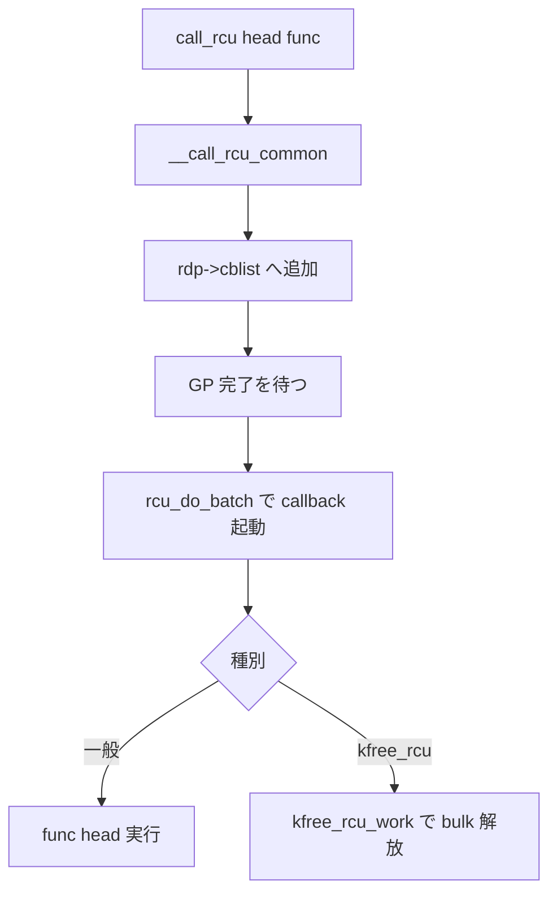

# 第15章 call_rcu と callback 処理

> **本章で読むソース**
>
> - [`include/linux/rcu_segcblist.h` L31-L52](https://github.com/gregkh/linux/blob/v6.18.38/include/linux/rcu_segcblist.h#L31-L52)
> - [`kernel/rcu/tree.c` L3001-L3042](https://github.com/gregkh/linux/blob/v6.18.38/kernel/rcu/tree.c#L3001-L3042)
> - [`kernel/rcu/rcu_segcblist.c` L329-L337](https://github.com/gregkh/linux/blob/v6.18.38/kernel/rcu/rcu_segcblist.c#L329-L337)
> - [`kernel/rcu/tree.c` L2528-L2604](https://github.com/gregkh/linux/blob/v6.18.38/kernel/rcu/tree.c#L2528-L2604)
> - [`kernel/rcu/tree.c` L3093-L3149](https://github.com/gregkh/linux/blob/v6.18.38/kernel/rcu/tree.c#L3093-L3149)
> - [`kernel/rcu/tree.c` L3241-L3244](https://github.com/gregkh/linux/blob/v6.18.38/kernel/rcu/tree.c#L3241-L3244)
> - [`kernel/rcu/tree.c` L3711-L3902](https://github.com/gregkh/linux/blob/v6.18.38/kernel/rcu/tree.c#L3711-L3902)
> - [`include/linux/rcupdate.h` L1087-L1088](https://github.com/gregkh/linux/blob/v6.18.38/include/linux/rcupdate.h#L1087-L1088)
> - [`include/linux/rcupdate.h` L1119-L1127](https://github.com/gregkh/linux/blob/v6.18.38/include/linux/rcupdate.h#L1119-L1127)
> - [`mm/slab_common.c` L1566-L1611](https://github.com/gregkh/linux/blob/v6.18.38/mm/slab_common.c#L1566-L1611)

## この章の狙い

`call_rcu` が callback を per-CPU キューへ載せる経路と、**kfree_rcu** による遅延解放の実装を読む。
grace period 完了後にどのコンテキストで callback が走るかを押さえる。

## 前提

- [Tree RCU と grace period](12-tree-rcu-gp.md) と [SRCU](13-srcu.md) を読んでいること。

## rcu_segcblist の4セグメント

per-CPU `cblist` は DONE、WAIT、NEXT_READY、NEXT の4区間に callback を分ける。
GP 完了に応じて `advance` と `accelerate` が区間を前へ送る。

[`include/linux/rcu_segcblist.h` L31-L52](https://github.com/gregkh/linux/blob/v6.18.38/include/linux/rcu_segcblist.h#L31-L52)

```c
/*
 * Index values for segments in rcu_segcblist structure.
 *
 * The segments are as follows:
 *
 * [head, *tails[RCU_DONE_TAIL]):
 *	Callbacks whose grace period has elapsed, and thus can be invoked.
 * [*tails[RCU_DONE_TAIL], *tails[RCU_WAIT_TAIL]):
 *	Callbacks waiting for the current GP from the current CPU's viewpoint.
 * [*tails[RCU_WAIT_TAIL], *tails[RCU_NEXT_READY_TAIL]):
 *	Callbacks that arrived before the next GP started, again from
 *	the current CPU's viewpoint.  These can be handled by the next GP.
 * [*tails[RCU_NEXT_READY_TAIL], *tails[RCU_NEXT_TAIL]):
 *	Callbacks that might have arrived after the next GP started.
 *	There is some uncertainty as to when a given GP starts and
 *	ends, but a CPU knows the exact times if it is the one starting
 *	or ending the GP.  Other CPUs know that the previous GP ends
 *	before the next one starts.
 *
 * Note that RCU_WAIT_TAIL cannot be empty unless RCU_NEXT_READY_TAIL is also
 * empty.
 *
```

## __call_rcu_common のエンキュー

`call_rcu` と `call_rcu_hurry` は共通実装 `__call_rcu_common` に集約される。
二重登録検出、割り込み保存、`rcu_data` への segcblist 追加がここで行われる。

[`kernel/rcu/tree.c` L3093-L3149](https://github.com/gregkh/linux/blob/v6.18.38/kernel/rcu/tree.c#L3093-L3149)

```c
static void
__call_rcu_common(struct rcu_head *head, rcu_callback_t func, bool lazy_in)
{
	static atomic_t doublefrees;
	unsigned long flags;
	bool lazy;
	struct rcu_data *rdp;

	/* Misaligned rcu_head! */
	WARN_ON_ONCE((unsigned long)head & (sizeof(void *) - 1));

	/* Avoid NULL dereference if callback is NULL. */
	if (WARN_ON_ONCE(!func))
		return;

	if (debug_rcu_head_queue(head)) {
		/*
		 * Probable double call_rcu(), so leak the callback.
		 * Use rcu:rcu_callback trace event to find the previous
		 * time callback was passed to call_rcu().
		 */
		if (atomic_inc_return(&doublefrees) < 4) {
			pr_err("%s(): Double-freed CB %p->%pS()!!!  ", __func__, head, head->func);
			mem_dump_obj(head);
		}
		WRITE_ONCE(head->func, rcu_leak_callback);
		return;
	}
	head->func = func;
	head->next = NULL;
	kasan_record_aux_stack(head);

	local_irq_save(flags);
	rdp = this_cpu_ptr(&rcu_data);
	RCU_LOCKDEP_WARN(!rcu_rdp_cpu_online(rdp), "Callback enqueued on offline CPU!");

	lazy = lazy_in && !rcu_async_should_hurry();

	/* Add the callback to our list. */
	if (unlikely(!rcu_segcblist_is_enabled(&rdp->cblist))) {
		// This can trigger due to call_rcu() from offline CPU:
		WARN_ON_ONCE(rcu_scheduler_active != RCU_SCHEDULER_INACTIVE);
		WARN_ON_ONCE(!rcu_is_watching());
		// Very early boot, before rcu_init().  Initialize if needed
		// and then drop through to queue the callback.
		if (rcu_segcblist_empty(&rdp->cblist))
			rcu_segcblist_init(&rdp->cblist);
	}

	check_cb_ovld(rdp);

	if (unlikely(rcu_rdp_is_offloaded(rdp)))
		call_rcu_nocb(rdp, head, func, flags, lazy);
	else
		call_rcu_core(rdp, head, func, flags);
	local_irq_restore(flags);
}
```

## call_rcu_core と rcu_segcblist_enqueue

`rcutree_enqueue` 経由で `rcu_segcblist_enqueue` が NEXT 区間へ積む。
callback 過多時は `call_rcu_core` が GP 開始または `rcu_force_quiescent_state` を促す。

[`kernel/rcu/rcu_segcblist.c` L329-L337](https://github.com/gregkh/linux/blob/v6.18.38/kernel/rcu/rcu_segcblist.c#L329-L337)

```c
void rcu_segcblist_enqueue(struct rcu_segcblist *rsclp,
			   struct rcu_head *rhp)
{
	rcu_segcblist_inc_len(rsclp);
	rcu_segcblist_inc_seglen(rsclp, RCU_NEXT_TAIL);
	rhp->next = NULL;
	WRITE_ONCE(*rsclp->tails[RCU_NEXT_TAIL], rhp);
	WRITE_ONCE(rsclp->tails[RCU_NEXT_TAIL], &rhp->next);
}
```

[`kernel/rcu/tree.c` L3001-L3042](https://github.com/gregkh/linux/blob/v6.18.38/kernel/rcu/tree.c#L3001-L3042)

```c
static void call_rcu_core(struct rcu_data *rdp, struct rcu_head *head,
			  rcu_callback_t func, unsigned long flags)
{
	rcutree_enqueue(rdp, head, func);
	/*
	 * If called from an extended quiescent state, invoke the RCU
	 * core in order to force a re-evaluation of RCU's idleness.
	 */
	if (!rcu_is_watching())
		invoke_rcu_core();

	/* If interrupts were disabled or CPU offline, don't invoke RCU core. */
	if (irqs_disabled_flags(flags) || cpu_is_offline(smp_processor_id()))
		return;

	/*
	 * Force the grace period if too many callbacks or too long waiting.
	 * Enforce hysteresis, and don't invoke rcu_force_quiescent_state()
	 * if some other CPU has recently done so.  Also, don't bother
	 * invoking rcu_force_quiescent_state() if the newly enqueued callback
	 * is the only one waiting for a grace period to complete.
	 */
	if (unlikely(rcu_segcblist_n_cbs(&rdp->cblist) >
		     rdp->qlen_last_fqs_check + qhimark)) {

		/* Are we ignoring a completed grace period? */
		note_gp_changes(rdp);

		/* Start a new grace period if one not already started. */
		if (!rcu_gp_in_progress()) {
			rcu_accelerate_cbs_unlocked(rdp->mynode, rdp);
		} else {
			/* Give the grace period a kick. */
			rdp->blimit = DEFAULT_MAX_RCU_BLIMIT;
			if (READ_ONCE(rcu_state.n_force_qs) == rdp->n_force_qs_snap &&
			    rcu_segcblist_first_pend_cb(&rdp->cblist) != head)
				rcu_force_quiescent_state();
			rdp->n_force_qs_snap = READ_ONCE(rcu_state.n_force_qs);
			rdp->qlen_last_fqs_check = rcu_segcblist_n_cbs(&rdp->cblist);
		}
	}
}
```

## rcu_do_batch

GP 完了後、DONE 区間の callback を `rcu_segcblist_extract_done_cbs` で取り出し、ループで `func` を呼ぶ。

[`kernel/rcu/tree.c` L2528-L2604](https://github.com/gregkh/linux/blob/v6.18.38/kernel/rcu/tree.c#L2528-L2604)

```c
static void rcu_do_batch(struct rcu_data *rdp)
{
	long bl;
	long count = 0;
	int div;
	bool __maybe_unused empty;
	unsigned long flags;
	unsigned long jlimit;
	bool jlimit_check = false;
	long pending;
	struct rcu_cblist rcl = RCU_CBLIST_INITIALIZER(rcl);
	struct rcu_head *rhp;
	long tlimit = 0;

	/* If no callbacks are ready, just return. */
	if (!rcu_segcblist_ready_cbs(&rdp->cblist)) {
		trace_rcu_batch_start(rcu_state.name,
				      rcu_segcblist_n_cbs(&rdp->cblist), 0);
		trace_rcu_batch_end(rcu_state.name, 0,
				    !rcu_segcblist_empty(&rdp->cblist),
				    need_resched(), is_idle_task(current),
				    rcu_is_callbacks_kthread(rdp));
		return;
	}

	/*
	 * Extract the list of ready callbacks, disabling IRQs to prevent
	 * races with call_rcu() from interrupt handlers.  Leave the
	 * callback counts, as rcu_barrier() needs to be conservative.
	 *
	 * Callbacks execution is fully ordered against preceding grace period
	 * completion (materialized by rnp->gp_seq update) thanks to the
	 * smp_mb__after_unlock_lock() upon node locking required for callbacks
	 * advancing. In NOCB mode this ordering is then further relayed through
	 * the nocb locking that protects both callbacks advancing and extraction.
	 */
	rcu_nocb_lock_irqsave(rdp, flags);
	WARN_ON_ONCE(cpu_is_offline(smp_processor_id()));
	pending = rcu_segcblist_get_seglen(&rdp->cblist, RCU_DONE_TAIL);
	div = READ_ONCE(rcu_divisor);
	div = div < 0 ? 7 : div > sizeof(long) * 8 - 2 ? sizeof(long) * 8 - 2 : div;
	bl = max(rdp->blimit, pending >> div);
	if ((in_serving_softirq() || rdp->rcu_cpu_kthread_status == RCU_KTHREAD_RUNNING) &&
	    (IS_ENABLED(CONFIG_RCU_DOUBLE_CHECK_CB_TIME) || unlikely(bl > 100))) {
		const long npj = NSEC_PER_SEC / HZ;
		long rrn = READ_ONCE(rcu_resched_ns);

		rrn = rrn < NSEC_PER_MSEC ? NSEC_PER_MSEC : rrn > NSEC_PER_SEC ? NSEC_PER_SEC : rrn;
		tlimit = local_clock() + rrn;
		jlimit = jiffies + (rrn + npj + 1) / npj;
		jlimit_check = true;
	}
	trace_rcu_batch_start(rcu_state.name,
			      rcu_segcblist_n_cbs(&rdp->cblist), bl);
	rcu_segcblist_extract_done_cbs(&rdp->cblist, &rcl);
	if (rcu_rdp_is_offloaded(rdp))
		rdp->qlen_last_fqs_check = rcu_segcblist_n_cbs(&rdp->cblist);

	trace_rcu_segcb_stats(&rdp->cblist, TPS("SegCbDequeued"));
	rcu_nocb_unlock_irqrestore(rdp, flags);

	/* Invoke callbacks. */
	tick_dep_set_task(current, TICK_DEP_BIT_RCU);
	rhp = rcu_cblist_dequeue(&rcl);

	for (; rhp; rhp = rcu_cblist_dequeue(&rcl)) {
		rcu_callback_t f;

		count++;
		debug_rcu_head_unqueue(rhp);

		rcu_lock_acquire(&rcu_callback_map);
		trace_rcu_invoke_callback(rcu_state.name, rhp);

		f = rhp->func;
		debug_rcu_head_callback(rhp);
		WRITE_ONCE(rhp->func, (rcu_callback_t)0L);
```

`lazy` フラグにより callback はしばらくメインリストから隔離され、GP 開始が遅れる（第16章の RCU_LAZY と関連）。

## call_rcu のエクスポート

通常の `call_rcu` は lazy 挙動を有効にして共通実装へ渡す。

[`kernel/rcu/tree.c` L3241-L3244](https://github.com/gregkh/linux/blob/v6.18.38/kernel/rcu/tree.c#L3241-L3244)

```c
void call_rcu(struct rcu_head *head, rcu_callback_t func)
{
	__call_rcu_common(head, func, enable_rcu_lazy);
}
```

**最適化の工夫**：per-CPU `rcu_data` へロックレスに近い形で積むため、更新側のホットパスは単一 CPU のリスト操作に閉じる。
GP 管理は別スレッドとソフトIRQが担い、callback 実行はバッチ化される。

## call_rcu_hurry

レイテンシ敏感な経路では lazy を無効にした `call_rcu_hurry` が使われる。

[`kernel/rcu/tree.c` L3175-L3178](https://github.com/gregkh/linux/blob/v6.18.38/kernel/rcu/tree.c#L3175-L3178)

```c
void call_rcu_hurry(struct rcu_head *head, rcu_callback_t func)
{
	__call_rcu_common(head, func, false);
}
```

## kfree_rcu マクロ

構造体内の `rcu_head` オフセットを使って `kvfree_call_rcu` を呼ぶマクロである。

[`include/linux/rcupdate.h` L1087-L1088](https://github.com/gregkh/linux/blob/v6.18.38/include/linux/rcupdate.h#L1087-L1088)

```c
#define kfree_rcu(ptr, rhf) kvfree_rcu_arg_2(ptr, rhf)
#define kvfree_rcu(ptr, rhf) kvfree_rcu_arg_2(ptr, rhf)
```

展開本体はオフセット検査付きである。

[`include/linux/rcupdate.h` L1119-L1127](https://github.com/gregkh/linux/blob/v6.18.38/include/linux/rcupdate.h#L1119-L1127)

```c
#define kvfree_rcu_arg_2(ptr, rhf)					\
do {									\
	typeof (ptr) ___p = (ptr);					\
									\
	if (___p) {							\
		BUILD_BUG_ON(offsetof(typeof(*(ptr)), rhf) >= 4096);	\
		kvfree_call_rcu(&((___p)->rhf), (void *) (___p));	\
	}								\
} while (0)
```

`call_rcu(kfree)` を毎回書かずに、専用の bulk 解放経路へ載せられる。

## kfree_rcu_work のバッチ解放

`mm/slab_common.c` の workqueue ハンドラが、GP 後に bulk リストと channel 3 リストを処理する。

[`mm/slab_common.c` L1566-L1611](https://github.com/gregkh/linux/blob/v6.18.38/mm/slab_common.c#L1566-L1611)

```c
/*
 * This function is invoked in workqueue context after a grace period.
 * It frees all the objects queued on ->bulk_head_free or ->head_free.
 */
static void kfree_rcu_work(struct work_struct *work)
{
	unsigned long flags;
	struct kvfree_rcu_bulk_data *bnode, *n;
	struct list_head bulk_head[FREE_N_CHANNELS];
	struct rcu_head *head;
	struct kfree_rcu_cpu *krcp;
	struct kfree_rcu_cpu_work *krwp;
	struct rcu_gp_oldstate head_gp_snap;
	int i;

	krwp = container_of(to_rcu_work(work),
		struct kfree_rcu_cpu_work, rcu_work);
	krcp = krwp->krcp;

	raw_spin_lock_irqsave(&krcp->lock, flags);
	// Channels 1 and 2.
	for (i = 0; i < FREE_N_CHANNELS; i++)
		list_replace_init(&krwp->bulk_head_free[i], &bulk_head[i]);

	// Channel 3.
	head = krwp->head_free;
	krwp->head_free = NULL;
	head_gp_snap = krwp->head_free_gp_snap;
	raw_spin_unlock_irqrestore(&krcp->lock, flags);

	// Handle the first two channels.
	for (i = 0; i < FREE_N_CHANNELS; i++) {
		// Start from the tail page, so a GP is likely passed for it.
		list_for_each_entry_safe(bnode, n, &bulk_head[i], list)
			kvfree_rcu_bulk(krcp, bnode, i);
	}

	/*
	 * This is used when the "bulk" path can not be used for the
	 * double-argument of kvfree_rcu().  This happens when the
	 * page-cache is empty, which means that objects are instead
	 * queued on a linked list through their rcu_head structures.
	 * This list is named "Channel 3".
	 */
	if (head && !WARN_ON_ONCE(!poll_state_synchronize_rcu_full(&head_gp_snap)))
		kvfree_rcu_list(head);
}
```

複数オブジェクトをページ単位でまとめて解放し、SLAB への戻しコストを均す。

## rcu_barrier

モジュール unload 等では、飛行中の `call_rcu` callback がすべて完了するまで待つ `rcu_barrier` を使う。
各 CPU の `cblist` に barrier callback を entrain し、最後の callback が `completion` を起こす。

[`kernel/rcu/tree.c` L3730-L3741](https://github.com/gregkh/linux/blob/v6.18.38/kernel/rcu/tree.c#L3730-L3741)

```c
static void rcu_barrier_callback(struct rcu_head *rhp)
{
	unsigned long __maybe_unused s = rcu_state.barrier_sequence;

	rhp->next = rhp; // Mark the callback as having been invoked.
	if (atomic_dec_and_test(&rcu_state.barrier_cpu_count)) {
		rcu_barrier_trace(TPS("LastCB"), -1, s);
		complete(&rcu_state.barrier_completion);
	} else {
		rcu_barrier_trace(TPS("CB"), -1, s);
	}
}
```

[`kernel/rcu/tree.c` L3809-L3902](https://github.com/gregkh/linux/blob/v6.18.38/kernel/rcu/tree.c#L3809-L3902)

```c
void rcu_barrier(void)
{
	uintptr_t cpu;
	unsigned long flags;
	unsigned long gseq;
	struct rcu_data *rdp;
	unsigned long s = rcu_seq_snap(&rcu_state.barrier_sequence);

	rcu_barrier_trace(TPS("Begin"), -1, s);

	/* Take mutex to serialize concurrent rcu_barrier() requests. */
	mutex_lock(&rcu_state.barrier_mutex);

	/* Did someone else do our work for us? */
	if (rcu_seq_done(&rcu_state.barrier_sequence, s)) {
		rcu_barrier_trace(TPS("EarlyExit"), -1, rcu_state.barrier_sequence);
		smp_mb(); /* caller's subsequent code after above check. */
		mutex_unlock(&rcu_state.barrier_mutex);
		return;
	}

	/* Mark the start of the barrier operation. */
	raw_spin_lock_irqsave(&rcu_state.barrier_lock, flags);
	rcu_seq_start(&rcu_state.barrier_sequence);
	gseq = rcu_state.barrier_sequence;
	rcu_barrier_trace(TPS("Inc1"), -1, rcu_state.barrier_sequence);

	/*
	 * Initialize the count to two rather than to zero in order
	 * to avoid a too-soon return to zero in case of an immediate
	 * invocation of the just-enqueued callback (or preemption of
	 * this task).  Exclude CPU-hotplug operations to ensure that no
	 * offline non-offloaded CPU has callbacks queued.
	 */
	init_completion(&rcu_state.barrier_completion);
	atomic_set(&rcu_state.barrier_cpu_count, 2);
	raw_spin_unlock_irqrestore(&rcu_state.barrier_lock, flags);

	/*
	 * Force each CPU with callbacks to register a new callback.
	 * When that callback is invoked, we will know that all of the
	 * corresponding CPU's preceding callbacks have been invoked.
	 */
	for_each_possible_cpu(cpu) {
		rdp = per_cpu_ptr(&rcu_data, cpu);
retry:
		if (smp_load_acquire(&rdp->barrier_seq_snap) == gseq)
			continue;
		raw_spin_lock_irqsave(&rcu_state.barrier_lock, flags);
		if (!rcu_segcblist_n_cbs(&rdp->cblist)) {
			WRITE_ONCE(rdp->barrier_seq_snap, gseq);
			raw_spin_unlock_irqrestore(&rcu_state.barrier_lock, flags);
			rcu_barrier_trace(TPS("NQ"), cpu, rcu_state.barrier_sequence);
			continue;
		}
		if (!rcu_rdp_cpu_online(rdp)) {
			rcu_barrier_entrain(rdp);
			WARN_ON_ONCE(READ_ONCE(rdp->barrier_seq_snap) != gseq);
			raw_spin_unlock_irqrestore(&rcu_state.barrier_lock, flags);
			rcu_barrier_trace(TPS("OfflineNoCBQ"), cpu, rcu_state.barrier_sequence);
			continue;
		}
		raw_spin_unlock_irqrestore(&rcu_state.barrier_lock, flags);
		if (smp_call_function_single(cpu, rcu_barrier_handler, (void *)cpu, 1)) {
			schedule_timeout_uninterruptible(1);
			goto retry;
		}
		WARN_ON_ONCE(READ_ONCE(rdp->barrier_seq_snap) != gseq);
		rcu_barrier_trace(TPS("OnlineQ"), cpu, rcu_state.barrier_sequence);
	}

	/*
	 * Now that we have an rcu_barrier_callback() callback on each
	 * CPU, and thus each counted, remove the initial count.
	 */
	if (atomic_sub_and_test(2, &rcu_state.barrier_cpu_count))
		complete(&rcu_state.barrier_completion);

	/* Wait for all rcu_barrier_callback() callbacks to be invoked. */
	wait_for_completion(&rcu_state.barrier_completion);

	/* Mark the end of the barrier operation. */
	rcu_barrier_trace(TPS("Inc2"), -1, rcu_state.barrier_sequence);
	rcu_seq_end(&rcu_state.barrier_sequence);
	gseq = rcu_state.barrier_sequence;
	for_each_possible_cpu(cpu) {
		rdp = per_cpu_ptr(&rcu_data, cpu);

		WRITE_ONCE(rdp->barrier_seq_snap, gseq);
	}

	/* Other rcu_barrier() invocations can now safely proceed. */
	mutex_unlock(&rcu_state.barrier_mutex);
}
```

## 処理の流れ：call_rcu から解放まで



callback はソフトIRQ または rcu カーネルスレッド文脈で実行される。
ブロックや長時間処理は他の callback の遅延につながる。

## まとめ

- `call_rcu_core` と `rcu_segcblist_enqueue` が per-CPU キューイングと GP 促進を担う。
- `rcu_do_batch` が DONE 区間の callback をバッチ実行する。
- `rcu_barrier` は各 CPU へ barrier callback を載せ、飛行中 callback の完了を待つ。

## 関連する章

- [Tree RCU と grace period](12-tree-rcu-gp.md)
- [Tasks RCU](14-tasks-rcu.md)
- [expedited と nocb などの発展](16-expedited-nocb.md)
- [SRCU](13-srcu.md)
