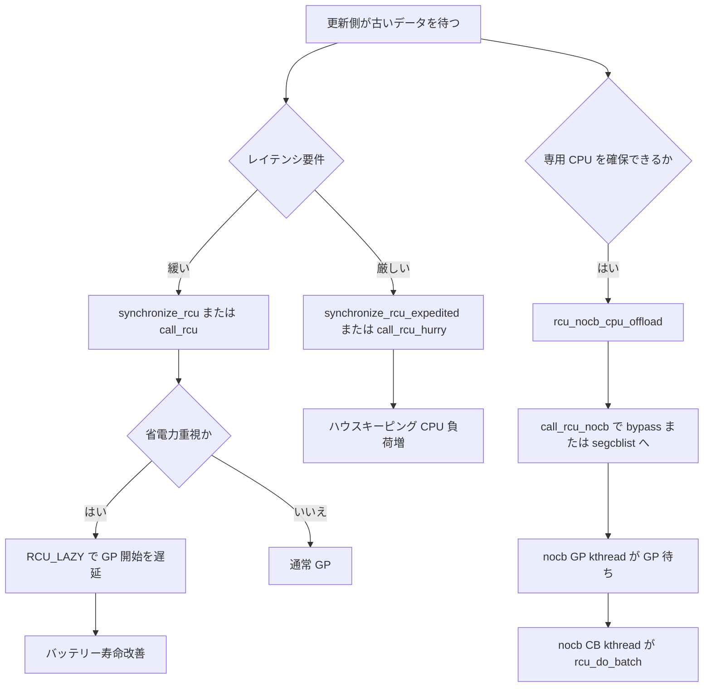

# 第16章 expedited と nocb などの発展

> **本章で読むソース**
>
> - [`kernel/rcu/tree_exp.h` L915-L953](https://github.com/gregkh/linux/blob/v6.18.38/kernel/rcu/tree_exp.h#L915-L953)
> - [`kernel/rcu/tree_exp.h` L949-L999](https://github.com/gregkh/linux/blob/v6.18.38/kernel/rcu/tree_exp.h#L949-L999)
> - [`kernel/rcu/tree.c` L3144-L3147](https://github.com/gregkh/linux/blob/v6.18.38/kernel/rcu/tree.c#L3144-L3147)
> - [`kernel/rcu/tree.c` L3235-L3244](https://github.com/gregkh/linux/blob/v6.18.38/kernel/rcu/tree.c#L3235-L3244)
> - [`kernel/rcu/tree_nocb.h` L352-L360](https://github.com/gregkh/linux/blob/v6.18.38/kernel/rcu/tree_nocb.h#L352-L360)
> - [`kernel/rcu/tree_nocb.h` L526-L593](https://github.com/gregkh/linux/blob/v6.18.38/kernel/rcu/tree_nocb.h#L526-L593)
> - [`kernel/rcu/tree_nocb.h` L595-L605](https://github.com/gregkh/linux/blob/v6.18.38/kernel/rcu/tree_nocb.h#L595-L605)
> - [`kernel/rcu/tree_nocb.h` L648-L707](https://github.com/gregkh/linux/blob/v6.18.38/kernel/rcu/tree_nocb.h#L648-L707)
> - [`kernel/rcu/tree_nocb.h` L856-L865](https://github.com/gregkh/linux/blob/v6.18.38/kernel/rcu/tree_nocb.h#L856-L865)
> - [`kernel/rcu/tree_nocb.h` L877-L937](https://github.com/gregkh/linux/blob/v6.18.38/kernel/rcu/tree_nocb.h#L877-L937)
> - [`kernel/rcu/tree_nocb.h` L944-L954](https://github.com/gregkh/linux/blob/v6.18.38/kernel/rcu/tree_nocb.h#L944-L954)
> - [`kernel/rcu/tree_nocb.h` L1178-L1200](https://github.com/gregkh/linux/blob/v6.18.38/kernel/rcu/tree_nocb.h#L1178-L1200)
> - [`kernel/rcu/Kconfig` L266-L267](https://github.com/gregkh/linux/blob/v6.18.38/kernel/rcu/Kconfig#L266-L267)

## この章の狙い

レイテンシ敏感な経路向けの **expedited grace period** と、callback 処理をオフロードする **nocb**（NO CALLBACK CPU）を読む。
`call_rcu_hurry` と `RCU_LAZY` の対極にあるチューニング軸を押さえる。

## 前提

- [Tree RCU と grace period](12-tree-rcu-gp.md) と [call_rcu と callback 処理](15-call-rcu-callback.md) を読んでいること。

## synchronize_rcu_expedited

expedited GP は通常 GP より積極的に静止を促す。
`rcu_gp_is_normal` が真なら通常経路へフォールバックする。

[`kernel/rcu/tree_exp.h` L915-L953](https://github.com/gregkh/linux/blob/v6.18.38/kernel/rcu/tree_exp.h#L915-L953)

```c
 * your code to batch your updates, and then use a single synchronize_rcu()
 * instead.
 *
 * This has the same semantics as (but is more brutal than) synchronize_rcu().
 */
void synchronize_rcu_expedited(void)
{
	unsigned long flags;
	struct rcu_exp_work rew;
	struct rcu_node *rnp;
	unsigned long s;

	RCU_LOCKDEP_WARN(lock_is_held(&rcu_bh_lock_map) ||
			 lock_is_held(&rcu_lock_map) ||
			 lock_is_held(&rcu_sched_lock_map),
			 "Illegal synchronize_rcu_expedited() in RCU read-side critical section");

	/* Is the state is such that the call is a grace period? */
	if (rcu_blocking_is_gp()) {
		// Note well that this code runs with !PREEMPT && !SMP.
		// In addition, all code that advances grace periods runs
		// at process level.  Therefore, this expedited GP overlaps
		// with other expedited GPs only by being fully nested within
		// them, which allows reuse of ->gp_seq_polled_exp_snap.
		rcu_poll_gp_seq_start_unlocked(&rcu_state.gp_seq_polled_exp_snap);
		rcu_poll_gp_seq_end_unlocked(&rcu_state.gp_seq_polled_exp_snap);

		local_irq_save(flags);
		WARN_ON_ONCE(num_online_cpus() > 1);
		rcu_state.expedited_sequence += (1 << RCU_SEQ_CTR_SHIFT);
		local_irq_restore(flags);
		return;  // Context allows vacuous grace periods.
	}

	/* If expedited grace periods are prohibited, fall back to normal. */
	if (rcu_gp_is_normal()) {
		synchronize_rcu_normal();
		return;
	}
```

**最適化の工夫**：expedited は IPI と workqueue を多用して GP 待ちを短縮する。
常時有効にすると CPU 全体のエネルギー効率が落ちるため、カーネルパラメータと `rcu_gp_is_expedited` で切り替える。

[`kernel/rcu/tree_exp.h` L949-L953](https://github.com/gregkh/linux/blob/v6.18.38/kernel/rcu/tree_exp.h#L949-L953)

```c
	/* If expedited grace periods are prohibited, fall back to normal. */
	if (rcu_gp_is_normal()) {
		synchronize_rcu_normal();
		return;
	}
```

expedited 経路はスナップショット取得後、workqueue または直接待機へ分岐する。

[`kernel/rcu/tree_exp.h` L955-L968](https://github.com/gregkh/linux/blob/v6.18.38/kernel/rcu/tree_exp.h#L955-L968)

```c
	/* Take a snapshot of the sequence number.  */
	s = rcu_exp_gp_seq_snap();
	if (exp_funnel_lock(s))
		return;  /* Someone else did our work for us. */

	/* Ensure that load happens before action based on it. */
	if (unlikely((rcu_scheduler_active == RCU_SCHEDULER_INIT) || !rcu_exp_worker_started())) {
		/* Direct call during scheduler init and early_initcalls(). */
		rcu_exp_sel_wait_wake(s);
	} else {
		/* Marshall arguments & schedule the expedited grace period. */
		rew.rew_s = s;
		synchronize_rcu_expedited_queue_work(&rew);
	}
```

## call_rcu と call_rcu_hurry

`call_rcu` は lazy キューイングを許し、GP 開始を遅らせることがある。
低レイテンシが要る更新側は `call_rcu_hurry` を使う。

[`kernel/rcu/tree.c` L3235-L3244](https://github.com/gregkh/linux/blob/v6.18.38/kernel/rcu/tree.c#L3235-L3244)

```c
 * in kernels built with CONFIG_RCU_LAZY=y, call_rcu() might delay for many
 * seconds before starting the grace period needed by the corresponding
 * callback.  This delay can significantly improve energy-efficiency
 * on low-utilization battery-powered devices.  To avoid this delay,
 * in latency-sensitive kernel code, use call_rcu_hurry().
 */
void call_rcu(struct rcu_head *head, rcu_callback_t func)
{
	__call_rcu_common(head, func, enable_rcu_lazy);
}
```

バッテリー駆動では lazy 遅延が望ましい一方、レイテンシに敏感な削除パス（例：ネットワークスタックの teardown）では `call_rcu_hurry` が選ばれることがある。

## nocb CPU へのオフロード

`rcu_nocb_cpu_offload` は指定 CPU の callback 処理を nocb ワーカーへ逃がす。
オンライン CPU への適用は拒否される。

[`kernel/rcu/tree_nocb.h` L1178-L1200](https://github.com/gregkh/linux/blob/v6.18.38/kernel/rcu/tree_nocb.h#L1178-L1200)

```c
int rcu_nocb_cpu_offload(int cpu)
{
	struct rcu_data *rdp = per_cpu_ptr(&rcu_data, cpu);
	int ret = 0;

	cpus_read_lock();
	mutex_lock(&rcu_state.nocb_mutex);
	if (!rcu_rdp_is_offloaded(rdp)) {
		if (!cpu_online(cpu)) {
			ret = rcu_nocb_rdp_offload(rdp);
			if (!ret)
				cpumask_set_cpu(cpu, rcu_nocb_mask);
		} else {
			pr_info("NOCB: Cannot CB-offload online CPU %d\n", rdp->cpu);
			ret = -EINVAL;
		}
	}
	mutex_unlock(&rcu_state.nocb_mutex);
	cpus_read_unlock();

	return ret;
}
```

Kconfig では `rcu_nocbs` ブートパラメータで対象 CPU を指定できる。

[`kernel/rcu/Kconfig` L266-L267](https://github.com/gregkh/linux/blob/v6.18.38/kernel/rcu/Kconfig#L266-L267)

```text
	  CPUs specified at boot time by the rcu_nocbs parameter.
```

`nohz_full` と組み合わせ、ハウスキーピングを専用 CPU に集約する構成が取れる。

## call_rcu から nocb への分岐

`__call_rcu_common` は offload 済み CPU では `call_rcu_core` の代わりに `call_rcu_nocb` へ入る。

[`kernel/rcu/tree.c` L3144-L3147](https://github.com/gregkh/linux/blob/v6.18.38/kernel/rcu/tree.c#L3144-L3147)

```c
	if (unlikely(rcu_rdp_is_offloaded(rdp)))
		call_rcu_nocb(rdp, head, func, flags, lazy);
	else
		call_rcu_core(rdp, head, func, flags);
```

nocb 側はまず bypass キューを試し、失敗時だけ `rcutree_enqueue` で segcblist へ載せる。

[`kernel/rcu/tree_nocb.h` L595-L605](https://github.com/gregkh/linux/blob/v6.18.38/kernel/rcu/tree_nocb.h#L595-L605)

```c
static void call_rcu_nocb(struct rcu_data *rdp, struct rcu_head *head,
			  rcu_callback_t func, unsigned long flags, bool lazy)
{
	bool was_alldone;

	if (!rcu_nocb_try_bypass(rdp, head, &was_alldone, flags, lazy)) {
		/* Not enqueued on bypass but locked, do regular enqueue */
		rcutree_enqueue(rdp, head, func);
		__call_rcu_nocb_wake(rdp, was_alldone, flags); /* unlocks */
	}
}
```

bypass から segcblist へ移すのは `rcu_nocb_flush_bypass` である。

[`kernel/rcu/tree_nocb.h` L352-L360](https://github.com/gregkh/linux/blob/v6.18.38/kernel/rcu/tree_nocb.h#L352-L360)

```c
static bool rcu_nocb_flush_bypass(struct rcu_data *rdp, struct rcu_head *rhp,
				  unsigned long j, bool lazy)
{
	if (!rcu_rdp_is_offloaded(rdp))
		return true;
	rcu_lockdep_assert_cblist_protected(rdp);
	rcu_nocb_bypass_lock(rdp);
	return rcu_nocb_do_flush_bypass(rdp, rhp, j, lazy);
}
```

## nocb GP kthread と CB kthread

callback 登録後、`__call_rcu_nocb_wake` が nocb GP kthread を起床する。
キューが空だった場合、lazy 専用 bypass、または overload 時はそれぞれ別分岐で GP 側へ通知する。

[`kernel/rcu/tree_nocb.h` L526-L593](https://github.com/gregkh/linux/blob/v6.18.38/kernel/rcu/tree_nocb.h#L526-L593)

```c
static void __call_rcu_nocb_wake(struct rcu_data *rdp, bool was_alldone,
				 unsigned long flags)
				 __releases(rdp->nocb_lock)
{
	long bypass_len;
	unsigned long cur_gp_seq;
	unsigned long j;
	long lazy_len;
	long len;
	struct task_struct *t;
	struct rcu_data *rdp_gp = rdp->nocb_gp_rdp;

	// If we are being polled or there is no kthread, just leave.
	t = READ_ONCE(rdp->nocb_gp_kthread);
	if (rcu_nocb_poll || !t) {
		rcu_nocb_unlock(rdp);
		trace_rcu_nocb_wake(rcu_state.name, rdp->cpu,
				    TPS("WakeNotPoll"));
		return;
	}
	// Need to actually to a wakeup.
	len = rcu_segcblist_n_cbs(&rdp->cblist);
	bypass_len = rcu_cblist_n_cbs(&rdp->nocb_bypass);
	lazy_len = READ_ONCE(rdp->lazy_len);
	if (was_alldone) {
		rdp->qlen_last_fqs_check = len;
		// Only lazy CBs in bypass list
		if (lazy_len && bypass_len == lazy_len) {
			rcu_nocb_unlock(rdp);
			wake_nocb_gp_defer(rdp, RCU_NOCB_WAKE_LAZY,
					   TPS("WakeLazy"));
		} else if (!irqs_disabled_flags(flags)) {
			/* ... if queue was empty ... */
			rcu_nocb_unlock(rdp);
			wake_nocb_gp(rdp, false);
			trace_rcu_nocb_wake(rcu_state.name, rdp->cpu,
					    TPS("WakeEmpty"));
		} else {
			rcu_nocb_unlock(rdp);
			wake_nocb_gp_defer(rdp, RCU_NOCB_WAKE,
					   TPS("WakeEmptyIsDeferred"));
		}
	} else if (len > rdp->qlen_last_fqs_check + qhimark) {
		/* ... or if many callbacks queued. */
		rdp->qlen_last_fqs_check = len;
		j = jiffies;
		if (j != rdp->nocb_gp_adv_time &&
		    rcu_segcblist_nextgp(&rdp->cblist, &cur_gp_seq) &&
		    rcu_seq_done(&rdp->mynode->gp_seq, cur_gp_seq)) {
			rcu_advance_cbs_nowake(rdp->mynode, rdp);
			rdp->nocb_gp_adv_time = j;
		}
		smp_mb(); /* Enqueue before timer_pending(). */
		if ((rdp->nocb_cb_sleep ||
		     !rcu_segcblist_ready_cbs(&rdp->cblist)) &&
		    !timer_pending(&rdp_gp->nocb_timer)) {
			rcu_nocb_unlock(rdp);
			wake_nocb_gp_defer(rdp, RCU_NOCB_WAKE_FORCE,
					   TPS("WakeOvfIsDeferred"));
		} else {
			rcu_nocb_unlock(rdp);
			trace_rcu_nocb_wake(rcu_state.name, rdp->cpu, TPS("WakeNot"));
		}
	} else {
		rcu_nocb_unlock(rdp);
		trace_rcu_nocb_wake(rcu_state.name, rdp->cpu, TPS("WakeNot"));
	}
}
```

GP kthread は担当 CPU 群の callback を走査し、grace period 完了後に CB kthread を起床する。

[`kernel/rcu/tree_nocb.h` L648-L707](https://github.com/gregkh/linux/blob/v6.18.38/kernel/rcu/tree_nocb.h#L648-L707)

```c
static void nocb_gp_wait(struct rcu_data *my_rdp)
{
	bool bypass = false;
	int __maybe_unused cpu = my_rdp->cpu;
	unsigned long cur_gp_seq;
	unsigned long flags;
	bool gotcbs = false;
	unsigned long j = jiffies;
	bool lazy = false;
	bool needwait_gp = false; // This prevents actual uninitialized use.
	bool needwake;
	bool needwake_gp;
	struct rcu_data *rdp, *rdp_toggling = NULL;
	struct rcu_node *rnp;
	unsigned long wait_gp_seq = 0; // Suppress "use uninitialized" warning.
	bool wasempty = false;

	/*
	 * Each pass through the following loop checks for CBs and for the
	 * nearest grace period (if any) to wait for next.  The CB kthreads
	 * and the global grace-period kthread are awakened if needed.
	 */
	WARN_ON_ONCE(my_rdp->nocb_gp_rdp != my_rdp);
	/*
	 * An rcu_data structure is removed from the list after its
	 * CPU is de-offloaded and added to the list before that CPU is
	 * (re-)offloaded.  If the following loop happens to be referencing
	 * that rcu_data structure during the time that the corresponding
	 * CPU is de-offloaded and then immediately re-offloaded, this
	 * loop's rdp pointer will be carried to the end of the list by
	 * the resulting pair of list operations.  This can cause the loop
	 * to skip over some of the rcu_data structures that were supposed
	 * to have been scanned.  Fortunately a new iteration through the
	 * entire loop is forced after a given CPU's rcu_data structure
	 * is added to the list, so the skipped-over rcu_data structures
	 * won't be ignored for long.
	 */
	list_for_each_entry(rdp, &my_rdp->nocb_head_rdp, nocb_entry_rdp) {
		long bypass_ncbs;
		bool flush_bypass = false;
		long lazy_ncbs;

		trace_rcu_nocb_wake(rcu_state.name, rdp->cpu, TPS("Check"));
		rcu_nocb_lock_irqsave(rdp, flags);
		lockdep_assert_held(&rdp->nocb_lock);
		bypass_ncbs = rcu_cblist_n_cbs(&rdp->nocb_bypass);
		lazy_ncbs = READ_ONCE(rdp->lazy_len);

		if (bypass_ncbs && (lazy_ncbs == bypass_ncbs) &&
		    (time_after(j, READ_ONCE(rdp->nocb_bypass_first) + rcu_get_jiffies_lazy_flush()) ||
		     bypass_ncbs > 2 * qhimark)) {
			flush_bypass = true;
		} else if (bypass_ncbs && (lazy_ncbs != bypass_ncbs) &&
		    (time_after(j, READ_ONCE(rdp->nocb_bypass_first) + 1) ||
		     bypass_ncbs > 2 * qhimark)) {
			flush_bypass = true;
		} else if (!bypass_ncbs && rcu_segcblist_empty(&rdp->cblist)) {
			rcu_nocb_unlock_irqrestore(rdp, flags);
			continue; /* No callbacks here, try next. */
		}
```

[`kernel/rcu/tree_nocb.h` L856-L865](https://github.com/gregkh/linux/blob/v6.18.38/kernel/rcu/tree_nocb.h#L856-L865)

```c
static int rcu_nocb_gp_kthread(void *arg)
{
	struct rcu_data *rdp = arg;

	for (;;) {
		WRITE_ONCE(rdp->nocb_gp_loops, rdp->nocb_gp_loops + 1);
		nocb_gp_wait(rdp);
		cond_resched_tasks_rcu_qs();
	}
	return 0;
}
```

CB kthread は `nocb_cb_wait` で ready callback を `rcu_do_batch` 実行する。

[`kernel/rcu/tree_nocb.h` L877-L937](https://github.com/gregkh/linux/blob/v6.18.38/kernel/rcu/tree_nocb.h#L877-L937)

```c
static void nocb_cb_wait(struct rcu_data *rdp)
{
	struct rcu_segcblist *cblist = &rdp->cblist;
	unsigned long cur_gp_seq;
	unsigned long flags;
	bool needwake_gp = false;
	struct rcu_node *rnp = rdp->mynode;

	swait_event_interruptible_exclusive(rdp->nocb_cb_wq,
					    nocb_cb_wait_cond(rdp));
	if (kthread_should_park()) {
		/*
		 * kthread_park() must be preceded by an rcu_barrier().
		 * But yet another rcu_barrier() might have sneaked in between
		 * the barrier callback execution and the callbacks counter
		 * decrement.
		 */
		if (rdp->nocb_cb_sleep) {
			rcu_nocb_lock_irqsave(rdp, flags);
			WARN_ON_ONCE(rcu_segcblist_n_cbs(&rdp->cblist));
			rcu_nocb_unlock_irqrestore(rdp, flags);
			kthread_parkme();
		}
	} else if (READ_ONCE(rdp->nocb_cb_sleep)) {
		WARN_ON(signal_pending(current));
		trace_rcu_nocb_wake(rcu_state.name, rdp->cpu, TPS("WokeEmpty"));
	}

	WARN_ON_ONCE(!rcu_rdp_is_offloaded(rdp));

	local_irq_save(flags);
	rcu_momentary_eqs();
	local_irq_restore(flags);
	/*
	 * Disable BH to provide the expected environment.  Also, when
	 * transitioning to/from NOCB mode, a self-requeuing callback might
	 * be invoked from softirq.  A short grace period could cause both
	 * instances of this callback would execute concurrently.
	 */
	local_bh_disable();
	rcu_do_batch(rdp);
	local_bh_enable();
	lockdep_assert_irqs_enabled();
	rcu_nocb_lock_irqsave(rdp, flags);
	if (rcu_segcblist_nextgp(cblist, &cur_gp_seq) &&
	    rcu_seq_done(&rnp->gp_seq, cur_gp_seq) &&
	    raw_spin_trylock_rcu_node(rnp)) { /* irqs already disabled. */
		needwake_gp = rcu_advance_cbs(rdp->mynode, rdp);
		raw_spin_unlock_rcu_node(rnp); /* irqs remain disabled. */
	}

	if (!rcu_segcblist_ready_cbs(cblist)) {
		WRITE_ONCE(rdp->nocb_cb_sleep, true);
		trace_rcu_nocb_wake(rcu_state.name, rdp->cpu, TPS("CBSleep"));
	} else {
		WRITE_ONCE(rdp->nocb_cb_sleep, false);
	}

	rcu_nocb_unlock_irqrestore(rdp, flags);
	if (needwake_gp)
		rcu_gp_kthread_wake();
}
```

[`kernel/rcu/tree_nocb.h` L944-L954](https://github.com/gregkh/linux/blob/v6.18.38/kernel/rcu/tree_nocb.h#L944-L954)

```c
static int rcu_nocb_cb_kthread(void *arg)
{
	struct rcu_data *rdp = arg;

	// Each pass through this loop does one callback batch, and,
	// if there are no more ready callbacks, waits for them.
	for (;;) {
		nocb_cb_wait(rdp);
		cond_resched_tasks_rcu_qs();
	}
	return 0;
}
```

**最適化の工夫**：nocb は呼出元 CPU 上で `call_rcu_nocb` が bypass または segcblist へ登録し、grace period 進行と callback 実行を nocb GP/CB kthread へ移す。
GP 完了待ちと callback 実行を別 kthread に分けることで、計算専用コアのジッタを抑える。

## 処理の流れ：チューニング軸の選択



## 運用上の注意

expedited は静止確認のため IPI や workqueue を他 CPU へ送る。
nocb は登録は呼出元 CPU に留まり、GP 待ちと `rcu_do_batch` 実行を offload 先 kthread の CPU へ移す。
対象 CPU は boot 時の `rcu_nocbs` または `nohz_full` で選べる（[`kernel/rcu/tree_nocb.h` L1288-L1317](https://github.com/gregkh/linux/blob/v6.18.38/kernel/rcu/tree_nocb.h#L1288-L1317) の `rcu_init_nohz` が nohz_full mask を `rcu_nocb_mask` へ加える）。
[`kernel/rcu/Kconfig` L287-L295](https://github.com/gregkh/linux/blob/v6.18.38/kernel/rcu/Kconfig#L287-L295) の `CONFIG_RCU_NOCB_CPU_DEFAULT_ALL` を有効にすると、指定がなくても全 CPU が既定で offload 対象になる。
runtime の `rcu_nocb_cpu_offload` は offline CPU だけを受け付ける。
`rcu_normal` は expedited API を通常 GP へフォールバックさせ（[`kernel/rcu/update.c` L133-L146](https://github.com/gregkh/linux/blob/v6.18.38/kernel/rcu/update.c#L133-L146) の `rcu_gp_is_normal`）、逆に `rcu_expedited` は通常 API を expedited GP へ切り替える（[`kernel/rcu/update.c` L186-L198](https://github.com/gregkh/linux/blob/v6.18.38/kernel/rcu/update.c#L186-L198) の `rcu_gp_is_expedited`）。

## まとめ

- expedited GP は短い待ち時間と引き換えにシステム全体へより強い静止要求を送る。
- `call_rcu_hurry` は lazy 遅延を回避する。
- nocb は呼出元 CPU で `call_rcu_nocb` 登録し、GP 待ちと callback 実行を nocb GP/CB kthread へ移す。

## 関連する章

- [Tree RCU と grace period](12-tree-rcu-gp.md)
- [call_rcu と callback 処理](15-call-rcu-callback.md)
- [プロセスとスケジューラのプリエンプション](../../sched/part01-core/10-preemption-model.md)
