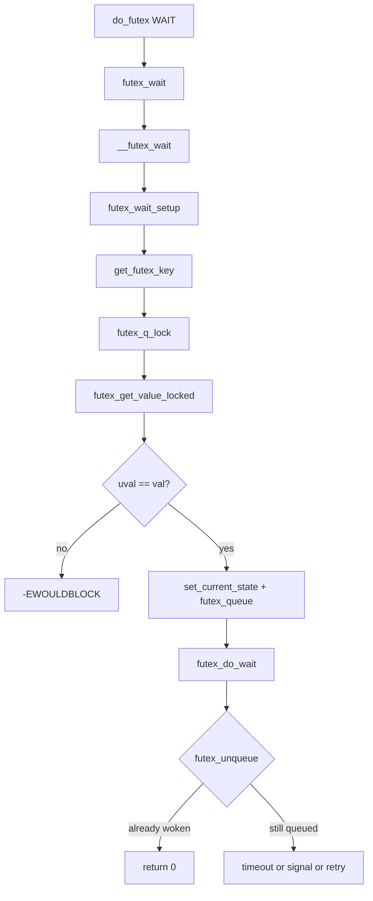

# 第19章 futex の基礎と wait/wake

> **本章で読むソース**
>
> - [`include/linux/futex.h` L29-L54](https://github.com/gregkh/linux/blob/v6.18.38/include/linux/futex.h#L29-L54)
> - [`kernel/futex/futex.h` L129-L209](https://github.com/gregkh/linux/blob/v6.18.38/kernel/futex/futex.h#L129-L209)
> - [`init/Kconfig` L1759-L1777](https://github.com/gregkh/linux/blob/v6.18.38/init/Kconfig#L1759-L1777)
> - [`kernel/futex/core.c` L181-L198](https://github.com/gregkh/linux/blob/v6.18.38/kernel/futex/core.c#L181-L198)
> - [`kernel/futex/core.c` L261-L317](https://github.com/gregkh/linux/blob/v6.18.38/kernel/futex/core.c#L261-L317)
> - [`kernel/futex/core.c` L403-L450](https://github.com/gregkh/linux/blob/v6.18.38/kernel/futex/core.c#L403-L450)
> - [`kernel/futex/core.c` L610-L638](https://github.com/gregkh/linux/blob/v6.18.38/kernel/futex/core.c#L610-L638)
> - [`kernel/futex/core.c` L706-L764](https://github.com/gregkh/linux/blob/v6.18.38/kernel/futex/core.c#L706-L764)
> - [`kernel/futex/core.c` L866-L909](https://github.com/gregkh/linux/blob/v6.18.38/kernel/futex/core.c#L866-L909)
> - [`kernel/futex/waitwake.c` L60-L126](https://github.com/gregkh/linux/blob/v6.18.38/kernel/futex/waitwake.c#L60-L126)
> - [`kernel/futex/waitwake.c` L341-L361](https://github.com/gregkh/linux/blob/v6.18.38/kernel/futex/waitwake.c#L341-L361)
> - [`kernel/futex/waitwake.c` L591-L704](https://github.com/gregkh/linux/blob/v6.18.38/kernel/futex/waitwake.c#L591-L704)
> - [`kernel/futex/waitwake.c` L155-L199](https://github.com/gregkh/linux/blob/v6.18.38/kernel/futex/waitwake.c#L155-L199)
> - [`kernel/futex/syscalls.c` L112-L159](https://github.com/gregkh/linux/blob/v6.18.38/kernel/futex/syscalls.c#L112-L159)

## この章の狙い

**futex**（Fast Userspace Mutex）は、ユーザー空間の整数変数を鍵にしてカーネル側の待ち行列へ入る同期機構である。
本章では `kernel/futex/` のハッシュバケット、`futex_q`、鍵の組み立て、`futex_wait` と `futex_wake` の主要経路を読む。
glibc の pthread 実装は扱わず、カーネル実装だけを対象とする。

## 前提

- [waitqueue](../part02-sleeping/08-waitqueue.md) と [アトミック操作とメモリバリア](../part00-foundation/01-atomic-barrier.md) を読んでいること。
- `futex` システムコールの入口は `do_futex` である。
  複数コマンドの振り分けは本章末で触れる。

## ビルド依存とデータ構造

`init/Kconfig` では `CONFIG_FUTEX` が futex サブシステム全体のスイッチである。
`CONFIG_FUTEX_PI` は `FUTEX` と `RT_MUTEXES` に依存し、PI futex 用である（第20章）。
`CONFIG_FUTEX_PRIVATE_HASH` は MMU ありかつ `BASE_SMALL` でない構成で既定有効であり、プロセス私有 futex 用の per-mm ハッシュを有効にする。

[`init/Kconfig` L1759-L1777](https://github.com/gregkh/linux/blob/v6.18.38/init/Kconfig#L1759-L1777)

```text
config FUTEX
	bool "Enable futex support" if EXPERT
	depends on !(SPARC32 && SMP)
	default y
	imply RT_MUTEXES
	help
	  Disabling this option will cause the kernel to be built without
	  support for "fast userspace mutexes".  The resulting kernel may not
	  run glibc-based applications correctly.

config FUTEX_PI
	bool
	depends on FUTEX && RT_MUTEXES
	default y

config FUTEX_PRIVATE_HASH
	bool
	depends on FUTEX && !BASE_SMALL && MMU
	default y
```

待ち行列の単位は **ハッシュバケット** `futex_hash_bucket` である。
同一鍵にハッシュされた futex は同じバケットの `plist_head chain` にぶら下がる。
待つタスクごとに `futex_q` が1つ割り当てられる。

[`kernel/futex/futex.h` L129-L209](https://github.com/gregkh/linux/blob/v6.18.38/kernel/futex/futex.h#L129-L209)

```c
struct futex_hash_bucket {
	atomic_t waiters;
	spinlock_t lock;
	struct plist_head chain;
	struct futex_private_hash *priv;
} ____cacheline_aligned_in_smp;

// ... (中略) ...

struct futex_q {
	struct plist_node list;

	struct task_struct *task;
	spinlock_t *lock_ptr;
	futex_wake_fn *wake;
	void *wake_data;
	union futex_key key;
	struct futex_pi_state *pi_state;
	struct rt_mutex_waiter *rt_waiter;
	union futex_key *requeue_pi_key;
	u32 bitset;
	atomic_t requeue_state;
	bool drop_hb_ref;
#ifdef CONFIG_PREEMPT_RT
	struct rcuwait requeue_wait;
#endif
} __randomize_layout;
```

`futex_q` の起床状態はコメントの通り、`plist_node_empty(&q->list)` または `q->lock_ptr == NULL` で表される。
起床側はまずリストから外し、次に `lock_ptr` を NULL に書く順序を守る。

## union futex_key と private/shared の違い

鍵は `union futex_key` に格納される。
`FUT_OFF_INODE` と `FUT_OFF_MMSHARED` は `both.offset` の下位ビットに立ち、鍵の種別を区別する。

[`include/linux/futex.h` L29-L54](https://github.com/gregkh/linux/blob/v6.18.38/include/linux/futex.h#L29-L54)

```c
#define FUT_OFF_INODE    1 /* We set bit 0 if key has a reference on inode */
#define FUT_OFF_MMSHARED 2 /* We set bit 1 if key has a reference on mm */

union futex_key {
	struct {
		u64 i_seq;
		unsigned long pgoff;
		unsigned int offset;
		/* unsigned int node; */
	} shared;
	struct {
		union {
			struct mm_struct *mm;
			u64 __tmp;
		};
		unsigned long address;
		unsigned int offset;
		/* unsigned int node; */
	} private;
	struct {
		u64 ptr;
		unsigned long word;
		unsigned int offset;
		unsigned int node;	/* NOT hashed! */
	} both;
};
```

`futex_to_flags` は `FUTEX_PRIVATE_FLAG` が立っていなければ `FLAGS_SHARED` を付ける。
PROCESS_PRIVATE（`!fshared`）では VMA 探索を省略し、`mm` と仮想アドレスだけで鍵を組み立てる。

[`kernel/futex/core.c` L610-L638](https://github.com/gregkh/linux/blob/v6.18.38/kernel/futex/core.c#L610-L638)

```c
	/*
	 * PROCESS_PRIVATE futexes are fast.
	 * As the mm cannot disappear under us and the 'key' only needs
	 * virtual address, we dont even have to find the underlying vma.
	 * Note : We do have to check 'uaddr' is a valid user address,
	 *        but access_ok() should be faster than find_vma()
	 */
	if (!fshared) {
		/*
		 * On no-MMU, shared futexes are treated as private, therefore
		 * we must not include the current process in the key. Since
		 * there is only one address space, the address is a unique key
		 * on its own.
		 */
		if (IS_ENABLED(CONFIG_MMU))
			key->private.mm = mm;
		else
			key->private.mm = NULL;

		key->private.address = address;
		return 0;
	}

again:
	/* Ignore any VERIFY_READ mapping (futex common case) */
	if (unlikely(should_fail_futex(true)))
		return -EFAULT;
```

FLAGS_SHARED はシステムコール側で `FUTEX_PRIVATE_FLAG` が付いていないことを意味する。
VMA の `MAP_SHARED` と同義ではない。
ページを pin したうえで、`folio_test_anon(folio)` かどうかで鍵組み立てが分岐する。
`folio_test_anon` が真なら `FUT_OFF_MMSHARED` を立て、`mm` とアドレスを鍵にする（カーネルコメントは private anonymous mapping を対象とする）。
偽なら file-backed folio として `FUT_OFF_INODE` と `i_seq`、`pgoff` を鍵にする。
`MAP_SHARED` かつ `MAP_ANONYMOUS` の領域は shmem backing を持つため、通常は後者の inode 鍵側に入る。

[`kernel/futex/core.c` L706-L764](https://github.com/gregkh/linux/blob/v6.18.38/kernel/futex/core.c#L706-L764)

```c
	if (folio_test_anon(folio)) {
		/*
		 * A RO anonymous page will never change and thus doesn't make
		 * sense for futex operations.
		 */
		if (unlikely(should_fail_futex(true)) || ro) {
			err = -EFAULT;
			goto out;
		}

		key->both.offset |= FUT_OFF_MMSHARED; /* ref taken on mm */
		key->private.mm = mm;
		key->private.address = address;

	} else {
		struct inode *inode;

		/*
		 * The associated futex object in this case is the inode and
		 * the folio->mapping must be traversed. Ordinarily this should
		 * be stabilised under folio lock but it's not strictly
		 * necessary in this case as we just want to pin the inode, not
		 * update i_pages or anything like that.
		 *
		 * The RCU read lock is taken as the inode is finally freed
		 * under RCU. If the mapping still matches expectations then the
		 * mapping->host can be safely accessed as being a valid inode.
		 */
		rcu_read_lock();

		if (READ_ONCE(folio->mapping) != mapping) {
			rcu_read_unlock();
			folio_put(folio);

			goto again;
		}

		inode = READ_ONCE(mapping->host);
		if (!inode) {
			rcu_read_unlock();
			folio_put(folio);

			goto again;
		}

		key->both.offset |= FUT_OFF_INODE; /* inode-based key */
		key->shared.i_seq = get_inode_sequence_number(inode);
		key->shared.pgoff = page_pgoff(folio, page);
		rcu_read_unlock();
	}
```

「shared futex は常に inode 鍵」という一般化も誤りである。
コード上の分岐は `FLAGS_SHARED` かつ `folio_test_anon` なら `mm+address`、非 anon の folio なら inode 鍵である。
`MAP_SHARED` 匿名を `mm+address` と断定してはならない。

## __futex_hash と per-mm 私有ハッシュ

`__futex_hash` は鍵を `jhash2` し、NUMA ノードごとのグローバル配列 `futex_queues` からバケットを選ぶ。
その前段で、PROCESS_PRIVATE 鍵は per-mm の `futex_private_hash` へ入るか試みる。

[`kernel/futex/core.c` L181-L198](https://github.com/gregkh/linux/blob/v6.18.38/kernel/futex/core.c#L181-L198)

```c
static struct futex_hash_bucket *
__futex_hash_private(union futex_key *key, struct futex_private_hash *fph)
{
	u32 hash;

	if (!futex_key_is_private(key))
		return NULL;

	if (!fph)
		fph = rcu_dereference(key->private.mm->futex_phash);
	if (!fph || !fph->hash_mask)
		return NULL;

	hash = jhash2((void *)&key->private.address,
		      sizeof(key->private.address) / 4,
		      key->both.offset);
	return &fph->queues[hash & fph->hash_mask];
}
```

`futex_private_hash` は RCU で `mm->futex_phash` を辿り、参照を取れなければ `futex_pivot_hash` でリサイズを進めてから retry する。
`futex_hash` も同様に、バケットの `priv` 参照が取れなければ pivot 後に再度 `__futex_hash` へ戻る。

[`kernel/futex/core.c` L261-L317](https://github.com/gregkh/linux/blob/v6.18.38/kernel/futex/core.c#L261-L317)

```c
static void futex_pivot_hash(struct mm_struct *mm)
{
	scoped_guard(mutex, &mm->futex_hash_lock) {
		struct futex_private_hash *fph;

		fph = mm->futex_phash_new;
		if (fph) {
			mm->futex_phash_new = NULL;
			__futex_pivot_hash(mm, fph);
		}
	}
}

struct futex_private_hash *futex_private_hash(void)
{
	struct mm_struct *mm = current->mm;
	// ... (中略) ...
again:
	scoped_guard(rcu) {
		struct futex_private_hash *fph;

		fph = rcu_dereference(mm->futex_phash);
		if (!fph)
			return NULL;

		if (futex_private_hash_get(fph))
			return fph;
	}
	futex_pivot_hash(mm);
	goto again;
}

struct futex_hash_bucket *futex_hash(union futex_key *key)
{
	struct futex_private_hash *fph;
	struct futex_hash_bucket *hb;

again:
	scoped_guard(rcu) {
		hb = __futex_hash(key, NULL);
		fph = hb->priv;

		if (!fph || futex_private_hash_get(fph))
			return hb;
	}
	futex_pivot_hash(key->private.mm);
	goto again;
}
```

per-mm バケットが無い、または private 鍵でない場合だけ、次のグローバルハッシュ選択へ進む。

[`kernel/futex/core.c` L403-L450](https://github.com/gregkh/linux/blob/v6.18.38/kernel/futex/core.c#L403-L450)

```c
static struct futex_hash_bucket *
__futex_hash(union futex_key *key, struct futex_private_hash *fph)
{
	int node = key->both.node;
	u32 hash;

	if (node == FUTEX_NO_NODE) {
		struct futex_hash_bucket *hb;

		hb = __futex_hash_private(key, fph);
		if (hb)
			return hb;
	}

	hash = jhash2((u32 *)key,
		      offsetof(typeof(*key), both.offset) / sizeof(u32),
		      key->both.offset);
	// ... (中略) ...
	return &futex_queues[node][hash & futex_hashmask];
}
```

per-mm 私有ハッシュは、高頻度の private futex がグローバルテーブルと競合しないようにする最適化である。
参照取得に失敗したときは pivot で新テーブルへ差し替え、呼び出し側が again ラベルで retry する。

## lost wakeup 防止の順序

`waitwake.c` 先頭のコメントは、waiter 側の `waiters++` と waker 側の `futex` 書き込みの間にメモリバリアが必要な理由を式で示している。
`futex_hb_waiters_inc` と `futex_hb_waiters_pending` が (A)(B) の役割を担う。

[`kernel/futex/waitwake.c` L60-L126](https://github.com/gregkh/linux/blob/v6.18.38/kernel/futex/waitwake.c#L60-L126)

```c
 * Where (A) orders the waiters increment and the futex value read through
 * atomic operations (see futex_hb_waiters_inc) and where (B) orders the write
 * to futex and the waiters read (see futex_hb_waiters_pending()).
 *
 * This yields the following case (where X:=waiters, Y:=futex):
 *
 *	X = Y = 0
 *
 *	w[X]=1		w[Y]=1
 *	MB		MB
 *	r[Y]=y		r[X]=x
 *
 * Which guarantees that x==0 && y==0 is impossible; which translates back into
 * the guarantee that we cannot both miss the futex variable change and the
 * enqueue.
// ... (中略) ...
bool __futex_wake_mark(struct futex_q *q)
{
	if (WARN(q->pi_state || q->rt_waiter, "refusing to wake PI futex\n"))
		return false;

	__futex_unqueue(q);
	// ... (中略) ...
	smp_store_release(&q->lock_ptr, NULL);

	return true;
}
```

`futex_q_lock` はロック取得前に `futex_hb_waiters_inc` する。
waker が `futex_hb_waiters_pending` で 0 と見た直後に waiter が増える競合を避けるためである。

[`kernel/futex/core.c` L866-L909](https://github.com/gregkh/linux/blob/v6.18.38/kernel/futex/core.c#L866-L909)

```c
void futex_q_lock(struct futex_q *q, struct futex_hash_bucket *hb)
	__acquires(&hb->lock)
{
	// ... (中略) ...
	futex_hb_waiters_inc(hb); /* implies smp_mb(); (A) */

	q->lock_ptr = &hb->lock;

	spin_lock(&hb->lock);
}

void __futex_queue(struct futex_q *q, struct futex_hash_bucket *hb,
		   struct task_struct *task)
{
	int prio;

	prio = min(current->normal_prio, MAX_RT_PRIO);

	plist_node_init(&q->list, prio);
	plist_add(&q->list, &hb->chain);
	q->task = task;
}
```

`__futex_queue` は RT スレッドを `MAX_RT_PRIO` 未満の優先度で plist に入れる。
同一バケット内では RT waiter が先に起床対象になりやすい。

## futex_wait_setup と値の再検査

`futex_wait_setup` の核心は、ハッシュバケットをロックした後にだけ `*uaddr` を読む点である。
ロック前に値を読むと、条件が偽のまま永久に寝込む lost wakeup が起きうる。

[`kernel/futex/waitwake.c` L591-L704](https://github.com/gregkh/linux/blob/v6.18.38/kernel/futex/waitwake.c#L591-L704)

```c
int futex_wait_setup(u32 __user *uaddr, u32 val, unsigned int flags,
		     struct futex_q *q, union futex_key *key2,
		     struct task_struct *task)
{
	u32 uval;
	int ret;

	/*
	 * Access the page AFTER the hash-bucket is locked.
	 * Order is important:
	 *
	 *   Userspace waiter: val = var; if (cond(val)) futex_wait(&var, val);
	 *   Userspace waker:  if (cond(var)) { var = new; futex_wake(&var); }
	 *
	 * The basic logical guarantee of a futex is that it blocks ONLY
	 * if cond(var) is known to be true at the time of blocking, for
	 * any cond.  If we locked the hash-bucket after testing *uaddr, that
	 * would open a race condition where we could block indefinitely with
	 * cond(var) false, which would violate the guarantee.
	 *
	 * On the other hand, we insert q and release the hash-bucket only
	 * after testing *uaddr.  This guarantees that futex_wait() will NOT
	 * absorb a wakeup if *uaddr does not match the desired values
	 * while the syscall executes.
	 */
retry:
	ret = get_futex_key(uaddr, flags, &q->key, FUTEX_READ);
	// ... (中略) ...
		futex_q_lock(q, hb);

		ret = futex_get_value_locked(&uval, uaddr);
		// ... (中略) ...
		if (uval != val) {
			futex_q_unlock(hb);
			return -EWOULDBLOCK;
		}
		// ... (中略) ...
		if (task == current)
			set_current_state(TASK_INTERRUPTIBLE|TASK_FREEZABLE);
		futex_queue(q, hb, task);
	// ... (中略) ...
}

int __futex_wait(u32 __user *uaddr, unsigned int flags, u32 val,
		 struct hrtimer_sleeper *to, u32 bitset)
{
	struct futex_q q = futex_q_init;
	int ret;

	if (!bitset)
		return -EINVAL;

	q.bitset = bitset;

retry:
	ret = futex_wait_setup(uaddr, val, flags, &q, NULL, current);
	if (ret)
		return ret;

	futex_do_wait(&q, to);

	if (!futex_unqueue(&q))
		return 0;
	// ... (中略) ...
	if (!signal_pending(current))
		goto retry;

	return -ERESTARTSYS;
}
```

`uval != val` のときは `-EWOULDBLOCK` で即返す。
ユーザー空間が先に値を変えたか、別タスクが起床させた結果である。
`futex_unqueue` は、戻り値 0 のとき waker がすでに dequeue 済みであることを意味し、その場合 `__futex_wait` は成功として 0 を返す。
戻り値 1 のとき自分で dequeue できたので、タイムアウトとシグナルを判定し、どちらでもなければ spurious wakeup として `retry` へ戻る。

## futex_do_wait とスケジュール省略

`futex_do_wait` は `futex_queue` 済みの `futex_q` に対して呼ばれる。
waker が enqueue 後から `schedule()` 直前までに `__futex_unqueue` した場合、`plist_node_empty` が真になり `schedule()` を省略する。
waker 自体は enqueue 前にも実行されうるが、その場合はロック後の値再検査が変化を検出する。
`hb` ロック下で未 enqueue の `futex_q` を waker が `__futex_unqueue` することはできない。
つまり「`q` を unqueue できるのは enqueue 後」に限定される。

[`kernel/futex/waitwake.c` L341-L361](https://github.com/gregkh/linux/blob/v6.18.38/kernel/futex/waitwake.c#L341-L361)

```c
void futex_do_wait(struct futex_q *q, struct hrtimer_sleeper *timeout)
{
	if (timeout)
		hrtimer_sleeper_start_expires(timeout, HRTIMER_MODE_ABS);

	if (likely(!plist_node_empty(&q->list))) {
		if (!timeout || timeout->task)
			schedule();
	}
	__set_current_state(TASK_RUNNING);
}
```

## futex_wake の経路

`futex_wake` は鍵を取り、待ち手がいなければロックすら取らずに返す。
バケットをロックしたうえで `futex_match` と bitset を満たす `futex_q` に対し `wake` コールバックを呼ぶ。
通常 futex では `futex_wake_mark` が `wake_q` に積み、ロック解放後に `wake_up_q` で実際の起床が行われる。

[`kernel/futex/waitwake.c` L155-L199](https://github.com/gregkh/linux/blob/v6.18.38/kernel/futex/waitwake.c#L155-L199)

```c
int futex_wake(u32 __user *uaddr, unsigned int flags, int nr_wake, u32 bitset)
{
	struct futex_q *this, *next;
	union futex_key key = FUTEX_KEY_INIT;
	DEFINE_WAKE_Q(wake_q);
	int ret;

	if (!bitset)
		return -EINVAL;

	ret = get_futex_key(uaddr, flags, &key, FUTEX_READ);
	if (unlikely(ret != 0))
		return ret;

	if ((flags & FLAGS_STRICT) && !nr_wake)
		return 0;

	CLASS(hb, hb)(&key);

	if (!futex_hb_waiters_pending(hb))
		return ret;

	spin_lock(&hb->lock);

	plist_for_each_entry_safe(this, next, &hb->chain, list) {
		if (futex_match (&this->key, &key)) {
			if (this->pi_state || this->rt_waiter) {
				ret = -EINVAL;
				break;
			}

			if (!(this->bitset & bitset))
				continue;

			this->wake(&wake_q, this);
			if (++ret >= nr_wake)
				break;
		}
	}

	spin_unlock(&hb->lock);
	wake_up_q(&wake_q);
	return ret;
}
```

`pi_state` または `rt_waiter` を持つエントリに対する通常 wake は `-EINVAL` である。
PI 系は第20章の経路で扱う。

## do_futex によるコマンド振り分け

`do_futex` は `op` から flags と cmd を切り出し、wait/wake/requeue などへ振り分ける。
本章の wait/wake は `FUTEX_WAIT` と `FUTEX_WAKE` 系に対応する。

[`kernel/futex/syscalls.c` L112-L159](https://github.com/gregkh/linux/blob/v6.18.38/kernel/futex/syscalls.c#L112-L159)

```c
long do_futex(u32 __user *uaddr, int op, u32 val, ktime_t *timeout,
		u32 __user *uaddr2, u32 val2, u32 val3)
{
	unsigned int flags = futex_to_flags(op);
	int cmd = op & FUTEX_CMD_MASK;
	// ... (中略) ...
	switch (cmd) {
	case FUTEX_WAIT:
		val3 = FUTEX_BITSET_MATCH_ANY;
		fallthrough;
	case FUTEX_WAIT_BITSET:
		return futex_wait(uaddr, flags, val, timeout, val3);
	case FUTEX_WAKE:
		val3 = FUTEX_BITSET_MATCH_ANY;
		fallthrough;
	case FUTEX_WAKE_BITSET:
		return futex_wake(uaddr, flags, val, val3);
	case FUTEX_REQUEUE:
		return futex_requeue(uaddr, flags, uaddr2, flags, val, val2, NULL, 0);
	// ... (中略) ...
	}
	return -ENOSYS;
}
```

## 処理の流れ（wait 側）



## 高速化と最適化の工夫

private futex 向けの per-mm ハッシュ（`CONFIG_FUTEX_PRIVATE_HASH`）は、同一プロセス内の futex 待ちがグローバルバケット配列を汚さない。
`futex_wake` の `futex_hb_waiters_pending` 早期 return は、待ち手ゼロのバケットでスピンロックを取らない。
plist による優先度付きキューイングは、同一 futex 上の RT waiter を FIFO より先に起床させ、スケジューラ遅延を抑える。

> **7.x 系での変化**
> `kernel/futex/` は v6.18.38 で約 6,011 行、v7.1.3 で約 5,985 行（差分約 330 行、25 ハンク）である。
> [`requeue.c`](https://github.com/gregkh/linux/blob/v7.1.3/kernel/futex/requeue.c) は同一であり、wait/wake の成立条件は変わらない。
> `futex_private_hash`、`futex_pivot_hash`、`__futex_hash_private` は v6.18.38 と v7.1.3 の `core.c` の双方に存在し、当該関数群に実質差分はない（7.x 新規機構ではない）。
> v7.1.3 では lockdep 注釈移動、NUMA 補助フィールドの `get_user_inline` 化などが主で、本章の核心である「ロック後に値検査してから queue」は維持されている。

## まとめ

futex はユーザー空間アドレスから組み立てた鍵でハッシュバケットを引き、`futex_q` で待つ。
`futex_wait_setup` はバケットロック後の値検査と queue の順序で lost wakeup を防ぐ。
`futex_wake` は bitset 一致の waiter を `wake_q` 経由で起床する。
private と shared では `get_futex_key` の鍵組み立てが異なる。
`FLAGS_SHARED` かつ `folio_test_anon` なら `FUT_OFF_MMSHARED`、非 anon folio なら `FUT_OFF_INODE` である。

## 関連する章

- [requeue と PI futex](20-futex-requeue-pi.md)
- [waitqueue](../part02-sleeping/08-waitqueue.md)
- [rt_mutex と priority inheritance](../part03-correctness/11-rt-mutex-pi.md)
