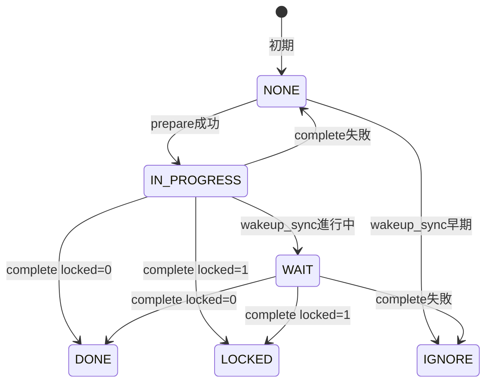
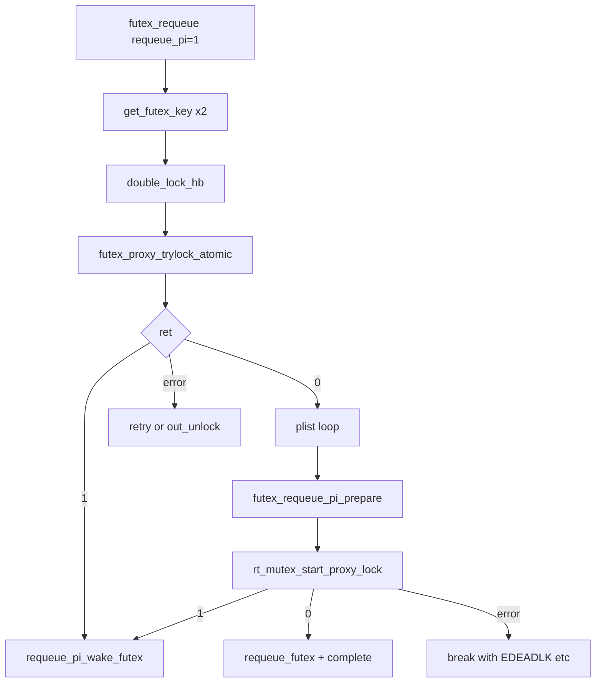

# 第20章 requeue と PI futex

> **本章で読むソース**
>
> - [`kernel/futex/futex.h` L144-L160](https://github.com/gregkh/linux/blob/v6.18.38/kernel/futex/futex.h#L144-L160)
> - [`kernel/futex/requeue.c` L76-L97](https://github.com/gregkh/linux/blob/v6.18.38/kernel/futex/requeue.c#L76-L97)
> - [`kernel/futex/requeue.c` L99-L199](https://github.com/gregkh/linux/blob/v6.18.38/kernel/futex/requeue.c#L99-L199)
> - [`kernel/futex/requeue.c` L275-L361](https://github.com/gregkh/linux/blob/v6.18.38/kernel/futex/requeue.c#L275-L361)
> - [`kernel/futex/requeue.c` L370-L458](https://github.com/gregkh/linux/blob/v6.18.38/kernel/futex/requeue.c#L370-L458)
> - [`kernel/futex/requeue.c` L468-L490](https://github.com/gregkh/linux/blob/v6.18.38/kernel/futex/requeue.c#L468-L490)
> - [`kernel/futex/requeue.c` L503-L586](https://github.com/gregkh/linux/blob/v6.18.38/kernel/futex/requeue.c#L503-L586)
> - [`kernel/futex/requeue.c` L589-L688](https://github.com/gregkh/linux/blob/v6.18.38/kernel/futex/requeue.c#L589-L688)
> - [`kernel/futex/pi.c` L249-L296](https://github.com/gregkh/linux/blob/v6.18.38/kernel/futex/pi.c#L249-L296)
> - [`kernel/futex/pi.c` L515-L608](https://github.com/gregkh/linux/blob/v6.18.38/kernel/futex/pi.c#L515-L608)
> - [`kernel/futex/pi.c` L872-L907](https://github.com/gregkh/linux/blob/v6.18.38/kernel/futex/pi.c#L872-L907)
> - [`kernel/futex/pi.c` L918-L988](https://github.com/gregkh/linux/blob/v6.18.38/kernel/futex/pi.c#L918-L988)
> - [`kernel/futex/pi.c` L1028-L1048](https://github.com/gregkh/linux/blob/v6.18.38/kernel/futex/pi.c#L1028-L1048)
> - [`kernel/futex/core.c` L822-L844](https://github.com/gregkh/linux/blob/v6.18.38/kernel/futex/core.c#L822-L844)

## この章の狙い

`FUTEX_REQUEUE` は待ち手を別アドレスのハッシュバケットへ移す condvar 型の操作である。
`FUTEX_LOCK_PI` 系は **PI futex** と呼ばれ、所有者の優先度継承を `rt_mutex` へ委譲する。
本章では `requeue.c` と `pi.c` を読み、通常 requeue と requeue_pi の分岐、owner died、退出中 owner 待ちまでを追う。
`rt_mutex` の連鎖伝播本体は [第11章 rt_mutex と priority inheritance](../part03-correctness/11-rt-mutex-pi.md) の担当であり、本章は futex 側の接続に境界を置く。

## 前提

- [futex の基礎と wait/wake](19-futex-hash-wait-wake.md) と [rt_mutex と priority inheritance](../part03-correctness/11-rt-mutex-pi.md) を読んでいること。
- `CONFIG_FUTEX_PI` が無効なカーネルでは PI 系システムコールは `-ENOSYS` になる。

## futex_pi_state と rt_mutex の接続

PI futex ごとに `futex_pi_state` が割り当てられ、その中の `pi_mutex` が実ロックである。
owner は `pi_state->owner` とユーザー空間の TID ビット列の両方と整合させる必要がある。

[`kernel/futex/futex.h` L144-L160](https://github.com/gregkh/linux/blob/v6.18.38/kernel/futex/futex.h#L144-L160)

```c
struct futex_pi_state {
	/*
	 * list of 'owned' pi_state instances - these have to be
	 * cleaned up in do_exit() if the task exits prematurely:
	 */
	struct list_head list;

	/*
	 * The PI object:
	 */
	struct rt_mutex_base pi_mutex;

	struct task_struct *owner;
	refcount_t refcount;

	union futex_key key;
} __randomize_layout;
```

`attach_to_pi_state` 以降の待ち行列操作は `pi_mutex.wait_lock` と `hb->lock` の役割分担が厳密である。
pi.c 先頭のコメント表は、どのロックがどのフィールドを直列化するかを一覧している。

## 通常 requeue と requeue_futex

`requeue_futex` は `hb1` から `hb2` へ `futex_q` を plist ごと移す。
同一チェインなら移動を省略し、鍵だけ `key2` に更新する。

[`kernel/futex/requeue.c` L76-L97](https://github.com/gregkh/linux/blob/v6.18.38/kernel/futex/requeue.c#L76-L97)

```c
void requeue_futex(struct futex_q *q, struct futex_hash_bucket *hb1,
		   struct futex_hash_bucket *hb2, union futex_key *key2)
{

	/*
	 * If key1 and key2 hash to the same bucket, no need to
	 * requeue.
	 */
	if (likely(&hb1->chain != &hb2->chain)) {
		plist_del(&q->list, &hb1->chain);
		futex_hb_waiters_dec(hb1);
		futex_hb_waiters_inc(hb2);
		plist_add(&q->list, &hb2->chain);
		q->lock_ptr = &hb2->lock;
		// ... (中略) ...
	}
	q->key = *key2;
}
```

`futex_requeue` は両アドレスの鍵を取り、`double_lock_hb` でバケットを固定する。
`cmpval` が非 NULL のとき（`FUTEX_CMP_REQUEUE` 系）は、`uaddr1` の現在値と比較する。
これはカーネル内の値読み取りによる比較であり、ユーザー空間への cmpxchg 命令ではない。
`requeue_pi` が真のときは `nr_wake` は 1 でなければならず、同一鍵への requeue は拒否される。

[`kernel/futex/requeue.c` L370-L458](https://github.com/gregkh/linux/blob/v6.18.38/kernel/futex/requeue.c#L370-L458)

```c
int futex_requeue(u32 __user *uaddr1, unsigned int flags1,
		  u32 __user *uaddr2, unsigned int flags2,
		  int nr_wake, int nr_requeue, u32 *cmpval, int requeue_pi)
{
	union futex_key key1 = FUTEX_KEY_INIT, key2 = FUTEX_KEY_INIT;
	// ... (中略) ...
	if (!IS_ENABLED(CONFIG_FUTEX_PI) && requeue_pi)
		return -ENOSYS;

	if (requeue_pi) {
		if (uaddr1 == uaddr2)
			return -EINVAL;
		// ... (中略) ...
		if (nr_wake != 1)
			return -EINVAL;
		// ... (中略) ...
	}

retry:
	ret = get_futex_key(uaddr1, flags1, &key1, FUTEX_READ);
	// ... (中略) ...
	ret = get_futex_key(uaddr2, flags2, &key2,
			    requeue_pi ? FUTEX_WRITE : FUTEX_READ);
	// ... (中略) ...
	if (requeue_pi && futex_match(&key1, &key2))
		return -EINVAL;
```

両バケットをロックしたあと、`cmpval` が指定されていれば `futex_get_value_locked` で `uaddr1` を読み、`*cmpval` と一致しなければ `-EAGAIN` で抜ける。
ページフォールト時は private なら `retry_private`、shared なら `retry` へ戻る。

[`kernel/futex/requeue.c` L468-L490](https://github.com/gregkh/linux/blob/v6.18.38/kernel/futex/requeue.c#L468-L490)

```c
		if (likely(cmpval != NULL)) {
			u32 curval;

			ret = futex_get_value_locked(&curval, uaddr1);

			if (unlikely(ret)) {
				futex_hb_waiters_dec(hb2);
				double_unlock_hb(hb1, hb2);

				ret = get_user(curval, uaddr1);
				if (ret)
					return ret;

				if (!(flags1 & FLAGS_SHARED))
					goto retry_private;

				goto retry;
			}
			if (curval != *cmpval) {
				ret = -EAGAIN;
				goto out_unlock;
			}
		}
```

plain requeue のループでは、先頭 `nr_wake` 件は `wake`、残りは `requeue_futex` である。
`pi_state` や `rt_waiter` を持つエントリの通常 requeue は `-EINVAL` になる。

[`kernel/futex/requeue.c` L589-L616](https://github.com/gregkh/linux/blob/v6.18.38/kernel/futex/requeue.c#L589-L616)

```c
		plist_for_each_entry_safe(this, next, &hb1->chain, list) {
			if (task_count - nr_wake >= nr_requeue)
				break;

			if (!futex_match(&this->key, &key1))
				continue;

			if ((requeue_pi && !this->rt_waiter) ||
			    (!requeue_pi && this->rt_waiter) ||
			    this->pi_state) {
				ret = -EINVAL;
				break;
			}

			if (!requeue_pi) {
				if (++task_count <= nr_wake)
					this->wake(&wake_q, this);
				else
					requeue_futex(this, hb1, hb2, &key2);
				continue;
			}
```

## requeue_pi と futex_proxy_trylock_atomic

requeue_pi では、ループに入る前に `futex_proxy_trylock_atomic` が先頭 waiter へ `uaddr2` のロック取得を試みる。
コメントの定義どおり、戻り値 1 は取得成功、0 はアトミック取得なし、負値はエラーである。
0 は `top_waiter` が存在しない場合にも返る（処理対象が無い）。
`top_waiter` がいる競合ケースで 0 が返ったときは、後続の plist ループが proxy waiter へ載せ替える。

[`kernel/futex/requeue.c` L275-L361](https://github.com/gregkh/linux/blob/v6.18.38/kernel/futex/requeue.c#L275-L361)

```c
 * Return:
 *  -  0 - failed to acquire the lock atomically;
 *  - >0 - acquired the lock, return value is vpid of the top_waiter
 *  - <0 - error
 */
static int
futex_proxy_trylock_atomic(u32 __user *pifutex, struct futex_hash_bucket *hb1,
			   struct futex_hash_bucket *hb2, union futex_key *key1,
			   union futex_key *key2, struct futex_pi_state **ps,
			   struct task_struct **exiting, int set_waiters)
{
	struct futex_q *top_waiter;
	u32 curval;
	int ret;

	if (futex_get_value_locked(&curval, pifutex))
		return -EFAULT;

	if (unlikely(should_fail_futex(true)))
		return -EFAULT;

	top_waiter = futex_top_waiter(hb1, key1);

	/* There are no waiters, nothing for us to do. */
	if (!top_waiter)
		return 0;

	if (!top_waiter->rt_waiter || top_waiter->pi_state)
		return -EINVAL;

	if (!futex_match(top_waiter->requeue_pi_key, key2))
		return -EINVAL;

	if (!futex_requeue_pi_prepare(top_waiter, NULL)) {
		plist_del(&top_waiter->list, &hb1->chain);
		futex_hb_waiters_dec(hb1);
		return -EAGAIN;
	}

	ret = futex_lock_pi_atomic(pifutex, hb2, key2, ps, top_waiter->task,
				   exiting, set_waiters);
	if (ret == 1) {
		requeue_pi_wake_futex(top_waiter, key2, hb2);
	} else if (ret < 0) {
		futex_requeue_pi_complete(top_waiter, ret);
	} else {
	}
	return ret;
}
```

## requeue_state と早期 wakeup 競合

`futex_requeue_pi_prepare` は `Q_REQUEUE_PI_NONE` から `Q_REQUEUE_PI_IN_PROGRESS` へ進める。
すでに `Q_REQUEUE_PI_IGNORE` が立っていれば false を返し、requeue 対象から外す。

[`kernel/futex/requeue.c` L99-L130](https://github.com/gregkh/linux/blob/v6.18.38/kernel/futex/requeue.c#L99-L130)

```c
static inline bool futex_requeue_pi_prepare(struct futex_q *q,
					    struct futex_pi_state *pi_state)
{
	int old, new;

	/*
	 * Set state to Q_REQUEUE_PI_IN_PROGRESS unless an early wakeup has
	 * already set Q_REQUEUE_PI_IGNORE to signal that requeue should
	 * ignore the waiter.
	 */
	old = atomic_read_acquire(&q->requeue_state);
	do {
		if (old == Q_REQUEUE_PI_IGNORE)
			return false;

		if (old != Q_REQUEUE_PI_NONE)
			break;

		new = Q_REQUEUE_PI_IN_PROGRESS;
	} while (!atomic_try_cmpxchg(&q->requeue_state, &old, new));

	q->pi_state = pi_state;
	return true;
}
```

`futex_requeue_pi_wakeup_sync` は早期 wakeup 側から状態を進める。
requeue 前なら `Q_REQUEUE_PI_NONE` から `Q_REQUEUE_PI_IGNORE`、進行中なら `Q_REQUEUE_PI_IN_PROGRESS` から `Q_REQUEUE_PI_WAIT` へ遷移する。

[`kernel/futex/requeue.c` L163-L199](https://github.com/gregkh/linux/blob/v6.18.38/kernel/futex/requeue.c#L163-L199)

```c
static inline int futex_requeue_pi_wakeup_sync(struct futex_q *q)
{
	int old, new;

	old = atomic_read_acquire(&q->requeue_state);
	do {
		if (old >= Q_REQUEUE_PI_DONE)
			return old;

		new = Q_REQUEUE_PI_WAIT;
		if (old == Q_REQUEUE_PI_NONE)
			new = Q_REQUEUE_PI_IGNORE;
	} while (!atomic_try_cmpxchg(&q->requeue_state, &old, new));

	if (old == Q_REQUEUE_PI_IN_PROGRESS) {
#ifdef CONFIG_PREEMPT_RT
		rcuwait_wait_event(&q->requeue_wait,
				   atomic_read(&q->requeue_state) != Q_REQUEUE_PI_WAIT,
				   TASK_UNINTERRUPTIBLE);
#else
		(void)atomic_cond_read_relaxed(&q->requeue_state, VAL != Q_REQUEUE_PI_WAIT);
#endif
	}

	return atomic_read(&q->requeue_state);
}
```

完了側の `futex_requeue_pi_complete` は、成功時に `Q_REQUEUE_PI_DONE` または `Q_REQUEUE_PI_LOCKED` を書き、失敗時は `Q_REQUEUE_PI_NONE` か `Q_REQUEUE_PI_IGNORE` へ戻す。

[`kernel/futex/requeue.c` L132-L161](https://github.com/gregkh/linux/blob/v6.18.38/kernel/futex/requeue.c#L132-L161)

```c
static inline void futex_requeue_pi_complete(struct futex_q *q, int locked)
{
	int old, new;

	old = atomic_read_acquire(&q->requeue_state);
	do {
		if (old == Q_REQUEUE_PI_IGNORE)
			return;

		if (locked >= 0) {
			WARN_ON_ONCE(old != Q_REQUEUE_PI_IN_PROGRESS &&
				     old != Q_REQUEUE_PI_WAIT);
			new = Q_REQUEUE_PI_DONE + locked;
		} else if (old == Q_REQUEUE_PI_IN_PROGRESS) {
			new = Q_REQUEUE_PI_NONE;
		} else {
			WARN_ON_ONCE(old != Q_REQUEUE_PI_WAIT);
			new = Q_REQUEUE_PI_IGNORE;
		}
	} while (!atomic_try_cmpxchg(&q->requeue_state, &old, new));

#ifdef CONFIG_PREEMPT_RT
	if (unlikely(old == Q_REQUEUE_PI_WAIT))
		rcuwait_wake_up(&q->requeue_wait);
#endif
}
```



`futex_requeue` 内の switch は、trylock 結果に応じて `task_count` 更新、fault 時の retry、退出中 owner 待ちを分岐する。

[`kernel/futex/requeue.c` L503-L586](https://github.com/gregkh/linux/blob/v6.18.38/kernel/futex/requeue.c#L503-L586)

```c
			ret = futex_proxy_trylock_atomic(uaddr2, hb1, hb2, &key1,
							 &key2, &pi_state,
							 &exiting, nr_requeue);
			// ... (中略) ...
			switch (ret) {
			case 0:
				break;

			case 1:
				task_count++;
				ret = 0;
				break;

			case -EFAULT:
				futex_hb_waiters_dec(hb2);
				double_unlock_hb(hb1, hb2);
				ret = fault_in_user_writeable(uaddr2);
				if (!ret)
					goto retry;
				return ret;
			case -EBUSY:
			case -EAGAIN:
				futex_hb_waiters_dec(hb2);
				double_unlock_hb(hb1, hb2);
				wait_for_owner_exiting(ret, exiting);
				cond_resched();
				goto retry;
			default:
				goto out_unlock;
			}
```

残りの waiter は plist ループで `rt_mutex_start_proxy_lock` により proxy waiter へ移し、`requeue_futex` で `hb2` へ載せ替える。
即取得できた waiter は `requeue_pi_wake_futex`、キュー投入できた waiter は `futex_requeue_pi_complete(this, 0)` で状態を確定する。

[`kernel/futex/requeue.c` L619-L688](https://github.com/gregkh/linux/blob/v6.18.38/kernel/futex/requeue.c#L619-L688)

```c
			if (!futex_match(this->requeue_pi_key, &key2)) {
				ret = -EINVAL;
				break;
			}

			get_pi_state(pi_state);

			if (!futex_requeue_pi_prepare(this, pi_state)) {
				put_pi_state(pi_state);
				continue;
			}

			if (rt_mutex_owner(&pi_state->pi_mutex) == this->task) {
				ret = -EDEADLK;
				break;
			}

			ret = rt_mutex_start_proxy_lock(&pi_state->pi_mutex,
							this->rt_waiter,
							this->task);

			if (ret == 1) {
				requeue_pi_wake_futex(this, &key2, hb2);
				task_count++;
			} else if (!ret) {
				requeue_futex(this, hb1, hb2, &key2);
				futex_requeue_pi_complete(this, 0);
				task_count++;
			} else {
				this->pi_state = NULL;
				put_pi_state(pi_state);
				futex_requeue_pi_complete(this, ret);
				break;
			}
```

## futex_lock_pi_atomic と初回取得

`futex_lock_pi_atomic` は `hb->lock` 保持下でユーザー空間値を読み、空きなら TID を書き込んで即取得する。
先頭 waiter がいれば既存 `pi_state` へ attach し、owner がいれば `FUTEX_WAITERS` を立てて `attach_to_pi_owner` へ進む。

[`kernel/futex/pi.c` L515-L608](https://github.com/gregkh/linux/blob/v6.18.38/kernel/futex/pi.c#L515-L608)

```c
int futex_lock_pi_atomic(u32 __user *uaddr, struct futex_hash_bucket *hb,
			 union futex_key *key,
			 struct futex_pi_state **ps,
			 struct task_struct *task,
			 struct task_struct **exiting,
			 int set_waiters)
{
	u32 uval, newval, vpid = task_pid_vnr(task);
	struct futex_q *top_waiter;
	int ret;

	if (futex_get_value_locked(&uval, uaddr))
		return -EFAULT;
	// ... (中略) ...
	if ((unlikely((uval & FUTEX_TID_MASK) == vpid)))
		return -EDEADLK;

	top_waiter = futex_top_waiter(hb, key);
	if (top_waiter)
		return attach_to_pi_state(uaddr, uval, top_waiter->pi_state, ps);

	if (!(uval & FUTEX_TID_MASK)) {
		newval = uval & FUTEX_OWNER_DIED;
		newval |= vpid;
		if (set_waiters)
			newval |= FUTEX_WAITERS;
		ret = lock_pi_update_atomic(uaddr, uval, newval);
		// ... (中略) ...
		return 1;
	}

	newval = uval | FUTEX_WAITERS;
	ret = lock_pi_update_atomic(uaddr, uval, newval);
	// ... (中略) ...
	return attach_to_pi_owner(uaddr, newval, key, ps, exiting);
}
```

`FUTEX_OWNER_DIED` が立っている空き futex は、死亡した owner ビットを保持したまま新 TID を書く。
robust futex の回収経路と接続する。

## FUTEX_OWNER_DIED の検証

`attach_to_pi_state` は `wait_lock` 取得後にユーザー空間値を再読みし、`uval` の変化があれば `-EAGAIN` する。
`FUTEX_OWNER_DIED` が立っているときは `pi_state->owner` とユーザー空間 TID の組み合わせをケース分けする。

[`kernel/futex/pi.c` L249-L296](https://github.com/gregkh/linux/blob/v6.18.38/kernel/futex/pi.c#L249-L296)

```c
	/*
	 * Handle the owner died case:
	 */
	if (uval & FUTEX_OWNER_DIED) {
		/*
		 * exit_pi_state_list sets owner to NULL and wakes the
		 * topmost waiter. The task which acquires the
		 * pi_state->rt_mutex will fixup owner.
		 */
		if (!pi_state->owner) {
			/*
			 * No pi state owner, but the user space TID
			 * is not 0. Inconsistent state. [5]
			 */
			if (pid)
				goto out_einval;
			/*
			 * Take a ref on the state and return success. [4]
			 */
			goto out_attach;
		}

		/*
		 * If TID is 0, then either the dying owner has not
		 * yet executed exit_pi_state_list() or some waiter
		 * acquired the rtmutex in the pi state, but did not
		 * yet fixup the TID in user space.
		 *
		 * Take a ref on the state and return success. [6]
		 */
		if (!pid)
			goto out_attach;
	} else {
		/*
		 * If the owner died bit is not set, then the pi_state
		 * must have an owner. [7]
		 */
		if (!pi_state->owner)
			goto out_einval;
	}

	/*
	 * Bail out if user space manipulated the futex value. If pi
	 * state exists then the owner TID must be the same as the
	 * user space TID. [9/10]
	 */
	if (pid != task_pid_vnr(pi_state->owner))
		goto out_einval;
```

`FUTEX_OWNER_DIED` が立っているときの受理条件は次のとおりである。

- `pi_state->owner == NULL` かつユーザー空間 TID が 0 のとき、`out_attach` へ進む（[4]）。
- `pi_state->owner == NULL` かつユーザー空間 TID が 0 以外のとき、`-EINVAL`（[5]）。
- `pi_state->owner != NULL` かつユーザー空間 TID が 0 のとき、`out_attach` へ進む（[6]）。
- `FUTEX_OWNER_DIED` が立っていないのに `pi_state->owner == NULL` のとき、`-EINVAL`（[7]）。

いずれの経路でも、最終段の `pid != task_pid_vnr(pi_state->owner)` 判定に到達した場合は owner TID と一致しなければ `-EINVAL` である（[9/10]）。
したがって「owner died かつ TID 0 かつ owner NULL のときだけ成功」とは限らない。
owner が残存しユーザー空間 TID が 0 のケースも attach 候補になる。

## futex_lock_pi のブロッキング経路

アトミック取得に失敗した `futex_lock_pi` は `__futex_queue` のあと `rt_mutex` プロキシ待ちへ入る。
`hb->lock` を手放してから `__rt_mutex_start_proxy_lock` を呼ぶ順序は、`futex_unlock_pi` とのインタリーブでデッドロック報告を避けるためである。

[`kernel/futex/pi.c` L918-L988](https://github.com/gregkh/linux/blob/v6.18.38/kernel/futex/pi.c#L918-L988)

```c
int futex_lock_pi(u32 __user *uaddr, unsigned int flags, ktime_t *time, int trylock)
{
	// ... (中略) ...
	if (!IS_ENABLED(CONFIG_FUTEX_PI))
		return -ENOSYS;
	// ... (中略) ...
retry:
	// ... (中略) ...
		futex_q_lock(&q, hb);

		ret = futex_lock_pi_atomic(uaddr, hb, &q.key, &q.pi_state, current,
					   &exiting, 0);
		if (unlikely(ret)) {
			switch (ret) {
			case 1:
				ret = 0;
				goto out_unlock_put_key;
			case -EFAULT:
				goto uaddr_faulted;
			case -EBUSY:
			case -EAGAIN:
				futex_q_unlock(hb);
				wait_for_owner_exiting(ret, exiting);
				cond_resched();
				goto retry;
			default:
				goto out_unlock_put_key;
			}
		}

		WARN_ON(!q.pi_state);

		__futex_queue(&q, hb, current);
```

ブロック本体は `__rt_mutex_start_proxy_lock` と `rt_mutex_wait_proxy_lock` である。
ここから先の優先度連鎖は第11章の `task_blocks_on_rt_mutex` 側が担う。

[`kernel/futex/pi.c` L1028-L1048](https://github.com/gregkh/linux/blob/v6.18.38/kernel/futex/pi.c#L1028-L1048)

```c
		raw_spin_lock_irq(&q.pi_state->pi_mutex.wait_lock);
		spin_unlock(q.lock_ptr);
		ret = __rt_mutex_start_proxy_lock(&q.pi_state->pi_mutex, &rt_waiter, current, &wake_q);
		raw_spin_unlock_irq_wake(&q.pi_state->pi_mutex.wait_lock, &wake_q);

		if (ret) {
			if (ret == 1)
				ret = 0;
			goto cleanup;
		}

		if (unlikely(to))
			hrtimer_sleeper_start_expires(to, HRTIMER_MODE_ABS);

		ret = rt_mutex_wait_proxy_lock(&q.pi_state->pi_mutex, to, &rt_waiter);
```

## fixup_pi_owner と起床後の整合

待ち終了後は `fixup_pi_owner` がユーザー空間 TID と `pi_state->owner` のずれを直す。
ロック取得成功時に owner が自分と一致しなければ `fixup_pi_state_owner` へ入る。

[`kernel/futex/pi.c` L872-L907](https://github.com/gregkh/linux/blob/v6.18.38/kernel/futex/pi.c#L872-L907)

```c
int fixup_pi_owner(u32 __user *uaddr, struct futex_q *q, int locked)
{
	if (locked) {
		if (q->pi_state->owner != current)
			return fixup_pi_state_owner(uaddr, q, current);
		return 1;
	}

	if (q->pi_state->owner == current)
		return fixup_pi_state_owner(uaddr, q, NULL);

	if (WARN_ON_ONCE(rt_mutex_owner(&q->pi_state->pi_mutex) == current))
		return fixup_pi_state_owner(uaddr, q, current);

	return 0;
}
```

## wait_for_owner_exiting

`attach_to_pi_owner` が `-EBUSY` を返すとき、owner タスクは退出途中である。
`wait_for_owner_exiting` は `futex_exit_mutex` を一瞬取り、退出完了を待ってから retry する。
これが無いと live lock しうる。

[`kernel/futex/core.c` L822-L844](https://github.com/gregkh/linux/blob/v6.18.38/kernel/futex/core.c#L822-L844)

```c
void wait_for_owner_exiting(int ret, struct task_struct *exiting)
{
	if (ret != -EBUSY) {
		WARN_ON_ONCE(exiting);
		return;
	}

	if (WARN_ON_ONCE(ret == -EBUSY && !exiting))
		return;

	mutex_lock(&exiting->futex_exit_mutex);
	mutex_unlock(&exiting->futex_exit_mutex);

	put_task_struct(exiting);
}
```

## 処理の流れ（requeue_pi の概略）



## 高速化と最適化の工夫

requeue は wake してから再度 wait する二回のシステムコールを一回にまとめる。
同一プロセス内 condvar では、待ち手を別 futex へ移すだけで起床通知を省略できる場面がある。
PI futex はユーザー空間の fast path 失敗時だけ `rt_mutex` に落とし、平時はアトミックな TID 更新で済ませる。

> **7.x 系での変化**
> `requeue.c` は v6.18.38 と v7.1.3 で同一である。
> `pi.c` と `waitwake.c` の差分は lockdep 注釈の追加、`kzalloc_obj` への置換、`futex_q_unlock` 後の `__release` 挿入が中心である。
> requeue と PI の成立条件（`nr_wake == 1`、鍵不一致チェック、owner died 分岐）は v7.1.3 でも同じである。

## まとめ

`futex_requeue` は二つの鍵に対応するバケットを同時にロックし、wake 件数と requeue 件数に従って `futex_q` を移動する。
PI futex は `futex_pi_state` 内の `rt_mutex` を実体とし、futex 層はユーザー空間値と hb 待ち行列を橋渡しする。
owner died と退出中 owner は、それぞれ `attach_to_pi_state` と `wait_for_owner_exiting` で明示的に扱う。
`rt_mutex` の連鎖調整の詳細は第11章へ委ねる。

## 関連する章

- [futex の基礎と wait/wake](19-futex-hash-wait-wake.md)
- [rt_mutex と priority inheritance](../part03-correctness/11-rt-mutex-pi.md)
- [mutex と optimistic spinning](../part02-sleeping/05-mutex-osq.md)
