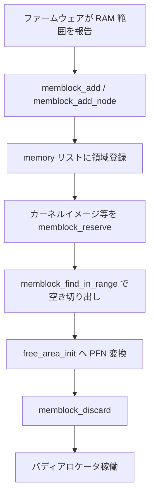

# 第1章 memblock と起動直後の物理メモリ

> **本章で読むソース**
>
> - [`mm/memblock.c` L128-L139](https://github.com/gregkh/linux/blob/v6.18.38/mm/memblock.c#L128-L139)
> - [`mm/memblock.c` L197-L202](https://github.com/gregkh/linux/blob/v6.18.38/mm/memblock.c#L197-L202)
> - [`mm/memblock.c` L307-L327](https://github.com/gregkh/linux/blob/v6.18.38/mm/memblock.c#L307-L327)
> - [`mm/memblock.c` L342-L361](https://github.com/gregkh/linux/blob/v6.18.38/mm/memblock.c#L342-L361)
> - [`mm/memblock.c` L727-L757](https://github.com/gregkh/linux/blob/v6.18.38/mm/memblock.c#L727-L757)
> - [`mm/memblock.c` L384-L396](https://github.com/gregkh/linux/blob/v6.18.38/mm/memblock.c#L384-L396)

## この章の狙い

バディアロケータが動く前に、起動直後の物理メモリをどう登録し、どう切り出すかを **memblock** から読む。
`memblock_add` と `memblock_find_in_range` が後続の `free_area_init` へ渡す土台を理解する。

## 前提

- [全体像と横断基盤](../../foundation/part01-boot/04-start-kernel-initcall.md) で `start_kernel` から `mm_init` へ進む流れを読んでいること。

## memblock の二つの領域リスト

`memblock` は「利用可能な物理メモリ」と「予約済み物理メモリ」を別リストで持つ。
起動時は固定長の初期配列を指し、必要なら動的に拡張する。

[`mm/memblock.c` L128-L139](https://github.com/gregkh/linux/blob/v6.18.38/mm/memblock.c#L128-L139)

```c
struct memblock memblock __initdata_memblock = {
	.memory.regions		= memblock_memory_init_regions,
	.memory.max		= INIT_MEMBLOCK_MEMORY_REGIONS,
	.memory.name		= "memory",

	.reserved.regions	= memblock_reserved_init_regions,
	.reserved.max		= INIT_MEMBLOCK_RESERVED_REGIONS,
	.reserved.name		= "reserved",

	.bottom_up		= false,
	.current_limit		= MEMBLOCK_ALLOC_ANYWHERE,
};
```

`memory` リストはファームウェアやアーキテクチャ固有コードが `memblock_add` で埋める。
`reserved` リストはカーネルイメージ、デバイス予約、起動パラメータで確保した領域を記録する。
割り当ては「memory から空きを探し、reserved に記録する」二段構えである。

## 領域の重なり判定

新しい領域を追加する前に、既存領域との重なりを調べる。
`memblock_addrs_overlap` は半開区間の交差を素朴に判定する。

[`mm/memblock.c` L197-L202](https://github.com/gregkh/linux/blob/v6.18.38/mm/memblock.c#L197-L202)

```c
unsigned long __init_memblock
memblock_addrs_overlap(phys_addr_t base1, phys_addr_t size1, phys_addr_t base2,
		       phys_addr_t size2)
{
	return ((base1 < (base2 + size2)) && (base2 < (base1 + size1)));
}
```

重なりがあればマージまたは分割が走り、リストの `cnt` と `total_size` が更新される。
起動直後は領域数が少ないため線形探索で足りるが、後から `memblock_double_array` で配列を倍にできる。

## 空き領域の探索方向

`memblock_find_in_range_node` はアラインメントとノード、フラグを受け取り、候補範囲から空きを探す。
`bottom_up` フラグで下位アドレス優先か上位優先かを切り替える。

[`mm/memblock.c` L307-L327](https://github.com/gregkh/linux/blob/v6.18.38/mm/memblock.c#L307-L327)

```c
static phys_addr_t __init_memblock memblock_find_in_range_node(phys_addr_t size,
					phys_addr_t align, phys_addr_t start,
					phys_addr_t end, int nid,
					enum memblock_flags flags)
{
	/* pump up @end */
	if (end == MEMBLOCK_ALLOC_ACCESSIBLE ||
	    end == MEMBLOCK_ALLOC_NOLEAKTRACE)
		end = memblock.current_limit;

	/* avoid allocating the first page */
	start = max_t(phys_addr_t, start, PAGE_SIZE);
	end = max(start, end);

	if (memblock_bottom_up())
		return __memblock_find_range_bottom_up(start, end, size, align,
						       nid, flags);
	else
		return __memblock_find_range_top_down(start, end, size, align,
						      nid, flags);
}
```

先頭ページ（物理アドレス 0）は意図的に避ける。
x86-64 では多くの場合 top-down で高いアドレスから切り出し、低い方にカーネルや DMA 用ゾーンを残す。

## ミラー RAM のフォールバック

`memblock_find_in_range` は `choose_memblock_flags` でミラー RAM を優先しうる。
見つからなければフラグを外して再試行する。

[`mm/memblock.c` L342-L361](https://github.com/gregkh/linux/blob/v6.18.38/mm/memblock.c#L342-L361)

```c
static phys_addr_t __init_memblock memblock_find_in_range(phys_addr_t start,
					phys_addr_t end, phys_addr_t size,
					phys_addr_t align)
{
	phys_addr_t ret;
	enum memblock_flags flags = choose_memblock_flags();

again:
	ret = memblock_find_in_range_node(size, align, start, end,
					    NUMA_NO_NODE, flags);

	if (!ret && (flags & MEMBLOCK_MIRROR)) {
		pr_warn_ratelimited("Could not allocate %pap bytes of mirrored memory\n",
			&size);
		flags &= ~MEMBLOCK_MIRROR;
		goto again;
	}

	return ret;
}
```

ミラー RAM は冗長性のために要求されるが、搭載量が足りなければ通常 RAM に落ちる。
起動は止めず、可用性を優先する設計である。

## memory 領域の登録 API

`memblock_add` は NUMA ノード未指定の登録、`memblock_add_node` はノード ID とフラグ付き登録である。

[`mm/memblock.c` L727-L757](https://github.com/gregkh/linux/blob/v6.18.38/mm/memblock.c#L727-L757)

```c
int __init_memblock memblock_add_node(phys_addr_t base, phys_addr_t size,
				      int nid, enum memblock_flags flags)
{
	phys_addr_t end = base + size - 1;

	memblock_dbg("%s: [%pa-%pa] nid=%d flags=%x %pS\n", __func__,
		     &base, &end, nid, flags, (void *)_RET_IP_);

	return memblock_add_range(&memblock.memory, base, size, nid, flags);
}

/**
 * memblock_add - add new memblock region
 * @base: base address of the new region
 * @size: size of the new region
 *
 * Add new memblock region [@base, @base + @size) to the "memory"
 * type. See memblock_add_range() description for mode details
 *
 * Return:
 * 0 on success, -errno on failure.
 */
int __init_memblock memblock_add(phys_addr_t base, phys_addr_t size)
{
	phys_addr_t end = base + size - 1;

	memblock_dbg("%s: [%pa-%pa] %pS\n", __func__,
		     &base, &end, (void *)_RET_IP_);

	return memblock_add_range(&memblock.memory, base, size, MAX_NUMNODES, 0);
}
```

`memblock_validate_numa_coverage` はノード未割り当てメモリが閾値を超えていないかを検査する。
ファームウェアの ACPI/SRAT 不備を起動時に検出するための安全弁である。

## memblock_discard とバディへの移行

ページアロケータが初期化されると、多くのアーキテクチャでは memblock データを破棄する。

[`mm/memblock.c` L384-L396](https://github.com/gregkh/linux/blob/v6.18.38/mm/memblock.c#L384-L396)

```c
void __init memblock_discard(void)
{
	phys_addr_t addr, size;

	if (memblock.reserved.regions != memblock_reserved_init_regions) {
		addr = __pa(memblock.reserved.regions);
		size = PAGE_ALIGN(sizeof(struct memblock_region) *
				  memblock.reserved.max);
		if (memblock_reserved_in_slab)
			kfree(memblock.reserved.regions);
		else
			memblock_free_late(addr, size);
	}
```

以降の通常割り当ては `__alloc_pages` 系へ移る。
memblock は「起動専用の粗い物理メモリ帳簿」であり、ランタイムの細かい管理はゾーンとバディが担う。

## 処理の流れ：起動時の物理メモリ登録



## 高速化と最適化の工夫

memblock は起動専用であり、ランタイムの割り当て性能は要求されない。
それでも **top-down 探索** と **固定長初期配列** により、起動パスを単純に保っている。
領域数が増えたときだけ `memblock_double_array` で配列を拡張し、平常時はヒープを使わない。
後続章で読むバディアロケータは O(1) に近い fast path を持つが、その前段として memblock は「全 RAM を一度に帳簿化する」粗い操作に徹する。

## まとめ

memblock は memory と reserved の二リストで起動直後の物理メモリを管理する。
`memblock_add` で登録し、`memblock_find_in_range` で切り出し、ページアロケータ初期化後に破棄される。
NUMA ノード付き登録とミラー RAM フォールバックは、後続のゾーン初期化の入力品質を左右する。

## 関連する章

- [folio とページ管理単位](02-folio-page-unit.md)
- [ゾーン、ノード、PFN](03-zones-nodes-pfn.md)
- [全体像と横断基盤：起動シーケンス](../../foundation/part01-boot/04-start-kernel-initcall.md)
