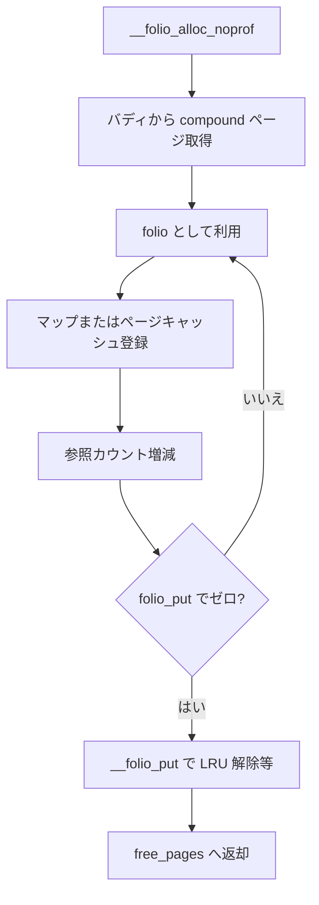

# 第2章 folio とページ管理単位

> **本章で読むソース**
>
> - [`include/linux/mm_types.h` L367-L374](https://github.com/gregkh/linux/blob/v6.18.38/include/linux/mm_types.h#L367-L374)
> - [`include/linux/mm_types.h` L375-L405](https://github.com/gregkh/linux/blob/v6.18.38/include/linux/mm_types.h#L375-L405)
> - [`include/linux/mm_types.h` L482-L491](https://github.com/gregkh/linux/blob/v6.18.38/include/linux/mm_types.h#L482-L491)
> - [`include/linux/mm.h` L1209-L1212](https://github.com/gregkh/linux/blob/v6.18.38/include/linux/mm.h#L1209-L1212)
> - [`include/linux/mm.h` L1526-L1530](https://github.com/gregkh/linux/blob/v6.18.38/include/linux/mm.h#L1526-L1530)
> - [`mm/page_alloc.c` L5280-L5287](https://github.com/gregkh/linux/blob/v6.18.38/mm/page_alloc.c#L5280-L5287)

## この章の狙い

**folio** が物理メモリの管理単位として `struct page` とどう重なるかを押さえる。
参照カウント、LRU 連結、compound ページとの関係を読み、後続の回収とページフォールト章の前提にする。

## 前提

- [memblock と起動直後の物理メモリ](01-memblock-early-memory.md) を読んでいること。

## folio の定義

コメントは folio を「物理的、仮想的、論理的に連続したバイト列」と定義する。
サイズは 2 の累乗であり、その累乗にアラインされる。

[`include/linux/mm_types.h` L367-L374](https://github.com/gregkh/linux/blob/v6.18.38/include/linux/mm_types.h#L367-L374)

```c
 * A folio is a physically, virtually and logically contiguous set
 * of bytes.  It is a power-of-two in size, and it is aligned to that
 * same power-of-two.  It is at least as large as %PAGE_SIZE.  If it is
 * in the page cache, it is at a file offset which is a multiple of that
 * power-of-two.  It may be mapped into userspace at an address which is
 * at an arbitrary page offset, but its kernel virtual address is aligned
 * to its size.
 */
```

旧来の order-N compound page は folio に統合されつつある。
ページキャッシュ、匿名メモリ、スラブ以外の多くの mm 経路が folio API を通す。

## folio 構造体の主要フィールド

`struct folio` は先頭に `struct page` と重なる union を持つ。
`flags`、`mapping`、`index`、`_mapcount`、`_refcount` が LRU と逆引きの起点になる。

[`include/linux/mm_types.h` L375-L405](https://github.com/gregkh/linux/blob/v6.18.38/include/linux/mm_types.h#L375-L405)

```c
struct folio {
	/* private: don't document the anon union */
	union {
		struct {
	/* public: */
			memdesc_flags_t flags;
			union {
				struct list_head lru;
	/* private: avoid cluttering the output */
				/* For the Unevictable "LRU list" slot */
				struct {
					/* Avoid compound_head */
					void *__filler;
	/* public: */
					unsigned int mlock_count;
	/* private: */
				};
	/* public: */
				struct dev_pagemap *pgmap;
			};
			struct address_space *mapping;
			union {
				pgoff_t index;
				unsigned long share;
			};
			union {
				void *private;
				swp_entry_t swap;
			};
			atomic_t _mapcount;
			atomic_t _refcount;
```

`mapping` が NULL でない folio は通常ファイルまたは匿名の address_space に属する。
`private` と `swap` の union は、スワップアウト中のエントリ格納にも使われる。

## struct page とのオフセット一致

`FOLIO_MATCH` マクロは `struct page` と `struct folio` の共通フィールドのオフセットをコンパイル時に検証する。
キャスト `(struct folio *)page` が安全な根拠はここにある。

[`include/linux/mm_types.h` L482-L491](https://github.com/gregkh/linux/blob/v6.18.38/include/linux/mm_types.h#L482-L491)

```c
#define FOLIO_MATCH(pg, fl)						\
	static_assert(offsetof(struct page, pg) == offsetof(struct folio, fl))
FOLIO_MATCH(flags, flags);
FOLIO_MATCH(lru, lru);
FOLIO_MATCH(mapping, mapping);
FOLIO_MATCH(compound_head, lru);
FOLIO_MATCH(__folio_index, index);
FOLIO_MATCH(private, private);
FOLIO_MATCH(_mapcount, _mapcount);
FOLIO_MATCH(_refcount, _refcount);
```

移行期のため folio は複数の `struct page` スロットを内包する。
THP や hugetlb では `_nr_pages` や hugetlb 専用フィールドが後半スロットに載る。

## 参照カウントの操作

`folio_put` は参照がゼロになれば `__folio_put` で解放する。
割り込みコンテキストやスピンロック保持中でも呼べる。

[`include/linux/mm.h` L1526-L1530](https://github.com/gregkh/linux/blob/v6.18.38/include/linux/mm.h#L1526-L1530)

```c
static inline void folio_put(struct folio *folio)
{
	if (folio_put_testzero(folio))
		__folio_put(folio);
}
```

`folio_put_testzero` は内部で `put_page_testzero` を呼ぶ薄いラッパーである。

[`include/linux/mm.h` L1209-L1212](https://github.com/gregkh/linux/blob/v6.18.38/include/linux/mm.h#L1209-L1212)

```c
static inline int folio_put_testzero(struct folio *folio)
{
	return put_page_testzero(&folio->page);
}
```

参照カウントと `_mapcount` は別物である。
マップ数がゼロでも参照が残っていれば folio は解放されない。

## folio 割り当ての入口

`__folio_alloc_noprof` は `__alloc_pages_noprof` に `__GFP_COMP` を付け、compound ページとして確保する。
戻り値は `page_rmappable_folio` で folio ポインタに変換される。

[`mm/page_alloc.c` L5280-L5287](https://github.com/gregkh/linux/blob/v6.18.38/mm/page_alloc.c#L5280-L5287)

```c
struct folio *__folio_alloc_noprof(gfp_t gfp, unsigned int order, int preferred_nid,
		nodemask_t *nodemask)
{
	struct page *page = __alloc_pages_noprof(gfp | __GFP_COMP, order,
					preferred_nid, nodemask);
	return page_rmappable_folio(page);
}
EXPORT_SYMBOL(__folio_alloc_noprof);
```

order 0 の通常ページも folio として扱える。
THP は order が大きい folio として同じ API 族に乗る。

## 処理の流れ：folio のライフサイクル



## 高速化と最適化の工夫

folio 化は API 表面を統一するだけでなく、**compound ページのメタデータアクセスを1構造体に集約**する。
`FOLIO_MATCH` によるオフセット検証で、`page` から `folio` へのキャストコストをゼロに保つ。
LRU や rmap は folio 単位で走査でき、THP では基底ページだけでなく全体を1エントリとして扱える。

> **7.x 系での変化**
> v7.1.3 では [`filemap_alloc_folio_noprof`](https://github.com/gregkh/linux/blob/v7.1.3/mm/filemap.c#L994-L1014) が第3引数 `struct mempolicy *policy` を受け取り、`policy` 非 NULL 時は [`folio_alloc_mpol_noprof`](https://github.com/gregkh/linux/blob/v7.1.3/mm/filemap.c#L1001-L1002) へ委譲する。
> v6.18.38 の [`filemap_alloc_folio_noprof`](https://github.com/gregkh/linux/blob/v6.18.38/mm/filemap.c#L1006-L1022) は `(gfp, order)` のみで、NUMA 方針は cpuset spread 分岐に限定される。

## まとめ

folio は 2 の累乗サイズの連続物理メモリを表す管理単位である。
`struct page` とオフセット共有し、`folio_put` で参照ゼロ時に解放される。
`__folio_alloc_noprof` が物理割り当てから folio への橋渡しを担う。

## 関連する章

- [ゾーン、ノード、PFN](03-zones-nodes-pfn.md)
- [`__alloc_pages` の fast path と slow path](../part01-physical/04-alloc-pages-path.md)
- [LRU、MGLRU、workingset](../part04-reclaim/23-lru-mglru-workingset.md)
