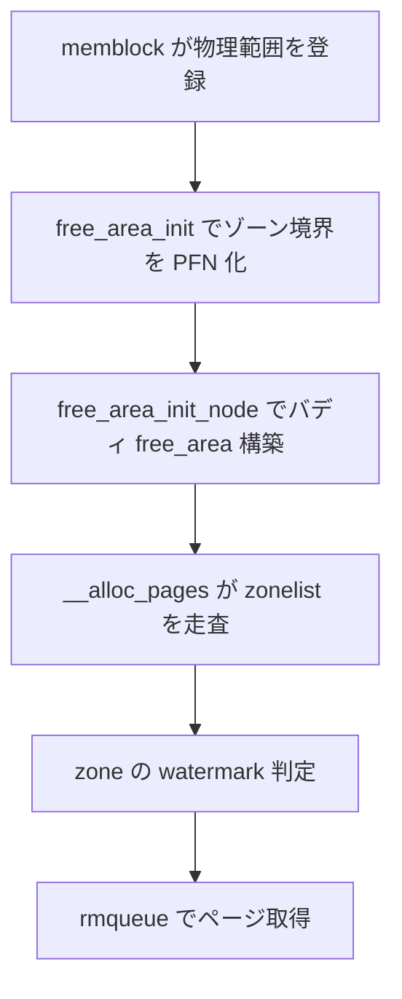

# 第3章 ゾーン、ノード、PFN

> **本章で読むソース**
>
> - [`include/linux/mmzone.h` L879-L923](https://github.com/gregkh/linux/blob/v6.18.38/include/linux/mmzone.h#L879-L923)
> - [`include/linux/mmzone.h` L1385-L1428](https://github.com/gregkh/linux/blob/v6.18.38/include/linux/mmzone.h#L1385-L1428)
> - [`mm/mm_init.c` L1824-L1853](https://github.com/gregkh/linux/blob/v6.18.38/mm/mm_init.c#L1824-L1853)
> - [`mm/mm_init.c` L1860-L1909](https://github.com/gregkh/linux/blob/v6.18.38/mm/mm_init.c#L1860-L1909)
> - [`mm/page_alloc.c` L3771-L3791](https://github.com/gregkh/linux/blob/v6.18.38/mm/page_alloc.c#L3771-L3791)
> - [`mm/mm_init.c` L1717-L1748](https://github.com/gregkh/linux/blob/v6.18.38/mm/mm_init.c#L1717-L1748)

## この章の狙い

**PFN**（Page Frame Number）から **ゾーン**、**NUMA ノード**（`pglist_data`）への階層を理解する。
`free_area_init` が memblock の情報をゾーン境界へ写し、バディアロケータが参照する `zone` 構造体の意味を押さえる。

## 前提

- [memblock と起動直後の物理メモリ](01-memblock-early-memory.md)
- [folio とページ管理単位](02-folio-page-unit.md)

## zone 構造体と watermark

各ゾーンは watermark、per-CPU pageset、空きページ統計を持つ。
`_watermark` 配列は min、low、high の閾値であり、回収の起動条件に直結する。

[`include/linux/mmzone.h` L879-L923](https://github.com/gregkh/linux/blob/v6.18.38/include/linux/mmzone.h#L879-L923)

```c
struct zone {
	/* Read-mostly fields */

	/* zone watermarks, access with *_wmark_pages(zone) macros */
	unsigned long _watermark[NR_WMARK];
	unsigned long watermark_boost;

	unsigned long nr_reserved_highatomic;
	unsigned long nr_free_highatomic;

	/*
	 * We don't know if the memory that we're going to allocate will be
	 * freeable or/and it will be released eventually, so to avoid totally
	 * wasting several GB of ram we must reserve some of the lower zone
	 * memory (otherwise we risk to run OOM on the lower zones despite
	 * there being tons of freeable ram on the higher zones).  This array is
	 * recalculated at runtime if the sysctl_lowmem_reserve_ratio sysctl
	 * changes.
	 */
	long lowmem_reserve[MAX_NR_ZONES];

#ifdef CONFIG_NUMA
	int node;
#endif
	struct pglist_data	*zone_pgdat;
	struct per_cpu_pages	__percpu *per_cpu_pageset;
	struct per_cpu_zonestat	__percpu *per_cpu_zonestats;
	/*
	 * the high and batch values are copied to individual pagesets for
	 * faster access
	 */
	int pageset_high_min;
	int pageset_high_max;
	int pageset_batch;

#ifndef CONFIG_SPARSEMEM
	/*
	 * Flags for a pageblock_nr_pages block. See pageblock-flags.h.
	 * In SPARSEMEM, this map is stored in struct mem_section
	 */
	unsigned long		*pageblock_flags;
#endif /* CONFIG_SPARSEMEM */

	/* zone_start_pfn == zone_start_paddr >> PAGE_SHIFT */
	unsigned long		zone_start_pfn;
```

`lowmem_reserve` は高位ゾーンへの割り当てが低位ゾーンを枯渇させないための予約である。
DMA や DMA32 から NORMAL へフォールバックするときに効く。

## pglist_data と zonelist

`pglist_data` は1 NUMA ノード分のゾーン配列と zonelist を持つ。
zonelist は割り当て時に走査するゾーンの優先順序である。

[`include/linux/mmzone.h` L1385-L1428](https://github.com/gregkh/linux/blob/v6.18.38/include/linux/mmzone.h#L1385-L1428)

```c
typedef struct pglist_data {
	/*
	 * node_zones contains just the zones for THIS node. Not all of the
	 * zones may be populated, but it is the full list. It is referenced by
	 * this node's node_zonelists as well as other node's node_zonelists.
	 */
	struct zone node_zones[MAX_NR_ZONES];

	/*
	 * node_zonelists contains references to all zones in all nodes.
	 * Generally the first zones will be references to this node's
	 * node_zones.
	 */
	struct zonelist node_zonelists[MAX_ZONELISTS];

	int nr_zones; /* number of populated zones in this node */
#ifdef CONFIG_FLATMEM	/* means !SPARSEMEM */
	struct page *node_mem_map;
#ifdef CONFIG_PAGE_EXTENSION
	struct page_ext *node_page_ext;
#endif
#endif
#if defined(CONFIG_MEMORY_HOTPLUG) || defined(CONFIG_DEFERRED_STRUCT_PAGE_INIT)
	/*
	 * Must be held any time you expect node_start_pfn,
	 * node_present_pages, node_spanned_pages or nr_zones to stay constant.
	 * Also synchronizes pgdat->first_deferred_pfn during deferred page
	 * init.
	 *
	 * pgdat_resize_lock() and pgdat_resize_unlock() are provided to
	 * manipulate node_size_lock without checking for CONFIG_MEMORY_HOTPLUG
	 * or CONFIG_DEFERRED_STRUCT_PAGE_INIT.
	 *
	 * Nests above zone->lock and zone->span_seqlock
	 */
	spinlock_t node_size_lock;
#endif
	unsigned long node_start_pfn;
	unsigned long node_present_pages; /* total number of physical pages */
	unsigned long node_spanned_pages; /* total size of physical page
					     range, including holes */
	int node_id;
	wait_queue_head_t kswapd_wait;
	wait_queue_head_t pfmemalloc_wait;
```

`kswapd_wait` は当該ノードのバックグラウンド回収スレッドの待ち行列である。
[vmscan と回収経路](../part04-reclaim/15-vmscan-reclaim.md) で再訪する。

## free_area_init によるゾーン境界の確定

`free_area_init` はアーキテクチャが渡す `max_zone_pfn` から各ゾーンの PFN 範囲を計算する。
隣接ゾーンの境界が一致すれば、そのゾーンは空とみなされる。

[`mm/mm_init.c` L1824-L1853](https://github.com/gregkh/linux/blob/v6.18.38/mm/mm_init.c#L1824-L1853)

```c
void __init free_area_init(unsigned long *max_zone_pfn)
{
	unsigned long start_pfn, end_pfn;
	int i, nid, zone;
	bool descending;

	/* Record where the zone boundaries are */
	memset(arch_zone_lowest_possible_pfn, 0,
				sizeof(arch_zone_lowest_possible_pfn));
	memset(arch_zone_highest_possible_pfn, 0,
				sizeof(arch_zone_highest_possible_pfn));

	start_pfn = PHYS_PFN(memblock_start_of_DRAM());
	descending = arch_has_descending_max_zone_pfns();

	for (i = 0; i < MAX_NR_ZONES; i++) {
		if (descending)
			zone = MAX_NR_ZONES - i - 1;
		else
			zone = i;

		if (zone == ZONE_MOVABLE)
			continue;

		end_pfn = max(max_zone_pfn[zone], start_pfn);
		arch_zone_lowest_possible_pfn[zone] = start_pfn;
		arch_zone_highest_possible_pfn[zone] = end_pfn;

		start_pfn = end_pfn;
	}
```

x86-64 では ZONE_DMA、ZONE_DMA32、ZONE_NORMAL、ZONE_MOVABLE などがこの配列で表現される。
PFN は `物理アドレス >> PAGE_SHIFT` で得る整数インデックスである。

## ノードごとの初期化ループ

ゾーン範囲をログ出力したあと、各オンラインノードで `free_area_init_node` を呼ぶ。

[`mm/mm_init.c` L1860-L1909](https://github.com/gregkh/linux/blob/v6.18.38/mm/mm_init.c#L1860-L1909)

```c
	pr_info("Zone ranges:\n");
	for (i = 0; i < MAX_NR_ZONES; i++) {
		if (i == ZONE_MOVABLE)
			continue;
		pr_info("  %-8s ", zone_names[i]);
		if (arch_zone_lowest_possible_pfn[i] ==
				arch_zone_highest_possible_pfn[i])
			pr_cont("empty\n");
		else
			pr_cont("[mem %#018Lx-%#018Lx]\n",
				(u64)arch_zone_lowest_possible_pfn[i]
					<< PAGE_SHIFT,
				((u64)arch_zone_highest_possible_pfn[i]
					<< PAGE_SHIFT) - 1);
	}

	/* Print out the PFNs ZONE_MOVABLE begins at in each node */
	pr_info("Movable zone start for each node\n");
	for (i = 0; i < MAX_NUMNODES; i++) {
		if (zone_movable_pfn[i])
			pr_info("  Node %d: %#018Lx\n", i,
			       (u64)zone_movable_pfn[i] << PAGE_SHIFT);
	}

	/*
	 * Print out the early node map, and initialize the
	 * subsection-map relative to active online memory ranges to
	 * enable future "sub-section" extensions of the memory map.
	 */
	pr_info("Early memory node ranges\n");
	for_each_mem_pfn_range(i, MAX_NUMNODES, &start_pfn, &end_pfn, &nid) {
		pr_info("  node %3d: [mem %#018Lx-%#018Lx]\n", nid,
			(u64)start_pfn << PAGE_SHIFT,
			((u64)end_pfn << PAGE_SHIFT) - 1);
		subsection_map_init(start_pfn, end_pfn - start_pfn);
	}

	/* Initialise every node */
	mminit_verify_pageflags_layout();
	setup_nr_node_ids();
	set_pageblock_order();

	for_each_node(nid) {
		pg_data_t *pgdat;

		if (!node_online(nid))
			alloc_offline_node_data(nid);

		pgdat = NODE_DATA(nid);
		free_area_init_node(nid);
```

`for_each_mem_pfn_range` は memblock が登録した PFN 範囲をノード ID 付きで列挙する。
ここで subsection マップも初期化され、メモリホットプラグの下地になる。

## free_area_init_node とバディ free_area

各ノードでは PFN 範囲を確定し、`free_area_init_core` でゾーンごとのバディ `free_area` を構築する。
MGLRU 有効時は `lru_gen_init_pgdat` もここで呼ばれる。

[`mm/mm_init.c` L1717-L1748](https://github.com/gregkh/linux/blob/v6.18.38/mm/mm_init.c#L1717-L1748)

```c
static void __init free_area_init_node(int nid)
{
	pg_data_t *pgdat = NODE_DATA(nid);
	unsigned long start_pfn = 0;
	unsigned long end_pfn = 0;

	/* pg_data_t should be reset to zero when it's allocated */
	WARN_ON(pgdat->nr_zones || pgdat->kswapd_highest_zoneidx);

	get_pfn_range_for_nid(nid, &start_pfn, &end_pfn);

	pgdat->node_id = nid;
	pgdat->node_start_pfn = start_pfn;
	pgdat->per_cpu_nodestats = NULL;

	if (start_pfn != end_pfn) {
		pr_info("Initmem setup node %d [mem %#018Lx-%#018Lx]\n", nid,
			(u64)start_pfn << PAGE_SHIFT,
			end_pfn ? ((u64)end_pfn << PAGE_SHIFT) - 1 : 0);

		calculate_node_totalpages(pgdat, start_pfn, end_pfn);
	} else {
		pr_info("Initmem setup node %d as memoryless\n", nid);

		reset_memoryless_node_totalpages(pgdat);
	}

	alloc_node_mem_map(pgdat);
	pgdat_set_deferred_range(pgdat);

	free_area_init_core(pgdat);
	lru_gen_init_pgdat(pgdat);
}
```

## zonelist 走査の入口

割り当ては `get_page_from_freelist` が zonelist を上から走査する。
`preferred_zoneref` から始まり、watermark を満たすゾーンで `rmqueue` が呼ばれる。

[`mm/page_alloc.c` L3771-L3791](https://github.com/gregkh/linux/blob/v6.18.38/mm/page_alloc.c#L3771-L3791)

```c
static struct page *
get_page_from_freelist(gfp_t gfp_mask, unsigned int order, int alloc_flags,
						const struct alloc_context *ac)
{
	struct zoneref *z;
	struct zone *zone;
	struct pglist_data *last_pgdat = NULL;
	bool last_pgdat_dirty_ok = false;
	bool no_fallback;
	bool skip_kswapd_nodes = nr_online_nodes > 1;
	bool skipped_kswapd_nodes = false;

retry:
	/*
	 * Scan zonelist, looking for a zone with enough free.
	 * See also cpuset_current_node_allowed() comment in kernel/cgroup/cpuset.c.
	 */
	no_fallback = alloc_flags & ALLOC_NOFRAGMENT;
	z = ac->preferred_zoneref;
	for_next_zone_zonelist_nodemask(zone, z, ac->highest_zoneidx,
					ac->nodemask) {
```

NUMA マシンではローカルノードのゾーンを優先し、不足時にリモートノードへ広がる。
`highest_zoneidx` は GFP フラグから導かれる「これより低位のゾーンには落ちない」境界である。

## 処理の流れ：PFN から割り当てまで



## 高速化と最適化の工夫

ゾーン分割は DMA 制約と回収ポリシーを分離するための設計である。
割り当て fast path では **zonelist の先頭付近で成功させる** ことでリモートメモリアクセスを避ける。
`per_cpu_pageset` はゾーンごとにバッチ値を保持し、毎回 `zone->lock` を取らない割り当てを可能にする（[第6章](../part01-physical/06-percpu-pageset-compaction.md)）。

## まとめ

PFN は物理ページのインデックスであり、ゾーンとノードが管理境界を決める。
`free_area_init` が memblock 情報をゾーン構造へ写し、`get_page_from_freelist` が zonelist 走査でページを探す。
watermark と `lowmem_reserve` は後続の回収とフォールバックのトリガーである。

## 関連する章

- [watermark とゾーン fallback](../part01-physical/05-watermark-zone-fallback.md)
- [NUMA バランシングの fault 側](../part05-advanced/20-numa-fault-balancing.md)
