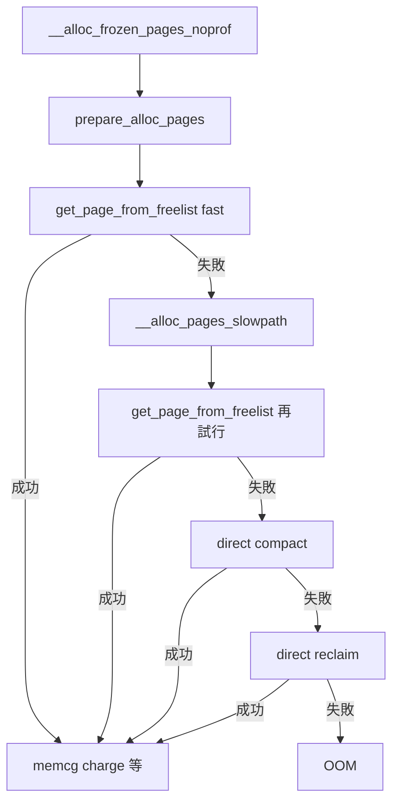

# 第4章 `__alloc_pages` の fast path と slow path

> **本章で読むソース**
>
> - [`mm/page_alloc.c` L5200-L5241](https://github.com/gregkh/linux/blob/v6.18.38/mm/page_alloc.c#L5200-L5241)
> - [`mm/page_alloc.c` L3771-L3791](https://github.com/gregkh/linux/blob/v6.18.38/mm/page_alloc.c#L3771-L3791)
> - [`mm/page_alloc.c` L3381-L3400](https://github.com/gregkh/linux/blob/v6.18.38/mm/page_alloc.c#L3381-L3400)
> - [`mm/page_alloc.c` L4672-L4758](https://github.com/gregkh/linux/blob/v6.18.38/mm/page_alloc.c#L4672-L4758)
> - [`mm/page_alloc.c` L4769-L4774](https://github.com/gregkh/linux/blob/v6.18.38/mm/page_alloc.c#L4769-L4774)
> - [`mm/page_alloc.c` L5268-L5278](https://github.com/gregkh/linux/blob/v6.18.38/mm/page_alloc.c#L5268-L5278)

## この章の狙い

物理ページ割り当ての中心 **`__alloc_frozen_pages_noprof`**（`__alloc_pages_noprof` の本体）が、fast path で何を試し、失敗時に slow path へどう落ちるかを追う。
`get_page_from_freelist` と `__alloc_pages_slowpath` の役割分担を理解する。

## 前提

- [ゾーン、ノード、PFN](../part00-foundation/03-zones-nodes-pfn.md)

## 割り当ての心臓部

コメントは `__alloc_frozen_pages_noprof` を「zoned buddy allocator の心臓」と呼ぶ。
`prepare_alloc_pages` で zonelist と migratetype を整え、まず freelist から取る。

[`mm/page_alloc.c` L5200-L5241](https://github.com/gregkh/linux/blob/v6.18.38/mm/page_alloc.c#L5200-L5241)

```c
/*
 * This is the 'heart' of the zoned buddy allocator.
 */
struct page *__alloc_frozen_pages_noprof(gfp_t gfp, unsigned int order,
		int preferred_nid, nodemask_t *nodemask)
{
	struct page *page;
	unsigned int alloc_flags = ALLOC_WMARK_LOW;
	gfp_t alloc_gfp; /* The gfp_t that was actually used for allocation */
	struct alloc_context ac = { };

	/*
	 * There are several places where we assume that the order value is sane
	 * so bail out early if the request is out of bound.
	 */
	if (WARN_ON_ONCE_GFP(order > MAX_PAGE_ORDER, gfp))
		return NULL;

	gfp &= gfp_allowed_mask;
	/*
	 * Apply scoped allocation constraints. This is mainly about GFP_NOFS
	 * resp. GFP_NOIO which has to be inherited for all allocation requests
	 * from a particular context which has been marked by
	 * memalloc_no{fs,io}_{save,restore}. And PF_MEMALLOC_PIN which ensures
	 * movable zones are not used during allocation.
	 */
	gfp = current_gfp_context(gfp);
	alloc_gfp = gfp;
	if (!prepare_alloc_pages(gfp, order, preferred_nid, nodemask, &ac,
			&alloc_gfp, &alloc_flags))
		return NULL;

	/*
	 * Forbid the first pass from falling back to types that fragment
	 * memory until all local zones are considered.
	 */
	alloc_flags |= alloc_flags_nofragment(zonelist_zone(ac.preferred_zoneref), gfp);

	/* First allocation attempt */
	page = get_page_from_freelist(alloc_gfp, order, alloc_flags, &ac);
	if (likely(page))
		goto out;
```

fast path は `ALLOC_WMARK_LOW` と `ALLOC_NOFRAGMENT` を組み合わせ、局所ゾーンでの成功を優先する。
`likely(page)` が偽なら slow path へ進む。

## get_page_from_freelist の zonelist 走査

zonelist を上から走査し、watermark を満たすゾーンで `try_this_zone` へ進む。
cpuset や dirty 制限でゾーンがスキップされる場合がある。

[`mm/page_alloc.c` L3771-L3791](https://github.com/gregkh/linux/blob/v6.18.38/mm/page_alloc.c#L3771-L3791)

```c
static struct page *
get_page_from_freelist(gfp_t gfp_mask, unsigned int order, int alloc_flags,
						const struct alloc_context *ac)
{
	struct zoneref *z;
	struct zone *zone;
	struct pglist_data *last_pgdat = NULL;
	bool last_pgdat_dirty_ok = false;
	bool no_fallback;
	bool skip_kswapd_nodes = nr_online_nodes > 1;
	bool skipped_kswapd_nodes = false;

retry:
	/*
	 * Scan zonelist, looking for a zone with enough free.
	 * See also cpuset_current_node_allowed() comment in kernel/cgroup/cpuset.c.
	 */
	no_fallback = alloc_flags & ALLOC_NOFRAGMENT;
	z = ac->preferred_zoneref;
	for_next_zone_zonelist_nodemask(zone, z, ac->highest_zoneidx,
					ac->nodemask) {
```

各ゾーンでは `zone_watermark_fast` が先に評価される（[第5章](05-watermark-zone-fallback.md)）。
通過したゾーンで `rmqueue_pcplist` または `rmqueue_buddy` が呼ばれる。

## rmqueue：PCP 優先、バディへフォールバック

order が PCP 許容範囲なら per-CPU リストから取り、空ならバディ free_area へ落ちる。

[`mm/page_alloc.c` L3381-L3400](https://github.com/gregkh/linux/blob/v6.18.38/mm/page_alloc.c#L3381-L3400)

```c
	if (likely(pcp_allowed_order(order))) {
		page = rmqueue_pcplist(preferred_zone, zone, order,
				       migratetype, alloc_flags);
		if (likely(page))
			goto out;
	}

	page = rmqueue_buddy(preferred_zone, zone, order, alloc_flags,
							migratetype);

out:
	/* Separate test+clear to avoid unnecessary atomics */
	if ((alloc_flags & ALLOC_KSWAPD) &&
	    unlikely(test_bit(ZONE_BOOSTED_WATERMARK, &zone->flags))) {
		clear_bit(ZONE_BOOSTED_WATERMARK, &zone->flags);
		wakeup_kswapd(zone, 0, 0, zone_idx(zone));
	}

	VM_BUG_ON_PAGE(page && bad_range(zone, page), page);
	return page;
```

PCP 成功が `likely` であるのは、order-0 割り当ての大半がロックなしで終わるためである。

## slow path の再構成

fast path 失敗後、`__alloc_pages_slowpath` は alloc_flags を精密化し、zonelist の起点を再計算する。
その後 `get_page_from_freelist` を再試行し、それでも失敗すれば compaction や direct reclaim へ進む。

[`mm/page_alloc.c` L4672-L4758](https://github.com/gregkh/linux/blob/v6.18.38/mm/page_alloc.c#L4672-L4758)

```c
static inline struct page *
__alloc_pages_slowpath(gfp_t gfp_mask, unsigned int order,
						struct alloc_context *ac)
{
	bool can_direct_reclaim = gfp_mask & __GFP_DIRECT_RECLAIM;
	bool can_compact = gfp_compaction_allowed(gfp_mask);
	bool nofail = gfp_mask & __GFP_NOFAIL;
	const bool costly_order = order > PAGE_ALLOC_COSTLY_ORDER;
	struct page *page = NULL;
	unsigned int alloc_flags;
	unsigned long did_some_progress;
	enum compact_priority compact_priority;
	enum compact_result compact_result;
	int compaction_retries;
	int no_progress_loops;
	unsigned int cpuset_mems_cookie;
	unsigned int zonelist_iter_cookie;
	int reserve_flags;

	if (unlikely(nofail)) {
		/*
		 * We most definitely don't want callers attempting to
		 * allocate greater than order-1 page units with __GFP_NOFAIL.
		 */
		WARN_ON_ONCE(order > 1);
		/*
		 * Also we don't support __GFP_NOFAIL without __GFP_DIRECT_RECLAIM,
		 * otherwise, we may result in lockup.
		 */
		WARN_ON_ONCE(!can_direct_reclaim);
		/*
		 * PF_MEMALLOC request from this context is rather bizarre
		 * because we cannot reclaim anything and only can loop waiting
		 * for somebody to do a work for us.
		 */
		WARN_ON_ONCE(current->flags & PF_MEMALLOC);
	}

restart:
	compaction_retries = 0;
	no_progress_loops = 0;
	compact_result = COMPACT_SKIPPED;
	compact_priority = DEF_COMPACT_PRIORITY;
	cpuset_mems_cookie = read_mems_allowed_begin();
	zonelist_iter_cookie = zonelist_iter_begin();

	/*
	 * The fast path uses conservative alloc_flags to succeed only until
	 * kswapd needs to be woken up, and to avoid the cost of setting up
	 * alloc_flags precisely. So we do that now.
	 */
	alloc_flags = gfp_to_alloc_flags(gfp_mask, order);

	/*
	 * We need to recalculate the starting point for the zonelist iterator
	 * because we might have used different nodemask in the fast path, or
	 * there was a cpuset modification and we are retrying - otherwise we
	 * could end up iterating over non-eligible zones endlessly.
	 */
	ac->preferred_zoneref = first_zones_zonelist(ac->zonelist,
					ac->highest_zoneidx, ac->nodemask);
	if (!zonelist_zone(ac->preferred_zoneref))
		goto nopage;

	/*
	 * Check for insane configurations where the cpuset doesn't contain
	 * any suitable zone to satisfy the request - e.g. non-movable
	 * GFP_HIGHUSER allocations from MOVABLE nodes only.
	 */
	if (cpusets_insane_config() && (gfp_mask & __GFP_HARDWALL)) {
		struct zoneref *z = first_zones_zonelist(ac->zonelist,
					ac->highest_zoneidx,
					&cpuset_current_mems_allowed);
		if (!zonelist_zone(z))
			goto nopage;
	}

	if (alloc_flags & ALLOC_KSWAPD)
		wake_all_kswapds(order, gfp_mask, ac);

	/*
	 * The adjusted alloc_flags might result in immediate success, so try
	 * that first
	 */
	page = get_page_from_freelist(gfp_mask, order, alloc_flags, ac);
	if (page)
		goto got_pg;
```

`__GFP_DIRECT_RECLAIM` が無いと reclaim ループに入れず、すぐ失敗しうる。
`__GFP_NOFAIL` は order-0 かつ direct reclaim 可能な文脈に限定される。

## costly order は compaction を先に試す

高次オーダや非 MOVABLE タイプでは、reclaim より compaction を先に呼ぶ分岐がある。

[`mm/page_alloc.c` L4769-L4774](https://github.com/gregkh/linux/blob/v6.18.38/mm/page_alloc.c#L4769-L4774)

```c
	if (can_direct_reclaim && can_compact &&
			(costly_order ||
			   (order > 0 && ac->migratetype != MIGRATE_MOVABLE))
			&& !gfp_pfmemalloc_allowed(gfp_mask)) {
		page = __alloc_pages_direct_compact(gfp_mask, order,
						alloc_flags, ac,
```

連続物理ページが散在しているとき、回収だけでは穴が埋まらない。
compaction がページを移動して大きな free block を作る（[第6章](06-percpu-pageset-compaction.md)）。

## 公開 API 層

`__alloc_pages_noprof` は frozen ページを取得し、参照カウントを立てて返す。

[`mm/page_alloc.c` L5268-L5278](https://github.com/gregkh/linux/blob/v6.18.38/mm/page_alloc.c#L5268-L5278)

```c
struct page *__alloc_pages_noprof(gfp_t gfp, unsigned int order,
		int preferred_nid, nodemask_t *nodemask)
{
	struct page *page;

	page = __alloc_frozen_pages_noprof(gfp, order, preferred_nid, nodemask);
	if (page)
		set_page_refcounted(page);
	return page;
}
EXPORT_SYMBOL(__alloc_pages_noprof);
```

memcg が有効で `__GFP_ACCOUNT` が付いていれば、成功後に `__memcg_kmem_charge_page` が走る。

## 処理の流れ



## 高速化と最適化の工夫

fast path は **粗い alloc_flags** で watermark 判定と zonelist 走査を最小化する。
order-0 では `rmqueue_pcplist` が `likely` 分支であり、ゾーンロックを避ける。
slow path に落ちたときだけ `gfp_to_alloc_flags` で精密化し、kswapd 起床や compaction のコストを払う。

## まとめ

`__alloc_frozen_pages_noprof` が zonelist 走査と PCP、バディ rmqueue を fast path で試す。
失敗時は `__alloc_pages_slowpath` が reclaim と compaction を段階的に適用する。
GFP フラグは direct reclaim や compaction の可否を決める契約である。

## 関連する章

- [watermark とゾーン fallback](05-watermark-zone-fallback.md)
- [per-CPU pageset と compaction](06-percpu-pageset-compaction.md)
- [vmscan と回収経路](../part04-reclaim/15-vmscan-reclaim.md)
