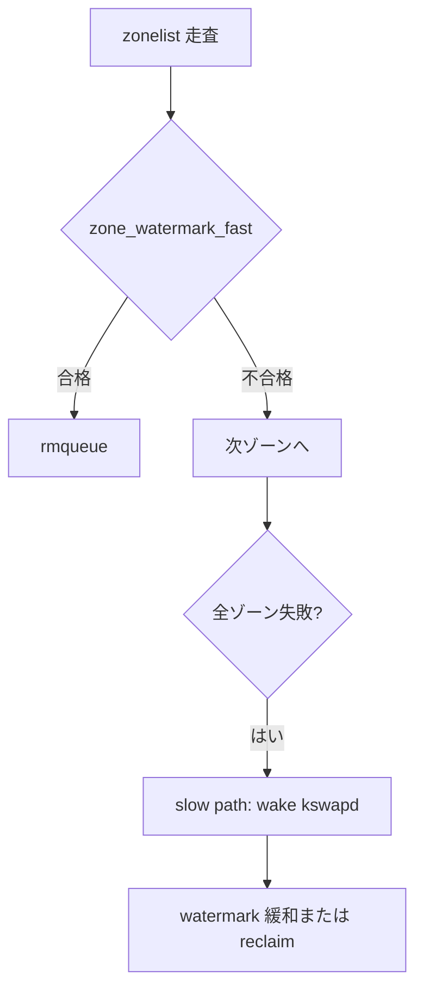

# 第5章 watermark とゾーン fallback

> **本章で読むソース**
>
> - [`include/linux/mmzone.h` L882-L898](https://github.com/gregkh/linux/blob/v6.18.38/include/linux/mmzone.h#L882-L898)
> - [`mm/page_alloc.c` L3651-L3694](https://github.com/gregkh/linux/blob/v6.18.38/mm/page_alloc.c#L3651-L3694)
> - [`mm/page_alloc.c` L3869-L3898](https://github.com/gregkh/linux/blob/v6.18.38/mm/page_alloc.c#L3869-L3898)
> - [`mm/page_alloc.c` L3828-L3841](https://github.com/gregkh/linux/blob/v6.18.38/mm/page_alloc.c#L3828-L3841)
> - [`mm/page_alloc.c` L3851-L3855](https://github.com/gregkh/linux/blob/v6.18.38/mm/page_alloc.c#L3851-L3855)
> - [`mm/page_alloc.c` L4749-L4750](https://github.com/gregkh/linux/blob/v6.18.38/mm/page_alloc.c#L4749-L4750)

## この章の狙い

ゾーンごとの **watermark**（min、low、high）が割り当て可否と kswapd 起床をどう決めるかを読む。
`zone_watermark_fast` の order-0 特例と zonelist fallback の条件を押さえる。

## 前提

- [`__alloc_pages` の fast path と slow path](04-alloc-pages-path.md)
- [ゾーン、ノード、PFN](../part00-foundation/03-zones-nodes-pfn.md)

## watermark 配列の意味

`zone` は `_watermark[NR_WMARK]` と `lowmem_reserve` を持つ。
min は緊急時、low は kswapd 起床、high は平常時の目安である。

[`include/linux/mmzone.h` L882-L898](https://github.com/gregkh/linux/blob/v6.18.38/include/linux/mmzone.h#L882-L898)

```c
	/* zone watermarks, access with *_wmark_pages(zone) macros */
	unsigned long _watermark[NR_WMARK];
	unsigned long watermark_boost;

	unsigned long nr_reserved_highatomic;
	unsigned long nr_free_highatomic;

	/*
	 * We don't know if the memory that we're going to allocate will be
	 * freeable or/and it will be released eventually, so to avoid totally
	 * wasting several GB of ram we must reserve some of the lower zone
	 * memory (otherwise we risk to run OOM on the lower zones despite
	 * there being tons of freeable ram on the higher zones).  This array is
	 * recalculated at runtime if the sysctl_lowmem_reserve_ratio sysctl
	 * changes.
	 */
	long lowmem_reserve[MAX_NR_ZONES];
```

`watermark_boost` は一時的に min を引き上げ、高次オーダ割り当ての断片化を抑える。

## zone_watermark_fast の order-0 高速判定

order-0 では `NR_FREE_PAGES` から予約分を引いた usable_free を mark と比較する。
高次オーダでは `__zone_watermark_ok` でバディの空きブロックまで数える。

[`mm/page_alloc.c` L3651-L3694](https://github.com/gregkh/linux/blob/v6.18.38/mm/page_alloc.c#L3651-L3694)

```c
static inline bool zone_watermark_fast(struct zone *z, unsigned int order,
				unsigned long mark, int highest_zoneidx,
				unsigned int alloc_flags, gfp_t gfp_mask)
{
	long free_pages;

	free_pages = zone_page_state(z, NR_FREE_PAGES);

	/*
	 * Fast check for order-0 only. If this fails then the reserves
	 * need to be calculated.
	 */
	if (!order) {
		long usable_free;
		long reserved;

		usable_free = free_pages;
		reserved = __zone_watermark_unusable_free(z, 0, alloc_flags);

		/* reserved may over estimate high-atomic reserves. */
		usable_free -= min(usable_free, reserved);
		if (usable_free > mark + z->lowmem_reserve[highest_zoneidx])
			return true;
	}

	if (__zone_watermark_ok(z, order, mark, highest_zoneidx, alloc_flags,
					free_pages))
		return true;

	/*
	 * Ignore watermark boosting for __GFP_HIGH order-0 allocations
	 * when checking the min watermark. The min watermark is the
	 * point where boosting is ignored so that kswapd is woken up
	 * when below the low watermark.
	 */
	if (unlikely(!order && (alloc_flags & ALLOC_MIN_RESERVE) && z->watermark_boost
		&& ((alloc_flags & ALLOC_WMARK_MASK) == WMARK_MIN))) {
		mark = z->_watermark[WMARK_MIN];
		return __zone_watermark_ok(z, order, mark, highest_zoneidx,
					alloc_flags, free_pages);
	}

	return false;
}
```

fast path の大半は order-0 であるため、この分岐が頻繁に効く。

## get_page_from_freelist での watermark 適用

まず high watermark で `ZONE_BELOW_HIGH` を立て、次に alloc_flags の WMARK マスクで判定する。
`ALLOC_NO_WATERMARKS` は PF_MEMALLOC 等の特権文脈で watermark を無視する。

[`mm/page_alloc.c` L3869-L3898](https://github.com/gregkh/linux/blob/v6.18.38/mm/page_alloc.c#L3869-L3898)

```c
		mark = high_wmark_pages(zone);
		if (zone_watermark_fast(zone, order, mark,
					ac->highest_zoneidx, alloc_flags,
					gfp_mask))
			goto try_this_zone;
		else
			set_bit(ZONE_BELOW_HIGH, &zone->flags);

check_alloc_wmark:
		mark = wmark_pages(zone, alloc_flags & ALLOC_WMARK_MASK);
		if (!zone_watermark_fast(zone, order, mark,
				       ac->highest_zoneidx, alloc_flags,
				       gfp_mask)) {
			int ret;

			if (cond_accept_memory(zone, order, alloc_flags))
				goto try_this_zone;

			/*
			 * Watermark failed for this zone, but see if we can
			 * grow this zone if it contains deferred pages.
			 */
			if (deferred_pages_enabled()) {
				if (_deferred_grow_zone(zone, order))
					goto try_this_zone;
			}
			/* Checked here to keep the fast path fast */
			BUILD_BUG_ON(ALLOC_NO_WATERMARKS < NR_WMARK);
			if (alloc_flags & ALLOC_NO_WATERMARKS)
				goto try_this_zone;
```

watermark 不合格のゾーンはスキップされ、zonelist の次候補へ進む。

## ALLOC_NOFRAGMENT とリモート fallback

fast path では断片化を避けるため `ALLOC_NOFRAGMENT` が付く。
リモートノードへ落ちるときだけフラグを外して再試行する。

[`mm/page_alloc.c` L3828-L3841](https://github.com/gregkh/linux/blob/v6.18.38/mm/page_alloc.c#L3828-L3841)

```c
		if (no_fallback && !defrag_mode && nr_online_nodes > 1 &&
		    zone != zonelist_zone(ac->preferred_zoneref)) {
			int local_nid;

			/*
			 * If moving to a remote node, retry but allow
			 * fragmenting fallbacks. Locality is more important
			 * than fragmentation avoidance.
			 */
			local_nid = zonelist_node_idx(ac->preferred_zoneref);
			if (zone_to_nid(zone) != local_nid) {
				alloc_flags &= ~ALLOC_NOFRAGMENT;
				goto retry;
			}
		}
```

ローカリティと断片化回避のトレードオフがここで明示される。

## kswapd 稼働中ノードのスキップ

複数ノードで kswapd が偏って起床しているとき、他の idle ノードを先に探す。

[`mm/page_alloc.c` L3851-L3855](https://github.com/gregkh/linux/blob/v6.18.38/mm/page_alloc.c#L3851-L3855)

```c
		if (skip_kswapd_nodes &&
		    !waitqueue_active(&zone->zone_pgdat->kswapd_wait)) {
			skipped_kswapd_nodes = true;
			continue;
		}
```

意図しない node_reclaim 様の挙動を避けるためのヒューリスティックである。

## slow path での kswapd 起床

`ALLOC_KSWAPD` が付いていれば slow path 入り口で全ノードの kswapd を起こす。

[`mm/page_alloc.c` L4749-L4750](https://github.com/gregkh/linux/blob/v6.18.38/mm/page_alloc.c#L4749-L4750)

```c
	if (alloc_flags & ALLOC_KSWAPD)
		wake_all_kswapds(order, gfp_mask, ac);
```

回収は同期的に待たず、まずバックグラウンド回収を走らせてから direct reclaim を試す。

## 処理の流れ



## 高速化と最適化の工夫

order-0 専用の **usable_free 比較** で高次オーダ用のバディ走査を省略する。
`ZONE_BELOW_HIGH` は解放パス側で PCP の high を下げ、早すぎる回収を抑える（検出は割り当て側で一度だけ）。
watermark 判定は hot path にあるため、reserve 計算は失敗時に遅延する。

## まとめ

watermark はゾーンごとの空きページ閾値であり、alloc_flags の WMARK マスクで厳しさが変わる。
fast path は order-0 向けの簡易判定と NOFRAGMENT 付き zonelist 走査である。
不足時は kswapd 起床と slow path の reclaim が続く。

## 関連する章

- [reclaim orchestration と direct/kswapd](../part04-reclaim/25-reclaim-orchestration.md)
- [per-CPU pageset の refill と drain](06-pcp-refill-drain.md)
