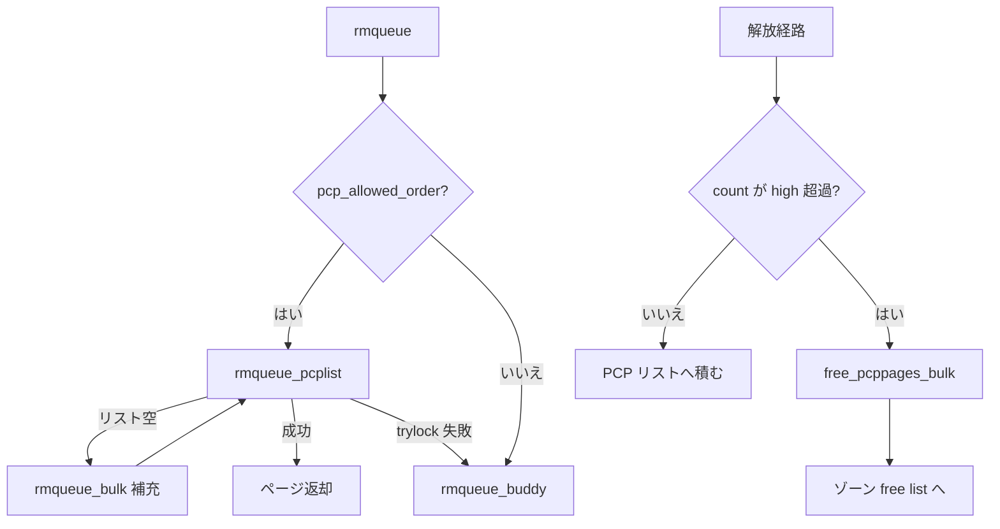

# 第6章 per-CPU pageset の補充と drain

> **本章で読むソース**
>
> - [`mm/page_alloc.c` L3295-L3324](https://github.com/gregkh/linux/blob/v6.18.38/mm/page_alloc.c#L3295-L3324)
> - [`mm/page_alloc.c` L3327-L3349](https://github.com/gregkh/linux/blob/v6.18.38/mm/page_alloc.c#L3327-L3349)
> - [`include/linux/mmzone.h` L904-L912](https://github.com/gregkh/linux/blob/v6.18.38/include/linux/mmzone.h#L904-L912)
> - [`mm/page_alloc.c` L1494-L1544](https://github.com/gregkh/linux/blob/v6.18.38/mm/page_alloc.c#L1494-L1544)
> - [`mm/page_alloc.c` L2654-L2697](https://github.com/gregkh/linux/blob/v6.18.38/mm/page_alloc.c#L2654-L2697)
> - [`mm/page_alloc.c` L3381-L3386](https://github.com/gregkh/linux/blob/v6.18.38/mm/page_alloc.c#L3381-L3386)

## この章の狙い

**per-CPU pageset**（PCP）が order-0 中心の割り当てでゾーンロックを避ける仕組みを読む。
リスト補充、バッチ返却、high 超過時の drain までを追い、バディパスへ落ちる条件を押さえる。

## 前提

- [watermark とゾーン fallback](05-watermark-zone-fallback.md)
- [同期と RCU：per-CPU 変数](../../locking/part00-foundation/02-percpu.md)

## __rmqueue_pcplist の補充

PCP リストが空なら `rmqueue_bulk` でゾーンからバッチ取得し、リストへ積む。
壊れたページは `check_new_pages` で弾き、リストから捨てて再試行する。

[`mm/page_alloc.c` L3295-L3324](https://github.com/gregkh/linux/blob/v6.18.38/mm/page_alloc.c#L3295-L3324)

```c
struct page *__rmqueue_pcplist(struct zone *zone, unsigned int order,
			int migratetype,
			unsigned int alloc_flags,
			struct per_cpu_pages *pcp,
			struct list_head *list)
{
	struct page *page;

	do {
		if (list_empty(list)) {
			int batch = nr_pcp_alloc(pcp, zone, order);
			int alloced;

			alloced = rmqueue_bulk(zone, order,
					batch, list,
					migratetype, alloc_flags);

			pcp->count += alloced << order;
			if (unlikely(list_empty(list)))
				return NULL;
		}

		page = list_first_entry(list, struct page, pcp_list);
		list_del(&page->pcp_list);
		pcp->count -= 1 << order;
	} while (check_new_pages(page, order));

	return page;
}
```

補充はゾーンロック下の `rmqueue_bulk` をまとめて呼ぶため、個別取得よりロック取得回数が少ない。

## rmqueue_pcplist のロック戦略

`pcp_spin_trylock` は失敗したら NULL を返し、呼び出し側がバディパスへ落ちる。
IRQ 再入や並行 drain と競合しうる。

[`mm/page_alloc.c` L3327-L3349](https://github.com/gregkh/linux/blob/v6.18.38/mm/page_alloc.c#L3327-L3349)

```c
static struct page *rmqueue_pcplist(struct zone *preferred_zone,
			struct zone *zone, unsigned int order,
			int migratetype, unsigned int alloc_flags)
{
	struct per_cpu_pages *pcp;
	struct list_head *list;
	struct page *page;
	unsigned long __maybe_unused UP_flags;

	/* spin_trylock may fail due to a parallel drain or IRQ reentrancy. */
	pcp_trylock_prepare(UP_flags);
	pcp = pcp_spin_trylock(zone->per_cpu_pageset);
	if (!pcp) {
		pcp_trylock_finish(UP_flags);
		return NULL;
	}

	/*
	 * On allocation, reduce the number of pages that are batch freed.
	 * See nr_pcp_free() where free_factor is increased for subsequent
	 * frees.
	 */
	pcp->free_count >>= 1;
```

割り当て時に `free_count` を半分にすることで、解放側のバッチサイズと釣り合いを取る。

## zone の pageset パラメータ

ゾーンは `pageset_high` と `pageset_batch` を各 CPU の pageset にコピーする。
high を超えた PCP ページは drain され、ゾーンの free list に戻る。

[`include/linux/mmzone.h` L904-L912](https://github.com/gregkh/linux/blob/v6.18.38/include/linux/mmzone.h#L904-L912)

```c
	struct per_cpu_pages	__percpu *per_cpu_pageset;
	struct per_cpu_zonestat	__percpu *per_cpu_zonestats;
	/*
	 * the high and batch values are copied to individual pagesets for
	 * faster access
	 */
	int pageset_high_min;
	int pageset_high_max;
	int pageset_batch;
```

## free_pcppages_bulk によるバッチ返却

drain は PCP からページを取り出し、ゾーンロック下で `__free_one_page` へ返す。
リストは migratetype 別に round-robin で走査する。

[`mm/page_alloc.c` L1494-L1544](https://github.com/gregkh/linux/blob/v6.18.38/mm/page_alloc.c#L1494-L1544)

```c
static void free_pcppages_bulk(struct zone *zone, int count,
					struct per_cpu_pages *pcp,
					int pindex)
{
	unsigned long flags;
	unsigned int order;
	struct page *page;

	/*
	 * Ensure proper count is passed which otherwise would stuck in the
	 * below while (list_empty(list)) loop.
	 */
	count = min(pcp->count, count);

	/* Ensure requested pindex is drained first. */
	pindex = pindex - 1;

	spin_lock_irqsave(&zone->lock, flags);

	while (count > 0) {
		struct list_head *list;
		int nr_pages;

		/* Remove pages from lists in a round-robin fashion. */
		do {
			if (++pindex > NR_PCP_LISTS - 1)
				pindex = 0;
			list = &pcp->lists[pindex];
		} while (list_empty(list));

		order = pindex_to_order(pindex);
		nr_pages = 1 << order;
		do {
			unsigned long pfn;
			int mt;

			page = list_last_entry(list, struct page, pcp_list);
			pfn = page_to_pfn(page);
			mt = get_pfnblock_migratetype(page, pfn);

			/* must delete to avoid corrupting pcp list */
			list_del(&page->pcp_list);
			count -= nr_pages;
			pcp->count -= nr_pages;

			__free_one_page(page, pfn, zone, order, mt, FPI_NONE);
			trace_mm_page_pcpu_drain(page, order, mt);
		} while (count > 0 && !list_empty(list));
	}

	spin_unlock_irqrestore(&zone->lock, flags);
}
```

## drain_pages と drain_local_pages

CPU ごとの PCP をゾーン単位で空にする。
`drain_local_pages` は compaction やメモリホットプラグから呼ばれ、ゾーン全体または特定ゾーンを対象にする。

[`mm/page_alloc.c` L2654-L2697](https://github.com/gregkh/linux/blob/v6.18.38/mm/page_alloc.c#L2654-L2697)

```c
static void drain_pages_zone(unsigned int cpu, struct zone *zone)
{
	struct per_cpu_pages *pcp = per_cpu_ptr(zone->per_cpu_pageset, cpu);
	unsigned long UP_flags;
	int count;

	do {
		pcp_spin_lock_maybe_irqsave(pcp, UP_flags);
		count = pcp->count;
		if (count) {
			int to_drain = min(count,
				pcp->batch << CONFIG_PCP_BATCH_SCALE_MAX);

			free_pcppages_bulk(zone, to_drain, pcp, 0);
			count -= to_drain;
		}
		pcp_spin_unlock_maybe_irqrestore(pcp, UP_flags);
	} while (count);
}

/*
 * Drain pcplists of all zones on the indicated processor.
 */
static void drain_pages(unsigned int cpu)
{
	struct zone *zone;

	for_each_populated_zone(zone) {
		drain_pages_zone(cpu, zone);
	}
}

/*
 * Spill all of this CPU's per-cpu pages back into the buddy allocator.
 */
void drain_local_pages(struct zone *zone)
{
	int cpu = smp_processor_id();

	if (zone)
		drain_pages_zone(cpu, zone);
	else
		drain_pages(cpu);
}
```

## rmqueue での PCP 優先

order が PCP 対象ならまず `rmqueue_pcplist` を試し、失敗時のみ `rmqueue_buddy` がゾーンロックを取る。

[`mm/page_alloc.c` L3381-L3386](https://github.com/gregkh/linux/blob/v6.18.38/mm/page_alloc.c#L3381-L3386)

```c
	if (likely(pcp_allowed_order(order))) {
		page = rmqueue_pcplist(preferred_zone, zone, order,
				       migratetype, alloc_flags);
		if (likely(page))
			goto out;
	}
```

## 処理の流れ



## 高速化と最適化の工夫

PCP は **ゾーンロックの競合を CPU ローカルに閉じる** バッファである。
補充と返却をバッチ化してロック取得回数を減らし、`spin_trylock` で drain とのデッドロックを避ける。
per-CPU 変数の一般論は locking 分冊が扱い、本章は pageset に限定する。

## まとめ

per-CPU pageset は order-0 中心の高速割り当て経路である。
補充は `rmqueue_bulk`、返却は `free_pcppages_bulk` でまとめ、high 超過や明示 drain でゾーンへ戻す。
compaction との接続は [compaction と kcompactd](08-compaction.md) が扱う。

## 関連する章

- [`__alloc_pages` の fast path と slow path](04-alloc-pages-path.md)
- [page migration](07-page-migration.md)
- [compaction と kcompactd](08-compaction.md)
