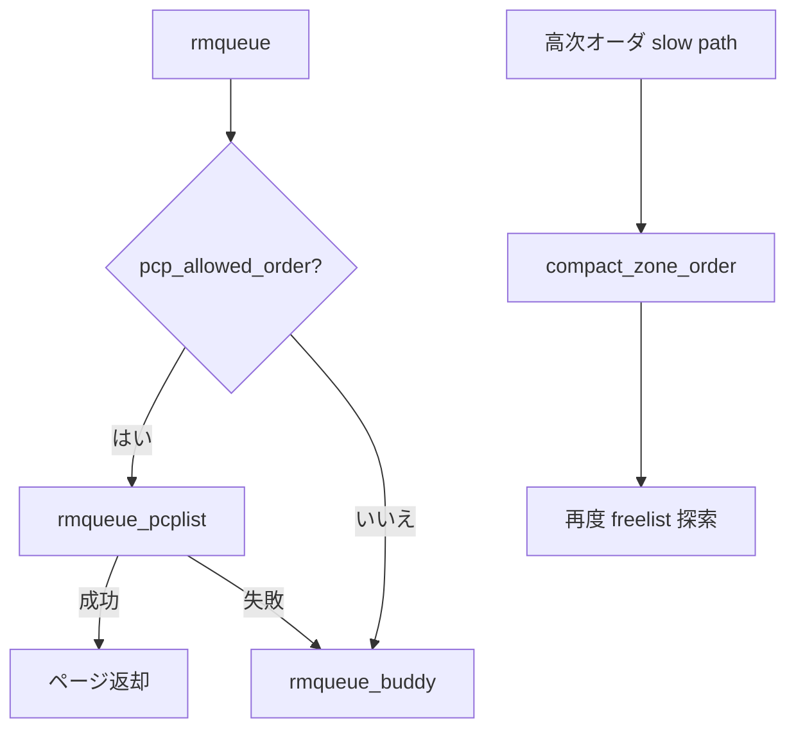

# 第6章 per-CPU pageset と compaction

> **本章で読むソース**
>
> - [`mm/page_alloc.c` L3295-L3324](https://github.com/gregkh/linux/blob/v6.18.38/mm/page_alloc.c#L3295-L3324)
> - [`mm/page_alloc.c` L3327-L3349](https://github.com/gregkh/linux/blob/v6.18.38/mm/page_alloc.c#L3327-L3349)
> - [`include/linux/mmzone.h` L904-L912](https://github.com/gregkh/linux/blob/v6.18.38/include/linux/mmzone.h#L904-L912)
> - [`mm/compaction.c` L2749-L2782](https://github.com/gregkh/linux/blob/v6.18.38/mm/compaction.c#L2749-L2782)
> - [`mm/page_alloc.c` L4769-L4774](https://github.com/gregkh/linux/blob/v6.18.38/mm/page_alloc.c#L4769-L4774)
> - [`mm/page_alloc.c` L3381-L3386](https://github.com/gregkh/linux/blob/v6.18.38/mm/page_alloc.c#L3381-L3386)

## この章の狙い

**per-CPU pageset**（PCP）がゾーンロックを避けて order-0 を配る仕組みと、**compaction** が高次オーダのためにページを移動する仕組みを対比して読む。

## 前提

- [watermark とゾーン fallback](05-watermark-zone-fallback.md)
- [同期と RCU：per-CPU 変数](../../locking/part00-foundation/02-percpu.md)

## __rmqueue_pcplist の補充

PCP リストが空なら `rmqueue_bulk` でゾーンからバッチ取得し、リストへ積む。

[`mm/page_alloc.c` L3295-L3324](https://github.com/gregkh/linux/blob/v6.18.38/mm/page_alloc.c#L3295-L3324)

```c
struct page *__rmqueue_pcplist(struct zone *zone, unsigned int order,
			int migratetype,
			unsigned int alloc_flags,
			struct per_cpu_pages *pcp,
			struct list_head *list)
{
	struct page *page;

	do {
		if (list_empty(list)) {
			int batch = nr_pcp_alloc(pcp, zone, order);
			int alloced;

			alloced = rmqueue_bulk(zone, order,
					batch, list,
					migratetype, alloc_flags);

			pcp->count += alloced << order;
			if (unlikely(list_empty(list)))
				return NULL;
		}

		page = list_first_entry(list, struct page, pcp_list);
		list_del(&page->pcp_list);
		pcp->count -= 1 << order;
	} while (check_new_pages(page, order));

	return page;
}
```

`check_new_pages` で壊れたページを弾き、リストから捨てて再試行する。

## rmqueue_pcplist のロック戦略

`pcp_spin_trylock` は失敗したら NULL を返し、呼び出し側がバディパスへ落ちる。
IRQ 再入や並行 drain と競合しうる。

[`mm/page_alloc.c` L3327-L3349](https://github.com/gregkh/linux/blob/v6.18.38/mm/page_alloc.c#L3327-L3349)

```c
static struct page *rmqueue_pcplist(struct zone *preferred_zone,
			struct zone *zone, unsigned int order,
			int migratetype, unsigned int alloc_flags)
{
	struct per_cpu_pages *pcp;
	struct list_head *list;
	struct page *page;
	unsigned long __maybe_unused UP_flags;

	/* spin_trylock may fail due to a parallel drain or IRQ reentrancy. */
	pcp_trylock_prepare(UP_flags);
	pcp = pcp_spin_trylock(zone->per_cpu_pageset);
	if (!pcp) {
		pcp_trylock_finish(UP_flags);
		return NULL;
	}

	/*
	 * On allocation, reduce the number of pages that are batch freed.
	 * See nr_pcp_free() where free_factor is increased for subsequent
	 * frees.
	 */
	pcp->free_count >>= 1;
```

割り当て時に `free_count` を半分にすることで、解放側のバッチサイズと釣り合いを取る。

## zone の pageset パラメータ

ゾーンは `pageset_high` と `pageset_batch` を各 CPU の pageset にコピーする。

[`include/linux/mmzone.h` L904-L912](https://github.com/gregkh/linux/blob/v6.18.38/include/linux/mmzone.h#L904-L912)

```c
	struct per_cpu_pages	__percpu *per_cpu_pageset;
	struct per_cpu_zonestat	__percpu *per_cpu_zonestats;
	/*
	 * the high and batch values are copied to individual pagesets for
	 * faster access
	 */
	int pageset_high_min;
	int pageset_high_max;
	int pageset_batch;
```

high を超えた PCP ページは drain され、ゾーンの free list に戻る。

## compact_zone_order の起動

compaction は `compact_control` を組み立て、`compact_zone` で移動可能ページを寄せる。

[`mm/compaction.c` L2749-L2782](https://github.com/gregkh/linux/blob/v6.18.38/mm/compaction.c#L2749-L2782)

```c
static enum compact_result compact_zone_order(struct zone *zone, int order,
		gfp_t gfp_mask, enum compact_priority prio,
		unsigned int alloc_flags, int highest_zoneidx,
		struct page **capture)
{
	enum compact_result ret;
	struct compact_control cc = {
		.order = order,
		.search_order = order,
		.gfp_mask = gfp_mask,
		.zone = zone,
		.mode = (prio == COMPACT_PRIO_ASYNC) ?
					MIGRATE_ASYNC :	MIGRATE_SYNC_LIGHT,
		.alloc_flags = alloc_flags,
		.highest_zoneidx = highest_zoneidx,
		.direct_compaction = true,
		.whole_zone = (prio == MIN_COMPACT_PRIORITY),
		.ignore_skip_hint = (prio == MIN_COMPACT_PRIORITY),
		.ignore_block_suitable = (prio == MIN_COMPACT_PRIORITY)
	};
	struct capture_control capc = {
		.cc = &cc,
		.page = NULL,
	};

	/*
	 * Make sure the structs are really initialized before we expose the
	 * capture control, in case we are interrupted and the interrupt handler
	 * frees a page.
	 */
	barrier();
	WRITE_ONCE(current->capture_control, &capc);

	ret = compact_zone(&cc, &capc);
```

`capture_control` は割り込み中の解放ページを compaction 側が掴むためのフックである。

## slow path からの direct compaction

costly order や非 MOVABLE 高次割り当てでは reclaim より先に compaction を試す。

[`mm/page_alloc.c` L4769-L4774](https://github.com/gregkh/linux/blob/v6.18.38/mm/page_alloc.c#L4769-L4774)

```c
	if (can_direct_reclaim && can_compact &&
			(costly_order ||
			   (order > 0 && ac->migratetype != MIGRATE_MOVABLE))
			&& !gfp_pfmemalloc_allowed(gfp_mask)) {
		page = __alloc_pages_direct_compact(gfp_mask, order,
						alloc_flags, ac,
```

空きページ総量は足りても断片化していると高次オーダは失敗する。
compaction は物理ページを移動して連続ブロックを作る。

## rmqueue での PCP 優先

[`mm/page_alloc.c` L3381-L3386](https://github.com/gregkh/linux/blob/v6.18.38/mm/page_alloc.c#L3381-L3386)

```c
	if (likely(pcp_allowed_order(order))) {
		page = rmqueue_pcplist(preferred_zone, zone, order,
				       migratetype, alloc_flags);
		if (likely(page))
			goto out;
	}
```

PCP 失敗時のみ `rmqueue_buddy` がゾーンロックを取る。

## 処理の流れ



## 高速化と最適化の工夫

PCP は **ゾーンロックの競合を CPU ローカルに閉じる** ためのバッファである。
バッチ補充でロック取得回数を減らし、解放側も対称にバッチ返却する。
compaction は回収と独立し、断片化という別問題に効く。

## まとめ

per-CPU pageset は order-0 中心の高速割り当て経路である。
compaction はページ移動で高次オーダの連続空きを作る。
両者は slow path で組み合わされ、watermark 不合格後の最後の手段群を構成する。

## 関連する章

- [`__alloc_pages` の fast path と slow path](04-alloc-pages-path.md)
- [Transparent Huge Pages](../part05-advanced/17-thp.md)
