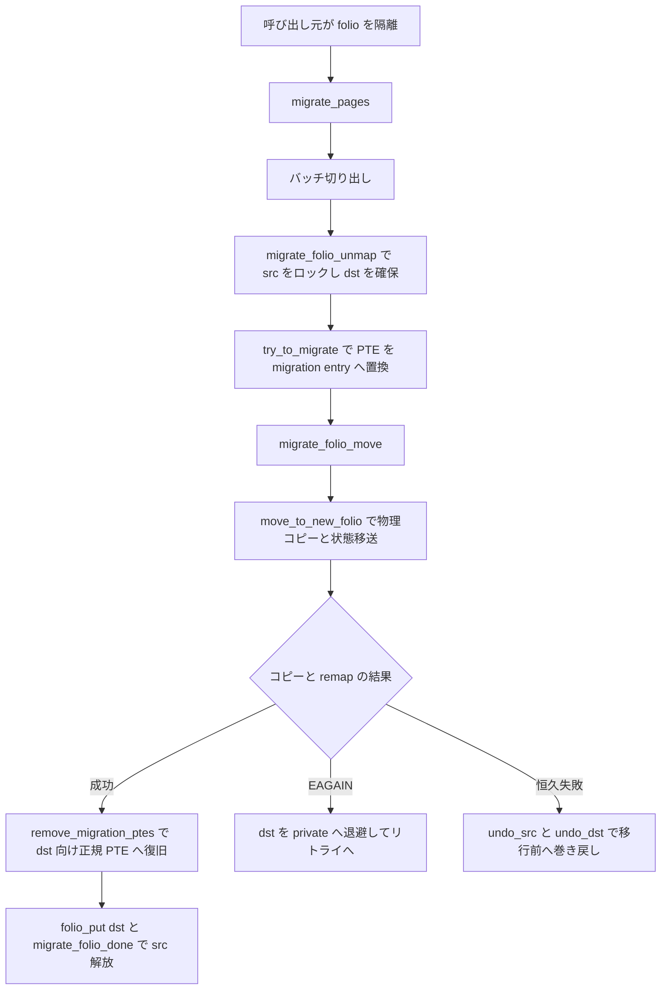

# 第7章 page migration

> **本章で読むソース**
>
> - [`mm/migrate.c` L2081-L2127](https://github.com/gregkh/linux/blob/v6.18.38/mm/migrate.c#L2081-L2127)
> - [`mm/migrate.c` L1193-L1243](https://github.com/gregkh/linux/blob/v6.18.38/mm/migrate.c#L1193-L1243)
> - [`mm/migrate.c` L1315-L1321](https://github.com/gregkh/linux/blob/v6.18.38/mm/migrate.c#L1315-L1321)
> - [`include/linux/swapops.h` L233-L238](https://github.com/gregkh/linux/blob/v6.18.38/include/linux/swapops.h#L233-L238)
> - [`mm/migrate.c` L1081-L1118](https://github.com/gregkh/linux/blob/v6.18.38/mm/migrate.c#L1081-L1118)
> - [`mm/migrate.c` L846-L869](https://github.com/gregkh/linux/blob/v6.18.38/mm/migrate.c#L846-L869)
> - [`mm/migrate.c` L1344-L1440](https://github.com/gregkh/linux/blob/v6.18.38/mm/migrate.c#L1344-L1440)
> - [`mm/migrate.c` L345-L448](https://github.com/gregkh/linux/blob/v6.18.38/mm/migrate.c#L345-L448)
> - [`mm/migrate.c` L454-L472](https://github.com/gregkh/linux/blob/v6.18.38/mm/migrate.c#L454-L472)
> - [`mm/migrate.c` L1151-L1166](https://github.com/gregkh/linux/blob/v6.18.38/mm/migrate.c#L1151-L1166)

## この章の狙い

**page migration** が物理ページを別フレームへ移す共通実行層であることを読む。
`migrate_pages` のバッチ処理から、`migrate_folio_unmap` による PTE 解除、`move_to_new_folio` の物理コピーと状態移送、`remove_migration_ptes` による正規 PTE への復旧までの unmap から copy を経て remap に至る一連を追う。
移行を表す **migration entry** の役割と、失敗時に元 folio へ戻す復旧経路もあわせて読む。

## 前提

- [per-CPU pageset の補充と drain](06-pcp-refill-drain.md)
- [folio とページ管理単位](../part00-foundation/02-folio-page-unit.md)

## migrate_pages のバッチループ

呼び出し元が隔離した folio リストを受け取り、バッチ単位で同期または非同期移行する。
hugetlb は別経路 `migrate_hugetlbs` で先に処理する。

[`mm/migrate.c` L2081-L2127](https://github.com/gregkh/linux/blob/v6.18.38/mm/migrate.c#L2081-L2127)

```c
int migrate_pages(struct list_head *from, new_folio_t get_new_folio,
		free_folio_t put_new_folio, unsigned long private,
		enum migrate_mode mode, int reason, unsigned int *ret_succeeded)
{
	int rc, rc_gather;
	int nr_pages;
	struct folio *folio, *folio2;
	LIST_HEAD(folios);
	LIST_HEAD(ret_folios);
	LIST_HEAD(split_folios);
	struct migrate_pages_stats stats;

	trace_mm_migrate_pages_start(mode, reason);

	memset(&stats, 0, sizeof(stats));

	rc_gather = migrate_hugetlbs(from, get_new_folio, put_new_folio, private,
				     mode, reason, &stats, &ret_folios);
	if (rc_gather < 0)
		goto out;

again:
	nr_pages = 0;
	list_for_each_entry_safe(folio, folio2, from, lru) {
		/* Retried hugetlb folios will be kept in list  */
		if (folio_test_hugetlb(folio)) {
			list_move_tail(&folio->lru, &ret_folios);
			continue;
		}

		nr_pages += folio_nr_pages(folio);
		if (nr_pages >= NR_MAX_BATCHED_MIGRATION)
			break;
	}
	if (nr_pages >= NR_MAX_BATCHED_MIGRATION)
		list_cut_before(&folios, from, &folio2->lru);
	else
		list_splice_init(from, &folios);
	if (mode == MIGRATE_ASYNC)
		rc = migrate_pages_batch(&folios, get_new_folio, put_new_folio,
				private, mode, reason, &ret_folios,
				&split_folios, &stats,
				NR_MAX_MIGRATE_PAGES_RETRY);
	else
		rc = migrate_pages_sync(&folios, get_new_folio, put_new_folio,
				private, mode, reason, &ret_folios,
				&split_folios, &stats);
```

`reason` は compaction、NUMA balancing、memory hotplug など呼び出し元を区別する。

## migrate_folio_unmap とロック待ち

移行先 folio を確保したあと、元 folio をロックし writeback を待つ。
`MIGRATE_ASYNC` ではロックや I/O 待ちに失敗してリトライ対象に戻す。

[`mm/migrate.c` L1193-L1243](https://github.com/gregkh/linux/blob/v6.18.38/mm/migrate.c#L1193-L1243)

```c
/* Obtain the lock on page, remove all ptes. */
static int migrate_folio_unmap(new_folio_t get_new_folio,
		free_folio_t put_new_folio, unsigned long private,
		struct folio *src, struct folio **dstp, enum migrate_mode mode,
		struct list_head *ret)
{
	struct folio *dst;
	int rc = -EAGAIN;
	int old_page_state = 0;
	struct anon_vma *anon_vma = NULL;
	bool locked = false;
	bool dst_locked = false;

	dst = get_new_folio(src, private);
	if (!dst)
		return -ENOMEM;
	*dstp = dst;

	dst->private = NULL;

	if (!folio_trylock(src)) {
		if (mode == MIGRATE_ASYNC)
			goto out;

		/*
		 * It's not safe for direct compaction to call lock_page.
		 * For example, during page readahead pages are added locked
		 * to the LRU. Later, when the IO completes the pages are
		 * marked uptodate and unlocked. However, the queueing
		 * could be merging multiple pages for one bio (e.g.
		 * mpage_readahead). If an allocation happens for the
		 * second or third page, the process can end up locking
		 * the same page twice and deadlocking. Rather than
		 * trying to be clever about what pages can be locked,
		 * avoid the use of lock_page for direct compaction
		 * altogether.
		 */
		if (current->flags & PF_MEMALLOC)
			goto out;

		/*
		 * In "light" mode, we can wait for transient locks (eg
		 * inserting a page into the page table), but it's not
		 * worth waiting for I/O.
		 */
		if (mode == MIGRATE_SYNC_LIGHT && !folio_test_uptodate(src))
			goto out;

		folio_lock(src);
	}
	locked = true;
```

## try_to_migrate による PTE 解除

マップ済み folio では `try_to_migrate` が PTE を migration entry に差し替える。
unmap 完了後に物理コピーと新 PTE 設置へ進む。

[`mm/migrate.c` L1315-L1321](https://github.com/gregkh/linux/blob/v6.18.38/mm/migrate.c#L1315-L1321)

```c
	} else if (folio_mapped(src)) {
		/* Establish migration ptes */
		VM_BUG_ON_FOLIO(folio_test_anon(src) &&
			       !folio_test_ksm(src) && !anon_vma, src);
		try_to_migrate(src, mode == MIGRATE_ASYNC ? TTU_BATCH_FLUSH : 0);
		old_page_state |= PAGE_WAS_MAPPED;
	}
```

## migration entry の型

swap 型エントリの一種として migration を表現する。
読み取り専用、排他読み取り、書き込み可能の3種がある。

[`include/linux/swapops.h` L233-L238](https://github.com/gregkh/linux/blob/v6.18.38/include/linux/swapops.h#L233-L238)

```c
static inline int is_migration_entry(swp_entry_t entry)
{
	return unlikely(swp_type(entry) == SWP_MIGRATION_READ ||
			swp_type(entry) == SWP_MIGRATION_READ_EXCLUSIVE ||
			swp_type(entry) == SWP_MIGRATION_WRITE);
}
```

フォールトハンドラは migration entry を見て、移行完了を待つか新フレームへリダイレクトする。

## move_to_new_folio：物理コピーと状態移送

unmap が完了すると、`move_to_new_folio` が元 folio の内容を dst へ移す。
コピー方法は `src` の `address_space` に応じて分岐する。
`mapping` を持たない匿名 folio と swap cache は既定の `migrate_folio` を、ファイルシステムが `a_ops->migrate_folio` を提供する場合はその callback を、いずれも無い場合は `fallback_migrate_folio` を呼ぶ。
コメントが述べるとおり、大半の folio は callback 経由のこの経路を通る。

[`mm/migrate.c` L1081-L1118](https://github.com/gregkh/linux/blob/v6.18.38/mm/migrate.c#L1081-L1118)

```c
static int move_to_new_folio(struct folio *dst, struct folio *src,
				enum migrate_mode mode)
{
	struct address_space *mapping = folio_mapping(src);
	int rc = -EAGAIN;

	VM_BUG_ON_FOLIO(!folio_test_locked(src), src);
	VM_BUG_ON_FOLIO(!folio_test_locked(dst), dst);

	if (!mapping)
		rc = migrate_folio(mapping, dst, src, mode);
	else if (mapping_inaccessible(mapping))
		rc = -EOPNOTSUPP;
	else if (mapping->a_ops->migrate_folio)
		/*
		 * Most folios have a mapping and most filesystems
		 * provide a migrate_folio callback. Anonymous folios
		 * are part of swap space which also has its own
		 * migrate_folio callback. This is the most common path
		 * for page migration.
		 */
		rc = mapping->a_ops->migrate_folio(mapping, dst, src,
							mode);
	else
		rc = fallback_migrate_folio(mapping, dst, src, mode);

	if (!rc) {
		/*
		 * For pagecache folios, src->mapping must be cleared before src
		 * is freed. Anonymous folios must stay anonymous until freed.
		 */
		if (!folio_test_anon(src))
			src->mapping = NULL;

		if (likely(!folio_is_zone_device(dst)))
			flush_dcache_folio(dst);
	}
	return rc;
}
```

コピー成功後、ページキャッシュ folio では `src->mapping` を先に `NULL` にする。
匿名 folio は解放されるまで匿名のままにしておく必要があるため、そのままにする。
zone-device 以外では `flush_dcache_folio` で dst の dcache をフラッシュし、CPU から見える内容を確定させる。

既定経路の `migrate_folio` は内部の `__migrate_folio` で 3 段階を実行する。
第一に `folio_mc_copy` で src の中身を dst へ物理コピーする。
第二に `__folio_migrate_mapping` で page cache の xarray エントリを src から dst に差し替え、参照カウントを移送する。
第三に `folio_migrate_flags` で dirty、referenced、active、uptodate といったフラグと NUMA の cpupid を dst へ引き継ぐ。
コピー前に `folio_ref_count(src)` が期待値と異なれば、想定外の参照が残っているとみなして `-EAGAIN` を返し、後段のリトライへ回す。

[`mm/migrate.c` L846-L869](https://github.com/gregkh/linux/blob/v6.18.38/mm/migrate.c#L846-L869)

```c
static int __migrate_folio(struct address_space *mapping, struct folio *dst,
			   struct folio *src, void *src_private,
			   enum migrate_mode mode)
{
	int rc, expected_count = folio_expected_ref_count(src) + 1;

	/* Check whether src does not have extra refs before we do more work */
	if (folio_ref_count(src) != expected_count)
		return -EAGAIN;

	rc = folio_mc_copy(dst, src);
	if (unlikely(rc))
		return rc;

	rc = __folio_migrate_mapping(mapping, dst, src, expected_count);
	if (rc)
		return rc;

	if (src_private)
		folio_attach_private(dst, folio_detach_private(src));

	folio_migrate_flags(dst, src);
	return 0;
}
```

## migrate_folio_move と remove_migration_ptes

`migrate_folio_move` は unmap 済みの src と確保済みの dst を受け取り、コピーと remap を通して移行を完了させる後半の司令塔である。
まず `__migrate_folio_extract` で、unmap 時に dst の `private` フィールドへ退避しておいた `old_page_state` と `anon_vma` を取り出す。
続いて `move_to_new_folio` で物理コピーを行い、成功したら dst を LRU へ載せる。
`old_page_state` に `PAGE_WAS_MAPPED` が立っていれば、`remove_migration_ptes(src, dst, 0)` で migration entry を dst を指す正規 PTE へ差し替える。

[`mm/migrate.c` L1344-L1391](https://github.com/gregkh/linux/blob/v6.18.38/mm/migrate.c#L1344-L1391)

```c
static int migrate_folio_move(free_folio_t put_new_folio, unsigned long private,
			      struct folio *src, struct folio *dst,
			      enum migrate_mode mode, enum migrate_reason reason,
			      struct list_head *ret)
{
	int rc;
	int old_page_state = 0;
	struct anon_vma *anon_vma = NULL;
	bool src_deferred_split = false;
	bool src_partially_mapped = false;
	struct list_head *prev;

	__migrate_folio_extract(dst, &old_page_state, &anon_vma);
	prev = dst->lru.prev;
	list_del(&dst->lru);

	if (unlikely(page_has_movable_ops(&src->page))) {
		rc = migrate_movable_ops_page(&dst->page, &src->page, mode);
		if (rc)
			goto out;
		goto out_unlock_both;
	}

	if (folio_order(src) > 1 &&
	    !data_race(list_empty(&src->_deferred_list))) {
		src_deferred_split = true;
		src_partially_mapped = folio_test_partially_mapped(src);
	}

	rc = move_to_new_folio(dst, src, mode);
	if (rc)
		goto out;

	// ... (中略) ...

	folio_add_lru(dst);
	if (old_page_state & PAGE_WAS_MLOCKED)
		lru_add_drain();

	if (old_page_state & PAGE_WAS_MAPPED)
		remove_migration_ptes(src, dst, 0);
```

remap まで済むと `out_unlock_both` で dst をアンロックし、`folio_put(dst)` で移行時に握っていた参照を1つ落とす。
新しい所有者が参照を持つため、この `folio_put` で dst が解放されることはない。
src は `list_del` でリストから外し、`anon_vma` の参照を返してアンロックし、`migrate_folio_done` で隔離カウンタを戻して解放へ向かわせる。

コピーや remap が失敗して `out` へ来たときは、`rc` の値で分岐する。
`-EAGAIN` の場合は dst を元の位置へ戻し、`__migrate_folio_record` で `old_page_state` と `anon_vma` を再び dst の `private` へ退避して、そのままリトライに委ねる。
それ以外の恒久的な失敗では、`migrate_folio_undo_src` と `migrate_folio_undo_dst` を呼んで src と dst を移行前の状態へ巻き戻す。

[`mm/migrate.c` L1424-L1440](https://github.com/gregkh/linux/blob/v6.18.38/mm/migrate.c#L1424-L1440)

```c
out:
	/*
	 * A folio that has not been migrated will be restored to
	 * right list unless we want to retry.
	 */
	if (rc == -EAGAIN) {
		list_add(&dst->lru, prev);
		__migrate_folio_record(dst, old_page_state, anon_vma);
		return rc;
	}

	migrate_folio_undo_src(src, old_page_state & PAGE_WAS_MAPPED,
			       anon_vma, true, ret);
	migrate_folio_undo_dst(dst, true, put_new_folio, private);

	return rc;
}
```

## remove_migration_pte：正規 PTE への復旧

`remove_migration_pte` は rmap 走査の callback として、migration entry を present PTE へ書き戻す。
`PVMW_MIGRATION` 付きの page-table walk で、対象アドレスの swap 型 migration entry を1つずつ拾う。
`new = folio_page(folio, idx)` で復旧先の新ページを求め、`mk_pte` でそのページを指す PTE を組み立てる。

unmap 時に PTE へ畳み込まれていた young、dirty、writable の各属性は、migration entry の型からそのまま復元する。
`is_migration_entry_young` が偽なら `pte_mkold` で参照ビットを落とし、entry が dirty を示せば `pte_mkdirty` を立てる。
`is_writable_migration_entry` が真なら `pte_mkwrite` で書き込み可能に戻す。
最後に匿名なら `folio_add_anon_rmap_pte`、ファイルなら `folio_add_file_rmap_pte` で新ページを rmap へ登録し、`set_pte_at` で present PTE を実際に設置する。
遷移直前は非present だったため、TLB の invalidate は不要で `update_mmu_cache` のみ行う。

[`mm/migrate.c` L345-L448](https://github.com/gregkh/linux/blob/v6.18.38/mm/migrate.c#L345-L448)

```c
static bool remove_migration_pte(struct folio *folio,
		struct vm_area_struct *vma, unsigned long addr, void *arg)
{
	struct rmap_walk_arg *rmap_walk_arg = arg;
	DEFINE_FOLIO_VMA_WALK(pvmw, rmap_walk_arg->folio, vma, addr, PVMW_SYNC | PVMW_MIGRATION);

	while (page_vma_mapped_walk(&pvmw)) {
		rmap_t rmap_flags = RMAP_NONE;
		pte_t old_pte;
		pte_t pte;
		swp_entry_t entry;
		struct page *new;
		unsigned long idx = 0;

		// ... (中略) ...
		new = folio_page(folio, idx);

		old_pte = ptep_get(pvmw.pte);
		// ... (中略) ...
		folio_get(folio);
		pte = mk_pte(new, READ_ONCE(vma->vm_page_prot));

		entry = pte_to_swp_entry(old_pte);
		if (!is_migration_entry_young(entry))
			pte = pte_mkold(pte);
		if (folio_test_dirty(folio) && is_migration_entry_dirty(entry))
			pte = pte_mkdirty(pte);
		// ... (中略) ...
		if (is_writable_migration_entry(entry))
			pte = pte_mkwrite(pte, vma);
		// ... (中略) ...
		{
			if (folio_test_anon(folio))
				folio_add_anon_rmap_pte(folio, new, vma,
							pvmw.address, rmap_flags);
			else
				folio_add_file_rmap_pte(folio, new, vma);
			set_pte_at(vma->vm_mm, pvmw.address, pvmw.pte, pte);
		}
		// ... (中略) ...

		/* No need to invalidate - it was non-present before */
		update_mmu_cache(vma, pvmw.address, pvmw.pte);
	}

	return true;
}
```

呼び出し側の `remove_migration_ptes` は、この callback を rmap walk へ渡す薄いラッパである。
`rmap_walk` は移行先 folio `dst` の逆マッピングをたどり、src を指していた各 VMA で `remove_migration_pte` を起動する。
これにより、unmap で migration entry を置いた全マッピングが漏れなく新ページへ張り替わる。

[`mm/migrate.c` L454-L472](https://github.com/gregkh/linux/blob/v6.18.38/mm/migrate.c#L454-L472)

```c
void remove_migration_ptes(struct folio *src, struct folio *dst, int flags)
{
	struct rmap_walk_arg rmap_walk_arg = {
		.folio = src,
		.map_unused_to_zeropage = flags & RMP_USE_SHARED_ZEROPAGE,
	};

	struct rmap_walk_control rwc = {
		.rmap_one = remove_migration_pte,
		.arg = &rmap_walk_arg,
	};

	VM_BUG_ON_FOLIO((flags & RMP_USE_SHARED_ZEROPAGE) && (src != dst), src);

	if (flags & RMP_LOCKED)
		rmap_walk_locked(dst, &rwc);
	else
		rmap_walk(dst, &rwc);
}
```

## 失敗時の migrate_folio_undo_src

恒久的な失敗では `migrate_folio_move` の `out` から `migrate_folio_undo_src` が呼ばれ、元 folio を移行前の状態へ巻き戻す。
`page_was_mapped` が立っていれば `remove_migration_ptes(src, src, 0)` を呼び、src の rmap をたどって migration entry を元ページ自身を指す present PTE へ戻す。
remap 先を `dst` ではなく `src` にする点が成功経路との違いであり、これで移行前のマッピングが復元される。
続いて確保した `anon_vma` の参照を返し、src をアンロックして、`ret` リスト（呼び出し元へ返す失敗 folio のリスト）へ載せ直す。

[`mm/migrate.c` L1151-L1166](https://github.com/gregkh/linux/blob/v6.18.38/mm/migrate.c#L1151-L1166)

```c
static void migrate_folio_undo_src(struct folio *src,
				   int page_was_mapped,
				   struct anon_vma *anon_vma,
				   bool locked,
				   struct list_head *ret)
{
	if (page_was_mapped)
		remove_migration_ptes(src, src, 0);
	/* Drop an anon_vma reference if we took one */
	if (anon_vma)
		put_anon_vma(anon_vma);
	if (locked)
		folio_unlock(src);
	if (ret)
		list_move_tail(&src->lru, ret);
}
```

## 処理の流れ



## 高速化と最適化の工夫

バッチサイズ `NR_MAX_BATCHED_MIGRATION` で一度に扱うページ数を制限し、ロック保持時間と LRU 隔離量を抑える。
`MIGRATE_ASYNC` はロックや writeback を待たずスキップし、compaction の非同期経路を短く保つ。
migration entry は swap 型を流用するため、既存の page-table walk とフォールト経路を再利用できる。

## まとめ

page migration は compaction、NUMA balancing、mbind、memory hotplug が共有する実行層である。
`migrate_pages` がバッチ単位で、unmap で PTE を migration entry へ置換し、`move_to_new_folio` で物理コピーと状態移送を行い、`remove_migration_ptes` で新ページを指す正規 PTE へ復旧する。
コピーや remap が失敗した folio は、`-EAGAIN` ならリトライへ、恒久失敗なら `migrate_folio_undo_src` と `migrate_folio_undo_dst` で移行前へ巻き戻す。
compaction からの呼び出しは次章が扱う。

## 関連する章

- [compaction と kcompactd](08-compaction.md)
- [明示的 NUMA policy と mempolicy](../part05-advanced/34-mempolicy-mbind.md)
- [NUMA バランシングの fault 側](../part05-advanced/35-numa-fault-balancing.md)
