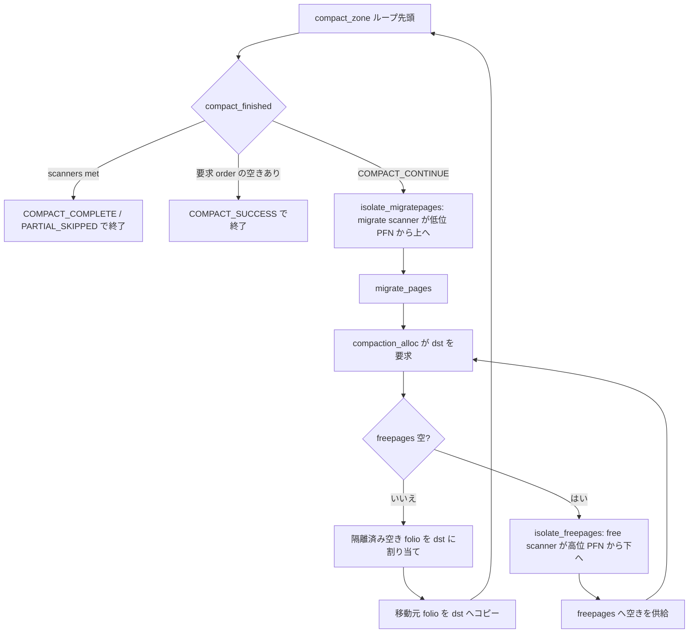

# 第8章 compaction と kcompactd

> **本章で読むソース**
>
> - [`mm/compaction.c` L2510-L2532](https://github.com/gregkh/linux/blob/v6.18.38/mm/compaction.c#L2510-L2532)
> - [`mm/compaction.c` L2598-L2649](https://github.com/gregkh/linux/blob/v6.18.38/mm/compaction.c#L2598-L2649)
> - [`mm/compaction.c` L836-L874](https://github.com/gregkh/linux/blob/v6.18.38/mm/compaction.c#L836-L874)
> - [`mm/compaction.c` L1797-L1819](https://github.com/gregkh/linux/blob/v6.18.38/mm/compaction.c#L1797-L1819)
> - [`mm/compaction.c` L1418-L1422](https://github.com/gregkh/linux/blob/v6.18.38/mm/compaction.c#L1418-L1422)
> - [`mm/compaction.c` L2234-L2258](https://github.com/gregkh/linux/blob/v6.18.38/mm/compaction.c#L2234-L2258)
> - [`mm/compaction.c` L2307-L2314](https://github.com/gregkh/linux/blob/v6.18.38/mm/compaction.c#L2307-L2314)
> - [`mm/page_alloc.c` L4769-L4774](https://github.com/gregkh/linux/blob/v6.18.38/mm/page_alloc.c#L4769-L4774)

## この章の狙い

**compaction** がゾーン内の可動ページと空きページを両端から走査し、高次オーダの連続ブロックを作る仕組みを読む。
`compact_zone` のループ、`isolate_migratepages` と `isolate_freepages` の両 scanner、direct compaction と kcompactd への接続を追う。

## 前提

- [page migration](07-page-migration.md)
- [`__alloc_pages` の fast path と slow path](04-alloc-pages-path.md)

## compact_zone の初期化

`compact_control` に order、モード、キャッシュ済み scanner 位置を載せる。
`whole_zone` が false なら前回の `compact_cached_migrate_pfn` から再開する。

[`mm/compaction.c` L2510-L2532](https://github.com/gregkh/linux/blob/v6.18.38/mm/compaction.c#L2510-L2532)

```c
static enum compact_result
compact_zone(struct compact_control *cc, struct capture_control *capc)
{
	enum compact_result ret;
	unsigned long start_pfn = cc->zone->zone_start_pfn;
	unsigned long end_pfn = zone_end_pfn(cc->zone);
	unsigned long last_migrated_pfn;
	const bool sync = cc->mode != MIGRATE_ASYNC;
	bool update_cached;
	unsigned int nr_succeeded = 0, nr_migratepages;
	int order;

	/*
	 * These counters track activities during zone compaction.  Initialize
	 * them before compacting a new zone.
	 */
	cc->total_migrate_scanned = 0;
	cc->total_free_scanned = 0;
	cc->nr_migratepages = 0;
	cc->nr_freepages = 0;
	for (order = 0; order < NR_PAGE_ORDERS; order++)
		INIT_LIST_HEAD(&cc->freepages[order]);
	INIT_LIST_HEAD(&cc->migratepages);
```

## メインループと migrate_pages への handoff

`isolate_migratepages` で候補を集め、`migrate_pages` は `compaction_alloc` を `get_new_folio` コールバックとして呼び、移行先 folio が必要になるたびに空きブロックを供給する。
失敗 folio は `putback_movable_pages` で LRU へ戻す。

[`mm/compaction.c` L2598-L2649](https://github.com/gregkh/linux/blob/v6.18.38/mm/compaction.c#L2598-L2649)

```c
	while ((ret = compact_finished(cc)) == COMPACT_CONTINUE) {
		int err;
		unsigned long iteration_start_pfn = cc->migrate_pfn;

		/*
		 * Avoid multiple rescans of the same pageblock which can
		 * happen if a page cannot be isolated (dirty/writeback in
		 * async mode) or if the migrated pages are being allocated
		 * before the pageblock is cleared.  The first rescan will
		 * capture the entire pageblock for migration. If it fails,
		 * it'll be marked skip and scanning will proceed as normal.
		 */
		cc->finish_pageblock = false;
		if (pageblock_start_pfn(last_migrated_pfn) ==
		    pageblock_start_pfn(iteration_start_pfn)) {
			cc->finish_pageblock = true;
		}

rescan:
		switch (isolate_migratepages(cc)) {
		case ISOLATE_ABORT:
			ret = COMPACT_CONTENDED;
			putback_movable_pages(&cc->migratepages);
			cc->nr_migratepages = 0;
			goto out;
		case ISOLATE_NONE:
			if (update_cached) {
				cc->zone->compact_cached_migrate_pfn[1] =
					cc->zone->compact_cached_migrate_pfn[0];
			}

			/*
			 * We haven't isolated and migrated anything, but
			 * there might still be unflushed migrations from
			 * previous cc->order aligned block.
			 */
			goto check_drain;
		case ISOLATE_SUCCESS:
			update_cached = false;
			last_migrated_pfn = max(cc->zone->zone_start_pfn,
				pageblock_start_pfn(cc->migrate_pfn - 1));
		}

		/*
		 * Record the number of pages to migrate since the
		 * compaction_alloc/free() will update cc->nr_migratepages
		 * properly.
		 */
		nr_migratepages = cc->nr_migratepages;
		err = migrate_pages(&cc->migratepages, compaction_alloc,
				compaction_free, (unsigned long)cc, cc->mode,
				MR_COMPACTION, &nr_succeeded);
```

## isolate_migratepages_block

可動ページを pageblock 単位で LRU から隔離する。
隔離ページが多すぎると reclaim をスロットルし、並行隔離との干渉を抑える。

[`mm/compaction.c` L836-L874](https://github.com/gregkh/linux/blob/v6.18.38/mm/compaction.c#L836-L874)

```c
static int
isolate_migratepages_block(struct compact_control *cc, unsigned long low_pfn,
			unsigned long end_pfn, isolate_mode_t mode)
{
	pg_data_t *pgdat = cc->zone->zone_pgdat;
	unsigned long nr_scanned = 0, nr_isolated = 0;
	struct lruvec *lruvec;
	unsigned long flags = 0;
	struct lruvec *locked = NULL;
	struct folio *folio = NULL;
	struct page *page = NULL, *valid_page = NULL;
	struct address_space *mapping;
	unsigned long start_pfn = low_pfn;
	bool skip_on_failure = false;
	unsigned long next_skip_pfn = 0;
	bool skip_updated = false;
	int ret = 0;

	cc->migrate_pfn = low_pfn;

	/*
	 * Ensure that there are not too many pages isolated from the LRU
	 * list by either parallel reclaimers or compaction. If there are,
	 * delay for some time until fewer pages are isolated
	 */
	while (unlikely(too_many_isolated(cc))) {
		/* stop isolation if there are still pages not migrated */
		if (cc->nr_migratepages)
			return -EAGAIN;

		/* async migration should just abort */
		if (cc->mode == MIGRATE_ASYNC)
			return -EAGAIN;

		reclaim_throttle(pgdat, VMSCAN_THROTTLE_ISOLATED);

		if (fatal_signal_pending(current))
			return -EINTR;
	}
```

非同期 direct compaction では失敗 pageblock に skip hint を付け、同じブロックの再スキャンを避ける。

## compaction_alloc：移行先 folio の供給

`migrate_pages` が dst を要求するとき、`cc->freepages` が空なら `isolate_freepages` で上端 scanner から空きを集める。

[`mm/compaction.c` L1797-L1819](https://github.com/gregkh/linux/blob/v6.18.38/mm/compaction.c#L1797-L1819)

```c
static struct folio *compaction_alloc_noprof(struct folio *src, unsigned long data)
{
	struct compact_control *cc = (struct compact_control *)data;
	struct folio *dst;
	int order = folio_order(src);
	bool has_isolated_pages = false;
	int start_order;
	struct page *freepage;
	unsigned long size;

again:
	for (start_order = order; start_order < NR_PAGE_ORDERS; start_order++)
		if (!list_empty(&cc->freepages[start_order]))
			break;

	/* no free pages in the list */
	if (start_order == NR_PAGE_ORDERS) {
		if (has_isolated_pages)
			return NULL;
		isolate_freepages(cc);
		has_isolated_pages = true;
		goto again;
	}
```

## compact_finished：走査終了の二つの条件

`compact_finished` はループ先頭で毎回評価し、二つの条件のいずれかが成り立つと走査を止める。
一つ目は両 scanner の出会いである。
migrate scanner は低位 PFN から上へ、free scanner は高位 PFN から下へ進み、中央で出会うと走査を打ち切る。
`compact_scanners_met` は free scanner の `free_pfn` と migrate scanner の `migrate_pfn` を pageblock 単位で比べ、free scanner が migrate scanner と同じか下の pageblock まで下りてきたら両者が出会ったとみなす。

[`mm/compaction.c` L1418-L1422](https://github.com/gregkh/linux/blob/v6.18.38/mm/compaction.c#L1418-L1422)

```c
static inline bool compact_scanners_met(struct compact_control *cc)
{
	return (cc->free_pfn >> pageblock_order)
		<= (cc->migrate_pfn >> pageblock_order);
}
```

出会うと `whole_zone` なら `COMPACT_COMPLETE`、部分走査なら `COMPACT_PARTIAL_SKIPPED` を返し、`reset_cached_positions` で次回の走査を先頭へ戻す。

[`mm/compaction.c` L2234-L2258](https://github.com/gregkh/linux/blob/v6.18.38/mm/compaction.c#L2234-L2258)

```c
static enum compact_result __compact_finished(struct compact_control *cc)
{
	unsigned int order;
	const int migratetype = cc->migratetype;
	int ret;

	/* Compaction run completes if the migrate and free scanner meet */
	if (compact_scanners_met(cc)) {
		/* Let the next compaction start anew. */
		reset_cached_positions(cc->zone);

		/*
		 * Mark that the PG_migrate_skip information should be cleared
		 * by kswapd when it goes to sleep. kcompactd does not set the
		 * flag itself as the decision to be clear should be directly
		 * based on an allocation request.
		 */
		if (cc->direct_compaction)
			cc->zone->compact_blockskip_flush = true;

		if (cc->whole_zone)
			return COMPACT_COMPLETE;
		else
			return COMPACT_PARTIAL_SKIPPED;
	}
```

二つ目は要求 order の空きがすでに確保できた場合である。
direct compaction では `cc->order` 以上の各 order の `free_area` を調べ、要求 migratetype の空きが一つでもあれば `COMPACT_SUCCESS` として scanner の出会いを待たずに終える。
高次オーダの割り当てを満たす目的そのものが達成された時点で、残りのゾーンを走査する必要がないためと考えられる。

[`mm/compaction.c` L2307-L2314](https://github.com/gregkh/linux/blob/v6.18.38/mm/compaction.c#L2307-L2314)

```c
	/* Direct compactor: Is a suitable page free? */
	ret = COMPACT_NO_SUITABLE_PAGE;
	for (order = cc->order; order < NR_PAGE_ORDERS; order++) {
		struct free_area *area = &cc->zone->free_area[order];

		/* Job done if page is free of the right migratetype */
		if (!free_area_empty(area, migratetype))
			return COMPACT_SUCCESS;
```

## isolate_freepages_block

ゾーン上端から空きバディページを集め、`cc->freepages` リストへ載せる。
THP など compound page はまとめてスキップする。

[`mm/compaction.c` L556-L612](https://github.com/gregkh/linux/blob/v6.18.38/mm/compaction.c#L556-L612)

```c
static unsigned long isolate_freepages_block(struct compact_control *cc,
				unsigned long *start_pfn,
				unsigned long end_pfn,
				struct list_head *freelist,
				unsigned int stride,
				bool strict)
{
	int nr_scanned = 0, total_isolated = 0;
	struct page *page;
	unsigned long flags = 0;
	bool locked = false;
	unsigned long blockpfn = *start_pfn;
	unsigned int order;

	/* Strict mode is for isolation, speed is secondary */
	if (strict)
		stride = 1;

	page = pfn_to_page(blockpfn);

	/* Isolate free pages. */
	for (; blockpfn < end_pfn; blockpfn += stride, page += stride) {
		int isolated;

		/*
		 * Periodically drop the lock (if held) regardless of its
		 * contention, to give chance to IRQs. Abort if fatal signal
		 * pending.
		 */
		if (!(blockpfn % COMPACT_CLUSTER_MAX)
		    && compact_unlock_should_abort(&cc->zone->lock, flags,
								&locked, cc))
			break;

		nr_scanned++;

		/*
		 * For compound pages such as THP and hugetlbfs, we can save
		 * potentially a lot of iterations if we skip them at once.
		 * The check is racy, but we can consider only valid values
		 * and the only danger is skipping too much.
		 */
		if (PageCompound(page)) {
			const unsigned int order = compound_order(page);

			if ((order <= MAX_PAGE_ORDER) &&
			    (blockpfn + (1UL << order) <= end_pfn)) {
				blockpfn += (1UL << order) - 1;
				page += (1UL << order) - 1;
				nr_scanned += (1UL << order) - 1;
			}

			goto isolate_fail;
		}

		if (!PageBuddy(page))
			goto isolate_fail;
```

## compact_zone_order と capture_control

alloc slow path から呼ばれる direct compaction の入口である。
`capture_control` は割り込み中の解放ページを compaction 側が掴むフックを提供する。

[`mm/compaction.c` L2749-L2782](https://github.com/gregkh/linux/blob/v6.18.38/mm/compaction.c#L2749-L2782)

```c
static enum compact_result compact_zone_order(struct zone *zone, int order,
		gfp_t gfp_mask, enum compact_priority prio,
		unsigned int alloc_flags, int highest_zoneidx,
		struct page **capture)
{
	enum compact_result ret;
	struct compact_control cc = {
		.order = order,
		.search_order = order,
		.gfp_mask = gfp_mask,
		.zone = zone,
		.mode = (prio == COMPACT_PRIO_ASYNC) ?
					MIGRATE_ASYNC :	MIGRATE_SYNC_LIGHT,
		.alloc_flags = alloc_flags,
		.highest_zoneidx = highest_zoneidx,
		.direct_compaction = true,
		.whole_zone = (prio == MIN_COMPACT_PRIORITY),
		.ignore_skip_hint = (prio == MIN_COMPACT_PRIORITY),
		.ignore_block_suitable = (prio == MIN_COMPACT_PRIORITY)
	};
	struct capture_control capc = {
		.cc = &cc,
		.page = NULL,
	};

	/*
	 * Make sure the structs are really initialized before we expose the
	 * capture control, in case we are interrupted and the interrupt handler
	 * frees a page.
	 */
	barrier();
	WRITE_ONCE(current->capture_control, &capc);

	ret = compact_zone(&cc, &capc);
```

## slow path からの起動条件

costly order や非 MOVABLE 高次割り当てでは reclaim より先に compaction を試すことがある。

[`mm/page_alloc.c` L4769-L4774](https://github.com/gregkh/linux/blob/v6.18.38/mm/page_alloc.c#L4769-L4774)

```c
	if (can_direct_reclaim && can_compact &&
			(costly_order ||
			   (order > 0 && ac->migratetype != MIGRATE_MOVABLE))
			&& !gfp_pfmemalloc_allowed(gfp_mask)) {
		page = __alloc_pages_direct_compact(gfp_mask, order,
						alloc_flags, ac,
```

kcompactd はバックグラウンドで断片化スコアに応じて同じ `compact_zone` を呼ぶ。

## 処理の流れ



## 高速化と最適化の工夫

キャッシュ済み scanner PFN でゾーン全域の再走査を避け、skip hint で失敗 pageblock の無駄な隔離を減らす。
`MIGRATE_ASYNC` と `COMPACT_PRIO_ASYNC` はロックや writeback を待たず短時間で打ち切る。
CMA 向け連続領域（`cma.c`）は compaction と接するが、本章では前方参照に留める。

## まとめ

compaction は可動ページを一端へ寄せ、空きページをもう一方の端から集めて高次オーダを満たす。
`migrate_pages` への handoff が中核であり、page migration 章の実行層を compaction 文脈で使う。
direct compaction と kcompactd は同じ `compact_zone` を共有する。

## 関連する章

- [page migration](07-page-migration.md)
- [`__alloc_pages` の fast path と slow path](04-alloc-pages-path.md)
- [Transparent Huge Pages と fault 時の huge page](../part05-advanced/27-thp-fault.md)
