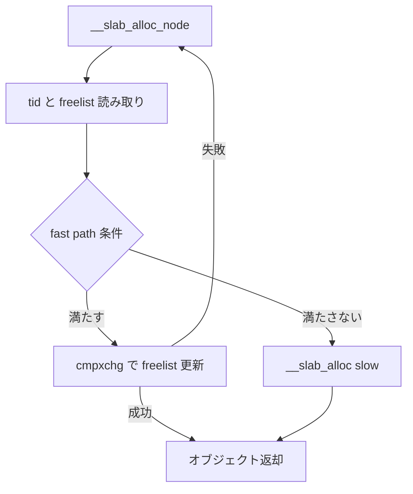

# 第8章 per-CPU slab と freelist

> **本章で読むソース**
>
> - [`mm/slub.c` L418-L434](https://github.com/gregkh/linux/blob/v6.18.38/mm/slub.c#L418-L434)
> - [`mm/slub.c` L4871-L4913](https://github.com/gregkh/linux/blob/v6.18.38/mm/slub.c#L4871-L4913)
> - [`mm/slub.c` L4937-L4941](https://github.com/gregkh/linux/blob/v6.18.38/mm/slub.c#L4937-L4941)
> - [`mm/slub.c` L4941-L4960](https://github.com/gregkh/linux/blob/v6.18.38/mm/slub.c#L4941-L4960)
> - [`mm/slub.c` L5307-L5316](https://github.com/gregkh/linux/blob/v6.18.38/mm/slub.c#L5307-L5316)
> - [`mm/slub.c` L5397-L5405](https://github.com/gregkh/linux/blob/v6.18.38/mm/slub.c#L5397-L5405)

## この章の狙い

SLUB の **kmem_cache_cpu** と lockless freelist が、プリエンプション下でも整合する仕組みを読む。
`__slab_alloc_node` の cmpxchg 経路と slow path への分岐を追う。

## 前提

- [SLUB と kmem_cache、kmalloc](07-slub-kmalloc-cache.md)
- [同期と RCU：per-CPU 変数](../../locking/part00-foundation/02-percpu.md)

## kmem_cache_cpu のレイアウト

freelist ポインタと tid は `this_cpu_cmpxchg_double` のアラインメント要件を満たす。

[`mm/slub.c` L418-L434](https://github.com/gregkh/linux/blob/v6.18.38/mm/slub.c#L418-L434)

```c
struct kmem_cache_cpu {
	union {
		struct {
			void **freelist;	/* Pointer to next available object */
			unsigned long tid;	/* Globally unique transaction id */
		};
		freelist_aba_t freelist_tid;
	};
	struct slab *slab;	/* The slab from which we are allocating */
#ifdef CONFIG_SLUB_CPU_PARTIAL
	struct slab *partial;	/* Partially allocated slabs */
#endif
	local_trylock_t lock;	/* Protects the fields above */
#ifdef CONFIG_SLUB_STATS
	unsigned int stat[NR_SLUB_STAT_ITEMS];
#endif
};
```

`slab` は現在消費中のスラブページを指す。

## __slab_alloc_node の tid 順序

`raw_cpu_ptr` で cpu_slab を取り、`tid` を `READ_ONCE` してから freelist を読む。
順序を守らないと別 tid のオブジェクトを誤って消費する。

[`mm/slub.c` L4871-L4913](https://github.com/gregkh/linux/blob/v6.18.38/mm/slub.c#L4871-L4913)

```c
static __always_inline void *__slab_alloc_node(struct kmem_cache *s,
		gfp_t gfpflags, int node, unsigned long addr, size_t orig_size)
{
	struct kmem_cache_cpu *c;
	struct slab *slab;
	unsigned long tid;
	void *object;

redo:
	/*
	 * Must read kmem_cache cpu data via this cpu ptr. Preemption is
	 * enabled. We may switch back and forth between cpus while
	 * reading from one cpu area. That does not matter as long
	 * as we end up on the original cpu again when doing the cmpxchg.
	 *
	 * We must guarantee that tid and kmem_cache_cpu are retrieved on the
	 * same cpu. We read first the kmem_cache_cpu pointer and use it to read
	 * the tid. If we are preempted and switched to another cpu between the
	 * two reads, it's OK as the two are still associated with the same cpu
	 * and cmpxchg later will validate the cpu.
	 */
	c = raw_cpu_ptr(s->cpu_slab);
	tid = READ_ONCE(c->tid);

	/*
	 * Irqless object alloc/free algorithm used here depends on sequence
	 * of fetching cpu_slab's data. tid should be fetched before anything
	 * on c to guarantee that object and slab associated with previous tid
	 * won't be used with current tid. If we fetch tid first, object and
	 * slab could be one associated with next tid and our alloc/free
	 * request will be failed. In this case, we will retry. So, no problem.
	 */
	barrier();

	/*
	 * The transaction ids are globally unique per cpu and per operation on
	 * a per cpu queue. Thus they can be guarantee that the cmpxchg_double
	 * occurs on the right processor and that there was no operation on the
	 * linked list in between.
	 */

	object = c->freelist;
	slab = c->slab;
```

## fast path 条件と slow path 落ち

freelist、slab、NUMA ノード一致が揃わなければ `__slab_alloc` へ。

[`mm/slub.c` L4937-L4941](https://github.com/gregkh/linux/blob/v6.18.38/mm/slub.c#L4937-L4941)

```c
	if (!USE_LOCKLESS_FAST_PATH() ||
	    unlikely(!object || !slab || !node_match(slab, node))) {
		object = __slab_alloc(s, gfpflags, node, addr, c, orig_size);
	} else {
```

## cmpxchg による freelist 更新

成功時は次のオブジェクトへ freelist を進め、tid を更新する。

[`mm/slub.c` L4941-L4960](https://github.com/gregkh/linux/blob/v6.18.38/mm/slub.c#L4941-L4960)

```c
		void *next_object = get_freepointer_safe(s, object);

		/*
		 * The cmpxchg will only match if there was no additional
		 * operation and if we are on the right processor.
		 *
		 * The cmpxchg does the following atomically (without lock
		 * semantics!)
		 * 1. Relocate first pointer to the current per cpu area.
		 * 2. Verify that tid and freelist have not been changed
		 * 3. If they were not changed replace tid and freelist
		 *
		 * Since this is without lock semantics the protection is only
		 * against code executing on this cpu *not* from access by
		 * other cpus.
		 */
		if (unlikely(!__update_cpu_freelist_fast(s, object, next_object, tid))) {
			note_cmpxchg_failure("slab_alloc", s, tid);
			goto redo;
		}
```

失敗時は `redo` ラベルへ戻り再試行する。

## slab_alloc_node のコメント

[`mm/slub.c` L5307-L5316](https://github.com/gregkh/linux/blob/v6.18.38/mm/slub.c#L5307-L5316)

```c
/*
 * Inlined fastpath so that allocation functions (kmalloc, kmem_cache_alloc)
 * have the fastpath folded into their functions. So no function call
 * overhead for requests that can be satisfied on the fastpath.
 *
 * The fastpath works by first checking if the lockless freelist can be used.
 * If not then __slab_alloc is called for slow processing.
 *
 * Otherwise we can simply pick the next object from the lockless free list.
 */
```

## NUMA ノード指定割り当て

[`mm/slub.c` L5397-L5405](https://github.com/gregkh/linux/blob/v6.18.38/mm/slub.c#L5397-L5405)

```c
void *kmem_cache_alloc_node_noprof(struct kmem_cache *s, gfp_t gfpflags, int node)
{
	void *ret = slab_alloc_node(s, NULL, gfpflags, node, _RET_IP_, s->object_size);

	trace_kmem_cache_alloc(_RET_IP_, ret, s, gfpflags, node);

	return ret;
}
EXPORT_SYMBOL(kmem_cache_alloc_node_noprof);
```

`__GFP_THISNODE` が無いと他ノードへフォールバックしうる。

## 処理の流れ



## 高速化と最適化の工夫

**per-CPU freelist** はグローバルロックを避け、割り込み安全な fast path を提供する。
tid と cmpxchg_double で ABA と CPU 間混線を検出し、失敗時はリトライするだけに留める。
partial slab は CPU ローカルに保持し、node 共有は slow path に押し込む。

> **7.x 系での変化**
> v6.18.38 では [`__slab_alloc_node`](https://github.com/gregkh/linux/blob/v6.18.38/mm/slub.c#L4871-L4960) 本体に tid と cmpxchg による lockless fast path があり、失敗時だけ [`__slab_alloc`](https://github.com/gregkh/linux/blob/v6.18.38/mm/slub.c#L4839-L4863) が `___slab_alloc` へ進む。
> v7.1.3 では [`__slab_alloc_node`](https://github.com/gregkh/linux/blob/v7.1.3/mm/slub.c#L4485-L4511) は NUMA 方針の前処理のあと [`___slab_alloc`](https://github.com/gregkh/linux/blob/v7.1.3/mm/slub.c#L4406-L4482) へ委譲する薄い入口になる。
> v6.18.38 の freelist と tid による cmpxchg fast path は、v7.1.3 では [`alloc_from_pcs`](https://github.com/gregkh/linux/blob/v7.1.3/mm/slub.c#L4744-L4752) が `local_trylock(&s->cpu_sheaves->lock)` で per-CPU sheaf から取り出す方式へ置き換わる。
> [`slab_alloc_node`](https://github.com/gregkh/linux/blob/v7.1.3/mm/slub.c#L4884-L4887) は `alloc_from_pcs` 失敗時に `__slab_alloc_node` → `___slab_alloc` へ落ちる。

## まとめ

kmem_cache_cpu は freelist、tid、slab の三つ組で lockless 割り当てを実現する。
条件不一致時は `__slab_alloc` が kmem_cache_cpu の local lock、slab lock、kmem_cache_node の list_lock 等を使い、CPU partial、node partial、新規 slab の順で補充する。
NUMA 指定は `node_match` で fast path の適格性を絞る。

## 関連する章

- [SLUB と kmem_cache、kmalloc](07-slub-kmalloc-cache.md)
- [NUMA バランシングの fault 側](../part05-advanced/20-numa-fault-balancing.md)
