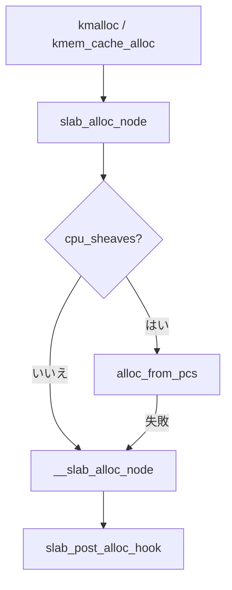

# 第9章 SLUB と kmem_cache、kmalloc

> **本章で読むソース**
>
> - [`mm/slab.h` L238-L267](https://github.com/gregkh/linux/blob/v6.18.38/mm/slab.h#L238-L267)
> - [`mm/slab_common.c` L283-L329](https://github.com/gregkh/linux/blob/v6.18.38/mm/slab_common.c#L283-L329)
> - [`mm/slub.c` L5317-L5350](https://github.com/gregkh/linux/blob/v6.18.38/mm/slub.c#L5317-L5350)
> - [`mm/slub.c` L5352-L5361](https://github.com/gregkh/linux/blob/v6.18.38/mm/slub.c#L5352-L5361)
> - [`mm/slub.c` L5719-L5723](https://github.com/gregkh/linux/blob/v6.18.38/mm/slub.c#L5719-L5723)
> - [`mm/slub.c` L137-L142](https://github.com/gregkh/linux/blob/v6.18.38/mm/slub.c#L137-L142)

## この章の狙い

カーネルオブジェクト割り当ての既定実装 **SLUB** が、`kmem_cache` と `kmalloc` でどう公開 API を束ねるかを読む。
キャッシュ作成から `slab_alloc_node` への入口までを追う。

## 前提

- [`__alloc_pages` の fast path と slow path](../part01-physical/04-alloc-pages-path.md)

## kmem_cache 構造体

各スラブキャッシュは per-CPU `cpu_slab`、オブジェクトサイズ、スラブオーダを保持する。

[`mm/slab.h` L238-L267](https://github.com/gregkh/linux/blob/v6.18.38/mm/slab.h#L238-L267)

```c
struct kmem_cache {
	struct kmem_cache_cpu __percpu *cpu_slab;
	struct lock_class_key lock_key;
	struct slub_percpu_sheaves __percpu *cpu_sheaves;
	/* Used for retrieving partial slabs, etc. */
	slab_flags_t flags;
	unsigned long min_partial;
	unsigned int size;		/* Object size including metadata */
	unsigned int object_size;	/* Object size without metadata */
	struct reciprocal_value reciprocal_size;
	unsigned int offset;		/* Free pointer offset */
#ifdef CONFIG_SLUB_CPU_PARTIAL
	/* Number of per cpu partial objects to keep around */
	unsigned int cpu_partial;
	/* Number of per cpu partial slabs to keep around */
	unsigned int cpu_partial_slabs;
#endif
	unsigned int sheaf_capacity;
	struct kmem_cache_order_objects oo;

	/* Allocation and freeing of slabs */
	struct kmem_cache_order_objects min;
	gfp_t allocflags;		/* gfp flags to use on each alloc */
	int refcount;			/* Refcount for slab cache destroy */
	void (*ctor)(void *object);	/* Object constructor */
	unsigned int inuse;		/* Offset to metadata */
	unsigned int align;		/* Alignment */
	unsigned int red_left_pad;	/* Left redzone padding size */
	const char *name;		/* Name (only for display!) */
	struct list_head list;		/* List of slab caches */
```

`oo` はスラブ1枚あたりのオブジェクト数とオーダをエンコードする。

## kmem_cache_create の流れ

`__kmem_cache_create_args` は mutex で直列化し、同名とサイズの検査後にエイリアスまたは新規作成へ進む。

[`mm/slab_common.c` L283-L329](https://github.com/gregkh/linux/blob/v6.18.38/mm/slab_common.c#L283-L329)

```c
struct kmem_cache *__kmem_cache_create_args(const char *name,
					    unsigned int object_size,
					    struct kmem_cache_args *args,
					    slab_flags_t flags)
{
	struct kmem_cache *s = NULL;
	const char *cache_name;
	int err;

#ifdef CONFIG_SLUB_DEBUG
	/*
	 * If no slab_debug was enabled globally, the static key is not yet
	 * enabled by setup_slub_debug(). Enable it if the cache is being
	 * created with any of the debugging flags passed explicitly.
	 * It's also possible that this is the first cache created with
	 * SLAB_STORE_USER and we should init stack_depot for it.
	 */
	if (flags & SLAB_DEBUG_FLAGS)
		static_branch_enable(&slub_debug_enabled);
	if (flags & SLAB_STORE_USER)
		stack_depot_init();
#else
	flags &= ~SLAB_DEBUG_FLAGS;
#endif

	mutex_lock(&slab_mutex);

	err = kmem_cache_sanity_check(name, object_size);
	if (err) {
		goto out_unlock;
	}

	if (flags & ~SLAB_FLAGS_PERMITTED) {
		err = -EINVAL;
		goto out_unlock;
	}

	/* Fail closed on bad usersize of useroffset values. */
	if (!IS_ENABLED(CONFIG_HARDENED_USERCOPY) ||
	    WARN_ON(!args->usersize && args->useroffset) ||
	    WARN_ON(object_size < args->usersize ||
		    object_size - args->usersize < args->useroffset))
		args->usersize = args->useroffset = 0;

	if (!args->usersize && !args->sheaf_capacity)
		s = __kmem_cache_alias(name, object_size, args->align, flags,
				       args->ctor);
```

`kmalloc-*` 系の汎用キャッシュはサイズ別にエイリアスされる。

## slab_alloc_node 入口

fast path は lockless freelist、失敗時は `__slab_alloc` へ。

[`mm/slub.c` L5317-L5350](https://github.com/gregkh/linux/blob/v6.18.38/mm/slub.c#L5317-L5350)

```c
static __fastpath_inline void *slab_alloc_node(struct kmem_cache *s, struct list_lru *lru,
		gfp_t gfpflags, int node, unsigned long addr, size_t orig_size)
{
	void *object;
	bool init = false;

	s = slab_pre_alloc_hook(s, gfpflags);
	if (unlikely(!s))
		return NULL;

	object = kfence_alloc(s, orig_size, gfpflags);
	if (unlikely(object))
		goto out;

	if (s->cpu_sheaves)
		object = alloc_from_pcs(s, gfpflags, node);

	if (!object)
		object = __slab_alloc_node(s, gfpflags, node, addr, orig_size);

	maybe_wipe_obj_freeptr(s, object);
	init = slab_want_init_on_alloc(gfpflags, s);

out:
	/*
	 * When init equals 'true', like for kzalloc() family, only
	 * @orig_size bytes might be zeroed instead of s->object_size
	 * In case this fails due to memcg_slab_post_alloc_hook(),
	 * object is set to NULL
	 */
	slab_post_alloc_hook(s, lru, gfpflags, 1, &object, init, orig_size);

	return object;
}
```

`slab_post_alloc_hook` で memcg 課金や KASAN 初期化が走る。

## kmem_cache_alloc

[`mm/slub.c` L5352-L5361](https://github.com/gregkh/linux/blob/v6.18.38/mm/slub.c#L5352-L5361)

```c
void *kmem_cache_alloc_noprof(struct kmem_cache *s, gfp_t gfpflags)
{
	void *ret = slab_alloc_node(s, NULL, gfpflags, NUMA_NO_NODE, _RET_IP_,
				    s->object_size);

	trace_kmem_cache_alloc(_RET_IP_, ret, s, gfpflags, NUMA_NO_NODE);

	return ret;
}
EXPORT_SYMBOL(kmem_cache_alloc_noprof);
```

## kmalloc のサイズ振り分け

[`mm/slub.c` L5719-L5723](https://github.com/gregkh/linux/blob/v6.18.38/mm/slub.c#L5719-L5723)

```c
void *__kmalloc_noprof(size_t size, gfp_t flags)
{
	return __do_kmalloc_node(size, NULL, flags, NUMA_NO_NODE, _RET_IP_);
}
EXPORT_SYMBOL(__kmalloc_noprof);
```

`__do_kmalloc_node` がサイズに応じた汎用キャッシュを選ぶ。

## fast path の設計コメント

[`mm/slub.c` L137-L142](https://github.com/gregkh/linux/blob/v6.18.38/mm/slub.c#L137-L142)

```c
 *   The fast path allocation (slab_alloc_node()) and freeing (do_slab_free())
 *   are fully lockless when satisfied from the percpu slab (and when
 *   cmpxchg_double is possible to use, otherwise slab_lock is taken).
 *   They also don't disable preemption or migration or irqs. They rely on
 *   the transaction id (tid) field to detect being preempted or moved to
 *   another cpu.
```

## 処理の流れ



## 高速化と最適化の工夫

SLUB は **per-CPU freelist と transaction id** でロックなし fast path を実現する。
スラブは可能な限りフルに使い、partial スラブは node 単位で共有する。
オブジェクトサイズごとのキャッシュエイリアスで、kmalloc のサイズ判定を定数時間に近づける。

## まとめ

`kmem_cache` がスラブのメタデータを保持し、`slab_alloc_node` が割り当ての共通入口である。
kmalloc はサイズ別キャッシュへのディスパッチに徹する。
memcg 課金は post_alloc hook で後付けされる。

## 関連する章

- [per-CPU slab と freelist](10-slub-percpu-freelist.md)
- [memcg とメモリ cgroup](../part05-advanced/31-memcg.md)
