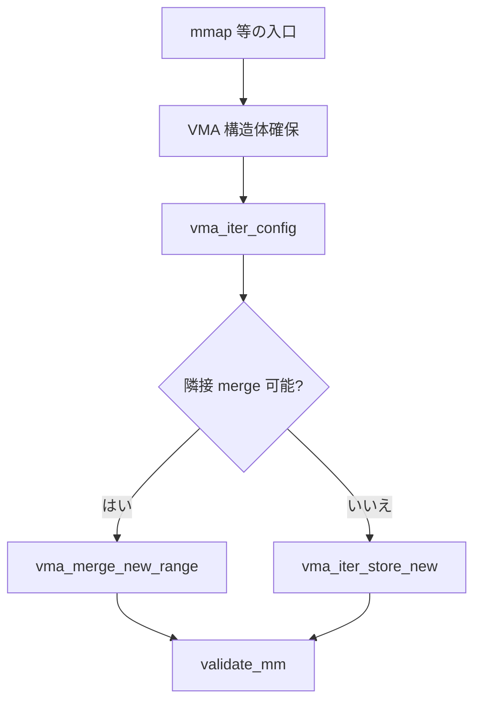

# 第9章 VMA と Maple Tree

> **本章で読むソース**
>
> - [`include/linux/mm_types.h` L813-L839](https://github.com/gregkh/linux/blob/v6.18.38/include/linux/mm_types.h#L813-L839)
> - [`mm/init-mm.c` L32-L38](https://github.com/gregkh/linux/blob/v6.18.38/mm/init-mm.c#L32-L38)
> - [`mm/vma.c` L1833-L1846](https://github.com/gregkh/linux/blob/v6.18.38/mm/vma.c#L1833-L1846)
> - [`mm/vma.c` L2829-L2837](https://github.com/gregkh/linux/blob/v6.18.38/mm/vma.c#L2829-L2837)
> - [`mm/vma.h` L69-L88](https://github.com/gregkh/linux/blob/v6.18.38/mm/vma.h#L69-L88)
> - [`mm/vma.h` L553-L558](https://github.com/gregkh/linux/blob/v6.18.38/mm/vma.h#L553-L558)

## この章の狙い

プロセスごとの仮想アドレス範囲 **VMA** が `mm_struct` 内の **Maple Tree** にどう格納されるかを読む。
foundation 分冊の Maple Tree 概論を前提に、mm 固有の `vma_iter` 操作に焦点を当てる。

## 前提

- [全体像と横断基盤：Maple Tree](../../foundation/part03-datastructures/12-maple-tree.md)
- [プロセスとスケジューラ：task_struct](../../sched/part00-process/01-task-struct.md)

## vm_area_struct のアドレス範囲

VMA は `[vm_start, vm_end)` の半開区間と `vm_mm`、アクセス権を持つ。

[`include/linux/mm_types.h` L813-L839](https://github.com/gregkh/linux/blob/v6.18.38/include/linux/mm_types.h#L813-L839)

```c
struct vm_area_struct {
	/* The first cache line has the info for VMA tree walking. */

	union {
		struct {
			/* VMA covers [vm_start; vm_end) addresses within mm */
			unsigned long vm_start;
			unsigned long vm_end;
		};
		freeptr_t vm_freeptr; /* Pointer used by SLAB_TYPESAFE_BY_RCU */
	};

	/*
	 * The address space we belong to.
	 * Unstable RCU readers are allowed to read this.
	 */
	struct mm_struct *vm_mm;
	pgprot_t vm_page_prot;          /* Access permissions of this VMA. */

	/*
	 * Flags, see mm.h.
	 * To modify use vm_flags_{init|reset|set|clear|mod} functions.
	 */
	union {
		const vm_flags_t vm_flags;
		vm_flags_t __private __vm_flags;
	};
```

先頭キャッシュラインは木走査用に最適化されている。

## mm_struct の maple_tree

[`mm/init-mm.c` L32-L38](https://github.com/gregkh/linux/blob/v6.18.38/mm/init-mm.c#L32-L38)

```c
struct mm_struct init_mm = {
	.mm_mt		= MTREE_INIT_EXT(mm_mt, MM_MT_FLAGS, init_mm.mmap_lock),
	.pgd		= swapper_pg_dir,
	.mm_users	= ATOMIC_INIT(2),
	.mm_count	= ATOMIC_INIT(1),
	.write_protect_seq = SEQCNT_ZERO(init_mm.write_protect_seq),
	MMAP_LOCK_INITIALIZER(init_mm)
```

各 `mm_struct` は `mm_mt`（Maple Tree）に VMA を格納する。
範囲キーは仮想アドレスであり、lookup は O(log n) で行われる。

## vma_link：新規 VMA の挿入

mmap 完了後、`vma_link` が `vma_iter_prealloc` でノード分裂用メモリを確保し、`vma_iter_store_new` で木へ挿入する。

[`mm/vma.c` L1833-L1846](https://github.com/gregkh/linux/blob/v6.18.38/mm/vma.c#L1833-L1846)

```c
int vma_link(struct mm_struct *mm, struct vm_area_struct *vma)
{
	VMA_ITERATOR(vmi, mm, 0);

	vma_iter_config(&vmi, vma->vm_start, vma->vm_end);
	if (vma_iter_prealloc(&vmi, vma))
		return -ENOMEM;

	vma_start_write(vma);
	vma_iter_store_new(&vmi, vma);
	vma_link_file(vma);
	mm->map_count++;
	validate_mm(mm);
	return 0;
```

ファイルマップでは続けて `vma_link_file` が `address_space` の i_mmap へ VMA を登録する。

## do_brk_flags：隣接 VMA の拡張

`brk` は末尾が隣接する既存 VMA なら `vma_merge_new_range` で拡張を試み、失敗時だけ新規 VMA を作る。

[`mm/vma.c` L2829-L2837](https://github.com/gregkh/linux/blob/v6.18.38/mm/vma.c#L2829-L2837)

```c
	if (vma && vma->vm_end == addr) {
		VMG_STATE(vmg, mm, vmi, addr, addr + len, vm_flags, PHYS_PFN(addr));

		vmg.prev = vma;
		/* vmi is positioned at prev, which this mode expects. */
		vmg.just_expand = true;

		if (vma_merge_new_range(&vmg))
			goto out;
```

merge 成功時は `map_count` を増やさず、木ノード数も抑えられる。

## VMG_STATE と merge 状態

[`mm/vma.h` L69-L88](https://github.com/gregkh/linux/blob/v6.18.38/mm/vma.h#L69-L88)

```c
struct vma_merge_struct {
	struct mm_struct *mm;
	struct vma_iterator *vmi;
	/*
	 * Adjacent VMAs, any of which may be NULL if not present:
	 *
	 * |------|--------|------|
	 * | prev | middle | next |
	 * |------|--------|------|
	 *
	 * middle may not yet exist in the case of a proposed new VMA being
	 * merged, or it may be an existing VMA.
	 *
	 * next may be assigned by the caller.
	 */
	struct vm_area_struct *prev;
	struct vm_area_struct *middle;
	struct vm_area_struct *next;
	/* This is the VMA we ultimately target to become the merged VMA. */
	struct vm_area_struct *target;
```

merge と split の状態機械がここに集約される。

## vma_iter_store_new

[`mm/vma.h` L553-L558](https://github.com/gregkh/linux/blob/v6.18.38/mm/vma.h#L553-L558)

```c
static inline void vma_iter_store_new(struct vma_iterator *vmi,
				      struct vm_area_struct *vma)
{
	vma_mark_attached(vma);
	vma_iter_store_overwrite(vmi, vma);
}
```

`vma_mark_attached` で RCU 読み取り側が新 VMA を認識できるようにしてから、範囲キーで上書き挿入する。

## 処理の流れ



## 高速化と最適化の工夫

Maple Tree は **連続アドレス範囲を1ノードにまとめ**、VMA 数が多いプロセスでも木の深さを抑える。
`vma_iter_prealloc` は挿入前にノード分裂用メモリを確保し、挿入失敗を減らす。
merge により `map_count` と木ノードの両方を削減する。

## まとめ

VMA は半開区間とフラグの集合であり、Maple Tree がアドレス順索引を提供する。
新規挿入は `vma_link` 経由の `vma_iter_store_new`、拡張は `do_brk_flags` が merge を優先する。
foundation 分冊の Maple Tree API 詳細はそちらを参照し、本分冊では mm の利用側を追った。

## 関連する章

- [mmap と munmap](10-mmap-munmap.md)
- [ページフォールトと `handle_mm_fault`](11-page-fault.md)
