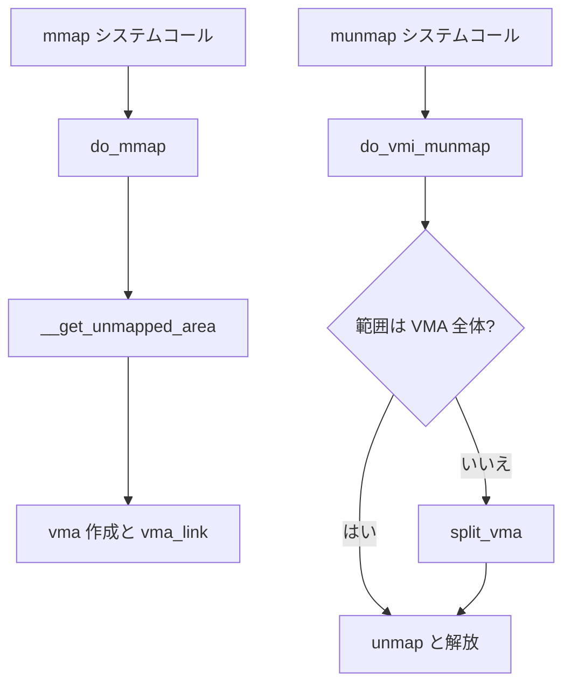

# 第10章 mmap と munmap

> **本章で読むソース**
>
> - [`mm/mmap.c` L566-L604](https://github.com/gregkh/linux/blob/v6.18.38/mm/mmap.c#L566-L604)
> - [`mm/mmap.c` L334-L378](https://github.com/gregkh/linux/blob/v6.18.38/mm/mmap.c#L334-L378)
> - [`mm/mmap.c` L403-L408](https://github.com/gregkh/linux/blob/v6.18.38/mm/mmap.c#L403-L408)
> - [`mm/mmap.c` L811-L853](https://github.com/gregkh/linux/blob/v6.18.38/mm/mmap.c#L811-L853)
> - [`mm/vma.c` L1604-L1627](https://github.com/gregkh/linux/blob/v6.18.38/mm/vma.c#L1604-L1627)
> - [`mm/vma.c` L1663-L1679](https://github.com/gregkh/linux/blob/v6.18.38/mm/vma.c#L1663-L1679)

## この章の狙い

ユーザー空間の **mmap** が `do_mmap` を経て VMA を作る流れと、**munmap** が `do_vmi_munmap` で範囲を外す流れを読む。

## 前提

- [VMA と Maple Tree](09-vma-maple-tree.md)

## ksys_mmap_pgoff：システムコール入口

ファイルディスクリプタの解決と hugetlb 整列のあと、`vm_mmap_pgoff` へ進む。

[`mm/mmap.c` L566-L604](https://github.com/gregkh/linux/blob/v6.18.38/mm/mmap.c#L566-L604)

```c
unsigned long ksys_mmap_pgoff(unsigned long addr, unsigned long len,
			      unsigned long prot, unsigned long flags,
			      unsigned long fd, unsigned long pgoff)
{
	struct file *file = NULL;
	unsigned long retval;

	if (!(flags & MAP_ANONYMOUS)) {
		audit_mmap_fd(fd, flags);
		file = fget(fd);
		if (!file)
			return -EBADF;
		if (is_file_hugepages(file)) {
			len = ALIGN(len, huge_page_size(hstate_file(file)));
		} else if (unlikely(flags & MAP_HUGETLB)) {
			retval = -EINVAL;
			goto out_fput;
		}
	} else if (flags & MAP_HUGETLB) {
		struct hstate *hs;

		hs = hstate_sizelog((flags >> MAP_HUGE_SHIFT) & MAP_HUGE_MASK);
		if (!hs)
			return -EINVAL;

		len = ALIGN(len, huge_page_size(hs));
		/*
		 * VM_NORESERVE is used because the reservations will be
		 * taken when vm_ops->mmap() is called
		 */
		file = hugetlb_file_setup(HUGETLB_ANON_FILE, len,
				VM_NORESERVE,
				HUGETLB_ANONHUGE_INODE,
				(flags >> MAP_HUGE_SHIFT) & MAP_HUGE_MASK);
		if (IS_ERR(file))
			return PTR_ERR(file);
	}

	retval = vm_mmap_pgoff(file, addr, len, prot, flags, pgoff);
```

## do_mmap：長さと map_count の検証

`mmap_lock` 保持下で長さ、オフセット溢出、`sysctl_max_map_count` を検査する。

[`mm/mmap.c` L334-L378](https://github.com/gregkh/linux/blob/v6.18.38/mm/mmap.c#L334-L378)

```c
unsigned long do_mmap(struct file *file, unsigned long addr,
			unsigned long len, unsigned long prot,
			unsigned long flags, vm_flags_t vm_flags,
			unsigned long pgoff, unsigned long *populate,
			struct list_head *uf)
{
	struct mm_struct *mm = current->mm;
	int pkey = 0;

	*populate = 0;

	mmap_assert_write_locked(mm);

	if (!len)
		return -EINVAL;

	/*
	 * Does the application expect PROT_READ to imply PROT_EXEC?
	 *
	 * (the exception is when the underlying filesystem is noexec
	 *  mounted, in which case we don't add PROT_EXEC.)
	 */
	if ((prot & PROT_READ) && (current->personality & READ_IMPLIES_EXEC))
		if (!(file && path_noexec(&file->f_path)))
			prot |= PROT_EXEC;

	/* force arch specific MAP_FIXED handling in get_unmapped_area */
	if (flags & MAP_FIXED_NOREPLACE)
		flags |= MAP_FIXED;

	if (!(flags & MAP_FIXED))
		addr = round_hint_to_min(addr);

	/* Careful about overflows.. */
	len = PAGE_ALIGN(len);
	if (!len)
		return -ENOMEM;

	/* offset overflow? */
	if ((pgoff + (len >> PAGE_SHIFT)) < pgoff)
		return -EOVERFLOW;

	/* Too many mappings? */
	if (mm->map_count > sysctl_max_map_count)
		return -ENOMEM;
```

## __get_unmapped_area の呼び出し

検証後、空き仮想アドレスを `__get_unmapped_area` で決める。

[`mm/mmap.c` L403-L408](https://github.com/gregkh/linux/blob/v6.18.38/mm/mmap.c#L403-L408)

```c
	/* Obtain the address to map to. we verify (or select) it and ensure
	 * that it represents a valid section of the address space.
	 */
	addr = __get_unmapped_area(file, addr, len, pgoff, flags, vm_flags);
	if (IS_ERR_VALUE(addr))
		return addr;
```

## MAP_FIXED とアドレス選択

`MAP_FIXED` でない場合はファイルの `get_unmapped_area` か `mm_get_unmapped_area_vmflags` が空きを探す。

[`mm/mmap.c` L811-L853](https://github.com/gregkh/linux/blob/v6.18.38/mm/mmap.c#L811-L853)

```c
unsigned long
__get_unmapped_area(struct file *file, unsigned long addr, unsigned long len,
		unsigned long pgoff, unsigned long flags, vm_flags_t vm_flags)
{
	unsigned long (*get_area)(struct file *, unsigned long,
				  unsigned long, unsigned long, unsigned long)
				  = NULL;

	unsigned long error = arch_mmap_check(addr, len, flags);
	if (error)
		return error;

	/* Careful about overflows.. */
	if (len > TASK_SIZE)
		return -ENOMEM;

	if (file) {
		if (file->f_op->get_unmapped_area)
			get_area = file->f_op->get_unmapped_area;
	} else if (flags & MAP_SHARED) {
		/*
		 * mmap_region() will call shmem_zero_setup() to create a file,
		 * so use shmem's get_unmapped_area in case it can be huge.
		 */
		get_area = shmem_get_unmapped_area;
	}

	/* Always treat pgoff as zero for anonymous memory. */
	if (!file)
		pgoff = 0;

	if (get_area) {
		addr = get_area(file, addr, len, pgoff, flags);
	} else if (IS_ENABLED(CONFIG_TRANSPARENT_HUGEPAGE) && !file
		   && !addr /* no hint */
		   && IS_ALIGNED(len, PMD_SIZE)) {
		/* Ensures that larger anonymous mappings are THP aligned. */
		addr = thp_get_unmapped_area_vmflags(file, addr, len,
						     pgoff, flags, vm_flags);
	} else {
		addr = mm_get_unmapped_area_vmflags(current->mm, file, addr, len,
						    pgoff, flags, vm_flags);
	}
```

## do_vmi_munmap

munmap は範囲と重なる最初の VMA を見つけ、`do_vmi_align_munmap` へ進む。

[`mm/vma.c` L1604-L1627](https://github.com/gregkh/linux/blob/v6.18.38/mm/vma.c#L1604-L1627)

```c
int do_vmi_munmap(struct vma_iterator *vmi, struct mm_struct *mm,
		  unsigned long start, size_t len, struct list_head *uf,
		  bool unlock)
{
	unsigned long end;
	struct vm_area_struct *vma;

	if ((offset_in_page(start)) || start > TASK_SIZE || len > TASK_SIZE-start)
		return -EINVAL;

	end = start + PAGE_ALIGN(len);
	if (end == start)
		return -EINVAL;

	/* Find the first overlapping VMA */
	vma = vma_find(vmi, end);
	if (!vma) {
		if (unlock)
			mmap_write_unlock(mm);
		return 0;
	}

	return do_vmi_align_munmap(vmi, vma, mm, start, end, uf, unlock);
}
```

## 部分 unmap 時の VMA split

範囲が VMA の一部だけなら `vma_modify` が `split_vma` で前後に分割する。

[`mm/vma.c` L1663-L1679](https://github.com/gregkh/linux/blob/v6.18.38/mm/vma.c#L1663-L1679)

```c
	/* Split any preceding portion of the VMA. */
	if (vma->vm_start < start) {
		int err = split_vma(vmg->vmi, vma, start, 1);

		if (err)
			return ERR_PTR(err);
	}

	/* Split any trailing portion of the VMA. */
	if (vma->vm_end > end) {
		int err = split_vma(vmg->vmi, vma, end, 0);

		if (err)
			return ERR_PTR(err);
	}

	return vma;
```

## 処理の流れ



## 高速化と最適化の工夫

mmap は **遅延割り当て** が前提であり、VMA 作成だけでは物理ページを消費しない。
匿名 THP 向けに `thp_get_unmapped_area_vmflags` で PMD 整列アドレスを選べる。
merge と split の設計により、細片 VMA の増殖を mmap 側で抑える。

## まとめ

`do_mmap` は検証後に `__get_unmapped_area` でアドレスを決め、VMA を挿入する。
munmap は `do_vmi_munmap` が重なりを解消し、必要なら `split_vma` で VMA を分割する。
物理メモリの実体はページフォールト章で割り当てられる。

## 関連する章

- [ページフォールトと `handle_mm_fault`](11-page-fault.md)
- [VMA と Maple Tree](09-vma-maple-tree.md)
