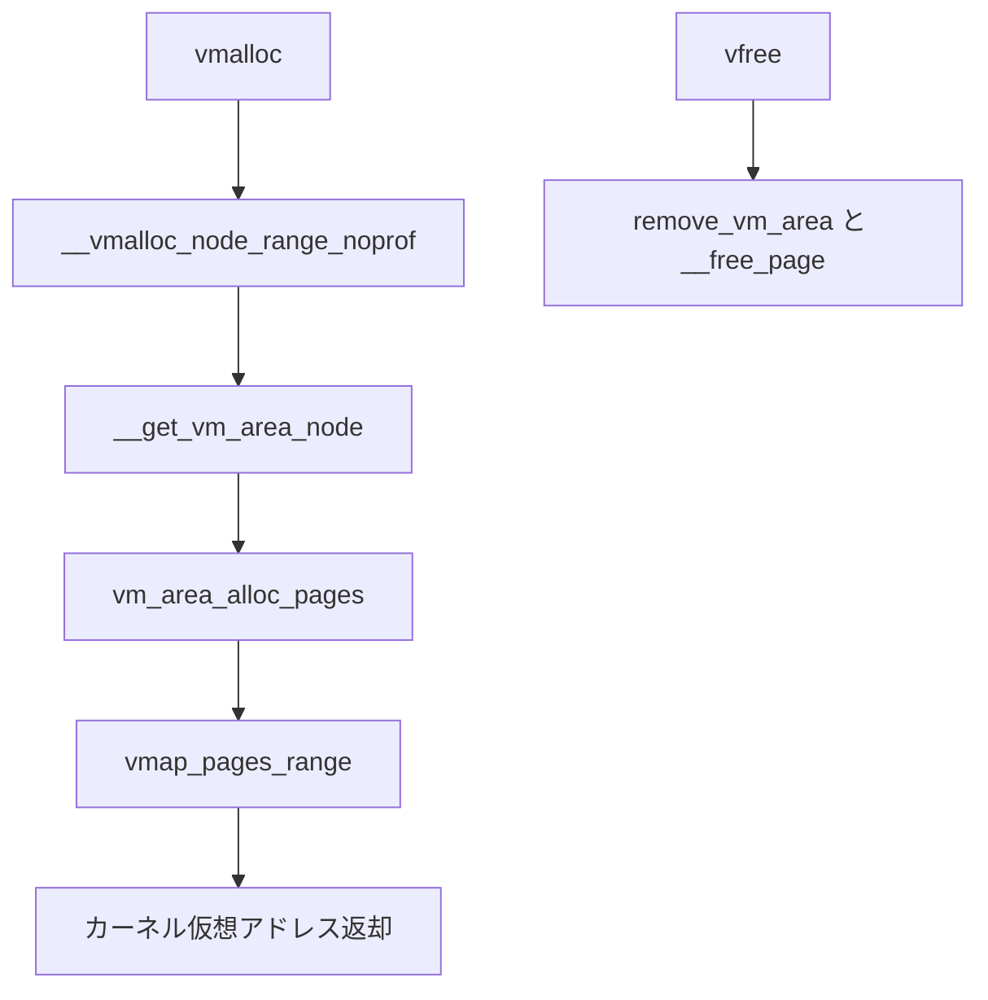

# 第12章 vmalloc

> **本章で読むソース**
>
> - [`mm/vmalloc.c` L3827-L3867](https://github.com/gregkh/linux/blob/v6.18.38/mm/vmalloc.c#L3827-L3867)
> - [`mm/vmalloc.c` L3172-L3201](https://github.com/gregkh/linux/blob/v6.18.38/mm/vmalloc.c#L3172-L3201)
> - [`mm/vmalloc.c` L3732-L3740](https://github.com/gregkh/linux/blob/v6.18.38/mm/vmalloc.c#L3732-L3740)
> - [`mm/vmalloc.c` L3773-L3778](https://github.com/gregkh/linux/blob/v6.18.38/mm/vmalloc.c#L3773-L3778)
> - [`include/linux/mm.h` L1243-L1244](https://github.com/gregkh/linux/blob/v6.18.38/include/linux/mm.h#L1243-L1244)
> - [`mm/vmalloc.c` L3411-L3449](https://github.com/gregkh/linux/blob/v6.18.38/mm/vmalloc.c#L3411-L3449)

## この章の狙い

カーネル仮想空間の連続アドレスを **vmalloc** がどう確保するかを読む。
物理ページはバディから取るが、仮想アドレスは vmalloc 領域にマップされる点が通常の kmalloc 経路と異なる。

## 前提

- [ゾーン、ノード、PFN](../part00-foundation/03-zones-nodes-pfn.md)

## __vmalloc_node_range_noprof：入口

サイズ検査のあと `__get_vm_area_node` で vmalloc 領域の空きを予約する。

[`mm/vmalloc.c` L3827-L3867](https://github.com/gregkh/linux/blob/v6.18.38/mm/vmalloc.c#L3827-L3867)

```c
void *__vmalloc_node_range_noprof(unsigned long size, unsigned long align,
			unsigned long start, unsigned long end, gfp_t gfp_mask,
			pgprot_t prot, unsigned long vm_flags, int node,
			const void *caller)
{
	struct vm_struct *area;
	void *ret;
	kasan_vmalloc_flags_t kasan_flags = KASAN_VMALLOC_NONE;
	unsigned long original_align = align;
	unsigned int shift = PAGE_SHIFT;

	if (WARN_ON_ONCE(!size))
		return NULL;

	if ((size >> PAGE_SHIFT) > totalram_pages()) {
		warn_alloc(gfp_mask, NULL,
			"vmalloc error: size %lu, exceeds total pages",
			size);
		return NULL;
	}

	if (vmap_allow_huge && (vm_flags & VM_ALLOW_HUGE_VMAP)) {
		/*
		 * Try huge pages. Only try for PAGE_KERNEL allocations,
		 * others like modules don't yet expect huge pages in
		 * their allocations due to apply_to_page_range not
		 * supporting them.
		 */

		if (arch_vmap_pmd_supported(prot) && size >= PMD_SIZE)
			shift = PMD_SHIFT;
		else
			shift = arch_vmap_pte_supported_shift(size);

		align = max(original_align, 1UL << shift);
	}

again:
	area = __get_vm_area_node(size, align, shift, VM_ALLOC |
				  VM_UNINITIALIZED | vm_flags, start, end, node,
				  gfp_mask, caller);
```

## __get_vm_area_node：仮想アドレス予約

`alloc_vmap_area` で vmalloc レンジ内の連続仮想アドレスを確保する。

[`mm/vmalloc.c` L3172-L3201](https://github.com/gregkh/linux/blob/v6.18.38/mm/vmalloc.c#L3172-L3201)

```c
struct vm_struct *__get_vm_area_node(unsigned long size,
		unsigned long align, unsigned long shift, unsigned long flags,
		unsigned long start, unsigned long end, int node,
		gfp_t gfp_mask, const void *caller)
{
	struct vmap_area *va;
	struct vm_struct *area;
	unsigned long requested_size = size;

	BUG_ON(in_interrupt());
	size = ALIGN(size, 1ul << shift);
	if (unlikely(!size))
		return NULL;

	if (flags & VM_IOREMAP)
		align = 1ul << clamp_t(int, get_count_order_long(size),
				       PAGE_SHIFT, IOREMAP_MAX_ORDER);

	area = kzalloc_node(sizeof(*area), gfp_mask & GFP_RECLAIM_MASK, node);
	if (unlikely(!area))
		return NULL;

	if (!(flags & VM_NO_GUARD))
		size += PAGE_SIZE;

	area->flags = flags;
	area->caller = caller;
	area->requested_size = requested_size;

	va = alloc_vmap_area(size, align, start, end, node, gfp_mask, 0, area);
```

`IS_ERR(va)` 時は `area` を解放して NULL を返す。

## vm_area_alloc_pages：物理ページ割り当て

予約した仮想領域に対応する物理ページをページアロケータから取る。

[`mm/vmalloc.c` L3732-L3740](https://github.com/gregkh/linux/blob/v6.18.38/mm/vmalloc.c#L3732-L3740)

```c
	area->nr_pages = vm_area_alloc_pages((page_order ?
		gfp_mask & ~__GFP_NOFAIL : gfp_mask) | __GFP_NOWARN,
		node, page_order, nr_small_pages, area->pages);

	atomic_long_add(area->nr_pages, &nr_vmalloc_pages);
	/* All pages of vm should be charged to same memcg, so use first one. */
	if (gfp_mask & __GFP_ACCOUNT && area->nr_pages)
		mod_memcg_page_state(area->pages[0], MEMCG_VMALLOC,
				     area->nr_pages);
```

## vmap_pages_range：ページテーブル構築

確保した物理ページをカーネルページテーブルへマップする。

[`mm/vmalloc.c` L3773-L3778](https://github.com/gregkh/linux/blob/v6.18.38/mm/vmalloc.c#L3773-L3778)

```c
	do {
		ret = vmap_pages_range(addr, addr + size, prot, area->pages,
			page_shift);
		if (nofail && (ret < 0))
			schedule_timeout_uninterruptible(1);
	} while (nofail && (ret < 0));
```

内部では `vmap_pte_range` が PTE を張り、huge vmap 時は PMD 単位のマッピングも試す。

## vmalloc_to_page

[`include/linux/mm.h` L1243-L1244](https://github.com/gregkh/linux/blob/v6.18.38/include/linux/mm.h#L1243-L1244)

```c
/* Support for virtually mapped pages */
struct page *vmalloc_to_page(const void *addr);
```

vmalloc アドレスは線形マップに無いため、`vmalloc_to_page` でページ構造体を辿る。

## vfree：unmap と物理ページ解放

[`mm/vmalloc.c` L3411-L3449](https://github.com/gregkh/linux/blob/v6.18.38/mm/vmalloc.c#L3411-L3449)

```c
void vfree(const void *addr)
{
	struct vm_struct *vm;
	int i;

	if (unlikely(in_interrupt())) {
		vfree_atomic(addr);
		return;
	}

	BUG_ON(in_nmi());
	kmemleak_free(addr);
	might_sleep();

	if (!addr)
		return;

	vm = remove_vm_area(addr);
	if (unlikely(!vm)) {
		WARN(1, KERN_ERR "Trying to vfree() nonexistent vm area (%p)\n",
				addr);
		return;
	}

	if (unlikely(vm->flags & VM_FLUSH_RESET_PERMS))
		vm_reset_perms(vm);
	/* All pages of vm should be charged to same memcg, so use first one. */
	if (vm->nr_pages && !(vm->flags & VM_MAP_PUT_PAGES))
		mod_memcg_page_state(vm->pages[0], MEMCG_VMALLOC, -vm->nr_pages);
	for (i = 0; i < vm->nr_pages; i++) {
		struct page *page = vm->pages[i];

		BUG_ON(!page);
		/*
		 * High-order allocs for huge vmallocs are split, so
		 * can be freed as an array of order-0 allocations
		 */
		__free_page(page);
		cond_resched();
	}
```

## 処理の流れ



## 高速化と最適化の工夫

vmalloc は **物理連続を要求しない** ため、断片化したメモリでも大きなカーネルバッファを作れる。
`VM_ALLOW_HUGE_VMAP` では PMD 単位マッピングを試し、大きな vmap の TLB 圧力を下げる。
代価はページテーブル走査と TLB ミス増加である。

## まとめ

vmalloc は仮想アドレス予約、物理ページ確保、ページテーブル構築の3段で連続カーネル空間を作る。
kmalloc と違いスラブではなくページアロケータと vmap 機構を使う。
`vfree` が逆順でページと vm 構造体を解放する。

## 関連する章

- [`__alloc_pages` の fast path と slow path](../part01-physical/04-alloc-pages-path.md)
- [ページフォールトと handle_mm_fault](11-page-fault.md)
