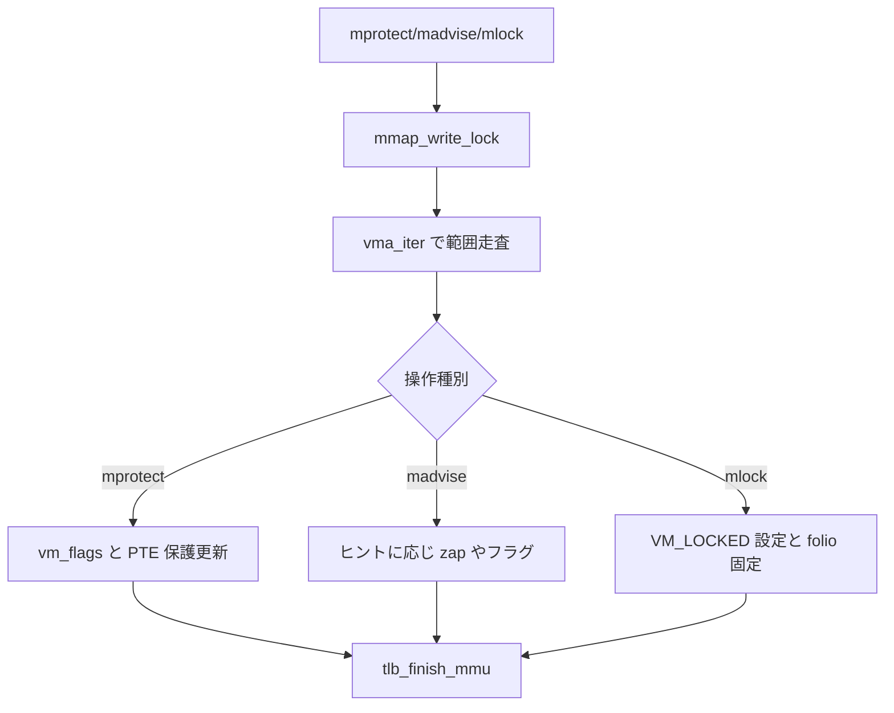

# 第13章 mprotect、madvise、mlock

> **本章で読むソース**
>
> - [`mm/mprotect.c` L861-L907](https://github.com/gregkh/linux/blob/v6.18.38/mm/mprotect.c#L861-L907)
> - [`mm/mprotect.c` L1008-L1012](https://github.com/gregkh/linux/blob/v6.18.38/mm/mprotect.c#L1008-L1012)
> - [`mm/madvise.c` L1991-L1994](https://github.com/gregkh/linux/blob/v6.18.38/mm/madvise.c#L1991-L1994)
> - [`mm/madvise.c` L2009-L2024](https://github.com/gregkh/linux/blob/v6.18.38/mm/madvise.c#L2009-L2024)
> - [`mm/mlock.c` L661-L676](https://github.com/gregkh/linux/blob/v6.18.38/mm/mlock.c#L661-L676)
> - [`mm/mlock.c` L688-L691](https://github.com/gregkh/linux/blob/v6.18.38/mm/mlock.c#L688-L691)

## この章の狙い

**mprotect**、**madvise**、**mlock** が VMA の `vm_flags` を変え、必要に応じて PTE を更新する流れを読む。
mmap で作った VMA を後から変える主要システムコール群である。

## 前提

- [mmap と munmap](12-mmap-munmap.md)
- [VMA と Maple Tree](11-vma-maple-tree.md)

## do_mprotect_pkey：範囲と VMA 走査

アドレス範囲をページ境界に揃え、`vma_iter` で対象 VMA を見つける。
`mmap_write_lock` 下で `vm_flags` とページ保護を更新する。

[`mm/mprotect.c` L861-L907](https://github.com/gregkh/linux/blob/v6.18.38/mm/mprotect.c#L861-L907)

```c
static int do_mprotect_pkey(unsigned long start, size_t len,
		unsigned long prot, int pkey)
{
	unsigned long nstart, end, tmp, reqprot;
	struct vm_area_struct *vma, *prev;
	int error;
	const int grows = prot & (PROT_GROWSDOWN|PROT_GROWSUP);
	const bool rier = (current->personality & READ_IMPLIES_EXEC) &&
				(prot & PROT_READ);
	struct mmu_gather tlb;
	struct vma_iterator vmi;

	start = untagged_addr(start);

	prot &= ~(PROT_GROWSDOWN|PROT_GROWSUP);
	if (grows == (PROT_GROWSDOWN|PROT_GROWSUP)) /* can't be both */
		return -EINVAL;

	if (start & ~PAGE_MASK)
		return -EINVAL;
	if (!len)
		return 0;
	len = PAGE_ALIGN(len);
	end = start + len;
	if (end <= start)
		return -ENOMEM;
	if (!arch_validate_prot(prot, start))
		return -EINVAL;

	reqprot = prot;

	if (mmap_write_lock_killable(current->mm))
		return -EINTR;

	/*
	 * If userspace did not allocate the pkey, do not let
	 * them use it here.
	 */
	error = -EINVAL;
	if ((pkey != -1) && !mm_pkey_is_allocated(current->mm, pkey))
		goto out;

	vma_iter_init(&vmi, current->mm, start);
	vma = vma_find(&vmi, end);
	error = -ENOMEM;
	if (!vma)
		goto out;
```

`mmu_gather` は PTE 更新時の TLB フラッシュをバッチする。

## mprotect システムコール

`do_mprotect_pkey` へ prot を渡す薄いラッパーである。

[`mm/mprotect.c` L1008-L1012](https://github.com/gregkh/linux/blob/v6.18.38/mm/mprotect.c#L1008-L1012)

```c
SYSCALL_DEFINE3(mprotect, unsigned long, start, size_t, len,
		unsigned long, prot)
{
	return do_mprotect_pkey(start, len, prot, -1);
}
```

## madvise：ヒントの適用

`MADV_DONTNEED` や `MADV_FREE` などは VMA フラグ変更や zap を伴う。
ベクトル版は `iov_iter` で複数範囲を順に処理する。

[`mm/madvise.c` L1991-L1994](https://github.com/gregkh/linux/blob/v6.18.38/mm/madvise.c#L1991-L1994)

```c
SYSCALL_DEFINE3(madvise, unsigned long, start, size_t, len_in, int, behavior)
{
	return do_madvise(current->mm, start, len_in, behavior);
}
```

[`mm/madvise.c` L2009-L2024](https://github.com/gregkh/linux/blob/v6.18.38/mm/madvise.c#L2009-L2024)

```c
	total_len = iov_iter_count(iter);

	ret = madvise_lock(&madv_behavior);
	if (ret)
		return ret;
	madvise_init_tlb(&madv_behavior);

	while (iov_iter_count(iter)) {
		unsigned long start = (unsigned long)iter_iov_addr(iter);
		size_t len_in = iter_iov_len(iter);
		int error;

		if (madvise_should_skip(start, len_in, behavior, &error))
			ret = error;
		else
			ret = madvise_do_behavior(start, len_in, &madv_behavior);
```

## mlock と mlock2

`VM_LOCKED` を VMA に付け、物理メモリへのスワップアウトを抑止する。
`MLOCK_ONFAULT` はフォールト時までロックを遅延する。

[`mm/mlock.c` L661-L676](https://github.com/gregkh/linux/blob/v6.18.38/mm/mlock.c#L661-L676)

```c
SYSCALL_DEFINE2(mlock, unsigned long, start, size_t, len)
{
	return do_mlock(start, len, VM_LOCKED);
}

SYSCALL_DEFINE3(mlock2, unsigned long, start, size_t, len, int, flags)
{
	vm_flags_t vm_flags = VM_LOCKED;

	if (flags & ~MLOCK_ONFAULT)
		return -EINVAL;

	if (flags & MLOCK_ONFAULT)
		vm_flags |= VM_LOCKONFAULT;

	return do_mlock(start, len, vm_flags);
}
```

munlock は `apply_vma_lock_flags` でフラグを落とす。

[`mm/mlock.c` L688-L691](https://github.com/gregkh/linux/blob/v6.18.38/mm/mlock.c#L688-L691)

```c
	if (mmap_write_lock_killable(current->mm))
		return -EINTR;
	ret = apply_vma_lock_flags(start, len, 0);
	mmap_write_unlock(current->mm);
```

## 処理の流れ



## 高速化と最適化の工夫

mprotect は `mmu_gather` で TLB フラッシュをバッチし、範囲内の複数 PTE 更新をまとめる。
`MLOCK_ONFAULT` は未タッチページの即時 pin を避け、フォールト経路へコストを遅延する。
madvise の `MADV_FREE` は lazy free で reclaim 判断を vmscan 側へ委ねる。

## まとめ

mprotect、madvise、mlock はいずれも VMA を対象に `mmap_lock` 下で動作する。
PTE 更新が要る操作は mmu_gather と連携し、回収やフォールト経路と接続する。

## 関連する章

- [mremap と page-table 移動](14-mremap.md)
- [zap、mmu_gather、TLB batch](18-zap-mmu-gather-tlb.md)
- [folio reclaim decision と dirty/writeback folio](../part04-reclaim/24-folio-reclaim-decision.md)
