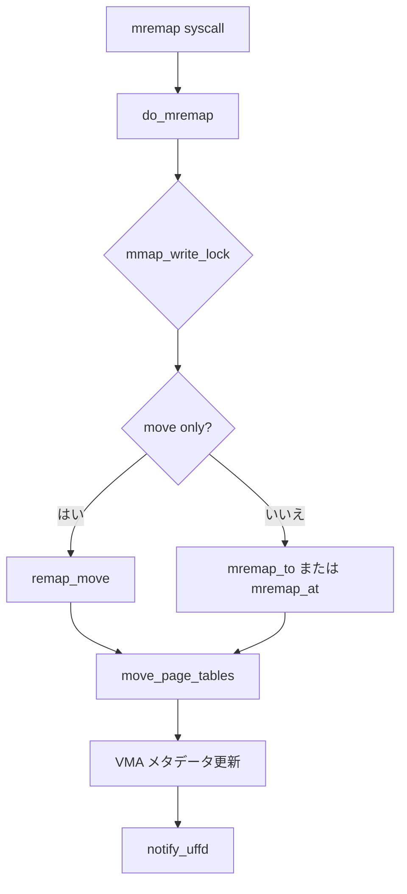

# 第14章 mremap と page-table 移動

> **本章で読むソース**
>
> - [`mm/mremap.c` L1961-L1994](https://github.com/gregkh/linux/blob/v6.18.38/mm/mremap.c#L1961-L1994)
> - [`mm/mremap.c` L1911-L1938](https://github.com/gregkh/linux/blob/v6.18.38/mm/mremap.c#L1911-L1938)
> - [`mm/mremap.c` L261-L301](https://github.com/gregkh/linux/blob/v6.18.38/mm/mremap.c#L261-L301)
> - [`mm/mremap.c` L317-L323](https://github.com/gregkh/linux/blob/v6.18.38/mm/mremap.c#L317-L323)
> - [`mm/mremap.c` L1946-L1951](https://github.com/gregkh/linux/blob/v6.18.38/mm/mremap.c#L1946-L1951)
> - [`mm/mremap.c` L1822-L1849](https://github.com/gregkh/linux/blob/v6.18.38/mm/mremap.c#L1822-L1849)

## この章の狙い

**mremap** が VMA のサイズ変更とアドレス移動を行うとき、ページテーブルエントリをどう移すかを読む。
`move_page_tables` による PTE 移動と `MREMAP_FIXED` の分岐を追う。

## 前提

- [mmap と munmap](12-mmap-munmap.md)
- [mprotect、madvise、mlock](13-mprotect-madvise-mlock.md)

## mremap システムコール入口

`vma_remap_struct` に旧範囲、新サイズ、フラグを詰めて `do_mremap` へ渡す。
userfaultfd 向けの unmap リストも初期化する。

[`mm/mremap.c` L1961-L1994](https://github.com/gregkh/linux/blob/v6.18.38/mm/mremap.c#L1961-L1994)

```c
SYSCALL_DEFINE5(mremap, unsigned long, addr, unsigned long, old_len,
		unsigned long, new_len, unsigned long, flags,
		unsigned long, new_addr)
{
	struct vm_userfaultfd_ctx uf = NULL_VM_UFFD_CTX;
	LIST_HEAD(uf_unmap_early);
	LIST_HEAD(uf_unmap);
	/*
	 * There is a deliberate asymmetry here: we strip the pointer tag
	 * from the old address but leave the new address alone. This is
	 * for consistency with mmap(), where we prevent the creation of
	 * aliasing mappings in userspace by leaving the tag bits of the
	 * mapping address intact. A non-zero tag will cause the subsequent
	 * range checks to reject the address as invalid.
	 *
	 * See Documentation/arch/arm64/tagged-address-abi.rst for more
	 * information.
	 */
	struct vma_remap_struct vrm = {
		.addr = untagged_addr(addr),
		.old_len = old_len,
		.new_len = new_len,
		.flags = flags,
		.new_addr = new_addr,

		.uf = &uf,
		.uf_unmap_early = &uf_unmap_early,
		.uf_unmap = &uf_unmap,

		.remap_type = MREMAP_INVALID, /* We set later. */
	};

	return do_mremap(&vrm);
}
```

## do_mremap：移動のみか拡張縮小か

`vrm_move_only` なら `remap_move`、それ以外は `mremap_to` または `mremap_at` を選ぶ。

[`mm/mremap.c` L1911-L1938](https://github.com/gregkh/linux/blob/v6.18.38/mm/mremap.c#L1911-L1938)

```c
static unsigned long do_mremap(struct vma_remap_struct *vrm)
{
	struct mm_struct *mm = current->mm;
	unsigned long res;
	bool failed;

	vrm->old_len = PAGE_ALIGN(vrm->old_len);
	vrm->new_len = PAGE_ALIGN(vrm->new_len);

	res = check_mremap_params(vrm);
	if (res)
		return res;

	if (mmap_write_lock_killable(mm))
		return -EINTR;
	vrm->mmap_locked = true;

	if (vrm_move_only(vrm)) {
		res = remap_move(vrm);
	} else {
		vrm->vma = vma_lookup(current->mm, vrm->addr);
		res = check_prep_vma(vrm);
		if (res)
			goto out;

		/* Actually execute mremap. */
		res = vrm_implies_new_addr(vrm) ? mremap_to(vrm) : mremap_at(vrm);
	}
```

## remap_move

`MREMAP_MAYMOVE` 指定時は複数 VMA をまとめて移動できる。

[`mm/mremap.c` L1822-L1849](https://github.com/gregkh/linux/blob/v6.18.38/mm/mremap.c#L1822-L1849)

```c
static unsigned long remap_move(struct vma_remap_struct *vrm)
{
	struct vm_area_struct *vma;
	unsigned long start = vrm->addr;
	unsigned long end = vrm->addr + vrm->old_len;
	unsigned long new_addr = vrm->new_addr;
	unsigned long target_addr = new_addr;
	unsigned long res = -EFAULT;
	unsigned long last_end;
	bool seen_vma = false;

	VMA_ITERATOR(vmi, current->mm, start);

	/*
	 * When moving VMAs we allow for batched moves across multiple VMAs,
	 * with all VMAs in the input range [addr, addr + old_len) being moved
	 * (and split as necessary).
	 */
	for_each_vma_range(vmi, vma, end) {
		/* Account for start, end not aligned with VMA start, end. */
		unsigned long addr = max(vma->vm_start, start);
		unsigned long len = min(end, vma->vm_end) - addr;
		unsigned long offset, res_vma;
		bool multi_allowed;

		/* No gap permitted at the start of the range. */
		if (!seen_vma && start < vma->vm_start)
			return -EFAULT;
```

## move_page_tables：PTE のコピーとクリア

旧 PTE を読み取り、新アドレスへ `set_ptes` する。
present PTE では TLB フラッシュが必要になる場合がある。

[`mm/mremap.c` L261-L301](https://github.com/gregkh/linux/blob/v6.18.38/mm/mremap.c#L261-L301)

```c
	for (; old_addr < old_end; old_ptep += nr_ptes, old_addr += nr_ptes * PAGE_SIZE,
		new_ptep += nr_ptes, new_addr += nr_ptes * PAGE_SIZE) {
		VM_WARN_ON_ONCE(!pte_none(*new_ptep));

		nr_ptes = 1;
		max_nr_ptes = (old_end - old_addr) >> PAGE_SHIFT;
		old_pte = ptep_get(old_ptep);
		if (pte_none(old_pte))
			continue;

		/*
		 * If we are remapping a valid PTE, make sure
		 * to flush TLB before we drop the PTL for the
		 * PTE.
		 *
		 * NOTE! Both old and new PTL matter: the old one
		 * for racing with folio_mkclean(), the new one to
		 * make sure the physical page stays valid until
		 * the TLB entry for the old mapping has been
		 * flushed.
		 */
		if (pte_present(old_pte)) {
			nr_ptes = mremap_folio_pte_batch(vma, old_addr, old_ptep,
							 old_pte, max_nr_ptes);
			force_flush = true;
		}
		pte = get_and_clear_ptes(mm, old_addr, old_ptep, nr_ptes);
		pte = move_pte(pte, old_addr, new_addr);
		pte = move_soft_dirty_pte(pte);

		if (need_clear_uffd_wp && pte_marker_uffd_wp(pte))
			pte_clear(mm, new_addr, new_ptep);
		else {
			if (need_clear_uffd_wp) {
				if (pte_present(pte))
					pte = pte_clear_uffd_wp(pte);
				else if (is_swap_pte(pte))
					pte = pte_swp_clear_uffd_wp(pte);
			}
			set_ptes(mm, new_addr, new_ptep, pte, nr_ptes);
		}
	}
```

## アーキテクチャによる PMD/PUD 移動

`CONFIG_HAVE_MOVE_PMD` 等が有効なら上位テーブル単位の移動が可能になる。

[`mm/mremap.c` L317-L323](https://github.com/gregkh/linux/blob/v6.18.38/mm/mremap.c#L317-L323)

```c
static inline bool arch_supports_page_table_move(void)
{
	return IS_ENABLED(CONFIG_HAVE_MOVE_PMD) ||
		IS_ENABLED(CONFIG_HAVE_MOVE_PUD);
}
```

## 拡張領域の populate

mlock 拡張時は `mm_populate` で新範囲を先にフォールトさせる。

[`mm/mremap.c` L1946-L1951](https://github.com/gregkh/linux/blob/v6.18.38/mm/mremap.c#L1946-L1951)

```c
	/* VMA mlock'd + was expanded, so populated expanded region. */
	if (!failed && vrm->populate_expand)
		mm_populate(vrm->new_addr + vrm->old_len, vrm->delta);

	notify_uffd(vrm, failed);
	return res;
```

## 処理の流れ



## 高速化と最適化の工夫

PTE バッチ移動 `mremap_folio_pte_batch` で THP サイズの連続 PTE をまとめて扱う。
アーキテクチャが PMD 移動をサポートすれば、下位テーブル走査を省略できる。
`arch_enter_lazy_mmu_mode` で TLB 更新を遅延し、ループ中のフラッシュ回数を減らす。

## まとめ

mremap は VMA の再配置とサイズ変更を担い、物理ページはそのまま PTE だけ動かす経路がある。
userfaultfd 登録 VMA では uffd-wp ビットの扱いが追加される。

## 関連する章

- [zap、mmu_gather、TLB batch](18-zap-mmu-gather-tlb.md)
- [userfaultfd missing と WP](20-userfaultfd.md)
- [fork と copy_page_range](15-fork-copy-page-range.md)
