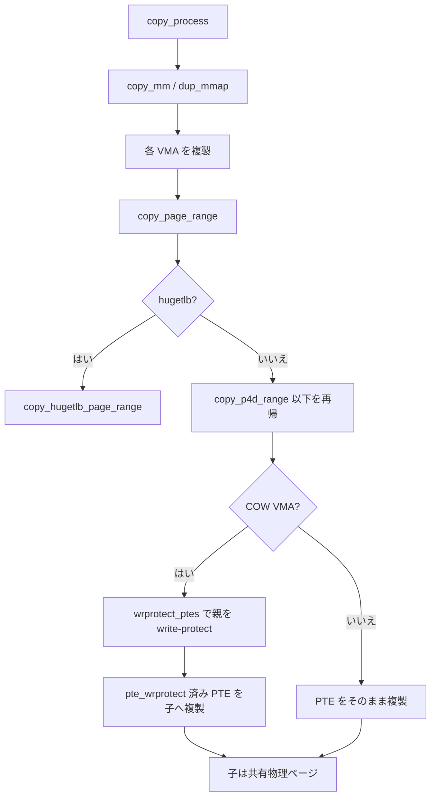

# 第15章 fork と copy_page_range

> **本章で読むソース**
>
> - [`mm/memory.c` L1504-L1558](https://github.com/gregkh/linux/blob/v6.18.38/mm/memory.c#L1504-L1558)
> - [`mm/memory.c` L1560-L1563](https://github.com/gregkh/linux/blob/v6.18.38/mm/memory.c#L1560-L1563)
> - [`mm/memory.c` L1097-L1117](https://github.com/gregkh/linux/blob/v6.18.38/mm/memory.c#L1097-L1117)
> - [`mm/memory.c` L1181-L1187](https://github.com/gregkh/linux/blob/v6.18.38/mm/memory.c#L1181-L1187)
> - [`mm/memory.c` L1450-L1472](https://github.com/gregkh/linux/blob/v6.18.38/mm/memory.c#L1450-L1472)
> - [`mm/memory.c` L1479-L1493](https://github.com/gregkh/linux/blob/v6.18.38/mm/memory.c#L1479-L1493)
> - [`include/linux/pgtable.h` L912-L916](https://github.com/gregkh/linux/blob/v6.18.38/include/linux/pgtable.h#L912-L916)
> - [`include/linux/pgtable.h` L937-L947](https://github.com/gregkh/linux/blob/v6.18.38/include/linux/pgtable.h#L937-L947)
> - [`arch/x86/include/asm/pgtable.h` L408-L418](https://github.com/gregkh/linux/blob/v6.18.38/arch/x86/include/asm/pgtable.h#L408-L418)
> - [`include/linux/mm.h` L1643-L1646](https://github.com/gregkh/linux/blob/v6.18.38/include/linux/mm.h#L1643-L1646)

## この章の狙い

**fork** で子プロセスが親の仮想メモリを継承するとき、`copy_page_range` がページテーブルを複製し COW 用に write-protect する流れを読む。
`copy_process` 本体は sched 分冊が扱い、本章は mm 固有の PTE 複製に限定する。

## 前提

- [mmap と munmap](12-mmap-munmap.md)
- [プロセスとスケジューラ：fork](../../sched/part00-process/02-fork-copy-process.md)

## copy_page_range の入口

`vma_needs_copy` が false なら何もしない。
hugetlb VMA は `copy_hugetlb_page_range` へ分岐する。

[`mm/memory.c` L1504-L1558](https://github.com/gregkh/linux/blob/v6.18.38/mm/memory.c#L1504-L1558)

```c
int
copy_page_range(struct vm_area_struct *dst_vma, struct vm_area_struct *src_vma)
{
	pgd_t *src_pgd, *dst_pgd;
	unsigned long addr = src_vma->vm_start;
	unsigned long end = src_vma->vm_end;
	struct mm_struct *dst_mm = dst_vma->vm_mm;
	struct mm_struct *src_mm = src_vma->vm_mm;
	struct mmu_notifier_range range;
	unsigned long next;
	bool is_cow;
	int ret;

	if (!vma_needs_copy(dst_vma, src_vma))
		return 0;

	if (is_vm_hugetlb_page(src_vma))
		return copy_hugetlb_page_range(dst_mm, src_mm, dst_vma, src_vma);

	/*
	 * We need to invalidate the secondary MMU mappings only when
	 * there could be a permission downgrade on the ptes of the
	 * parent mm. And a permission downgrade will only happen if
	 * is_cow_mapping() returns true.
	 */
	is_cow = is_cow_mapping(src_vma->vm_flags);

	if (is_cow) {
		mmu_notifier_range_init(&range, MMU_NOTIFY_PROTECTION_PAGE,
					0, src_mm, addr, end);
		mmu_notifier_invalidate_range_start(&range);
		/*
		 * Disabling preemption is not needed for the write side, as
		 * the read side doesn't spin, but goes to the mmap_lock.
		 *
		 * Use the raw variant of the seqcount_t write API to avoid
		 * lockdep complaining about preemptibility.
		 */
		vma_assert_write_locked(src_vma);
		raw_write_seqcount_begin(&src_mm->write_protect_seq);
	}

	ret = 0;
	dst_pgd = pgd_offset(dst_mm, addr);
	src_pgd = pgd_offset(src_mm, addr);
	do {
		next = pgd_addr_end(addr, end);
		if (pgd_none_or_clear_bad(src_pgd))
			continue;
		if (unlikely(copy_p4d_range(dst_vma, src_vma, dst_pgd, src_pgd,
					    addr, next))) {
			ret = -ENOMEM;
			break;
		}
	} while (dst_pgd++, src_pgd++, addr = next, addr != end);
```

## copy_p4d_range

PGD 配下を再帰的に複製し、下位の `copy_pud_range` へ委譲する。

[`mm/memory.c` L1450-L1472](https://github.com/gregkh/linux/blob/v6.18.38/mm/memory.c#L1450-L1472)

```c
static inline int
copy_p4d_range(struct vm_area_struct *dst_vma, struct vm_area_struct *src_vma,
	       pgd_t *dst_pgd, pgd_t *src_pgd, unsigned long addr,
	       unsigned long end)
{
	struct mm_struct *dst_mm = dst_vma->vm_mm;
	p4d_t *src_p4d, *dst_p4d;
	unsigned long next;

	dst_p4d = p4d_alloc(dst_mm, dst_pgd, addr);
	if (!dst_p4d)
		return -ENOMEM;
	src_p4d = p4d_offset(src_pgd, addr);
	do {
		next = p4d_addr_end(addr, end);
		if (p4d_none_or_clear_bad(src_p4d))
			continue;
		if (copy_pud_range(dst_vma, src_vma, dst_p4d, src_p4d,
				   addr, next))
			return -ENOMEM;
	} while (dst_p4d++, src_p4d++, addr = next, addr != end);
	return 0;
}
```

## vma_needs_copy

`VM_COPY_ON_FORK` や匿名 VMA ではページテーブル複製が必須になる。

[`mm/memory.c` L1479-L1493](https://github.com/gregkh/linux/blob/v6.18.38/mm/memory.c#L1479-L1493)

```c
static bool
vma_needs_copy(struct vm_area_struct *dst_vma, struct vm_area_struct *src_vma)
{
	/*
	 * We check against dst_vma as while sane VMA flags will have been
	 * copied, VM_UFFD_WP may be set only on dst_vma.
	 */
	if (dst_vma->vm_flags & VM_COPY_ON_FORK)
		return true;
	/*
	 * The presence of an anon_vma indicates an anonymous VMA has page
	 * tables which naturally cannot be reconstituted on page fault.
	 */
	if (src_vma->anon_vma)
		return true;
```

## __copy_present_ptes：親 PTE の write-protect

COW 準備の核心はこの関数にある。
`is_cow_mapping` が真でかつ元 PTE が書き込み可能（`pte_write(pte)`）なら、まず親側のページテーブル実体を `wrprotect_ptes(src_mm, addr, src_pte, nr)` で write-protect する。
これは子ではなく親の `src_pte` を書き換える点が要点で、fork 後は親も書き込みで COW フォールトを踏むようにするための処理である。
続いて同じ変換 `pte = pte_wrprotect(pte)` をローカルの `pte` 値へ適用し、その write-protect 済みエントリを最後の `set_ptes` で子の `dst_pte` へ書き込む。
つまり「親を write-protect し、その write-protect 済みエントリを子へ複製する」向きであり、子だけを保護するのではない。

[`mm/memory.c` L1097-L1117](https://github.com/gregkh/linux/blob/v6.18.38/mm/memory.c#L1097-L1117)

```c
static __always_inline void __copy_present_ptes(struct vm_area_struct *dst_vma,
		struct vm_area_struct *src_vma, pte_t *dst_pte, pte_t *src_pte,
		pte_t pte, unsigned long addr, int nr)
{
	struct mm_struct *src_mm = src_vma->vm_mm;

	/* If it's a COW mapping, write protect it both processes. */
	if (is_cow_mapping(src_vma->vm_flags) && pte_write(pte)) {
		wrprotect_ptes(src_mm, addr, src_pte, nr);
		pte = pte_wrprotect(pte);
	}

	/* If it's a shared mapping, mark it clean in the child. */
	if (src_vma->vm_flags & VM_SHARED)
		pte = pte_mkclean(pte);
	pte = pte_mkold(pte);

	if (!userfaultfd_wp(dst_vma))
		pte = pte_clear_uffd_wp(pte);

	set_ptes(dst_vma->vm_mm, addr, dst_pte, pte, nr);
}
```

## ptep_set_wrprotect と pte_wrprotect：write-protect の実体

親 PTE を write-protect する `wrprotect_ptes` は、連続する `nr` 本の PTE をまとめて処理するラッパーである。
アーキテクチャ独自実装が無ければ、汎用版は `ptep_set_wrprotect` を `nr` 回ループで呼ぶだけになる。

[`include/linux/pgtable.h` L937-L947](https://github.com/gregkh/linux/blob/v6.18.38/include/linux/pgtable.h#L937-L947)

```c
static inline void wrprotect_ptes(struct mm_struct *mm, unsigned long addr,
		pte_t *ptep, unsigned int nr)
{
	for (;;) {
		ptep_set_wrprotect(mm, addr, ptep);
		if (--nr == 0)
			break;
		ptep++;
		addr += PAGE_SIZE;
	}
}
```

`ptep_set_wrprotect` が 1 本分の write-protect 本体である。
`ptep_get` で現在のエントリを読み、`pte_wrprotect` を通した値を `set_pte_at` で同じ `ptep` へ書き戻す。
これによって親のページテーブル実体から書き込み許可が落ちる。

[`include/linux/pgtable.h` L912-L916](https://github.com/gregkh/linux/blob/v6.18.38/include/linux/pgtable.h#L912-L916)

```c
static inline void ptep_set_wrprotect(struct mm_struct *mm, unsigned long address, pte_t *ptep)
{
	pte_t old_pte = ptep_get(ptep);
	set_pte_at(mm, address, ptep, pte_wrprotect(old_pte));
}
```

`pte_wrprotect` は x86 では書き込みビット `_PAGE_RW` を落とす。
`__copy_present_ptes` は同じ `pte_wrprotect` を子へコピーする値にも適用するため、親と子の PTE がそろって書き込み不可になる。

[`arch/x86/include/asm/pgtable.h` L408-L418](https://github.com/gregkh/linux/blob/v6.18.38/arch/x86/include/asm/pgtable.h#L408-L418)

```c
static inline pte_t pte_wrprotect(pte_t pte)
{
	pte = pte_clear_flags(pte, _PAGE_RW);

	/*
	 * Blindly clearing _PAGE_RW might accidentally create
	 * a shadow stack PTE (Write=0,Dirty=1). Move the hardware
	 * dirty value to the software bit, if present.
	 */
	return pte_mksaveddirty(pte);
}
```

## write-protect を経ない例外

親を write-protect して共有する経路には例外がある。
呼び出し元の `copy_present_ptes` は、pin されている可能性のある匿名ページで `folio_try_dup_anon_rmap_pte` が失敗すると、共有をあきらめて `copy_present_page` でその場で物理コピーを作る。
pin されたページを後から差し替えないためで、この経路では親の write-protect を行わず子へ独立した書き込み可能ページを与える。

[`mm/memory.c` L1181-L1187](https://github.com/gregkh/linux/blob/v6.18.38/mm/memory.c#L1181-L1187)

```c
		if (unlikely(folio_try_dup_anon_rmap_pte(folio, page, dst_vma, src_vma))) {
			/* Page may be pinned, we have to copy. */
			folio_put(folio);
			err = copy_present_page(dst_vma, src_vma, dst_pte, src_pte,
						addr, rss, prealloc, page);
			return err ? err : 1;
		}
```

なお `__copy_present_ptes` は共有マッピングでは子側を `pte_mkclean` し、`VM_UFFD_WP` が dst_vma に無ければ `pte_clear_uffd_wp` で uffd-wp ビットを落とす。
soft-dirty や uffd-wp のビットはこの複製経路で個別に調整される。

## COW マッピングの判定

`is_cow_mapping` は私有かつ書き込み可能な VMA を COW 対象とみなす。

[`include/linux/mm.h` L1643-L1646](https://github.com/gregkh/linux/blob/v6.18.38/include/linux/mm.h#L1643-L1646)

```c
static inline bool is_cow_mapping(vm_flags_t flags)
{
	return (flags & (VM_SHARED | VM_MAYWRITE)) == VM_MAYWRITE;
}
```

## write_protect_seq の役割

COW 準備中に親 PTE を write-protect するとき、並行読み取り側が seqcount で検知する。

[`mm/memory.c` L1560-L1563](https://github.com/gregkh/linux/blob/v6.18.38/mm/memory.c#L1560-L1563)

```c
	if (is_cow) {
		raw_write_seqcount_end(&src_mm->write_protect_seq);
		mmu_notifier_invalidate_range_end(&range);
	}
```

## fork.c からの呼び出し

`copy_mm` が親 mm を複製し、各 VMA に対して `copy_page_range` を走らせる。

[`kernel/fork.c` L1489-L1493](https://github.com/gregkh/linux/blob/v6.18.38/kernel/fork.c#L1489-L1493)

```c
	uprobe_start_dup_mmap();
	err = dup_mmap(mm, oldmm);
	if (err)
		goto free_pt;
	uprobe_end_dup_mmap();
```

`dup_mmap` 内部で VMA ツリー複製と `copy_page_range` が繋がる。

## 処理の流れ



## 高速化と最適化の工夫

fork 時点では物理ページをコピーせず PTE を共有するため、fork 自体は高速である。
初回書き込みでのみ `wp_page_copy` が走る（[write fault と COW](17-write-fault-cow.md)）。
`write_protect_seq` はページテーブル更新とフォールトハンドラの競合を seqlock で調整する。

## まとめ

fork の mm 側中核は `copy_page_range` によるページテーブル複製である。
COW 対象 VMA では親の PTE が write-protect され、子は同じ物理ページを参照する。
実際の私有化は書き込みフォールトで起きる。

## 関連する章

- [write fault と COW](17-write-fault-cow.md)
- [zap、mmu_gather、TLB batch](18-zap-mmu-gather-tlb.md)
- [プロセスとスケジューラ：fork](../../sched/part00-process/02-fork-copy-process.md)
