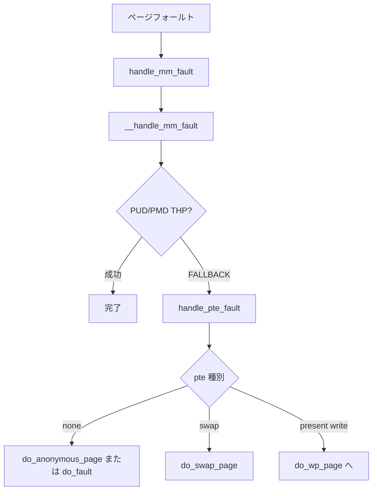

# 第16章 page-table walk と missing fault

> **本章で読むソース**
>
> - [`mm/memory.c` L6485-L6520](https://github.com/gregkh/linux/blob/v6.18.38/mm/memory.c#L6485-L6520)
> - [`mm/memory.c` L6260-L6284](https://github.com/gregkh/linux/blob/v6.18.38/mm/memory.c#L6260-L6284)
> - [`mm/memory.c` L6320-L6324](https://github.com/gregkh/linux/blob/v6.18.38/mm/memory.c#L6320-L6324)
> - [`mm/memory.c` L6209-L6213](https://github.com/gregkh/linux/blob/v6.18.38/mm/memory.c#L6209-L6213)
> - [`mm/memory.c` L5149-L5169](https://github.com/gregkh/linux/blob/v6.18.38/mm/memory.c#L5149-L5169)
> - [`mm/memory.c` L5835-L5869](https://github.com/gregkh/linux/blob/v6.18.38/mm/memory.c#L5835-L5869)

## この章の狙い

**ページフォールト** が `handle_mm_fault` から `__handle_mm_fault` へ降り、PTE が無い **missing fault** が匿名とファイルでどう分岐するかを読む。
write-protect と COW は [write fault と COW](17-write-fault-cow.md) が扱う。

## 前提

- [mmap と munmap](12-mmap-munmap.md)
- [folio とページ管理単位](../part00-foundation/02-folio-page-unit.md)

## handle_mm_fault 入口

VMA lock または mmap_lock を保持した状態で呼ばれる。
ユーザーフォールトでは memcg OOM 処理と lru_gen フックが有効になる。

[`mm/memory.c` L6485-L6520](https://github.com/gregkh/linux/blob/v6.18.38/mm/memory.c#L6485-L6520)

```c
vm_fault_t handle_mm_fault(struct vm_area_struct *vma, unsigned long address,
			   unsigned int flags, struct pt_regs *regs)
{
	/* If the fault handler drops the mmap_lock, vma may be freed */
	struct mm_struct *mm = vma->vm_mm;
	vm_fault_t ret;
	bool is_droppable;

	__set_current_state(TASK_RUNNING);

	ret = sanitize_fault_flags(vma, &flags);
	if (ret)
		goto out;

	if (!arch_vma_access_permitted(vma, flags & FAULT_FLAG_WRITE,
					    flags & FAULT_FLAG_INSTRUCTION,
					    flags & FAULT_FLAG_REMOTE)) {
		ret = VM_FAULT_SIGSEGV;
		goto out;
	}

	is_droppable = !!(vma->vm_flags & VM_DROPPABLE);

	/*
	 * Enable the memcg OOM handling for faults triggered in user
	 * space.  Kernel faults are handled more gracefully.
	 */
	if (flags & FAULT_FLAG_USER)
		mem_cgroup_enter_user_fault();

	lru_gen_enter_fault(vma);

	if (unlikely(is_vm_hugetlb_page(vma)))
		ret = hugetlb_fault(vma->vm_mm, vma, address, flags);
	else
		ret = __handle_mm_fault(vma, address, flags);
```

hugetlb VMA は通常経路を迂回する。

## __handle_mm_fault：PGD から PUD へ

`vm_fault` 構造体にアドレスと gfp を詰め、ページテーブルを降り始める。

[`mm/memory.c` L6260-L6284](https://github.com/gregkh/linux/blob/v6.18.38/mm/memory.c#L6260-L6284)

```c
static vm_fault_t __handle_mm_fault(struct vm_area_struct *vma,
		unsigned long address, unsigned int flags)
{
	struct vm_fault vmf = {
		.vma = vma,
		.address = address & PAGE_MASK,
		.real_address = address,
		.flags = flags,
		.pgoff = linear_page_index(vma, address),
		.gfp_mask = __get_fault_gfp_mask(vma),
	};
	struct mm_struct *mm = vma->vm_mm;
	vm_flags_t vm_flags = vma->vm_flags;
	pgd_t *pgd;
	p4d_t *p4d;
	vm_fault_t ret;

	pgd = pgd_offset(mm, address);
	p4d = p4d_alloc(mm, pgd, address);
	if (!p4d)
		return VM_FAULT_OOM;

	vmf.pud = pud_alloc(mm, p4d, address);
	if (!vmf.pud)
		return VM_FAULT_OOM;
```

## PMD での THP 試行

PUD 階 THP のあと PMD が空なら `create_huge_pmd` を試す。
`VM_FAULT_FALLBACK` なら PTE レベルの `handle_pte_fault` へ降格する。

[`mm/memory.c` L6320-L6324](https://github.com/gregkh/linux/blob/v6.18.38/mm/memory.c#L6320-L6324)

```c
	if (pmd_none(*vmf.pmd) &&
	    thp_vma_allowable_order(vma, vm_flags, TVA_PAGEFAULT, PMD_ORDER)) {
		ret = create_huge_pmd(&vmf);
		if (!(ret & VM_FAULT_FALLBACK))
			return ret;
```

THP の詳細は [THP と fault 時の huge page](../part05-advanced/27-thp-fault.md) が扱う。

## handle_pte_fault：PTE 欠落とスワップ

PTE が無ければ欠落処理、スワップなら `do_swap_page` へ進む。
present かつ書き込み保護は次章へ委ねる。

[`mm/memory.c` L6209-L6213](https://github.com/gregkh/linux/blob/v6.18.38/mm/memory.c#L6209-L6213)

```c
	if (!vmf->pte)
		return do_pte_missing(vmf);

	if (!pte_present(vmf->orig_pte))
		return do_swap_page(vmf);
```

`do_pte_missing` は匿名なら `do_anonymous_page`、ファイルなら `do_fault` へ分岐する。

## do_anonymous_page：匿名ゼロページ

読み取り専用フォールトではゼロページを張り、書き込み時は `alloc_anon_folio` で実体を確保する。

[`mm/memory.c` L5149-L5169](https://github.com/gregkh/linux/blob/v6.18.38/mm/memory.c#L5149-L5169)

```c
static vm_fault_t do_anonymous_page(struct vm_fault *vmf)
{
	struct vm_area_struct *vma = vmf->vma;
	unsigned long addr = vmf->address;
	struct folio *folio;
	vm_fault_t ret = 0;
	int nr_pages = 1;
	pte_t entry;

	/* File mapping without ->vm_ops ? */
	if (vma->vm_flags & VM_SHARED)
		return VM_FAULT_SIGBUS;

	/*
	 * Use pte_alloc() instead of pte_alloc_map(), so that OOM can
	 * be distinguished from a transient failure of pte_offset_map().
	 */
	if (pte_alloc(vma->vm_mm, vmf->pmd))
		return VM_FAULT_OOM;

	/* Use the zero-page for reads */
```

## do_fault：ファイル backed の vm_ops->fault

ファイル VMA は `vm_ops->fault` 経由でページキャッシュ folio を引く。
共有マップの書き込みは `do_shared_fault`、私有は `do_cow_fault` へ分岐する。

[`mm/memory.c` L5835-L5869](https://github.com/gregkh/linux/blob/v6.18.38/mm/memory.c#L5835-L5869)

```c
static vm_fault_t do_fault(struct vm_fault *vmf)
{
	struct vm_area_struct *vma = vmf->vma;
	struct mm_struct *vm_mm = vma->vm_mm;
	vm_fault_t ret;

	/*
	 * The VMA was not fully populated on mmap() or missing VM_DONTEXPAND
	 */
	if (!vma->vm_ops->fault) {
		vmf->pte = pte_offset_map_lock(vmf->vma->vm_mm, vmf->pmd,
					       vmf->address, &vmf->ptl);
		if (unlikely(!vmf->pte))
			ret = VM_FAULT_SIGBUS;
		else {
			/*
			 * Make sure this is not a temporary clearing of pte
			 * by holding ptl and checking again. A R/M/W update
			 * of pte involves: take ptl, clearing the pte so that
			 * we don't have concurrent modification by hardware
			 * followed by an update.
			 */
			if (unlikely(pte_none(ptep_get(vmf->pte))))
				ret = VM_FAULT_SIGBUS;
			else
				ret = VM_FAULT_NOPAGE;

			pte_unmap_unlock(vmf->pte, vmf->ptl);
		}
	} else if (!(vmf->flags & FAULT_FLAG_WRITE))
		ret = do_read_fault(vmf);
	else if (!(vma->vm_flags & VM_SHARED))
		ret = do_cow_fault(vmf);
	else
		ret = do_shared_fault(vmf);
```

## 処理の流れ



## 高速化と最適化の工夫

THP はフォールト時に大きなマッピングを1回で張り、TLB エントリ数を減らす。
匿名読み取りはゼロページで物理メモリを消費せず、初回書き込みまで遅延する。
`VM_FAULT_RETRY` は mmap_lock を手放して I/O 待ちできるようにし、デッドロックを避ける。

## まとめ

`handle_mm_fault` は権限検査後にページテーブルを降り、PTE 欠落を匿名とファイルで処理する。
スワップエントリは `do_swap_page` へ進み、書き込み保護は次章の COW 経路が担う。

## 関連する章

- [write fault と COW](17-write-fault-cow.md)
- [swap-out と swap-in データパス](../part05-advanced/32-swap-data-path.md)
- [THP と fault 時の huge page](../part05-advanced/27-thp-fault.md)
