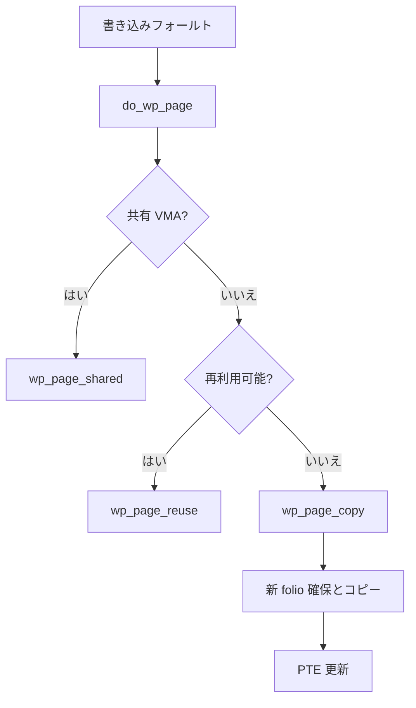

# 第17章 write fault と COW

> **本章で読むソース**
>
> - [`mm/memory.c` L6224-L6229](https://github.com/gregkh/linux/blob/v6.18.38/mm/memory.c#L6224-L6229)
> - [`mm/memory.c` L4063-L4100](https://github.com/gregkh/linux/blob/v6.18.38/mm/memory.c#L4063-L4100)
> - [`mm/memory.c` L4126-L4142](https://github.com/gregkh/linux/blob/v6.18.38/mm/memory.c#L4126-L4142)
> - [`mm/memory.c` L3672-L3718](https://github.com/gregkh/linux/blob/v6.18.38/mm/memory.c#L3672-L3718)
> - [`mm/memory.c` L3730-L3751](https://github.com/gregkh/linux/blob/v6.18.38/mm/memory.c#L3730-L3751)
> - [`mm/memory.c` L1505-L1534](https://github.com/gregkh/linux/blob/v6.18.38/mm/memory.c#L1505-L1534)

## この章の狙い

書き込みフォールトが **write-protect** PTE に当たったとき、`do_wp_page` と `wp_page_copy` が **COW**（Copy-On-Write）で私有ページを作る流れを読む。
fork 後の共有 PTE からの私有化は [fork と copy_page_range](15-fork-copy-page-range.md) が準備する。

## 前提

- [page-table walk と missing fault](16-page-table-walk-missing-fault.md)
- [fork と copy_page_range](15-fork-copy-page-range.md)

## handle_pte_fault から do_wp_page へ

PTE が present かつ書き込みフォールトなら `do_wp_page` が呼ばれる。

[`mm/memory.c` L6224-L6229](https://github.com/gregkh/linux/blob/v6.18.38/mm/memory.c#L6224-L6229)

```c
	if (vmf->flags & (FAULT_FLAG_WRITE|FAULT_FLAG_UNSHARE)) {
		if (!pte_write(entry))
			return do_wp_page(vmf);
		else if (likely(vmf->flags & FAULT_FLAG_WRITE))
			entry = pte_mkdirty(entry);
	}
```

## do_wp_page：共有と私有的分岐

userfaultfd の write-protect を処理したあと、共有マップは `wp_page_shared`、私有はコピーまたは再利用へ進む。

[`mm/memory.c` L4063-L4100](https://github.com/gregkh/linux/blob/v6.18.38/mm/memory.c#L4063-L4100)

```c
static vm_fault_t do_wp_page(struct vm_fault *vmf)
	__releases(vmf->ptl)
{
	const bool unshare = vmf->flags & FAULT_FLAG_UNSHARE;
	struct vm_area_struct *vma = vmf->vma;
	struct folio *folio = NULL;
	pte_t pte;

	if (likely(!unshare)) {
		if (userfaultfd_pte_wp(vma, ptep_get(vmf->pte))) {
			if (!userfaultfd_wp_async(vma)) {
				pte_unmap_unlock(vmf->pte, vmf->ptl);
				return handle_userfault(vmf, VM_UFFD_WP);
			}

			/*
			 * Nothing needed (cache flush, TLB invalidations,
			 * etc.) because we're only removing the uffd-wp bit,
			 * which is completely invisible to the user.
			 */
			pte = pte_clear_uffd_wp(ptep_get(vmf->pte));

			set_pte_at(vma->vm_mm, vmf->address, vmf->pte, pte);
			/*
			 * Update this to be prepared for following up CoW
			 * handling
			 */
			vmf->orig_pte = pte;
		}

		/*
		 * Userfaultfd write-protect can defer flushes. Ensure the TLB
		 * is flushed in this case before copying.
		 */
		if (unlikely(userfaultfd_wp(vmf->vma) &&
			     mm_tlb_flush_pending(vmf->vma->vm_mm)))
			flush_tlb_page(vmf->vma, vmf->address);
	}
```

## 匿名ページの再利用判定

`PageAnonExclusive` や `wp_can_reuse_anon_folio` が真なら物理コピーを省略できる。

[`mm/memory.c` L4126-L4142](https://github.com/gregkh/linux/blob/v6.18.38/mm/memory.c#L4126-L4142)

```c
	/*
	 * Private mapping: create an exclusive anonymous page copy if reuse
	 * is impossible. We might miss VM_WRITE for FOLL_FORCE handling.
	 *
	 * If we encounter a page that is marked exclusive, we must reuse
	 * the page without further checks.
	 */
	if (folio && folio_test_anon(folio) &&
	    (PageAnonExclusive(vmf->page) || wp_can_reuse_anon_folio(folio, vma))) {
		if (!PageAnonExclusive(vmf->page))
			SetPageAnonExclusive(vmf->page);
		if (unlikely(unshare)) {
			pte_unmap_unlock(vmf->pte, vmf->ptl);
			return 0;
		}
		wp_page_reuse(vmf, folio);
		return 0;
```

再利用できなければ `wp_page_copy` へ進む。

## wp_page_copy：物理コピーと PTE 更新

新 folio を確保し、ユーザ空間から内容をコピーする。
PTE を再取得して競合を検査し、新 PTE を張る。

[`mm/memory.c` L3672-L3718](https://github.com/gregkh/linux/blob/v6.18.38/mm/memory.c#L3672-L3718)

```c
static vm_fault_t wp_page_copy(struct vm_fault *vmf)
{
	const bool unshare = vmf->flags & FAULT_FLAG_UNSHARE;
	struct vm_area_struct *vma = vmf->vma;
	struct mm_struct *mm = vma->vm_mm;
	struct folio *old_folio = NULL;
	struct folio *new_folio = NULL;
	pte_t entry;
	int page_copied = 0;
	struct mmu_notifier_range range;
	vm_fault_t ret;
	bool pfn_is_zero;

	delayacct_wpcopy_start();

	if (vmf->page)
		old_folio = page_folio(vmf->page);
	ret = vmf_anon_prepare(vmf);
	if (unlikely(ret))
		goto out;

	pfn_is_zero = is_zero_pfn(pte_pfn(vmf->orig_pte));
	new_folio = folio_prealloc(mm, vma, vmf->address, pfn_is_zero);
	if (!new_folio)
		goto oom;

	if (!pfn_is_zero) {
		int err;

		err = __wp_page_copy_user(&new_folio->page, vmf->page, vmf);
		if (err) {
			/*
			 * COW failed, if the fault was solved by other,
			 * it's fine. If not, userspace would re-fault on
			 * the same address and we will handle the fault
			 * from the second attempt.
			 * The -EHWPOISON case will not be retried.
			 */
			folio_put(new_folio);
			if (old_folio)
				folio_put(old_folio);

			delayacct_wpcopy_end();
			return err == -EHWPOISON ? VM_FAULT_HWPOISON : 0;
		}
		kmsan_copy_page_meta(&new_folio->page, vmf->page);
	}
```

[`mm/memory.c` L3730-L3751](https://github.com/gregkh/linux/blob/v6.18.38/mm/memory.c#L3730-L3751)

```c
	vmf->pte = pte_offset_map_lock(mm, vmf->pmd, vmf->address, &vmf->ptl);
	if (likely(vmf->pte && pte_same(ptep_get(vmf->pte), vmf->orig_pte))) {
		if (old_folio) {
			if (!folio_test_anon(old_folio)) {
				dec_mm_counter(mm, mm_counter_file(old_folio));
				inc_mm_counter(mm, MM_ANONPAGES);
			}
		} else {
			ksm_might_unmap_zero_page(mm, vmf->orig_pte);
			inc_mm_counter(mm, MM_ANONPAGES);
		}
		flush_cache_page(vma, vmf->address, pte_pfn(vmf->orig_pte));
		entry = folio_mk_pte(new_folio, vma->vm_page_prot);
		entry = pte_sw_mkyoung(entry);
		if (unlikely(unshare)) {
			if (pte_soft_dirty(vmf->orig_pte))
				entry = pte_mksoft_dirty(entry);
			if (pte_uffd_wp(vmf->orig_pte))
				entry = pte_mkuffd_wp(entry);
		} else {
			entry = maybe_mkwrite(pte_mkdirty(entry), vma);
		}
```

## fork 時の write-protect 準備

`copy_page_range` は COW マッピングで `write_protect_seq` を進め、子の PTE を write-protect する。

[`mm/memory.c` L1505-L1534](https://github.com/gregkh/linux/blob/v6.18.38/mm/memory.c#L1505-L1534)

```c
copy_page_range(struct vm_area_struct *dst_vma, struct vm_area_struct *src_vma)
{
	pgd_t *src_pgd, *dst_pgd;
	unsigned long addr = src_vma->vm_start;
	unsigned long end = src_vma->vm_end;
	struct mm_struct *dst_mm = dst_vma->vm_mm;
	struct mm_struct *src_mm = src_vma->vm_mm;
	struct mmu_notifier_range range;
	unsigned long next;
	bool is_cow;
	int ret;

	if (!vma_needs_copy(dst_vma, src_vma))
		return 0;

	if (is_vm_hugetlb_page(src_vma))
		return copy_hugetlb_page_range(dst_mm, src_mm, dst_vma, src_vma);

	/*
	 * We need to invalidate the secondary MMU mappings only when
	 * there could be a permission downgrade on the ptes of the
	 * parent mm. And a permission downgrade will only happen if
	 * is_cow_mapping() returns true.
	 */
	is_cow = is_cow_mapping(src_vma->vm_flags);

	if (is_cow) {
		mmu_notifier_range_init(&range, MMU_NOTIFY_PROTECTION_PAGE,
					0, src_mm, addr, end);
		mmu_notifier_invalidate_range_start(&range);
```

## 処理の流れ



## 高速化と最適化の工夫

`PageAnonExclusive` と参照カウント判定で不要な物理コピーを省略する。
ゼロページからの初回書き込みは `folio_prealloc` で専用経路を使い、ユーザコピーを避ける。
fork 時に PTE を write-protect しておくことで、読み取り専用共有はコピー不要のまま維持できる。

## まとめ

write fault は `do_wp_page` が入口で、私有マップでは `wp_page_copy` が COW の本体である。
fork の `copy_page_range` が共有 PTE を準備し、初回書き込みで私有化が起きる。

## 関連する章

- [fork と copy_page_range](15-fork-copy-page-range.md)
- [KSM と匿名 page dedup](../part05-advanced/30-ksm.md)
- [userfaultfd missing と WP](20-userfaultfd.md)
