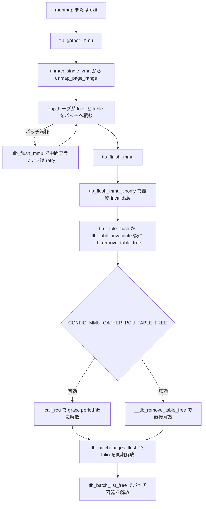

# 第18章 zap、mmu_gather、TLB batch

> **本章で読むソース**
>
> - [`mm/memory.c` L2017-L2035](https://github.com/gregkh/linux/blob/v6.18.38/mm/memory.c#L2017-L2035)
> - [`mm/memory.c` L2038-L2075](https://github.com/gregkh/linux/blob/v6.18.38/mm/memory.c#L2038-L2075)
> - [`mm/mmu_gather.c` L443-L446](https://github.com/gregkh/linux/blob/v6.18.38/mm/mmu_gather.c#L443-L446)
> - [`mm/mmu_gather.c` L496-L536](https://github.com/gregkh/linux/blob/v6.18.38/mm/mmu_gather.c#L496-L536)
> - [`mm/mmu_gather.c` L394-L406](https://github.com/gregkh/linux/blob/v6.18.38/mm/mmu_gather.c#L394-L406)
> - [`mm/mmu_gather.c` L145-L152](https://github.com/gregkh/linux/blob/v6.18.38/mm/mmu_gather.c#L145-L152)
> - [`mm/mmu_gather.c` L294-L306](https://github.com/gregkh/linux/blob/v6.18.38/mm/mmu_gather.c#L294-L306)
> - [`mm/mmu_gather.c` L323-L345](https://github.com/gregkh/linux/blob/v6.18.38/mm/mmu_gather.c#L323-L345)
> - [`mm/mmu_gather.c` L352-L361](https://github.com/gregkh/linux/blob/v6.18.38/mm/mmu_gather.c#L352-L361)
> - [`mm/mmu_gather.c` L19-L49](https://github.com/gregkh/linux/blob/v6.18.38/mm/mmu_gather.c#L19-L49)
> - [`include/asm-generic/tlb.h` L47-L55](https://github.com/gregkh/linux/blob/v6.18.38/include/asm-generic/tlb.h#L47-L55)
> - [`mm/memory.c` L1894-L1908](https://github.com/gregkh/linux/blob/v6.18.38/mm/memory.c#L1894-L1908)
> - [`mm/memory.c` L2199-L2207](https://github.com/gregkh/linux/blob/v6.18.38/mm/memory.c#L2199-L2207)

## この章の狙い

**munmap** やプロセス終了時に PTE を消す **zap** が、`unmap_page_range` と **mmu_gather** で TLB フラッシュをバッチする流れを読む。
arch 固有の shootdown は x86-64 分冊が扱い、本章は汎用 `mmu_gather` に限定する。

## 前提

- [mmap と munmap](12-mmap-munmap.md)
- [mprotect、madvise、mlock](13-mprotect-madvise-mlock.md)

## unmap_page_range

PGD から降りながら `zap_p4d_range` を呼び、範囲内の PTE を解除する。
`tlb_start_vma` と `tlb_end_vma` で VMA 単位の境界をマークする。

[`mm/memory.c` L2017-L2035](https://github.com/gregkh/linux/blob/v6.18.38/mm/memory.c#L2017-L2035)

```c
void unmap_page_range(struct mmu_gather *tlb,
			     struct vm_area_struct *vma,
			     unsigned long addr, unsigned long end,
			     struct zap_details *details)
{
	pgd_t *pgd;
	unsigned long next;

	BUG_ON(addr >= end);
	tlb_start_vma(tlb, vma);
	pgd = pgd_offset(vma->vm_mm, addr);
	do {
		next = pgd_addr_end(addr, end);
		if (pgd_none_or_clear_bad(pgd))
			continue;
		next = zap_p4d_range(tlb, vma, pgd, addr, next, details);
	} while (pgd++, addr = next, addr != end);
	tlb_end_vma(tlb, vma);
}
```

## unmap_single_vma

hugetlb と通常ページで分岐し、通常は `unmap_page_range` へ進む。

[`mm/memory.c` L2038-L2075](https://github.com/gregkh/linux/blob/v6.18.38/mm/memory.c#L2038-L2075)

```c
static void unmap_single_vma(struct mmu_gather *tlb,
		struct vm_area_struct *vma, unsigned long start_addr,
		unsigned long end_addr,
		struct zap_details *details, bool mm_wr_locked)
{
	unsigned long start = max(vma->vm_start, start_addr);
	unsigned long end;

	if (start >= vma->vm_end)
		return;
	end = min(vma->vm_end, end_addr);
	if (end <= vma->vm_start)
		return;

	if (vma->vm_file)
		uprobe_munmap(vma, start, end);

	if (start != end) {
		if (unlikely(is_vm_hugetlb_page(vma))) {
			/*
			 * It is undesirable to test vma->vm_file as it
			 * should be non-null for valid hugetlb area.
			 * However, vm_file will be NULL in the error
			 * cleanup path of mmap_region. When
			 * hugetlbfs ->mmap method fails,
			 * mmap_region() nullifies vma->vm_file
			 * before calling this function to clean up.
			 * Since no pte has actually been setup, it is
			 * safe to do nothing in this case.
			 */
			if (vma->vm_file) {
				zap_flags_t zap_flags = details ?
				    details->zap_flags : 0;
				__unmap_hugepage_range(tlb, vma, start, end,
							     NULL, zap_flags);
			}
		} else
			unmap_page_range(tlb, vma, start, end, details);
	}
```

## tlb_gather_mmu の初期化

ページテーブル破棄前に `mmu_gather` を初期化する。
`tlb_gather_mmu_fullmm` は exec/exit でアドレス空間全体を対象にする。

[`mm/mmu_gather.c` L443-L446](https://github.com/gregkh/linux/blob/v6.18.38/mm/mmu_gather.c#L443-L446)

```c
void tlb_gather_mmu(struct mmu_gather *tlb, struct mm_struct *mm)
{
	__tlb_gather_mmu(tlb, mm, false);
}
```

## tlb_finish_mmu

`tlb_finish_mmu` は unmap の最後に呼ばれる。
まず `tlb_flush_mmu` で最終の TLB invalidate を発行し、その完了後に、バッチへ溜めた folio とページテーブルを解放する。
この順序は入れ替えられない。
解放を先に行うと、TLB に残った古い変換を経由して、解放済みページへの読み書きが起きうるためである。
末尾の `tlb_batch_list_free` は、folio 解放が済んだ後にバッチ連結リストの容器ページを返す。

冒頭の `mm_tlb_flush_nested` 判定は、同じ範囲を非排他ロックで並行更新するスレッドを検知したときに `fullmm` へ昇格させ、範囲を絞らない強制フラッシュに切り替える。

[`mm/mmu_gather.c` L496-L536](https://github.com/gregkh/linux/blob/v6.18.38/mm/mmu_gather.c#L496-L536)

```c
void tlb_finish_mmu(struct mmu_gather *tlb)
{
	/*
	 * We expect an earlier huge_pmd_unshare_flush() call to sort this out,
	 * due to complicated locking requirements with page table unsharing.
	 */
	VM_WARN_ON_ONCE(tlb->fully_unshared_tables);

	/*
	 * If there are parallel threads are doing PTE changes on same range
	 * under non-exclusive lock (e.g., mmap_lock read-side) but defer TLB
	 * flush by batching, one thread may end up seeing inconsistent PTEs
	 * and result in having stale TLB entries.  So flush TLB forcefully
	 * if we detect parallel PTE batching threads.
	 *
	 * However, some syscalls, e.g. munmap(), may free page tables, this
	 * needs force flush everything in the given range. Otherwise this
	 * may result in having stale TLB entries for some architectures,
	 * e.g. aarch64, that could specify flush what level TLB.
	 */
	if (mm_tlb_flush_nested(tlb->mm)) {
		/*
		 * The aarch64 yields better performance with fullmm by
		 * avoiding multiple CPUs spamming TLBI messages at the
		 * same time.
		 *
		 * On x86 non-fullmm doesn't yield significant difference
		 * against fullmm.
		 */
		tlb->fullmm = 1;
		__tlb_reset_range(tlb);
		tlb->freed_tables = 1;
	}

	tlb_flush_mmu(tlb);

#ifndef CONFIG_MMU_GATHER_NO_GATHER
	tlb_batch_list_free(tlb);
#endif
	dec_tlb_flush_pending(tlb->mm);
}
```

## フラッシュと解放の順序

`tlb_flush_mmu` は invalidate と解放を、名前どおりの順で並べる。
`tlb_flush_mmu_tlbonly` が arch のフラッシュ、すなわち最終 invalidate を発行し、その後に `tlb_flush_mmu_free` が解放へ進む。

[`mm/mmu_gather.c` L394-L406](https://github.com/gregkh/linux/blob/v6.18.38/mm/mmu_gather.c#L394-L406)

```c
static void tlb_flush_mmu_free(struct mmu_gather *tlb)
{
	tlb_table_flush(tlb);
#ifndef CONFIG_MMU_GATHER_NO_GATHER
	tlb_batch_pages_flush(tlb);
#endif
}

void tlb_flush_mmu(struct mmu_gather *tlb)
{
	tlb_flush_mmu_tlbonly(tlb);
	tlb_flush_mmu_free(tlb);
}
```

`tlb_flush_mmu_free` の内側で解放されるものは 2 種類あり、経路が異なる。

**folio の遅延解放**：zap ループは `__tlb_remove_folio_pages` で `encoded_page` 配列にページを積む。
`tlb_batch_pages_flush` はそれを `free_pages_and_swap_cache` へ渡し、この場で同期的に解放する。

[`mm/mmu_gather.c` L145-L152](https://github.com/gregkh/linux/blob/v6.18.38/mm/mmu_gather.c#L145-L152)

```c
static void tlb_batch_pages_flush(struct mmu_gather *tlb)
{
	struct mmu_gather_batch *batch;

	for (batch = &tlb->local; batch && batch->nr; batch = batch->next)
		__tlb_batch_free_encoded_pages(batch);
	tlb->active = &tlb->local;
}
```

**ページテーブルの解放**：zap ループは `tlb_remove_table` で `mmu_table_batch` にテーブルを積む。
`tlb_table_flush` は `tlb_table_invalidate` でハードウェアウォーカ向けのキャッシュを無効化した後、`tlb_remove_table_free` でバッチ内のテーブルを解放する。

[`mm/mmu_gather.c` L352-L361](https://github.com/gregkh/linux/blob/v6.18.38/mm/mmu_gather.c#L352-L361)

```c
static void tlb_table_flush(struct mmu_gather *tlb)
{
	struct mmu_table_batch **batch = &tlb->batch;

	if (*batch) {
		tlb_table_invalidate(tlb);
		tlb_remove_table_free(*batch);
		*batch = NULL;
	}
}
```

このテーブル解放の実体は `CONFIG_MMU_GATHER_RCU_TABLE_FREE` の有無で二つに分かれる。
有効時の `tlb_remove_table_free` は `call_rcu` でバッチを登録し、RCU の grace period を待ってから `__tlb_remove_table_free` を走らせる。
無効時は同名の `tlb_remove_table_free` が `__tlb_remove_table_free` を即座に呼び、その場で各テーブルを直接解放する。
folio が常にこの場で同期解放されるのと違い、テーブルは前者の構成でのみ grace period 越しの遅延解放となる。

[`mm/mmu_gather.c` L294-306](https://github.com/gregkh/linux/blob/v6.18.38/mm/mmu_gather.c#L294-L306)

```c
static void tlb_remove_table_free(struct mmu_table_batch *batch)
{
	call_rcu(&batch->rcu, tlb_remove_table_rcu);
}

#else /* !CONFIG_MMU_GATHER_RCU_TABLE_FREE */

static void tlb_remove_table_free(struct mmu_table_batch *batch)
{
	__tlb_remove_table_free(batch);
}

#endif /* CONFIG_MMU_GATHER_RCU_TABLE_FREE */
```

RCU を挟むのは `CONFIG_MMU_GATHER_RCU_TABLE_FREE` 有効時の話である。
その構成では `gup_fast` などのソフトウェアページテーブルウォーカが IRQ 無効のもとでロックレスにテーブルを辿る。
TLB invalidate だけではこの進行中のウォークを止められないので、IRQ 無効区間を RCU リード側とみなし、grace period の待機でウォーク完了を保証してからテーブルページを返す。
一方で TLB フラッシュを IPI で全 CPU に送る arch では、IRQ 無効がその IPI 完了を遅らせて解放前ページの観測を防ぐため、RCU を挟まない直接解放の構成でも安全が保たれる。

## asm-generic の TLB API 契約

`tlb_gather_mmu` から `tlb_finish_mmu` までの呼び順が文書化されている。

[`include/asm-generic/tlb.h` L47-L55](https://github.com/gregkh/linux/blob/v6.18.38/include/asm-generic/tlb.h#L47-L55)

```c
 * The mmu_gather API consists of:
 *
 *  - tlb_gather_mmu() / tlb_gather_mmu_fullmm() / tlb_gather_mmu_vma() /
 *    tlb_finish_mmu()
 *
 *    start and finish a mmu_gather
 *
 *    Finish in particular will issue a (final) TLB invalidate and free
 *    all (remaining) queued pages.
```

## バッチあふれ時の中間フラッシュ

バッチは無限には伸びない。
上限に達すると、`tlb_finish_mmu` を待たずに途中でフラッシュしてから残りを続ける。

folio 側のあふれは `tlb_next_batch` が起点である。
バッチが満杯に近づくと新しいバッチページを確保しようとするが、`MAX_GATHER_BATCH_COUNT` に達しているか `GFP_NOWAIT` の確保が失敗すると `false` を返す。

[`mm/mmu_gather.c` L19-L49](https://github.com/gregkh/linux/blob/v6.18.38/mm/mmu_gather.c#L19-L49)

```c
static bool tlb_next_batch(struct mmu_gather *tlb)
{
	struct mmu_gather_batch *batch;

	/* Limit batching if we have delayed rmaps pending */
	if (tlb->delayed_rmap && tlb->active != &tlb->local)
		return false;

	batch = tlb->active;
	if (batch->next) {
		tlb->active = batch->next;
		return true;
	}

	if (tlb->batch_count == MAX_GATHER_BATCH_COUNT)
		return false;

	batch = (void *)__get_free_page(GFP_NOWAIT);
	if (!batch)
		return false;

	// ... (中略) ...

	return true;
}
```

`tlb_next_batch` が `false` を返すと `__tlb_remove_folio_pages` が `true` を返し、zap 側でこれを受けて `force_flush` を立てる。

[`mm/memory.c` L1671-L1674](https://github.com/gregkh/linux/blob/v6.18.38/mm/memory.c#L1671-L1674)

```c
	if (unlikely(__tlb_remove_folio_pages(tlb, page, nr, delay_rmap))) {
		*force_flush = true;
		*force_break = true;
	}
```

`zap_pte_range` は `force_flush` を見ると、その場で `tlb_flush_mmu` を呼び、invalidate と解放を済ませてから `retry` で残りの範囲へ戻る。

[`mm/memory.c` L1894-L1908](https://github.com/gregkh/linux/blob/v6.18.38/mm/memory.c#L1894-L1908)

```c
	/* Do the actual TLB flush before dropping ptl */
	if (force_flush) {
		tlb_flush_mmu_tlbonly(tlb);
		tlb_flush_rmaps(tlb, vma);
	}
	pte_unmap_unlock(start_pte, ptl);

	/*
	 * If we forced a TLB flush (either due to running out of
	 * batch buffers or because we needed to flush dirty TLB
	 * entries before releasing the ptl), free the batched
	 * memory too. Come back again if we didn't do everything.
	 */
	if (force_flush)
		tlb_flush_mmu(tlb);
```

ページテーブル側のあふれは `tlb_remove_table` が扱う。
テーブル数が `MAX_TABLE_BATCH` に達すると `tlb_table_flush` を途中で実行する。
バッチページの確保自体に失敗したときは、`tlb_remove_table_one` から `__tlb_remove_table_one` へ進み、そのテーブルだけを単発で解放する。
この単発経路も `CONFIG_PT_RECLAIM` の有無で分かれる。
有効時は `call_rcu` で `__tlb_remove_table` を grace period 後に遅延実行する。
無効時は `tlb_remove_table_sync_one` が IPI で全 CPU を同期させ、その完了後に `__tlb_remove_table` で同期解放する。

[`mm/mmu_gather.c` L323-345](https://github.com/gregkh/linux/blob/v6.18.38/mm/mmu_gather.c#L323-L345)

```c
#ifdef CONFIG_PT_RECLAIM
static inline void __tlb_remove_table_one_rcu(struct rcu_head *head)
{
	struct ptdesc *ptdesc;

	ptdesc = container_of(head, struct ptdesc, pt_rcu_head);
	__tlb_remove_table(ptdesc);
}

static inline void __tlb_remove_table_one(void *table)
{
	struct ptdesc *ptdesc;

	ptdesc = table;
	call_rcu(&ptdesc->pt_rcu_head, __tlb_remove_table_one_rcu);
}
#else
static inline void __tlb_remove_table_one(void *table)
{
	tlb_remove_table_sync_one();
	__tlb_remove_table(table);
}
#endif /* CONFIG_PT_RECLAIM */
```

[`mm/mmu_gather.c` L363-L380](https://github.com/gregkh/linux/blob/v6.18.38/mm/mmu_gather.c#L363-L380)

```c
void tlb_remove_table(struct mmu_gather *tlb, void *table)
{
	struct mmu_table_batch **batch = &tlb->batch;

	if (*batch == NULL) {
		*batch = (struct mmu_table_batch *)__get_free_page(GFP_NOWAIT);
		if (*batch == NULL) {
			tlb_table_invalidate(tlb);
			tlb_remove_table_one(table);
			return;
		}
		(*batch)->nr = 0;
	}

	(*batch)->tables[(*batch)->nr++] = table;
	if ((*batch)->nr == MAX_TABLE_BATCH)
		tlb_table_flush(tlb);
}
```

## zap_vma_ptes

範囲内の PTE だけを外す補助 API である。

[`mm/memory.c` L2199-L2207](https://github.com/gregkh/linux/blob/v6.18.38/mm/memory.c#L2199-L2207)

```c
void zap_vma_ptes(struct vm_area_struct *vma, unsigned long address,
		unsigned long size)
{
	if (!range_in_vma(vma, address, address + size) ||
	    		!(vma->vm_flags & VM_PFNMAP))
		return;

	zap_page_range_single(vma, address, size, NULL);
}
```

## 処理の流れ



## 高速化と最適化の工夫

mmu_gather は TLB フラッシュとページ解放をバッチし、unmap 1ページごとの shootdown を避ける。
`__tlb_remove_folio_pages` は folio を zap ループ外へ遅延して最終フラッシュ後に同期解放し、ページテーブルは `tlb_remove_table` で別経路に分ける。
そのテーブル解放は `CONFIG_MMU_GATHER_RCU_TABLE_FREE` 有効時に RCU の grace period 越しの遅延解放となり、無効時は `__tlb_remove_table_free` で直接解放する。
バッチ上限超過時は中間フラッシュが入り、並行 PTE 更新検知時は `fullmm` フラッシュへ昇格する。

> **7.x 系での変化**
>
> テーブルバッチの確保に失敗したときの単発解放経路が、ページテーブルの遅延解放で変わっている。
> v6.18.38 では `CONFIG_PT_RECLAIM` 無効時の `__tlb_remove_table_one` が IPI で全 CPU を同期する `tlb_remove_table_sync_one` を呼んでから解放する。
> v7.1.3 では [`tlb_remove_table_sync_rcu`](https://github.com/gregkh/linux/blob/v7.1.3/mm/mmu_gather.c#L313-L316) が追加され、同じ条件の [`__tlb_remove_table_one`](https://github.com/gregkh/linux/blob/v7.1.3/mm/mmu_gather.c#L359-L363) が IPI の代わりに `synchronize_rcu` の grace period 待ちでソフトウェアウォーカと同期する。

## まとめ

zap はページテーブルを段階的に解除し、mmu_gather が TLB と解放タイミングをまとめる。
munmap は VMA split までが前章までで、本章は PTE 破棄の本体である。

## 関連する章

- [fork と copy_page_range](15-fork-copy-page-range.md)
- [GUP と page pin](19-gup-page-pin.md)
- [rmap と逆引き](../part04-reclaim/22-rmap.md)
