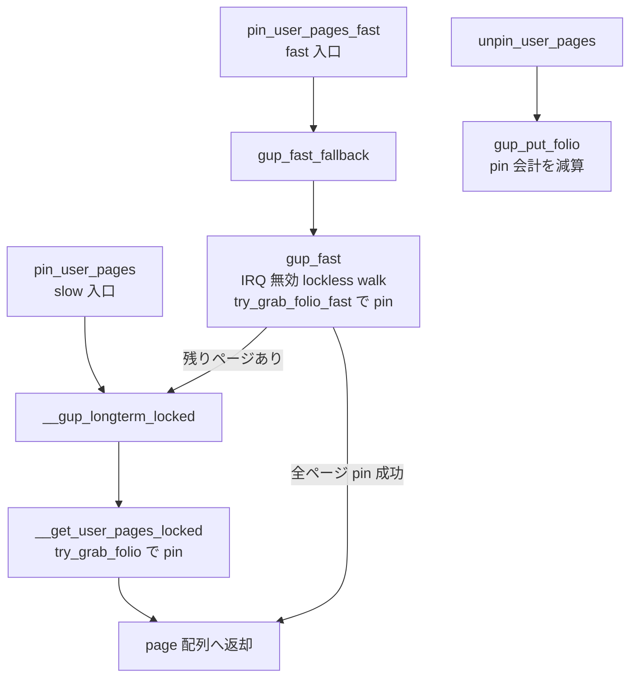

# 第19章 GUP と page pin

> **本章で読むソース**
>
> - [`mm/gup.c` L3387-L3396](https://github.com/gregkh/linux/blob/v6.18.38/mm/gup.c#L3387-L3396)
> - [`mm/gup.c` L140-L171](https://github.com/gregkh/linux/blob/v6.18.38/mm/gup.c#L140-L171)
> - [`mm/gup.c` L102-L114](https://github.com/gregkh/linux/blob/v6.18.38/mm/gup.c#L102-L114)
> - [`include/linux/mm.h` L2054-L2069](https://github.com/gregkh/linux/blob/v6.18.38/include/linux/mm.h#L2054-L2069)
> - [`mm/vmscan.c` L1410-L1418](https://github.com/gregkh/linux/blob/v6.18.38/mm/vmscan.c#L1410-L1418)
> - [`mm/migrate.c` L600-L606](https://github.com/gregkh/linux/blob/v6.18.38/mm/migrate.c#L600-L606)
> - [`mm/gup.c` L3321-L3327](https://github.com/gregkh/linux/blob/v6.18.38/mm/gup.c#L3321-L3327)
> - [`mm/gup.c` L3186-L3233](https://github.com/gregkh/linux/blob/v6.18.38/mm/gup.c#L3186-L3233)
> - [`mm/gup.c` L547-L556](https://github.com/gregkh/linux/blob/v6.18.38/mm/gup.c#L547-L556)
> - [`mm/gup.c` L2738-L2760](https://github.com/gregkh/linux/blob/v6.18.38/mm/gup.c#L2738-L2760)

## この章の狙い

**get_user_pages** 系 API がユーザ空間ページを pin し、DMA や長期参照向けに **FOLL_PIN** で参照カウントを増やす流れを読む。
io_uring や VFIO など consumer の詳細は各分冊へ委ね、mm 側の walk と pin 会計に限定する。

## 前提

- [page-table walk と missing fault](16-page-table-walk-missing-fault.md)
- [zap、mmu_gather、TLB batch](18-zap-mmu-gather-tlb.md)

## pin_user_pages

slow path 側の入口である。
`FOLL_PIN` を強制し、`__gup_longterm_locked` へ直接進む。
fast path を一切試さず、`mmap_lock` を取る通常の walk で pin する。
`FOLL_GET` とは排他である。

[`mm/gup.c` L3387-L3396](https://github.com/gregkh/linux/blob/v6.18.38/mm/gup.c#L3387-L3396)

```c
long pin_user_pages(unsigned long start, unsigned long nr_pages,
		    unsigned int gup_flags, struct page **pages)
{
	int locked = 1;

	if (!is_valid_gup_args(pages, NULL, &gup_flags, FOLL_PIN))
		return 0;
	return __gup_longterm_locked(current->mm, start, nr_pages,
				     pages, &locked, gup_flags);
}
```

## try_grab_folio と FOLL_PIN

slow path の walk が folio ごとに呼ぶ pin の中核である。
`FOLL_PIN` の分岐は、folio の refcount を実際に増やすことでページの寿命を保持し、ページをピンする。
pincount を持つ folio（`folio_has_pincount` が真、実質は large folio）では、refcount を `refs` 分増やしたうえで `_pincount` を同じ `refs` 分増やす。
pincount を持たない folio では、refcount を `refs * GUP_PIN_COUNTING_BIAS` 分だけ増やす。
どちらの分岐でも refcount が増え、その参照が残るあいだ folio は解放されずピンされ続ける。
`FOLL_PIN` がページを固定するのは、この refcount の増加による。

[`mm/gup.c` L140-L171](https://github.com/gregkh/linux/blob/v6.18.38/mm/gup.c#L140-L171)

```c
int __must_check try_grab_folio(struct folio *folio, int refs,
				unsigned int flags)
{
	if (WARN_ON_ONCE(folio_ref_count(folio) <= 0))
		return -ENOMEM;

	if (unlikely(!(flags & FOLL_PCI_P2PDMA) && folio_is_pci_p2pdma(folio)))
		return -EREMOTEIO;

	if (flags & FOLL_GET)
		folio_ref_add(folio, refs);
	else if (flags & FOLL_PIN) {
		/*
		 * Don't take a pin on the zero page - it's not going anywhere
		 * and it is used in a *lot* of places.
		 */
		if (is_zero_folio(folio))
			return 0;

		/*
		 * Increment the normal page refcount field at least once,
		 * so that the page really is pinned.
		 */
		if (folio_has_pincount(folio)) {
			folio_ref_add(folio, refs);
			atomic_add(refs, &folio->_pincount);
		} else {
			folio_ref_add(folio, refs * GUP_PIN_COUNTING_BIAS);
		}

		node_stat_mod_folio(folio, NR_FOLL_PIN_ACQUIRED, refs);
	}

	return 0;
}
```

refcount を増やすのとは別に、`_pincount` と `GUP_PIN_COUNTING_BIAS` は通常の参照と DMA pin を識別する会計を兼ねる。
pincount を持つ folio では `_pincount` に pin 回数が積み上がる。
持たない folio では、refcount のうち `GUP_PIN_COUNTING_BIAS` の倍数の桁が pin 回数を表す。
他サブシステムはこの識別を `folio_maybe_dma_pinned` で読み取り、folio が DMA pin されている可能性を判定する。
`NR_FOLL_PIN_ACQUIRED` 統計は pin 取得と解放の不整合を追跡する。
ゼロページは至る所で使われ移動もしないため、`FOLL_PIN` でもピンしない。

[`include/linux/mm.h` L2054-L2069](https://github.com/gregkh/linux/blob/v6.18.38/include/linux/mm.h#L2054-L2069)

```c
static inline bool folio_maybe_dma_pinned(struct folio *folio)
{
	if (folio_has_pincount(folio))
		return atomic_read(&folio->_pincount) > 0;

	/*
	 * folio_ref_count() is signed. If that refcount overflows, then
	 * folio_ref_count() returns a negative value, and callers will avoid
	 * further incrementing the refcount.
	 *
	 * Here, for that overflow case, use the sign bit to count a little
	 * bit higher via unsigned math, and thus still get an accurate result.
	 */
	return ((unsigned int)folio_ref_count(folio)) >=
		GUP_PIN_COUNTING_BIAS;
}
```

## unpin 時の会計

`gup_put_folio` は pin 取得と対称に `_pincount` または bias 付き refcount を減らす。

[`mm/gup.c` L102-L114](https://github.com/gregkh/linux/blob/v6.18.38/mm/gup.c#L102-L114)

```c
static void gup_put_folio(struct folio *folio, int refs, unsigned int flags)
{
	if (flags & FOLL_PIN) {
		if (is_zero_folio(folio))
			return;
		node_stat_mod_folio(folio, NR_FOLL_PIN_RELEASED, refs);
		if (folio_has_pincount(folio))
			atomic_sub(refs, &folio->_pincount);
		else
			refs *= GUP_PIN_COUNTING_BIAS;
	}

	folio_put_refs(folio, refs);
}
```

## pin_user_pages_fast

fast path 側の別入口である。
`pin_user_pages` が `__gup_longterm_locked` へ直接進むのに対し、こちらは `gup_fast_fallback` へ入る。
`gup_fast_fallback` はまず IRQ 無効の lockless walk である `gup_fast` を試し、そこで `try_grab_folio_fast` により pin する。
要求した全ページを fast で pin できなかったときは、残りだけを `__gup_longterm_locked` へ回す。
つまり fast 入口も、最終的な補完としては slow path を経由しうる。

[`mm/gup.c` L3186-L3233](https://github.com/gregkh/linux/blob/v6.18.38/mm/gup.c#L3186-L3233)

```c
static int gup_fast_fallback(unsigned long start, unsigned long nr_pages,
		unsigned int gup_flags, struct page **pages)
{
	// ... (中略) ...
	nr_pinned = gup_fast(start, end, gup_flags, pages);
	if (nr_pinned == nr_pages || gup_flags & FOLL_FAST_ONLY)
		return nr_pinned;

	/* Slow path: try to get the remaining pages with get_user_pages */
	start += nr_pinned << PAGE_SHIFT;
	pages += nr_pinned;
	ret = __gup_longterm_locked(current->mm, start, nr_pages - nr_pinned,
				    pages, &locked,
				    gup_flags | FOLL_TOUCH | FOLL_UNLOCKABLE);
	// ... (中略) ...
	return ret + nr_pinned;
}
```

fast path の pin は `try_grab_folio_fast` が担う。
`FOLL_LONGTERM` 付きでは、longterm pin 可能でない folio をこの関数が弾いて slow path に委ねる。

[`mm/gup.c` L547-L556](https://github.com/gregkh/linux/blob/v6.18.38/mm/gup.c#L547-L556)

```c
	/*
	 * Can't do FOLL_LONGTERM + FOLL_PIN gup fast path if not in a
	 * right zone, so fail and let the caller fall back to the slow
	 * path.
	 */
	if (unlikely((flags & FOLL_LONGTERM) &&
		     !folio_is_longterm_pinnable(folio))) {
		folio_put_refs(folio, refs);
		return NULL;
	}

[`mm/gup.c` L3321-L3327](https://github.com/gregkh/linux/blob/v6.18.38/mm/gup.c#L3321-L3327)

```c
int pin_user_pages_fast(unsigned long start, int nr_pages,
			unsigned int gup_flags, struct page **pages)
{
	if (!is_valid_gup_args(pages, NULL, &gup_flags, FOLL_PIN))
		return -EINVAL;
	return gup_fast_fallback(start, nr_pages, gup_flags, pages);
}
```

## gup_fast の制約

IRQ 無効下で走る fast path は、長期 pin と書き込みの組み合わせでファイル backed ページを拒否する。

[`mm/gup.c` L2738-L2760](https://github.com/gregkh/linux/blob/v6.18.38/mm/gup.c#L2738-L2760)

```c
static bool gup_fast_folio_allowed(struct folio *folio, unsigned int flags)
{
	bool reject_file_backed = false;
	struct address_space *mapping;
	bool check_secretmem = false;
	unsigned long mapping_flags;

	/*
	 * If we aren't pinning then no problematic write can occur. A long term
	 * pin is the most egregious case so this is the one we disallow.
	 */
	if ((flags & (FOLL_PIN | FOLL_LONGTERM | FOLL_WRITE)) ==
	    (FOLL_PIN | FOLL_LONGTERM | FOLL_WRITE))
		reject_file_backed = true;

	/* We hold a folio reference, so we can safely access folio fields. */

	/* secretmem folios are always order-0 folios. */
	if (IS_ENABLED(CONFIG_SECRETMEM) && !folio_test_large(folio))
		check_secretmem = true;

	if (!reject_file_backed && !check_secretmem)
		return true;
```

## pin_user_pages_unlocked

mmap_lock を保持しない呼び出し向けで、`FOLL_UNLOCKABLE` を付与する。

[`mm/gup.c` L3407-L3418](https://github.com/gregkh/linux/blob/v6.18.38/mm/gup.c#L3407-L3418)

```c
long pin_user_pages_unlocked(unsigned long start, unsigned long nr_pages,
			     struct page **pages, unsigned int gup_flags)
{
	int locked = 0;

	if (!is_valid_gup_args(pages, NULL, &gup_flags,
			       FOLL_PIN | FOLL_TOUCH | FOLL_UNLOCKABLE))
		return 0;

	return __gup_longterm_locked(current->mm, start, nr_pages, pages,
				     &locked, gup_flags);
}
```

## 処理の流れ

2 つの入口は別経路である。
`pin_user_pages` は `__gup_longterm_locked` へ直接進む。
`pin_user_pages_fast` は `gup_fast_fallback` へ入り、fast で取り切れない残りだけを slow path へ回す。



## 高速化と最適化の工夫

gup_fast は IRQ 無効とページテーブル直接参照で slow path より低レイテンシである。
ゼロページ pin 省略は hot path の refcount 更新を削る。
pin 会計の `GUP_PIN_COUNTING_BIAS` は通常の `folio_put` と pin 解放を区別する。

## pin を他サブシステムがどう扱うか

pin された folio をどう避けるかは、サブシステムの呼出元ごとに条件が異なる。
一律に「対象外」とするのではなく、経路ごとに扱いを見る。

reclaim の `shrink_folio_list` は、folio を unmap した後に `folio_maybe_dma_pinned` を確認し、pin されていれば回収せず active 側へ戻す。
コメントは、pin したプロセスが folio を書き換えうるため、その裏側のファイルシステムメタデータを回収したくない、という理由を挙げる。

[`mm/vmscan.c` L1410-L1418](https://github.com/gregkh/linux/blob/v6.18.38/mm/vmscan.c#L1410-L1418)

```c
		/*
		 * Folio is unmapped now so it cannot be newly pinned anymore.
		 * No point in trying to reclaim folio if it is pinned.
		 * Furthermore we don't want to reclaim underlying fs metadata
		 * if the folio is pinned and thus potentially modified by the
		 * pinning process as that may upset the filesystem.
		 */
		if (folio_maybe_dma_pinned(folio))
			goto activate_locked;
```

migration の `__folio_migrate_mapping` は、`folio_maybe_dma_pinned` を直接見るのではなく、期待 refcount `expected_count` での `folio_ref_freeze` に失敗することで pin 済み folio を弾く。
pin は refcount を底上げするので、実 refcount が `expected_count` を上回り、freeze が失敗して `-EAGAIN` で中断する。

[`mm/migrate.c` L600-L606](https://github.com/gregkh/linux/blob/v6.18.38/mm/migrate.c#L600-L606)

```c
	if (!folio_ref_freeze(folio, expected_count)) {
		if (ci)
			swap_cluster_unlock_irq(ci);
		else
			xas_unlock_irq(&xas);
		return -EAGAIN;
	}
```

## まとめ

GUP はユーザページをカーネルから安全に参照する共通境界である。
`FOLL_PIN` は folio の refcount を増やすことでページの寿命を保持し、実際にピンする。
`_pincount` と `GUP_PIN_COUNTING_BIAS` は、その pin を通常の参照と識別する会計を兼ね、`folio_maybe_dma_pinned` で読み取れる。
pin をどう扱うかは呼出元ごとに異なる。
reclaim は `shrink_folio_list` で `folio_maybe_dma_pinned` を確認して回収対象から外し、migration は期待 refcount での `folio_ref_freeze` が pin による底上げで失敗して中断する。
入口は 2 つあり、`pin_user_pages` は slow path へ直接、`pin_user_pages_fast` は fast path へ入って残りだけを slow path で補う。
unpin で対称に会計を戻す。
consumer 固有の利用はドライバ分冊へ委ねる。

## 関連する章

- [page-table walk と missing fault](16-page-table-walk-missing-fault.md)
- [folio reclaim decision と dirty/writeback folio](../part04-reclaim/24-folio-reclaim-decision.md)
- [ブロック層：read/write と direct I/O](../../block/part03-io-uring/16-rw-direct-io.md)
