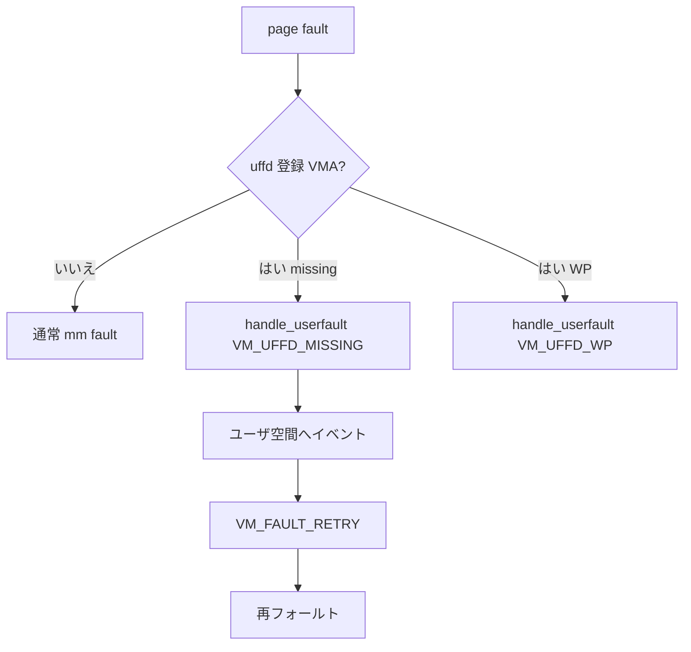

# 第20章 userfaultfd missing と WP

> **本章で読むソース**
>
> - [`fs/userfaultfd.c` L363-L396](https://github.com/gregkh/linux/blob/v6.18.38/fs/userfaultfd.c#L363-L396)
> - [`fs/userfaultfd.c` L425-L431](https://github.com/gregkh/linux/blob/v6.18.38/fs/userfaultfd.c#L425-L431)
> - [`mm/memory.c` L5186-L5189](https://github.com/gregkh/linux/blob/v6.18.38/mm/memory.c#L5186-L5189)
> - [`mm/memory.c` L5235-L5239](https://github.com/gregkh/linux/blob/v6.18.38/mm/memory.c#L5235-L5239)
> - [`mm/memory.c` L4072-L4076](https://github.com/gregkh/linux/blob/v6.18.38/mm/memory.c#L4072-L4076)
> - [`mm/userfaultfd.c` L23-L39](https://github.com/gregkh/linux/blob/v6.18.38/mm/userfaultfd.c#L23-L39)

## この章の狙い

**userfaultfd** がページフォールトをユーザ空間へ委譲するとき、`handle_userfault` と memory.c の分岐がどう接続するかを読む。
KVM live migration など consumer の詳細は仮想化分冊へ委ね、mm 側の missing と write-protect 経路に限定する。

## 前提

- [page-table walk と missing fault](16-page-table-walk-missing-fault.md)
- [write fault と COW](17-write-fault-cow.md)

## handle_userfault の入口

VMA に `vm_userfaultfd_ctx` が無ければ SIGBUS へ落ちる。
`FAULT_FLAG_ALLOW_RETRY` が無い呼び出しは userfault を使えない。

[`fs/userfaultfd.c` L363-L396](https://github.com/gregkh/linux/blob/v6.18.38/fs/userfaultfd.c#L363-L396)

```c
vm_fault_t handle_userfault(struct vm_fault *vmf, unsigned long reason)
{
	struct vm_area_struct *vma = vmf->vma;
	struct mm_struct *mm = vma->vm_mm;
	struct userfaultfd_ctx *ctx;
	struct userfaultfd_wait_queue uwq;
	vm_fault_t ret = VM_FAULT_SIGBUS;
	bool must_wait;
	unsigned int blocking_state;

	/*
	 * We don't do userfault handling for the final child pid update
	 * and when coredumping (faults triggered by get_dump_page()).
	 */
	if (current->flags & (PF_EXITING|PF_DUMPCORE))
		goto out;

	assert_fault_locked(vmf);

	ctx = vma->vm_userfaultfd_ctx.ctx;
	if (!ctx)
		goto out;

	VM_WARN_ON_ONCE(ctx->mm != mm);

	/* Any unrecognized flag is a bug. */
	VM_WARN_ON_ONCE(reason & ~__VM_UFFD_FLAGS);
	/* 0 or > 1 flags set is a bug; we expect exactly 1. */
	VM_WARN_ON_ONCE(!reason || (reason & (reason - 1)));

	if (ctx->features & UFFD_FEATURE_SIGBUS)
		goto out;
	if (!(vmf->flags & FAULT_FLAG_USER) && (ctx->flags & UFFD_USER_MODE_ONLY))
		goto out;
```

## VM_FAULT_RETRY の返却

ユーザ空間 pager が処理するまでフォールトを再試行可能にする。

[`fs/userfaultfd.c` L425-L431](https://github.com/gregkh/linux/blob/v6.18.38/fs/userfaultfd.c#L425-L431)

```c
	/*
	 * Handle nowait, not much to do other than tell it to retry
	 * and wait.
	 */
	ret = VM_FAULT_RETRY;
	if (vmf->flags & FAULT_FLAG_RETRY_NOWAIT)
		goto out;
```

## 匿名 missing fault からの委譲

`userfaultfd_missing` が有効なら、ページ割り当て前に `handle_userfault` へ進む。

[`mm/memory.c` L5186-L5189](https://github.com/gregkh/linux/blob/v6.18.38/mm/memory.c#L5186-L5189)

```c
		if (userfaultfd_missing(vma)) {
			pte_unmap_unlock(vmf->pte, vmf->ptl);
			return handle_userfault(vmf, VM_UFFD_MISSING);
		}
```

割り当て後の再チェックでも同様に missing を返す。

[`mm/memory.c` L5235-L5239](https://github.com/gregkh/linux/blob/v6.18.38/mm/memory.c#L5235-L5239)

```c
	if (userfaultfd_missing(vma)) {
		pte_unmap_unlock(vmf->pte, vmf->ptl);
		folio_put(folio);
		return handle_userfault(vmf, VM_UFFD_MISSING);
	}
```

## write-protect fault からの委譲

`do_wp_page` は uffd-wp PTE を検出すると `VM_UFFD_WP` で userfault へ渡す。

[`mm/memory.c` L4072-L4076](https://github.com/gregkh/linux/blob/v6.18.38/mm/memory.c#L4072-L4076)

```c
		if (userfaultfd_pte_wp(vma, ptep_get(vmf->pte))) {
			if (!userfaultfd_wp_async(vma)) {
				pte_unmap_unlock(vmf->pte, vmf->ptl);
				return handle_userfault(vmf, VM_UFFD_WP);
			}
```

## mm/userfaultfd.c の VMA 検証

mm 側ヘルパは uffd 登録済み VMA かを確認する。

[`mm/userfaultfd.c` L23-L39](https://github.com/gregkh/linux/blob/v6.18.38/mm/userfaultfd.c#L23-L39)

```c
static __always_inline
bool validate_dst_vma(struct vm_area_struct *dst_vma, unsigned long dst_end)
{
	/* Make sure that the dst range is fully within dst_vma. */
	if (dst_end > dst_vma->vm_end)
		return false;

	/*
	 * Check the vma is registered in uffd, this is required to
	 * enforce the VM_MAYWRITE check done at uffd registration
	 * time.
	 */
	if (!dst_vma->vm_userfaultfd_ctx.ctx)
		return false;

	return true;
}
```

## 処理の流れ



## 高速化と最適化の工夫

`VM_FAULT_RETRY` は mmap_lock を手放してユーザ pager が I/O やコピーを行えるようにする。
`userfaultfd_wp_async` は uffd-wp ビット除去だけをカーネル内で済ませ、不要な待ちを省略する。
missing はページ割り当て前後の2箇所でチェックし、競合時の二重割り当てを避ける。

## まとめ

userfaultfd はフォールトをユーザ空間へ渡し、pager がページ内容を提供する。
memory.c の分岐が入口で、`handle_userfault` が待ち行列と再試行を調整する。

## 関連する章

- [write fault と COW](17-write-fault-cow.md)
- [mremap と page-table 移動](14-mremap.md)
- [page-table walk と missing fault](16-page-table-walk-missing-fault.md)
