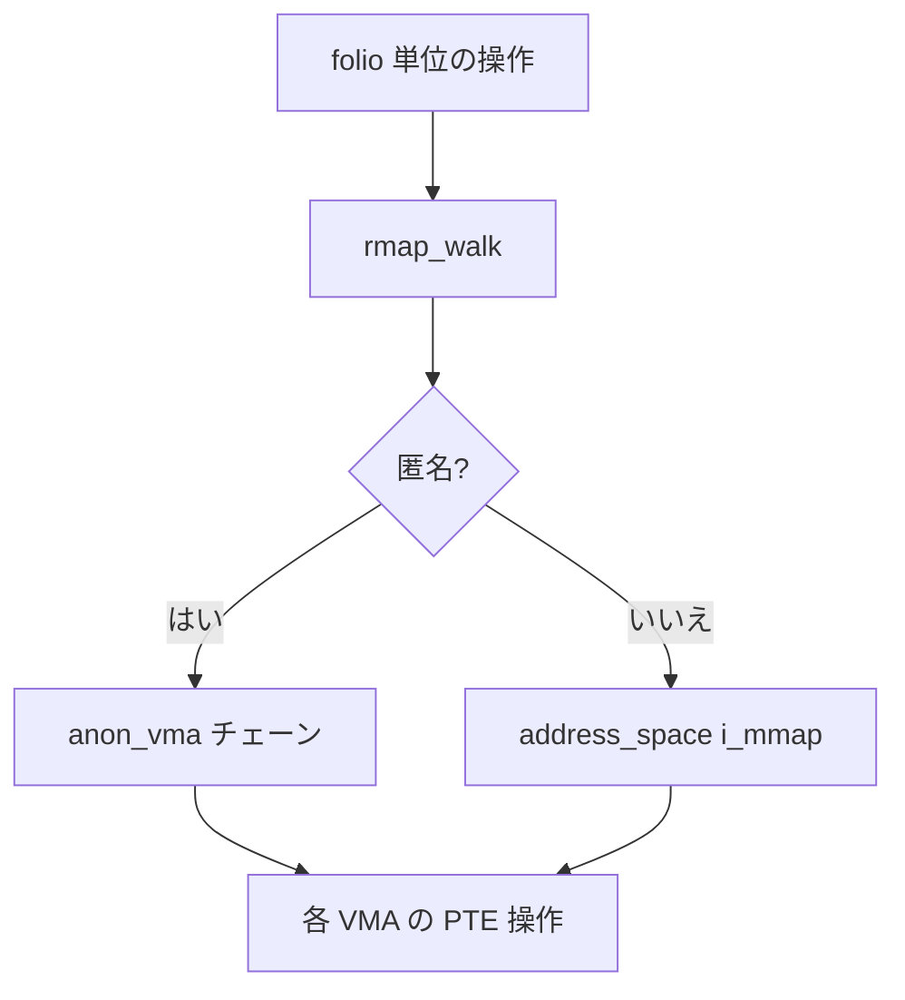

# 第13章 rmap と逆引き

> **本章で読むソース**
>
> - [`mm/rmap.c` L968-L1004](https://github.com/gregkh/linux/blob/v6.18.38/mm/rmap.c#L968-L1004)
> - [`mm/rmap.c` L1248-L1284](https://github.com/gregkh/linux/blob/v6.18.38/mm/rmap.c#L1248-L1284)
> - [`mm/rmap.c` L960-L967](https://github.com/gregkh/linux/blob/v6.18.38/mm/rmap.c#L960-L967)
> - [`include/linux/mm_types.h` L404-L405](https://github.com/gregkh/linux/blob/v6.18.38/include/linux/mm_types.h#L404-L405)
> - [`mm/rmap.c` L976-L982](https://github.com/gregkh/linux/blob/v6.18.38/mm/rmap.c#L976-L982)
> - [`mm/rmap.c` L1285-L1294](https://github.com/gregkh/linux/blob/v6.18.38/mm/rmap.c#L1285-L1294)
> - [`mm/rmap.c` L848-L914](https://github.com/gregkh/linux/blob/v6.18.38/mm/rmap.c#L848-L914)

## この章の狙い

物理 folio から逆に VMA と PTE を辿る **rmap**（reverse mapping）が、回収と参照ビット収集でどう使われるかを読む。

## 前提

- [folio とページ管理単位](../part00-foundation/02-folio-page-unit.md)
- [ページフォールトと handle_mm_fault](../part03-virtual/11-page-fault.md)

## folio_referenced

回収候補の folio が最近参照されたかを、全マッピングを走査して調べる。

[`mm/rmap.c` L960-L1004](https://github.com/gregkh/linux/blob/v6.18.38/mm/rmap.c#L960-L1004)

```c
 * @memcg: target memory cgroup
 * @vm_flags: A combination of all the vma->vm_flags which referenced the folio.
 *
 * Quick test_and_clear_referenced for all mappings of a folio,
 *
 * Return: The number of mappings which referenced the folio. Return -1 if
 * the function bailed out due to rmap lock contention.
 */
int folio_referenced(struct folio *folio, int is_locked,
		     struct mem_cgroup *memcg, vm_flags_t *vm_flags)
{
	bool we_locked = false;
	struct folio_referenced_arg pra = {
		.mapcount = folio_mapcount(folio),
		.memcg = memcg,
	};
	struct rmap_walk_control rwc = {
		.rmap_one = folio_referenced_one,
		.arg = (void *)&pra,
		.anon_lock = folio_lock_anon_vma_read,
		.try_lock = true,
		.invalid_vma = invalid_folio_referenced_vma,
	};

	*vm_flags = 0;
	if (!pra.mapcount)
		return 0;

	if (!folio_raw_mapping(folio))
		return 0;

	if (!is_locked && (!folio_test_anon(folio) || folio_test_ksm(folio))) {
		we_locked = folio_trylock(folio);
		if (!we_locked)
			return 1;
	}

	rmap_walk(folio, &rwc);
	*vm_flags = pra.vm_flags;

	if (we_locked)
		folio_unlock(folio);

	return rwc.contended ? -1 : pra.referenced;
}
```

`try_lock` により回収パスでのデッドロックを避け、競合時は -1 を返す。

## __folio_add_rmap

マップ時に `_mapcount` と large folio 用カウンタを更新する。

[`mm/rmap.c` L1248-L1284](https://github.com/gregkh/linux/blob/v6.18.38/mm/rmap.c#L1248-L1284)

```c
static __always_inline void __folio_add_rmap(struct folio *folio,
		struct page *page, int nr_pages, struct vm_area_struct *vma,
		enum pgtable_level level)
{
	atomic_t *mapped = &folio->_nr_pages_mapped;
	const int orig_nr_pages = nr_pages;
	int first = 0, nr = 0, nr_pmdmapped = 0;

	__folio_rmap_sanity_checks(folio, page, nr_pages, level);

	switch (level) {
	case PGTABLE_LEVEL_PTE:
		if (!folio_test_large(folio)) {
			nr = atomic_inc_and_test(&folio->_mapcount);
			break;
		}

		if (IS_ENABLED(CONFIG_NO_PAGE_MAPCOUNT)) {
			nr = folio_add_return_large_mapcount(folio, orig_nr_pages, vma);
			if (nr == orig_nr_pages)
				/* Was completely unmapped. */
				nr = folio_large_nr_pages(folio);
			else
				nr = 0;
			break;
		}

		do {
			first += atomic_inc_and_test(&page->_mapcount);
		} while (page++, --nr_pages > 0);

		if (first &&
		    atomic_add_return_relaxed(first, mapped) < ENTIRELY_MAPPED)
			nr = first;

		folio_add_large_mapcount(folio, orig_nr_pages, vma);
		break;
```

THP では PMD レベルの `PGTABLE_LEVEL_PMD` 分岐が別途ある。

## folio_referenced_one：PTE の参照ビット走査

`rmap_walk` は各 VMA に対して `folio_referenced_one` を呼ぶ。
ここで `page_vma_mapped_walk` が PTE を辿り、Young ビットをテストしてクリアする。

[`mm/rmap.c` L848-L914](https://github.com/gregkh/linux/blob/v6.18.38/mm/rmap.c#L848-L914)

```c
static bool folio_referenced_one(struct folio *folio,
		struct vm_area_struct *vma, unsigned long address, void *arg)
{
	struct folio_referenced_arg *pra = arg;
	DEFINE_FOLIO_VMA_WALK(pvmw, folio, vma, address, 0);
	int ptes = 0, referenced = 0;

	while (page_vma_mapped_walk(&pvmw)) {
		address = pvmw.address;

		if (vma->vm_flags & VM_LOCKED) {
			ptes++;
			pra->mapcount--;

			/* Only mlock fully mapped pages */
			if (pvmw.pte && ptes != pvmw.nr_pages)
				continue;

			/*
			 * All PTEs must be protected by page table lock in
			 * order to mlock the page.
			 *
			 * If page table boundary has been cross, current ptl
			 * only protect part of ptes.
			 */
			if (pvmw.flags & PVMW_PGTABLE_CROSSED)
				continue;

			/* Restore the mlock which got missed */
			mlock_vma_folio(folio, vma);
			page_vma_mapped_walk_done(&pvmw);
			pra->vm_flags |= VM_LOCKED;
			return false; /* To break the loop */
		}

		/*
		 * Skip the non-shared swapbacked folio mapped solely by
		 * the exiting or OOM-reaped process. This avoids redundant
		 * swap-out followed by an immediate unmap.
		 */
		if ((!atomic_read(&vma->vm_mm->mm_users) ||
		    check_stable_address_space(vma->vm_mm)) &&
		    folio_test_anon(folio) && folio_test_swapbacked(folio) &&
		    !folio_maybe_mapped_shared(folio)) {
			pra->referenced = -1;
			page_vma_mapped_walk_done(&pvmw);
			return false;
		}

		if (lru_gen_enabled() && pvmw.pte) {
			if (lru_gen_look_around(&pvmw))
				referenced++;
		} else if (pvmw.pte) {
			if (ptep_clear_flush_young_notify(vma, address,
						pvmw.pte))
				referenced++;
		} else if (IS_ENABLED(CONFIG_TRANSPARENT_HUGEPAGE)) {
			if (pmdp_clear_flush_young_notify(vma, address,
						pvmw.pmd))
				referenced++;
		} else {
			/* unexpected pmd-mapped folio? */
			WARN_ON_ONCE(1);
		}

		pra->mapcount--;
	}
```

MGLRU 有効時は `lru_gen_look_around` が従来の Young ビット操作の代わりに使われる。

## PMD レベル rmap

[`mm/rmap.c` L1285-L1294](https://github.com/gregkh/linux/blob/v6.18.38/mm/rmap.c#L1285-L1294)

```c
	case PGTABLE_LEVEL_PMD:
	case PGTABLE_LEVEL_PUD:
		first = atomic_inc_and_test(&folio->_entire_mapcount);
		if (IS_ENABLED(CONFIG_NO_PAGE_MAPCOUNT)) {
			if (level == PGTABLE_LEVEL_PMD && first)
				nr_pmdmapped = folio_large_nr_pages(folio);
			nr = folio_inc_return_large_mapcount(folio, vma);
			if (nr == 1)
				/* Was completely unmapped. */
				nr = folio_large_nr_pages(folio);
```

## folio の _mapcount

[`include/linux/mm_types.h` L404-L405](https://github.com/gregkh/linux/blob/v6.18.38/include/linux/mm_types.h#L404-L405)

```c
			atomic_t _mapcount;
			atomic_t _refcount;
```

参照カウントとは独立に、ユーザー映射の数を追う。

## rmap_walk_control

[`mm/rmap.c` L976-L982](https://github.com/gregkh/linux/blob/v6.18.38/mm/rmap.c#L976-L982)

```c
	struct rmap_walk_control rwc = {
		.rmap_one = folio_referenced_one,
		.arg = (void *)&pra,
		.anon_lock = folio_lock_anon_vma_read,
		.try_lock = true,
		.invalid_vma = invalid_folio_referenced_vma,
	};
```

匿名は `anon_vma` 鎖、ファイルは `address_space` の i_mmap ツリーを辿る。

## 処理の流れ



## 高速化と最適化の工夫

anon_vma のフォーク時コピーは重いが、走査は folio 単位に閉じる。
`try_lock` と `contended` 返却で回収ループの停滞を避ける。
THP では entire_mapcount で PMD マッピングを1カウントにまとめる。

## まとめ

rmap は folio から VMA/PTE への逆引き経路である。
`folio_referenced` と unmap 系が主要利用者である。
_mapcount 族はマッピング数を追い、回収の可否判断に使われる。

## 関連する章

- [LRU と MGLRU](../part04-reclaim/14-lru-mglru.md)
- [vmscan と回収経路](15-vmscan-reclaim.md)
