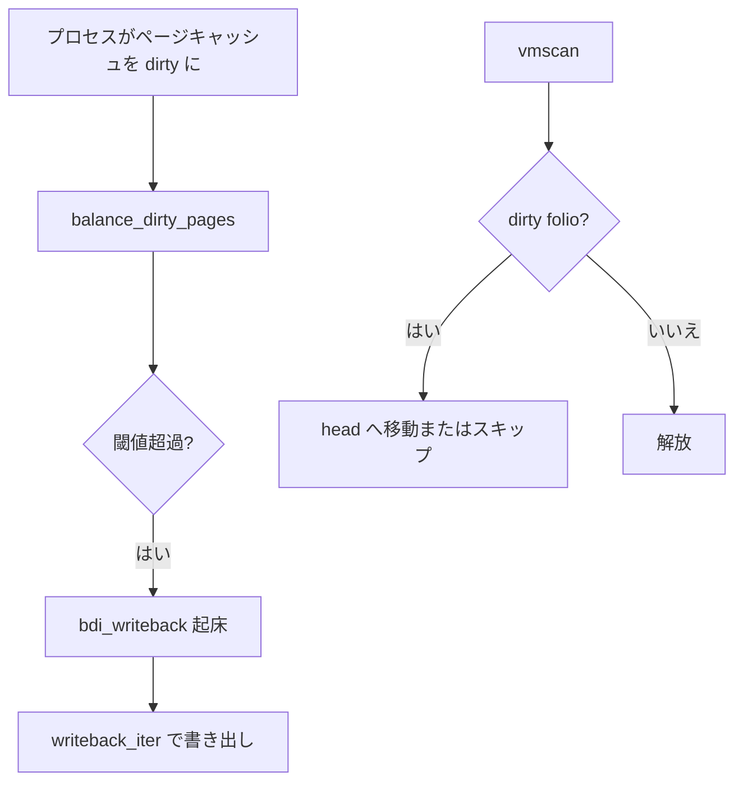

# 第16章 writeback とページキャッシュ回収

> **本章で読むソース**
>
> - [`mm/page-writeback.c` L1810-L1835](https://github.com/gregkh/linux/blob/v6.18.38/mm/page-writeback.c#L1810-L1835)
> - [`mm/page-writeback.c` L1846-L1854](https://github.com/gregkh/linux/blob/v6.18.38/mm/page-writeback.c#L1846-L1854)
> - [`mm/swap.c` L533-L538](https://github.com/gregkh/linux/blob/v6.18.38/mm/swap.c#L533-L538)
> - [`mm/vmscan.c` L6119-L6129](https://github.com/gregkh/linux/blob/v6.18.38/mm/vmscan.c#L6119-L6129)
> - [`include/linux/writeback.h` L362-L363](https://github.com/gregkh/linux/blob/v6.18.38/include/linux/writeback.h#L362-L363)
> - [`mm/page-writeback.c` L1805-L1809](https://github.com/gregkh/linux/blob/v6.18.38/mm/page-writeback.c#L1805-L1809)
> - [`mm/page-writeback.c` L1855-L1883](https://github.com/gregkh/linux/blob/v6.18.38/mm/page-writeback.c#L1855-L1883)

## この章の狙い

dirty ページキャッシュの **writeback**（ライトバック）が回収とどう連動し、vmscan が dirty folio をどう扱うかを読む。
VFS 分冊の詳細は最小限にし、mm 側の dirty 制限に焦点を当てる。

## 前提

- [vmscan と回収経路](15-vmscan-reclaim.md)
- [LRU と MGLRU](14-lru-mglru.md)

## balance_dirty_pages

プロセスが dirty ページを増やしすぎないよう、書き込み側をスロットルする。

[`mm/page-writeback.c` L1805-L1835](https://github.com/gregkh/linux/blob/v6.18.38/mm/page-writeback.c#L1805-L1835)

```c
 * data.  It looks at the number of dirty pages in the machine and will force
 * the caller to wait once crossing the (background_thresh + dirty_thresh) / 2.
 * If we're over `background_thresh' then the writeback threads are woken to
 * perform some writeout.
 */
static int balance_dirty_pages(struct bdi_writeback *wb,
			       unsigned long pages_dirtied, unsigned int flags)
{
	struct dirty_throttle_control gdtc_stor = { GDTC_INIT(wb) };
	struct dirty_throttle_control mdtc_stor = { MDTC_INIT(wb, &gdtc_stor) };
	struct dirty_throttle_control * const gdtc = &gdtc_stor;
	struct dirty_throttle_control * const mdtc = mdtc_valid(&mdtc_stor) ?
						     &mdtc_stor : NULL;
	struct dirty_throttle_control *sdtc;
	unsigned long nr_dirty;
	long period;
	long pause;
	long max_pause;
	long min_pause;
	int nr_dirtied_pause;
	unsigned long task_ratelimit;
	unsigned long dirty_ratelimit;
	struct backing_dev_info *bdi = wb->bdi;
	bool strictlimit = bdi->capabilities & BDI_CAP_STRICTLIMIT;
	unsigned long start_time = jiffies;
	int ret = 0;

	for (;;) {
		unsigned long now = jiffies;

		nr_dirty = global_node_page_state(NR_FILE_DIRTY);
```

`NR_FILE_DIRTY` は回収対象 file LRU と連動する。

## background writeback の起床

閾値超過時は `wb_start_background_writeback` で flusher スレッドを起こす。
laptop mode では通常モードと起床条件が異なる。

[`mm/page-writeback.c` L1855-L1883](https://github.com/gregkh/linux/blob/v6.18.38/mm/page-writeback.c#L1855-L1883)

```c
		if (!laptop_mode && nr_dirty > gdtc->bg_thresh &&
		    !writeback_in_progress(wb))
			wb_start_background_writeback(wb);

		/*
		 * If memcg domain is in effect, @dirty should be under
		 * both global and memcg freerun ceilings.
		 */
		if (gdtc->freerun && (!mdtc || mdtc->freerun)) {
			unsigned long intv;
			unsigned long m_intv;

free_running:
			intv = domain_poll_intv(gdtc, strictlimit);
			m_intv = ULONG_MAX;

			current->dirty_paused_when = now;
			current->nr_dirtied = 0;
			if (mdtc)
				m_intv = domain_poll_intv(mdtc, strictlimit);
			current->nr_dirtied_pause = min(intv, m_intv);
			break;
		}

		/* Start writeback even when in laptop mode */
		if (unlikely(!writeback_in_progress(wb)))
			wb_start_background_writeback(wb);

		mem_cgroup_flush_foreign(wb);
```

`freerun` 域内ならプロセスを止めず、poll 間隔だけ更新して抜ける。

## laptop mode と background writeback

[`mm/page-writeback.c` L1846-L1854](https://github.com/gregkh/linux/blob/v6.18.38/mm/page-writeback.c#L1846-L1854)

```c
		/*
		 * In laptop mode, we wait until hitting the higher threshold
		 * before starting background writeout, and then write out all
		 * the way down to the lower threshold.  So slow writers cause
		 * minimal disk activity.
		 *
		 * In normal mode, we start background writeout at the lower
		 * background_thresh, to keep the amount of dirty memory low.
		 */
```

## 回収時の dirty folio 扱い

invalidate できない dirty folio は inactive 先頭へ移し、flusher に時間を与える。

[`mm/swap.c` L533-L538](https://github.com/gregkh/linux/blob/v6.18.38/mm/swap.c#L533-L538)

```c
 * If the folio cannot be invalidated, it is moved to the
 * inactive list to speed up its reclaim.  It is moved to the
 * head of the list, rather than the tail, to give the flusher
 * threads some time to write it out, as this is much more
 * effective than the single-page writeout from reclaim.
```

## kswapd と writeback レート

[`mm/vmscan.c` L6119-L6129](https://github.com/gregkh/linux/blob/v6.18.38/mm/vmscan.c#L6119-L6129)

```c
	if (current_is_kswapd()) {
		/*
		 * If reclaim is isolating dirty pages under writeback,
		 * it implies that the long-lived page allocation rate
		 * is exceeding the page laundering rate. Either the
		 * global limits are not being effective at throttling
		 * processes due to the page distribution throughout
		 * zones or there is heavy usage of a slow backing
		 * device. The only option is to throttle from reclaim
		 * context which is not ideal as there is no guarantee
		 * the dirtying process is throttled in the same way
```

回収が dirty を isolate し続けるのは、ライトバックが追いついていない信号である。

## writeback_iter

[`include/linux/writeback.h` L362-L363](https://github.com/gregkh/linux/blob/v6.18.38/include/linux/writeback.h#L362-L363)

```c
struct folio *writeback_iter(struct address_space *mapping,
		struct writeback_control *wbc, struct folio *folio, int *error);
```

ファイルシステムは mapping 単位で dirty folio を列挙し、ディスクへ書き出す。

## 処理の流れ



## 高速化と最適化の工夫

dirty スロットルは **書き込み側でメモリ圧力を先回り** し、回収ループでの単ページ writeout を減らす。
laptop mode はディスク起動回数を抑え、通常モードは dirty 量を低く保つ。
回収は dirty folio を即解放せず、ライトバックスレッドに仕事を譲る。

## まとめ

writeback は dirty ページキャッシュをディスクへ追い出す。
`balance_dirty_pages` がプロセスを止め、vmscan は dirty folio を慎重に扱う。
file LRU 回収は clean 化された folio で初めて安価になる。

## 関連する章

- [vmscan と回収経路](15-vmscan-reclaim.md)
- VFS 分冊（計画中）の writeback 節
